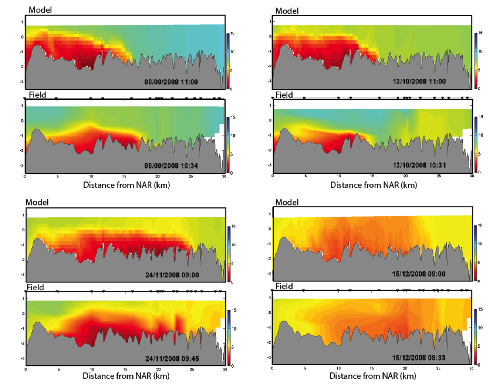

# Dissolved Oxygen {#DO_1 }

## Contributors

Matthew Hipsey & Peisheng Huang

## Overview

Dissolved Oxygen ($DO$ or $O_2$) is considered to be one of the most important indicators of aquatic ecosystem conditions and is commonly used in models of water quality. Eutrophication and climate change pressures are exacerbating issues of hypoxia and anoxia in waters, ranging from small wetlands, lakes, and the coastal ocean.

$O_2$ dynamics respond to processes of atmospheric exchange, sediment oxygen demand, microbial respiration during organic matter mineralisation and nitrification, photosynthetic oxygen production and respiratory oxygen consumption, chemical oxygen demand, and respiration by other biotic components such as seagrass and bivalves.

The $\mathrm{AED}$ oxygen module is suitable for a wide range of waterbody types, from ponds and wetlands, to lakes estuaries and the coastal ocean.

## Model Description

This module supports one state variable to capture the oxygen concentration, $O_2$. The module is a low-level module that supports the two core processes of air-water exchange, $\check{f}_{atm}^{O_2}$, and sediment-water exchange, $\hat{f}_{sed}^{O_2}$, and is designed to be linked to by other modules that interact with oxygen. The dynamics of $O_2$ can therefore be summarised as:

\begin{eqnarray}
\frac{D}{Dt}O_2 =  \color{darkgray}{ \mathbb{M} + \mathcal{S} } \quad
&+&   \overbrace{\check{f}_{atm}^{O_2}+\hat{f}_{sed}^{O_2}}^\text{aed_oxygen} \\ (\#eq:oxy1)
&-& \color{brown}{ f_{min}^{DOC} - f_{nitrf}^{NH_4} - f_{ch4ox}^{CH_4} - f_{h2sox}^{H_2S} - f_{feox}^{FeII} } \\ \nonumber
&+& \color{brown}{ f_{gpp}^{PHY}	- f_{rsp}^{PHY} - f_{rsp}^{ZOO} + \hat{f}_{gpp}^{MAC} - \hat{f}_{rsp}^{MAC} + f_{gpp}^{MAG} - f_{rsp}^{MAG} - \hat{f}_{rsp}^{BIV} } \\ \nonumber
\end{eqnarray}

where $\mathbb{M}$ and $\mathcal{S}$ refer to water mixing and boundary source terms, respectively, and the coloured $\color{brown}{f}$ terms reflect the optionally configurable contributions from other modules; these include the breakdown of $DOC$ by aerobic heterotrophic bacteria to $CO_2$, whereby a stoichiometrically equivalent amount of oxygen is removed, chemical oxidation reactions, such as nitrification or sulfide oxidation, photosynthetic oxygen production and respiratory consumption by phytoplankton, and also oxygen consumed and produced by any benthic biological groups.

### Process Descriptions

<!-- previously from 'aed2_oxygen : oxygen solubility & atmospheric exchange' on website version-->
#### Oxygen solubility & atmospheric exchange {-}
Atmospheric exchange is typically modelled based on Wanninkhof (1992) and the flux equation of Riley and Skirrow (1974) for the open water, and on Ho et al. (2011) for estuarine environments. The instantaneous flux at the air-water interface, $\mathcal{F}_{atm}^{O_2}$, depends on the oxygen gradient between the air and water and the gas transfer or piston velocity, $k_{piston}$ $(m/s)$ :
\begin{equation}
								\mathcal{F}_{atm}^{O_2} = k_{piston}^{O_2} \left({O_2}_{air} - {O_2}_{s}\right) (\#eq:oxy2)
\end{equation}
where ${O_2}_{s}$ is the oxygen concentration in the surface waters near the air-water interface and $C_{air}$ is the concentration of oxygen in the air phase near the interface ($mmol$ $O_2/m^3$). A positive flux represents input of oxygen from the atmosphere to the water. ${O_2}_{air}$ is dependent on temperature, $T$, salinity, $S$ and atmospheric pressure, $p$, as given by:
\begin{eqnarray}
							{O_2}_{air}\left[T,S,p \right]
							&=& \tfrac{32}{1000} \: 1.42763 \: \Phi_{p}^{atm} \\
							&\times&\exp \left\{ -173.4292+249.6339 \left[\tfrac{100}{T_K}\right] + 143.3483 \ln \left[ \tfrac{T_K}{100}\right] - 21.8492 \left[\tfrac{T_K}{100}\right] \right. \nonumber \\
							&+& \left. S\left(-0.033096 +0.014259 \left[\tfrac{T_K}{100}\right] -0.0017 \left[\tfrac{T_K}{100}\right]^2 \right) \right\}
							(\#eq:oxy3)
\end{eqnarray}
where $T_K$ is temperature in degrees Kelvin, salinity is expressed as parts per thousand and atmospheric pressure is in kPa. The pressure correction function, $\Phi_{p}^{atm}$ varies between one and zero for the surface and high altitudes respectively:
\begin{equation}
							\Phi_{p}^{atm}[p]=\frac{p_H}{p_{SL}}\left[1-\frac{p_{vap}}{p_H}\right]/\left[1-\frac{p_{vap}}{p_{SL}}\right].
(\#eq:oxy4)
\end{equation}
where $p_H$ and $p_{SL}$ is the pressure at the altitude of the simulation domain ($H$) and at sea level, respectively.

As $\mathrm{AED}$ can be applied across many types of environments, spanning the ocean to small lakes and flowing waters, users can select from a range of $k_{piston}$ options, or implement their own, to capture this process. The options of $k$ methods are listed in the [Gas Transfer] section of Chapter 30.

Once the exchange flux is computed it is applied to the surface cells of the simulated domain, and the change in the $O_2$ concentration in the surface layer is:

\begin{equation}
\check{f}_{atm}^{O_2} = \frac{\mathcal{F}_{atm}^{O_2}}{\Delta z_{surf}}                          
(\#eq:oxy5)
\end{equation}
where $\Delta z_{surf}$ is the surface layer thickness.

#### Sediment oxygen demand {-}
Modelling sediment oxygen demand ($SOD$) can take a variety of forms. The simplest form in AED is the "static" model whereby $SOD$ varies as a function of the overlying water temperature and bottom water dissolved oxygen concentration:
\begin{equation}
  \mathcal{F}_{sed}^{O_2}[T,O_2] = F_{sed}^{oxy} \: \theta_{sod}^{T-20} \: \Phi_{sod}^{oxy}\left[O_2\right]
	(\#eq:oxy6)
\end{equation}
where $F_{sed}^{oxy}$ is the maximum oxygen flux across the sediment-water interface at $20^{\circ}C$. The oxygen limitation is computed based on:

\begin{equation}
\Phi_{sod}^{oxy}\left[O_2\right]=\frac{O_2}{K_{sod}^{oxy}+O_2}
(\#eq:oxy7)
\end{equation}

where $K_{sod}^{oxy}$ is the half-saturation constant controlling the sediment oxygen demand. Once the exchange flux is computed it is applied to the bottom cells of the simulated domain, and the change in the $O_2$ concentration in the bottom layer is:

\begin{equation}
\hat{f}_{sed}^{O_2} = \frac{\mathcal{F}_{sed}^{O_2}}{\Delta z_{bot}}                          
(\#eq:oxy8)
\end{equation}
where $\Delta z_{bot}$ is the bottom layer thickness.

**Spatially variable sediment fluxes**: The approach described above is the most simple and default method for capturing oxygen fluxes into the sediment, and is referred to as the static model. This approach can be extended to allow for spatial variability in $F_{sed}^{oxy}$ by engaging the link to the `aed_sedflux` module, where the host models support multiple benthic cells or zones. In this case, users input spatially discrete values of $F_{sed}^{oxy}$.

**Dynamically varying sediment flux rates**: Where dynamic rates of $O_2$ are required to flux to the sediment (e.g. in response to episodic loading of organic material to the sediment, or for assessment of long-term changes in sediment quality), then the above expressions may be replaced instead with dynamically calculated variables in `aed_seddiagenesis` via a link created with the `aed_sedflux` module.


### Optional Module Links

Other oxygen sources/sinks are indicated in Eq \@ref(eq:oxy1). These include:

- Oxygen consumption during bacterial mineralisation of DOC is done in the organic matter module - aed_organic_matter;
- Oxygen consumption during nitrification is done in the nitrogen module - [aed_nitrogen][Inorganic Nutrients: C/N/P/Si];
- Oxygen production/consumption by phytoplankton phtosynthesis/respiration is done in the phytoplankton module - [aed_phytoplankton][Phytoplankton];
- Oxygen consumption due to zooplankton respiration is done in the zooplankton module - [aed_zooplankton][Zooplankton];
- Oxygen production/consumption by seagrass phtosynthesis/respiration is done in the macrophyte module - aed_macrophyte;
- Oxygen consumption due to bivalve respiration is done in the benthic module - [aed_bivalve][Benthic Vegetation];


### Feedbacks to the Host Model
The oxygen module has no feedbacks to the host hydrodynamic model.


### Variable Summary

The default variables created by this module, and the optionally required linked variables needed for full functionality of this module are summarised in Table \@ref(tab:10-statetable). The diagnostic outputs able to be output are summarised in Table \@ref(tab:10-diagtable).

#### State variables {-}


```{r 10-statetable, echo=FALSE, message=FALSE, warning=FALSE}
library(knitr)
library(kableExtra)
library(readxl)
library(rmarkdown)
theSheet <- read_excel('tables/carbonTableNewGrouping.xlsx', sheet = 4)
theSheet <- theSheet[theSheet$Table == "State variable",]
theSheetGroups <- unique(theSheet$Group)
theSheet$`AED name` <- paste0("`",theSheet$`AED name`,"`")

for(i in seq_along(theSheet$Symbol)){
  if(!is.na(theSheet$Symbol[i])==TRUE){
    theSheet$Symbol[i] <- paste0("$$",theSheet$Symbol[i],"$$")
  } else {
    theSheet$Symbol[i] <- NA
  }
}
for(i in seq_along(theSheet$Unit)){
  if(!is.na(theSheet$Unit[i])==TRUE){
    theSheet$Unit[i] <- paste0("$$\\small{",theSheet$Unit[i],"}$$")
  } else {
    theSheet$Unit[i] <- NA
  }
}
for(i in seq_along(theSheet$Comments)){
  if(!is.na(theSheet$Comments[i])==TRUE){
    theSheet$Comments[i] <- paste0("",theSheet$Comments[i],"")
  } else {
    theSheet$Comments[i] <- " "
  }
}

kbl(theSheet[,3:NCOL(theSheet)], caption = "Oxygen - state variables", align = "l",) %>%
  pack_rows(theSheetGroups[1],
            min(which(theSheet$Group == theSheetGroups[1])),
            max(which(theSheet$Group == theSheetGroups[1])),
            background = '#ebebeb') %>%
  pack_rows(theSheetGroups[2],
            min(which(theSheet$Group == theSheetGroups[2])),
            max(which(theSheet$Group == theSheetGroups[2])),
            background = '#ebebeb') %>%
  row_spec(0, background = "#14759e", bold = TRUE, color = "white") %>%
	kable_styling(full_width = F,font_size = 11) %>%
	column_spec(2, width_min = "7em") %>%
	column_spec(3, width_max = "18em") %>%
	column_spec(4, width_min = "10em") %>%
	column_spec(5, width_min = "5em") %>%
	column_spec(7, width_min = "10em") %>%
	column_spec(7, width_max = "20em") %>%
  scroll_box(width = "770px", height = "200px",
             fixed_thead = FALSE)
```


#### Diagnostics{-}


```{r 10-diagtable, echo=FALSE, message=FALSE, warning=FALSE}
library(knitr)
library(kableExtra)
library(readxl)
library(rmarkdown)
theSheet <- read_excel('tables/carbonTableNewGrouping.xlsx', sheet = 4)
theSheet <- theSheet[theSheet$Table == "Diagnostics",]
theSheetGroups <- unique(theSheet$Group)
theSheet$`AED name` <- paste0("`",theSheet$`AED name`,"`")

for(i in seq_along(theSheet$Symbol)){
  if(!is.na(theSheet$Symbol[i])==TRUE){
    theSheet$Symbol[i] <- paste0("$$",theSheet$Symbol[i],"$$")
  } else {
    theSheet$Symbol[i] <- NA
  }
}
for(i in seq_along(theSheet$Unit)){
  if(!is.na(theSheet$Unit[i])==TRUE){
    theSheet$Unit[i] <- paste0("$$\\small{",theSheet$Unit[i],"}$$")
  } else {
    theSheet$Unit[i] <- NA
  }
}
for(i in seq_along(theSheet$Comments)){
  if(!is.na(theSheet$Comments[i])==TRUE){
    theSheet$Comments[i] <- paste0("",theSheet$Comments[i],"")
  } else {
    theSheet$Comments[i] <- " "
  }
}

kbl(theSheet[,3:NCOL(theSheet)], caption = "Oxygen - *diagnostic* variables", align = "l",) %>%
  pack_rows(theSheetGroups[1],
            min(which(theSheet$Group == theSheetGroups[1])),
            max(which(theSheet$Group == theSheetGroups[1])),
            background = '#ebebeb') %>%
  pack_rows(theSheetGroups[2],
            min(which(theSheet$Group == theSheetGroups[2])),
            max(which(theSheet$Group == theSheetGroups[2])),
            background = '#ebebeb') %>%
	pack_rows(theSheetGroups[3],
						min(which(theSheet$Group == theSheetGroups[3])),
						max(which(theSheet$Group == theSheetGroups[3])),
						background = '#ebebeb') %>%row_spec(0, background = "#14759e", bold = TRUE, color = "white") %>%
  kable_styling(full_width = F,font_size = 11) %>%
            column_spec(2, width_min = "7em") %>%
	          column_spec(3, width_max = "18em") %>%
	          column_spec(4, width_min = "10em") %>%
	          column_spec(5, width_min = "6em") %>%
						column_spec(7, width_min = "10em") %>%
	          scroll_box(width = "770px", height = "305px",
            fixed_thead = FALSE)
```

<br>

### Parameter Summary

The parameters and settings used by this module are summarised in Table \@ref(tab:10-parstable).


```{r 10-parstable, echo=FALSE, message=FALSE, warning=FALSE}
library(knitr)
library(kableExtra)
library(readxl)
library(rmarkdown)
theSheet <- read_excel('tables/carbonTableNewGrouping.xlsx', sheet = 4)
theSheet <- theSheet[theSheet$Table == "Parameter",]
theSheetGroups <- unique(theSheet$Group)
theSheet$`AED name` <- paste0("`",theSheet$`AED name`,"`")

for(i in seq_along(theSheet$Symbol)){
  if(!is.na(theSheet$Symbol[i])==TRUE){
    theSheet$Symbol[i] <- paste0("$$",theSheet$Symbol[i],"$$")
  } else {
    theSheet$Symbol[i] <- " "
  }
}
for(i in seq_along(theSheet$Unit)){
  if(!is.na(theSheet$Unit[i])==TRUE){
    theSheet$Unit[i] <- paste0("$$\\small{",theSheet$Unit[i],"}$$")
  } else {
    theSheet$Unit[i] <- NA
  }
}
for(i in seq_along(theSheet$Comments)){
  if(!is.na(theSheet$Comments[i])==TRUE){
    theSheet$Comments[i] <- paste0("",theSheet$Comments[i],"")
  } else {
    theSheet$Comments[i] <- "-"
  }
}

kbl(theSheet[,3:NCOL(theSheet)], caption = "Oxygen module parameters and configuration options", align = "l",) %>%
  pack_rows(theSheetGroups[1],
            min(which(theSheet$Group == theSheetGroups[1])),
            max(which(theSheet$Group == theSheetGroups[1])),
            background = '#ebebeb') %>%
  pack_rows(theSheetGroups[2],
            min(which(theSheet$Group == theSheetGroups[2])),
            max(which(theSheet$Group == theSheetGroups[2])),
            background = '#ebebeb') %>%
  pack_rows(theSheetGroups[3],
					  min(which(theSheet$Group == theSheetGroups[3])),
					  max(which(theSheet$Group == theSheetGroups[3])),
					  background = '#ebebeb') %>%
  row_spec(0, background = "#14759e", bold = TRUE, color = "white") %>%
  kable_styling(full_width = F,font_size = 11) %>%
	column_spec(2, width_min = "7em") %>%
	column_spec(3, width_max = "19em") %>%
	column_spec(4, width_min = "10em") %>%
	column_spec(5, width_min = "5em") %>%
	column_spec(7, width_min = "10em") %>%
  scroll_box(width = "770px", height = "500px",
             fixed_thead = FALSE)
```
<br>


## Setup & Configuration

An example `aed.nml` parameter specification block for the `aed_oxygen` module is shown below:
```{}
&aed_oxygen
   oxy_initial       = 250.0
	 oxy_min           =   0
   oxy_max           = 500
   Fsed_oxy          = -40.0
   Ksed_oxy          = 100.0
   theta_sed_oxy     =   1.08
!  Fsed_oxy_variable = 'SDF_Fsed_oxy'
!  altitide          = 1000  
 /
```

Note that when users link `Fsed_oxy_variable` then `Fsed_oxy` is not required as this parameter will be set for each each sediment zone from values input via the `aed_sedflux` module. The entries `oxy_min` and `oxy_max` are optional.

## Case Studies & Examples

### Case Study: Swan-Canning Estuary

The Swan-Canning Estuary in Western Australia experiences hypoxia and anoxia due to the strong salt-wedge that forms within the system, and the high sediment oxygen demand. Huang et al. (2018) used the `aed_oxygen` model with the TUFLOW-FV hydrodynamic model to captured the large spatio-temporal variability in oxygen distribution.

<br>

<center>
```{r echo=FALSE, message=FALSE, warning=FALSE, width = 501, height = 385}
library(leaflet)
leaflet(height=385, width=500) %>%
  setView(lng = 115.835235, lat = -31.991618, zoom = 11) %>%
  addTiles() %>%
  addMarkers(lng = 115.835235, lat = -31.991618, popup = "Swan River")
```
</center>

<br>

Using spatial zones with different values of `Fsed_oxy`, the simulations show very high accuracy in resolving the "dome" of low oxygen associated with the salt-wedge.

<br>

<center>

{width=75%}

</center>

The results of the model were integrated over the length of the modelled domain to demonstrate the model's performance in capturing the system-scale areal extent of hypoxia ($O_2<4\:mg/L$) and anoxia ($O_2<2\:mg/L$). Huang et al. (2018) also used the validated model to explore different remediation options based on artificial oxygenation inputs.

<center>

{width=75%}

</center>

### Publications


```{r echo=FALSE, message=FALSE, warning=FALSE}
library(gt)
library(tidyverse)
library(kableExtra)
library(rmarkdown)

aed <- read.csv("tables/10-oxygen/oxy_pubs.csv", check.names=FALSE)

aed %>%
  gt() %>%
  tab_options(container.height = px(500),
              container.width = pct(100),
              table.width = pct(100),
              container.overflow.y = TRUE,
              container.overflow.x = TRUE,
              table.font.size = 12,
              column_labels.background.color = "#14759e",
              row_group.background.color = "lightgrey",
              column_labels.font.weight = "bold",
              column_labels.font.size = 14) %>%
  fmt_markdown(columns = everything())


```
