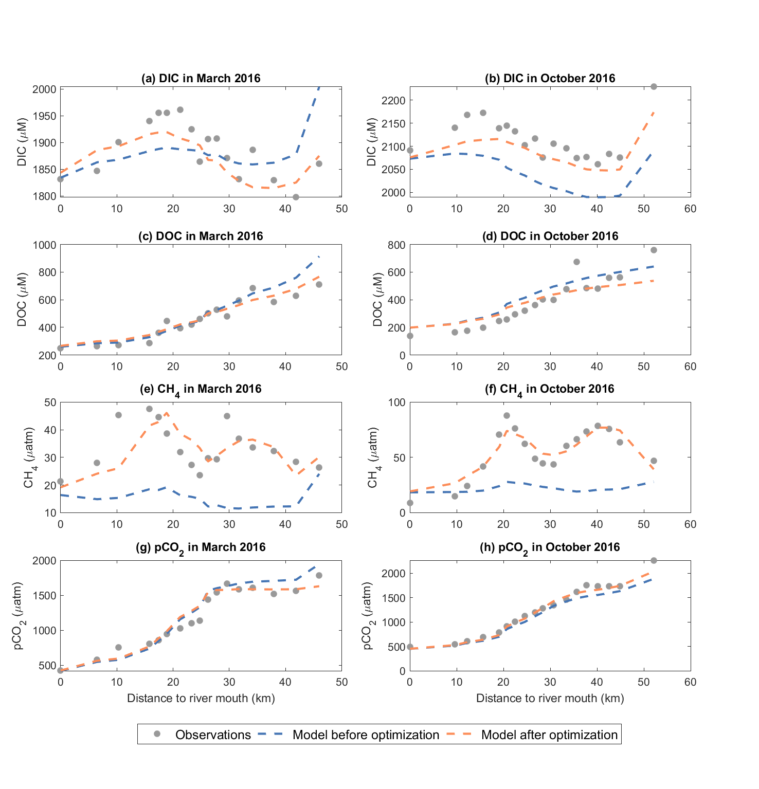

# Inorganic Carbon {#Carbon_1}

## Contributors

Peisheng Huang, Kamilla Kurucz, and Matthew R. Hipsey

## Overview

Understanding carbon cycling is central to understanding food webs and how aquatic communities are structured and supported (Dodds and Whiles, 2010). Exchange of carbon between aquatic systems and the atmosphere is also fundamental in influencing climate (e.g. Cai, 2011; Borges and Abril, 2012). Accordingly, there are a wide range of applications that require simulation of carbon species.

The $\mathrm{AED}$ library can be used to simulate both the organic and inorganic pools of carbon. As carbon is a core building block of an aquatic ecosystem, `aed_carbon` ($\mathrm{CAR}$) is designed as a low-level module for managing inorganic carbon pools, and is able to be linked to by higher level modules associated with organic matter cycling, primary production, and other biotic groups. In particular, organic carbon is the currency of energy exchange through food webs, and the processes for modelling organic carbon are described in [aed_organic_matter][Organic Matter]. This chapter presents the forms of inorganic carbon and fluxes of carbon in the aquatic environment and how they are modelled in the `aed_carbon` module

## Model Description

The core variables included in the aed_carbon module are Dissolved Inorganic Carbon (DIC) and methane (CH4).

The dynamics for DIC is captured in the model when `simDIC = .true.`. The rate of change of DIC concentration as it moves with the water is calculated from local effects associated with air-water exchange ($\check{f}_{atm}^{CO_2}$), oxidation of CH4, ($f_{ox}^{CH_4}$), and sediment-water exchange ($\hat{f}_{sed}^{DIC}$), which is summarized as:

\begin{eqnarray}
\frac{D}{Dt}DIC =  \color{darkgray}{ \mathbb{M} + \mathcal{S} } \quad
&+&   \overbrace{\check{f}_{atm}^{CO_2}+f_{ox}^{CH_4}+\hat{f}_{sed}^{DIC}  }^\text{aed_carbon} \\ (\#eq:car1)
&+& \color{brown}{ f_{min}^{DOC} - f_{gpp}^{PHY} + f_{rsp}^{PHY} + f_{rsp}^{ZOO} } \\ \nonumber
&-& \color{brown}{ \hat{f}_{gpp}^{MAC} + \hat{f}_{rsp}^{MAC} - f_{gpp}^{MAG} - f_{rsp}^{MAG} + \hat{f}_{rsp}^{BIV} } \\ \nonumber
\end{eqnarray}

where $\mathbb{M}$ and $\mathcal{S}$ refer to water mixing and boundary source terms, respectively, and the coloured $\color{brown}{f}$ terms reflect DIC fluxes computed by other (optionally) linked modules such as modules of organic matter ($\mathrm{OMG}$), phytoplankton ($\mathrm{PHY}$) or zooplankton ($\mathrm{ZOO}$).

The dynamics for CH4 is captured in the model when `simCH4 = .true.`. CH4 is formed during the decomposition of organic material by microbial methanogenesis (e.g., Cicerone and Oremland, 1988), which requires strictly anaerobic conditions and is therefore usually restricted to be deep within aquatic sediment. Inputs to the water therefore are from sediment CH4 production, which can enter the water column either as a dissolved flux or via ebullition (bubble release), or from external sources such as wastewater discharges. Once in the water, dissolved CH4 is the balance between inputs from the sediment and losses from air-water exchange and CH4 oxidation to DIC.

The rate of change of CH4 concentration as it moves with the water is therefore calculated as:

\begin{eqnarray}
\frac{D}{Dt}CH_4 =  \color{darkgray}{ \mathbb{M} + \mathcal{S} } \quad
&+&   \overbrace{\check{f}_{atm}^{CH_4}-f_{ox}^{CH_4}+\hat{f}_{sed}^{CH_4} +f_{dis}^{CH_{4-bubble}} }^\text{aed_carbon} \\ (\#eq:car2)
\end{eqnarray}

where $\check{f}_{atm}^{CH_4}$ is the air-water exchange of dissolved methane and $\hat{f}_{sed}^{CH_4}$  is the sediment diffusive release flux. Bubbles moving through the water column after release from the sediment can also dissolve, denoted $f_{dis}^{CH_{4-bubble}}$.

The details of how each flux relevant to DIC and CH4 is calculated, and the associated parameter settings, are described in the next sections. For details on how to model organic carbon refer to the aed_organic_matter model.


###	Process Descriptions

#### Carbonate buffering and pH

In most circum-neutral waters the carbonate buffer system controls the pH conditions within the water. When CO2 within the atmosphere ($CO_{2(gas)}$) is dissolved in water, it can exist in a variety of forms. Initially, carbon dioxide will dissolve, $CO_{2_{(aq)}}$, which can then form carbonic acid, $H_2CO_3$, and dissociate into bicarbonate, $HCO_3^-$, and carbonate, $CO_3^{2-}$, ions.

\begin{eqnarray}
CO_{2_{(aq)}} &\rightleftharpoons& CO_{2_{(gas)}}
\\
CO_{2_{(aq)}} + H_2O &\rightleftharpoons& H_2CO_3
\\
H_2CO_3 &\rightleftharpoons& H^+ + HCO_3^-
\\
HCO_3^- &\rightleftharpoons& H^+ + CO_3^{2-}
\end{eqnarray}

<center>
```{r carbonPlotly, echo=FALSE, message=FALSE, warning=FALSE}
library(seacarb)
library(plotly)
pH <- seq(2, 12, by = 0.1)
res <- speciation(K1(), K2(), NULL, pH, 1)

df <- as.data.frame(res)

plot_ly(df, x = pH) %>%
  add_trace(y = ~C1, name = 'CO<sub>2</sub>', mode = 'lines', line = list(color = '#FF2500')) %>%
  add_trace(y = ~C2, name = 'HCO<sub>3</sub><sup>-</sup>', mode = 'lines', line = list(color = '#01A08A',dash = 'dash')) %>%
  add_trace(y = ~C3, name = 'CO<sub>3</sub><sup>2-</sup>', mode = 'lines', line = list(color = '#F2AD00',dash = 'dot')) %>%
  add_trace(x=c(5.84717, 5.84717), y=c(-0.5, 1.5), mode="lines", name='pK1', opacity = 0.75, line = list(color = 'grey', width = 1.5)) %>%
  add_trace(x=c(8.96592, 8.96592), y=c(-0.5, 1.5), mode="lines", name='pK2', opacity = 0.75, line = list(color = 'grey', width = 1.5)) %>%
  layout(title = "<b>DIC speciation</b>",
      xaxis = list(title = "pH", fixedrange = TRUE),
      yaxis = list(title = "Relative concentration (%)", fixedrange = TRUE, range = c(0,1)),
      margin = list(
         l = 50,
         r = 50,
         b = 50,
         t = 50,
         pad = 4
       )) %>%
  config(displayModeBar = FALSE)
```
</center>

The sum of the concentrations of all these forms is the inorganic carbon concentration (DIC), and the composition of these forms depends on acidity (pH). The total $DIC$ state variable is the sum of carbonate species in a water parcel, which is conservative with respect to hydrodynamics:

\begin{equation}
DIC = [CO_{3}^{2-}]+[HCO_{3}^{-}]+[CO_{2}]+[H_2CO_{3}].
\label{eq:DIC}
\end{equation}


To capture the interaction between carbonate species that make up DIC, each cell is treated as a closed system, as in a titration, where fluxes into and out of the system are specified, such as fluxes due to respiration, dissolved sediment fluxes, or atmospheric exchange. The changes due to these fluxes alter the CO_(2(aq))  concentration without changing the alkalinity, allowing for the speciation and pH to be recomputed at the end of the time-step.

aed_carbon provides three options for modelling the bicarbonate equilibrium by switching the CO2_model options:


The users can choose the aed_geochemistry module, or adopts the widely used CO2SYS code (Lewis and Wallace, 1998) or Butler (1982) code to calculate the partial pressure of CO2 (pCO2) and bicarbonate system. These options all lead to creation of state variables for DIC and pH, and their concentrations need to be specified in the boundary conditions. The use of each option is described in below sections.


##### co2_model = 0

This option is selected if the user wishes to defer the speciation, pCO2 and pH calculation to the geochemistry model in aed_geochemistry. In this option, `aed_carbon` creates the DIC and pH state variables, will compute the atmospheric exchange and sediment fluxes, but not update the speciation, pCO2 or pH.

When using this approach, users must pay attention to correctly configure the `aed_geochemistry` model to link to DIC, pCO2 and pH within the `aed_carbon` module.

TO resolve carbonate buffering that module can be setup with the following components, and species:

\begin{eqnarray}
X &\in& \{CO_3^{2-}, H^+,H_2O\}
\\
C &\in& \{CO_2, HCO_3^-, H_2CO_3,CO_3^{2-},H^+,OH^-\}
\end{eqnarray}

This will be solved each time the geochemical module is run. Fluxes of $CO_2$ between the atmosphere and sediment or from bioloigcal process will also be applied to the $DIC$ variable and therefore dynamically affect $pH$.

For users interested in simulating calcite precipitation, then this may also be achieved by configuring the geochemistry module, and enabling Calcite as a simulated mineral component.

##### co2_model = 1

This option adopts the CO2SYS code (Lewis and Wallace, 1998) in which the bicarbonate system was modelled from DIC (mmol m^-3^) and total alkalinity (TA, mmol m^-3^), with water temperature (T, degrees), salinity (S, PSU) and water pressure (P, dbar) derived from the coupled hydrodynamic model, and DIC concentration derived from the aed_carbon model.

There are multiple options for TA calculation methods in this code depending on the data availability and environment of the study site, which can be switched by the alk_mode option:

\begin{equation}
  \Theta_{alk\_code}^{car}=\left\{
  \begin{array}{@{}ll@{}}
    0, & \text{carbonate alkalinity only}\\
    1, & \text{dependance on salinity}\\
    2-5 & \text{dependance on salinity and DIC}\\
  \end{array}\right.
\end{equation}

For freshwaters, there is a simple freshwater alkalinity option (`alk_mode = 0`), whereby TA is assumed to be dominated by the carbonate alkalinity. In this option, TA is calculated from the carbonate species according to:

\begin{equation}
TA=-[H^+ ]+[HCO_3^- ]+2[CO_3^(2-) ]+[OH^-]                                             
\end{equation}

For hardwater lakes, estuaries or coastal systems, then other ions contribute significantly to the total alkalinity and the assumption above is no longer valid. However, the component ions needed for an alkalinity calculation are not always commonly available or included in the model and so approximations are needed to estimate TA. TA is a quasi-conservative parameter and it has been a popular practice in coastal modelling to predict TA from salinity (e.g. Lee et al. 2006; Alin et al., 2012; Takahashi et al., 2014), or from combination of salinity and DIC concentration (Kim and Lee, 2009; Jones et al., 2016). Accordingly, `aed_carbon` supports a few options to model the TA in coastal waters.

The first alk_mode option ($\Theta_{alk\_code}^{car}=1$) approximates the TA from salinity as:

\begin{equation}
TA=a+bS                                       
\end{equation}

where $a$ and $b$ are constant coefficients, with pre-defined values of $a=1627.4$ and $b=22.176$ derived from a study case in the Caboolture River estuary. Other remaining `alk_mode` options ($\Theta_{alk\_code}^{car}=2-5$) approximate the TA from salinity and DIC concentration with a quadratic polynomial relationship as:

\begin{equation}
TA=p00+p10\ S+p01\ DIC+p20\ S^2+p11\ S\ DIC+p02\ {DIC}^2
\end{equation}

where $p00$, $p10$, $p01$, $p20$, $p11$, $p02$ are constant coefficients. For this method the available options include:

-   `alk_mode=2`: constant coefficients derived from all field work in Noosa, Maroochy, and Brisbane estuaries in Australia;
-   `alk_mode=3`: constant coefficients derived from field work in Noosa River;
-   `alk_mode=4`: constant coefficients derived from field work in Maroochy River;
-   `alk_mode=5`: constant coefficients derived from field work in Brisbane River;

The constant coefficients in these options are provided in Table 6.1. A case study using alk_mode=5 in Brisbane River (link to case study) is given in Section 6.5. Users may wish to implement tailored alkalinity relationships as additional alk_mode options for specific study sites and use-cases.


```{r 11-alkmode, echo=FALSE, message=FALSE, warning=FALSE}
library(knitr)
library(kableExtra)
library(readxl)
library(rmarkdown)
library(kableExtra)
table <- read_excel('tables/11-carbon/alk_mode_coeff.xlsx', sheet = 1)


kbl(table, caption = "Constant coefficients in `alk_mode` options 2 - 5.", align = "l") %>%
  row_spec(0, background = "#14759e", bold = TRUE, color = "white") %>%
  kable_styling(full_width = F,font_size = 11) %>%
            column_spec(1, width_min = "10em") %>%
            column_spec(2, width_min = "10em") %>%
            column_spec(3, width_min = "10em") %>%
            column_spec(4, width_min = "10em") %>%
            column_spec(5, width_min = "10em") %>%
            column_spec(6, width_min = "10em") %>%
            column_spec(7, width_min = "10em") %>%
scroll_box(width = "770px",
             fixed_thead = FALSE)
```

##### co2_model = 2

This option adopts the approach of Butler (1982) to model the carbonate system in freshwater environment. In a closed carbonate system, the TA, DIC and pH are related by:

\begin{equation}
 TA=DIC \frac{K_{a1}[H^+]+2K_{a1}K_{a2}}{[H^+]^2+K_{a1}[H^+]+K_{a1}K_{a2}}+  \frac{K_w}{[H^+]} -[H^+]
\label{eq:TA}
\end{equation}

where $K_w$ is the ion product of water, $K_{a1}$ is the first acidity constant, $K_{a2}$ is the second acidity constant. $pH$ is calculated from:

\begin{equation}
pH = - \log_{10}[H^+]
\end{equation}

and $DIC$ is defined as:

\begin{equation}
DIC = [CO_{3}^{2-}]+[HCO_{3}^{-}]+[CO_{2}]+[H_2CO_{3}]
\label{eq:DIC2}
\end{equation}

where all concentrations are in ($mmol\:C/m^3$). Note that the concentration of hydrated carbon dioxide, $[H_2CO_3]$, is considered to be negligible and is therefore omitted.

The conversion between the carbon dioxide partial pressure, $pCO_2$ and carbon dioxide concentration ($molL^{-1}$) is given by:
\begin{equation}
[CO_2]=K_HpCO_2
\label{eq:pCO2}
\end{equation}
where $K_H$ is the activity coefficient.

The ionic strength of the water impacts the dissociation constants. Ionic strength, $I$, is typically defined as \citep{Butl82}:

\begin{equation}
I = 0.5 \left([Na^+]+[H^+]+[HCO_{3}^-]+4[CO_{3}^{2-}]+[H^+]/K_w \right).
\end{equation}

Rather than model this explicitly, the ionic strength is entered into the model as a constant, and is not assumed to vary significantly in space or time for a given system. From the ionic strength, an activity coefficient is defined as:
\begin{equation}
f = \left( \frac{I^{1/2}}{1+I^{1/2}}-0.2I \right) \left(\frac{298}{T_K} \right)^{2/3}.
\end{equation}
The dissociation constants are then computed following:
\begin{eqnarray}
\log_{10}\left(K_{H}^{i+1}\right) &=& \log_{10}\left(K_{H}^{0}\right) -bI \\
log_{10}\left(K_{w}^{i+1}\right) &=& \log_{10}\left(K_{w}^{0}\right) +f \\
log_{10}\left(K_{a1}^{i+1}\right) &=& \log_{10}\left(K_{a1}^{0}\right) +f+bI \\
log_{10}\left(K_{a2}^{i+1}\right) &=& \log_{10}\left(K_{a2}^{0}\right) +2f
\end{eqnarray}
where $b=0.105$ \citep{Butl82}.

For this system, if two of the three components (i.e. $TA$, $pH$ or $DIC$) are known the third can be determined. In AED, $pH$ and $DIC$ are tracked as state variables, and at each time step $TA$ is also computed and avalable via a diagnostic output.

The carbonate speciation for a given value of $pH$ and $DIC$ is then estimated from:
\begin{eqnarray}
 \left[CO_{3}^{2-}\right] &=& DIC \frac{K_{a1}K_{a2}}{[H^+]^2+K_{a1}[H^+]+K_{a1}K_{a2}}, \label{eq:speciation1} \\
 \left[HCO_{3}\right] &=& DIC \frac{K_{a1}[H^+]}{[H^+]^2+K_{a1}[H^+]+K_{a1}K_{a2}}, \label{eq:speciation2} \\
 \left[CO_{2}\right]&=&DIC\frac{[H^+]^2}{[H^+]^2+K_{a1}[H^+]+K_{a1}K_{a2}}.
\label{eq:speciation3}
\end{eqnarray}

Using this framework, the inorganic carbon model co2_model = 2 operates as follows:

- from initial field measurements of TA and pH, calculate DIC using \ref{eq:TA}
- calculate initial carbonate speciation using \ref{eq:speciation1}-\ref{eq:speciation3}
- calculate partial pressure of $CO_2$ using \ref{eq:pCO2}
- start timestep loop
- calculate atmospheric $CO_2$ flux using \ref{eq:atmco2}
- calculate internal $CO_2$ fluxes from phytoplankton photosynthesis/respiration, zooplankton respiration and bacterial respiration
- calculate new DIC using \ref{eq:DIC}
- assuming $TA$ constant, as $CO_2$ does not change the alkalinity directly, calculate new $pH$ by iteratively solving \ref{eq:TA}
- calculate new carbonate speciation using \ref{eq:speciation1}-\ref{eq:speciation3}
- calculate new partial pressure of $CO_2$ using \ref{eq:pCO2}
- update new $TA$ and $DIC$ concentratino estimates

#### Sediment exchange

The exchange fluxes of DIC and CH4 between the sediment and overlaying water are modelled as a function of the overlying water temperature and bottom water dissolved oxygen concentration:

\begin{equation}
\mathcal{F}_{sed}^{DIC}[T,O_2]=F_{sed}^{DIC} \theta_{sed - DIC}^{T-20} \phi_{O_2}^{DIC}[O_2]
(\#eq:sedimentExchange5)  
\end{equation}

\begin{equation}
\mathcal{F}_{sed}^{CH_4}[T,O_2]=F_{sed}^{CH_4} \theta_{sed - CH_4}^{T-20} \phi_{O_2}^{CH_4}[O_2]
(\#eq:sedimentExchange6)  
\end{equation}

where the parameters $F_{sed}^{DIC}$ and $F_{sed}^{CH_4}$ are the maximum flux rate across the sediment-water interface at 20°C, the  $\theta_{sed-DIC}$  and $\theta_{sed-CH_4}$  are the Arrhenius temperature multiplier for temperature control. The last item is the oxygen mediation of the fluxes.

Oxygen mediation of the inorganic carbon fluxes: The sediment flux can be changed by bottom water O~2~ concentration. If the [aed2_oxygen module](#DO_1) is correctly linked to the carbon module then this setting will switch on automatically. At low O~2~ concentrations, the amount of DIC fluxing out of the sediment is decreased and at high O~2~ concentrations, it is set close to the $F_{sed}^{DIC}$, as shown in Equation \@ref(eq:sedimentExchange). This is a convenient simplification that can be tuned within this module, rather than a more complicated full set of biogeochemical reactions. The half-saturation oxygen parameter $K_{sed-DIC}^{O_2}$ can be used to tune the DIC flux dependence on bottom water O~2~. A similar function can be used to tune the CH~4~ flux using the parameter $K_{sed-CH_4}^{O_2}$, as shown in Equation 6.22. At high O~2~ concentrations, CH~4~ flux decreases, and at low O~2~ concentrations, the flux is close to the parameter $F_{sed}^{CH_4}$.

\begin{equation}
\Phi_{O2}^{DIC}\left[O_2\right]=\frac{O_2}{O_2+K_{sed-DIC}^{O2}}
(\#eq:sedimentExchange1)  
\end{equation}

\begin{equation}
\Phi_{O2}^{CH_4}\left[O_2\right]=\frac{K_{sed-CH_4}^{O_2}}{O_2+K_{sed-CH_4}^{O_2}}
(\#eq:sedimentExchange2)  
\end{equation}

Once the exchange fluxes are computed it is applied to the bottom cells of the simulated domain, and the changes in the DIC and CH~4~ concentrations in the bottom layer are:

\begin{equation}
{\hat{f}}_{sed}^{DIC}= \frac{F_{sed}^{DIC}}{\Delta z_{bot}}
(\#eq:sedimentExchange3)  
\end{equation}

\begin{equation}
{\hat{f}}_{sed}^{CH_4}= \frac{F_{sed}^{CH_4}}{\Delta z_{bot}}
(\#eq:sedimentExchange4)  
\end{equation}

where $\Delta z_{bot}$ is the bottom layer thickness.

**Advanced options**: The approach described above is the most simple and default method for capturing inorganic carbon fluxes from the sediment, and is referred to as the static model. This approach can be extended to allow for spatial variability in $F_{sed}^{DIC}$ and $F_{sed}^{CH_4}$, by engaging the link to the aed_sedflux module, where the host models support multiple benthic cells or zones. In this case, users input spatially discrete values of $F_{sed}^{DIC}$ and $F_{sed}^{CH4}$.

Where dynamic rates of DIC and CH~4~ are required to flux to/from the sediment (e.g. in response to episodic loading of organic material to the sediment, or for assessment of long-term changes in C loading), then the above expressions (Eq \@ref(eq:sedimentExchange5) and \@ref(eq:sedimentExchange6)) are replaced instead with dynamically calculated variables in aed_seddiagenesis, via a link created with the aed_sedflux module.

**Methane ebullition**

Methane bubbles are formed when anoxic methane production in the sediments exceeds the rate of oxidation and diffusion. As the bubbles overcome sediment tension, they are released to the water column. The sediment bubble flux is greatly depth-dependent and is enhanced by increasing temperatures (DelSontro et al., 2010). Moreover, it has been observed that falling water levels and decreasing hydrostatic pressure also result in increased ebullition rates (Casper et al., 2000). The ebullition flux is formulated mathematically as follows:

\begin{equation}
{\hat{f}}_{sed}^{CH_{4}-bub}[T,\Delta z]=F_{sed}^{CH_{4}-bub} \theta_{sedch4-bub}^{T-20} \Phi_{\Delta z}^{CH_{4}-bub}[\Delta z]\frac{1}{\Delta z}
(\#eq:sedimentExchange7)  
\end{equation}

The sediment bubble flux $F_{sed}^{CH_{4}-bub}$ can be set as a constant or depth-dependent flux. By setting up a link to the aed_sedflux module (`Fsed_ebb_variable = 'SDF_Fsed_ch4_ebb'`), different sediment bubble flux rates can be implemented in each sediment zone, accounting for the spatial variability of ebullition. $\Phi_{\Delta z}^{{CH}_{4-bub}}\left[\Delta z\right]$ accounts for the effect of water level fluctuations (\Delta z) on the sediment bubble flux and is calculated by adopting a site-specific regression equation from Lake [Kinneret](#carbonCaseStudy) derived by Ostrovsky et al., (2013).

\begin{equation}
\Phi_{\Delta z}^{CH_{4}-bub}[\Delta z] = c_{n}\text{exp}\{\varepsilon_{reg}(\bar{z}-z)\}
(\#eq:sedimentExchange8)    
\end{equation}

Where $c_n$ is a normalising constant, $\varepsilon_{reg}$ is the exponential factor from the regression equation.

The methane bubbles released from the sediments either dissolve in the water column or are directly emitted to the atmosphere. The dissolution rate of methane bubbles can be set constant, or depth-dependent by splitting the water column into two layers and assigning different dissolution rates above (`ch4_bub_disf1`) and below (`ch4_bub_disf2`) the splitting depth (`ch4_bub_disp`). In stratified lakes, this functionality can be used to set different dissolution rates in the epilimnion and hypolimnion ($R_{diss}\left[z\right]$) to account for the effect of different thermal layers on dissolution rates.

\begin{equation}
f_{dis}^{{CH}_{4-bub}}=R_{diss}\left[z\right]\ {\hat{f}}_{sed}^{CH_{4}-bub}
(\#eq:sedimentExchange9)  
\end{equation}

**Methane oxidation**

Aerobic oxidation is mediated by methanotrophs and is the most significant sink for dissolved methane. The metabolic rate of methanotrophs increases with increasing temperatures, hence aerobic oxidation is temperature sensitive. The aerobic oxidation rate can be described according to Michealis-Menten Kinetics as follows (Schmid et al., 2017):

\begin{equation}
f_{ox}^{{CH}_4}=\ R_{oxmax}^{{CH}_4}\  \Phi_{O2}^{ch4-ox}\left[O_2\right]\theta_{ox}^{T-20}[CH_4]                                            (\#eq:sedimentExchange10)   
\end{equation}    

where $R_{oxmax}^{{CH}_4}$ is the maximum reaction rate of methane oxidation at 20˚C (/day),  $\Phi_{O2}^{ch4-ox}\left[O_2\right]$ is the oxygen mediation of the oxidation rate, $\theta_{ox}$  is the temperature multiplier for methane oxidation, $T$ the water temperature, and $[CH_4]$ is the methane concentration in the water.

The methane oxidation rate can be changed by water O~2~ concentration. At low O~2~ concentrations, the amount of CH~4~ oxidated to DIC decreased and at high O~2~ concentrations, it is set close to the $R_{oxmax}^{{CH}_4}$, as shown in Equation \@ref(eq:sedimentExchange11):

\begin{equation}
\Phi_{O_2}^{CH_{4}-ox}\left[O_2\right]=\frac{O_2}{O_2+K_{CH_{4}-ox}^{O_2}}
(\#eq:sedimentExchange11)    
\end{equation}   

where O~2~ is the dissolved oxygen concentration, $K_{CH_{4}-ox}^{O_2}$ is the half saturation oxygen concentration for methane oxidation.

**Air-water exchange**

Carbon dioxide and methane transfer occurs across the air-water interface based on the gas solubility, the amount of turbulence at the interface and the concentration gradient between the air and water, using widely used approach introduced by Wanninkhof (1992). The air-water exchange rate of CO~2~ is modelled as:

\begin{equation}
\mathcal{F}_{atm}^{{CO}_2}=\ k_{600}^{CO_2}\ \Upsilon_{0-CO_2}({pCO}_2^w-{pCO}_2^a)
(\#eq:sedimentExchange12)  
\end{equation}   

where the ${pCO}_2^w$ and ${pCO}_2^a$ are the partial pressure of CO~2~ in the water surface and the air (in unit of atm), respectively; $\Upsilon_{0-CO_2}$ is the solubility of CO~2~, and $k_{600}^{CO_2}$ is the air-water gas transfer velocity for CO~2~. As AED can be applied across many types of environments, spanning the ocean to small lakes and flowing waters, users can select from a range of gas exchange piston velocity models and Schmidt models, or implement their own, to capture this process. The options are listed in the ‘Gas Transfer’ section of the [‘Generic utilities & Functions’ chapter](#genericUtilitiesFunctions). The switches of the piston and Schmidt models are set via the use of $\Theta_{gas}^{piston}$ and $\Theta_{gas}^{schmidt}$, respectively (see option details in chapter 30 [Generic utilities & Functions](#genericUtilitiesFunctions)).
The exchange flux can then be added to or subtracted from the surface cells of an aquatic system, and the change in the CO~2~ concentration in the surface layer is:

\begin{equation}
{\check{f}}_{atm}^{{CO}_2}=\frac{F_{atm}^{CO_2}}{\Delta Z_{surf}}
(\#eq:sedimentExchange13)
\end{equation}

where $\Delta z_{surf}$ is the surface layer thickness.

###	Optional Module Links

Other carbon sources/sinks are indicated in Eq \@ref(eq:car1) for DIC. These include:

-	aed_oxygen: Oxygen is used to control oxidation;
-	aed_organic_matter: organic matter mineralisation can update DIC;
-	aed_phytoplankton: phytoplankton photosynthetic uptake of CO2 can update DIC;
-	aed_geochemistry: optional link to simulate the carbonate system;
-	aed_sedflux: interface module to update the sediment-water exchange in zones;
-	aed_seddiagenesis: an advanced sediment biogeochemistry mode can dynamically predict sediment fluxes of DIC and CH4.


###	Feedbacks to the Host Model

The inorganic carbon module has no feedbacks to the host hydrodynamic model.

###	Variable Summary

The default variables created by this module, and the optionally required linked variables needed for full functionality of this module are summarised in Table \@ref(tab:11-statetable). The diagnostic outputs able to be output are summarised in Table \@ref(tab:11-diagtable).

#### State variables {-}

```{r 11-statetable, echo=FALSE, message=FALSE, warning=FALSE}
library(knitr)
library(kableExtra)
library(readxl)
library(rmarkdown)
carbon <- read_excel('tables/carbonTableNewGrouping.xlsx', sheet = 3)
carbon <- carbon[carbon$Table == "State variable",]
carbonGroups <- unique(carbon$Group)
carbon$`AED name` <- paste0("`",carbon$`AED name`,"`")

for(i in seq_along(carbon$Symbol)){
  if(!is.na(carbon$Symbol[i])==TRUE){
    carbon$Symbol[i] <- paste0("$$",carbon$Symbol[i],"$$")
  } else {
    carbon$Symbol[i] <- NA
  }
}
for(i in seq_along(carbon$Unit)){
  if(!is.na(carbon$Unit[i])==TRUE){
    carbon$Unit[i] <- paste0("$$\\small{",carbon$Unit[i],"}$$")
  } else {
    carbon$Unit[i] <- NA
  }
}
for(i in seq_along(carbon$Comments)){
  if(!is.na(carbon$Comments[i])==TRUE){
    carbon$Comments[i] <- paste0("",carbon$Comments[i],"")
  } else {
    carbon$Comments[i] <- " "
  }
}
kbl(carbon[,3:NCOL(carbon)], caption = "Carbon - state variables", align = "l",) %>%
  pack_rows(carbonGroups[1],
            min(which(carbon$Group == carbonGroups[1])),
            max(which(carbon$Group == carbonGroups[1])),
            background = '#ebebeb') %>%
  pack_rows(carbonGroups[2],
            min(which(carbon$Group == carbonGroups[2])),
            max(which(carbon$Group == carbonGroups[2])),
            background = '#ebebeb') %>%
  row_spec(0, background = "#14759e", bold = TRUE, color = "white") %>%
  kable_styling(full_width = F,font_size = 11) %>%
	column_spec(2, width_min = "7em") %>%
	column_spec(3, width_max = "18em") %>%
	column_spec(4, width_min = "10em") %>%
	column_spec(5, width_min = "5em") %>%
	column_spec(7, width_min = "10em") %>%
	column_spec(7, width_max = "20em") %>%
  scroll_box(width = "770px", height = "410px",
             fixed_thead = FALSE)
```

#### Diagnostics{-}

```{r 11-diagtable, echo=FALSE, message=FALSE, warning=FALSE}
library(knitr)
library(kableExtra)
library(readxl)
library(rmarkdown)
carbon <- read_excel('tables/carbonTableNewGrouping.xlsx', sheet = 3)
carbon <- carbon[carbon$Table == "Diagnostics",]
carbonGroups <- unique(carbon$Group)
carbon$`AED name` <- paste0("`",carbon$`AED name`,"`")

for(i in seq_along(carbon$Symbol)){
  if(!is.na(carbon$Symbol[i])==TRUE){
    carbon$Symbol[i] <- paste0("$$",carbon$Symbol[i],"$$")
  } else {
    carbon$Symbol[i] <- NA
  }
}
for(i in seq_along(carbon$Unit)){
  if(!is.na(carbon$Unit[i])==TRUE){
    carbon$Unit[i] <- paste0("$$\\small{",carbon$Unit[i],"}$$")
  } else {
    carbon$Unit[i] <- NA
  }
}
for(i in seq_along(carbon$Comments)){
  if(!is.na(carbon$Comments[i])==TRUE){
    carbon$Comments[i] <- paste0("",carbon$Comments[i],"")
  } else {
    carbon$Comments[i] <- " "
  }
}

kbl(carbon[,3:NCOL(carbon)], caption = "Carbon - diagnostics", align = "l",) %>%
  pack_rows(carbonGroups[1],
            min(which(carbon$Group == carbonGroups[1])),
            max(which(carbon$Group == carbonGroups[1])),
            background = '#ebebeb') %>%
  pack_rows(carbonGroups[2],
            min(which(carbon$Group == carbonGroups[2])),
            max(which(carbon$Group == carbonGroups[2])),
            background = '#ebebeb') %>%
  row_spec(0, background = "#14759e", bold = TRUE, color = "white") %>%
  kable_styling(full_width = F,font_size = 11) %>%
            column_spec(2, width_min = "7em") %>%
            column_spec(3, width_max = "18em") %>%
            column_spec(4, width_min = "10em") %>%
            column_spec(5, width_min = "6em") %>%
            column_spec(7, width_min = "10em") %>%
scroll_box(width = "770px", height = "520px",
             fixed_thead = FALSE)
```

###	Parameter Summary

The parameters and settings used by this module are summarised in Table \@ref(tab:11-parstable).

```{r 11-parstable, echo=FALSE, message=FALSE, warning=FALSE}
library(knitr)
library(kableExtra)
library(readxl)
library(rmarkdown)
carbon <- read_excel('tables/carbonTableNewGrouping.xlsx', sheet = 3)
carbon <- carbon[carbon$Table == "Parameter",]
carbonGroups <- unique(carbon$Group)
carbon$`AED name` <- paste0("`",carbon$`AED name`,"`")

for(i in seq_along(carbon$Symbol)){
  if(!is.na(carbon$Symbol[i])==TRUE){
    carbon$Symbol[i] <- paste0("$$",carbon$Symbol[i],"$$")
  } else {
    carbon$Symbol[i] <- " "
  }
}
for(i in seq_along(carbon$Unit)){
  if(!is.na(carbon$Unit[i])==TRUE){
    carbon$Unit[i] <- paste0("$$\\small{",carbon$Unit[i],"}$$")
  } else {
    carbon$Unit[i] <- NA
  }
}
for(i in seq_along(carbon$Comments)){
  if(!is.na(carbon$Comments[i])==TRUE){
    carbon$Comments[i] <- paste0("",carbon$Comments[i],"")
  } else {
    carbon$Comments[i] <- " "
  }
}


kbl(carbon[,3:NCOL(carbon)], caption = "Carbon - parameters", align = "l",) %>%
  pack_rows(carbonGroups[1],
            min(which(carbon$Group == carbonGroups[1])),
            max(which(carbon$Group == carbonGroups[1])),
            background = '#ebebeb') %>%
  pack_rows(carbonGroups[2],
            min(which(carbon$Group == carbonGroups[2])),
            max(which(carbon$Group == carbonGroups[2])),
            background = '#ebebeb') %>%
  pack_rows(carbonGroups[3],
            min(which(carbon$Group == carbonGroups[3])),
            max(which(carbon$Group == carbonGroups[3])),
            background = '#ebebeb') %>%
  pack_rows(carbonGroups[4],
            min(which(carbon$Group == carbonGroups[4])),
            max(which(carbon$Group == carbonGroups[4])),
            background = '#ebebeb') %>%
  pack_rows(carbonGroups[5],
            min(which(carbon$Group == carbonGroups[5])),
            max(which(carbon$Group == carbonGroups[5])),
            background = '#ebebeb') %>%
  pack_rows(carbonGroups[6],
            min(which(carbon$Group == carbonGroups[6])),
            max(which(carbon$Group == carbonGroups[6])),
            background = '#ebebeb') %>%
  row_spec(0, background = "#14759e", bold = TRUE, color = "white") %>%
  kable_styling(full_width = F,font_size = 11) %>%
	column_spec(2, width_min = "7em") %>%
	column_spec(3, width_max = "19em") %>%
	column_spec(4, width_min = "10em") %>%
	column_spec(5, width_min = "5em") %>%
	column_spec(7, width_min = "10em") %>%
  scroll_box(width = "770px", height = "800px",
             fixed_thead = FALSE)
```

<br>

## Setup & Configuration

An example `aed.nml` parameter specification block for the `aed_carbon` module that is only modelling $DIC$ is shown below:
```{fortran, eval = FALSE}
&aed_carbon
 dic_initial       = 1000.
 pH_initial        = 7.5
 ch4_initial       = -9999       ! disables CH4
! Carbonate buffering
 co2_model         = 1
 alk_model         = 5
! Atmospheric exchange
 atmco2            = 0.000380
 co2_piston_model  = 1
! Sediment respiration
 Fsed_dic          = 10.0        ! replaced by linked SDF var
 Ksed_dic          = 100.
 theta_sed_dic     = 1.08
 Fsed_dic_variable = 'SDF_Fsed_dic'
/
```

<br>
An example `aed.nml` parameter specification block for the `aed_carbon` module that includes all options is shown below:
```{fortran, eval = FALSE}
&aed_carbon
  !-- DIC and pH --!
   dic_initial               = 91
   Fsed_dic                  =  0.001
   Ksed_dic                  = 53.44356
   theta_sed_dic             =  1.08
  !Fsed_dic_variable         = 'SDF_Fsed_dic'
   pH_initial                =  6.2
   atm_co2                   =  4e-04 
   co2_model                 =  1
   alk_mode                  =  1
   ionic                     =  0.1
   co2_piston_model          =  1
  !-- CH4 (dissolved) --!
   ch4_initial               =  5
   Rch4ox                    =  0.1
   Kch4ox                    =  0.2
   vTch4ox                   =  1.2
   Ksed_ch4                  =  3.437
   theta_sed_ch4             =  1.2
   methane_reactant_variable = 'OXY_oxy'
   atm_ch4                   =  1.76e-6
   ch4_piston_model          =  1
  !Fsed_ch4_variable         = 'SDF_Fsed_ch4'
  !-- CH4 (bubbles) --!
   ebb_model                 =  1
   Fsed_ch4_ebb              =  0.0
  !Fsed_ebb_variable         = 'SDF_Fsed_ch4_ebb'
   ch4_bub_aLL               = 42.95127
   ch4_bub_cLL               =  0.634
   ch4_bub_kLL               = -0.8247
   ch4_bub_disdp             = 20
   ch4_bub_disf1             =  0.33
   ch4_bub_disf2             =  0.07
/
```

<br>

## Case Studies & Examples

###	Case Study : South-east Queensland estuaries {#SEQCarbonCaseStudy}

The `aed_carbon` model was applied to three estuaries of the Moreton Bay region in south-east Queensland, Australia.  The river and estuaries were monitored to measure dissolved inorganic carbon and methane as part of a campaign in March 2016 to understand controls on greenhouse gas emissions.

<br>

<center>
```{r echo=FALSE, message=FALSE, warning=FALSE, width = 400, height = 305}
library(leaflet)
library(dplyr)
library(htmlwidgets)
library(htmltools)
aed_icon  <- makeIcon(
  iconUrl = "maps/marker.png",
  iconWidth = 23, iconHeight = 23)

aed_sites <- read.csv("maps/aed-sites-carbon.csv")

leaflet(height=385, width=500) %>%
  setView(lng = 153.1417, lat = -27.017, zoom = 08) %>%
  addTiles() %>%
  addProviderTiles(providers$Stamen.Terrain)  %>%
  addMarkers(data = aed_sites, ~Lon, ~Lat, popup = ~Site, icon = aed_icon)
```
</center>
  <!-- addMarkers(lng = 153.1417, lat = -27.387, popup = "Brisbane River Estuary") -->
  <!-- addMarkers(lng = 153.1417, lat = -27.017, popup = "Maroochy River") -->
  <!-- addMarkers(lng = 153.1417, lat = -27.017, popup = "Brisbane River") -->
<br>

	<!--
Using the AED model coupled with the 3-D model TUFLOW-FV, the dynamics of the estuaries were simulated for the year 2016 and compared against data from the intensive field campaigns. An example of the model with PEST parameter optimization capturing the different gradients in DIC and CH~4~ in the Brisbane River is shown below. 

<br>

<center>
{width=101%}
</center>	

<br>

<center>
{width=101%}
</center>

<br>

<center>
![Figure X3: Comparing CO2 and CH4 emission rate in Brisbane River Estuary to other coastal system types as reported in Borges and Abril (2012) and Rosentreter et al. (2021). The first column showed the global emission rates of CO2 (a) and CH4 (e) from different types of coastal systems; the second column showed violin plots of CO2 emission rates from global Type 2 estuaries (b)  and CH4 emission rates from global estuaries (f); the third column the daily emissions range (one calibrated simulation) and the fourth column the annual-average emission range (averaged from 100 posterior assemble simulations) for the Brisbane River Estuary model at upstream (US), middle stream (MS) and downstream (DS).](images/carbon/compare_fluxes_stdV4_violin_range.png){width=101%}
</center>
	

Using the AED model coupled with the 3-D model TUFLOW-FV, the dynamics of the estuaries were simulated for the year 2016 and compared against data from the intensive field campaigns. An example of the model capturing the different gradients in DIC and CH~4~ in the three systems is shown below.
-->
	
<br>

<center>
{width=101%}
</center>
	
<br>

###	Case Study : Lake Kinneret {#SEQCarbonCaseStudy}
	
The aed_carbon model was applied to Lake Kinneret, a deep subtropical lake in Israel. Using the AED model coupled with the General Lake Model, the dynamics of Lake Kinneret were simulated from 01/01/1998 until 23/02/2002. Dissolved methane concentrations were calibrated using the glmtools R package and were compared against observations (Figure 1). Ebullition was simulated using a site-specific algorithm and the sources and sinks of both dissolved methane and methane bubbles are presented on Figure 2. 

<br>
	
<center>
	
{width=101%}
</center>
	
<br>
	
<center>
	
![Figure X: The sources and sinks of methane (mol 10^-6^) in Lake Kinneret. The sources and sinks of dissolved methane (stacked) are presented on Figure 2a and include the dissolution of bubbles (“dissolution”), sediment diffusive flux (“sed_flux”), aerobic oxidation (“oxid”) and gas exchange at the water-air interface on the secondary axis (“sed_flux”). The sources and sinks of ebullition (stacked) in Lake Kinneret are presented on Figure 2b and include the sediment bubble flux (“sed_ebb”), the dissolution of bubbles (“dissolution”) and the atmospheric ebullition flux (“atm_ebb”)] (images/carbon/budget.pdf){width=101%}
	
<br>

	
<!-- ###	Publications -->
