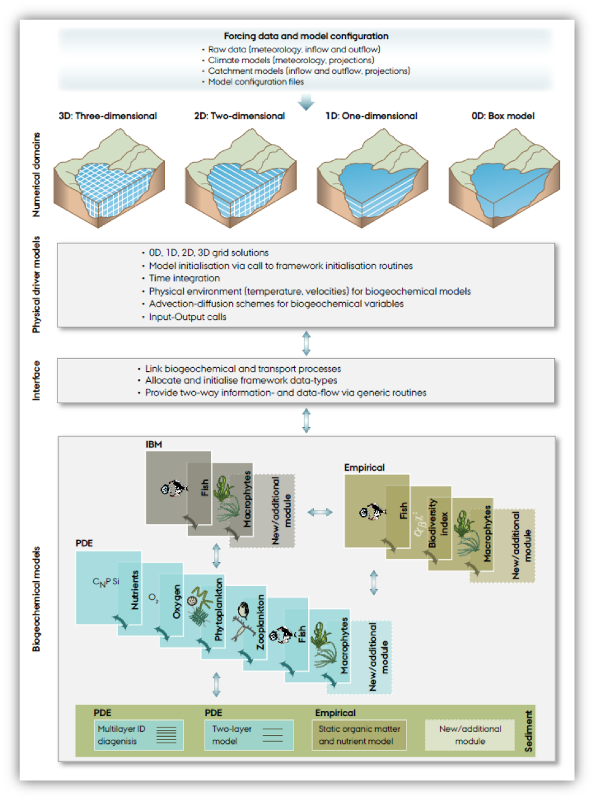
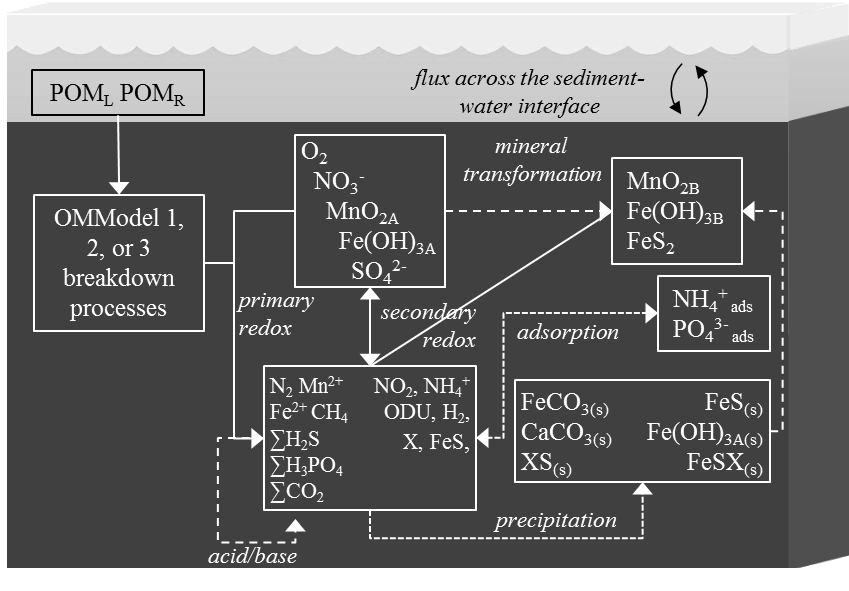
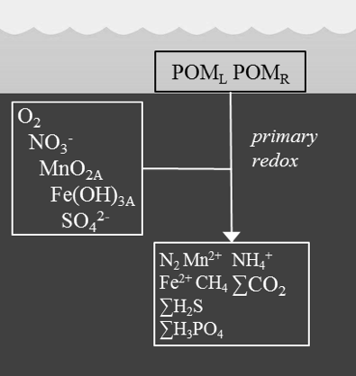
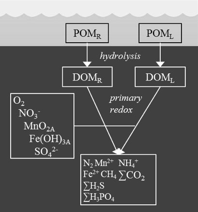
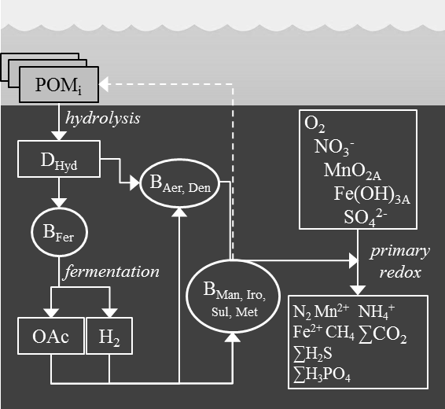

# (PART) AED+ Benthic Modules {-} 

# Sediment Biogeochemistry

## Contributors

Daniel Paraska, Matthew R Hipsey

## Overview

Sediment diagenesis models are highly complex environmental reactive transport modelling tools. The meta-analysis by Paraska et al (2014) discussed the history of their evolution to these complex configurations, in which the original models of Boudreau (1996), Van Cappellen and Wang (1996) and Soetaert et al. (1996) were taken up and applied in many contexts by new modellers, who added new features and extended their capabilities, or discarded old features as required. The meta-analysis also identified the major challenges associated with developing new sediment diagenesis models. Here, a new modelling package for sediment biogeochemistry is presented, CANDI-AED, which is an extension of the Approach 1 models, but reengineered and augmented with new model approaches and capabilities as a way to address some of these challenges. 

Paraska et al (in prep) outlined the significance and uncertainty associated with different parameterisation approaches of organic matter dynamics. In these cases, simulations were run to test the significance of different theoretical approaches and model structural assumptions, using an idealised model setup with only primary oxidation reactions and no physical processes or spatial resolution. The true impact of these different model approaches within a spatially-resolved model, accounting for all of the advection, diffusion and secondary reaction processes, however, is yet to be determined and it is unclear whether some formulations may suit some application contexts better than others. Therefore there is a need for a fully flexible model structure that can include these different organic matter breakdown parameterisations and allow users to assess critically the alternative approaches. In addition, other aspects related to 
secondary redox reactions, mineral reactions, precipitation and adsorption should similarly be subject to comparative assessments.

A further challenge identified in Paraska et al (2014) was the difficulty involved in taking up these models by the broader modelling community, because of problems related to connecting these complex model structures with other water quality and aquatic ecosystem models. For example, there are problems related to mapping variables of ecosystem models to those of diagenesis models. There are also problems related to the mismatch between the resolution of processes that occur over different spatial and temporal scales, for example fast equilibrium reactions between sediment layers, and seasonal temperature or salinity changes across a study site.

The model developed as part of this research aimed to address these challenges by building a full-featured, open-source model code with the flexibility to do the following:
-	set different kinetic rate equation approaches
-	set different organic matter pools and breakdown processes
-	use standard inhibition or thermodynamic limits on primary oxidation
- optionally use manganese, iron and iron sulphide reactions
-	simulate adsorbed metals and nutrients
-	simulate calcium, iron and manganese carbonates
-	connect the boundary to either another model, a programmed file or a fixed concentration
Therefore the numerical model presented in this chapter has many optional features and alternative parameterisations for key processes, without mandating their inclusion in the calculations or enforcing a fixed model structure. To facilitate the coupling, the model is implemented with the “Framework for Aquatic Biogeochemical Models” (FABM), which is a new object-oriented model software framework by Bruggeman and Bolding (2014). Through the definition of a generic architecture for configuring and coupling both benthic and pelagic models, the FABM has been designed to couple a wide range of ecological and biogeochemical models from various developers with numerous different hydrodynamic models (Trolle et al. 2011). To date the FABM has been applied with the 1D lake hydrodynamic model GLM (Hipsey et al. 2014), and the unstructured mesh model TUFLOW-FV (Bruce et al. 2014).

The sediment model CANDI-AED presented here is implemented within the AED model library within the FABM (Hipsey et al. 2013b), however, it is able to couple with one or more of the FABM model libraries (Figure \@ref(fig:23-pic1)). Through the model coupling approach it may be applied with any of the hydrodynamic models listed above, or alternatively, run in isolation. This document provides a complete scientific description of the model and describes attributes of the model associated with its practical implementation and operation. An application of the model framework is subsequently demonstrated. 

<center>
```{r 23-pic1, echo=FALSE, fig.cap="Schematic of the framework of aquatic biogeochemical models. The new diagenesis model code AED CANDI fits into the category of multilayer 1D diagenesis models, coupled to other biogeochemical and physical models (Trolle et al. 2011)", out.width = '75%'}

```
</center>

## Model Description

The heart of this model is the reaction, diffusion, advection model of Berner (1980), which was implemented as the Carbon and Nutrient Diagenesis model of Boudreau (1996) and developed into Approach 1 from Chapter 2. The basic structure of this model is an adaptation of the C.CANDI code (Luff et al. 2000), which added extensions related to the geochemical aspects. Further additions to the C.CANDI code have been made to:
- the organic matter dynamics
- the geochemical dynamics
- extensions for nutrients and trace metals

The chemical reactions included in this model, including new features added to the model, are expanded upon below and summarised in Figure \@ref(fig:23-pic2).

<center>
```{r 23-pic2, echo=FALSE, fig.cap="AED CANDI includes chemical processes of organic matter transformation and oxidation, and reduction/oxidation, crystallisation, adsorption and precipitation reactions of inorganic by-products. Most of the processes are triggered by the input of POM at the sediment-water interface.", out.width = '85%'}

```
</center>

###	Process Descriptions

#### Primary Redox Reactions {-}

The key chemical process that causes ongoing change in the sediment is the breakdown of organic matter. The user can decide how complex or simple the organic matter breakdown pathway should be, with three options of varying complexity for parameterising the pathways included (Figure 5 - 3). The first option (`OMModel = 1`) is a common multi-G model in which the POM phases are decomposed straight to CO~2~ and other breakdown products. Here POM is a variable that is not precisely defined, and its components (such as C, N and P) must be determined in post-processing based on a user-defined fixed stoichiometry. The second option (`OMModel = 2`) is another 2G model with both particulate and dissolved organic matter (POM and DOM) phases included and parameterisation hydrolysis of POM to DOM, and then DOM to CO~2~ and other breakdown products. The POM and DOM phases consist of three variables each, which trace the reaction and transport of carbon, nitrogen and phosphorus, thereby allowing for variable stoichiometry of organic matter to occur temporally and spatially. The third option (`OMModel = 3`) has many POM phases, which are all hydrolysed to DOM, which then undergoes fermentation and terminal metabolism, as using the mechanistic approach from Chapter 3.  This allows the carbon, nitrogen and phosphorus to be calculated precisely before and after a model run, and allows the free energies of the reaction of each phase to be included. This third option is the most detailed and mechanistic, and allows for expansion of more detailed reaction mechanisms to be included.

```{r 23-OMbreakdown, echo=FALSE, message=FALSE, warning=FALSE}
library(knitr)
library(kableExtra)
OM_breakdown <- read.csv("tables/23-sediment_biogeochemistry/OM_breakdown.csv", check.names=FALSE)
kable(OM_breakdown,"html", escape = F, align = "c", caption = "Parameters and configuration",
      bootstrap_options = "hover") %>%
  kable_styling(OM_breakdown, bootstrap_options = "hover", 
                full_width = F, position = "center",
                font_size = 12) %>%
  column_spec(1, width_max = "30em") %>%
  column_spec(2, width_max = "30em") %>%
  column_spec(3, width_min = "10em") %>%
  row_spec(1:13, background = 'white') %>%
  scroll_box(width = "770px", height = "500px",
             fixed_thead = FALSE) 
```

```{r, figures-side, echo=FALSE, fig.cap="Three options for different levels of complexity in organic matter breakdown, by setting the OMModel switch. a – Model in which POM breaks down directly to CO~2~ and other waste products. b – Model in which POM is first hydrolysed to DOM and then oxidised to CO~2~. c – Model in which POM is hydrolysed to DOM, which can then be fermented and oxidised.", fig.show="hold", out.width="30%"}



```

The terminal redox reaction pathways are the six pathways that are available in most diagenesis models, and are driven by different organic matter pools, depending on the OMModel configuration chosen from the above options (Table 5 - 2). AED CANDI allows the use of Approach 1 or 2 organic matter oxidation rate equations, as examined in detail in Paraska et al (in prep).

The rate equation for the oxidation of the oxidants with any of the pools above can include any of the terms in equation 5 - 12, where $R_{{Ox}_i}$ is the reaction of an oxidant $i$ (Arndt et al. 2013) (Table 5 - 3). The kinetic rate constant $k_{OM}$ gives the maximum oxidation rate, which is different for each reactive type, but the same for each oxidation pathway. Alternatively, using OMModel 3, the kinetic rate constant is the rate of bacterial growth.

The factor for terminal electron acceptor (TEA) limitation is FTEA (5 - 11), where options for Approach 1 or Approach 2 equations are available. The Monod constant for rate limitation at low oxidant concentration is $K_{TEA}$ in Approach 1 and LTEA in Approach 2. Similarly, the inhibition term $F_{In}$ (5 - 14) can be set to Approach 1 or 2 equations, or turned off entirely. The constant for inhibition until low oxidant concentrations is $K_{In}$ for Approach 1 and $L_{IN}$ for Approach 2. 

$F_{T}$ is the thermodynamic factor, as described in chapter 3. The current version of the model includes FT only for OMModel 3, for terminal oxidation reactions and fermentation. 

$F_{OM}$ is the organic matter concentration and may be a Monod function as in equation 5 - 8 ($K_{OM}$ is a half saturation constant and the index $i$ is the reactive phase). Using OMModels 1 and 2, $F_{OM}$ is the concentration of the substrate, rather than a Monod function. The current version of the model has switches built in for both the temperature dependence factor, $F_{Tem}$, where values of 1 or 2 turn them off and on. However, implementation and testing of the factors has not been carried out for this version of the model. The metabolism rate at $T_{0}$ is $R_{0}$, $ξ$ is a scaling constant (see, for example, Eldridge and Morse 2008). 

#### Secondary Redox Reactions {-}

In the meta-analysis, we identified the many secondary redox reactions that have been included across the diversity of diagenesis model applications. In AED CANDI, they are all included as options, and may be turned on or off as desired (Table 5 - 4).

#### Equilibrium Geochemistry {-}

The pH is calculated as the sum of all charged species, where any unbalanced positive charge indicates H^+^. The charge balance is at each time step is solved as a state variable, which is subject to advection, diffusion and bioturbation reactions.
 
The precipitation of minerals is solved as an equilibrium reaction, dependent on the concentrations of the dissolved and solid substances, their $K_{sp}$ and ion activity product (IAP). The equations are applied in a similar manner to those in Van Cappellen and Wang (1996) and numerous other studies, but with the exact forms of the equations based on those from Tufano et al. (2009) (Table 5 - 5). A positive rate indicates precipitation and a negative rate indicates dissolution. This model applies the function to all mineral simulated, including Fe(OH)~3~, FeS, FeS~2~, FeCO~3~, CaCO~3~ and MnCO~3~. 
This model has a process of mineral ageing, whereby iron and manganese oxides become crystalline and no longer react with organic matter, but can still undergo secondary redox reactions. 

#### Physical Transport {-}

The analysis from chapter 2 showed that advection and diffusion reactions (equations 5 - 102, 5 - 103) are fairly consistent in diagenesis models, and here we use the same methods (Table 5 - 8). Porosity (ϕ) is defined according to equation 5 - 104, which allows it to decrease with depth, and the solid fraction is defined from $\phi_s=1-\phi)$. For bioturbation the model uses a diffusion coefficient that varies with depth ($D_{B(x)}$) as a two layer function or a Gaussian decrease (Boudreau 1996). For the porewater components, diffusion coefficients are used that are based on free-solution molecular diffusion constants corrected for sediment tortuosity, $θ$, according to equation 5 - 105.

###	Variable Summary


###	Parameter Summary
###	Optional Module Links
###	Feedbacks to the Host Model
## Setup & Configuration

The preceding details were an explanation of the scientific aspects of this diagenesis model, and next we turn to practical implementation.

### Implementation withing the FABM Framework

The sediment diagenesis model AED CANDI is one module of the AED library (Table 5 - 9, Hipsey et al. 2013b), which is composed of numerous model components. The FABM allows any combination of these modules, or any other model package, to be included in a model simulation and couples them to a physical model of the water column, which provides the spatial and temporal resolution, and calculates the transport processes (Figure 5 - 1). The AED library is just one set that could be used with the FABM framework, where others include the Fasham model template (based on Fasham et al. 1990) or the simple NPZD model of Burchard et al. (2005). A range of physical models and configurations is also available, depending on whether the focus is on the sediment alone, or the sediment as part of a larger environmental simulation (Figure 5 - 3). Refer [here](http://sourceforge.net/apps/mediawiki/fabm/) for further up to date information about the FABM and available model codes.

<center>
```{r 23-pic6, echo=FALSE, fig.cap="Spatial resolution options available through FABM. a) Water column studies have traditionally assigned a flux to the sediment water interface without resolving the sediment chemical concentrations by depth, though they can be resolved laterally. b) The 0D water column is the method used in most sediment diagenesis studies, and use of multiple sediment zones is an option available within the FABM.", out.width = '95%'}
knitr::include_graphics("images/23-sediment_biogeochemistry/image6.png")
```
</center>

### Program Structure

The general structure of the program is shown in Figure 5 - 5. The program is firstly initialised, then loops through the kinetic and equilibrium reactions for each time step and writes the resulting concentrations and rates at each depth to an output file. The kinetic reactions are solved by the VODE program (Brown et al. 1989) and the equilibrium reactions by the Simplex program.

<center>
```{r 23-pic7, echo=FALSE, fig.cap="The program is firstly initialised, then loops through the kinetic and equilibrium reactions for each time step and writes the resulting concentrations and rates at each depth to an output file. The kinetic reactions are solved by the VODE program (Brown et al. 1989) and the equilibrium reactions by the Simplex program.", out.width = '60%'}
knitr::include_graphics("images/23-sediment_biogeochemistry/image7.png")
```
</center>

### Model Setup, Boundary Conditions & Parameter Definition

The model is set up via the name list text file `fabm.nml` using the model keyword “aed_seddiagenesis” with the model configured to select the “Dynamic” option. Once this is selected, the model will search for the “&aed_sedcandi” parameter block within fabm.nml.

Each active sediment model within the FABM model is discretised into a user definable number of depth layers (maxnpts) that start at a thickness of a few mm at the sediment-water interface and which increase exponentially down to a pre-defined sediment depth (xl). Users must define the sediment domain physical properties as summarised in Table 5 - 10, including configuration options related to bioturbation and irrigation. The biogeochemical configuration (Table 5 - 11), rate constants (see Table 5 - 12 and Table 5 - 13) must be set according to the sub-model options described above. 

The initial conditions for each variable are set as a list by the “initial_vals”, which sets a constant concentration with depth in units of μmol L-1. For organic matter initial concentrations only, there are three available options for the concentration with depth, set by “OMInitMethodL”. 

The sediment-water interface is the uppermost layer of the sediment, for which there are three configuration options set by the parameter `ibc2`. If the user specifies `ibc2 = 2`, the concentration is a constant value set by `default_vals` in the `fabm.nml` name list. For `ibc2 = 1`, the concentration is provided by a “link_variable”, which provides the concentration from another simulated water column FABM module. If the variable name in the link list is left blank (“ ”) then AED_CANDI will assume these variables are not linked to any water column variables and default to the “default_vals” values. If `ibc2 = 10`, the concentration is provided by a user-prescribed temporally variable value read from the file `aed_sediment_swibc.dat`. This option may desirable, for example, for simulating a seasonally or daily changing boundary condition. 

Regardless of the ibc2 surface boundary condition option, fluxes of dissolved species occur between the sediment and water column. They are calculated from the concentration gradient at the sediment-water interface according to Fick’s Law:

<center>
\begin{equation}
F = D_{0}\frac{\Delta C}{\Delta x} = \frac{D_{0}}{\delta} (C_{bw} - C_{1})
(\#eq:biogeochem1)
\end{equation}
</center>

where $D_{0}$ is the diffusivity as defined above, $\delta$ is the thickness of the diffusive boundary layer at the sediment water interface and defined as the length scale of the first sediment layer, $C_{bw}$ is the bottom water concentration and $C_{1}$ is the concentration in the top sediment layer.

At the bottom of the domain ($x$ = “xl”) the model can be specified to have a fixed-concentration (ibbc = 0) such that the concentration at $xl = C_{Bot}$, or it can be specified to have a zero-derivative (ibbc = 1) defined as $\frac{dC}{dx}=0$ at $x = xl$.

### Model Output & Post-processing

The model output files are written for each variable as text files, giving time (in years) as the first column depth as the first row and concentrations in the other fields. These can be read in using a data processing program such as R, Matlab or Excel for analysis. Further, the model outputs the file `rates.sed` for each variable at every depth for the final time step. 

## Case Studies & Examples
###	Case Study
###	Publications
