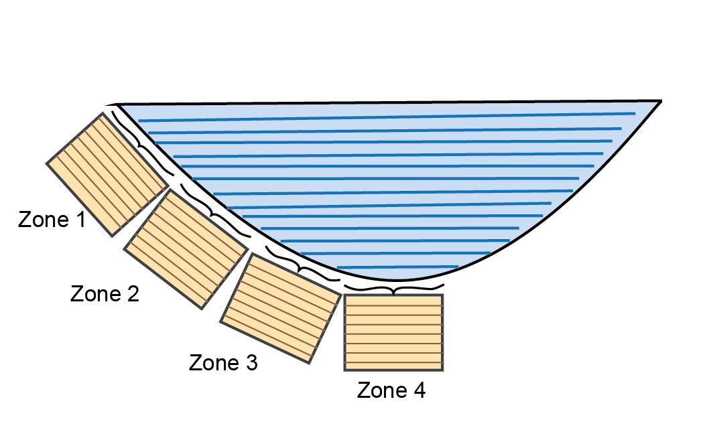

# (PART) AED Benthic Modules {-} 

# Sediment Biogeochemistry

## Contributors

Daniel Paraska, Matthew R. Hipsey

## Overview
<center>
```{r 23-pic1, echo=FALSE, fig.cap="Schematic of the main physical and chemical processes that cause chemical concentration and flux change in the sediment and across the sediment-water interface, and therefore are included in most sediment diagenesis models.", out.width = '85%'}
knitr::include_graphics("images/23-sediment_biogeochemistry/Boxes&Arrows/Overview-05.png")
```
</center>

This module is a sediment reactive transport model, based on a 1D approximation of the sediment and pore-water profiles. Each active sediment zone (or column) is discretized into a user defineable number of layers that start at thicknesses of around 1 mm at the sediment-water interface and increase exponentially down to a pre-defined sediment depth. The model resolves in each layer both physical processes (e.g. pore-water diffusion or bioturbation) and chemical processes (e.g. redox transformations).

Under some conditions, the sediment stores can release nutrients to the water column, while under other conditions, the sediment can remove nutrients over the long-term through burial, and the surface layers can remove nitrogen through processes such as denitrification. The fine balance that controls the conditions under which the sediment will store, release or remove nutrients is largely governed by the aerobic state of the sediment pore water, and the amount of reactive organic matter fuelling the reactions. The depth-resolved sediment model accounts for mixing from the hydrodynamic model into the upper sediment layers, and then calculates whether organic matter is consumed aerobically, through denitrification or, deeper down, through sulfate reduction or even methanogenesis.

Sediment early-diagenesis models are highly complex environmental reactive transport simulation tools. The meta-analysis by Paraska et al. (2014) discussed the history of their evolution to these complex configurations, in which the original models of Boudreau (1996), Van Cappellen and Wang (1996) and Soetaert et al. (1996) were taken up and applied in many contexts by new modellers, who added new features and extended their capabilities, or discarded old features as required. The meta-analysis also identified the major challenges associated with developing new sediment diagenesis models. Here, the AED modelling package for sediment biogeochemistry is presented, CANDI-AED, which is an extension of the Approach 1 models, but reengineered and augmented with new model approaches and capabilities as a way to address some of these challenges. 

Paraska et al. (2015) outlined the significance and uncertainty associated with different parameterisation approaches of organic matter dynamics. In these cases, simulations were run to test the significance of different theoretical approaches and model structural assumptions, using an idealised model setup with only primary oxidation reactions and no physical processes or spatial resolution. The true impact of these different model approaches within a spatially-resolved model, accounting for all of the advection, diffusion and secondary reaction processes, however, is yet to be determined and it is unclear whether some formulations may suit some application contexts better than others. Therefore there is a need for a fully flexible model structure that can include these different organic matter breakdown parameterisations and allow users to assess critically the alternative approaches. In addition, other aspects related to secondary redox reactions, mineral reactions, precipitation and adsorption should similarly be subject to comparative assessments.

The model included in AED aimed to address challenges of building a generic and full-featured, open-source model code with the flexibility to do the following:

-	set different kinetic rate equation approaches
-	set different organic matter pools and breakdown processes
-	use standard inhibition or thermodynamic limits on primary oxidation
- optionally use manganese, iron and iron sulphide reactions
-	simulate adsorbed metals and nutrients
-	simulate calcium, iron and manganese carbonates
-	connect the boundary to either another model, a programmed file or a fixed concentration

Therefore the numerical model presented in this module has many optional features and alternative parameterisations for key processes, without mandating their inclusion in the calculations or enforcing a fixed model structure.

The sediment model CANDI-AED presented here is implemented as an optionally configurable module in the AED model library. Through the model coupling approach it may be applied with any of the hydrodynamic models linked to AED (e.g. GLM, Tuflow), or alternatively, options to run in isolation are also possible. This chapter provides a scientific description of the model and describes attributes of the model associated with its practical implementation and operation. 
An case-study of the model framework is also demonstrated.


## Model Description

The heart of this model is the reaction, diffusion, advection model of Berner (1980), which was implemented as the Carbon and Nutrient Diagenesis model of Boudreau (1996), later further developed as the C.CANDI code (Luff et al. 2000). The CANDI-AED implementation, however, has evolved from the original code, and includes extensions related to the treatment of organic matter, the simulation of the geochemical conditions known to influence the diagenetic equations, extensions for nutrients and trace metals, and dynamics at the sediment-water interface (SWI). However, the core organic matter breakdown equations (and their numerical solution) remains similar as the original descriptions presented in Boudreau (1996), and to other similar sediment models. An overview of the model is shown in Figure \@ref(fig:23-pic2).

<center>
```{r 23-pic2, echo=FALSE, fig.cap="Overview of the chemical processes in CANDI: organic matter transformation and oxidation, and reduction/oxidation, crystallisation, adsorption and precipitation reactions of inorganic by-products. Most of the processes are triggered by the input of POM at the sediment-water interface.", out.width = '85%'}
knitr::include_graphics("images/23-sediment_biogeochemistry/Boxes&Arrows/FullCandi-02.png")
```
</center>

<br>

The model is based on the advection-dispersion reaction equation for the concentration of dissolved and particulate substances. For dissolved substances $C_d$, the balance equation is defined as:

<center>
\begin{equation}
\frac{\phi \delta C_d}{\delta t} = \overbrace{ D_{B}\frac{\delta^{2} C_d}{\delta x^{2}} + \phi D_{S}\frac{\delta^{2} C_d}{\delta x^{2}} }^\text{biodiffusion and molecular diffusion} - \underbrace{u \frac{\delta C_d}{\delta x}}_\text{advection (flow)} + \overbrace{\alpha(C_{d_0}-C_d)}^\text{irrigation}  + \underbrace{\phi \sum R_d}_\text{reactions} + \color{brown}{S}
(\#eq:sdg-1)
\end{equation}
</center>

where the left hand side (LHS) is the “unsteady” term ($C_d$ change in time), the first term on the right hand side (RHS) is the dispersion/mixing term, the second term on the RHS is the advection/movement term, and $R_d$ denotes a generic reaction term. An optional $S$ term is included to represent sources from other modules (e.g., seagrass root injection of $O_2$).

For particulate (solid) substances, $C_s$:

<center>
\begin{equation}
\frac{(1-\phi)\rho \delta C_s}{\delta t} = \overbrace{ D_{B}\frac{\delta^{2}[(1-\phi)\rho C_s] }{\delta x^{2}} }^\text{biodiffusion} - \underbrace{\omega \frac{\delta [(1-\phi)\rho C_s]}{\delta x}}_\text{advection (sedimentation)}  + \overbrace{(1-\phi) \sum R_s}^\text{reactions} + \color{brown}{S}
(\#eq:sdg-2)
\end{equation}
</center>

where $(1-\phi)$ denotes the solid fraction of the sediment, and $R_s$ is a generic reaction term.

The above equations are solved numerically for the simulated set of constituents. The user can define the variables that are included in the $\mathbf{SDG}$ module, such that $C_d$ and $C_s$, are the set of dissolved and particulate variables selected for simulation, respectively. Eight of the variables (compulsory variables) must be requested by the user in the variable setup file, or the model will not run. Three other compulsory variables are always simulated and the user does not need to request them. The other variables can be requested if the user desires them. A number of options are available for resolving the physical processes, including the rate of diffusion, advection, irrigation and the boundary condition options.


In addition to physical processes, the CANDI-AED model considers two types of chemical reactions - the slow, kinetically controlled reactions, and the fast thermodynamically based equilibrium reactions. The latter are simulated in the sediment through appropriate configuration of the geochemistry reactions; the configuration of the equilibrium model will apply to both the water and each of the sediment layers. The kinetically controlled reactions are mostly microbially-mediated and include the reactions for organic matter breakdown and eventual oxidation, the re-oxidation of various by-products and the dynamics of the metal sulfides. These reactions can be complex and are outlined in further detail in the next sections.

Salinity is set as a permanently linked variable from the water column AED model, without using `water_link`.

###	Process Descriptions

#### Sediment model domain

The sediment model is discretised into a user-definable number of depth layers (`maxnpts`) down to a pre-defined sediment depth(`xl`). The grid of layers is set to have either even spacing (`job` = 1) or to be exponentially increasing (`job` = 0), where the layers sizes have a thickness of a few mm at the sediment-water interface and which increase exponentially down into the sediment (figure \@ref(fig:Init-1)). When the spacing increases exponentially, the first two layers are hard-coded to be a miniumum of 0.25 cm, in order to avoid numerical instability from sharp concentration differences over distances that are too small. 

This fixed depth of sediment has a concentration of all variables at all depth layers, and boundary conditions at the upper and lower ends of the domain. 

```{r Init-1, echo=FALSE, fig.cap="Initialisation of the depth layers. The number of layers is set by `maxnpts` and the depth of the simulation by `xl`. The setup can have even spacing (left) using parameter `job` = 1 or increasing spacing (right) `job` = 2.",fig.show='hold',fig.align='center' ,out.width = '60%'}
knitr::include_graphics("images/23-sediment_biogeochemistry/Initialisation/job1job2-06.png")
```


#### Physical Transport

##### *Solids* {-} 
CANDI-AED adopts the approach of Boudreau (1996) to advection and dispersion, which is similar to most other diagenesis models. Advection of the solid sediment matrix is occurs at the rate of sediment deposition ($\omega_{00}$ in cm y^-1^). The sediment does not move, however, since the height of the modelling domain is fixed, as more sediment accumulates at the surface, a sediment particle moves downwards. An alternative way to view this is that the modelling domain moves upwards. 

```{r Phys1, echo = FALSE, out.width='60%', class = "text-image",fig.show='hold',fig.align='center', fig.cap = "Upon sedimentation, the frame of reference shifts upwards. The bottom area is effectively lost from the modelling domain over time. Particles and porewater are advected downward relative to the modelling domain."}

knitr::include_graphics("images/23-sediment_biogeochemistry/AdvectionDispersion/AdvectionDispersion-05.png")

```

##### *Porewater* {-} 
For the porewater components, diffusion coefficients are used that are based on free-solution molecular diffusion constants corrected for sediment tortuosity, $θ$. Porewater moves downwards at the same rate as the solids ($\omega_{00}$). A further porewater advection term (`poreflux`) is available, which could represent, for example, pressure on the sediment from a groundwater source. If `poreflux` is positive, then porewater moves upwards, relative to particles. Conversely, if `poreflux` is negative, then the porewater moves downwards relative to the particles. In most simulations `poreflux` is zero and advection is the transport process. A dynamic `poreflux` can be assigned using the column headings `w00h00` in swibc.dat or `pf` in deepbc.dat (see setup section below). 

```{r Phys2, echo = FALSE, out.width='100%', class = "text-image",fig.show='hold',fig.align='center', fig.cap = "Porewater is advected at the same rate as burial. If `poreflux` is non-zero, an additional rate of advection is applied to porewater. The direction is upwards when `poreflux` is positive, downwards when *poreflux* is negative."}

knitr::include_graphics("images/23-sediment_biogeochemistry/AdvectionDispersion/Poreflux-04.png")

```


##### *Porosity*  {-} 
Porosity ($\phi$) is defined as the amount of water per total volume of space, as a real number between 0 and 1. 
A value for porosity is set at each depth layer during initialisation (see section below) and remains constant throughout the simulation (Figure \@ref(fig:Phys-6)). The porosity array is used in the model to calculate other variables, such as 

-    advection
-    poreflux
-    porewater volume 
-    solid volume
-    diffusive velocity
-    solid fraction

Porosity is also used in the model to calculate $ps$, $psp$ and $pps$, which are used to convert between solid and dissolved state variables, using these conversions:

```{=tex}
\begin{eqnarray}
     ps  = 1 - \phi
     \\
     (\#eq:poros-1)
     \\
     psp = \frac {ps} {\phi}
     \\
     (\#eq:poros-2)
     \\
     pps = \frac {\phi} {ps}
     (\#eq:poros-3)
\end{eqnarray}
```

Porosity is configured by setting three parameters: the porosity at the sediment-water interface (`p0`), the porosity at the depth where compaction causes constant porosity with depth (`p00`), and the attenuation coefficient on the exponential curve (`bp`) (equation \@ref(#eq:init-1)). These parameters are set separately for each zone in `aed_candi_params.csv`. Porosity is the amount of water per total volume of space, as a real number between 0 and 1. 


```{=tex}
\begin{eqnarray}

    \phi = (\rho _0 - \rho _{00}) \times e^{-bp \times depth}  + \rho _{00}

(\#eq:init-1)


\end{eqnarray}
```


```{r Phys-6, echo=FALSE, fig.cap="Example depth profile of porosity.",fig.show='hold',fig.align='center' ,out.width = '60%'}
knitr::include_graphics("images/23-sediment_biogeochemistry/Initialisation/Porosity-01.png")
```
\

A porosity and bioirrigation profiles are output in the file `Depths.sed`, along with the depths (in cm), and so the user can examine the shapes of the profiles with depth. 

#### Primary Redox Reactions 

The key chemical process that causes ongoing change in the sediment is the breakdown of organic matter. Organic matter supplies fuel, above all, reduced carbon, to microorganisms living in the sediment.

*#####* Organic matter pools and reactivity {-}

Organic matter ($OM$) degradation pathways can include labile and refractory components, and the breakdown pathways simulated are summarized conceptually in Figure \@ref(fig:OMModels). Reactions included in the kinetic component include the hydrolysis of the complex (e.g., high molecular weight) $OM$ pools ($POM_{VR}$, $POM_R$, $DOM_R$, $POM_L$) and transformation of low molecular weight (LMW) $DOM_L$ by oxidants ($O_2$, $NO_3^-$, $MnO_2$, $Fe(III)$ and $SO_4^{2-}$ - the so-called 'terminal metabolism' pathway), and the release of resulting nutrients ($NH_4^+$, $PO_4^{3-}$) and reduced by-products ($Mn^{2+}$, $Fe^{2+}$, $N_2$, $H_2S$, $CH_4$) and $CO_2$. Oxidants, nutrients and by-products are all capable of interacting, for example, through re-oxidation of reduced species (outlined in the next section).

The user can decide how complex or simple the organic matter breakdown pathway should be, with three options of varying complexity for parameterising the pathways included (Figure \@ref(fig:OMModels)). The first option (`OMModel` = 1) is a common multi-G model in which the $POM$ phases are decomposed straight to $CO_2$ and other breakdown products. Here $POM$ is a variable that is not precisely defined, and its components (such as C, N and P) are assigned by parameters based on a user-defined stoichiometry. The second option (`OMModel` = 2) is another 2G model with both particulate and dissolved organic matter ($POM$ and $DOM$) phases included and parameterisation hydrolysis of $POM$ to $DOM$, and then $DOM$ to $CO_2$ and other breakdown products. The $POM$ and $DOM$ phases consist of three variables each, which trace the reaction and transport of carbon, nitrogen and phosphorus, thereby allowing for variable stoichiometry of organic matter to occur temporally and spatially. The third option (`OMModel` = 3) has many $POM$ phases, which are all hydrolysed to $DOM$, which then undergoes fermentation and terminal metabolism.  This allows the carbon, nitrogen and phosphorus to be calculated precisely before and after a model run, and allows the free energies of the reaction of each phase to be included. This third option is the most detailed and mechanistic, and allows for expansion of more detailed reaction mechanisms to be included, but is recommended only for experienced users.


CANDI-AED also contains options for very unreactive organic matter parameter. The model can lower the reactivity of the particulate refractory phase towards zero as the concentration approaches a minimum. For example, for $POC_R$, the parameter `pocu` sets the minimum concentration and `KOMPres_C` sets the sensitivity of the decrease, as in equation \@ref(eq:pomr-1) below. The equivalent parameters for N an P are `ponu` and `popu`, and `KOMPres_N` and `KOMPres_P`.

```{=tex}
\begin{eqnarray}

komlim = \frac {PON_R - ponu} {PON_R - ponu + KOMPres_N}
\\
\\
R_{PONR} = (ponr2donr) (komlim)
(\#eq:pomr-1)

\end{eqnarray}
```
(The equation above is a simplified version, where the full equation had checks to prevent the rate going below zero, plus the respiration processes of $MPB$.)


```{r OMModels, echo=FALSE, fig.cap="Three options for different levels of complexity in organic matter breakdown, by setting the `OMModel` switch. Left – Model in which POM breaks down directly to CO~2~ and other waste products. Centre – Model in which POM is first hydrolysed to DOM and then oxidised to CO~2~. Right – Model in which POM is hydrolysed to DOM, which can then be fermented and oxidised.", fig.show="hold", out.width="85%" ,fig.align='center'}
knitr::include_graphics("images/23-sediment_biogeochemistry/Boxes&Arrows/OMModel-04.png")
```

<center>

```{r OMModel-table, echo=FALSE, message=FALSE, warning=FALSE}
library(knitr)
library(kableExtra)
library(readxl)
  options(knitr.kable.NA = "")
OMModel_tab <- read_xlsx("tables/23-sediment_biogeochemistry/UserManual.xlsx", sheet="OMModel")
# View(sediment_VarsTable)
OMModel_Groups <- unique(OMModel_tab$Group)
  kable(OMModel_tab[,1:3],"html", escape = F, align = "c"
        , caption = "Organic matter breakdown processes. The index *i* in *∑ R~Oxi~* refers to the sequence of TEA in Table 5 - 2. For OMModel 2, POM and DOM are each three state variables of POC, PON and POP, and DOC, DON and DOP.    caption.",bootstrap_options = "hover")%>%
  
    
  pack_rows(OMModel_Groups[1],
            min(which(OMModel_tab$Group == OMModel_Groups[1])),
            max(which(OMModel_tab$Group == OMModel_Groups[1])),
            background = '#ebebeb'
            ,color="black") %>%
  pack_rows(OMModel_Groups[2],
            min(which(OMModel_tab$Group == OMModel_Groups[2])),
            max(which(OMModel_tab$Group == OMModel_Groups[2])),
            background = '#ebebeb'
            ,color="black") %>%
  pack_rows(OMModel_Groups[3],
            min(which(OMModel_tab$Group == OMModel_Groups[3])),
            max(which(OMModel_tab$Group == OMModel_Groups[3])),
            background = '#ebebeb'
            ,color="black") %>%
  pack_rows(OMModel_Groups[4],
            min(which(OMModel_tab$Group == OMModel_Groups[4])),
            max(which(OMModel_tab$Group == OMModel_Groups[4])),
            background = '#ebebeb'
            ,color="black") %>%

   kable_styling(OMModel_tab, bootstrap_options = "hover",
                full_width = T, position = "left",
                font_size = 12) %>% 
    
  row_spec(0, background = "#14759e", bold = TRUE, color = "white") %>%
  column_spec(1, width_min = "10em" ,color="black",bold = F) %>%
  column_spec(2, width_min = "15em" ,color="black") %>%
  column_spec(3, width_min = "15em" ,color="black") %>%
  # column_spec(4, width_min = "15em") %>%
  row_spec(1:4, background = 'white')  %>%
 scroll_box(width = "45em", height = "30em",fixed_thead = FALSE)
```
</center>


##### *The redox sequence* 

The terminal redox reaction pathways are the six major pathways that are available in most diagenesis models, and are driven by different organic matter pools, depending on the `OMModel` configuration chosen from the above options. CANDI-AED allows the use of Approach 1 or 2 organic matter oxidation rate equations, as examined in detail in Paraska et al (2015), and also explained below. The six major pathways are:

-   Aerobic
-   Denitrifying
-   Manganese reduction
-   Iron reduction
-   Sulfate reduction
-   Methanogenesis

The decay of the complex $OM$ types to the LMW $DOM$ required for the hetertrophic bacteria to utilise are all modelled with a simple first-order decay rate. The subsequent reactions for terminal metabolism that describe the breakdown of $OM$ to $CO_2$ and other breakdown products are described below 
\
(equations \@ref(eq:primary-0) to \@ref(eq:primary-6). 
\
CANDI-AED uses a more detailed set of reactions for the denitrifying process, which are described in the \@ref(####Nitrogen cycling) section below. The chemical equations may be written as in table \@ref(tab:OMChem-table) and the reaction rates for each of these are calculated dynamically based on Monod expressions which mediate the reaction rate according to the concentration of potential oxidants higher in the redox sequence, and the concentration of the available oxidant.\@ref(fig:dev-Grid1)

<center>

```{r OMChem-table, echo=FALSE, message=FALSE, warning=FALSE}
library(knitr)
library(kableExtra)
library(readxl)
  options(knitr.kable.NA = "")
OMChem_tab <- read_xlsx("tables/23-sediment_biogeochemistry/UserManual.xlsx", sheet="OMChem")
# View(sediment_VarsTable)
OMChem_Groups <- unique(OMChem_tab$Group)
  kable(OMChem_tab[,1:2],"html", escape = F, align = "c"
        , caption = "Primary terminal redox reactions. x, y and z are stoichiometric coefficients.",bootstrap_options = "hover")%>%
  
  #   
  # pack_rows(OMChem_Groups[1],
  #           min(which(OMModel_tab$Group == OMModel_Groups[1])),
  #           max(which(OMModel_tab$Group == OMModel_Groups[1])),
  #           background = '#ebebeb'
  #           ,color="black") %>%
  # pack_rows(OMChem_Groups[2],
  #           min(which(OMModel_tab$Group == OMModel_Groups[2])),
  #           max(which(OMModel_tab$Group == OMModel_Groups[2])),
  #           background = '#ebebeb'
  #           ,color="black") %>%
  # pack_rows(OMChem_Groups[3],
  #           min(which(OMModel_tab$Group == OMModel_Groups[3])),
  #           max(which(OMModel_tab$Group == OMModel_Groups[3])),
  #           background = '#ebebeb'
  #           ,color="black") %>%
  # pack_rows(OMChem_Groups[4],
  #           min(which(OMModel_tab$Group == OMModel_Groups[4])),
  #           max(which(OMModel_tab$Group == OMModel_Groups[4])),
  #           background = '#ebebeb'
  #           ,color="black") %>%

   kable_styling(OMChem_tab, bootstrap_options = "hover",
                full_width = T, position = "left",
                font_size = 12) %>% 
    
  row_spec(0, background = "#14759e", bold = TRUE, color = "white") %>%
  column_spec(1, width_min = "10em" ,color="black",bold = F) %>%
  column_spec(2, width_min = "15em" ,color="black") %>%
  # column_spec(3, width_min = "15em" ,color="black") %>%
  # column_spec(4, width_min = "15em") %>%
  row_spec(1:4, background = 'white')  %>%
 scroll_box(width = "45em", height = "25em",fixed_thead = FALSE)
```
</center>

<!-- \begin{eqnarray} -->
<!-- \\ -->
<!-- N2O breakdown -->
<!-- \\ -->
<!-- (\#eq:primary-0) -->
<!-- \\ -->


<!-- \overbrace{(CH_2O)_{106}(NH_3)_{16}(H_3PO_4)}^{\textrm{organic matter}} &+& 138O_2 \rightarrow \nonumber -->
<!-- \\ -->
<!-- && 106CO_2 + 16HNO_3 + H_3PO_4 + 122H_2O -->
<!-- \\ -->
<!-- \textrm{Free energy, } \Delta G_0 &=& -3190\:kJmol^{-1} \nonumber -->
<!-- \\ -->

<!-- (\#eq:primary-1) -->

<!-- \\ -->
<!-- \end{eqnarray} -->

<!-- \begin{eqnarray} -->
<!-- (CH_2O)_{106}(NH_3)_{16}(H_3PO_4) &+& 236MnO_2 +472H^+ \rightarrow  \nonumber -->
<!-- \\ -->
<!-- && 106CO_2 + 236Mn^{2+} + 8N_2 + H_3PO_4 + 366H_2O -->
<!-- \\ -->
<!-- \textrm{Free energy, } \Delta G_0 &=& -3050\:kJmol^{-1} \nonumber -->
<!-- \\ -->

<!-- (\#eq:primary-2) -->

<!-- \\ -->
<!-- (CH_2O)_{106}(NH_3)_{16}(H_3PO_4) &+& 94.4HNO_3 \rightarrow  \nonumber -->
<!-- \\ -->
<!-- && 106CO_2 + 55.5N_2 + H_3PO_4 + 177H_2O -->
<!-- \\ -->
<!-- \textrm{Free energy, } \Delta G_0 &=& -3030\:kJmol^{-1} \nonumber -->
<!-- \\ -->

<!-- (\#eq:primary-3) -->
<!-- \\ -->
<!-- (CH_2O)_{106}(NH_3)_{16}(H_3PO_4) &+& 212Fe_2O_3 +848H^+ \rightarrow  \nonumber -->
<!-- \\ -->
<!-- && 106CO_2 + 16NH_3 + H_3PO_4 + 742H_2O + 424Fe^{2+} -->
<!-- \\ -->
<!-- \textrm{Free energy, } \Delta G_0 &=& -1410\:kJmol^{-1} \nonumber -->
<!-- \\ -->
<!-- (\#eq:primary-4) -->
<!-- \\ -->
<!-- (CH_2O)_{106}(NH_3)_{16}(H_3PO_4) &+& 53SO_4^{2-}  \rightarrow  \nonumber -->
<!-- \\ -->
<!-- && 106CO_2 + 16NH_3 + H_3PO_4 + 106H_2O + 53S^{2-} -->
<!-- \\ -->
<!-- \textrm{Free energy, } \Delta G_0 &=& -380\:kJmol^{-1} \nonumber -->
<!-- \\ -->
<!-- (\#eq:primary-5) -->
<!-- \\ -->
<!-- (CH_2O)_{106}(NH_3)_{16}(H_3PO_4) &&  \rightarrow  \nonumber -->
<!-- \\ -->
<!-- && 53CO_2 + 53CH_4 + 16NH_3 + H_3PO_4 -->
<!-- \\ -->
<!-- \textrm{Free energy, } \Delta G_0 &=& -350\:kJmol^{-1} \nonumber -->

<!-- (\#eq:primary-6) -->

<!-- \end{eqnarray} -->

The rate equation for the oxidation of the oxidants with any of the pools above can include any of the terms in equation x, where $R_{{Ox}_i}$ is the reaction of an oxidant $i$ (Arndt et al. 2013). The kinetic rate constant $k_{OM}$ gives the maximum oxidation rate, which is different for each reactive type, but the same for each oxidation pathway. Alternatively, using *OMModel* 3, the kinetic rate constant is the rate of bacterial growth. The rates are calculated as the product of the rate constant, the concentration and a series of limitation and inhibition factors that scale between 0 and 1. 

##### *Limitation and inhibition factors* 

A common feature of all diagenesis models is that the oxidation rate expression $R_{Ox}$ is a product of up to seven terms: 
-     an organic matter reaction rate constant *k~OM~* 
-     the organic matter concentration limitation, $F_{OM}$ 
-     a temperature dependence $F{Tem}$ 
-     a microbial biomass factor, $F{Bio}$
-     a term limitation factor, $F{TEA}$ 
-     an inhibition term, $F{IN}$ and 
-     a thermodynamic factor, $F{T}$.
	
<center>
\begin{equation}

R_{Ox_{i}} = k_{OM}F_{OM}F_{Tem}F_{Bio}F_{TEA{i}}F_{In_{i}}F_{T}

\\
(\#eq:factors-1)
\end{equation}
</center>

In CANDI-AED, organic matter limitation, $F_{OM}$, is only used with *OMModel* 3. It takes the general form

<center>
\begin{equation}

F_{OM_{i}} = \frac{OM_{i}} {(OM_{i} + K_{OM})}

\\
(\#eq:factors-2)
\end{equation}
</center>

where $OM_i$ is an organic matter species, such as $D_{Hyd}$ or $OAc$ and *K~OM~* is a limiting concentration. This functions like other Monod terms, limiting the reaction rate when the concentration of $OM_{i}$ is low. Using *OMModel* 1 or 2 (the common and simplest options), $F_{OM}$ is effectively 1 and it is assumed that organic matter concentration never limits the reaction rate. 

The temperature factor $F_{Tem}$ is rarely employed in diagenesis models, but in a handful of cases it uses a Q10 relationship between 2 and 4 (see Fossing et al. 2004 for a clear explanation of how temperature affects reaction rates and Eldridge and Morse 2008 or Reed et al. 2011b for a specific examination of the effect of temperature). The current version of the model has switches built in for both the temperature dependence factor, *F~Tem~*, where values of 1 or 2 turn them off and on. However, implementation and testing of the factors has not been carried out for this version of the model. The metabolism rate at $T_{0}$ is $R_{0}$, $ξ$ is a scaling constant (see, for example, Eldridge and Morse 2008). 

The TEA factor, $F_{TEA}$, term accounts for the $R_{Ox}$ dependence on the oxidant concentration when the oxidant concentration is low. The $F_{TEA}$ term in Approach 1 is a Monod expression (table \@ref(tab:OMApproach-table), figure \@ref(fig:OMModels-2)), which uses Monod half-saturation constants (*K~Ox~*), and which is chosen because it best reflects laboratory data of bacterially-controlled oxidation reactions (Boudreau and Westrich, 1984, Gaillard and Rabouille 1992). The $F_{TEA}$ of Approach 3 uses Monod functions, modified to include inhibition terms. In Approach 2 the FTEA is either 0, 1 or the ratio of *Ox~i~* to *L~Ox~*, depending on the oxidant concentration relative to *L~Ox~*, a specified limiting concentration (table \@ref(tab:OMApproach-table)). We use the notation *K~Ox~* and *L~Ox~* to emphasise that a distinction should be made between the Monod half constants in Approaches 1 and 3 and the limiting concentrations used in Approach 2; the difference in conceptual representation is not always clear in Approach 2 papers that use the notation *K~Ox~*. We recommend that the user set the parameter `OMModel` to 1, unless they  specifically need to emulate an Approach 2 model, such as that by Van Cappellen and Wang (1996), or an Approach 3 model, such as that by Soetaert et al. (1996). 


<center>
```{r OMApproach-table, echo=FALSE, message=FALSE, warning=FALSE}
library(knitr)
library(kableExtra)
library(readxl)
  options(knitr.kable.NA = "")
OMApproach_tab <- read_xlsx("tables/23-sediment_biogeochemistry/UserManual.xlsx", sheet="OMApproach")
  kable(OMApproach_tab[,1:3],"html", escape = F, align = "c"
        , caption = "Limitation and inhibition equations for two different approaches.",bootstrap_options = "hover")%>%
  
 
   kable_styling(OMApproach_tab, bootstrap_options = "hover",
                full_width = T, position = "left",
                font_size = 12) %>% 
    
  row_spec(0, background = "#14759e", bold = TRUE, color = "white") %>%
  column_spec(1, width_min = "10em" ,color="black",bold = F) %>%
  column_spec(2, width_min = "15em" ,color="black") %>%
  column_spec(3, width_min = "15em" ,color="black") %>%
  # row_spec(1:2, background = 'white')  %>%
 scroll_box(width = "40em", height = "20em",fixed_thead = FALSE)
```
</center>

\\

<center>

```{r OMModels-2, echo=FALSE, fig.cap="Schematic of examples of how inhibition and limitation scale between 0 and 1 over a range of concentrations. Left: limitation function. Right: inhibtion function.", fig.show="hold", out.width="85%" ,fig.align='center'}
knitr::include_graphics("images/23-sediment_biogeochemistry/OMSetup/FTEAFIn-02.png")
```


</center>

*F~T~* is the thermodynamic factor. The current version of the model includes *F~T~* only for *OMModel* 3, for terminal oxidation reactions and fermentation. This factor uses the ratio of products and reactants, as well as the free energy of each reaction pathway ($\Delta G^0$).

The *F~T~* is a factor that scales between 0, which stops the reaction, and 1, which allows the reaction to proceed, in the same way as *F~TEA~* and *F~In~*. The form of the equation proposed by Jin and Bethke is that shown in equation \@ref(eq:factors-3).The *m* and *χ* are stoichiometric coefficients, *ΔG~ATP~* is the energy required to synthesise one mole of ATP, *R* is the gas constant and *T* is the temperature. In the case where the *F~T~* < 0 then the factor is set to 0 by convention, otherwise a negative FT would represent the case where microbes carried out a reaction that was unfavourable to their metabolism. 

<center>
\begin{equation}

F_T = 1 - e^{\frac {∆G_r + m ∆G_{ATP}} {χR} } 


(\#eq:factors-3)
\end{equation}
</center>

\

*ΔG~r~* is the changing free energy in the system, which controls whether the *F~T~* becomes favourable or not as the environment changes, and is calculated according to the simplified version in equation 3 - 4 (see Jin and Bethke 2005 for a more precise definition):

<center>
\begin{equation}

	∆G_r = ∆G^0 + RT ln ( \frac {[redox \ products]^{molar \ ratios} }	{ [redox \ reactants]^{molar \ ratios}	} )
\\
(\#eq:factors-4)
\end{equation}
</center>


where ΔG0 is the standard state free energy of a redox reaction, calculated as the sum of the energy of the reduction of a TEA and the oxidation of an organic substrate. These energies are well constrained by laboratory data, though there may be differences between laboratory and field conditions that create some uncertainty in their use (Bethke et al. 2011). Practically, this equation allows for *ΔG~r~* to be very close to *∆G~0~* when the reactants are at high concentrations relative to the products. Inversely, when the products are at relatively high concentrations, *ΔG~r~* becomes more positive, making FT more negative. Equation \@ref(eq:factors-3) requires the constants *m* and *χ*, which are parameters that could be measured empirically, however as yet they have not all been measured for every redox pathway for every substrate, and therefore authors have had to estimate some values when using equation \@ref(eq:factors-3) (Dale et al. 2008). It also requires *ΔG~ATP~*, which is around 45 kJ (mol substrate)^-1^ but has variable published values. Around neutral pH the conditions for fermentation product consumption by iron reducers, sulphate reducers and methanogens are all thermodynamically favourable, but this changes with pH (Bethke et al. 2011). Acidity either promotes or hinders the reaction depending on whether the protons are produced or consumed in the reaction. 

##### *Nitrogen cycling*

The redox sequence in CANDI-AED is slightly different to the sequence in other diagenesis models: here the nitrogen redox reactions are split into several processes. Most diagenesis models have an overall reaction of $NO_3^-$ oxidising organic matter and producing $N_2$, as shown in figure \@ref(fig:NModel-1). This reaction is less favourable than aerobic oxidation and it is inhibited by $O_2$. 

<center>

```{r NModel-1, echo=FALSE, fig.cap="Schematic of the basic nitrogen-organic matter redox process from most other diagenesis models.", fig.show="hold", out.width="35%" ,fig.align='center'}
knitr::include_graphics("images/23-sediment_biogeochemistry/OMSetup/NModel1.png")
```

</center>

In CANDI-AED, there are separate nitrogen reactions for oxidising organic matter:
- **Denitrousation**: $N_2O$ reduction to $N_2$ \
- **Denitratation**: $NO_3^-$ reduction to $NO_2^-$  \
- **Denitritation**: $NO_2^-$ reduction \
    - **Nitrous denitritation**: $NO_2^-$ reduction to $N_2O$ \
    - **DNRA**: (Dissimilatory nitrate reduction to ammonia) $NO_2^-$ reduction to $NH_4^+$ 
    

\

These reactions interact as shown in figure \@ref(fig:NModel-2). In CANDI-AED, the denitrousation reaction is configured to be more favourable than aerobic oxidation, based on the free energy data reported in Lam and Kuypers (2011). Therefore $N_2O$ inhibits aerobic respiration and all lower-energy pathways. Denitratation and all other reactions are less favourable than aerobic oxidation. Denitritation is the term used for the oxidation of $NO_2^-$, the products of which are produced through either nitrous denitritation (to $N_2O$) or DNRA (to $NH_4^+$), depending on the abundance of $NO_2^-$.The rate equations are as shown in table \@ref(tab:NRate-table). 

<center>

```{r NModel-2, echo=FALSE, fig.cap="Schematic of the nitrogen-organic matter redox processes used in the CANDI-AED model.", fig.show="hold", out.width="85%" ,fig.align='center'}
knitr::include_graphics("images/23-sediment_biogeochemistry/OMSetup/NModel2.png")
```

</center>


<center>
```{r NRate-table, echo=FALSE, message=FALSE, warning=FALSE}
library(knitr)
library(kableExtra)
library(readxl)
  options(knitr.kable.NA = "")
NRates_tab <- read_xlsx("tables/23-sediment_biogeochemistry/UserManual.xlsx", sheet="NRates")
  kable(NRates_tab[,1:2],"html", escape = F, align = "c"
        , caption = "Rate equations for organic matter oxidation by nitrogen.",bootstrap_options = "hover")%>%
  
 
   kable_styling(NRates_tab, bootstrap_options = "hover",
                full_width = T, position = "left",
                font_size = 12) %>% 
    
  row_spec(0, background = "#14759e", bold = TRUE, color = "white") %>%
  column_spec(1, width_min = "10em" ,color="black",bold = F) %>%
  column_spec(2, width_min = "25em" ,color="black") %>%
  # column_spec(3, width_min = "15em" ,color="black") %>%
  row_spec(1:5, background = 'white')  %>%
 scroll_box(width = "44em", height = "40em",fixed_thead = FALSE)
```
</center>

Along with the nitrogen - organic matter redox reactions, there are sets of nitrogen oxidation reactions, where the oxidant is $O_2$ or $NO_2^-$. These are outlined in more detail in the AED inorganic nitrogen chapter. 


#### Secondary Redox Reactions

The reactions of chemical species produced by the primary redox reactions (\@ref(tab:SecondChem-table)) are referred to as secondary redox reactions, and are usually given bimolecular rate laws, which are first order with respect to the oxidant and reductant (\@ref(tab:SecondChem-table)). The rates are controlled by a kinetic constant with units (mmol L)^-1 y^-1.


<center>

```{r SecondChem-table, echo=FALSE, message=FALSE, warning=FALSE}
library(knitr)
library(kableExtra)
library(readxl)
  options(knitr.kable.NA = "")
SecondChem_tab <- read_xlsx("tables/23-sediment_biogeochemistry/UserManual.xlsx", sheet="SecondChem")
  kable(SecondChem_tab[,1:5],"html", escape = F, align = "c"
        , caption = "Chemical reactions for secondary redox reactions.",bootstrap_options = "hover")%>%
   kable_styling(SecondChem_tab, bootstrap_options = "hover",
                full_width = T, position = "left",
                font_size = 12) %>% 
    
  row_spec(0, background = "#14759e", bold = TRUE, color = "white") %>%
  column_spec(1, width_min = "12em" ,color="black",bold = F) %>%
  column_spec(2, width_min = "3em" ,color="black") %>%
  column_spec(3, width_min = "12em" ,color="black") %>%
  column_spec(4, width_min = "3em" ,color="black") %>%
  column_spec(5, width_min = "12em" ,color="black") %>%
  row_spec(1:5, background = 'white')  %>%
 scroll_box(width = "45em", height = "25em",fixed_thead = FALSE)
```
</center>

\
\

#### Equilibrium Geochemistry

##### *pH* {-}

The *pH* is initialised at a fixed value of around 8, which the user does not control. Setting the parameter `rxn_mode` to 0 or 4 keeps the pH constant throughout the simulation. Setting `rxn_mode` to 1, 2 or 3 updates the pH calculation at each time step. The *pH* is calculated as the sum of all charged species, where any unbalanced charge is calculated as ‘charge balance’ ($ubalchg$), which is assumed to be H^+^. The charge balance is at each time step is solved as a state variable, which is subject to advection, diffusion and bioturbation reactions.

The *pH* is used in the calculation of $PO_4^{3-}$ adsorption if the parameter `ads_use_pH` is set to `TRUE`. 

*It is otherwise not used in any other reactions.*

##### *Mineral precipitation and ageing* 

IN CANDI-AED, dissolved species can combine to form precipitated minerals:  $MnO_{2A}$, $Fe(OH)_{3A}$, $FeS$, $MnCO_3$, $FeCO_3$, and $CaCO_3$. Another process is the ageing of amorphous $MnO_{2A}$ and $Fe(OH)_{3A}$ to the unreactive, crystalline phases $MnO_{2B}$ and $Fe(OH)_{3B}$. The third type of process is ageing process of $FeS$ to $FeS_2$ (adding a further S atom to the compound). The reactions rates are outlined in tables \@ref(tab:Geochem-table1) to \@ref(tab:Geochem-table3). 

The form of the rate is dependent on the complexity of the reaction mode chosen, using the parameter `rxn_mode`. The simplest option is for the reactions not to occur. The next option is for the reaction to proceed as a biomolecular rate law, in a similar way to the secondary redox reactions, by selecting `rxn_mode` = 2. 

There are also two methods that set the precipitation rate based on the relative concentrations of dissolved and precipitated species. One method uses the ion activity product (*IAP*), which is a state variable and is calculated at each depth and timestep. The calculation method is based on that from Tufano et al. (2009). This method is generally selected with `rxn_mode` = 3 (see tables \@ref(tab:Geochem-table1) to \@ref(tab:Geochem-table3)). The other method is the "omega" method, using the equations from Van Cappellen and Wang (1996), generally by using `rxn_mode` = 4 (see tables \@ref(tab:Geochem-table1) to \@ref(tab:Geochem-table3)).

<center>

```{r Geochem-table1, echo=FALSE, message=FALSE, warning=FALSE}
library(knitr)
library(kableExtra)
library(readxl)
  options(knitr.kable.NA = "")
MnOFeO_tab    <- read_xlsx("tables/23-sediment_biogeochemistry/UserManual.xlsx", sheet="MnOFeO")
MnOFeO_Groups <- unique(MnOFeO_tab$Group)
  kable(MnOFeO_tab[,1:4],"html", escape = F, align = "c"
        , caption = "Reactions and rate equations for precipitation and ageing for MnO~2~ and Fe(OH)~3~",bootstrap_options = "hover")%>%
    
  pack_rows(MnOFeO_Groups[1],
            min(which(MnOFeO_tab$Group == MnOFeO_Groups[1])),
            max(which(MnOFeO_tab$Group == MnOFeO_Groups[1])),
            background = '#ebebeb'
            ,color="black") %>%
  pack_rows(MnOFeO_Groups[2],
            min(which(MnOFeO_tab$Group == MnOFeO_Groups[2])),
            max(which(MnOFeO_tab$Group == MnOFeO_Groups[2])),
            background = '#ebebeb'
            ,color="black") %>%
    
   kable_styling(MnOFeO_tab, bootstrap_options = "hover",
                full_width = T, position = "left",
                font_size = 12) %>% 
    
  row_spec(0, background = "#14759e", bold = TRUE, color = "white") %>%
  column_spec(1, width_min = "10em" ,color="black",bold = F) %>%
  column_spec(2, width_min = "15em" ,color="black") %>%
  column_spec(3, width_min = "3em"  ,color="black") %>%
  column_spec(4, width_min = "15em" ,color="black") %>%
  # row_spec(1:4, background = 'white')  %>%
 scroll_box(width = "48em", height = "30em",fixed_thead = FALSE)
```
</center>

<br>

<center>

```{r Geochem-table2, echo=FALSE, message=FALSE, warning=FALSE}
library(knitr)
library(kableExtra)
library(readxl)
  options(knitr.kable.NA = "")
FeS_tab <- read_xlsx("tables/23-sediment_biogeochemistry/UserManual.xlsx", sheet="FeS")
# View(sediment_VarsTable)
  kable(FeS_tab[,1:4],"html", escape = F, align = "c"
        , caption = "Reactions and rate equations for precipitation and ageing for FeS and FeS~2~",bootstrap_options = "hover")%>%
   kable_styling(FeS_tab, bootstrap_options = "hover",
                full_width = T, position = "left",
                font_size = 12) %>% 
    
  row_spec(0, background = "#14759e", bold = TRUE, color = "white") %>%
  column_spec(1, width_min = "10em" ,color="black",bold = F) %>%
  column_spec(2, width_min = "15em" ,color="black") %>%
  column_spec(3, width_min = "3em" ,color="black") %>%
  column_spec(4, width_min = "15em" ,color="black") %>%
  row_spec(1:4, background = 'white')  %>%
 scroll_box(width = "48em", height = "30em",fixed_thead = FALSE)
```
</center>

<br>

<center>

```{r Geochem-table3, echo=FALSE, message=FALSE, warning=FALSE}
library(knitr)
library(kableExtra)
library(readxl)
  options(knitr.kable.NA = "")
CO3_tab <- read_xlsx("tables/23-sediment_biogeochemistry/UserManual.xlsx", sheet="CO3")
CO3_Groups <- unique(CO3_tab$Group)
  kable(CO3_tab[,1:4],"html", escape = F, align = "c"
        , caption = "Reactions and rate equations for precipitation and ageing for carbonate compounds.",bootstrap_options = "hover")%>%
   pack_rows(CO3_Groups[1],
            min(which(CO3_tab$Group == CO3_Groups[1])),
            max(which(CO3_tab$Group == CO3_Groups[1])),
            background = '#ebebeb'
            ,color="black") %>%
   pack_rows(CO3_Groups[2],
            min(which(CO3_tab$Group == CO3_Groups[2])),
            max(which(CO3_tab$Group == CO3_Groups[2])),
            background = '#ebebeb'
            ,color="black") %>%
  pack_rows(CO3_Groups[3],
            min(which(CO3_tab$Group == CO3_Groups[3])),
            max(which(CO3_tab$Group == CO3_Groups[3])),
            background = '#ebebeb'
            ,color="black") %>%
    
    
   kable_styling(CO3_tab, bootstrap_options = "hover",
                full_width = T, position = "left",
                font_size = 12) %>% 
  row_spec(0, background = "#14759e", bold = TRUE, color = "white") %>%
  column_spec(1, width_min = "10em" ,color="black",bold = F) %>%
  column_spec(2, width_min = "15em" ,color="black") %>%
  column_spec(3, width_min = "3em" ,color="black") %>%
  column_spec(4, width_min = "15em" ,color="black") %>%
  row_spec(1:4, background = 'white')  %>%
 scroll_box(width = "48em", height = "30em",fixed_thead = FALSE)
```
</center>

<br>

The parameter `rxn_mode` sets different configurations of precipitation and *pH* calculations. A summary of the options is presented in \@ref(tab:Geochem-table4).


<center>

```{r Geochem-table4, echo=FALSE, message=FALSE, warning=FALSE}
library(knitr)
library(kableExtra)
library(readxl)
  options(knitr.kable.NA = "")
rxn_mode_tab <- read_xlsx("tables/23-sediment_biogeochemistry/UserManual.xlsx", sheet="rxn_mode")
  kable(rxn_mode_tab[,1:9],"html", escape = F, align = "c"
        , caption = "Geochemical configurations from the `rxn_mode` parameter",bootstrap_options = "hover")%>%
   kable_styling(rxn_mode_tab, bootstrap_options = "hover",
                full_width = T, position = "left",
                font_size = 12) %>% 
    
  row_spec(0, background = "#14759e", bold = TRUE, color = "white") %>%
  column_spec(1, width_min = "12em" ,color="black",bold = T) %>%
  column_spec(2, width_min = "12em" ,color="black") %>%
  column_spec(3, width_min = "12em" ,color="black") %>%
  column_spec(4, width_min = "12em" ,color="black") %>%
  column_spec(9, width_min = "12em" ,color="red", italic = T) %>%
  row_spec(1:4, background = 'white')  %>%
 scroll_box(width = "48em", height = "25em",fixed_thead = FALSE)
```
</center>

##### *Adsorption*

IN CANDI-AED, $NH_4^+$ adsorption  is simulated as precipitating onto solid particles, including organic matter and clay, following the method of Van Cappellen and Wang (1996). It is assumed that there are unlimited adsorption sites for $NH_4^+$, and the relative amounts of $NH_4^+$ were assigned by the adsorption constant `knh4p`, which was initially based on Mackin and Aller (1984). A simplified version of the adsorption equations adsorption can be found in the equation set below (equation \@ref(eq:ppt-1)). The full equations correct for porosity and solid volume when transferring between particulate and dissolved phases. $NH_4^+$ adsorption defaults ot being switched on, but may be switched off by setting the parameter `NH4AdsorptionModel` to 0.

<center>

```{=tex}
\begin{eqnarray}

NH_{4 _{Total}}^+       = NH_{4}^+ + NH_{4_{Adsorbed}}
\\
\\
NH_{4 _{Dissolved}}^+   = \frac {1}{K_{NH_4p}}
\\
\\
NH_{4 _{Particulate}}^+ = 1 - NH_{4 _{Dissolved}}^+ F_{Sal}
\\
\\
NH_{4 _{Particulate}}^+ = NH_{4_{Total}}^+ NH_{4 _{Particulate}}^+
\\
\\
NH_{4 _{Dissolved}}^+   = NH_{4_{Total}}^+ - NH_{4 _{Particulate}}^+

(\#eq:ppt-1)


\end{eqnarray}
```
</center>

A similar approach is taken for dissolved organic carbon, nitrogen and phosphrous. The $DON_R$ and $DON_S$ are adsorbed to the sediment with the adsorption constant *K~DOMP~*, and $DOP_R$ and $DOP_S$ adsorbed using the same adsorption constant *K~DOMP~*. The value for *K~DOMP~* defaults to 1.4 and the model defaults to being switched on (`DOMAdsorptionModel` > 0).

The model uses the parameter `PO4AdsorptionModel` to switch the type of adsorption equations from the AED $PO_4^{3-}$ adsorption library. If it is not set, the model defaults to method 1. The equations for `PO4AdsorptionModel` 1 are given in equation set \@ref(eq:ppt-2). $PO_4^{3-}$ is adsorbed onto the surfaces of iron oxide particles, both the reactive $Fe(OH)_{3A}$ and unreactive $Fe(OH)_{3B}$ fractions. During a simulation, low oxygen and nitrate concentrations in the sediment cause iron oxide reduction, which dissolves the solid particles and releases the dissolved $PO_4^{3-}$ to the porewater.

If `PO4AdsorptionModel` 2 is selected, a set of pH-dependent reactions are used. A further parameter, `ads_use_pH` is required to be set to `TRUE` if the user wants the model to respond to *pH* dynamically, or to `FALSE` if it should be less sensitive to *pH*. If `PO4AdsorptionModel` 3 is selected, a set of equations is used that rely on salinity and temperature. It is suggested to use `PO4AdsorptionModel` = 1 for most sediment model applications. 


```{=tex}
\begin{eqnarray}

PO_{4_{Particulate}}^{3-} = \frac {K_{PO_4p} (Fe(OH)_{3A} + Fe(OH)_{3B})}
{1 + K_{PO_4p} (Fe(OH)_{3A} + Fe(OH)_{3B}) } (PO_{4 _{Total}}^{3-})
\\
\\
PO_{4_{Dissolved}}^{3-}   = \frac {1} {1 + K_{PO_4p} (Fe(OH)_{3A} + Fe(OH)_{3B}) } (PO_{4 _{Total}}^{3-})
(\#eq:ppt-2)
\end{eqnarray}
```


#### Biological dynamics
Animals and plants are included in determining the transport and biogeochemistry of the sediment. 

##### *Benthic macrofauna* {-}
###### *Bioturbation*   {-} 
Bioturbation is a mixing process caused by benthic infauna in the upper layers of the sediment that affects both solids and porewater (Berg et al., 2001). The model uses a diffusion coefficient (bio-diffusivity, $D_B$) that varies with depth ($D_B[z_s]$) as a two layer function or a Gaussian decrease (Boudreau 1996). Bioirrigation is a non-local mixing process in the upper layers of the sediment, caused by animal burrows leading to enhanced diffusion of porewater (Figure X).

```{r Phys3, echo = FALSE, out.width='60%', class = "text-image",fig.show='hold',fig.align='center', fig.cap = "Bioturbation is the mixing of solids and porewater in the upper layers by benthic animals. Irrigation causes extra mixing of porewater through their burrows."}


```

Bioturbation is computed to vary with depth below the sediment-water interface, based on selection of an appropriate model, $\Theta_{\text{imix}}^{sdg}$, via the switch `imix` (Figure Y), such that:

```{=tex}
\begin{equation}
  \Theta_{\text{imix}}^{sdg}=\left\{
  \begin{array}{@{}ll@{}}
    0, & \text{exponential decay curve}\\
    1, & \text{piece-wise two-layer option}\\
    2  & \text{exponential decay curve}\\
  \end{array}\right.
\end{equation}
```

```{r Init-3, echo=FALSE, fig.cap="Depth profile representing two possible bioturbation options and the functions of the parameters `DB0`, `x1` and `x2`. ",fig.show='hold',fig.align='center' ,out.width = '80%'}
knitr::include_graphics("images/23-sediment_biogeochemistry/Initialisation/Bioturb-02.png")
```

The rate of bioturbation is set with the parameter `DB0`, whereby the bio-diffusivity is computed as $D_{B}=D_{B}[D_{B_0},z_s]$. If the user selects `imix` switch 0 or 2, then they use the parameter `xs` to set the shape of the exponential decay curve. If the user selects `imix` switch 1, then they use parameters `x1` and `x2` to set the two depths between which bioturbation goes at the full rate and drops to zero:

::::: {.panelset .sideways}
::: {.panel}
[imix = 0]{.panel-name}
Bio-diffusivity:

```{=tex}
\begin{equation}
 D_B[z_s] = D_{B_0} e^{-\frac {z_s^2}{2 xs^2}}  
\end{equation}
```
:::
    
::: {.panel}
[imix = 1]{.panel-name}
Bio-diffusivity:

```{=tex}
\begin{equation}
  D_B[z_s] =\left\{
  \begin{array}{@{}ll@{}}
    D_{B_0}, & z_s \: \le \: x_1 \\
    D_{B_0} \: (\frac  {x_2 - z_s} {x_2 - x_1}),       & z_s \gt x_1 \text{ and } z_s \le x_2\\
    0        & z_s \gt x_2 \\
  \end{array}\right.
\end{equation}
```
:::
    
::: {.panel}
[imix = 2]{.panel-name}
Bio-diffusivity:

$D_B[z_s] = D_{B_0} \: e^{(- \frac{z_s}{xs} )}$ 
:::
:::::

A bioturbation profile is output in the file `Depths.sed`, so the user can examine the shape of the profile based on the parameter settings chosen.

###### *Bioirrigation*

Bioirrigation has only one option, whereby the parameter `alpha0`, $\alpha_0$, sets the rate of irrigation and `xirrig`, $x_{irrig}$, sets the depth at which irrigation decays (Figure Z), according to:

::::: {.panelset .sideways}
::: {.panel}
[alpha   ]{.panel-name}
Bio-irrigation:

```{=tex}
\begin{equation}
  \alpha[z_s] = \left\{
  \begin{array}{@{}ll@{}}
     \alpha_0 , & z_s \: \le \: x_{irrig} \\
     \alpha_0 \: e^{-1.5 \: (z_s - x_{irrig})},       & z_s \gt x_{irrig} \\
  \end{array}\right.
\end{equation}
```
:::
:::::

```{r Init-4, echo=FALSE, fig.cap="Example of a depth profile that sets the rate of irrigation, and the parameters `alpha_0` and `x_irrig`.",fig.show='hold',fig.align='center', out.width = '50%'}
knitr::include_graphics("images/23-sediment_biogeochemistry/Initialisation/Irrig-01.png")
```


###### *Salinity inhibition* {.unnumbered}

A special salinity factor, $F_{Sal}$ was developed for the salinity in the Coorong, to inhibit processes at hypersaline concentrations. $F_{Sal}$ ranges from 1 to 0, as set between salinity concentration parameters `Sal1` and `Sal2` (PSU).

The equations for $F_{Sal}$ are given below.


\begin{align*}
\text{If  } \  \  Salinity < Sal_1 \ \ 
\\
&F_{Sal} = 1 \
    \\
(\#eq:sal-1)
    \\
\text{If  }    Salinity > Sal_1  
&\frac {Sal_2 - Salinity} {Sal_2 - Sal_1} \
    \\
(\#eq:sal-2)
    \\
\text{If  }   Salinity > Sal_2
\\
&F_{Sal} = 0 \
\\
(\#eq:sal-3)
\\
\end{align*}

\
The effect of the scaling is shown in Figure \@ref(fig:PhysChem1).

```{r PhysChem1, echo = FALSE, out.width='50%', class = "text-image",fig.show='hold',fig.align='center', fig.cap = "Diaagram of the salinity factor $F_{Sal}$, scaling between 1 and 0 between the parameters. In this diagram `Sal~1~` is 40 and `Sal~2~` is 70."}
knitr::include_graphics("images/23-sediment_biogeochemistry/PhysChemInteractions/FSal-02.png")
```

$F_{Sal}$ is applied to biota-driven mixing (see below) and to the nitrogen redox and adsorption reactions. It is multiplied by the following reactions:

-   *R~N2O~*
-   *R~NO2~*
-   *R~NO3~*
-   *R~NH4ox~*
-   *R~NH4NO2~*
-   *R~NO2O2~*
-   *NH~4~^+^ adsorption*

The term affects all rates equally and so does not favour the concentration of any of the species. However, it slows down the transformation of each species into the other, and increased the effect of transport reactions and depth-driven concentration gradients.

###### *H~2~S inhibition* {.unnumbered}
High $H_{2}S$ concentration is set to inhibit biota-driven mixing and nitrogen redox reactions, on the basis that $H_{2}S$ is toxic to organisms. An $H_{2}S$ factor, $F_{Sul}$, is an inhibition factor similar to other inhibition factors in the sediment model.

```{=tex}
\begin{eqnarray}

F_{Sul} = \frac {K_{H_{2}S}} {(K_{H_{2}S} + H_{2}S)}
(\#eq:sdg-6)
\end{eqnarray}
```
As with $F_{Sal}$, $F_{Sul}$ scales between 1 and 0, however, as a decay rather than a stepped function (Figure \@ref(fig:PhysChem2)). The value for `K~H2S~` can be found in the physical parameters table below In this simulation, the same value for `K~H2S~` was used in all zones.

```{r PhysChem2, echo = FALSE, out.width='50%', class = "text-image",fig.show='hold',fig.align='center', fig.cap = "Diagram of the $H_2S$ factor, $F_{Sul}$, scaling from 1 to 0 as $H_2S$ concentration decreases. "}

knitr::include_graphics("images/23-sediment_biogeochemistry/PhysChemInteractions/FSul-02.png")

```

\

##### *Benthic flora* {-}

CANDI-AED has two types of benthic plants that can affect $O_2$ concentrations and physical mixing. They have optional links to the water column models. 

###### *Microphytobenthos* {-}

Microphytobenthos ($MPB$) are small units of phytoplankton that grow on the sediment surface. They are subject to physical transport processes, in the same was as other sediment solids. $MPB$ concentration increases by growing (rather than reacting), which is the difference between its rates of growth (gross primary production, *R~gpp~*) and respiration (*R~rsp~*) (equation \@ref(eq:MAG-1)).

```{=tex}
\begin{equation}
\frac {\delta MPB} {\delta T} = R_{gpp} - R_{rsp}
(\#eq:MAG-1)
\end{equation}
```

*R~gpp~* and *R~rsp~* are calculated according to equations \@ref(eq:MAG-2) and  \@ref(eq:MAG-3). `MPBdepth` and `fgpp_sflux` are CANDI-AED parameters, set for each zone in the parameters input file. *MPBG* and *MPBR* are growth and respiration rate variables linked to the water column model. If they are not present in the water column model, *MPBG* and *MPBR* default to zero, which in turn sets *R~gpp~* and *R~rsp~* to zero. From the sediment-water interface down to `MPBdepth`, the $MPB$ both grow and respire, and below `MPBdepth`, any $MPB$ that are mixed down to those layers cease to grow, due to a lack of light, but continue to respire at a reduced rate.

\begin{align*}
\text{If  } \  \  depth \le MPBdepth \ \ 
\\
&R_{gpp} = \frac{MPBG \times \delta depth} {depth} \times (1 - fgpp_sflux)
\\
(\#eq:MAG-2)
\\
&R_{rsp} = \frac{MPBR \times \delta depth} {depth} \times (1 - fgpp-sflux)
\\
(\#eq:MAG-3)
\\
\text{If  } \  \  depth \gt MPBdepth \ \ 
\\
&R_{gpp} = 0
\\
(\#eq:MAG-4)
\\
&R_{rsp} = \frac {365}{7} \times MPB
\\
(\#eq:MAG-5)
\
\end{align*}
\

*R~gpp~* is a source of $O_2$ in the $O_2$ balance equation. *R~rsp~* consumes $O_2$ and produces organic matter. 

```{r PhysChem3, echo = FALSE, out.width='50%', class = "text-image",fig.show='hold',fig.align='center', fig.cap = "Schematic of the parameterisation of $O_2$ injection into the sediment where $MPB$ are respiring."}


```

###### *Aquatic macrophytes* {-}

CANDI-AED also includes aquatic macrophytes, such as seagrass or filamentous algae. In a similar way to $MPB$, the roots of macrophtes inject $O_2$ into the upper layers of the sediment. The rate of $O_2$ production, *R~rootsO2*, is calculated according to \@ref(eq:MAG-6).

\begin{align*}
\text{If  } \  \  depth \le RTDP \ \ 
\\
&R_{RootsO_2} = \frac {rto2 \times \delta depth} {depth}
\\
(\#eq:MAG-6)
\\
\text{If  } \  \  depth \gt RTDP \ \ 
\\
&R_{RootsO_2} =  0
\\
(\#eq:MAG-7)
\end{align*}
\

The term `RTDP` is a CANDI-AED parameter, set for each zone. The term *rto2* is the $O_2$ excretion rate parameter. It may be sourced from the water column model if the models are linked, or it may be calculated within CANDI-AED if the models are not linked. The options for having the root $O_2$ settins linked or not linked are laid out in table \@ref(tab:MAG-table).

<center>

```{r MAG-table, echo=FALSE, message=FALSE, warning=FALSE}
library(knitr)
library(kableExtra)
library(readxl)
  options(knitr.kable.NA = "")
MAG_tab <- read_xlsx("tables/23-sediment_biogeochemistry/UserManual.xlsx", sheet="MAG")
MAG_Groups <- unique(MAG_tab$Group)
  kable(MAG_tab[,1:3],"html", escape = F, align = "c"
        , caption = "Macroalgae parameters and variables",bootstrap_options = "hover")%>%
   pack_rows(MAG_Groups[1],
            min(which(MAG_tab$Group == MAG_Groups[1])),
            max(which(MAG_tab$Group == MAG_Groups[1])),
            background = '#ebebeb'
            ,color="black") %>%
   pack_rows(MAG_Groups[2],
            min(which(MAG_tab$Group == MAG_Groups[2])),
            max(which(MAG_tab$Group == MAG_Groups[2])),
            background = '#ebebeb'
            ,color="black") %>%
   kable_styling(MAG_tab, bootstrap_options = "hover",
                full_width = T, position = "left",
                font_size = 12) %>% 
  row_spec(0, background = "#14759e", bold = TRUE, color = "white") %>%
  column_spec(1, width_min = "10em" ,color="black",bold = F) %>%
  column_spec(2, width_min = "20em" ,color="black") %>%
  column_spec(3, width_min = "15em" ,color="black") %>%
  # column_spec(4, width_min = "15em" ,color="black") %>%
  row_spec(1:4, background = 'white')  %>%
 scroll_box(width = "45em", height = "25em",fixed_thead = FALSE)
```
</center>

<br>

The presence of macrophytes also affects the diffusivity at the sediment-water interface. Diffusion is calculated as normal in all layers, but the diffusivity in the top-most layer only is multiplied by the factor *swi_deff*. *swi_deff* is calculated according to equation \@ref(eq:MAG-10), where *TAUB* is the linked variable, and `taubsensitivity` and `smothbm` are CANDI-AED parameters, set for each zone. The effect is that when macrophytes are present, they smother the sediment and prevent mixing with the water column.
\


\begin{align*}
\text{If  } \  \  id \text{_} mag \gt smothbm \ \ 
\\
&taub = 0.001
\\
(\#eq:MAG-8)
\\
\text{If  } \  \  id \text{_} mac \gt smothbm \ \ 
\\
&taub = 0.001
\\
(\#eq:MAG-9)
\\
swi \text{_} deff = (1.0 + TAUB \times 100) \times taubsensitivity 
\\
(\#eq:MAG-10)
\\
\end{align*}
\


```{r PhysChem4, echo = FALSE, out.width='50%', class = "text-image",fig.show='hold',fig.align='center', fig.cap = "Schematic of macrophyte model: $O_2$ injection into the sediment by seagrass roots and smothering by filamentous algae."}
knitr::include_graphics("images/23-sediment_biogeochemistry/PhysChemInteractions/O2Inject-12.png")

```


### Implementation within the AED framework
While the first part of the model description was about the scientific processes, this second part describes how CANDI-AED functions as one module within the AED framework. 

The AED modules are designed to fit together to make a simulation with a desired degree of complexity. Most water quality modules separate reaction processes, and the AED framework is used to combine them. For example, AED Oxygen and AED Organic Matter can be combined with a hydrodynamic model. CANDI-AED is one of the most complex of the modules, in part because it has both reaction and transport components within the module. The processes are not compartmentalised into separate models, and so many switches and parameters are used within CANDI-AED to set the degree of complexity and links to the other modules. 

#### Sediment-water coupling
The sediment and hydrodynamic models are coupled at the sediment-water interface. The AED model setup has separate functions for coupling the variables of the bottom-most cell of a hydrodynamic model to the top-most layer of the sediment model:

-	flux of solid (particulate) material onto the sediment surface, $mmol/m^2/d$
-	concentration of dissolved substances in the bottom water, $mmol/m^3$
-	flux of dissolved substances from the top sediment layer to or from the water, $mmol/m^2/d$

Where there is any mismatch between the sediment and water column variables, the factor of `part_sed_scale` can be used. (`part_sed_scale` can be found in the file aed_sdg_vars.csv, as outlined in more detail below.) For example, influx of the water column variable $PON$ can be distributed between sediment variables $PON_R$ and $PON_L$. `part_sed_scale` is a real number between zero and one. For any sediment variables linked to the same water column flux, the `part_sed_scale` values should sum to 1.

<br>

```{r dev-pics2, echo = FALSE, out.width='45%', fig.align='center', fig.cap = "Schematic of sediment water coupling interactions"}

knitr::include_graphics("images/23-sediment_biogeochemistry/SWIBoundary/LinkedVars-08.png")

```

Depending on the nature of the host hydrodynamic model, several configurations can be implemented:

<center>
```{r 23-pic6, echo=FALSE, fig.cap="Spatial resolution options available through AED. a) Water column studies have traditionally assigned a flux to the sediment water interface without resolving the sediment chemical concentrations by depth, though they can be resolved laterally. b) The 0D water column is the method used in most sediment diagenesis studies, and use of multiple sediment zones is an option available within AED.", out.width = '95%'}

```
</center>

Fluxes of dissolved species occur between the sediment and water column. They are calculated from the concentration gradient at the sediment-water interface according to Fick’s Law:

<center>
\begin{equation}
F = D_{0}\frac{\Delta C}{\Delta x} = \frac{D_{0}}{\delta} (C_{bw} - C_{1})
(\#eq:biogeochem1)
\end{equation}
</center>

where $D_{0}$ is the diffusivity, $\delta$ is the thickness of the diffusive boundary layer at the sediment water interface and defined as the length scale of the first sediment layer, $C_{bw}$ is the bottom water concentration and $C_{1}$ is the concentration in the top sediment layer.

At the bottom of the domain ($x$ = `xl`) the model can be specified to have a fixed-concentration (`deepbc_mode` = 0) such that the concentration at $xl = C_{Bot}$, or it can be specified to have a zero-derivative (`deepbc_mode` = 1) defined as $\frac{dC}{dx}=0$ at $x = xl$.

AED environmental variables can also be accessed by CANDI-AED, and in most cases they do not feed back to the water column. 

#### Resolving sediment zonation

The sediment model can be set up with multiple zones. The setup is the same as in the description above, and the zone boundares are not necessarily coincident with the grid structure of the water. Using zones is a practical compromise between computational efficiency and capturing spatial heterogeneity in sediment properties and their fluxes.

For a 3D hydrodynamic model, the sediment zones are adjacent areas of the bottom of the domain, for example, stretches of a river from upstream to downstream. A 3D diagram is given in Figure \@ref(fig:dev-Grid1).


```{r dev-Grid1, echo = FALSE, out.width='100%', class = "text-image", fig.cap = "Schematic depicting sediment zone numerical approach, for a 3D hydrodynamic mesh."}

knitr::include_graphics("images/23-sediment_biogeochemistry/GridStructure/3DZones-05.png")

```

The equivalent 1D hydrodyanmic model has the water column simulated in vertical layers. The sediment zones are assigned as slices of sediment according to depth. A 1D diagram is given in Figure \@ref(fig:dev-Grid2).


```{r dev-Grid2, echo = FALSE, out.width='100%', class = "text-image", fig.cap = "Schematic depicting sediment zone numerical approach, for a 1D layered hydrodyanmic model, such as a lake.."}


```


<br>

The fluxes and concentrations in the water cells above the sediment are averaged for linked variables (Figure \ref(fig:dev-Grid3)).

```{r dev-Grid3, echo = FALSE, out.width='60%', class = "text-image",fig.show='hold',fig.align='center', out.width='60%', fig.cap = "Schematic displaying how water cells are averaged when using sediment zones with a 3D hydrodynamic model."}

knitr::include_graphics("images/23-sediment_biogeochemistry/GridStructure/ZoneAveraging-05.png")

```


```{r dev-Grid4, echo = FALSE, out.width='60%', class = "text-image",fig.show='hold',fig.align='center', fig.cap = "Schematic displaying how water cells are averaged when using sediment zones with a 1D hydrodynamic model."}

```


#### Numerical solution
The time-dependent processes in CANDI-AED are solved by an ordinary differential equation solver DVODE. The details of the numerical solution are explained in detail by Boudreau (1997). DVODE was originally developed by Brown et al. (1989) and was used in the predecessors of this code by Boudreau (1996) and Luff et al. (2000). 

CANDI-AED sets up the inputs for DVODE as follows:

- The **boundary conditions** are updated at the sediment-water interface and bottom boundary (which may be connected to other modules)

<center>
```{r Numeric1, echo=FALSE, fig.cap="", out.width = '30%'}
knitr::include_graphics("images/23-sediment_biogeochemistry/SWIBoundary/SWIboundary-03.png")
```
</center>


- The **rates** are calculated, for example, as a product of concentration and rate constants, for example, 
\
<center>
\begin{equation}
R_{FeSOx} = k_{FeSOx} [O_2] [FeS]
\end{equation}
</center>

- The **reactions** are calculated, as the sum of the losses or gains from the rates of consumption or production, for example,


<center>
\begin{equation}
\frac {\delta O_2}{\delta t} = - R_{OM} - R_{NH4Ox} + R_{gpp} - R{rsp} + {\ \ } ... 
\end{equation}
</center>


- The **transport** is calculated, as the sum of advection, diffusion and biological mixing

<center>
```{r Numeric2, echo=FALSE, fig.cap="", out.width = '25%'}

```
</center>


For each time step, a matrix is produced, which contains an entry at each depth. The matrix contains:

- Dissolved variables
- Solid variables
- Other variables such as pH, pe, ubalchg and IAPs
- Reaction sums
- Diffusion 
- Advection

For example, for the reaction of $O_2$ and $FeS$, the matrix contains a depth entry for concentration of both species. The reaction between them is calculated according to the reaction $R_{FeS}$, which also has an entry at each depth. The $O_2$ is subject to transport processes for solutes, and the $FeS$ for solids. The concentration of the reactants are updated, along with the concentration of products such as $Fe^{2+}$ and $SO_4^{2-}$. This process is then followed for all other species. 

<center>
```{r Numeric3, echo=FALSE, fig.cap="Representation of the matrix structure of the ordinary differential equation solver for and example reaction. With an entry at each depth, the ODE solver calculates the concentrations of reactants from the reactions and transport. ", out.width = '75%'}
knitr::include_graphics("images/23-sediment_biogeochemistry/ProgramStructure/Matrix-05.png")
```
</center>


#### Module program structure

The sediment diagenesis model CANDI-AED can be used within the AED framework in various ways. This includes a) how the SDG module links to other modules in simulating water variables, and b) how the module operates within the simulated domain.

The general structure of the program is shown in Figure \@ref(fig:23-pic7). The program is firstly initialised (including spin-up days if desired), then loops through the kinetic and equilibrium reactions for each time step and writes the resulting concentrations and rates at each depth to an output file. The kinetic reactions are solved by the VODE program (Brown et al. 1989) and the equilibrium reactions by the Simplex program.

<center>
```{r 23-pic7, echo=FALSE, fig.cap="Candi program workflow. The program is firstly initialised, then loops through the kinetic and equilibrium reactions for each time step and writes the resulting concentrations and rates at each depth to an output file. The kinetic reactions are solved by the VODE program and the equilibrium reactions by the Simplex program.", out.width = '75%'}
knitr::include_graphics("images/23-sediment_biogeochemistry/ProgramStructure/ProgramStructure-01.png")
```
</center>


### Optional module links
In the hierarchy of AED modules, CANDI-AED lies towards the bottom: CANDI-AED can be dependent on many other modules for boundary conditions, and few other modules are dependent on the results of CANDI-AED. CANDI-AED can be run effectively as a stand-alone model or it can be linked to the AED modules.

As outlined in the section on the sediment-water interface, concentration or solid particle flux at the sediment-water interface can supply the top layer of sediment with the value from the bottom most water column cell. A simulation using CANDI-AED can use the following other modules: 

- **aed_sedflux**: 
- **aed_tracer**
- **aed_noncohesive**
- **aed_oxygen**: $O_2$ concentration can be linked via `OXY_oxy`
- **aed_carbon**: $CH_4$ and $DIC$ concentration can be linked via `CAR_ch4` and `CAR_dic`
- **aed_silica**
- **aed_nitrogen**: $NH_4^+$ and $NO_3^-$ concentration can be linked via concentration via `NIT_amm` and `NIT_nit`
- **aed_phosphorus**: $PO_4^{3-}$ concentration can be linked via `PHS_frp`
- **aed_organic_matter**: several solid organic matter fluxes can be linked for carbon, nitrogen and phosphorus. including `OGM_poc_swi`, `OGM_pon_swi`, and `OGM_pop_swi`
- **aed_phytoplankton**: the macroalgae settings in CANDI-AED can be linked to environmental variables calculated in the phytoplankton module
- **aed_totals**:

The environmental variables can be used to set parameters and configurations in CANDI-AED, as outlined in the section below. 

### Feedbacks to the host model 
As mentioned above, there are few other modules that are dependent on the results of CANDI-AED, unless the dissolved fluxes at the sediment-water interface are switched on:

- **aed_sedflux**: the parameter `sedflux_model` controls the setup of zones and whether the flux is taken from a constant value or from CANDI-AED
- **aed_tracer**
- **aed_noncohesive**
- **aed_oxygen**: $O_2$ flux can be linked via `SDF_Fsed_oxy`
- **aed_carbon**: $CH_4$ and $DIC$ flux can be linked via `SDF_Fsed_ch4` and `SDF_Fsed_dic`
- **aed_silica**
- **aed_nitrogen**: $NH_4^+$ and $NO_3^-$ fluxes can be linked via `SDF_Fsed_amm` and `SDF_Fsed_nit`
- **aed_phosphorus**: $PO_4^{3-}$ flux can be linked via `SDF_Fsed_frp` 
- **aed_organic_matter**: several dissolved organic matter fluxes can be linked for carbon, nitrogen and phosphorus, including `SDF_Fsed_doc`, `SDF_Fsed_don` and `SDF_Fsed_dop`
- **aed_phytoplankton**: 
- **aed_totals**:


### Variable summary
CANDI-AED contains the largest number of variables of any AED water quality module. This section outlines the state variables and diagnostic variables, including those that are compulsory and optional. 

#### State variables 
A list of the state variables is given in table \@ref(tab:VarsTable). The compulsory variables are key to the biogeochemical processes in CANDI-AED and there is a switch to stop the model running if they are not requested in the variables input csv. Three variables ($pH$, $pe$ and $ubalchg$) are not requested in the input file but they are always calculated and written to the output files. The non-compulsory variables are optional and if they are not included, the model will be allowed to run. However, the results of the calculations may be unpredictable and it is recommended that unless the user is familiar with this model, the variables be left in. 

The organic matter variables are more straightforward in this regard, as the `OMModel` switch leaves the unused organic matter species unreacted. For example, if `OMModel` = 1, then $POML$ will be a reactive species and $POCL$ will not react. $POCL$ will still be transported and written to the output file, but its concentration will simply disperse from the initial condition.

<center>

```{r VarsTable, echo=FALSE, message=FALSE, warning=FALSE}
library(knitr)
library(kableExtra)
library(readxl)
  options(knitr.kable.NA = "")
sediment_VarsTable <- read_xlsx("tables/23-sediment_biogeochemistry/BookdownSDGVars.xlsx", sheet="CompulsoryVars")
# View(sediment_VarsTable)
sediment_VarsTableGroups <- unique(sediment_VarsTable$Group)


  
  kable(sediment_VarsTable[,1:2],"html", escape = F, align = "c"
        , caption = "Full list of state variables.",bootstrap_options = "hover")%>%
  
    
  pack_rows(sediment_VarsTableGroups[1],
            min(which(sediment_VarsTable$Group == sediment_VarsTableGroups[1])),
            max(which(sediment_VarsTable$Group == sediment_VarsTableGroups[1])),
            background = '#ebebeb'
            ,color="black") %>%
  pack_rows(sediment_VarsTableGroups[2],
            min(which(sediment_VarsTable$Group == sediment_VarsTableGroups[2])),
            max(which(sediment_VarsTable$Group == sediment_VarsTableGroups[2])),
            background = '#ebebeb'
            ,color="black") %>%
  pack_rows(sediment_VarsTableGroups[3],
            min(which(sediment_VarsTable$Group == sediment_VarsTableGroups[3])),
            max(which(sediment_VarsTable$Group == sediment_VarsTableGroups[3])),
            background = '#ebebeb'
            ,color="black") %>%
  pack_rows(sediment_VarsTableGroups[4],
            min(which(sediment_VarsTable$Group == sediment_VarsTableGroups[4])),
            max(which(sediment_VarsTable$Group == sediment_VarsTableGroups[4])),
            background = '#ebebeb'
            ,color="black") %>%
   kable_styling(sediment_VarsTable, bootstrap_options = "hover",
                full_width = T, position = "left",
                font_size = 12) %>% 
    
  row_spec(0, background = "#14759e", bold = TRUE, color = "white") %>%
  column_spec(1, width_min = "10em" ,color="black",bold = F) %>%
  column_spec(2, width_min = "15em" ,color="black") %>%
  # column_spec(3, width_min = "15em" ,color="black") %>%
#  column_spec(4, width_min = "15em") %>%
  row_spec(1:4, background = 'white')  %>%
 scroll_box(width = "25em", height = "27em",fixed_thead = FALSE)
```

</center>


#### Diagnostic variables 
There is no exhaustive list of the diagnostic variables in CANDI-AED. As described in the outputs section below, most rates and factors can be written to an output .sed file using the list `morevariables`. 

Another set of sheet variables is calculated within CANDI-AED and written to the netcdf output (table \@ref(tab:DiagVarsTable)). In order to set the amount of data written to the netcdf and prevent the creation of excessively large files, the parameter `diag_level` is used to set the number of diagnostics.

<center>

```{r DiagVarsTable, echo=FALSE, message=FALSE, warning=FALSE}
library(knitr)
library(kableExtra)
library(readxl)
  options(knitr.kable.NA = "")
sediment_DiagVarsTable <- read_xlsx("tables/23-sediment_biogeochemistry/BookdownSDGVars.xlsx", sheet="Diag")
# View(sediment_VarsTable)
sediment_DiagVarsTableGroups <- unique(sediment_DiagVarsTable$Group)


  
  kable(sediment_DiagVarsTable[,1:4],"html", escape = F, align = "c"
        , caption = "List of diagnostic variables written to the netcdf.",bootstrap_options = "hover")%>%
  
    
  pack_rows(sediment_DiagVarsTableGroups[1],
            min(which(sediment_DiagVarsTable$Group == sediment_DiagVarsTableGroups[1])),
            max(which(sediment_DiagVarsTable$Group == sediment_DiagVarsTableGroups[1])),
            background = '#ebebeb'
            ,color="black") %>%
  pack_rows(sediment_DiagVarsTableGroups[2],
            min(which(sediment_DiagVarsTable$Group == sediment_DiagVarsTableGroups[2])),
            max(which(sediment_DiagVarsTable$Group == sediment_DiagVarsTableGroups[2])),
            background = '#ebebeb'
            ,color="black") %>%
  pack_rows(sediment_DiagVarsTableGroups[3],
            min(which(sediment_DiagVarsTable$Group == sediment_DiagVarsTableGroups[3])),
            max(which(sediment_DiagVarsTable$Group == sediment_DiagVarsTableGroups[3])),
            background = '#ebebeb'
            ,color="black") %>%
  pack_rows(sediment_DiagVarsTableGroups[4],
            min(which(sediment_DiagVarsTable$Group == sediment_DiagVarsTableGroups[4])),
            max(which(sediment_DiagVarsTable$Group == sediment_DiagVarsTableGroups[4])),
            background = '#ebebeb'
            ,color="black") %>%
   kable_styling(sediment_DiagVarsTable, bootstrap_options = "hover",
                full_width = T, position = "left",
                font_size = 12) %>% 
    
  row_spec(0, background = "#14759e", bold = TRUE, color = "white") %>%
  column_spec(1, width_min = "10em" ,color="black",bold = F) %>%
  column_spec(2, width_min = "15em" ,color="black") %>%
  # column_spec(3, width_min = "15em" ,color="black") %>%
#  column_spec(4, width_min = "15em") %>%
  row_spec(1:4, background = 'white')  %>%
 scroll_box(width = "40em", height = "27em",fixed_thead = FALSE)
```

</center>


#### Environmental variables 
There are several 'environmental' variables, that can be linked from the water column model or other AED modules, to set conditions in the sediment model (table \@ref(tab:EnvVarsTable)). For example, water column salinity from a model such as TUFLOW-FV can be used to set the sediment-water interface concentration of salt at the sediment-water interface, which is used to calculate *F~Sal~*. Another example is the set of $MPB$ and $MAG$ variables used to set the $O_2$ penetration into the upper sediment. 

<center>

```{r EnvVarsTable, echo=FALSE, message=FALSE, warning=FALSE}
library(knitr)
library(kableExtra)
library(readxl)
  options(knitr.kable.NA = "")
sediment_EnvVarsTable <- read_xlsx("tables/23-sediment_biogeochemistry/BookdownSDGVars.xlsx", sheet="Enviro")
# sediment_EnvVarsTableGroups <- unique(sediment_VarsTable$Group)
  kable(sediment_EnvVarsTable[,1:4],"html", escape = F, align = "c"
        , caption = "List of environmental variables.",bootstrap_options = "hover")%>%
  
  kable_styling(MAG_tab, bootstrap_options = "hover",
                full_width = T, position = "left",
                font_size = 12) %>% 
  row_spec(0, background = "#14759e", bold = TRUE, color = "white") %>%
  column_spec(1, width_min = "10em" ,color="black",bold = F) %>%
  column_spec(2, width_min = "15em" ,color="black") %>%
  # column_spec(3, width_min = "15em" ,color="black") %>%
#  column_spec(4, width_min = "15em") %>%
  row_spec(1:4, background = 'white')  %>%
 scroll_box(width = "45em", height = "25em",fixed_thead = FALSE)
```

</center>

\

### Parameter and option summary
The preceding details were an explanation of the scientific aspects of this diagenesis model. Practical implementation is outlined below. 

The model is set up via the name list text file `aed.nml` using the module keyword `&aed_seddiagenesis` and a model namelist block termed `&aed_sediment` configured to select the `sediment_model` as “Dynamic” or “Dynamic2D” option. Once this is selected, the model will search for the `&aed_sedcandi` parameter block.

In addition to adding the code block to `aed.nml`, users must also supply a valid AED sediment parameter database file (`aed_candi_pars.csv` is the default name) and a variable definition file (`aed_sdg_vars.csv` is the default name). If external boundaries are required, then a `swibc_file` and a `deepbc_file` also need to be supplied. The four key places for the model setup are summarised in table \@ref(tab:3dev-sedBouIni)), along with the file locations, and whether the settings are different for a simulation with more than one zone.

Users can create a standard file in the correct format from the online [**AED parameter database**](https://aed.see.uwa.edu.au/research/models/AED/aed_dbase/db_edit.php) by selecting from the available sediment types of interest, downloading via the **"Make CSV"** button, and then tailoring to the simulation being undertaken as required. 

<center>
```{r 3dev-sedBouIni, echo=FALSE, message=FALSE, warning=FALSE}
library(knitr)
library(kableExtra)
library(readxl)
  options(knitr.kable.NA = "")
sediment_BoundaryInitial <- read_xlsx("tables/23-sediment_biogeochemistry/UserManual.xlsx", sheet="BoundaryInitial")
  kable(sediment_BoundaryInitial,"html", escape = F, align = "c", caption = "File locations for major inputs of parameters, initial conditions and boundary conditions.",
      bootstrap_options = "hover") %>%
  kable_styling(sediment_BoundaryInitial, bootstrap_options = "hover",
                full_width = T, position = "left",
                font_size = 12) %>%
  row_spec(0, background = "#14759e", bold = TRUE, color = "white") %>%
  column_spec(1, width_min = "10em" ,color="black",bold = T) %>%
  column_spec(2, width_min = "15em" ,color="black") %>%
  column_spec(3, width_min = "15em" ,color="black") %>%
#  column_spec(4, width_min = "15em") %>%
  row_spec(1:4, background = 'white') %>%
  scroll_box(width = "50em", height = "27em",fixed_thead = FALSE)
```


</center>


#### Module settings: &aed_sed_candi 

The parameters set at the module level are outlined in table \@ref(tab:param-nml). These parameters are the same for all zones. 

<center>

```{r param-nml, echo=FALSE, message=FALSE, warning=FALSE}
param_nml <- read_xlsx("tables/23-sediment_biogeochemistry/BookdownParams.xlsx", sheet = "aed_sed_candi" )
kable(param_nml,"html", escape = F, align = "c", caption = "Parameters in &aed_sed_candi.",
     bootstrap_options = "hover") %>%
   kable_styling(param_nml, bootstrap_options = "hover",
               full_width = F, position = "center",
               font_size = 12) %>%
 row_spec(0, background = "#14759e", bold = TRUE, color = "white") %>%
 column_spec(1, width_min = "20em") %>%
 column_spec(2, width_min = "20em") %>%
 column_spec(3, width_min = "20em") %>%
 row_spec(1:5, background = 'white') %>%
 scroll_box(width = "700px", height = "400px",
            fixed_thead = FALSE)
```


</center>

#### Zone-specific parameters 
The majority of CANDI-AED parameters are specified for each zone, using the input parameter file. The default name is `aed_candi_pars.csv` but the user can change this in `aed.nml` `&aed_sedcandi`. 


##### *Physical domain and numerical parameters* {.unnumbered}

The physical properties of the sediment are given in Table \@ref(tab:param-Mixing) and \@ref(tab:param-Layers). In general, the SDG module was set to run with a time-step of 2 hours, resolve a vertical sediment depth of 80 cm using 50 layers.

Some parameters are set as constant values for all zones, while others are set to be variable in each zone. The variability of bioturbation and irrigation along the length of the lagoon is set using the depth of the effect ($x_1$, $x_2$ and $x_{irrig}$) rather than the intensity ($DB_0$, $\alpha_0$). Upper porosity $\rho_0$ is held at 0.9 (i.e. 90% porewater) for all zones and the lower porosity $\rho_{00}$ is based on measured data at sites in each zone.

<center>

```{r param-Mixing, echo=FALSE, message=FALSE, warning=FALSE}
param_Mixing <- read_xlsx("tables/23-sediment_biogeochemistry/BookdownParams.xlsx", sheet = "Mixing" )
kable(param_Mixing,"html", escape = F, align = "c", caption = "Sediment physical properties, given in aed_candi_parameters.csv.",
     bootstrap_options = "hover") %>%
   kable_styling(param_Mixing, bootstrap_options = "hover",
               full_width = F, position = "center",
               font_size = 12) %>%
 row_spec(0, background = "#14759e", bold = TRUE, color = "white") %>%
 column_spec(1, width_min = "10em") %>%
 column_spec(2, width_min = "20em") %>%
 column_spec(3, width_min = "10em") %>%
 row_spec(1:5, background = 'white') %>%
 scroll_box(width = "600px", height = "380px",
            fixed_thead = FALSE)
```


\

```{r param-Layers, echo=FALSE, message=FALSE, warning=FALSE}
param_Layers <- read_xlsx("tables/23-sediment_biogeochemistry/BookdownParams.xlsx", sheet = "Layers" )
kable(param_Layers,"html", escape = F, align = "c", caption = "Sediment layer setup parameters and mixing parameters that might vary by zone, to set simulation with differences in sediment quality across space, given in aed_candi_parameters.csv.",
     bootstrap_options = "hover") %>%
   kable_styling(param_Layers, bootstrap_options = "hover",
               full_width = F, position = "center",
               font_size = 12) %>%
 row_spec(0, background = "#14759e", bold = TRUE, color = "white") %>%
 column_spec(1, width_min = "10em") %>%
 column_spec(2, width_min = "20em") %>%
 column_spec(3, width_min = "10em") %>%
 row_spec(1:5, background = 'white') %>%
 scroll_box(width = "600px", height = "350px",
            fixed_thead = FALSE)
```

</center>


\

##### *Organic matter parameters* {.unnumbered}

Many of the key processes in the sediment are driven by organic matter oxidation. Fresh organic matter supplied to the sediment surface fuels the bacterially-driven primary redox reactions that constantly shift the chemical equilibrium in the sediment. Organic matter metabolism also releases organic N and P to the water column. The parameters are given in Table \@ref(tab:param-OM).

The organic matter model option number 2 was used in this project. This option has both particulate and dissolved organic phases, and simulates organic C, N and P as separate state variables.

<center>

```{r param-OM, echo=FALSE, message=FALSE, warning=FALSE}
param_OM <- read_xlsx("tables/23-sediment_biogeochemistry/BookdownParams.xlsx", sheet = "OM" )
kable(param_OM ,"html", escape = F, align = "c", caption = "Organic matter oxidation parameters, given in aed_candi_parameters.csv.",
     bootstrap_options = "hover") %>%
   kable_styling(param_OM, bootstrap_options = "hover",
               full_width = F, position = "center",
               font_size = 12) %>%
 row_spec(0, background = "#14759e", bold = TRUE, color = "white") %>%
 column_spec(1, width_min = "10em") %>%
 column_spec(2, width_min = "20em") %>%
 column_spec(3, width_min = "10em") %>%
 row_spec(1:5, background = 'white') %>%
 scroll_box(width = "600px", height = "300px",
            fixed_thead = FALSE)
```


</center>

<br>

\

##### *Secondary redox reactions* {.unnumbered}

Secondary redox reactions are formed from the by-products of primary redox reactions. The nitrogen redox cycle parameters are given in Table \@ref(tab:param-Nredox).

<center>

```{r param-Nredox, echo=FALSE, message=FALSE, warning=FALSE}
param_Nredox <- read_xlsx("tables/23-sediment_biogeochemistry/BookdownParams.xlsx", sheet = "NRedox" )
kable(param_Nredox ,"html", escape = F, align = "c", caption = "Nitrogen redox cycle parameters, given in aed_candi_parameters.csv.",
     bootstrap_options = "hover") %>%
   kable_styling(param_Nredox, bootstrap_options = "hover",
               full_width = F, position = "center",
               font_size = 12) %>%
 row_spec(0, background = "#14759e", bold = TRUE, color = "white") %>%
 column_spec(1, width_min = "10em") %>%
 column_spec(2, width_min = "20em") %>%
 column_spec(3, width_min = "10em") %>%
 row_spec(1:5, background = 'white') %>%
 scroll_box(width = "600px", height = "250px",
            fixed_thead = FALSE)
```

</center>
\
\
\
\

Secondary redox parameters for other processes are given in Table \@ref(tab:param-SecondaryRedox).

<center>

```{r param-SecondaryRedox, echo=FALSE, message=FALSE, warning=FALSE}
param_SecondaryRedox <- read_xlsx("tables/23-sediment_biogeochemistry/BookdownParams.xlsx", sheet = "SecondaryRedox" )
kable(param_SecondaryRedox ,"html", escape = F, align = "c", caption = "Secondary redox parameters, given in aed_candi_parameters.csv.",      bootstrap_options = "hover") %>%
   kable_styling(param_SecondaryRedox, bootstrap_options = "hover",
               full_width = F, position = "center",
               font_size = 12) %>%
 row_spec(0, background = "#14759e", bold = TRUE, color = "white") %>%
 column_spec(1, width_min = "10em") %>%
 column_spec(2, width_min = "20em") %>%
 column_spec(3, width_min = "10em") %>%
 row_spec(1:5, background = 'white') %>%
 scroll_box(width = "600px", height = "325px",
            fixed_thead = FALSE)
```

</center>

<br>

\

##### *Geochemistry parameters* {.unnumbered}

Equilibrium and precipitation/dissolution constants are given in Table \@ref(tab:param-Geochem).

<center>

```{r param-Geochem, echo=FALSE, message=FALSE, warning=FALSE}
param_Geochem <- read_xlsx("tables/23-sediment_biogeochemistry/BookdownParams.xlsx", sheet = "Geochem" )
kable(param_Geochem ,"html", escape = F, align = "c", caption = "Geochemistry and precipitation/dissolution parameters, given in aed_candi_parameters.csv.",
      bootstrap_options = "hover") %>%
   kable_styling(param_Geochem, bootstrap_options = "hover",
               full_width = F, position = "center",
               font_size = 12) %>%
 row_spec(0, background = "#14759e", bold = TRUE, color = "white") %>%
 column_spec(1, width_min = "10em") %>%
 column_spec(2, width_min = "20em") %>%
 column_spec(3, width_min = "10em") %>%
 row_spec(1:5, background = 'white') %>%
 scroll_box(width = "600px", height = "310px",
            fixed_thead = FALSE)
```

</center>

<br>

#### Hidden parameters: aed_readcandi.F90 {.unnumbered}
A set of parameters that the user is unlikely to need to change has been removed from the model input files and set in the model code (table \@ref(tab:param-Hidden)).


<center>


```{r param-Hidden, echo=FALSE, message=FALSE, warning=FALSE}
param_Hidden <- read_xlsx("tables/23-sediment_biogeochemistry/BookdownParams.xlsx", sheet = "hidden" )
kable(param_Hidden ,"html", escape = F, align = "c", caption = "Other parameters, which are not currently listed in the parameter input file.",
      bootstrap_options = "hover") %>%
   kable_styling(param_Hidden, bootstrap_options = "hover",
               full_width = F, position = "center",
               font_size = 12) %>%
 row_spec(0, background = "#14759e", bold = TRUE, color = "white") %>%
 column_spec(1, width_min = "30em") %>%
 row_spec(1:5, background = 'white') %>%
 scroll_box(width = "500px", height = "310px",
            fixed_thead = FALSE)
```


## Setup & Configuration 
The sections above described the scientific and technical processes within the model, the links to other AED modules, and the range of variables and parameters. This section outlines how the model treats the initial condition and boundary conditions. 

### Setup examples 
mattedit:

### Sediment initialisation options 
Before the first time step starts, CANDI-AED loads in an initial concentration profile for each state variable. There is also a period of 'negative time' before the full reactive transport system begins.


#### Initialisation of concentration profiles {.unnumbered}
Concentration profiles are set using one of three options: constant, linear decrease or exponential decrease (`CO_I`, `LI_I`, `EX_I`) (figure \@ref(fig:Init-5)). 

The default for most initial concentrations is the constant option. The concentration for each variable is set in the input file `aed_sdg_vars.csv`, in the column `initial_vals` (\@ref(fig:Init-6)). If the simulation has several zones, then the initial concentration for the zone is set in other columns in the csv, under the column headings `initial_01`, `initial_02` etc. If there is no initial column in the csv for a particular zone, then the zone defaults to the value in the `initial_vals` column. 


```{r Init-5b, echo=FALSE, fig.cap="Schematic of three possible options for initial profiles. Most concentrations default to the constant option, whereas organic matter is usually set to be linear or exponential.",fig.show='hold',fig.align='center' ,out.width = '100%'}
knitr::include_graphics("images/23-sediment_biogeochemistry/Initialisation/InitialProfile-03.png")
```


```{r Init-6b, echo=FALSE, fig.cap="Simplified image of the `aed_sdg_vars.csv` input file. For initialisation, the `variables` need to be set, along with default `initial_vals` or zones-specific `initial_01`, `initial_02` etc. columns.",fig.show='hold',fig.align='center' ,out.width = '100%'}
knitr::include_graphics("images/23-sediment_biogeochemistry/aed_sdg_vars/aed_sdg_vars-04.png")
```

\


#### Initialisation of organic matter profiles

For organic matter, the initial profiles are set to either the linear or exponential options. For the linear option, the initial concentration is still taken from `initial_vals` in `aed_sdg_vars.csv`. The upper and lower concentrations are set as percentages of the initial concentration using the parameters `OM_top` and `OM_Min`, which are found in the `&aed_sed_candi` block in the `aed.nml` namelist. There are separate parameters for labile and refractory organic matter, so the parameter names are in fact `OM_topL` and `OM_topR`, and `OM_minL` and `OM_minR`. These parameters are real numbers as decimals between 0 and 1. The `OM_Top` fraction applies to the surface concentration. The `OM_Min` applies at the depth `InitMinDepth` (cm), which is also set in the `&aed_sed_candi` block.

For the exponential option, the initial concentration decreases according to equation \@ref(eq#init-7b): 

```{=tex}
\begin{eqnarray}
concentration = initial vals \times e^ {- OM cfl \times depth} 
(\#eq:init-7b)
\end{eqnarray}
```
The shape of the curve is determined by the parameter `OM_cfl`, which is found in the `&aed_sed_candi` block.

#### TN TP TC partitioning 
mattedit:
OMModel

#### Spinup

mattedit: this is the spinup section

##### *Evolution of concentration profiles* {.unnumbered}
After initialisation, the concentration profile develops through the course of the simulation. Some of the most common ways for the profile to develop are given in figure \@ref(fig:Init-7). 


```{r Init-7b, echo=FALSE, fig.cap= "Examples of how the concentration profiles develop after initialisation. Left: the variable accumulates at the surface. Centre: a concentration spike develops. Right: the variable accumulates in the deep sediment.  ",fig.show='hold',fig.align='center' ,out.width = '100%'}
knitr::include_graphics("images/23-sediment_biogeochemistry/Initialisation/ProfileEvolution-05.png")
```


mattedit: \


\
\

### Boundary settings

#### Sediment-water interface boundary {.unnumbered}

##### *Static option:* default_vals {.unnumbered}
For the boundary at the sediment-water interface, the value is set using the `default_vals` column in the input file `aed_sdg_vars.csv` (figures \@ref(fig:SWI-1), \@ref(fig:SWI-2)). These values are constant in time for the entire simulation. Solids are a deposition flux (mmol m^-2^ y^-1^) and solutes are a concentration (mmol m^-3^). Variables may have other switches or options applied to them, as outlined below, but otherwise the values default to this. To enable this option, set `swibc_mode` = 1.


```{r SWI-1, echo=FALSE, fig.cap="Sediment-water interface boundary inputs that are constant in time are set with `default_vals`. ",fig.show='hold',fig.align='center' ,out.width = '60%'}
knitr::include_graphics("images/23-sediment_biogeochemistry/SWIBoundary/default_vals-10.png")
```


```{r SWI-2, echo=FALSE, fig.cap="Simplified image of the `aed_sdg_vars.csv` input file. The `variables` and `default_vals` need to be set for each row of the csv.",fig.show='hold',fig.align='center' ,out.width = '100%'}
knitr::include_graphics("images/23-sediment_biogeochemistry/aed_sdg_vars/aed_sdg_vars-02.png")
```

##### *Dynamic options:* linked variables {.unnumbered}
There are four methods for linking variables to the water column model:
-    particle deposition flux using `part_sed_link`
-    solute flux using `diss_flux_link`
-    bottom water concentration using `water_link`
-    fixed linked variables

These do not need to be set for any variable, but they may be set for any variable. `part_sed_link` and `water_link` must be set for solids and solutes and cannot both be assigned to one variable. If a variable is not set to be linked, the csv contains double inverted commas (" ") and the value is set to the `default_vals`. To enable this option, set `swibc_mode` = 0.

As mentioned above, where there is any mismatch between the sediment and water column variables, the factor of `part_sed_scale` can be used. `part_sed_scale` can be found in the file `aed_sdg_vars.csv`. `part_sed_scale` is a real number between zero and one. For any sediment variables linked to the same water column flux, the `part_sed_scale` values should sum to 1.

If a variable is linked, it is linked for all zones.

Some variables have a fixed link to the water column: $Salinity$, $Temperature$ and $\tau_b$. These variables are key components of hydrodynamic models but do not undergo any rates of change in the sediment model. They are used to affect other sediment processes.

```{r SWI-3, echo=FALSE, fig.cap="Schematic of possible linked variable options at the sediment-water interface. Particle fluxes and bottom water concentraitons go from the water column to the sediment. Sediment solutes can also be set to flux to the water column.",fig.show='hold',fig.align='center' ,out.width = '60%'}
knitr::include_graphics("images/23-sediment_biogeochemistry/SWIBoundary/LinkedVars-08.png")
```


```{r SWI-4, echo=FALSE, fig.cap="Simplified image of the `aed_sdg_vars.csv` input file. Linking variables may be set in the same row as the variable, or left blank with inverted commas.",fig.show='hold',fig.align='center' ,out.width = '100%'}

```
##### *Dynamic options:* swibc file {.unnumbered}
A dynamic boundary can be set for any variable and any zone using the text file swibc.dat (\@ref(fig:SWI-5)). For a variable to be activated to take its boundary from swibc.dat, it must be included in the list `swibc_filevars`, which is a parameter in the `&aed_sed_candi` block. The specific filename and filepath are set in the parameter `swibc_file` in the `&aed_sed_candi` block. The swibc file has the following features:

-    **timestep** column: The number of the point where anything changes from the previous entry.\\
-    **time** column: The time (days) at which a change occurs. Unlike a time series, each time step does not need to be listed. However, if there is a change in any one of the variables, an entry must be included in that row for all of the variables.\\
-    **forzone** row: The zone for which the variable in this file applies. If a zone is not listed, then the variable in that zone will take the `default_vals`.\\
-    **variable** columns: The value at the boundary until the next point of change.\\
-    **w00h00** columns: if any column is labelled `w00h00`, then a dynamic poreflux is applied to that zone.\\

The benefit of using this file is that a time-changing boundary can be applied for a selection of variables and zones, while leaving other combinations of variables and zones unchanged. To enable this option, set `swibc_mode` = 10.

```{r SWI-5, echo=FALSE, fig.cap="Schematic of the sediment-water interface boundary supplied by the `swibc.dat` text file.",fig.show='hold',fig.align='center' ,out.width = '60%'}
knitr::include_graphics("images/23-sediment_biogeochemistry/SWIBoundary/swibcdat-09.png")
```

```{r SWI-6, echo=FALSE, fig.cap="Simplified image of the swibc.dat text file.",fig.show='hold',fig.align='center' ,out.width = '85%'}
knitr::include_graphics("images/23-sediment_biogeochemistry/SWIBoundary/swibcdat-01.png")
```

##### *$POMspecial$ options* {.unnumbered}
A special boundary option is available for the variable $POM_{Special}$ only. To enable this option, set `swibc_mode` = 2. The details are outlined below in the Timing switches section.

mattedit: \

#### Bottom boundary {.unnumbered}
##### *Static option:* deep_vals {-}
A boundary can be supplied beneath the deepest cell using `deep_vals` (\@ref(fig:Deep-1)). The value is taken from `deep_vals`, which is in the input file `aed_sdg_vars.csv` (\@ref(fig:Deep-2)). (`deep_vals` is the lower boundary equivalent of the sediment-water interface `default_vals`.) In most instances a bottom boundary would not be supplied, however, if there were a simulation with, for example, groundwater infiltration, then this option is used. If the value in `deep_vals` is negative, no boundary is applied, and so the file has a default -999 for all variables. To enable this option, set `deepbc_mode` = 1.  

```{r Deep-1, echo=FALSE, fig.cap="Bottom boundary inputs that are constant in time are set with `deep_vals`. ",fig.show='hold',fig.align='center', out.width = '60%'}

```

```{r Deep-2, echo=FALSE, fig.cap="Simplified image of the `aed_sdg_vars.csv` input file. deep_vals are set if a value is present, greater than zero, corresponding to a variable.",fig.show='hold',fig.align='center' ,out.width = '100%'}
knitr::include_graphics("images/23-sediment_biogeochemistry/aed_sdg_vars/aed_sdg_vars-03.png")
```


##### *Dynamic option:* deep_bc file {-}
A dynamic boundary can be set for any variable and any zone using the text file deepbc.dat (\@ref(fig:Deep-3)). For a variable to be activated to take its boundary from deepbc.dat, it must be included in the list `deebc_filevars`, which is a parameter in the `&aed_sed_candi` block. The specific filename and filepath are set in the parameter `deepbc_file` in the `&aed_sed_candi` block. The deepbc file is the bottom boundary equivalent of the swibc file. It has the following features:

-    **timestep** column: The number of the point where anything changes from the previous entry.\\
-    **time** column: The time (days) at which a change occurs. Unlike a time series, each time step does not need to be listed. However, if there is a change in any one of the variables, an entry must be included in that row for all of the variables.\\
-    **forzone** row: The zone for which the variable in this file applies. If a zone is not listed, then the variable in that zone will take the `default_vals`.\\
-    **variable** columns: The value at the boundary until the next point of change.\\
-    **pf** columns: if any column is labelled `pf`, then a dynamic poreflux is applied to that zone.

The benefit of using this file is that a time-changing boundary can be applied for a selection of variables and zones, while leaving other combinations of variables and zones unchanged. To enable this option, set `deepbc_mode` = 10.

```{r Deep-3, echo=FALSE, fig.cap="Schematic of the bottom boundary supplied by the `deepbc.dat` text file.",fig.show='hold',fig.align='center', out.width = '60%'}
knitr::include_graphics("images/23-sediment_biogeochemistry/DeepBoundary/DeepBC-11.png")
```


\
\
\
\
\
\
\
\
\
\
\
\


#### Timing switches {.unnumbered}

The duration of the simulation is determined by the hydrodynamic model and its parameter inputs. Other timing parameters are set as outlined below.

##### *Substep* {.unnumbered}
The general task for the reactive transport model is to calculate a change in concentration over time, as a function of a change in concentration over space and as a result of chemical reactions. The general form of this is given in equation \@ref(eq:tim-1). When this is solved numerically, it is discretised by small increments of time, which are referred to as ‘time steps’ (Δt in equation \@ref(eq:tim-2)). 

To allow the part of the model that solves these differential equations to process a large change in concentration over space or because of a large reaction, the timestep can be multiplied by a substep factor. Examples of where this is needed include a sharp concentration gradient over a small area, or in influx of a large amount of highly reactive substances. 

```{=tex}
\begin{eqnarray}

 \frac {\delta C} {\delta t} = \frac {\delta C} {\delta x} + reactions

(\#eq:tim-1)


\\
\\
 {\Delta C} = (\frac {\Delta C} {\Delta x} + reactions) \times \Delta t
(\#eq:tim-2)
\end{eqnarray}
```


mattedit: link this to boundary
\

##### *Special organic matter flux* {.unnumbered}
The sediment model has a unique boundary condition, where a large influx of organic matter occurs for a limited time (figure \@ref(fig:Timing-1)). This represents, for example, the operation of a fish farm, a large algal bloom or an illegal dump of organic waste into a lake. This is a convenient tool for looking at the effect of large amounts of organic matter on other chemical species, and it operates separately to the constant flux boundaries, the swibc input file, or the variables linked to the pelagic model. The flux defaults to 0.0 before the time parameter `fluxon` and after the time parameter `fluxoff` (y). The state variable switched on by this flux is $POM_{Special}$. It is not named as, for example, labile or refractory because the user can tailor its properties to the simulation. The breakdown parameter for $POM_{Special}$ is `pomspecial2dic` (y^-1). The parameter ibc2 must be set to 10 or 0 for this feature to operate. The magnitude of $POM_{Special}$ flux is set in the file aed_sdg_vars.csv, in the default_vals column, and the default flux before `fluxon` and after `fluxoff` times is zero.


```{r Timing-1, echo=FALSE, fig.cap="Schematic of $POM_{Special}$ flux over time. $POM_{Special}$ flux begins at time `fluxon` and stops at time `fluxoff`. The rate of the flux is `pomspecial`.",fig.show='hold',fig.align='center', out.width = '75%'}
knitr::include_graphics("images/23-sediment_biogeochemistry/TimeSwitches/TimeSwitches-01.png")
```

mattedit: spinup should go with initial conditions section

##### *Spinup substep* {.unnumbered}
In some simulations the initial timesteps have a high probability that the numerical model may crash while processing the initial condition (figure \@ref(fig:Timing-2)). A slow substep overcomes this problem, however, it has the disadvantage of producing a longer run time. The solution for this problem is the tool `firststeps` (y), which sets an initial time period during which a slower substep (`substep_0`) is used, and after which the normal substep (`substep_1`) is used. The switch `timeswitch` must be set to 1 for this feature to work, otherwise the normal `substep` applies. 


```{r Timing-2, echo=FALSE, fig.cap="Schematic of the timestep across time. A different timestep (`substep_0`) can be used for a period (`firsteps`) until another timestep is used (`substep_1`).   ",fig.show='hold',fig.align='center', out.width = '75%'}
knitr::include_graphics("images/23-sediment_biogeochemistry/TimeSwitches/TimeSwitches-02.png")
```

##### *Transport without reaction* {.unnumbered}
Another tool to help move through the spinup period is to allow transport processes to occur before the reactions start (figure \@ref(fig:Timing-3)). This evens out sharp chemical concentration gradients. This allows the simulation to start before the proper time of the simulation, represented in \@ref(fig:Timing-3) as negative time. The parameter `spinup_days` is the number of timestep integers of negative time, and `spinup_dt` is the length of each timestep (h). No fluxes at the sediment-water interface occur during negative time.


```{r Timing-3, echo=FALSE, fig.cap="Schematic of the timestep over time. The initial period up to `spinup_days` occurs in 'negative time', at a duration of `spinup_dt`.",fig.show='hold',fig.align='center', out.width = '75%'}
knitr::include_graphics("images/23-sediment_biogeochemistry/TimeSwitches/TimeSwitches-03.png")
```

##### *Combined organic matter flux and timestep switch* {.unnumbered}
A large influx of organic matter can have the same effect for the model as processing the initial condition, and so the large flux can crash the model well after the initial spinup (figure \@ref(fig:Timing-4)). Therefore, further substep parameters are available for slowing the model while it processes the organic matter. The parameter `substep_2` is used as the substep after `fluxon`. The parameter `substep_3` is used as an intermediate substep after `fluxoff`, until the time `justwaitabit`, to allow the final effects of the organic matter influx to be processed, but allowing the possibility of running faster if not at the speed of `substep_1`. 

```{r Timing-4, echo=FALSE, fig.cap="Schematic of $POM_{Special}$ flux and timestep changes over time. Options are available to optimise a short run total time with a slow substep centred around organic matter influx.",fig.show='hold',fig.align='center', out.width = '75%'}
knitr::include_graphics("images/23-sediment_biogeochemistry/TimeSwitches/TimeSwitches-04.png")
```

mattedit: move profile evolution from initialisation to spinup
\
\
\
\
\
\
\
\
\
\
\
\
\
\
\
\
\
\
\
\
\
\
\
\
\
\
\
\
\
\
\
\
\
\
\
\
\
\
\
\
\
\
\
\
\
\
\
\
\

## Output & Post-processing

mattedit:
\


\\

### Concentration of state variables: '.sed' files 
The model writes output files for each state variable as text files, with a '.sed' extension. The files are written to the results directory, under the `candi_aed` subdirectory, and then in a separate subdirectory for each zone (with five significant figures), for example `.../results/candi_aed/00001/oxy.sed`. The '.sed' file has three rows of headers, then a row that lists the depths (cm). The first column is the sequence of output times (years). The other text entries are a matrix of the concentration values at each depth and each time (mmol L^-1^) (figure \@ref(fig:Output-1)). These can be read in using a data processing program such as R, Matlab or Excel for analysis and plotting \@ref(fig:Output-4). 

```{r Output-1, echo=FALSE, fig.cap="Simplified version of the .sed output file.",fig.show='hold',fig.align='center', out.width = '85%'}

```


```{r Output-4, echo=FALSE, fig.cap="Examples of the figures that can be plotted with the .sed file. Left: concentration-depth at one time step; centre: concentration-time at one depth; right: concentration-depth-time ",fig.show='hold',fig.align='center', out.width = '75%'}
knitr::include_graphics("images/23-sediment_biogeochemistry/Outputs/Outputs-04.png")
```


### Flux of state variables: 'swi_fluxes.sed'
The model writes output files for sediment-water interface fluxes, named `swi_fluxes.sed`.  As with the concentration '.sed' files, the 'swi_fluxes' files are written to the results directory, under the `candi_aed` subdirectory, and then in a separate subdirectory for each zone (with five significant figures), for example `.../results/candi_aed/00001/swi_fluxes.sed`. The file has one row of the names of all state variables, and the second row for whether the variables are solids or solutes. The first column is the sequence of output times (years). Only the post-spinup times (positive time) are written to the file, as there are no fluxes during spinup. The other text entries are the flux values (mmol ^-2^ y^-1^), where a positive value is a flux into the sediment, and a negative value is a flux to the bottom water (figure \@ref(fig:Output-2)). As with the '.sed' files, these files can be processed and plotted (\@ref(fig:Output-5)).


```{r Output-2, echo=FALSE, fig.cap="Simplified version of the `swi_fluxes.sed` file.",fig.show='hold',fig.align='center', out.width = '85%'}
knitr::include_graphics("images/23-sediment_biogeochemistry/Outputs/Outputs-02.png")
```


```{r Output-5, echo=FALSE, fig.cap="Example of a figure that can be plotted from fluxes.sed ",fig.show='hold',fig.align='center', out.width = '75%'}
knitr::include_graphics("images/23-sediment_biogeochemistry/Outputs/Outputs-05.png")
```

### Other variables: '/Extras/ .sed'
Any variable listed in the `&aed_sed_candi` block parameter `morevariables` can be written if to a file if desired. Extra '.sed' files can be written to a subdirectory of the zone directory, for example `.../results/candi_aed/00001/Extras/RO2.sed`. The file has the same format as the other '.sed' files, however, it does not record values during the spinup period (figure \@ref(fig:Output-3)). The unit of the variable is dependent on what is used in the model code and there is no unit conversion before the file is written.

```{r Output-3, echo=FALSE, fig.cap="Simplified version of the extra .sed file. ",fig.show='hold',fig.align='center', out.width = '85%'}
knitr::include_graphics("images/23-sediment_biogeochemistry/Outputs/Outputs-03.png")
```

### Depth profile settings: 'Depths.sed'
The model writes a text file that reports the initial depth profile settings, with one entry per layer (`maxnpts`). One file is written for each sediment zone and it is not updated throughout the simulation, for example `.../results/candi_aed/00001/Depths.sed`. The file can be useful in post-processing, including performing unit conversions. The outputs include

-   *Depths*: The depths of the grid layers from the sediment-water interface (cm) \
-   *Porosity*: The volume of water per volume of space, between 0 and 1\
-   *Irrigation*: The initial irrigation \
-   *Bioturbation*: The initial bioturbation \
-   *Layer_size_cm*: The sizes of the layers (cm)\
-   *Porewater_m3_per_m2*: The volume of porewater in each layer (m^3^ m^-2^)\
-   *Solids_m3_per_m2*: The volume of sediment solids (m^3^ m^-2^)\


<!-- ### netcdf outputs: .nc{-} -->

<!-- As with other modules, the NetCDF files include the model outputs.  -->

<!-- ### Diagnostics: {-} -->

<!--   INTEGER  :: diag_level = 10                ! 0 = no diagnostic outputs\ -->
<!--                                              ! 1 = basic diagnostic outputs\ -->
<!--                                              ! 2 = flux rates, and supporitng\ -->
<!--                                              ! 3 = other metrics\ -->
<!--                                              !10 = all debug & checking outputs\ -->

<!-- ### Rates: rates.sed{-} -->
<!-- The model outputs the file `rates.sed` for each variable at every depth for the final time step. -->


mattedit:

\

## Case Studies & Examples
### VCW
### Aquaculture
### CDM 

<!-- ###	Case Study -->


<!-- install.packages("kableExtra", lib="C:/Program Files/R/R-4.2.0/library") -->

<!-- install.packages("knitr", lib="C:/Program Files/R/R-4.2.0/library") -->

<!-- install.packages("readxl", lib="C:/Program Files/R/R-4.2.0/library") -->

<!-- library(rmarkdown, lib.loc = "C:/Program Files/R/R-4.2.0/library") -->

<!-- install.packages("downlit") -->

<!-- library(knitr) -->

<!-- library(kableExtra) -->

<!-- library(readxl) -->

<!-- library(downlit) -->

<!-- \@ref(fig:23-pic2) -->

<!-- install.packages("hablar") -->
<!-- install.packages("xaringanextra") -->
<!-- install.packages(leaflet"") -->
<!-- install.packages("gt") -->
<!-- install.packages("seacarb") -->
<!-- install.packages("plotly") -->