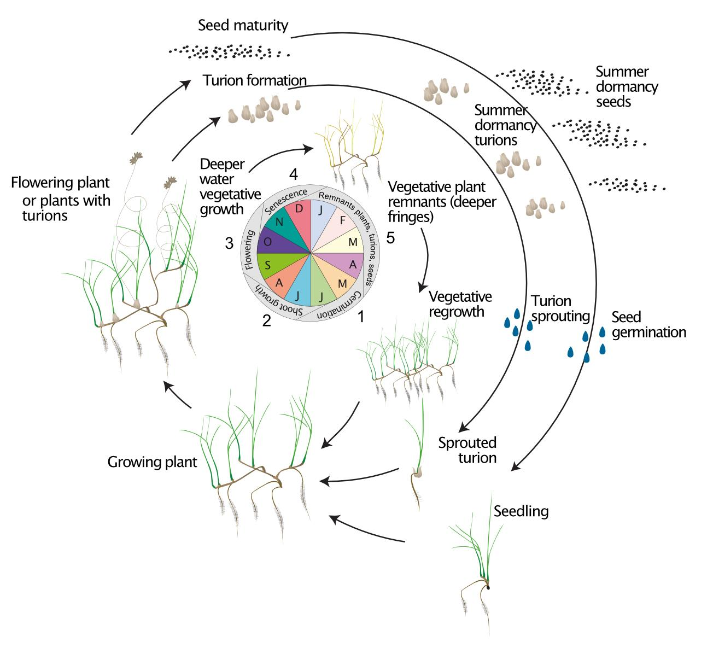
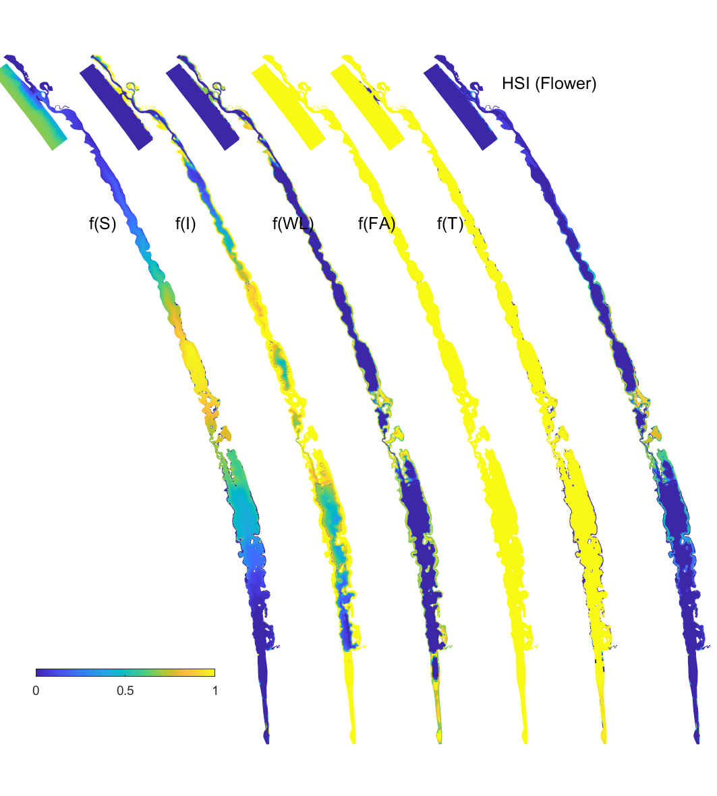
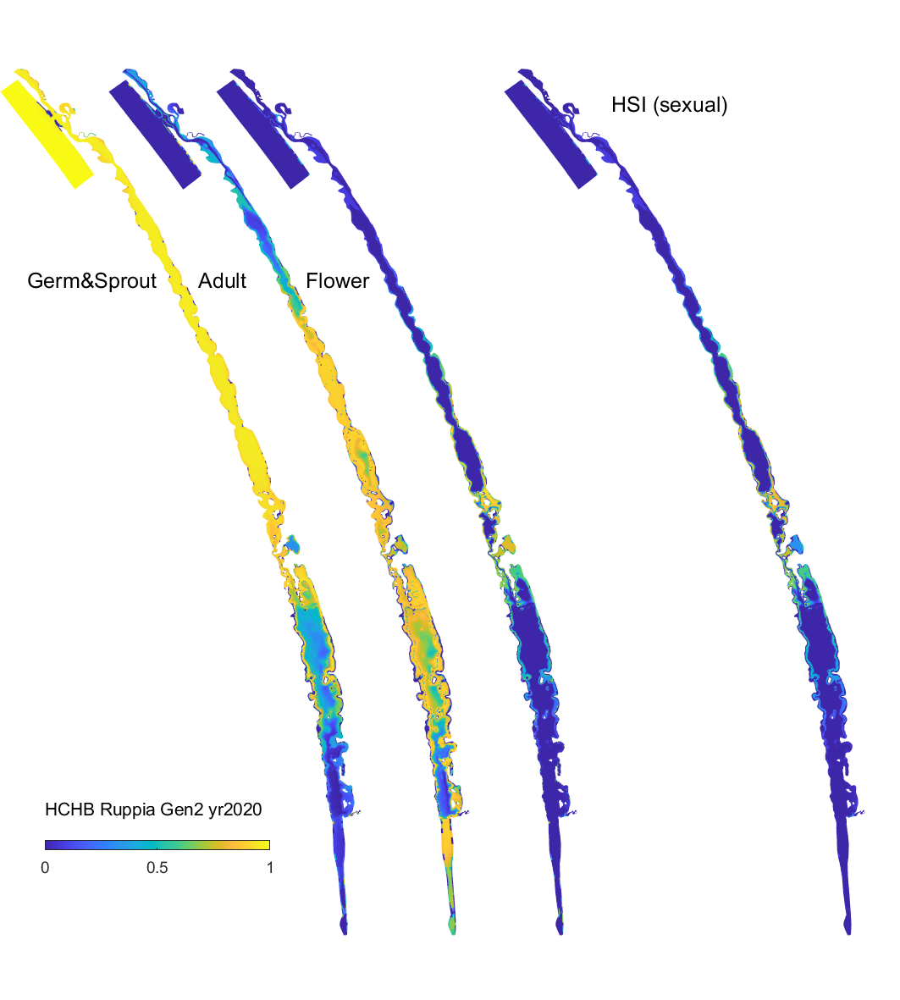

# Benthic Habitat Quality 

## Contributors

Matt Hipsey, Sherry Zhai

## Overview

The model simulates "habitat suitability" based on an assessment of
environmental conditions relative to the known requirements of the
studied species, for example, considering salinity, light, dissolved
oxygen and/or other environmental conditions. More specifically, a
relative index, Habitat Suitability Index (HSI), is defined based on
species tolerance thresholds and calculated to infer spatio-temporal
probabilities of habitat suitability. The HSI ranges from 0 to 1,
indicating habitat being least suitable to most suitable. For species
with distinct requirements for each life-stage (e.g., seed germination,
                                                egg incubation), the model assesses environmental conditions against
thresholds set for each life-stage. The model outputs HSI for each model
cell at each time step based on simulated environmental conditions from
the host model. The output can subsequently be processed and assessed in
a programming language (e.g., Matlab, R) according to the research
question. For example, for studies considering multiple life-stages in
the life cycle of a species (e.g., seed germination -- vegetative growth
                             -- flowering -- seed production), model output for each life-stage can
be integrated over a biological relevant period based on the typical
duration and seasonal timing, into an overall habitat suitability for
successful completion of its life cycle.

## Model Description - Ruppia Habitat

The model is originally based on an application to the Coorong Lagoon in
South Australia for a keystone seagrass species *Ruppia tuberosa*. *R.
tuberosa*'s annual life cycle includes several life-stages including
both sexual and asexual reproductive pathways, as indicated in Figure
\@ref(fig:ruppia-cycle). The identified environmental controls on growth
include salinity, temperature, light, water depth and macroalgae
presence. Refer to the [CDM
manual](https://aquaticecodynamics.github.io/cdm-science/habitat-modelling.html)
for further details on *Ruppia* and the Coorong.

The Habitat Suitability Index (HSI) is computed based on suitability of
conditions ($i$), for each of the main life-stages ($j$), by defining a
fractional index, $Φ^{HSIj}_{i}$. The fractional index for each
attribute is computed in each model cell ($c$) at each time step ($t$).
The individual functions are piece wise, based on synthesis of available
literature and analyses of survey data (Table \@ref(tab:hsi-function)).
Refer to the [CDM
manual](https://aquaticecodynamics.github.io/cdm-science/habitat-modelling.html)
for details on rationale.

```{r ruppia-cycle, echo = FALSE, out.width='75%', class = "text-image", fig.align='center', fig.cap = "Conceptual diagram of the *R. tuberosa* five-stage life cycle showing annual growth through three possible life cycle pathways: vegetative (whole plant survival); asexual persistence (turions); sexual (seed bank). (Source: Asanopoulos and Waycott, 2020)."}


```

### Feedbacks to the Host Model

The habitat module has no feedbacks to the host hydrodynamic model.

### Variable Summary

The diagnostic outputs able to be output are summarised in Table
\@ref(tab:ruppia-diag).

```{r ruppia-diag, echo=FALSE, message=FALSE, warning=FALSE}
library(knitr)
library(kableExtra)
library(readxl)
library(rmarkdown)
theSheet <- read_excel('tables/aed_variable_tables.xlsx', sheet = 'aed_habitat')
theSheet <- theSheet[theSheet$Table == "Diagnostics",]
theSheetGroups <- unique(theSheet$Group)
theSheet$`AED name` <- paste0("`",theSheet$`AED name`,"`")

for(i in seq_along(theSheet$Symbol)){
  if(!is.na(theSheet$Symbol[i])==TRUE){
    theSheet$Symbol[i] <- paste0("$$",theSheet$Symbol[i],"$$")
  } else {
    theSheet$Symbol[i] <- NA
  }
}
for(i in seq_along(theSheet$Unit)){
  if(!is.na(theSheet$Unit[i])==TRUE){
    theSheet$Unit[i] <- paste0("$$\\small{",theSheet$Unit[i],"}$$")
  } else {
    theSheet$Unit[i] <- NA
  }
}
for(i in seq_along(theSheet$Comments)){
  if(!is.na(theSheet$Comments[i])==TRUE){
    theSheet$Comments[i] <- paste0("",theSheet$Comments[i],"")
  } else {
    theSheet$Comments[i] <- " "
  }
}

kbl(theSheet[,3:NCOL(theSheet)], caption = "Diagnostics variables created by the AED Ruppia habitat module.", align = "l",escape = F) %>%
  pack_rows(theSheetGroups[1],
            min(which(theSheet$Group == theSheetGroups[1])),
            max(which(theSheet$Group == theSheetGroups[1])),
            background = '#ebebeb') %>%
#   pack_rows(theSheetGroups[2],
#             min(which(theSheet$Group == theSheetGroups[2])),
#             max(which(theSheet$Group == theSheetGroups[2])),
#             background = '#ebebeb') %>%
# 	pack_rows(theSheetGroups[3],
# 						min(which(theSheet$Group == theSheetGroups[3])),
# 						max(which(theSheet$Group == theSheetGroups[3])),
# 						background = '#ebebeb') %>%
row_spec(0, background = "#14759e", bold = TRUE, color = "white") %>%
  kable_styling(full_width = F,font_size = 11) %>%
  column_spec(2, width_min = "7em") %>%
  column_spec(3, width_max = "18em") %>%
  column_spec(4, width_min = "10em") %>%
  column_spec(5, width_min = "6em") %>%
  column_spec(7, width_min = "10em") %>%
  scroll_box(width = "770px", height = "305px",
             fixed_thead = FALSE)
```

<br>
  
  ### Parameter Summary
  
  The environmental thresholds and HSI functions used by this model are
summarised in Table \@ref(tab:hsi-function).

```{r hsi-function, echo=FALSE, message=FALSE, warning=FALSE}
#library(knitr)
library(kableExtra)
library(readxl)
#library(rmarkdown)
# library(dplyr)
#library(pander)

theSheet <- read_excel('tables/27-benthic_habitat_quality/hsi.xlsx', sheet =1)

# kbl(theSheet[,2:6],"html", caption = "Environmental thresholds and Habitat Suitability functions for *Ruppia* life stages used in the model.", align = "l",escape = F) %>%  #escape controls whether the syntax in table is interpreted
kbl(theSheet[,2:6], caption = "Environmental thresholds and Habitat Suitability functions for *Ruppia* life stages used in the model.", align = "l",escape = F) %>%  #escape controls whether the syntax in table is interpreted
  row_spec(0, background = "#14759e", bold = TRUE, color = "white") %>%
  
  kable_styling(full_width = F,font_size = 10) %>%
  column_spec(3, width_min = "15em") %>%
  #column_spec(5, width_min = "30em") %>%
  #column_spec(7, width_min = "20em") %>%
  pack_rows("Turion viability (Jan 1 – Mar 31)", 1, 1) %>%
  pack_rows("Seed germination (Apr 1 – Jun 30)", 2, 4) %>%
  pack_rows("Turion sprouting (Apr 1 – Jun 30)", 5, 8) %>% 
  pack_rows("Adult plant growth (Jun 1 – Sep 30)", 9, 13) %>%
  pack_rows("Flowering and seed set (Sep 1 – Dec 31)", 14, 18) %>%
  pack_rows("Turion formation (Sep 1 – Dec 31)", 19, 22)%>%
  scroll_box(width = "700px", height = "1600px",fixed_thead = T)

```

### Post-processing

The Habitat Suitability Index (HSI) computed at each time step ($t$) in
the habitat module can be integrated over a time window, specific to the
*Ruppia*'s life stage.

$$
\Phi^{HSI_{j}}_{i} = \frac{1}{t_{j_{\text{start}}}-t_{j_{\text{end}}}} \sum^{t_{j_{\text{end}}}}_{t=t_{j_{\text{start}}}}\Phi^{HSI_{j}}_{i}(i)_{t}
(\#eq:hab1)
\\
\scriptsize{
\\ \text{whereby: $i$ = {salinity, temperature, light, depth, algae}}
\\ \text{and: $j$ = {turion viability, seed germination, turion sprouting, adult growth, flowering, turion formation}}}
$$

The integration time for each life-stage, $j$, is selected from within
the available plant growth windows, as indicated in Table
\@ref(tab:timewindow).

```{r timewindow, echo=FALSE, message=FALSE, warning=FALSE}
theSheet <- read_excel('tables/27-benthic_habitat_quality/hsi.xlsx', sheet = 2)
kbl(theSheet[,1:5], caption = "Life-stage time windows over which environmental suitability for *Ruppia* is assessed.", align = "c",escape = F) %>%
row_spec(0, background = "#14759e", bold = TRUE, color = "white") %>%
  kable_styling(bootstrap_options = "basic",full_width = F,font_size = 10)
#  scroll_box(fixed_thead = FALSE)
```
<br>
The above function is computed in each cell and produces maps of
suitability for each environmental attribute for each life stage within
any given year. These are then overlaid to produce a final map for any
given year for:

-   An overall HSI sexual, representing the integrated habitat
    suitability for *Ruppia* to complete its annual life cycle by
    reproducing sexually, i.e., flowering, which includes i) emerging in
    autumn, either from germination from seed or sprouting from viable
    turions that survived the summer; ii) vegetative growth to adult
    plants in winter; and iii) successful flowering and producing seed
    in spring; or

-   An overall HSI asexual, representing the integrated habitat
    suitability for *Ruppia* to complete its annual life cycle by
    reproducing asexually, i.e., forming turions, which includes i)
    emerging in autumn, either from germination from seed or sprouting
    from viable turions that survived the summer; ii) vegetative growth
    to adult plants in winter; and iii) formation of turions in spring.
    Specifically: <br>
    
$$
    \Phi^{HSI sexual}_{c} = \text{min}\left[\text{max}\left[\Phi^{HSI_{seed}}_{i},\text{min}\left[\Phi^{HSI_{viability}}_{i},\Phi^{HSI_{sprout}}_{i}\right]\right],\Phi^{HSI_{adult}}_{i},\Phi^{HSI_{flower}}_{i}\right]_{c}
     (\#eq:hab2)
$$

$$
\Phi^{HSI asexual}_{c} = \text{min}\left[\text{max}\left[\Phi^{HSI_{seed}}_{i},\text{min}\left[\Phi^{HSI_{viability}}_{i},\Phi^{HSI_{sprout}}_{i}\right]\right],\Phi^{HSI_{adult}}_{i},\Phi^{HSI_{turion}}_{i}\right]_{c}
(\#eq:hab3)
$$ 

<br>
To compare the overall area of suitable habitat between years, or the
relative suitability of alternate scenarios, the fractional suitability
is used as a multiplier with the cell area, according to:
<br>

$$
A^{HSI} = \sum_{c} \Phi^{HSI}_{c} A_{c}
(\#eq:hab4)
$$

<br>
and the spatially averaged HSI in any given region (with area A) is
computed as:
<br>

$$
\overline{HSI} = \frac{1}{A}\sum_{c} \Phi^{HSI}_{c} A_{c}
(\#eq:hab5)
$$

<!-- ## Model Description - Fish Habitat -->

<!-- ### Feedbacks to the Host Model -->

<!-- ### Variable Summary -->

<!-- ### Parameter Summary -->

<!-- ### Post-processing -->

## Setup & Configuration

An example `aed.nml` parameter specification block for the `aed_habitat`
module is shown below:

<br>

```{fortran, eval = FALSE}
&aed_habitat_benthic
    simRuppiaHabitat  = 2
    diag_level  =  3
    rhsi_falg_link  = 'MAG_ulva_a_ben'
    rhsi_salg_link  = 'MAG_ulva_c'
/
```
<br>

## Case Studies & Examples

### Case Study

The Ruppia Habitat model was applied to the Coorong Lagoon in South
Australia. The Coorong Lagoon is a hypersaline system situated at the
end of the Murray-Darling basin and a Ramsar Wetland of international
importance (Figure \@ref(fig:coorongmap)). The growth of the keystone seagrass species *Ruppia
tuberosa* in this system is influenced by environmental factors such as
salinity, water level, light availability, temperature and macroalgae
presence. 
<br>
<center>
```{r coorongmap, fig.cap="Map of the Coorong Lagoon in South Australia.", echo=FALSE, message=FALSE, warning=FALSE, width = 400, height = 305}
library(leaflet)
library(dplyr)
# library(htmlwidgets)
# library(htmltools)
aed_icon  <- makeIcon(
  iconUrl = "maps/marker.png",
  iconWidth = 23, iconHeight = 23)

leaflet(height=385, width=500) %>%
  setView(lng = 139.453926, lat = -35.919571, zoom = 08) %>%
  addTiles() %>%
  addMarkers(lng = 139.453926, lat = -35.919571, popup = "Coorong Lagoon", icon = aed_icon)
```

</center>
<br>

The hydrodynamic-biogeochemical model TUFLOW-FV was coupled
with AED to simulate the hydrodynamic conditions (velocity, salinity,
temperature and water level), water clarity (light and turbidity) and
the potential for filamentous algae (nutrients and algae). Outputs were
used to assess habitat quality for various life-stages of *Ruppia* in
the `aed_habitat` module (examples are shown in Figure \@ref(fig:Gen2-HSIflower) and Figure \@ref(fig:Gen2-HSIsexual). Refer to [CDM manual](https://aquaticecodynamics.github.io/cdm-science/habitat-modelling.html)
for details of the study.
<br>

```{r Gen2-HSIflower, echo = FALSE, fig.align='center', out.width='60%', class = "text-image", fig.cap = "Habitat suitability (HSI) for the flowering plant phase of *Ruppia tuberosa* in the Coorong as a function of salinity f(S), light f(l), water level f(WL), temperature f(T) and presence of filamentous algae f(FA) for the base case in 2020. An HSI of 0 (dark purple) represents unsuitable habitat conditions, while an HSI of 1 represents optimal conditions (yellow)."}


```

```{r Gen2-HSIsexual, echo = FALSE, fig.align='center', out.width='60%', class = "text-image", fig.cap = "Overall HSI for the successful completion of the sexual life cycle calculated by integrating the HSI results for seed germination, turion viability and turion sprouting, adult plants, and flowering and seed set in the Coorong, for the Base Case in 2020. An HSI of 0 (dark purple) represents unsuitable habitat conditions, while an HSI of 1 represents optimal conditions (yellow)."}



```

<br>

### Publications

```{r echo=FALSE, message=FALSE, warning=FALSE}
library(gt)
library(tidyverse)
library(rmarkdown)

aed <- read.csv("tables/27-benthic_habitat_quality/pub.csv", check.names=FALSE)

aed %>%
  gt() %>%
  tab_options(container.height = px(500),
              container.width = pct(100),
              table.width = pct(100),
              container.overflow.y = TRUE,
              container.overflow.x = TRUE,
              table.font.size = 12,
              column_labels.background.color = "#14759e",
              row_group.background.color = "lightgrey",
              column_labels.font.weight = "bold",
              column_labels.font.size = 14) %>%
  fmt_markdown(columns = everything())


```
