```{r}
knitr::opts_chunk$set(cache = F)
knitr::opts_knit$set(root.dir = rprojroot::find_rstudio_root_file())
```

# Modelling Aquatic Eco-Dynamics: Overview of the AED modular simulation platform {.unnumbered}

## Welcome! {.unnumbered}

This is the online home of *Modelling Aquatic Eco-Dynamics*, a book on describing the AED (previously released as AED2) modelling platform for the simulation of aquatic ecosystem dynamics.

Inspired by [**bookdown**](https://github.com/rstudio/bookdown) and the Open Data movement in ecology and the environmental sciences, this book is open source. This encourages a collaborative approach to model development and discussion and ensures the approaches adopted by the user community are reproducible and publicly accessible for people worldwide.

The model platform has been applied to many diverse sites across the globe (Figure \@ref(fig:aed-sites)) and we hope it can be useful to help with your application!

```{r aed-sites, echo=FALSE, fig.cap="Locations", message=FALSE, warning=FALSE, cache=FALSE}
library(leaflet)
library(dplyr)
library(htmlwidgets)
library(htmltools)
aed_icon  <- makeIcon(
  iconUrl = "maps/marker.png",
  iconWidth = 23, iconHeight = 23)

aed_sites <- read.csv("maps/aed-sites.csv")
leaflet(height=400, width="auto") %>% addProviderTiles(providers$Esri.WorldGrayCanvas) %>%
  setView(lng = 0, lat = 0, zoom = 1) %>%
  addMarkers(data = aed_sites, ~Lon, ~Lat, popup = ~Model, icon = aed_icon)

```

## How to contribute? {.unnumbered}

You may be a new user seeking to understand how to get started, or you may be interested in tailoring a module to your research or management application. As modules evolve, through incremental improvements or wholesale changes, the experts working on these changes can ensure the latest information is available to the community by continuously updating and improving this book.

**bookdown** makes editing a book as easy as editing a wiki, provided you have a GitHub account ([sign-up at github.com](https://github.com/)). Once logged-in to GitHub, click on the 'edit me' icon highlighted with a red ellipse in the image below.

This will take you to an editable version of the the source [R Markdown](http://rmarkdown.rstudio.com/) file that generated the page you're on:

<center>

```{r editting, echo=FALSE, out.width = '100%'}
knitr::include_graphics("images/index/edit.png")
```

</center>

To raise an issue about the book's content (e.g. code not running) or make a feature request, check-out the [issue tracker](https://github.com/Robinlovelace/geocompr/issues).

Readers may also use the hypothes.is utility on the right margin of the book to add personal annotations and public comments on the book content.

Maintainers and contributors must follow this repository's [CODE OF CONDUCT](https://github.com/Robinlovelace/geocompr/blob/master/CODE_OF_CONDUCT.md).

## Editing the book {.unnumbered}

To build the book locally, clone or download the aed-science repo, load R in root directory (e.g. by opening aed-sceince.Rproj in RStudio) and run the following lines:

```{r eval=FALSE}

bookdown::render_book("index.Rmd") # to build the book
browseURL("_book/index.html") # to view it

```

## How to cite this book {.unnumbered}

Please cite this edited book and the AED model in scientific publications as: Hipsey, M.R., ed. (2022) Modelling Aquatic Eco-Dynamics: Overview of the AED modular simulation platform. Zenodo repository. DOI: 10.5281/zenodo.6516222.

If you would like to cite an individual chapter of this book (not the AED model), please use this format (example given here for chapter 4): Hipsey, M.R. and P. Huang. (2022) Chapter 4. Dissolved oxygen. Hipsey, M.R., ed. Modelling Aquatic Eco-Dynamics: Overview of the AED modular simulation platform. Zenodo repository. DOI: 10.5281/zenodo.6516222.

## Supporting the project {.unnumbered}

If you find AED useful, please support it by:

-   Telling people about it
-   Join our Slack channel: general-lake-model.slack.com
-   Communicating about the model in digital media, e.g. via the "AEDmodel" hashtag on Twitter
-   Citing the book, as described above
-   Contributing to this book via [GitHub](https://github.com/AquaticEcoDynamics/aed-science) or the AED model more broadly via [Github](https://github.com/AquaticEcoDynamics)

<a rel="license" href="http://creativecommons.org/licenses/by-nc-nd/4.0/"></a><br />This work is licensed under a <a rel="license" href="http://creativecommons.org/licenses/by-nc-nd/4.0/">Creative Commons Attribution-NonCommercial-NoDerivatives 4.0 International License</a>.

<!--chapter:end:index.Rmd-->

# Preface {-}

## Who is this book for? {-}

This book describes the scientific basis and technical details of the module within the AED library.

If you are a new user seeking to get started with water quality modelling, you may have undertaken an AED tutorial and are interested to setup your own site for the first time. Or, you may have your own conceptual model and are keen to build a tailored setup to simulate your site. Or, you may be ready to modify an AED module or create a whole new module for your research or management application.

Depending at what stage you are at in your model development journey, different parts of the book may be more relevant to you.

## Why AED? {-}

The AED modelling code-base is a community-driven library of modules and algorithms for simulation of "aquatic ecodynamics" - water quality, aquatic biogeochemistry, biotic habitat and aquatic ecosystem dynamics.

The AED software is unique as it is suitable for a very wide range water bodies types, including lakes, reservoirs, wetlands, ponds, estuaries and coastal waters. It has been applied to many research and water engineering projects across the world. Users select water quality and ecosystem variables they wish to simulate and are able to customize links and dependencies between modules.

Each <ins>module</ins> aims to be based on state-of-the-art science sourced from a wide variety of scientific literature, making the library one of the most advanced available to aquatic ecosystem modellers.

Importantly, this software is an open-source project, and the <ins>source code</ins> is accessible and customisable for specific applications. Most modules have numerous options and alternate algorithms so users can tailor the model to their specific needs, but inevitably, users will require flexibility to embed custom algorithms or functionality.

It is envisaged that the flexible nature of the model components will facilitate the model community to experiment with model structural complexity, to more easily share model innovations at the algorithm level, and support the development of common performance assessment approaches (for a discussion on model assessment, readers are referred to Hipsey et al., 2020).

## Acknowledgements {-}

We gratefully acknowledge financial support from the Australian Research Council 
(Grant IDs: LP130100756, LP150100451, DP130104078, LP110100040, LP0991254, LP110200975,
LP150100519) and the Water and Environment Group of BMT. Casper Boon, Louise Bruce, 
David Hamilton, Peisheng Huang, and Dan Paraska as well as all members, past and present, of 
the Aquatic EcoDynamics research group at the University of Western Australia 
provided valuable feedback and support critical for developing the AED model. Finally,
we thank members of the Global Lake Ecological Observatory Network (GLEON) for 
contributing to the model, providing use cases, and sharing feedback. Cayelan Carey
and Quinn Thomas helped with the final editing of the first version of this book 
prior to publication.

<!--chapter:end:03-preface.Rmd-->

# Introduction

```{r xaringanExtra, include = FALSE}
library(xaringanExtra)
xaringanExtra::use_panelset()
xaringanExtra::style_panelset_tabs(font_family = "inherit")
```

Author: Matthew R. Hipsey

## Scientific Overview {-}

The AED modelling library (termed ‘**AED**’ for short) consists of numerous modules that are designed as individual model ‘components’ able to be configured in a way that facilitates custom aquatic ecosystem conceptualisations – from very simple to very complex. Think of it like a set of jigsaw pieces that connect together to build a complete picture. Users select water quality and ecosystem variables they wish to simulate and then are able to customize connections and dependencies with other modules, including support for easy customisation at an algorithm level how model components operate (e.g. photosynthesis functions, sorption algorithms etc).

In general, model components consider the cycling of carbon, nitrogen and phosphorus, and other relevant components such as oxygen, and are able to simulate organisms including different functional groups of phytoplankton and zooplankton, and also organic matter. Modules to support simulation of water column and sediment geochemistry, including coupled kinetic-equilibria, are also included.


## Application Contexts {-}

The AED modules have been applied across wetlands, lakes, rivers and estuaries, by taking advantage of the standard coupling interface between the scientific modules and hydrodynamic drivers. Due to this flexibility, the model can be applied across a range of scales and contexts. For example, it can be coupled with a 0D box model, the 1D model GLM, or the 3D finite volume model TUFLOW-FV.

Applications of the model include:

-	Hypoxia in lakes or estuaries
-	Fish-kill risks
-	Harmful algal blooms
-	Pathogen risk
-	Nutrient cycling
-	Greenhouse-gases
-	Habitat quality
-	Floodplain response
-	Invasive species
-	Food web studies


## Navigating this book {-}

This is not the sort of book you read from cover to cover! The book has initial introductory material in the first 4 chapters, and then is followed by 5 major sections:

1) Part I: AED Water - Descriptions of the core “water” modules, those relevant to simulating basic water quality in the pelagic environment.
2) Part II: AED+ Water -  Description of the advanced “plus” water modules.
3) Part III: AED+ Benthic -  Description of the advanced benthic modules.
4) Part IV: AED+ Riparian -  Description of the advanced riparian modules.
5) Part V: Supporting Material.

The chapters within the Parts I-IV of the book typically map to a specific module within the AED code library. Each describes the scientific context of the module, provides technical descriptions for the model processes, and the provides summary information on the required module parameters, and configuration details. Where available, the modules also include case-studies to demonstrate the functionality and publications using the module that can be referred to for further information.

<!--chapter:end:04-intro.Rmd-->

# Nomenclature

Author: Matthew R. Hipsey

## Variables and Data Types

There is often confusion over the types of variables and data-types used within the modules. Standard terminology adopted in the $\mathrm{AED}$ system is described in Table \@ref(tab:vardatatypes).

<details open>
  <summary>
    Table \@ref(tab:vardatatypes)
  </summary>
```{r vardatatypes, echo=FALSE, message=FALSE, warning=FALSE}
library(knitr)
library(kableExtra)
library(hablar)
library(dplyr)
#options(knitr.kable.NA = '')
var_data_types <- read.csv("tables/05-nomenclature/var_data_types.csv", check.names=FALSE)
kable(var_data_types, format = "html", escape = F, align = "l", col.names = NULL, caption = "Variables and data types") %>%
  kable_styling(full_width = F) %>%
  column_spec(1, width_min = "10em") %>%
  column_spec(2, width_min = "10em") %>%
  row_spec(1:7, background = 'white') %>%
  scroll_box(width = "770px", height = "980px",
             fixed_thead = FALSE)
```
</details>

## A Note on Notation

The modules being described in this book each list the specific simulated variables and parameters, with summaries of the module specific notations. For consistency across the modules a standard mathematical notation is adopted.

### General Notation

The following symbols are used to denote commonly used variables:

- $t$ = time
- $N$ = number of groups (integer)
- $a, om, z$ = indices of various biological sub-groups, such as algae/phytoplankton, organic matter and zooplankton (integer)
- $\chi_{C:Y}^{group}$ = the stoichiometric ratio of “$group$” between element ""$C$"" and element “$Y$”  ($mmol$ $C$ $/$ $mmol$ $Y$)
- $f_{process}^{var}$ = function that returns the mass flux of “$process$” on “$var$”  ($mmol \text{ var}/m^3/time$)
- $R_{process}^{var}$ = the relative rate of “$process$” influencing the variable “$var$”  ($/time$)
- $F_{process}^{var}$ = the areal flux of variable “var” due to a “$process$”, applied at the sediment-water or air-water interface ($mmol \text{ var}/m^2$)
- $p_{source}^{group}$ = the preference of “$group$” for “$source$”  (0-1)
- $\Phi_{lim}^{group}[var]$ = dimensionless limitation or scaling function to account for the effect of “$lim$” on a “$group$” (-)
- $\Phi_{lim}^{process}[var]$ = dimensionless limitation or scaling function to account for the effect of “$lim$” (limiting) "$var$" on a “$process$” (-)
- $k^{var}$	= generic fraction related to “$var$”  (0-1)
- $\Theta_{config}^{group}$	= switch to configure selectable model component “$config$” for “$group$” (0,1,2,…)
- $K_{process}^{var}$ = half-saturation constant associated with a biogeochemical “$process$”, based on the concentration of variable “$var$” ($mmol \text{ var}/m^3$)
- $c,\theta,\gamma, \dotsb$ 		= miscellaneous coefficients  (various units)

### Model Domain and Position

The $\mathrm{AED}$ model links with a variety of models that have diverse approaches to discretize the spatial domain, ranging from an individual 'box' to a complex finite-volume mesh. The following standard descriptions are used:

- $c, sz$ = indices of computational cells, or sediment zones (integer)
- $\Delta z$ = generic vertical thickness of a computational cell or layer
- $\Delta z_{s}$ = vertical thickness of the surface computational cell or layer
- $\Delta z_{b}$ = vertical thickness of the bottom computational cell or layer
- $h$ = height above a reference point
- $z$ = depth below water surface
- $d$ = water depth
- $A$ = area

In the science descriptions within each module the dynamics are referred to usually at a generic point in space for convenience. However, we highlight that most variables and properties are resolved as vectors, spanning the number of cells in the computational domain. Note the following conventions:

- $C$ = generic use of a variable without a specific spatial position
- $C_c$ = denoting the value of a variable $C$ at the location of a specific cell, $c$
- $C_{sz}$ = denoting the value of a variable $C$ at the location of a specific sediment zone, $sz$

To highlight whether a process is particular to a certain set of cells within the domain we use:

- $f_{process}^{var}$ = generic use of a function that returns the mass flux of “$process$” on “$var$”  
- $\hat{f}_{process}^{var}$ = use of a function that returns the mass flux of “$process$” on “$var$” specific to a benthic process at the sediment-water interface
- $\check{f}_{process}^{var}$ = use of a function that returns the mass flux of “$process$” on “$var$” specific to a surface process at the air-water interface

To differentiate between a symbol that is referring to a scalar or a vector of cells we use:

- $C$ = generic use of a variable without a specific spatial position
- $\mathbf{C}$ = an array of the variable $C$ spanning the model's 1D, 2D or 3D spatial domain
- $f_{process}^{var}$ = generic “$process$” within the model without a specific spatial position
- $\mathbf{f}_{process}^{var}$ = an array of of values describing a “$process$”, spanning the model's 3D spatial domain
- $F_{process}^{var}$ = generic value or constant describing an areal flux of variable “var” due to a “$process$”
- $\mathbf{F}_{process}^{var}$ = an array of of values describing an areal flux of variable “var” due to a “$process$”, spanning the model's 2D spatial domain


### Environmental Conditions

As outlined in Table \@ref(tab:vardatatypes), $\mathrm{AED}$ refers to a specific class of variable denoted an environmental variable. These are provided to the $\mathrm{AED}$ modules from the host model - that is, they are external drivers of dynamics carried out by $\mathrm{AED}$. Key variables referred to commonly include:

- $T$ or $T_K$ = water temperature in Celsius or Kelvin, respectively ($^{\circ}C$, $K$)
- $S$ = water salinity in practical salinity units ($psu$)
- $I$ = light intensity ($W/m^2$)
- $u$ = generic water velocity ($m/s$)
- $\tau$ = shear stress ($N/m^2$)

Variables outside of the water may also be referred to:

- $U$ = wind speed, above the domain ($m/s$)
- $T_a$ = air temperature ($^{\circ}C$)
- $I_0$ = light intensity incident on the domain ($W/m^2$)


### Transport Reference Frame

As $\mathrm{AED}$ is designed to be agnostic of the host model spatial domain, and the transport of $\mathrm{AED}$ variables is managed by the host model, this book refers to transport in a generic way.

Each simulated state variable is subject to advection and turbulent mixing, plus boundary conditions, as managed by the host hydrodynamic model. The material derivative, $\frac{D}{Dt}$ is used to depict that the reactions and processes in the $\mathrm{AED}$ library (those summarised in the module descriptions) are undertaken superimposed on the movement of the water being simulated by the host model. For a generic non-reactive $\mathrm{AED}$ variable, $C$, this is:
<br>
\begin{equation}
\frac{D}{Dt}C = \frac{\partial C}{\partial t} + \mathbf{u} \cdot \nabla C
(\#eq:nomen1)
\end{equation}
<br>
where $\nabla$ is the gradient operator, which in the context of a hydrodynamic model, can be used to generically summarise the advection field:
<br>
\begin{equation}
\frac{D}{Dt}C = \frac{\partial C}{\partial t} +
u\frac{\partial C}{\partial x} + v\frac{\partial C}{\partial y} + w\frac{\partial C}{\partial z}
(\#eq:nomen2)
\end{equation}
where $u$, $v$, and $w$ are the water velocity in cartesian coordinates, $x$, $y$, and $z$.

As the $\mathrm{AED}$ model links with hydrodynamic models that use unstructured or non-standard computational domains, the exact transport solution and notation for a given model will necessarily be model-specific, but broadly consistent with the above.

Similarly, each model will resolve diffusion and turbulent mixing between computational cells in a unique way. For this reason we simply denote the process of "mixing" using the symbol $\mathbb{M}$. For a typical [RANS](https://en.wikipedia.org/wiki/Reynolds-averaged_Navier–Stokes_equations) hydrodynamic model this would be  $\mathbf{u} \cdot \nabla^2 C$. Some models, such as the [General Lake Model](https://gmd.copernicus.org/articles/12/473/2019/) (Hipsey et al., 2019), may however adopt a "bulk mixing" model, whereby mixing is resolved using a multi-step algorithm that is not so easily summarised.

The host model will also have various model-specific approaches for defining the model boundary conditions for simulated $\mathrm{AED}$ variables.  We therefore use the generic symbol $\mathcal{S}$ to represent sources of mass to a computational cell. $\mathcal{S}$ will be cell-specific, and would be zero for interior model cells not subject to source terms.

Therefore, the rate of change of a generic $\mathrm{AED}$ variable in an unspecified cell can be summarised as:
<br>
\begin{equation}
\frac{D}{Dt}C = \mathbb{M} + \mathcal{S} \quad \underbrace{\color{#ED7D31} \pm \color{#ED7D31} \dotsb \color{#ED7D31} f \color{#ED7D31} \dotsb}_{\text{AED terms}}
(\#eq:nomen3)
\end{equation}
where the *AED terms* on the RHS are the reaction or movement (e.g. settling) processes that are subsequently described throughout the remainder of this book.

<br>
In summary, generic notation is adopted to denote the effects of advection, mixing and boundary conditions that are managed by the host hydrodynamic model for $\mathrm{AED}$ simulated variables. Reactions, species interactions, and material or organism redistribution is the focus of the $\mathrm{AED}$ module library.
<br>

<!--chapter:end:05-nomenclature.Rmd-->

# Organisation of the Library & Module Structure

Author: Matthew R. Hipsey

## Library Design

The AED modelling library is organised as a series of “modules” that can be connected or “linked” through specific variable dependencies. By linking modules users can simulate most aquatic biogeochemical processes relevant to nutrient cycling, oxygen dynamics, harmful algal blooms, sediment/soil biogeochemistry, vegetation, pathogens etc. Each module can work alone or combined with other modules, depending on the complexity of targeted system.

A wide array of modules are available with some operational only in water, some operational where no water is present, and some can operate under both dry and wet conditions.

The current AED software is divided into 5 separate code-libraries: water, benthic, demo, dev, and riparian. Prior to the 2020 release, the model was distributed as two libraries: the first was the core AED2 library (libaed2) and the second is the advanced modules which are bundled together as AED2+ (libaed2-plus).

Currently there are 8 core modules in AED, and 12 advanced modules in AED+. For routine water quality assessments of lakes or estuaries, AED will suit most applications. For advanced users and researchers seeking to extend their simulation abilities, then AED+ includes numerous advanced options.

<center>
```{r diagram, echo=FALSE, out.width = '100%'}

```
</center>

## Model Structure
The philosophy of the AED/AED2 library is that biogeochemical and ecological modules have a standard class structure. State variables defined within each module are subject to transport and mass conservation, as managed by the scalar transport facility of the host hydrodynamic model (see Section 4).

Any AED module can have the ability to simulate a range of physical, chemical and biological processes, that can be generally classified as belonging to:

-	Feedback of chemical or biological attributes to physical properties of water (light extinction, drag, density)
-	Water column kinetic (time-varying) chemical / biological transformations (e.g., denitrification or algal growth)
-	Water column equilibrium (instantaneous) chemical transformations (e.g., PO~4~ adsorption)
-	Biogeochemical transformations in the sediment or biological changes in the benthos
-	Vertical sedimentation or migration
-	Fluxes across the air-water interface
-	Fluxes across the sediment-water interface
-	Fluxes across the terrestrial-water interface (riparian interactions)
-	Ecohydrological dynamics and biogeochemical transformations in the exposed (dry) cells
-	Feedbacks of soil and vegetation dynamics onto lake hydrodynamics and water balance

A general module structure in the figure above. Specific methods available within a module include those shown in the table. Note that not all methods must be used in modules; developers must choose which methods are relevant to a specific module. The only exception is “define”, which is compulsory for all modules to configure the chosen state variables, diagnostic variables, and set the necessary parameters and options.

## Module Summary

A high level overview of the simulatable modules are include in Table 3.1 below.

<head>
<meta name="viewport" content="width=device-width, initial-scale=1">
<style>
/* Style the buttons inside the tab */
.tab button {
  background-color: #2481AA;
  float: left;
  width: 50%;
  border: none;
  outline: none;
  cursor: pointer;
  padding: 14px 16px;
  transition: 0.3s;
  font-size: 17px;
  color: #FFFFFF;
  font-weight: bold;
}
</style>
</head>
<body>

<div class="tab">
  <button class="tablinks" onclick="opentab(event, 'AED-water')"id="defaultOpen">AED-water</button>
  <button class="tablinks" onclick="opentab(event, 'AED-benthic')">AED-benthic</button>
</div>

<div id="AED-water" class="tabcontent">
  <p>
    ```{r modules, echo=FALSE, message=FALSE, warning=FALSE}
library(knitr)
library(kableExtra)
publications <- read.csv("tables/06-organisation_and_structure/modules.csv", check.names=FALSE)
kable(publications,"html", escape = F, align = "c", caption = "Modules") %>%
  kable_styling(publications, bootstrap_options = "basic",
                full_width = F, position = "left", font_size = 12) %>%
  column_spec(1, width_min = "6em") %>%
  column_spec(2, width_min = "6em") %>%
  column_spec(3, width_min = "6em") %>%
  row_spec(1:8, background = 'white') %>%
  scroll_box(width = "750px", height = "620px",
             fixed_thead = FALSE)
    ```
  </p>
</div>

<div id="AED-benthic" class="tabcontent">
  <p>
```{r modules2, echo=FALSE, message=FALSE, warning=FALSE}
library(knitr)
library(kableExtra)
publications <- read.csv("tables/06-organisation_and_structure/modules2.csv", check.names=FALSE)
kable(publications,"html", escape = F, align = "c", caption = "Modules") %>%
  kable_styling(publications, bootstrap_options = "basic",
                full_width = F, position = "left", font_size = 12) %>%
  column_spec(1, width_min = "6em") %>%
  column_spec(2, width_min = "6em") %>%
  column_spec(3, width_min = "6em") %>%
  row_spec(1:4, background = 'white') %>%
  scroll_box(width = "750px", height = "620px",
             fixed_thead = FALSE)
```
  </p>
</div>

<script>
function opentab(evt, tabName) {
  var i, tabcontent, tablinks;
  tabcontent = document.getElementsByClassName("tabcontent");
  for (i = 0; i < tabcontent.length; i++) {
    tabcontent[i].style.display = "none";
  }
  tablinks = document.getElementsByClassName("tablinks");
  for (i = 0; i < tablinks.length; i++) {
    tablinks[i].className = tablinks[i].className.replace(" active", "");
  }
  document.getElementById(tabName).style.display = "block";
  evt.currentTarget.className += " active";
}
document.getElementById("defaultOpen").click();
</script>

</body>

<!--chapter:end:06-organisation_and_structure.Rmd-->

# (PART)  AED Water Modules{-} 

# Dissolved Oxygen {#DO_1}

## Contributors

Matthew R. Hipsey and Peisheng Huang

## Overview

Dissolved Oxygen ($DO$ or $O_2$) is considered to be one of the most important indicators of aquatic ecosystem conditions and is commonly used in models of water quality. Eutrophication and climate change pressures are exacerbating issues of hypoxia and anoxia in waters, ranging from small wetlands, lakes, and the coastal ocean.

$O_2$ dynamics respond to processes of atmospheric exchange, sediment oxygen demand, microbial respiration during organic matter mineralisation and nitrification, photosynthetic oxygen production and respiratory oxygen consumption, chemical oxygen demand, and respiration by other biotic components such as seagrass and bivalves.

The $\mathrm{AED}$ oxygen module is suitable for a wide range of waterbody types, from ponds and wetlands, to lakes estuaries and the coastal ocean.

## Model Description

This module supports one state variable to capture the oxygen concentration, $O_2$. The module is a low-level module that supports the two core processes of air-water exchange, $\check{f}_{atm}^{O_2}$, and sediment-water exchange, $\hat{f}_{sed}^{O_2}$, and is designed to be linked to by other modules that interact with oxygen. The dynamics of $O_2$ can therefore be summarised as:

\begin{eqnarray}
\frac{D}{Dt}O_2 =  \color{darkgray}{ \mathbb{M} + \mathcal{S} } \quad
&+&   \overbrace{\check{f}_{atm}^{O_2}+\hat{f}_{sed}^{O_2}}^\text{aed_oxygen} \\
(\#eq:oxy1)
&-& \color{brown}{ f_{min}^{DOC} - f_{nitrf}^{NH_4} - f_{ch4ox}^{CH_4} - f_{h2sox}^{H_2S} - f_{feox}^{FeII} } \\ \nonumber
&+& \color{brown}{ f_{gpp}^{PHY}	- f_{rsp}^{PHY} - f_{rsp}^{ZOO} + \hat{f}_{gpp}^{MAC} - \hat{f}_{rsp}^{MAC}} \\ \nonumber
&+& \color{brown}{f_{gpp}^{MAG} - f_{rsp}^{MAG} - \hat{f}_{rsp}^{BIV} } \\ \nonumber
\end{eqnarray}

where $\mathbb{M}$ and $\mathcal{S}$ refer to water mixing and boundary source terms, respectively, and the coloured $\color{brown}{f}$ terms reflect the optionally configurable contributions from other modules; these include the breakdown of $DOC$ by aerobic heterotrophic bacteria to $CO_2$, whereby a stoichiometrically equivalent amount of oxygen is removed, chemical oxidation reactions, such as nitrification or sulfide oxidation, photosynthetic oxygen production and respiratory consumption by phytoplankton, and also oxygen consumed and produced by any benthic biological groups.

### Process Descriptions

<!-- previously from 'aed2_oxygen : oxygen solubility & atmospheric exchange' on website version-->
#### Oxygen solubility & atmospheric exchange {-}
Atmospheric exchange is typically modelled based on @wanninkhof1992 and the flux equation of @schlungbaum1976 for the open water, and on @ho2011 for estuarine environments. The instantaneous flux at the air-water interface, $\mathcal{F}_{atm}^{O_2}$, depends on the oxygen gradient between the air and water and the gas transfer or piston velocity, $k_{piston}$ $(m/s)$ :
\begin{equation}
								\mathcal{F}_{atm}^{O_2} = k_{piston}^{O_2} \left({O_2}_{air} - {O_2}_{s}\right) (\#eq:oxy2)
\end{equation}
where ${O_2}_{s}$ is the oxygen concentration in the surface waters near the air-water interface and $C_{air}$ is the concentration of oxygen in the air phase near the interface ($mmol$ $O_2/m^3$). A positive flux represents input of oxygen from the atmosphere to the water. ${O_2}_{air}$ is dependent on temperature, $T$, salinity, $S$ and atmospheric pressure, $p$, as given by:
\begin{eqnarray}
							{O_2}_{air}\left[T,S,p \right]
							&=& \tfrac{32}{1000} \: 1.42763 \: \Phi_{p}^{atm} \\
							&\times&\exp \left\{ -173.4292+249.6339 \left[\tfrac{100}{T_K}\right] + 143.3483 \ln \left[ \tfrac{T_K}{100}\right] - 21.8492 \left[\tfrac{T_K}{100}\right] \right. \nonumber \\
							&+& \left. S\left(-0.033096 +0.014259 \left[\tfrac{T_K}{100}\right] -0.0017 \left[\tfrac{T_K}{100}\right]^2 \right) \right\}
							(\#eq:oxy3)
\end{eqnarray}
where $T_K$ is temperature in degrees Kelvin, salinity is expressed as parts per thousand and atmospheric pressure is in kPa. The pressure correction function, $\Phi_{p}^{atm}$ varies between one and zero for the surface and high altitudes respectively:
\begin{equation}
							\Phi_{p}^{atm}[p]=\frac{p_H}{p_{SL}}\left[1-\frac{p_{vap}}{p_H}\right]/\left[1-\frac{p_{vap}}{p_{SL}}\right].
(\#eq:oxy4)
\end{equation}
where $p_H$ and $p_{SL}$ is the pressure at the altitude of the simulation domain ($H$) and at sea level, respectively.

As $\mathrm{AED}$ can be applied across many types of environments, spanning the ocean to small lakes and flowing waters, users can select from a range of $k_{piston}$ options, or implement their own, to capture this process. The options of $k$ methods are listed in the [Gas Transfer] section of [Generic utilities & Functions](#genericUtilitiesFunctions) chapter.

Once the exchange flux is computed it is applied to the surface cells of the simulated domain, and the change in the $O_2$ concentration in the surface layer is:

\begin{equation}
\check{f}_{atm}^{O_2} = \frac{\mathcal{F}_{atm}^{O_2}}{\Delta z_{surf}}                          
(\#eq:oxy5)
\end{equation}
where $\Delta z_{surf}$ is the surface layer thickness.

#### Sediment oxygen demand {-}
Modelling sediment oxygen demand ($SOD$) can take a variety of forms. The simplest form in $\mathrm{AED}$ is the "static" model whereby $SOD$ varies as a function of the overlying water temperature and bottom water dissolved oxygen concentration:
\begin{equation}
  \mathcal{F}_{sed}^{O_2}[T,O_2] = F_{sed}^{oxy} \: \theta_{sod}^{T-20} \: \Phi_{sod}^{oxy}\left[O_2\right]
	(\#eq:oxy6)
\end{equation}
where $F_{sed}^{oxy}$ is the maximum oxygen flux across the sediment-water interface at $20^{\circ}C$. The oxygen limitation is computed based on:

\begin{equation}
\Phi_{sod}^{oxy}\left[O_2\right]=\frac{O_2}{K_{sod}^{oxy}+O_2}
(\#eq:oxy7)
\end{equation}

where $K_{sod}^{oxy}$ is the half-saturation constant controlling the sediment oxygen demand. Once the exchange flux is computed it is applied to the bottom cells of the simulated domain, and the change in the $O_2$ concentration in the bottom layer is:

\begin{equation}
\hat{f}_{sed}^{O_2} = \frac{\mathcal{F}_{sed}^{O_2}}{\Delta z_{bot}}                          
(\#eq:oxy8)
\end{equation}
where $\Delta z_{bot}$ is the bottom layer thickness.

**Spatially variable sediment fluxes**: The approach described above is the most simple and default method for capturing oxygen fluxes into the sediment, and is referred to as the static model. This approach can be extended to allow for spatial variability in $F_{sed}^{oxy}$ by engaging the link to the `aed_sedflux` module, where the host models support multiple benthic cells or zones. In this case, users input spatially discrete values of $F_{sed}^{oxy}$.

**Dynamically varying sediment flux rates**: Where dynamic rates of $O_2$ are required to flux to the sediment (e.g. in response to episodic loading of organic material to the sediment, or for assessment of long-term changes in sediment quality), then the above expressions may be replaced instead with dynamically calculated variables in `aed_seddiagenesis` via a link created with the `aed_sedflux` module.


### Optional Module Links

Other oxygen sources/sinks are indicated in Eq \@ref(eq:oxy1). These include:

- Oxygen consumption during bacterial mineralisation of DOC is done in the organic matter module - [aed_organic_matter][Organic Matter];
- Oxygen consumption during nitrification is done in the nitrogen module - [aed_inorganic_nitrogen][Inorganic Nitrogen];
- Oxygen production/consumption by phytoplankton phtosynthesis/respiration is done in the phytoplankton module - [aed_phytoplankton][Phytoplankton];
- Oxygen consumption due to zooplankton respiration is done in the zooplankton module - [aed_zooplankton][Zooplankton];
- Oxygen production/consumption by seagrass phtosynthesis/respiration is done in the macrophyte module - aed_macrophyte;
- Oxygen consumption due to bivalve respiration is done in the benthic module - [aed_bivalve][Bivalves].


### Feedbacks to the Host Model

The oxygen module has no feedbacks to the host hydrodynamic model.


### Variable Summary

The default variables created by this module, and the optionally required linked variables needed for full functionality of this module are summarised in Table \@ref(tab:10-statetable). The diagnostic outputs able to be output are summarised in Table \@ref(tab:10-diagtable).

#### State variables {-}


```{r 10-statetable, echo=FALSE, message=FALSE, warning=FALSE}
library(knitr)
library(kableExtra)
library(readxl)
library(rmarkdown)
theSheet <- read_excel('tables/carbonTableNewGrouping.xlsx', sheet = 4)
theSheet <- theSheet[theSheet$Table == "State variable",]
theSheetGroups <- unique(theSheet$Group)
theSheet$`AED name` <- paste0("`",theSheet$`AED name`,"`")

for(i in seq_along(theSheet$Symbol)){
  if(!is.na(theSheet$Symbol[i])==TRUE){
    theSheet$Symbol[i] <- paste0("$$",theSheet$Symbol[i],"$$")
  } else {
    theSheet$Symbol[i] <- NA
  }
}
for(i in seq_along(theSheet$Unit)){
  if(!is.na(theSheet$Unit[i])==TRUE){
    theSheet$Unit[i] <- paste0("$$\\small{",theSheet$Unit[i],"}$$")
  } else {
    theSheet$Unit[i] <- NA
  }
}
for(i in seq_along(theSheet$Comments)){
  if(!is.na(theSheet$Comments[i])==TRUE){
    theSheet$Comments[i] <- paste0("",theSheet$Comments[i],"")
  } else {
    theSheet$Comments[i] <- " "
  }
}

kbl(theSheet[,3:NCOL(theSheet)], caption = "Oxygen - state variables", align = "l",) %>%
  pack_rows(theSheetGroups[1],
            min(which(theSheet$Group == theSheetGroups[1])),
            max(which(theSheet$Group == theSheetGroups[1])),
            background = '#ebebeb') %>%
  pack_rows(theSheetGroups[2],
            min(which(theSheet$Group == theSheetGroups[2])),
            max(which(theSheet$Group == theSheetGroups[2])),
            background = '#ebebeb') %>%
  row_spec(0, background = "#14759e", bold = TRUE, color = "white") %>%
	kable_styling(full_width = F,font_size = 11) %>%
	column_spec(2, width_min = "7em") %>%
	column_spec(3, width_max = "18em") %>%
	column_spec(4, width_min = "10em") %>%
	column_spec(5, width_min = "5em") %>%
	column_spec(7, width_min = "10em") %>%
	column_spec(7, width_max = "20em") %>%
  scroll_box(width = "770px", height = "200px",
             fixed_thead = FALSE)
```


#### Diagnostics{-}


```{r 10-diagtable, echo=FALSE, message=FALSE, warning=FALSE}
library(knitr)
library(kableExtra)
library(readxl)
library(rmarkdown)
theSheet <- read_excel('tables/carbonTableNewGrouping.xlsx', sheet = 4)
theSheet <- theSheet[theSheet$Table == "Diagnostics",]
theSheetGroups <- unique(theSheet$Group)
theSheet$`AED name` <- paste0("`",theSheet$`AED name`,"`")

for(i in seq_along(theSheet$Symbol)){
  if(!is.na(theSheet$Symbol[i])==TRUE){
    theSheet$Symbol[i] <- paste0("$$",theSheet$Symbol[i],"$$")
  } else {
    theSheet$Symbol[i] <- NA
  }
}
for(i in seq_along(theSheet$Unit)){
  if(!is.na(theSheet$Unit[i])==TRUE){
    theSheet$Unit[i] <- paste0("$$\\small{",theSheet$Unit[i],"}$$")
  } else {
    theSheet$Unit[i] <- NA
  }
}
for(i in seq_along(theSheet$Comments)){
  if(!is.na(theSheet$Comments[i])==TRUE){
    theSheet$Comments[i] <- paste0("",theSheet$Comments[i],"")
  } else {
    theSheet$Comments[i] <- " "
  }
}

kbl(theSheet[,3:NCOL(theSheet)], caption = "Oxygen - *diagnostic* variables", align = "l",) %>%
  pack_rows(theSheetGroups[1],
            min(which(theSheet$Group == theSheetGroups[1])),
            max(which(theSheet$Group == theSheetGroups[1])),
            background = '#ebebeb') %>%
  pack_rows(theSheetGroups[2],
            min(which(theSheet$Group == theSheetGroups[2])),
            max(which(theSheet$Group == theSheetGroups[2])),
            background = '#ebebeb') %>%
	pack_rows(theSheetGroups[3],
						min(which(theSheet$Group == theSheetGroups[3])),
						max(which(theSheet$Group == theSheetGroups[3])),
						background = '#ebebeb') %>%row_spec(0, background = "#14759e", bold = TRUE, color = "white") %>%
  kable_styling(full_width = F,font_size = 11) %>%
            column_spec(2, width_min = "7em") %>%
	          column_spec(3, width_max = "18em") %>%
	          column_spec(4, width_min = "10em") %>%
	          column_spec(5, width_min = "6em") %>%
						column_spec(7, width_min = "10em") %>%
	          scroll_box(width = "770px", height = "305px",
            fixed_thead = FALSE)
```

<br>

### Parameter Summary

The parameters and settings used by this module are summarised in Table \@ref(tab:10-parstable).


```{r 10-parstable, echo=FALSE, message=FALSE, warning=FALSE}
library(knitr)
library(kableExtra)
library(readxl)
library(rmarkdown)
theSheet <- read_excel('tables/carbonTableNewGrouping.xlsx', sheet = 4)
theSheet <- theSheet[theSheet$Table == "Parameter",]
theSheetGroups <- unique(theSheet$Group)
theSheet$`AED name` <- paste0("`",theSheet$`AED name`,"`")

for(i in seq_along(theSheet$Symbol)){
  if(!is.na(theSheet$Symbol[i])==TRUE){
    theSheet$Symbol[i] <- paste0("$$",theSheet$Symbol[i],"$$")
  } else {
    theSheet$Symbol[i] <- " "
  }
}
for(i in seq_along(theSheet$Unit)){
  if(!is.na(theSheet$Unit[i])==TRUE){
    theSheet$Unit[i] <- paste0("$$\\small{",theSheet$Unit[i],"}$$")
  } else {
    theSheet$Unit[i] <- NA
  }
}
for(i in seq_along(theSheet$Comments)){
  if(!is.na(theSheet$Comments[i])==TRUE){
    theSheet$Comments[i] <- paste0("",theSheet$Comments[i],"")
  } else {
    theSheet$Comments[i] <- "-"
  }
}

kbl(theSheet[,3:NCOL(theSheet)], caption = "Oxygen module parameters and configuration options", align = "l",) %>%
  pack_rows(theSheetGroups[1],
            min(which(theSheet$Group == theSheetGroups[1])),
            max(which(theSheet$Group == theSheetGroups[1])),
            background = '#ebebeb') %>%
  pack_rows(theSheetGroups[2],
            min(which(theSheet$Group == theSheetGroups[2])),
            max(which(theSheet$Group == theSheetGroups[2])),
            background = '#ebebeb') %>%
  pack_rows(theSheetGroups[3],
					  min(which(theSheet$Group == theSheetGroups[3])),
					  max(which(theSheet$Group == theSheetGroups[3])),
					  background = '#ebebeb') %>%
  row_spec(0, background = "#14759e", bold = TRUE, color = "white") %>%
  kable_styling(full_width = F,font_size = 11) %>%
	column_spec(2, width_min = "7em") %>%
	column_spec(3, width_max = "19em") %>%
	column_spec(4, width_min = "10em") %>%
	column_spec(5, width_min = "5em") %>%
	column_spec(7, width_min = "10em") %>%
  scroll_box(width = "770px", height = "500px",
             fixed_thead = FALSE)
```
<br>


## Setup & Configuration

An example `aed.nml` parameter specification block for the `aed_oxygen` module is shown below:
```{fortran, eval = FALSE}
&aed_oxygen
   oxy_initial       = 250.0 
   oxy_min           =   0 
   oxy_max           = 500 
   Fsed_oxy          = -40.0
   Ksed_oxy          = 100.0
   theta_sed_oxy     =   1.08
!  Fsed_oxy_variable = 'SDF_Fsed_oxy'
!  altitude          = 1000  
 /
```

Note that when users link `Fsed_oxy_variable` then `Fsed_oxy` is not required as this parameter will be set for each each sediment zone from values input via the `aed_sedflux` module. The entries `oxy_min` and `oxy_max` are optional.

## Case Studies & Examples

### Case Study: Swan-Canning Estuary

The Swan-Canning Estuary in Western Australia experiences hypoxia and anoxia due to the strong salt-wedge that forms within the system, and the high sediment oxygen demand. @huang2018 used the `aed_oxygen` model with the TUFLOW-FV hydrodynamic model to capture the large spatio-temporal variability in oxygen distribution.

<br>

<center>
```{r swan-map, fig.cap="Map of the Swan-Canning Estuary in Western Australia.", echo=FALSE, message=FALSE, warning=FALSE, width = 501, height = 385}
library(leaflet)
leaflet(height=385, width=500) %>%
  setView(lng = 115.835235, lat = -31.991618, zoom = 11) %>%
  addTiles() %>%
  addProviderTiles(providers$Stamen.Terrain)  %>%
  addMarkers(lng = 115.835235, lat = -31.991618, popup = "Swan River")
```
</center>

<br>

Using spatial zones with different values of `Fsed_oxy`, the simulations show very high accuracy in resolving the "dome" of low oxygen associated with the salt-wedge.

<br>

<center>

```{r oxygen1, echo=FALSE, fig.cap="Cross-section plots comparing modelled and field salinity (psu, left) and $O_2$ (mg/L, right) for Sep-Dec 2008 within the Swan River. The field plots are based on contouring approx. 20 profile data locations.", out.width = '100%'}
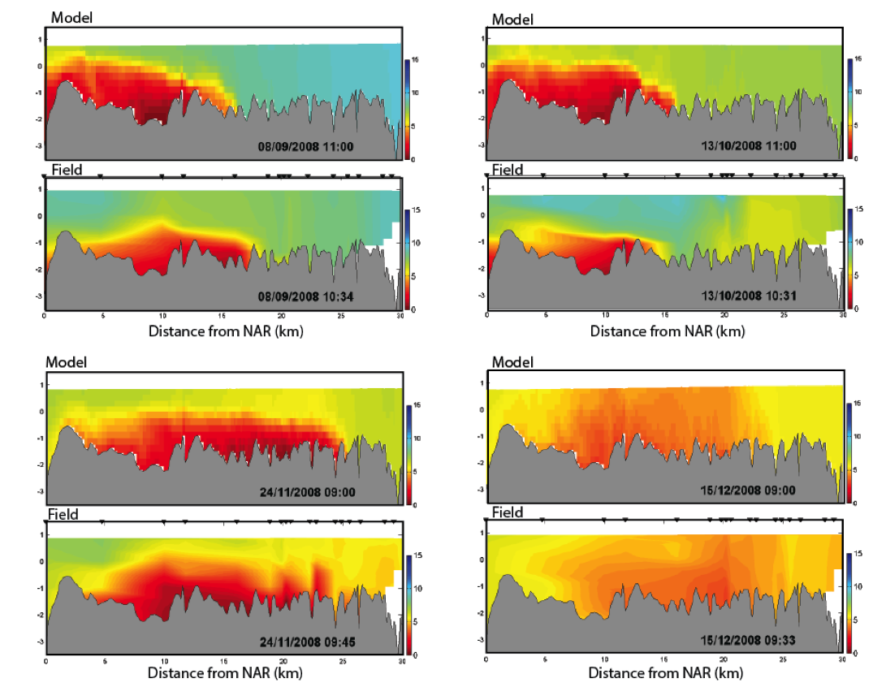
```

</center>

The results of the model were integrated over the length of the modelled domain to demonstrate the model's performance in capturing the system-scale areal extent of hypoxia ($O_2<4\:mg/L$) and anoxia ($O_2<2\:mg/L$). @huang2018 also used the validated model to explore different remediation options based on artificial oxygenation inputs. 

<center>

```{r anoxia2, echo=FALSE, fig.cap="The total area of anoxia (<2 mg O2 / L) and hypoxia (<4 mg O2 / L) within the estuary for a) 2008 and b) 2010, comparing the model (black line) and spatially interpolated weekly profile data (shaded region).", out.width = '80%'}
knitr::include_graphics("images/oxygen_example2.png")
```

</center>

### Publications


```{r echo=FALSE, message=FALSE, warning=FALSE}
library(gt)
library(tidyverse)
library(kableExtra)
library(rmarkdown)

aed <- read.csv("tables/10-oxygen/oxy_pubs.csv", check.names=FALSE)

aed %>%
  gt() %>%
  tab_options(container.height = px(500),
              container.width = pct(100),
              table.width = pct(100),
              container.overflow.y = TRUE,
              container.overflow.x = TRUE,
              table.font.size = 12,
              column_labels.background.color = "#14759e",
              row_group.background.color = "lightgrey",
              column_labels.font.weight = "bold",
              column_labels.font.size = 14) %>%
  fmt_markdown(columns = everything())


```
<div style="display:none;">
@ward2020
@snortheim2017
@farrell2020
@ladwig2021
@bruce2015model
@bruce2014
@carey2022
@huang2019
</div>

<!--chapter:end:10-dissolved_oxygen.Rmd-->

---
editor_options:
  markdown:
    wrap: 72
---

# Inorganic Carbon {#Carbon_1}

## Contributors

Peisheng Huang, Kamilla Kurucz, and Matthew R. Hipsey

## Overview

Understanding carbon cycling is central to understanding food webs and
how aquatic communities are structured and supported [@Dodds2020].
Exchange of carbon between aquatic systems and the atmosphere is also
fundamental in influencing climate [e.g. @cai2011; @borges2011].
Accordingly, there are a wide range of applications that require
simulation of carbon species. 

The $\mathrm{AED}$ library can be used to simulate both the organic and
inorganic pools of carbon. As carbon is a core building block of an
aquatic ecosystem, `aed_carbon` ($\mathrm{CAR}$) is designed as a
low-level module for managing inorganic carbon pools, and is able to be
linked to by higher level modules associated with organic matter
cycling, primary production, and other biotic groups. In particular,
organic carbon is the currency of energy exchange through food webs, and
the processes for modelling organic carbon are described in
[aed_organic_matter][Organic Matter]. This chapter presents the forms of
inorganic carbon and fluxes of carbon in the aquatic environment and how
they are modelled in the `aed_carbon` module.

## Model Description

The core variables included in the `aed_carbon` module are Dissolved
Inorganic Carbon (DIC) and methane (CH4).

The dynamics for DIC is captured in the model when `simDIC = .true.`.
The rate of change of DIC concentration as it moves with the water is
calculated from local effects associated with air-water exchange
($\check{f}_{atm}^{CO_2}$), oxidation of CH4, ($f_{ox}^{CH_4}$), and
sediment-water exchange ($\hat{f}_{sed}^{DIC}$), which is summarized as:

```{=tex}
\begin{eqnarray}
\frac{D}{Dt}DIC =  \color{darkgray}{ \mathbb{M} + \mathcal{S} } \quad
&+&   \overbrace{\check{f}_{atm}^{CO_2}+f_{ox}^{CH_4}+\hat{f}_{sed}^{DIC}  }^\text{aed_carbon} \\ (\#eq:car1)
&+& \color{brown}{ f_{min}^{DOC} - f_{gpp}^{PHY} + f_{rsp}^{PHY} + f_{rsp}^{ZOO} } \\ \nonumber
&-& \color{brown}{ \hat{f}_{gpp}^{MAC} + \hat{f}_{rsp}^{MAC} - f_{gpp}^{MAG} - f_{rsp}^{MAG} + \hat{f}_{rsp}^{BIV} } \\ \nonumber
\end{eqnarray}
```
where $\mathbb{M}$ and $\mathcal{S}$ refer to water mixing and boundary
source terms, respectively, and the coloured $\color{brown}{f}$ terms
reflect DIC fluxes computed by other (optionally) linked modules such as
modules of organic matter ($\mathrm{OMG}$), phytoplankton
($\mathrm{PHY}$) or zooplankton ($\mathrm{ZOO}$).

The dynamics for CH4 is captured in the model when `simCH4 = .true.`.
CH4 is formed during the decomposition of organic material by microbial
methanogenesis [e.g. @cicerone1988], which requires
strictly anaerobic conditions and is therefore usually restricted to be
deep within aquatic sediment. Inputs to the water therefore are from
sediment CH4 production, which can enter the water column either as a
dissolved flux or via ebullition (bubble release), or from external
sources such as wastewater discharges. Once in the water, dissolved CH4
is the balance between inputs from the sediment and losses from
air-water exchange and CH4 oxidation to DIC.

The rate of change of CH4 concentration as it moves with the water is
therefore calculated as:

```{=tex}
\begin{eqnarray}
\frac{D}{Dt}CH_4 =  \color{darkgray}{ \mathbb{M} + \mathcal{S} } \quad
&+&   \overbrace{\check{f}_{atm}^{CH_4}-f_{ox}^{CH_4}+\hat{f}_{sed}^{CH_4} +f_{dis}^{CH_{4-bubble}} }^\text{aed_carbon} \\ (\#eq:car2)
\end{eqnarray}
```
where $\check{f}_{atm}^{CH_4}$ is the air-water exchange of dissolved
methane and $\hat{f}_{sed}^{CH_4}$ is the sediment diffusive release
flux. Bubbles moving through the water column after release from the
sediment can also dissolve, denoted $f_{dis}^{CH_{4-bubble}}$.

The details of how each flux relevant to DIC and CH4 is calculated, and
the associated parameter settings, are described in the next sections.
For details on how to model organic carbon refer to the
`aed_organic_matter` model.

### Process Descriptions

#### Carbonate buffering and pH

In most circum-neutral waters the carbonate buffer system controls the
pH conditions within the water. When CO2 within the atmosphere
($CO_{2(gas)}$) is dissolved in water, it can exist in a variety of
forms. Initially, carbon dioxide will dissolve, $CO_{2_{(aq)}}$, which
can then form carbonic acid, $H_2CO_3$, and dissociate into bicarbonate,
$HCO_3^-$, and carbonate, $CO_3^{2-}$, ions.

```{=tex}
\begin{eqnarray}
CO_{2_{(aq)}} &\rightleftharpoons& CO_{2_{(gas)}}
\\
CO_{2_{(aq)}} + H_2O &\rightleftharpoons& H_2CO_3
\\
H_2CO_3 &\rightleftharpoons& H^+ + HCO_3^-
\\
HCO_3^- &\rightleftharpoons& H^+ + CO_3^{2-}
\end{eqnarray}
```
<center>

```{r carbonPlotly, fig.cap="Bjerrum plot of DIC speciation.", echo=FALSE, message=FALSE, warning=FALSE}
library(seacarb)
library(plotly)
pH <- seq(2, 12, by = 0.1)
res <- speciation(K1(), K2(), NULL, pH, 1)

df <- as.data.frame(res)

plot_ly(df, x = pH) %>%
  add_trace(y = ~C1, name = 'CO<sub>2</sub>', mode = 'lines', line = list(color = '#FF2500')) %>%
  add_trace(y = ~C2, name = 'HCO<sub>3</sub><sup>-</sup>', mode = 'lines', line = list(color = '#01A08A',dash = 'dash')) %>%
  add_trace(y = ~C3, name = 'CO<sub>3</sub><sup>2-</sup>', mode = 'lines', line = list(color = '#F2AD00',dash = 'dot')) %>%
  add_trace(x=c(5.84717, 5.84717), y=c(-0.5, 1.5), mode="lines", name='pK1', opacity = 0.75, line = list(color = 'grey', width = 1.5)) %>%
  add_trace(x=c(8.96592, 8.96592), y=c(-0.5, 1.5), mode="lines", name='pK2', opacity = 0.75, line = list(color = 'grey', width = 1.5)) %>%
  layout(title = "<b>DIC speciation</b>",
      xaxis = list(title = "pH", fixedrange = TRUE),
      yaxis = list(title = "Relative concentration (%)", fixedrange = TRUE, range = c(0,1)),
      margin = list(
         l = 50,
         r = 50,
         b = 50,
         t = 50,
         pad = 4
       )) %>%
  config(displayModeBar = FALSE)
```

</center>

The sum of the concentrations of all these forms is the inorganic carbon
concentration (DIC), and the composition of these forms depends on
acidity (pH). The total $DIC$ state variable is the sum of carbonate
species in a water parcel, which is conservative with respect to
hydrodynamics:

```{=tex}
\begin{equation}
DIC = [CO_{3}^{2-}]+[HCO_{3}^{-}]+[CO_{2}]+[H_2CO_{3}].
(\#eq:DIC0)
\end{equation}
```
To capture the interaction between carbonate species that make up DIC,
each cell is treated as a closed system, as in a titration, where fluxes
into and out of the system are specified, such as fluxes due to
respiration, dissolved sediment fluxes, or atmospheric exchange. The
changes due to these fluxes alter the $CO_{2_{(aq)}}$ concentration
without changing the alkalinity, allowing for the speciation and pH to
be recomputed at the end of the time-step.

`aed_carbon` provides three options for modelling the bicarbonate
equilibrium by switching the CO2_model options:

The users can choose the `aed_geochemistry module`, or adopt the widely
used CO2SYS code [@lewis1998] or @butler1982 code to
calculate the partial pressure of CO2 (pCO2) and bicarbonate system.
These options all lead to creation of state variables for DIC and pH,
and their concentrations need to be specified in the boundary
conditions. The use of each option is described in below sections.

##### co2_model = 0

This option is selected if the user wishes to defer the speciation, pCO2
and pH calculation to the geochemistry model in `aed_geochemistry`. In
this option, `aed_carbon` creates the DIC and pH state variables, will
compute the atmospheric exchange and sediment fluxes, but not update the
speciation, pCO2 or pH.

When using this approach, users must pay attention to correctly
configure the `aed_geochemistry` model to link to DIC, pCO2 and pH
within the `aed_carbon` module.

To resolve carbonate buffering that module can be setup with the
following components, and species:

```{=tex}
\begin{eqnarray}
X &\in& \{CO_3^{2-}, H^+,H_2O\}
\\
C &\in& \{CO_2, HCO_3^-, H_2CO_3,CO_3^{2-},H^+,OH^-\}
\end{eqnarray}
```
This will be solved each time the geochemical module is run. Fluxes of
$CO_2$ between the atmosphere and sediment or from bioloigcal process
will also be applied to the $DIC$ variable and therefore dynamically
affect $pH$.

For users interested in simulating calcite precipitation, then this may
also be achieved by configuring the geochemistry module, and enabling
Calcite as a simulated mineral component.

##### co2_model = 1

This option adopts the CO2SYS code [@lewis1998], in which
the bicarbonate system was modelled from DIC (mmol m^-3^) and total
alkalinity (TA, mmol m^-3^), with water temperature (T, degrees),
salinity (S, PSU) and water pressure (P, dbar) derived from the coupled
hydrodynamic model, and DIC concentration derived from the aed_carbon
model.

There are multiple options for TA calculation methods in this code
depending on the data availability and environment of the study site,
which can be switched by the alk_mode option:

```{=tex}
\begin{equation}
  \Theta_{alk\_code}^{car}=\left\{
  \begin{array}{@{}ll@{}}
    0, & \text{carbonate alkalinity only}\\
    1, & \text{dependance on salinity}\\
    2-5 & \text{dependance on salinity and DIC}\\
  \end{array}\right.
\end{equation}
```
For freshwaters, there is a simple freshwater alkalinity option
(`alk_mode = 0`), whereby TA is assumed to be dominated by the carbonate
alkalinity. In this option, TA is calculated from the carbonate species
according to:

```{=tex}
\begin{equation}
TA=-[H^+ ]+[HCO_3^- ]+2[CO_{3}^{2-}]+[OH^-]                                   (\#eq:TA1) 
\end{equation}
```
For hardwater lakes, estuaries or coastal systems, then other ions
contribute significantly to the total alkalinity and the assumption
above is no longer valid. However, the component ions needed for an
alkalinity calculation are not always commonly available or included in
the model and so approximations are needed to estimate TA. TA is a
quasi-conservative parameter and it has been a popular practice in
coastal modelling to predict TA from salinity [e.g. @lee2006;
@alin2012; @takahashi2014], or from combination of
salinity and DIC concentration [@kim2009; @jones2016].
Accordingly, `aed_carbon` supports a few options to model the TA in
coastal waters.

The first alk_mode option ($\Theta_{alk\_code}^{car}=1$) approximates
the TA from salinity as:

```{=tex}
\begin{equation}
TA=a+bS
(\#eq:TA2) 
\end{equation}
```
where $a$ and $b$ are constant coefficients, with pre-defined values of
$a=1627.4$ and $b=22.176$ derived from a study case in the Caboolture
River estuary. Other remaining `alk_mode` options
($\Theta_{alk\_code}^{car}=2-5$) approximate the TA from salinity and
DIC concentration with a quadratic polynomial relationship as:

```{=tex}
\begin{equation}
TA=p00+p10\ S+p01\ DIC+p20\ S^2+p11\ S\ DIC+p02\ {DIC}^2
(\#eq:TA3) 
\end{equation}
```
where $p00$, $p10$, $p01$, $p20$, $p11$, $p02$ are constant
coefficients. For this method the available options include:

-   `alk_mode=2`: constant coefficients derived from all field work in
    Noosa, Maroochy, and Brisbane estuaries in Australia;
-   `alk_mode=3`: constant coefficients derived from field work in Noosa
    River;
-   `alk_mode=4`: constant coefficients derived from field work in
    Maroochy River;
-   `alk_mode=5`: constant coefficients derived from field work in
    Brisbane River;

The constant coefficients in these options are provided in Table
\@ref(tab:11-alkmode). A case study using alk_mode=5 in Brisbane River
is given in Section \@ref(SEQCarbonCaseStudy). Users may wish to
implement tailored alkalinity relationships as additional alk_mode
options for specific study sites and use-cases.

```{r 11-alkmode, echo=FALSE, message=FALSE, warning=FALSE}
library(knitr)
library(kableExtra)
library(readxl)
library(rmarkdown)
library(kableExtra)
table <- read_excel('tables/11-carbon/alk_mode_coeff.xlsx', sheet = 1)


kbl(table, caption = "Constant coefficients in `alk_mode` options 2 - 5.", align = "l") %>%
  row_spec(0, background = "#14759e", bold = TRUE, color = "white") %>%
  kable_styling(full_width = F,font_size = 11) %>%
            column_spec(1, width_min = "10em") %>%
            column_spec(2, width_min = "10em") %>%
            column_spec(3, width_min = "10em") %>%
            column_spec(4, width_min = "10em") %>%
            column_spec(5, width_min = "10em") %>%
            column_spec(6, width_min = "10em") %>%
            column_spec(7, width_min = "10em") %>%
scroll_box(width = "770px",
             fixed_thead = FALSE)
```

##### co2_model = 2

This option adopts the approach of @butler1982 to model the carbonate
system in freshwater environment. In a closed carbonate system, the TA,
DIC and pH are related by:

```{=tex}
\begin{equation}
 TA=DIC \frac{K_{a1}[H^+]+2K_{a1}K_{a2}}{[H^+]^2+K_{a1}[H^+]+K_{a1}K_{a2}}+  \frac{K_w}{[H^+]} -[H^+]
(\#eq:TA)
\end{equation}
```
where $K_w$ is the ion product of water, $K_{a1}$ is the first acidity
constant, $K_{a2}$ is the second acidity constant. $pH$ is calculated
from:

```{=tex}
\begin{equation}
pH = - \log_{10}[H^+]
(\#eq:pH)
\end{equation}
```
and $DIC$ is defined as:

```{=tex}
\begin{equation}
DIC = [CO_{3}^{2-}]+[HCO_{3}^{-}]+[CO_{2}]+[H_2CO_{3}]
(\#eq:DIC2)
\end{equation}
```
where all concentrations are in ($mmol\:C/m^3$). Note that the
concentration of hydrated carbon dioxide, $[H_2CO_3]$, is considered to
be negligible and is therefore omitted.

The conversion between the carbon dioxide partial pressure, $pCO_2$ and
carbon dioxide concentration ($molL^{-1}$) is given by: 
```{=tex}
\begin{equation}
[CO_2]=K_HpCO_2
(\#eq:pco2)
\end{equation} 
``` 
where $K_H$ is the activity coefficient.

The ionic strength of the water impacts the dissociation constants.
Ionic strength, $I$, is typically defined as \citep{Butl82}:

```{=tex}
\begin{equation}
I = 0.5 \left([Na^+]+[H^+]+[HCO_{3}^-]+4[CO_{3}^{2-}]+[H^+]/K_w \right).
(\#eq:I)
\end{equation}
```
Rather than model this explicitly, the ionic strength is entered into
the model as a constant, and is not assumed to vary significantly in
space or time for a given system. From the ionic strength, an activity
coefficient is defined as: 
```{=tex}
\begin{equation}
f = \left( \frac{I^{1/2}}{1+I^{1/2}}-0.2I \right) \left(\frac{298}{T_K} \right)^{2/3}.
(\#eq:act)
\end{equation}
```
The dissociation constants are then computed following:
\begin{eqnarray}
\log_{10}\left(K_{H}^{i+1}\right) &=& \log_{10}\left(K_{H}^{0}\right) -bI \\
(\#eq:diss)
log_{10}\left(K_{w}^{i+1}\right) &=& \log_{10}\left(K_{w}^{0}\right) +f \\ 
log_{10}\left(K_{a1}^{i+1}\right) &=& \log_{10}\left(K_{a1}^{0}\right) +f+bI \\ 
log_{10}\left(K_{a2}^{i+1}\right) &=& \log_{10}\left(K_{a2}^{0}\right) +2f
\end{eqnarray} where $b=0.105$ \citep{Butl82}.

For this system, if two of the three components (i.e. $TA$, $pH$ or
$DIC$) are known the third can be determined. In AED, $pH$ and $DIC$ are
tracked as state variables, and at each time step $TA$ is also computed
and avalable via a diagnostic output.

The carbonate speciation for a given value of $pH$ and $DIC$ is then
estimated from: \begin{eqnarray}
 \left[CO_{3}^{2-}\right] &=& DIC \frac{K_{a1}K_{a2}}{[H^+]^2+K_{a1}[H^+]+K_{a1}K_{a2}}, (\#eq:speciation1) \\
 \left[HCO_{3}\right] &=& DIC \frac{K_{a1}[H^+]}{[H^+]^2+K_{a1}[H^+]+K_{a1}K_{a2}}, (\#eq:speciation2) \\
 \left[CO_{2}\right]&=&DIC\frac{[H^+]^2}{[H^+]^2+K_{a1}[H^+]+K_{a1}K_{a2}}.
(\#eq:speciation3)
\end{eqnarray}

Using this framework, the inorganic carbon model co2_model = 2 operates
as follows:

-   from initial field measurements of TA and pH, calculate DIC using Equation
    \@ref(eq:TA)
-   calculate initial carbonate speciation using
    Equation \@ref(eq:speciation1) – Equation \@ref(eq:speciation3)
-   calculate partial pressure of $CO_2$ using Equation \@ref(eq:pco2)
-   start timestep loop
-   calculate atmospheric $CO_2$ flux using Equation \@ref(eq:sedimentExchange12)
-   calculate internal $CO_2$ fluxes from phytoplankton
    photosynthesis/respiration, zooplankton respiration and bacterial
    respiration
-   calculate new DIC using Equation \@ref(eq:DIC2)
-   assuming $TA$ constant, as $CO_2$ does not change the alkalinity
    directly, calculate new $pH$ by iteratively solving Equation \@ref(eq:TA)
-   calculate new carbonate speciation using Equation 
    \@ref(eq:speciation1) – Equation \@ref(eq:speciation3)
-   calculate new partial pressure of $CO_2$ using Equation \@ref(eq:pco2)
-   update new $TA$ and $DIC$ concentration estimates

#### Sediment exchange

The exchange fluxes of DIC and CH4 between the sediment and overlaying
water are modelled as a function of the overlying water temperature and
bottom water dissolved oxygen concentration:

```{=tex}
\begin{equation}
\mathcal{F}_{sed}^{DIC}[T,O_2]=F_{sed}^{DIC} \theta_{sed - DIC}^{T-20} \phi_{O_2}^{DIC}[O_2]
(\#eq:sedimentExchange5)  
\end{equation}
```
```{=tex}
\begin{equation}
\mathcal{F}_{sed}^{CH_4}[T,O_2]=F_{sed}^{CH_4} \theta_{sed - CH_4}^{T-20} \phi_{O_2}^{CH_4}[O_2]
(\#eq:sedimentExchange6)  
\end{equation}
```
where the parameters $F_{sed}^{DIC}$ and $F_{sed}^{CH_4}$ are the
maximum flux rate across the sediment-water interface at 20°C, the
$\theta_{sed-DIC}$ and $\theta_{sed-CH_4}$ are the Arrhenius temperature
multiplier for temperature control. The last item is the oxygen
mediation of the fluxes.

**Oxygen mediation of the inorganic carbon fluxes**: The sediment flux can
be changed by bottom water O~2~ concentration. If the aed_oxygen
module is correctly linked to the carbon module then this
setting will switch on automatically. At low O~2~ concentrations, the
amount of DIC fluxing out of the sediment is decreased and at high O~2~
concentrations, it is set close to the $F_{sed}^{DIC}$, as shown in
Equation \@ref(eq:sedimentExchange5). This is a convenient
simplification that can be tuned within this module, rather than a more
complicated full set of biogeochemical reactions. The half-saturation
oxygen parameter $K_{sed-DIC}^{O_2}$ can be used to tune the DIC flux
dependence on bottom water O~2~. A similar function can be used to tune
the CH~4~ flux using the parameter $K_{sed-CH_4}^{O_2}$, as shown in
\@ref(eq:sedimentExchange2). At high O~2~ concentrations, CH~4~ flux decreases, and at
low O~2~ concentrations, the flux is close to the parameter
$F_{sed}^{CH_4}$.

```{=tex}
\begin{equation}
\Phi_{O2}^{DIC}\left[O_2\right]=\frac{O_2}{O_2+K_{sed-DIC}^{O2}}
(\#eq:sedimentExchange1)  
\end{equation}
```
```{=tex}
\begin{equation}
\Phi_{O2}^{CH_4}\left[O_2\right]=\frac{K_{sed-CH_4}^{O_2}}{O_2+K_{sed-CH_4}^{O_2}}
(\#eq:sedimentExchange2)  
\end{equation}
```
Once the exchange fluxes are computed it is applied to the bottom cells
of the simulated domain, and the changes in the DIC and CH~4~
concentrations in the bottom layer are:

```{=tex}
\begin{equation}
{\hat{f}}_{sed}^{DIC}= \frac{F_{sed}^{DIC}}{\Delta z_{bot}}
(\#eq:sedimentExchange3)  
\end{equation}
```
```{=tex}
\begin{equation}
{\hat{f}}_{sed}^{CH_4}= \frac{F_{sed}^{CH_4}}{\Delta z_{bot}}
(\#eq:sedimentExchange4)  
\end{equation}
```
where $\Delta z_{bot}$ is the bottom layer thickness.

**Advanced options**: The approach described above is the most simple
and default method for capturing inorganic carbon fluxes from the
sediment, and is referred to as the static model. This approach can be
extended to allow for spatial variability in $F_{sed}^{DIC}$ and
$F_{sed}^{CH_4}$, by engaging the link to the aed_sedflux module, where
the host models support multiple benthic cells or zones. In this case,
users input spatially discrete values of $F_{sed}^{DIC}$ and
$F_{sed}^{CH4}$.

Where dynamic rates of DIC and CH~4~ are required to flux to/from the
sediment (e.g. in response to episodic loading of organic material to
the sediment, or for assessment of long-term changes in C loading), then
the above expressions (Eq \@ref(eq:sedimentExchange5) and
\@ref(eq:sedimentExchange6)) are replaced instead with dynamically
calculated variables in aed_seddiagenesis, via a link created with the
aed_sedflux module.

**Methane ebullition**

Methane bubbles are formed when anoxic methane production in the
sediments exceeds the rate of oxidation and diffusion. As the bubbles
overcome sediment tension, they are released to the water column. The
sediment bubble flux is greatly depth-dependent and is enhanced by
increasing temperatures [@delsontro2010]. Moreover, it has been
observed that falling water levels and decreasing hydrostatic pressure
also result in increased ebullition rates [@casper2000]. The
ebullition flux is formulated mathematically as follows:

```{=tex}
\begin{equation}
{\hat{f}}_{sed}^{CH_{4}-bub}[T,\Delta z]=F_{sed}^{CH_{4}-bub} \theta_{sedch4-bub}^{T-20} \Phi_{\Delta z}^{CH_{4}-bub}[\Delta z]\frac{1}{\Delta z}
(\#eq:sedimentExchange7)  
\end{equation}
```
The sediment bubble flux $F_{sed}^{CH_{4}-bub}$ can be set as a constant
or depth-dependent flux. By setting up a link to the aed_sedflux module
(`Fsed_ebb_variable = 'SDF_Fsed_ch4_ebb'`), different sediment bubble
flux rates can be implemented in each sediment zone, accounting for the
spatial variability of ebullition.
$\Phi_{\Delta z}^{{CH}_{4-bub}}\left[\Delta z\right]$ accounts for the
effect of water level fluctuations (\Delta z) on the sediment bubble
flux and is calculated by adopting a site-specific regression equation
from [Lake Kinneret](#carbonCaseStudy) derived by @ostrovsky2012.


```{=tex}
\begin{equation}
\Phi_{\Delta z}^{CH_{4}-bub}[\Delta z] = c_{n}\text{exp}\{\varepsilon_{reg}(\bar{z}-z)\}
(\#eq:sedimentExchange8)    
\end{equation}
```
Where $c_n$ is a normalising constant, $\varepsilon_{reg}$ is the
exponential factor from the regression equation.

The methane bubbles released from the sediments either dissolve in the
water column or are directly emitted to the atmosphere. The dissolution
rate of methane bubbles can be set constant, or depth-dependent by
splitting the water column into two layers and assigning different
dissolution rates above (`ch4_bub_disf1`) and below (`ch4_bub_disf2`)
the splitting depth (`ch4_bub_disp`). In stratified lakes, this
functionality can be used to set different dissolution rates in the
epilimnion and hypolimnion ($R_{diss}\left[z\right]$) to account for the
effect of different thermal layers on dissolution rates.

```{=tex}
\begin{equation}
f_{dis}^{{CH}_{4-bub}}=R_{diss}\left[z\right]\ {\hat{f}}_{sed}^{CH_{4}-bub}
(\#eq:sedimentExchange9)  
\end{equation}
```
**Methane oxidation**

Aerobic oxidation is mediated by methanotrophs and is the most
significant sink for dissolved methane. The metabolic rate of
methanotrophs increases with increasing temperatures, hence aerobic
oxidation is temperature sensitive. The aerobic oxidation rate can be
described according to Michealis-Menten Kinetics as follows: [@schmid2017]

```{=tex}
\begin{equation}
f_{ox}^{{CH}_4}=\ R_{oxmax}^{{CH}_4}\  \Phi_{O2}^{ch4-ox}\left[O_2\right]\theta_{ox}^{T-20}[CH_4]                                            (\#eq:sedimentExchange10)   
\end{equation}
```
where $R_{oxmax}^{{CH}_4}$ is the maximum reaction rate of methane
oxidation at 20˚C (/day), $\Phi_{O2}^{ch4-ox}\left[O_2\right]$ is the
oxygen mediation of the oxidation rate, $\theta_{ox}$ is the temperature
multiplier for methane oxidation, $T$ the water temperature, and
$[CH_4]$ is the methane concentration in the water.

The methane oxidation rate can be changed by water O~2~ concentration.
At low O~2~ concentrations, the amount of CH~4~ oxidated to DIC
decreased and at high O~2~ concentrations, it is set close to the
$R_{oxmax}^{{CH}_4}$, as shown in Equation \@ref(eq:sedimentExchange10):

```{=tex}
\begin{equation}
\Phi_{O_2}^{CH_{4}-ox}\left[O_2\right]=\frac{O_2}{O_2+K_{CH_{4}-ox}^{O_2}}
(\#eq:sedimentExchange11)    
\end{equation}
```
where O~2~ is the dissolved oxygen concentration, $K_{CH_{4}-ox}^{O_2}$
is the half saturation oxygen concentration for methane oxidation.

**Air-water exchange**

Carbon dioxide and methane transfer occurs across the air-water
interface based on the gas solubility, the amount of turbulence at the
interface and the concentration gradient between the air and water,
using widely used approach introduced by @wanninkhof1992. The
air-water exchange rate of CO~2~ is modelled as:

```{=tex}
\begin{equation}
\mathcal{F}_{atm}^{{CO}_2}=\ k_{600}^{CO_2}\ \Upsilon_{0-CO_2}({pCO}_2^w-{pCO}_2^a)
(\#eq:sedimentExchange12)  
\end{equation}
```
where the ${pCO}_2^w$ and ${pCO}_2^a$ are the partial pressure of CO~2~
in the water surface and the air (in unit of atm), respectively;
$\Upsilon_{0-CO_2}$ is the solubility of CO~2~, and $k_{600}^{CO_2}$ is
the air-water gas transfer velocity for CO~2~. As AED can be applied
across many types of environments, spanning the ocean to small lakes and
flowing waters, users can select from a range of gas exchange piston
velocity models and Schmidt models, or implement their own, to capture
this process. The options are listed in the [Gas Transfer] section of
the [Generic utilities & Functions](#genericUtilitiesFunctions)
chapter. The switches of the piston and
Schmidt models are set via the use of $\Theta_{gas}^{piston}$ and
$\Theta_{gas}^{schmidt}$, respectively (see option details in
[Generic utilities & Functions](#genericUtilitiesFunctions)). The
exchange flux can then be added to or subtracted from the surface cells
of an aquatic system, and the change in the CO~2~ concentration in the
surface layer is:

```{=tex}
\begin{equation}
{\check{f}}_{atm}^{{CO}_2}=\frac{F_{atm}^{CO_2}}{\Delta Z_{surf}}
(\#eq:sedimentExchange13)
\end{equation}
```
where $\Delta z_{surf}$ is the surface layer thickness.

### Optional Module Links

Other carbon sources/sinks are indicated in Eq \@ref(eq:car1) for DIC.
These include:

-   [aed_oxygen][Dissolved Oxygen]: oxygen is used to control oxidation;
-   [aed_organic_matter][Organic Matter]: organic matter mineralisation can update DIC;
-   [aed_phytoplankton][Phytoplankton]: phytoplankton photosynthetic uptake of CO2 can
    update DIC;
-   [aed_geochemistry][Aqueous Geochemistry]: optional link to simulate the carbonate system;
-   aed_sedflux: interface module to update the sediment-water exchange
    in zones;
-   [aed_seddiagenesis][Sediment biogeochemistry]: an advanced sediment biogeochemistry mode can
    dynamically predict sediment fluxes of DIC and CH4.

### Feedbacks to the Host Model

The inorganic carbon module has no feedbacks to the host hydrodynamic
model.

### Variable Summary

The default variables created by this module, and the optionally
required linked variables needed for full functionality of this module
are summarised in Table \@ref(tab:11-statetable). The diagnostic outputs
able to be output are summarised in Table \@ref(tab:11-diagtable).

#### State variables {.unnumbered}

```{r 11-statetable, echo=FALSE, message=FALSE, warning=FALSE}
library(knitr)
library(kableExtra)
library(readxl)
library(rmarkdown)
carbon <- read_excel('tables/carbonTableNewGrouping.xlsx', sheet = 3)
carbon <- carbon[carbon$Table == "State variable",]
carbonGroups <- unique(carbon$Group)
carbon$`AED name` <- paste0("`",carbon$`AED name`,"`")

for(i in seq_along(carbon$Symbol)){
  if(!is.na(carbon$Symbol[i])==TRUE){
    carbon$Symbol[i] <- paste0("$$",carbon$Symbol[i],"$$")
  } else {
    carbon$Symbol[i] <- NA
  }
}
for(i in seq_along(carbon$Unit)){
  if(!is.na(carbon$Unit[i])==TRUE){
    carbon$Unit[i] <- paste0("$$\\small{",carbon$Unit[i],"}$$")
  } else {
    carbon$Unit[i] <- NA
  }
}
for(i in seq_along(carbon$Comments)){
  if(!is.na(carbon$Comments[i])==TRUE){
    carbon$Comments[i] <- paste0("",carbon$Comments[i],"")
  } else {
    carbon$Comments[i] <- " "
  }
}
kbl(carbon[,3:NCOL(carbon)], caption = "Carbon - state variables", align = "l",) %>%
  pack_rows(carbonGroups[1],
            min(which(carbon$Group == carbonGroups[1])),
            max(which(carbon$Group == carbonGroups[1])),
            background = '#ebebeb') %>%
  pack_rows(carbonGroups[2],
            min(which(carbon$Group == carbonGroups[2])),
            max(which(carbon$Group == carbonGroups[2])),
            background = '#ebebeb') %>%
  row_spec(0, background = "#14759e", bold = TRUE, color = "white") %>%
  kable_styling(full_width = F,font_size = 11) %>%
	column_spec(2, width_min = "7em") %>%
	column_spec(3, width_max = "18em") %>%
	column_spec(4, width_min = "10em") %>%
	column_spec(5, width_min = "5em") %>%
	column_spec(7, width_min = "10em") %>%
	column_spec(7, width_max = "20em") %>%
  scroll_box(width = "770px", height = "410px",
             fixed_thead = FALSE)
```

#### Diagnostics {.unnumbered}

```{r 11-diagtable, echo=FALSE, message=FALSE, warning=FALSE}
library(knitr)
library(kableExtra)
library(readxl)
library(rmarkdown)
carbon <- read_excel('tables/carbonTableNewGrouping.xlsx', sheet = 3)
carbon <- carbon[carbon$Table == "Diagnostics",]
carbonGroups <- unique(carbon$Group)
carbon$`AED name` <- paste0("`",carbon$`AED name`,"`")

for(i in seq_along(carbon$Symbol)){
  if(!is.na(carbon$Symbol[i])==TRUE){
    carbon$Symbol[i] <- paste0("$$",carbon$Symbol[i],"$$")
  } else {
    carbon$Symbol[i] <- NA
  }
}
for(i in seq_along(carbon$Unit)){
  if(!is.na(carbon$Unit[i])==TRUE){
    carbon$Unit[i] <- paste0("$$\\small{",carbon$Unit[i],"}$$")
  } else {
    carbon$Unit[i] <- NA
  }
}
for(i in seq_along(carbon$Comments)){
  if(!is.na(carbon$Comments[i])==TRUE){
    carbon$Comments[i] <- paste0("",carbon$Comments[i],"")
  } else {
    carbon$Comments[i] <- " "
  }
}

kbl(carbon[,3:NCOL(carbon)], caption = "Carbon - diagnostics", align = "l",) %>%
  pack_rows(carbonGroups[1],
            min(which(carbon$Group == carbonGroups[1])),
            max(which(carbon$Group == carbonGroups[1])),
            background = '#ebebeb') %>%
  pack_rows(carbonGroups[2],
            min(which(carbon$Group == carbonGroups[2])),
            max(which(carbon$Group == carbonGroups[2])),
            background = '#ebebeb') %>%
  row_spec(0, background = "#14759e", bold = TRUE, color = "white") %>%
  kable_styling(full_width = F,font_size = 11) %>%
            column_spec(2, width_min = "7em") %>%
            column_spec(3, width_max = "18em") %>%
            column_spec(4, width_min = "10em") %>%
            column_spec(5, width_min = "6em") %>%
            column_spec(7, width_min = "10em") %>%
scroll_box(width = "770px", height = "520px",
             fixed_thead = FALSE)
```

### Parameter Summary

The parameters and settings used by this module are summarised in Table
\@ref(tab:11-parstable).

```{r 11-parstable, echo=FALSE, message=FALSE, warning=FALSE}
library(knitr)
library(kableExtra)
library(readxl)
library(rmarkdown)
carbon <- read_excel('tables/carbonTableNewGrouping.xlsx', sheet = 3)
carbon <- carbon[carbon$Table == "Parameter",]
carbonGroups <- unique(carbon$Group)
carbon$`AED name` <- paste0("`",carbon$`AED name`,"`")

for(i in seq_along(carbon$Symbol)){
  if(!is.na(carbon$Symbol[i])==TRUE){
    carbon$Symbol[i] <- paste0("$$",carbon$Symbol[i],"$$")
  } else {
    carbon$Symbol[i] <- " "
  }
}
for(i in seq_along(carbon$Unit)){
  if(!is.na(carbon$Unit[i])==TRUE){
    carbon$Unit[i] <- paste0("$$\\small{",carbon$Unit[i],"}$$")
  } else {
    carbon$Unit[i] <- NA
  }
}
for(i in seq_along(carbon$Comments)){
  if(!is.na(carbon$Comments[i])==TRUE){
    carbon$Comments[i] <- paste0("",carbon$Comments[i],"")
  } else {
    carbon$Comments[i] <- " "
  }
}


kbl(carbon[,3:NCOL(carbon)], caption = "Carbon - parameters", align = "l",) %>%
  pack_rows(carbonGroups[1],
            min(which(carbon$Group == carbonGroups[1])),
            max(which(carbon$Group == carbonGroups[1])),
            background = '#ebebeb') %>%
  pack_rows(carbonGroups[2],
            min(which(carbon$Group == carbonGroups[2])),
            max(which(carbon$Group == carbonGroups[2])),
            background = '#ebebeb') %>%
  pack_rows(carbonGroups[3],
            min(which(carbon$Group == carbonGroups[3])),
            max(which(carbon$Group == carbonGroups[3])),
            background = '#ebebeb') %>%
  pack_rows(carbonGroups[4],
            min(which(carbon$Group == carbonGroups[4])),
            max(which(carbon$Group == carbonGroups[4])),
            background = '#ebebeb') %>%
  pack_rows(carbonGroups[5],
            min(which(carbon$Group == carbonGroups[5])),
            max(which(carbon$Group == carbonGroups[5])),
            background = '#ebebeb') %>%
  pack_rows(carbonGroups[6],
            min(which(carbon$Group == carbonGroups[6])),
            max(which(carbon$Group == carbonGroups[6])),
            background = '#ebebeb') %>%
  row_spec(0, background = "#14759e", bold = TRUE, color = "white") %>%
  kable_styling(full_width = F,font_size = 11) %>%
	column_spec(2, width_min = "7em") %>%
	column_spec(3, width_max = "19em") %>%
	column_spec(4, width_min = "10em") %>%
	column_spec(5, width_min = "5em") %>%
	column_spec(7, width_min = "10em") %>%
  scroll_box(width = "770px", height = "800px",
             fixed_thead = FALSE)
```

<br>

## Setup & Configuration

An example `aed.nml` parameter specification block for the `aed_carbon`
module that is only modelling $DIC$ is shown below:

```{fortran, eval = FALSE}
&aed_carbon
 dic_initial       = 1000.
 pH_initial        = 7.5
 ch4_initial       = -9999       ! disables CH4
! Carbonate buffering
 co2_model         = 1
 alk_model         = 5
! Atmospheric exchange
 atmco2            = 0.000380
 co2_piston_model  = 1
! Sediment respiration
 Fsed_dic          = 10.0        ! replaced by linked SDF var
 Ksed_dic          = 100.
 theta_sed_dic     = 1.08
 Fsed_dic_variable = 'SDF_Fsed_dic'
/
```

<br> An example `aed.nml` parameter specification block for the
`aed_carbon` module that includes all options is shown below:

```{fortran, eval = FALSE}
&aed_carbon
  !-- DIC and pH --!
   dic_initial               = 91
   Fsed_dic                  =  0.001
   Ksed_dic                  = 53.44356
   theta_sed_dic             =  1.08
  !Fsed_dic_variable         = 'SDF_Fsed_dic'
   pH_initial                =  6.2
   atm_co2                   =  4e-04 
   co2_model                 =  1
   alk_mode                  =  1
   ionic                     =  0.1
   co2_piston_model          =  1
  !-- CH4 (dissolved) --!
   ch4_initial               =  5
   Rch4ox                    =  0.1
   Kch4ox                    =  0.2
   vTch4ox                   =  1.2
   Ksed_ch4                  =  3.437
   theta_sed_ch4             =  1.2
   methane_reactant_variable = 'OXY_oxy'
   atm_ch4                   =  1.76e-6
   ch4_piston_model          =  1
  !Fsed_ch4_variable         = 'SDF_Fsed_ch4'
  !-- CH4 (bubbles) --!
   ebb_model                 =  1
   Fsed_ch4_ebb              =  0.0
  !Fsed_ebb_variable         = 'SDF_Fsed_ch4_ebb'
   ch4_bub_aLL               = 42.95127
   ch4_bub_cLL               =  0.634
   ch4_bub_kLL               = -0.8247
   ch4_bub_disdp             = 20
   ch4_bub_disf1             =  0.33
   ch4_bub_disf2             =  0.07
/
```

<br>

## Case Studies & Examples

### Case Study : South-east Queensland estuaries {#SEQCarbonCaseStudy}

The `aed_carbon` model was applied to three estuaries of the Moreton Bay
region in south-east Queensland, Australia. The river and estuaries were
monitored to measure dissolved inorganic carbon and methane as part of a
campaign in March 2016 to understand controls on greenhouse gas
emissions.

<br>

<center>

```{r sitemapQ, fig.cap="Map of the three estuaries of the Moreton Bay region in south-east Queensland, Australia.", echo=FALSE, message=FALSE, warning=FALSE, width = 400, height = 305}
library(leaflet)
library(dplyr)
library(htmlwidgets)
library(htmltools)
aed_icon  <- makeIcon(
  iconUrl = "maps/marker.png",
  iconWidth = 23, iconHeight = 23)

aed_sites <- read.csv("maps/aed-sites-carbon.csv")

leaflet(height=385, width=500) %>%
  setView(lng = 153.1417, lat = -27.017, zoom = 08) %>%
  addTiles() %>%
  addProviderTiles(providers$Stamen.Terrain)  %>%
  addMarkers(data = aed_sites, ~Lon, ~Lat, popup = ~Site, icon = aed_icon)
```

</center>

<!-- addMarkers(lng = 153.1417, lat = -27.387, popup = "Brisbane River Estuary") -->
<!-- addMarkers(lng = 153.1417, lat = -27.017, popup = "Maroochy River") -->
<!-- addMarkers(lng = 153.1417, lat = -27.017, popup = "Brisbane River") -->
<br>

Using the AED model coupled with the 3-D model TUFLOW-FV, the dynamics
of the estuaries were simulated for the year 2016 and compared against
data from the intensive field campaigns. An example of the model
capturing the different gradients in DIC and CH~4~ in the three systems
is shown in Figure \@ref(fig:Queensland-pic1).

<br>

<center>

```{r Queensland-pic1, echo=FALSE, fig.cap="Trasect plots comparing modelled and field data for DOC (uM, 1st row), DIC (uM, 2nd row), pCO2 (uATM, 3rd row) and pCH4 (uATM, 4th row) for three estuaries in south-east Queensland: a) Brisbane river, b) Maroochy estuary, and c) Noosa estuary. Data presented for March 2016, collected by Southern Cross University Centre for Coastal Biogeochemistry.", out.width = '100%'}
knitr::include_graphics("images/carbon/seq_example1.png")
```

</center>

<br>

### Case Study : Lake Kinneret

The aed_carbon model was applied to Lake Kinneret, a deep subtropical
lake in Israel. Using the AED model coupled with the General Lake Model,
the dynamics of Lake Kinneret (Figure \@ref(fig:kinneret-map)) were
simulated from 01/01/1998 until 23/02/2002.

<br>

<center>

```{r kinneret-map, fig.cap="Map of Lake Kinneret, Israel.", echo=FALSE, message=FALSE, warning=FALSE, width = 501, height = 385}
library(leaflet)
leaflet(height=385, width=500) %>%
  setView(lng = 35.583333, lat = 32.833333, zoom = 10) %>%
  addTiles() %>%
  addProviderTiles(providers$Stamen.Terrain)  %>%
  addMarkers(lng = 35.583333, lat = 32.833333, popup = "Lake Kinneret")
```

</center>

<br>

Dissolved methane concentrations were calibrated using the glmtools R
package and were compared against observations (Figure
\@ref(fig:Kinneret-pic1)). Ebullition was simulated using a
site-specific algorithm and the sources and sinks of both dissolved
methane and methane bubbles are presented on Figure
\@ref(fig:Kinneret-pic2).

<br>

<center>

```{r Kinneret-pic1, echo=FALSE, fig.cap="The observed vs. simulated dissolved methane concentrations (mmol/m^3^) at 1 m, 10 m, 20 m, 30 m, 35 m and 38-39 m depths in Lake Kinneret. The rhombus symbols represent the observed and the solid lines represent the simulated methane concentrations. Data consisting of dissolved methane concentrations in Lake Kinneret was extracted from @schmid2017, using WebPlotDigitizer (http://arohatgi.info/WebPlotDigitizer).", out.width = '100%'}
knitr::include_graphics("images/carbon/methane.png")
```

</center>

<br>

<center>

```{r Kinneret-pic2, echo=FALSE, fig.cap="The sources and sinks of methane (mol 10^6^) in Lake Kinneret. The sources and sinks of dissolved methane (stacked) are presented in the first figure and include the dissolution of bubbles (“dissolution”), sediment diffusive flux (“sed_flux”), aerobic oxidation (“oxid”) and gas exchange at the water-air interface on the secondary axis (“sed_flux”). The sources and sinks of ebullition (stacked) in Lake Kinneret are presented in the second figure and include the sediment bubble flux (“sed_ebb”), the dissolution of bubbles (“dissolution”) and the atmospheric ebullition flux (“atm_ebb”).", out.width = '100%'}

```

</center>

<br>

### Publications


```{r echo=FALSE, message=FALSE, warning=FALSE}
library(gt)
library(tidyverse)
library(kableExtra)
library(rmarkdown)

aed <- read.csv("tables/11-carbon/carbon_pubs.csv", check.names=FALSE)

aed %>%
  gt() %>%
  tab_options(container.height = px(100),
              container.width = pct(100),
              table.width = pct(100),
              container.overflow.y = TRUE,
              container.overflow.x = TRUE,
              table.font.size = 12,
              column_labels.background.color = "#14759e",
              row_group.background.color = "lightgrey",
              column_labels.font.weight = "bold",
              column_labels.font.size = 14) %>%
  fmt_markdown(columns = everything())


```
<div style="display:none;">
@huang2022
</div>

<!--chapter:end:11-carbon.Rmd-->

---
nocite: |
  @bruce2015
---

# Inorganic Nitrogen

## Contributors

Daniel Paraska, Louise Bruce, Peisheng Huang, and Matthew R. Hipsey

## Overview

Nitrogen is fundamental to shaping water quality in aquatic ecosystems. Nitrogen is of particular interest in that exists in many redox states and there are a myriad of organic and inorganic reactions that make up the nitrogen biogeochemical system. NO~3~^-^ and NH~4~^+^ are the primary inorganic nutrients that are taken up by aquatic plants (phytoplankton, macroalgae and macrophytes) to build biomass as organic nitrogen. As nitrogen is a core building block of an aquatic ecosystem, `aed_nitrogen` ($\mathrm{NIT}$) is designed as a low-level module for managing the inorganic nitrogen pools, and is able to be linked to by higher order modules associated with primary production, organic matter breakdown, and other ecosystem processes.

The general nitrogen redox processes specifically resolved in this module are NH~4~^+^ oxidation to NO~3~^-^ by O~2~, and NO~3~^-^  reduction to N~2~ with organic matter. Advanced options are available, in which the end result is generation of the nitrogen species N~2~O. Producing N~2~O uses more variables and reaction pathways and is not necessary for most nutrient cycling studies. The module also supports processes associated with the dissolved sediment flux and atmospheric deposition.

Importantly, nitrogen species react with organic matter. The description of organic matter involvement in nitrogen reactions and interactions can be found in Section (OGM). The uptake and use of these variables by phytoplankton and macroalgae are described in Section (PHY) and (MAG).

When configuring the $\mathrm{NIT}$ module, users must first identify the level of complexity they wish to adopt in their nitrogen module configuration. Whilst the module is highly configurable, users generally adopt the default model, and if N2O or more granuallr resolution of nitrogen redox interactions are required then they can choose these more advanced options via the switch `simN2O`.

## Model Description - Default Model

### Process Descriptions

In the default nitrogen module configuration, the variables NO~3~ and NH~4~ are included as state variables and able to be modified by nitrification, denitrification, sediment release and atmospheric deposition; to use this basic functionality, ensure the parameter `simN2O` is set to 0. The main balance equations for these two simulated variables are summarised as:

```{=tex}
\begin{eqnarray}
\frac{D}{Dt}NO_3 =  \color{darkgray}{ \mathbb{M} + \mathcal{S} } \quad
&+&   \overbrace{f_{nitrf}^{NH_4} - f_{denit}^{NO_3} + \check{f}_{atmdep}^{NO_3}+\hat{f}_{sed}^{NO_3}}^\text{aed_nitrogen} \\ (\#eq:nit1)
&-& \color{brown}{ f_{nup}^{PHY} - f_{nup}^{MAG} } \\ \nonumber
\end{eqnarray}
```
```{=tex}
\begin{eqnarray}
\frac{D}{Dt}NH_4 =  \color{darkgray}{ \mathbb{M} + \mathcal{S} } \quad
&-&   \overbrace{  f_{nitrf}^{NH_4} + \check{f}_{atmdep}^{NH_4}+\hat{f}_{sed}^{NH_4}}^\text{aed_nitrogen} \\ (\#eq:nit2)
&+& \color{brown}{ f_{min}^{DON} - f_{nup}^{PHY} - f_{nup}^{MAG} } \\ \nonumber
\end{eqnarray}
```
where $\mathbb{M}$ and $\mathcal{S}$ refer to water mixing and boundary source terms, respectively, and the coloured $\color{brown}{f}$ terms reflect the optionally configurable contributions from other modules; these include the mineralisation of $DON$ and $N$ cycling terms associated with photosynthesis and respiration by various biotic groups.

If users wish to include NO~2~ or N~2~O as state variables in a simulation, then refer to Section X.4

#### Nitrification and denitrification reactions

In an environment of high O~2~, NH~4~^+^ is oxidized by oxygen to NO~3~^-^ via nitrification. In an environment of low O~2~, NO~3~^-^ is reduced to N~2~ via the process denitrification. O~2~ limitation on the rate of the reaction is not included in the default setup, but can be chosen by the user, as described in the section below.


#### Nitrification

The rate of nitrification is assumed to vary primarily due to temperature, and also due to variation in O~2~ and pH, according to:

```{=tex}
\begin{equation}
f_{nitrf}^{NH_4} =R_{nitrf} \; \theta_{nitrif}^{T-20} \; {\underbrace{\Phi_{O2}^{nitrf}\left[O_2\right] \Phi_{pH}^{nitrf}\left[pH\right]}_{\text{Optional limitations}}} \; NH_4
(\#eq:nitrogen3)
\end{equation}
```
where $\theta_{nitrif}$ is a Arrhenius temperature parameter specific to nitrification, and $T$ is the temperature produced by the host model. O~2~ limitation on this rate will not be included in the setup unless a link to the oxygen module is made, as described in the section below.

**Oxygen limitation on nitrification:** An extra option is to allow low O~2~ concentration to limit the nitrification rate, $\Phi_{O_{2}}^{nitrf}\left[O_2\right]$. If the [aed_oxygen module](#DO_1) is linked to the nitrogen module, then this setting will switch on automatically. The limitation effect is calculated according to:

```{=tex}
\begin{equation}
\Phi_{O_{2}}^{nitrf}\left[O_2\right]=\frac{O_2}{O_2+K_{nitrif}}
(\#eq:nitrogen4)
\end{equation}
```
where $K_{nitrif}$ is a half saturation constant concentration of oxygen. The purpose of this factor is to reduce the rate of nitrification as oxygen moves below a critical concentration.

**pH limitation on nitrification:** The rate of nitrification can be decreased at very high and low pH values, if pH is being simulated (see [Carbon](#Carbon_1) and Geochemistry). To use this function, the parameter `simNitrfpH` is set to `.TRUE.`. Around neutral pH, between the upper and lower optimum parameters, the reaction proceeds at the normal rate. Below a lower tolerance, and above an upper tolerance, the reaction is stopped entirely. Between the optimum and tolerance values, the rate is limited, in proportion to pH. 

<!-- The piecewise function is described as: -->

<!-- ```{=tex} -->
<!-- \begin{equation} -->
<!-- \Phi_{pH}^{nitrf}[pH]= -->
<!-- \left\{\begin{array}{ll} -->
<!-- 0, \ \ \ \ pH < 0\\ -->
<!-- 0, \ \ \ \ x \geq 0\\ -->
<!-- 1, \ \ \ \ x \geq 0\\ -->
<!-- 0, \ \ \ \ x \geq 0\\ -->
<!-- 0, \ \ \ \ pH \geq 0\\ -->
<!-- \end{array} -->
<!-- \right. -->
<!-- (\#eq:nitrogen5) -->
<!-- \end{equation} -->
<!-- ``` -->
<!-- The function is shown schematically in Figure \@ref(fig:nitrogen-2). -->

<!-- <center> -->

<!-- ```{r nitrogen-2, echo=FALSE, message=FALSE, warning=FALSE, fig.cap="pH limitation on nitrification.", out.width = '70%'} -->
<!-- library(ggplot2) -->
<!-- library(plotly) -->
<!-- library(knitr) -->

<!-- pH <-  c(5,6,7,7.1,7.9,8,9) -->
<!-- Rate <- c(0,0,0,1,1,0,0) -->

<!-- plot_data <- data.frame(pH, Rate) -->

<!-- plot <- ggplot(data = plot_data, aes(pH, Rate)) + -->
<!--           geom_line(colour = "red", lwd = 1.2, lineend = "round") + -->
<!--           scale_x_continuous(limits = c(4,10), breaks  = c(4,5,6,7,8,9,10))+ -->
<!--           labs(x="pH", y = "Rate factor")+ -->
<!--           theme_classic() + -->
<!--           theme(axis.title.x=element_text(colour = "black", size = 13), -->
<!--                 axis.title.y=element_text(colour = "black", size = 13), -->
<!--                 axis.text.y = element_text(colour = "black", size = 11), -->
<!--                 axis.text.x = element_text(colour = "black", size = 11), -->
<!--                 text = element_text(size=20)) -->

<!-- ggplotly(p = plot) -->
<!-- ``` -->

</center>

**Light limitation on nitrification:** This process is not currently included and is an open area for contributions.

#### Denitrification

Denitrification is a heterotrophic process occurring in low oxygen environments such as anoxic bottom waters and sediments. In addition to oxygen, the rate of denitrification depends on temperature and nitrate availability. It is calculated according to:

```{=tex}
\begin{equation}
f_{denit}^{NO_3} = R_{denit}\; \theta_{denit}^{T-20}\; \frac{NO_3}{NO_3+K_{NO3}} \; \Phi_{O2}^{denit}\left[O_2\right] NO_3 (\#eq:nitrogen6)
\end{equation}
```
where $R_{denit}$ is the kinetic rate constant for denitrification and $\theta_{denit}$ is a temperature parameter specific to denitrification. The Monod term in Equation \@ref(eq:nitrogen6) slows the rate at low NO~3~^-^ concentrations, and allows it to proceed at the maximum rate `R_denit` at high NO~3~^-^ concentrations. The parameter `KNO3` is the half-saturation parameter for limiting the reaction rate and is set by the user to slow the rate at low NO~3~^-^ concentrations. This parameter should not be confused with the O~2~ limitation factor `K_denit`, mentioned below; O~2~ limitation on the rate of the reaction is not included in the default setup, but can be chosen by the user, as described in the section below.

**Oxygen mediation of denitrification:** For denitrification, oxygen slows the reaction through inclusion of an inhibition function as:

```{=tex}
\begin{equation}
\Phi_{O2}^{denit}\left[O_2\right]=
\left\{\begin{array}{ll} \frac{K_{denit}}{O_{2}+K_{denit}},\ \ \ \ \ \ \ \Theta^{denit}_{oxylim} = 1\\
e^{(-O_{2}/K_{denit})},\ \ \ \Theta^{denit}_{oxylim} = 2\\
\end{array}
\right.
(\#eq:nitrogen7)
\end{equation}
```
Such that the denitrification rate is inhibited by high O~2~ concentrations, using the parameter `K_denit`. This parameter is an O~2~ concentration, and should not be confused with the parameter `KNO3` which is a NO~3~^-^ concentration. To use the process shown in Equation \@ref(eq:nitrogen7), the switch `oxy_lim`, $\Theta_{oxylim}^{denit}$, set to the number 1.

Alternatively, the rate of denitrification can be set to decreases exponentially at high O~2~ concentrations, also using the parameter `Kdenit`. This is the same parameter as for the inhibition function described above, but applied differently.

#### Atmospheric deposition

Nitrogen can be added to the surface cells of an aquatic system through two kinds of atmospheric deposition: wet and dry. These functions can be turned on by setting the parameters `simDryDeposition` and `simWetDeposition` to `.TRUE.`.

\begin{equation}
f_{atmdep}^{NOx}=\left[{\underbrace{F_{atm}^{DIN}}_{\text{Dry flux}}}+{\underbrace{R_n\left[t\right] {DIN}_{atm}}_{\text{Wet flux}}}\right] \frac{{k}_{DINdepNO_x}}{\Delta z_{surf}}
(\#eq:nitrogen8)
\end{equation} \begin{equation}
f_{atmdep}^{NH_4}=\left[{\underbrace{F_{atm}^{DIN}}_{\text{Dry flux}}} + {\underbrace{R_n\left[t\right] {DIN}_{atm}}_{\text{Wet flux}}}\right]\frac{\left({1-k}_{DINdepNO_x}\right)}{\Delta z_{surf}}
(\#eq:nitrogen9)
\end{equation}

where $\Delta z_{surf}$ is the surface layer thickness. Wet deposition adds nitrogen as a result of rain, $R_n$ (m/day), which is a variable or a boundary condition provided as an environment variable from the host model. The deposition from rain is proportional to the atmospheric nitrogen concentration `atm_din_conc`. As with dry deposition, the proportion that is assigned to NO~x~ and NH~4~^+^ is given by the same parameter `f_dindep_nox`.

#### Sediment flux

NO~3~^-^ and NH~4~^+^ can flux into the water column from the sediment, using the parameters $F_{sed}^{nit}$ and $F_{sed}^{amm}$, which set the maximum flux rate. The maximum flux rate is limited by temperature, using the parameters `theta_sed_nit` and `theta_sed_amm`, according to

\begin{equation}
f_{sed}^{NOx}=F_{sed}^{nit} \theta_{sednit}^{T-20}\Phi_{O2}^{nit}\left[O_2\right]
(\#eq:nitrogen10)
\end{equation} \begin{equation}
f_{sed}^{NH4}=F_{sed}^{amm} \theta_{sedamm}^{T-20}\Phi_{O2}^{amm}\left[O_2\right]
(\#eq:nitrogen11)
\end{equation}

This assumes that there is a higher flux at higher temperatures; set $\theta_{sed}=1.0$ to remove any temperature dependance.

**Oxygen mediation of the sediment nitrogen fluxes:** As with the nitrification reaction, the sediment flux can be changed by bottom water O~2~ concentration. If the [aed2_oxygen module](#DO_1) is correctly linked to the nitrogen module then this setting will switch on automatically. At low O~2~ concentrations, the amount of NO~3~^-^ fluxing out of the sediment is decreased and at high O~2~ concentrations, it is set close to the `F_sed_nit`, as shown in Equation \@ref(eq:nitrogen12). This is a convenient simplification that can be tuned within this module, rather than a more complicated full set of biogeochemical reactions. The parameter `K_sed_nit` can be used to tune the NO~3~^-^ flux dependence on bottom water O~2~. A similar function can be used to tune the NH~4~^+^ flux using the parameter `K_sed_amm`, as shown in Equation 13. At high O~2~ concentrations, NH~4~^+^ flux decreases, and at low O~2~ concentrations, the flux is close to the parameter `F_{sed}^{amm}`.

```{=tex}
\begin{equation}
\Phi_{O2}^{nit}\left[O_2\right]=\frac{O_2}{K_{sednit}+O_2}
(\#eq:nitrogen12)
\end{equation}
```
```{=tex}
\begin{equation}
\Phi_{O2}^{amm}\left[O_2\right]=\frac{K_{sedamm}}{K_{sedamm}+O_2}
(\#eq:nitrogen13)
\end{equation}
```
**Advanced options:** The approach described here is the most simple and default method for capturing DIN fluxes from the sediment, and is sometimes referred to the static model. This approach can be extended to allow for spatial variability in $F_{sed}^{nit}$ and $F_{sed}^{amm}$, by engaging the link to the aed_sedflux module, where the host models support multiple benthic cells or zones. In this case, users input spatially discrete values of $F_{sed}^{nit}$ and $F_{sed}^{amm}$.

Where dynamic rates of DIN species are required to flux to/from the sediment (e.g. in response to episodic loading of organic material to the sediment, or for assessment of long-term changes in N loading), then the above expressions (Eq \@ref(eq:nitrogen10)-\@ref(eq:nitrogen13)) are replaced instead with dynamically calculated variables in aed_seddiagenesis, via a link created with the aed_sedflux module.

### Variable Summary

The default variables created by this module, and the optionally required linked variables needed for full functionality of this module are summarised in Table X.

### Parameter Summary

The default parameters and settings used by this module are summarised in Table \@ref(tab:nitrogen_tab1).

```{r nitrogen_tab1, fig.cap="Default parameters/settings for the Nitrogen module.", echo=FALSE, message=FALSE, warning=FALSE}
library(gt)
library(tidyverse)
library(kableExtra)
library(rmarkdown)

aed <- read.csv("tables/12-nitrogen/table1.csv", check.names=FALSE)

aed %>%
  gt() %>%
  tab_row_group(
    group = "Sediment Flux",
    rows = 17:22
  ) %>%
  tab_row_group(
    group = "Atmospheric Deposition",
    rows = 12:16
  ) %>%
  tab_row_group(
    group = "Nitrification/Denitrification",
    rows = 1:11
  ) %>%
  tab_options(container.height = px(1000),
              container.overflow.y = TRUE,
              container.overflow.x = TRUE,
              table.font.size = 12,
              column_labels.background.color = "#14759e",
              row_group.background.color = "lightgrey",
              column_labels.font.weight = "bold",
              column_labels.font.size = 14) %>%
  fmt_markdown(columns = everything())


```

### Optional Module Links

Other nitrogen sources/sinks are indicated in Eq \@ref(eq:nit1)-\@ref(eq:nit2). These include:

- Ammonium release during bacterial mineralisation of DON in the organic matter module - aed_organic_matter;
- Nitrate consumption during denitrification of DON in the organic matter module - done in aed_organic_matter if simDenitrification == 1;
- Oxygen consumption during nitrification is done in the nitrogen module - [aed_nitrogen][Inorganic Nutrients: C/N/P/Si];
- Ammonium and nitrate uptake by phytoplankton phtosynthesis is done in the phytoplankton module - [aed_phytoplankton][Phytoplankton];
- Ammonium and nitrate uptake by macroalgae phtosynthesis is done in the macroalgae module - [aed_phytoplankton][Phytoplankton];
- Ammonium and nitrate release and/or consumption from the sediment can be managed via the sediment flux module - aed_sedflux;
- Ammonium and nitrate release and/or consumption from the sediment can be computed dynamically using the sediment diagnenesis module - aed_seddiagnesis;

### Feedbacks to the Host Model

The nitrogen module has no feedbacks to the host hydrodynamic model.


## Model Description - Adding N~2~O Reactions

The basic function of the nitrogen model is described above, when the parameter `simN2O` is set to the number 0. Users may extend their model to simulate the N cycle in more detail, including resolution of intermediate N pools. Using these advanced options, there are extra reaction pathways that are not critical for resolving basic nutrient cycling processes, but are needed for calculating the concentration of the greenhouse gas N~2~O.

Here, these advanced module options are outlined, for when the user sets the parameter `simN2O` to the number 1 or 2. Simulation option 1 includes N~2~O, using a relatively simplistic assumption that N~2~O passively "leaks out" as a by-product or is consumed during the traditional nitrification-denitrification reactions. Simulation option 2 is a more comprehensive biogeochemical depiction of N cycling between its different redox states and considering the full diversity of autotrophic and heterotrophic pathways.

In addition to different N reaction pathways in these sub-models, the inclusion of additional inorganic N components is also accompanied by new process pathways for atmospheric exchange and sediment interaction.

### Process Descriptions (`simN20` = 1)

The `simN2O` 1 option is based on the conceptual model from Babbin et al. or Nevison. If the parameter `simN2O` is set to the number 1, N~2~O is both created and consumed through the denitrification reaction, and produced during nitrification; these rates are oxygen dependent.

The main balance equation for the additional N~2~O is summarised as:

```{=tex}
\begin{equation}
\frac{\partial N_{2}O}{\partial t} = {f_{nitp}^{N_{2}O}} + {f_{denp}^{N_{2}O}} - {f_{denc}^{N_{2}O}} + \color{#394E73}{f_{atm}^{N_{2}O}} + \color{#8B701F}{f_{sed}^{N2O}}
(\#eq:nitrogen14)
\end{equation}
```
#### Denitrification production of N~2~O

All of the NO~3~^-^ consumed by denitrification is assumed to first produces N~2~O. The rate of production of N~2~O is multiplied by half because there is one mole of N~2~O produced for every two moles of NO~3~^-^ consumed. The rate of denitrification is calculated as described here, and can have different O~2~ limitations, using the parameter `use_oxy`.

```{=tex}
\begin{equation}
f^{N_{2}O}_{denp} = \frac{1}{2}f^{NO_{x}}_{denit}
(\#eq:nitrogen15)
\end{equation}
```
#### Denitrification consumption of N~2~O

Denitrification can also consume N~2~O, when the N~2~O acts as a high energy yielding oxidant that reacts with organic matter. The organic matter reaction is described in the organic matter model page here. The rate of N~2~O consumption is calculated as shown in Equation \@ref(eq:nitrogen16). `Rn2o` is a kinetic rate constant that sets the speed of the reaction and `Kn2oc` is the parameter for the exponential O~2~ inhibition of the reaction.

```{=tex}
\begin{equation}
f_{denc}^{N2O}=R_{N_{2}O} e^{(-O_2/{K_{N_2Oc}})} N_{2}O
(\#eq:nitrogen16)
\end{equation}
```
#### Nitrification production of N~2~O

N~2~O is also produced by the O~2~ oxidation of NH~4~^+^ as:

#### Atmospheric N~2~O Flux

N~2~O fluxes from the atmosphere are calculated from the difference between water and atmospheric concentration:

\\begin{equation} f\_{atm}\^{N\_{2}O}=k\_{N\_{2}O}(N\_{2}O-N\_{2}O\_{atm}) \\end{equation}

Where $N_{2}O_{atm}$ is the user defined atmospheric value, and $k_{N_{2}O}$ is the piston velocity; refer to generic utility Section X for more detail using `aed2_gas_piston_velocity`, and the `n2o_piston_model` options.

#### Sediment N~2~O Flux

N~2~O flux from the sediment is calculated in a similar way to the fluxes of NO~3~^-^ and NH~4~^+^(Equation 22).

\\begin{equation} $f_{sed}^{N2O}=F_{sed}^{n2o} \theta_{sedamm}^{T-20}\Phi_{O2}^{n2o}\left[O_2\right]$ \\end{equation}

$$
f_{sed}^{N_{2}O}=F_{sed}^{N_{2}O}\theta_{sedamm}^{T-20}\Phi_{O_{2}}^{N_{2}O}[O_2]
$$ {\#eq:label}

### Process Descriptions (`simN2O = 2`)

The `simN2O` 2 option uses the terminology from Weissbach et al. (2017) for the names of the reaction processes, in order to avoid the ambiguity found across publications. The model processes are described as being part of either the oxidation pathway or reduction pathway.

The main balance equations for the additional simulated variables are summarised as:

\begin{equation}
\frac{\partial{NO}_3}{\partial t}=f_{Nitratation}-f_{Denitratation}+f_{atmdep}^{NOx}+f_{sed}^{NO3}
\end{equation} \begin{equation}
\frac{\partial{NO}_2}{\partial t}={f_{Nitritation}+f}_{Denitratation}-f_{Denitritation}+f_{sed}^{NO2}
\end{equation} \begin{equation}
\frac{\partial N_2O}{\partial t}=f_{Nitrousation}+f_{nitrous\ denitritation}-f_{denitrousation}+f_{atm}^{N2O}+f_{sed}^{N2O}
\end{equation} \begin{equation}
\frac{\partial{NH}_4}{\partial t}=f_{DNRA}+f_{NH4\ release}-f_{NH4\ \ oxidation}+f_{atmdep}^{NH4}+f_{sed}^{NH4}
\end{equation}

<br>

#### Nitrogen Oxidation Pathways

In the oxidation pathway, reduced N in the form of ammonium is first oxidised to NO~2~ and N~2~O before NO~3~, as seen in Figure 1. These processes are described next.

<center>

```{r nitrogen-3, echo=FALSE, fig.cap="Nitrogen oxidation pathways resolved when simN2O=2.", out.width = '70%'}

knitr::include_graphics("images/12-nitrogen/picture2.png")

```

</center>

#### Nitratation

Nitratation is the production of NO~3~\^- (nitr*ate*) from NO~2~^-^ by O~2~ oxidation. The rate is calculated as a second-order reaction proportional to both NO~2~^-^ and O~2~ concentrations (Equation 14). The parameter `Rno2o2` is the kinetic rate constant for the reaction.

```{=tex}
\begin{equation}
f_{Nitratation}=R_{{NO}_2O_2}\times{NO}_2^-\times O_2
\end{equation}
```
#### Ammonium oxidation

NH~4~^+^ is oxidized by O~2~ to both N~2~O and NO~2~^-^. The rate of NH~4~^+^ consumption is the second-order reaction proportional to both O~2~ and NH~4~^+^ concentrations (Equation 15). The parameter `Rnh4o2` is the kinetic rate constant for the reaction.

```{=tex}
\begin{equation}
f_{Ammonium\ oxidation}=R_{{NH}_4O_2}\times{NH}_4^+\times O_2
\end{equation}
```
#### Nitritation

Nitritation is the production of NO~2~^-^ (nitr*ite*) under conditions of high O~2~ concentration, from ammonium oxidation. It is limited by a partitioning function, in which the constant `Kpart_ammox` is the same as that for nitrousation, described below. Above a critical O~2~ concentration, this reaction pathway is favoured (Equation 16). The term R\~Ammonium oxidation\~ refers to the rate equation described above, rather than a kinetic constant.

```{=tex}
\begin{equation}
f_{Nitritation}=f_{Ammonium\ oxidation}\frac{O_2}{K_{part\ ammox}^ +O_2}
\end{equation}
```
#### Nitrousation

Nitrousation is one of two pathways that produce N~2~O using `simN2O` set to the number 2 (the other pathway is the reduction of NO~2~^-^ via nitrous denitritation). This process occurs under conditions of low O~2~ concentration, and it is inhibited by oxygen, using an inhibition function (Equation 18). The constant`Kpart_ammox` is the same as that in the nitritation process, which means that below a critical O~2~ concentration, this reaction pathway is favoured over nitritation. The reaction is multiplied by half, because for each mole of NH~4~^+^ oxidized, one mole of N~2~O is produced. The term R\~Ammonium oxidation\~ refers to the rate equation described above, rather than a kinetic constant.

```{=tex}
\begin{equation}
f_{Nitrousation}=\frac{1}{2}f_{Ammonium\ oxidation}\frac{K_{part\ ammox}}{K_{part\ ammox} +O_2}
\end{equation}
```
#### Organic matter oxidation - nitrogen reduction reactions

When the `simN2O` switch is set to 2, the complex set of N~2~O reactions is used. The details of the organic matter processes are explained on the organic matter model page here. The five nitrogen processes are explained here.

#### Deammonification (anammox) pathway

<center>

```{r nitrogen-4, echo=FALSE, fig.cap="Anammox pathways.", out.width = '50%'}


```

</center>

The deammonification pathway is the oxidation of NH~4~^+^ by NO~2~^-^ to produce N~2~. It uses neither organic matter nor O~2~, although it is inhibited by the presence of O~2~. This process is sometimes referred to as anammox (anaerobic ammonium oxidation), however, Weissbach et al (2017) use the term deammonification to distinguish it from the anammox commercial bioreactor. The parameter `Rnh4no2` is the kinetic rate constant for this reaction. The parameter `Kin_deamm` is the O~2~ concentration parameter for O~2~ inhibition of this reaction.

```{=tex}
\begin{equation}
f_{deammonification}=R_{{NH}_4{NO}_2}\times{NO}_2^-\times{NH}_4^+\times\frac{K_{in\ deamm}}{K_{in\ deamm} +O_2}
\end{equation}
```
### Variable Summary

#### State variables

The following state variables are relevant to the nitrogen module, and dependent variables from other modules (Table x).

```{r echo=FALSE, message=FALSE, warning=FALSE}
library(gt)
library(tidyverse)
library(kableExtra)
library(rmarkdown)

aed <- read.csv("tables/12-nitrogen/table2.csv", check.names=FALSE)

aed %>%
  gt() %>%
  tab_row_group(
    group = "Dependent variables",
    rows = 6:7
  ) %>%
  tab_row_group(
    group = "aed_nitrogen",
    rows = 1:5
  ) %>%
  tab_options(
              container.width = pct(100),
              table.width = pct(100),
              container.overflow.y = TRUE,
              container.overflow.x = TRUE,
              table.font.size = 12,
              column_labels.background.color = "#14759e",
              row_group.background.color = "lightgrey",
              column_labels.font.weight = "bold",
              column_labels.font.size = 14) %>%
  fmt_markdown(columns = everything())


```

#### Diagnostics variables

The following diagnostic variables are able to be output, based on the setting of `diag_level`\>0 (Table x).

### Parameter summary

An overview of the parameters used in the nitrogen module for users selecting simN2O 1 or 2, are summarised in Table X.

```{r echo=FALSE, message=FALSE, warning=FALSE}
library(gt)
library(tidyverse)
library(kableExtra)
library(rmarkdown)

aed <- read.csv("tables/12-nitrogen/table3.csv", check.names=FALSE)

aed %>%
  gt() %>%
  tab_options(container.height = px(500),
              container.width = pct(100),
              container.overflow.y = TRUE,
              container.overflow.x = TRUE,
              table.font.size = 12,
              column_labels.background.color = "#14759e",
              row_group.background.color = "lightgrey",
              column_labels.font.weight = "bold",
              column_labels.font.size = 14) %>%
  fmt_markdown(columns = everything())


```

### Optional Module Links

As with the default model, other nitrogen sources/sinks are indicated in Eq s... . These include:

- Ammonium release during bacterial mineralisation of DON in the organic matter module - aed_organic_matter;
- Nitrate consumption during denitrification of DON in the organic matter module - done in aed_organic_matter if simDenitrification == 1;
- Oxygen consumption during nitrification is done in the nitrogen module - [aed_nitrogen][Inorganic Nutrients: C/N/P/Si];
- Ammonium and nitrate uptake by phytoplankton phtosynthesis is done in the phytoplankton module - [aed_phytoplankton][Phytoplankton];
- Ammonium and nitrate uptake by macroalgae phtosynthesis is done in the macroalgae module - [aed_phytoplankton][Phytoplankton];
- Ammonium and nitrate release and/or consumption from the sediment can be managed via the sediment flux module - aed_sedflux;
- Ammonium and nitrate release and/or consumption from the sediment can be computed dynamically using the sediment diagnenesis module - aed_seddiagnesis;

### Feedbacks to the Host Model

This nitrogen module configuration also contains no feedbacks to the host hydrodynamic model.

## Setup & Configuration

An example `aed.nml` parameter specification block for the `aed_nitrogen` module is shown below:

<br>

```{fortran, eval = FALSE}
&aed_nitrogen
  !-- Initial values
   amm_initial = 2.6
   nit_initial = 0.1
   n2o_initial = 0.1
  !-- Nitrification
   Rnitrif =  0.01358676
   Knitrif = 62.02209
   theta_nitrif = 1.08
   nitrif_reactant_variable = 'OXY_oxy'
   nitrif_ph_variable = ''
   simNitrfpH = .false.
   Rnh4o2 = 1.0
   Rno2o2 = 1.0
  !-- N2O reactions
   simN2O = 0
   Rn2o = 0.05
   Kpart_ammox = 1.0
   Kin_deamm = 1.0
   atm_n2o = 3.2e-07
   n2o_piston_model = 4
  !-- Annamox
   Rnh4no2 = 0.001
   kanammox = 0.001
   Kanmx_nit = 1.320344
   Kanmx_amm = 0.8666655
  !-- De-nitrification
   Rdenit = 9.968717
   Kdenit = 29.86566
   theta_denit = 1.062862
   Rdnra = 0.01123021
   Kdnra_oxy = 0.360534
  !-- Atmospheric deposition
   simDryDeposition = .true.
   atm_din_dd = 0.5
   simWetDeposition = .true.
   atm_din_conc = 0.5
  !-- Sediment fluxes
   Ksed_amm = 41.25
   Ksed_nit = 73.26015
   Fsed_n2o = 0
   Ksed_n2o = 100
   theta_sed_amm = 1.068994
   theta_sed_nit = 1.068994
   Fsed_amm         =   1.0
   Fsed_nit         =  -0.05
 ! Fsed_amm_variable = 'SDF_Fsed_amm'
 ! Fsed_nit_variable = 'SDF_Fsed_nit'
/
```

<br>

## Case Studies & Examples

### Case Study: Yarra River Estuary

Bruce et al. (2015) demonstrate the base nitrogen setup in a 3D model of Yarra River estuary, an urban riverine estuary in Melbourne, Australia, that experiences dynamic movement of a hypoxic salt-wedge based on river flow and tidal interactions. 

<br>

<center>
```{r echo=FALSE, message=FALSE, warning=FALSE, width = 501, height = 385}
library(leaflet)
leaflet(height=385, width=500) %>%
  setView(lng = 144.9083, lat = -37.8525, zoom = 12) %>%
  addTiles() %>%
  addMarkers(lng = 144.9083, lat = -37.8525, popup = "Yarra River")
```
</center>

<br>

The results of the simulation are shown in Figure X, highlighting the change in surface and bottom NH4, NO3 and organic nitrogen pools along the estuary length.


<center>
```{r nitrogen-5, echo=FALSE, fig.cap="Time series data for surface (blue) and bottom (red) ammonium, nitrate, dissolved and particulate organic nitrogen for (a) Morell Bridge, (b) Scotch College, (c) Bridge Road. Crosses and asterisks represent observed data for surface and bottom concentrations respectively and solid lines simulated data.", out.width = '100%'}


```
</center>

<!-- ### Case Study: Swan River Estuary -->

<!-- @huang2019 demonstrate the base model in a 3D model of Swan River estuary. A transect of the model results are shown in Figure X. -->

### Publications

```{r echo=FALSE, message=FALSE, warning=FALSE}
library(gt)
library(tidyverse)
library(kableExtra)
library(rmarkdown)

aed <- read.csv("tables/12-nitrogen/table4.csv", check.names=FALSE)

aed %>%
  gt() %>%
  tab_options(container.height = px(500),
              container.width = pct(100),
              table.width = pct(100),
              container.overflow.y = TRUE,
              container.overflow.x = TRUE,
              table.font.size = 12,
              column_labels.background.color = "#14759e",
              row_group.background.color = "lightgrey",
              column_labels.font.weight = "bold",
              column_labels.font.size = 14) %>%
  fmt_markdown(columns = everything())


```

<!--chapter:end:12-nitrogen.Rmd-->

# Inorganic Phosphorus

## Contributors

Matthew R. Hipsey, Peisheng Huang, and Cayelan C. Carey

## Overview

Phosphorus is a critically-important element in aquatic ecosystems. Many empirical studies have demonstrated that phosphorus can be the primary limiting nutrient for phytoplankton growth and thus is fundamental to determining water quality in freshwater, estuarine, and marine ecosystems. PO~4~^3-^ is the primary inorganic form of phosphorus that is taken up by microbes and aquatic plants (phytoplankton and macrophytes) to build biomass as organic phosphorus. Given that phosphorus is a core building block of an aquatic ecosystem, `aed_phosphorus` ($\mathrm{PHS}$) is designed as a low-level module for managing inorganic phosphorus cycling, and is able to be linked to by higher order modules associated with primary production (described in the Phytoplankton chapter in this book), and organic matter breakdown (described in the Organic Matter chapter in this book).

The general phosphorus processes specifically resolved in this module are sorption/desorption, atmospheric deposition, dissolved sediment flux, and sedimentation and resuspension. 

## Model Description

This module supports one state variable to capture the dissolved phosphate concentration, $PO_4$ (also referred to as *Filterable Reactive Phosphorus*, $FRP$), and optionally users can account for sorbed phosphate, denoted $PO_4^{ads}$.
The module is a low-level module that supports the processes shaping inorganic phosphorus dynamics and is designed to be linked to by other modules that interact with phosphate. The dynamics of $PO_4$ are summarised as:

\begin{eqnarray}
\frac{D}{Dt}PO_4 =  \color{darkgray}{ \mathbb{M} + \mathcal{S} } \quad
&+&   \overbrace{\check{f}_{wetdep}^{frp}+\hat{f}_{sed}^{frp} - f_{sorp}^{frp} }^\text{aed_phosphorus} \\ (\#eq:phs1)
&+& \color{brown}{ f_{min}^{DOP} - f_{gpp}^{PHY}- f_{gpp}^{MAG}  } \\ \nonumber
\end{eqnarray}

where $\mathbb{M}$ and $\mathcal{S}$ refer to water mixing and boundary source terms, respectively, and the coloured $\color{brown}{f}$ terms reflect the optionally configurable contributions from other modules; these include the breakdown of $DOP$ by aerobic heterotrophic bacteria to $PO_4$, and photosynthetic phosphate uptake by phytoplankton and macroalgae.

The sorbed $PO_4$ pool is resolved as:

\begin{eqnarray}
\frac{D}{Dt}PO_4^{ads} =  \color{darkgray}{ \mathbb{M} + \mathcal{S} } \quad
&+&   \overbrace{\check{f}_{drydep}^{pip}+\hat{f}_{resus}^{pip} + f_{sorp}^{frp} - f_{set}^{pip} }^\text{aed_phosphorus} \\ (\#eq:phs2)
\end{eqnarray}


###	Process Descriptions

In the basic phosphorus module configuration, $FRP$ and  $FRP-ads$ are able to be modified by sorption/desorption, atmospheric deposition (wet and dry fall), dissolved sediment release and settling and resuspension of adsorbed phosphorus. The specific  equations for these processes are summarised below.

#### Phosphate sorption - desorption

If the user optionally chooses to include an adsorbed PO4 pool, then the model allows for simulation of partitioning between the dissolved pool and a selected sorbent. The sorption processes is assumed to be at equilibrium within a modelled time-step and so is not included as a kinetic term in the model ODE solution (as suggested in Eq X), but rather is solved and applied at the end of the time-step integration. 

The amount of PO4 that can sorb onto the chosen particle group can be computed based on one of several sorption equation options.

For reporting, the term $f_{sorp}^{frp}$ is computed as .../dt. 

#### Atmospheric deposition

Inorganic phosphorus can be added to the surface cells of an aquatic system through two kinds of atmospheric deposition: wet (as FRP) and dry (as sorbed FRP). These functions can be turned on by setting the parameters `simDryDeposition` and `simWetDeposition` to `.TRUE.` in the phosphorus AED module.

#### Dissolved sediment flux

PO~4~^3-^ can flux into the water column from the sediment, using the parameter $F_{sed}^{frp}$, which sets the maximum flux rate. The maximum flux rate is limited by temperature, using the parameter `theta_sed_frp`, according to

\begin{equation}
f_{sed}^{FRP}=F_{sed}^{frp} \theta_{sedfrp}^{T-20}\Phi_{O2}^{frp}\left[O_2\right]
(\#eq:phs3)
\end{equation}

This assumes that there is a higher flux at higher temperatures.

**Oxygen mediation of the sediment phosphorus flux:** The sediment flux can be changed by bottom water O~2~ concentration. If the [aed_oxygen module](#DO_1) is correctly linked to the phosphorus module then this setting will switch on automatically. The parameter `K_sed_frp` can be used to tune the PO~4~^3-^ flux dependence on bottom water O~2~. At high O~2~ concentrations, PO~4~^3-^ flux decreases, and at low O~2~ concentrations, the flux is close to the parameter `F_{sed}^{frp}`, as shown by the equation below.

```{=tex}
\begin{equation}
\Phi_{O2}^{frp}\left[O_2\right]=\frac{K_{sedfrp}}{K_{sedfrp}+O_2}
(\#eq:phs4)
\end{equation}
```

#### Sedimentation and resuspension


###	Optional Module Links

Other phosphate sources/sinks are indicated in Eq \@ref(eq:phs1) for $PO_4$. These include:

-	aed_oxygen: Oxygen is used to control the rate of sediment release of phosphate.
-	aed_carbon: pH can used to influence the sorption dynamics of phosphate.
-	aed_organic_matter: organic matter minerization replenishes $PO_4$.
-	aed_phytoplankton: phytoplankton photosynthesis consumes $PO_4$.
-	aed_geochemistry: optional link to simulate the phosphate precipitation.
-	aed_sedflux: modules to update the sediment-water exchange rate of $PO_4$.

###	Feedbacks to the Host Model

The inorganic phosphorus module has no feedbacks to the host hydrodynamic model.

###	Variable Summary

The default variables created by this module, and the optionally required linked variables needed for full functionality of this module are summarised in Table \@ref(tab:13-statetable). The diagnostic outputs able to be output are summarised in Table \@ref(tab:13-diagtable).

#### State variables {-}


```{r 13-statetable, echo=FALSE, message=FALSE, warning=FALSE}
library(knitr)
library(kableExtra)
library(readxl)
library(rmarkdown)
theSheet <- read_excel('tables/aed_variable_tables.xlsx', sheet = 8)
theSheet <- theSheet[theSheet$Table == "State variable",]
theSheetGroups <- unique(theSheet$Group)
theSheet$`AED name` <- paste0("`",theSheet$`AED name`,"`")

for(i in seq_along(theSheet$Symbol)){
  if(!is.na(theSheet$Symbol[i])==TRUE){
    theSheet$Symbol[i] <- paste0("$$",theSheet$Symbol[i],"$$")
  } else {
    theSheet$Symbol[i] <- NA
  }
}
for(i in seq_along(theSheet$Unit)){
  if(!is.na(theSheet$Unit[i])==TRUE){
    theSheet$Unit[i] <- paste0("$$\\small{",theSheet$Unit[i],"}$$")
  } else {
    theSheet$Unit[i] <- NA
  }
}
for(i in seq_along(theSheet$Comments)){
  if(!is.na(theSheet$Comments[i])==TRUE){
    theSheet$Comments[i] <- paste0("",theSheet$Comments[i],"")
  } else {
    theSheet$Comments[i] <- " "
  }
}

kbl(theSheet[,3:NCOL(theSheet)], caption = "Phosphorus - *state* variables", align = "l",) %>%
  pack_rows(theSheetGroups[1],
            min(which(theSheet$Group == theSheetGroups[1])),
            max(which(theSheet$Group == theSheetGroups[1])),
            background = '#ebebeb') %>%
  pack_rows(theSheetGroups[2],
            min(which(theSheet$Group == theSheetGroups[2])),
            max(which(theSheet$Group == theSheetGroups[2])),
            background = '#ebebeb') %>%
  row_spec(0, background = "#14759e", bold = TRUE, color = "white") %>%
	kable_styling(full_width = F,font_size = 11) %>%
	column_spec(2, width_min = "7em") %>%
	column_spec(3, width_max = "18em") %>%
	column_spec(4, width_min = "10em") %>%
	column_spec(5, width_min = "5em") %>%
	column_spec(7, width_min = "10em") %>%
	column_spec(7, width_max = "20em") %>%
  scroll_box(width = "770px", height = "465px",
             fixed_thead = FALSE)
```


#### Diagnostics{-}


```{r 13-diagtable, echo=FALSE, message=FALSE, warning=FALSE}
library(knitr)
library(kableExtra)
library(readxl)
library(rmarkdown)
theSheet <- read_excel('tables/aed_variable_tables.xlsx', sheet = 8)
theSheet <- theSheet[theSheet$Table == "Diagnostics",]
theSheetGroups <- unique(theSheet$Group)
theSheet$`AED name` <- paste0("`",theSheet$`AED name`,"`")

for(i in seq_along(theSheet$Symbol)){
  if(!is.na(theSheet$Symbol[i])==TRUE){
    theSheet$Symbol[i] <- paste0("$$",theSheet$Symbol[i],"$$")
  } else {
    theSheet$Symbol[i] <- NA
  }
}
for(i in seq_along(theSheet$Unit)){
  if(!is.na(theSheet$Unit[i])==TRUE){
    theSheet$Unit[i] <- paste0("$$\\small{",theSheet$Unit[i],"}$$")
  } else {
    theSheet$Unit[i] <- NA
  }
}
for(i in seq_along(theSheet$Comments)){
  if(!is.na(theSheet$Comments[i])==TRUE){
    theSheet$Comments[i] <- paste0("",theSheet$Comments[i],"")
  } else {
    theSheet$Comments[i] <- " "
  }
}

kbl(theSheet[,3:NCOL(theSheet)], caption = "Phosphorus - *diagnostic* variables", align = "l",) %>%
  pack_rows(theSheetGroups[1],
            min(which(theSheet$Group == theSheetGroups[1])),
            max(which(theSheet$Group == theSheetGroups[1])),
            background = '#ebebeb') %>%
  pack_rows(theSheetGroups[2],
            min(which(theSheet$Group == theSheetGroups[2])),
            max(which(theSheet$Group == theSheetGroups[2])),
            background = '#ebebeb') %>%
  row_spec(0, background = "#14759e", bold = TRUE, color = "white") %>%
  kable_styling(full_width = F,font_size = 11) %>%
            column_spec(2, width_min = "7em") %>%
	          column_spec(3, width_max = "18em") %>%
	          column_spec(4, width_min = "10em") %>%
	          column_spec(5, width_min = "6em") %>%
						column_spec(7, width_min = "10em") %>%
	          scroll_box(width = "770px", height = "245px",
            fixed_thead = FALSE)
```

<br>


###	Parameter Summary

The parameters and settings used by this module are summarised in Table \@ref(tab:13-parstable).


```{r 13-parstable, echo=FALSE, message=FALSE, warning=FALSE}
library(knitr)
library(kableExtra)
library(readxl)
library(rmarkdown)
theSheet <- read_excel('tables/aed_variable_tables.xlsx', sheet = 8)
theSheet <- theSheet[theSheet$Table == "Parameter",]
theSheetGroups <- unique(theSheet$Group)
theSheet$`AED name` <- paste0("`",theSheet$`AED name`,"`")

for(i in seq_along(theSheet$Symbol)){
  if(!is.na(theSheet$Symbol[i])==TRUE){
    theSheet$Symbol[i] <- paste0("$$",theSheet$Symbol[i],"$$")
  } else {
    theSheet$Symbol[i] <- " "
  }
}
for(i in seq_along(theSheet$Unit)){
  if(!is.na(theSheet$Unit[i])==TRUE){
    theSheet$Unit[i] <- paste0("$$\\small{",theSheet$Unit[i],"}$$")
  } else {
    theSheet$Unit[i] <- NA
  }
}
for(i in seq_along(theSheet$Comments)){
  if(!is.na(theSheet$Comments[i])==TRUE){
    theSheet$Comments[i] <- paste0("",theSheet$Comments[i],"")
  } else {
    theSheet$Comments[i] <- "-"
  }
}

kbl(theSheet[,3:NCOL(theSheet)], caption = "Phosphorus module parameters and configuration options", align = "l",) %>%
  pack_rows(theSheetGroups[1],
            min(which(theSheet$Group == theSheetGroups[1])),
            max(which(theSheet$Group == theSheetGroups[1])),
            background = '#ebebeb') %>%
  pack_rows(theSheetGroups[2],
            min(which(theSheet$Group == theSheetGroups[2])),
            max(which(theSheet$Group == theSheetGroups[2])),
            background = '#ebebeb') %>%
  pack_rows(theSheetGroups[3],
					  min(which(theSheet$Group == theSheetGroups[3])),
					  max(which(theSheet$Group == theSheetGroups[3])),
					  background = '#ebebeb') %>%
  pack_rows(theSheetGroups[4],
					  min(which(theSheet$Group == theSheetGroups[4])),
					  max(which(theSheet$Group == theSheetGroups[4])),
					  background = '#ebebeb') %>%
  row_spec(0, background = "#14759e", bold = TRUE, color = "white") %>%
  kable_styling(full_width = F,font_size = 11) %>%
	column_spec(2, width_min = "7em") %>%
	column_spec(3, width_max = "19em") %>%
	column_spec(4, width_min = "10em") %>%
	column_spec(5, width_min = "5em") %>%
	column_spec(7, width_min = "10em") %>%
  scroll_box(width = "770px", height = "1300px",
             fixed_thead = FALSE)
```
<br>

## Setup & Configuration


An example `aed.nml` parameter specification block for the `aed_phosphorus` module that is modelling dissolved and particulare (sorbed) $PO_4$ is shown below:
```{fortran, eval = FALSE}
  &aed_phosphorus
    !-- Initial value
     frp_initial          = 0.25
    !-- Sediment flux
     Fsed_frp             = 0.08
     Ksed_frp             = 30.0
     theta_sed_frp        = 1.08
     phosphorus_reactant_variable ='OXY_oxy'
    !-- PO4 adsorption
     simPO4Adsorption     = .true.
     ads_use_external_tss = .true.
     PO4AdsorptionModel   = 1
     Kpo4p                = 0.01
     w_po4ads             = -0.01
  /
```

<br>
An example `aed.nml` parameter specification block for the `aed_phosphorus` module that includes all options is shown below:
```{fortran, eval = FALSE}
  &aed_phosphorus
    !-- Initial value
     frp_initial = 0.25
    !-- Sediment flux
     Fsed_frp = 0.08
     Ksed_frp = 30.0
     theta_sed_frp = 1.08
     phosphorus_reactant_variable ='OXY_oxy'
     Fsed_frp_variable ='SDF_Fsed_frp'
    !-- PO4 adsorption
     simPO4Adsorption = .true.
     ads_use_external_tss = .false.
     po4sorption_target_variable ='NCS_ss1'
     PO4AdsorptionModel = 2
     Kpo4p = 0.01
     Kadsratio= 1.0
     Qmax = 1.0
     w_po4ads = -9999     ! Note: -9999 links PO4-ad settling to target_variable
     ads_use_pH = .false.
     pH_variable = 'CAR_pH'
    !-- Atmospheric deposition
     simDryDeposition = .false.
     atm_pip_dd = 0.00
     simWetDeposition = .true.
     atm_frp_conc = 0.01
  /
```

## Case Studies & Examples

###	Case Study: Falling Creek Reservoir

Falling Creek Reservoir (FCR) is a eutrophic, drinking water supply reservoir located outside of Roanoke, Virginia, USA. In the summer months, FCR will quickly exhibit hypolimnetic anoxia after the onset of thermal stratification. To manage anoxia, managers deployed a hypolimnetic oxygenation system in FCR in which water is extracted from ~1 m above the sediment onshore, where super-saturated oxygen is injected into the water before it is returned to the hypolimnion at the same depth and temperature. Consequently, the hypolimnion of FCR experiences a wide range of oxygen conditions throughout the year, which have dramatic effects on phosphorus fluxes from the sediment. 

Carey et al. (2022) analyzed the effect of oxygenation on phosphorus cycling in FCR over seven years, and used the `aed_phosphorus` model with the GLM hydrodynamic model to simulate the large temporal variability in phosphorus concentrations experienced under contrasting oxygenation conditions.

<center>

{width=90%}

</center>

As evident from Figure 1, the model was generally able to recreate dissolved and total phosphorus dynamics in FCR (Carey et al. 2022). Carey et al. (2022) also used the validated model to explore the effects of anoxia on coupled biogeochemical cycling in the reservoir based on different oxygenation scenarios.


### Publications

```{r echo=FALSE, message=FALSE, warning=FALSE}
library(gt)
library(tidyverse)
library(kableExtra)
library(rmarkdown)

aed <- read.csv("tables/13-phosphorus/phosphorus_pubs.csv", check.names=FALSE)

aed %>%
  gt() %>%
  tab_options(container.height = px(500),
              container.width = pct(100),
              table.width = pct(100),
              container.overflow.y = TRUE,
              container.overflow.x = TRUE,
              table.font.size = 12,
              column_labels.background.color = "#14759e",
              row_group.background.color = "lightgrey",
              column_labels.font.weight = "bold",
              column_labels.font.size = 14) %>%
  fmt_markdown(columns = everything())


```

<!--chapter:end:13-phosphorous.Rmd-->

# Silica

## Contributors

Matthew R. Hipsey

<!-- ## Overview -->
<!-- ## Model Description -->
<!-- ###	Process Descriptions -->
<!-- ###	Optional Module Links -->

<!-- ###	Feedbacks to the Host Model -->

<!-- The silica module has no feedbacks to the host hydrodynamic model. -->

###	Variable Summary

The default variables created by this module, and the optionally required linked variables needed for full functionality of this module are summarised in Table \@ref(tab:14-statetable). The diagnostic outputs able to be output are summarised in Table \@ref(tab:14-diagtable).

#### State variables {-}

```{r 14-statetable, echo=FALSE, message=FALSE, warning=FALSE}
library(knitr)
library(kableExtra)
library(readxl)
library(rmarkdown)
theSheet <- read_excel('tables/aed_variable_tables.xlsx', sheet = 9)
theSheet <- theSheet[theSheet$Table == "State variable",]
theSheetGroups <- unique(theSheet$Group)
theSheet$`AED name` <- paste0("`",theSheet$`AED name`,"`")

for(i in seq_along(theSheet$Symbol)){
  if(!is.na(theSheet$Symbol[i])==TRUE){
    theSheet$Symbol[i] <- paste0("$$",theSheet$Symbol[i],"$$")
  } else {
    theSheet$Symbol[i] <- NA
  }
}
for(i in seq_along(theSheet$Unit)){
  if(!is.na(theSheet$Unit[i])==TRUE){
    theSheet$Unit[i] <- paste0("$$\\small{",theSheet$Unit[i],"}$$")
  } else {
    theSheet$Unit[i] <- NA
  }
}
for(i in seq_along(theSheet$Comments)){
  if(!is.na(theSheet$Comments[i])==TRUE){
    theSheet$Comments[i] <- paste0("",theSheet$Comments[i],"")
  } else {
    theSheet$Comments[i] <- " "
  }
}

kbl(theSheet[,3:NCOL(theSheet)], caption = "Silica - *state* variables", align = "l",) %>%
  pack_rows(theSheetGroups[1],
            min(which(theSheet$Group == theSheetGroups[1])),
            max(which(theSheet$Group == theSheetGroups[1])),
            background = '#ebebeb') %>%
  pack_rows(theSheetGroups[2],
            min(which(theSheet$Group == theSheetGroups[2])),
            max(which(theSheet$Group == theSheetGroups[2])),
            background = '#ebebeb') %>%
  row_spec(0, background = "#14759e", bold = TRUE, color = "white") %>%
	kable_styling(full_width = F,font_size = 11) %>%
	column_spec(2, width_min = "7em") %>%
	column_spec(3, width_max = "18em") %>%
	column_spec(4, width_min = "10em") %>%
	column_spec(5, width_min = "5em") %>%
	column_spec(7, width_min = "10em") %>%
	column_spec(7, width_max = "20em") %>%
  scroll_box(width = "770px", height = "200px",
             fixed_thead = FALSE)
```

#### Diagnostics{-}

```{r 14-diagtable, echo=FALSE, message=FALSE, warning=FALSE}
library(knitr)
library(kableExtra)
library(readxl)
library(rmarkdown)
theSheet <- read_excel('tables/aed_variable_tables.xlsx', sheet = 9)
theSheet <- theSheet[theSheet$Table == "Diagnostics",]
theSheetGroups <- unique(theSheet$Group)
theSheet$`AED name` <- paste0("`",theSheet$`AED name`,"`")

for(i in seq_along(theSheet$Symbol)){
  if(!is.na(theSheet$Symbol[i])==TRUE){
    theSheet$Symbol[i] <- paste0("$$",theSheet$Symbol[i],"$$")
  } else {
    theSheet$Symbol[i] <- NA
  }
}
for(i in seq_along(theSheet$Unit)){
  if(!is.na(theSheet$Unit[i])==TRUE){
    theSheet$Unit[i] <- paste0("$$\\small{",theSheet$Unit[i],"}$$")
  } else {
    theSheet$Unit[i] <- NA
  }
}
for(i in seq_along(theSheet$Comments)){
  if(!is.na(theSheet$Comments[i])==TRUE){
    theSheet$Comments[i] <- paste0("",theSheet$Comments[i],"")
  } else {
    theSheet$Comments[i] <- " "
  }
}

kbl(theSheet[,3:NCOL(theSheet)], caption = "Silica - *diagnostic* variables", align = "l",) %>%
  pack_rows(theSheetGroups[1],
            min(which(theSheet$Group == theSheetGroups[1])),
            max(which(theSheet$Group == theSheetGroups[1])),
            background = '#ebebeb') %>%
  row_spec(0, background = "#14759e", bold = TRUE, color = "white") %>%
  kable_styling(full_width = F,font_size = 11) %>%
            column_spec(2, width_min = "7em") %>%
	          column_spec(3, width_max = "18em") %>%
	          column_spec(4, width_min = "10em") %>%
	          column_spec(5, width_min = "6em") %>%
						column_spec(7, width_min = "10em") %>%
	          scroll_box(width = "770px", height = "120px",
            fixed_thead = FALSE)
```

<br>


###	Parameter Summary

The parameters and settings used by this module are summarised in Table \@ref(tab:14-parstable).


```{r 14-parstable, echo=FALSE, message=FALSE, warning=FALSE}
library(knitr)
library(kableExtra)
library(readxl)
library(rmarkdown)
theSheet <- read_excel('tables/aed_variable_tables.xlsx', sheet = 9)
theSheet <- theSheet[theSheet$Table == "Parameter",]
theSheetGroups <- unique(theSheet$Group)
theSheet$`AED name` <- paste0("`",theSheet$`AED name`,"`")

for(i in seq_along(theSheet$Symbol)){
  if(!is.na(theSheet$Symbol[i])==TRUE){
    theSheet$Symbol[i] <- paste0("$$",theSheet$Symbol[i],"$$")
  } else {
    theSheet$Symbol[i] <- " "
  }
}
for(i in seq_along(theSheet$Unit)){
  if(!is.na(theSheet$Unit[i])==TRUE){
    theSheet$Unit[i] <- paste0("$$\\small{",theSheet$Unit[i],"}$$")
  } else {
    theSheet$Unit[i] <- NA
  }
}
for(i in seq_along(theSheet$Comments)){
  if(!is.na(theSheet$Comments[i])==TRUE){
    theSheet$Comments[i] <- paste0("",theSheet$Comments[i],"")
  } else {
    theSheet$Comments[i] <- "-"
  }
}

kbl(theSheet[,3:NCOL(theSheet)], caption = "Silica module parameters and configuration options", align = "l",) %>%
  pack_rows(theSheetGroups[1],
            min(which(theSheet$Group == theSheetGroups[1])),
            max(which(theSheet$Group == theSheetGroups[1])),
            background = '#ebebeb') %>%
  pack_rows(theSheetGroups[2],
            min(which(theSheet$Group == theSheetGroups[2])),
            max(which(theSheet$Group == theSheetGroups[2])),
            background = '#ebebeb') %>%
  row_spec(0, background = "#14759e", bold = TRUE, color = "white") %>%
  kable_styling(full_width = F,font_size = 11) %>%
	column_spec(2, width_min = "7em") %>%
	column_spec(3, width_max = "19em") %>%
	column_spec(4, width_min = "10em") %>%
	column_spec(5, width_min = "5em") %>%
	column_spec(7, width_min = "10em") %>%
  scroll_box(width = "770px", height = "500px",
             fixed_thead = FALSE)
```
<br>

## Setup & Configuration

An example `aed.nml` parameter specification block for the `aed_silica` module is shown below:
```{fortran, eval = FALSE}
  &aed_silica
    !-- Initial value
     rsi_initial              = 12.5
    !-- Sediment flux
     Fsed_rsi                 = 1.8
     Ksed_rsi                 = 50.0
     theta_sed_rsi            = 1.08
     silica_reactant_variable = 'OXY_oxy'
     Fsed_rsi_variable        = 'SDF_Fsed_rsi'
  /
```

<!-- ## Case Studies & Examples -->
<!-- ###	Case Study -->
<!-- ###	Publications -->

<!--chapter:end:14-silica.Rmd-->

# Organic Matter  {#organic-matter}

## Contributors

Matthew R. Hipsey

## Overview

Both the inorganic and organic, and dissolved and particulate forms of C, N and P are modelled in AED along the general degradation pathway of POM to DOM to dissolved inorganic matter (DIM). The OGM module simulates the organic material as a single or as multiple discrete pools. The inorganic carbon, nitrogen and phosphorus pools are reported in separate modules which are linked to from OGM.

It is well established that both autochthonous and allochthonous sources of OM have important consequences for water quality. Reactivity of OM is known to be linked with origin, varying potentially orders of magnitude, and often including a single OM pool could be a significant over-simplification. Harvey and Mannio (2001) analysed samples from several points in a US estuary according to an uncharacterisable fraction and a few major molecular classes (carbohydrates, proteins, lipids, lignins and hydrocarbons), and identified significant changes along the estuarine gradient.

Within the particulate pool, similarly there is a relatively labile POM fraction based on internal generation, and inputs from urban drains, in addition to a more refractory coarse POM pool (CPOM) that originates mainly form the forested headwaters and regions with significant intact riparian vegetation.

## Model Description

A 10-pool organic matter model able to capture the variable reactivity of the OM pool and its stoichiometry is configureable within this module. Under this conceptual model the decomposition of particulate detrital material is broken down through a process of enzymatic hydrolysis that slowly converts POM to labile DOM. A small fraction, $f_{ref}$, of this material is diverted to the DOM-R pool. The bioavailable DOM material enters the bacterial terminal metabolism pathways. These are active depending on the ambient oxygen concentrations and presence of electron acceptors, and of most relevance to the reservoirs, these pathways aerobic breakdown, denitrification, sulfate reduction, and methanogenesis. In most model approaches it is assumed these communities vary in response to temperature, and are mediated using a simple oxygen dependence or limitation factor.

<br>

<center>
```{r 15-pic1, echo=FALSE, fig.cap="Schematic overview of organic matter (OM) pools and their interactions. Grey dashed line indicates optional process pathway. Different tributaries to the model must be prescribed OM pool boundary concentrations based on land-use specific ratios of POM and DOM reactivity.", out.width = '80%'}
knitr::include_graphics("images/15-organic_matter/om.png")
```
</center>

<br>

The main dissolved organic matter pool balance equations are simulated as:

\begin{eqnarray}
\frac{D}{Dt}DOC =  \color{darkgray}{ \mathbb{M} + \mathcal{S} } \quad
&+&   \overbrace{(1-k_{ref})\:f_{hyd}^{POC}-f_{min}^{DOC}+\hat{f}_{sed}^{DOC}  }^\text{aed_organic_matter} \\ (\#eq:doc1)
&+&   \color{brown}{ f_{exr}^{PHY} + f_{exr}^{ZOO} + \hat{f}_{rsp}^{MAG} + \hat{f}_{rsp}^{BIV}} \\ \nonumber
\end{eqnarray}
\begin{eqnarray}
\frac{D}{Dt}DON =  \color{darkgray}{ \mathbb{M} + \mathcal{S} } \quad
&+&   f_{hyd}^{PON}-f_{min}^{DON}+\hat{f}_{sed}^{DON}\\ (\#eq:don1)
&+&   \color{brown}{ f_{exr}^{PHY} + f_{exr}^{ZOO} + \hat{f}_{rsp}^{MAG} + \hat{f}_{rsp}^{BIV}} \\ \nonumber
\end{eqnarray}
\begin{eqnarray}
\frac{D}{Dt}DOP =  \color{darkgray}{ \mathbb{M} + \mathcal{S} } \quad
&+&   f_{hyd}^{POP}-f_{min}^{DOP}+\hat{f}_{sed}^{DOP}\\ (\#eq:dop1)
&+&   \color{brown}{ f_{exr}^{PHY} + f_{exr}^{ZOO} + \hat{f}_{rsp}^{MAG} + \hat{f}_{rsp}^{BIV}} \\ \nonumber
\end{eqnarray}

where $\mathbb{M}$ and $\mathcal{S}$ refer to water mixing and boundary source terms, respectively, and the coloured $\color{brown}{f}$ terms reflect DOM related fluxes computed by other (optionally) linked modules such as modules of phytoplankton ($\mathrm{PHY}$) or zooplankton ($\mathrm{ZOO}$).

The main particulate organic matter pools are simulated as:

\begin{eqnarray}
\frac{D}{Dt}POC =  \color{darkgray}{ \mathbb{M} + \mathcal{S} } \quad
&+&   \overbrace{f_{set}^{POC}-f_{hyd}^{DOC}+\hat{f}_{res}^{POC}  }^\text{aed_organic_matter} \\ (\#eq:poc1)
&+&   \color{brown}{ f_{mor}^{PHY} + f_{egs}^{ZOO} + f_{msf}^{ZOO} + \hat{f}_{mor}^{MAG} + \hat{f}_{msf}^{BIV}} \\ \nonumber
\end{eqnarray}
\begin{eqnarray}
\frac{D}{Dt}PON =  \color{darkgray}{ \mathbb{M} + \mathcal{S} } \quad
&+&   f_{set}^{PON}-f_{hyd}^{DON}+\hat{f}_{res}^{PON}\\ (\#eq:pon1)
&+&   \color{brown}{ f_{exr}^{PHY} + f_{exr}^{ZOO} + \hat{f}_{rsp}^{MAG} + \hat{f}_{rsp}^{BIV}} \\ \nonumber
\end{eqnarray}
\begin{eqnarray}
\frac{D}{Dt}POP =  \color{darkgray}{ \mathbb{M} + \mathcal{S} } \quad
&+&   f_{set}^{POP}-f_{hyd}^{DOP}+\hat{f}_{res}^{POP}\\ (\#eq:pop1)
&+&   \color{brown}{ f_{exr}^{PHY} + f_{exr}^{ZOO} + \hat{f}_{rsp}^{MAG} + \hat{f}_{rsp}^{BIV}} \\ \nonumber
\end{eqnarray}

The OGM module optionally allows and extra 4 pools to specifically resolve the refractory (less reactive) organic matter material. In general we refer to the refractory DOM pool as $DOM{\text -}R$, which is broken into elemental pools, plus the $C{\text -}POM$ variables simulating coarse POM:

\begin{eqnarray}
\frac{D}{Dt}DOC{\text -}R =  \color{darkgray}{ \mathbb{M} + \mathcal{S} } \quad
&+&   \overbrace{k_{ref}\:f_{hyd}^{POC}-R^{DOMR}_{pm} +\hat{f}_{sed}^{DOCR}  }^\text{aed_organic_matter} \\ (\#eq:docr1)
&+&   \color{brown}{ f_{exr}^{PHY} + f_{exr}^{ZOO} + \hat{f}_{rsp}^{MAG} + \hat{f}_{rsp}^{BIV}} \\ \nonumber
\end{eqnarray}
\begin{eqnarray}
\frac{D}{Dt}DON{\text -}R =  \color{darkgray}{ \mathbb{M} + \mathcal{S} } \quad
&+&   f_{hyd}^{PON}-f_{min}^{DON}+\hat{f}_{sed}^{DON}\\ (\#eq:donr1)
&+&   \color{brown}{ f_{exr}^{PHY} + f_{exr}^{ZOO} + \hat{f}_{rsp}^{MAG} + \hat{f}_{rsp}^{BIV}} \\ \nonumber
\end{eqnarray}
\begin{eqnarray}
\frac{D}{Dt}DOP{\text -}R =  \color{darkgray}{ \mathbb{M} + \mathcal{S} } \quad
&+&   f_{hyd}^{POP}-f_{min}^{DOP}+\hat{f}_{sed}^{DOP}\\ (\#eq:dopr1)
&+&   \color{brown}{ f_{exr}^{PHY} + f_{exr}^{ZOO} + \hat{f}_{rsp}^{MAG} + \hat{f}_{rsp}^{BIV}} \\ \nonumber
\end{eqnarray}
\begin{eqnarray}
\frac{D}{Dt}C{\text -}POM =  \color{darkgray}{ \mathbb{M} + \mathcal{S} } \quad
&+&   f_{set}^{CPOM}-f_{bdn}^{CPOM}+\hat{f}_{res}^{CPOM}  \\ (\#eq:cpom1)
&+&   \color{brown}{ \check{f}_{lfl}^{VEG}} \\ \nonumber
\end{eqnarray}

The details of how each flux relevant to POC and DOC is calculated, and the associated parameter settings, are described in the next sections.


###	Process Descriptions

#### Hydrolysis


#### Mineralisation


#### Photolysis

Ultraviolet light is known to drive photochemical breakdown of chromophoric $DOM$, conceptually equivalent to the $DOM{\text -}R$ pool in Figure X. This photolysis process can take shape either as photo-transformation of complex $DOM{\text -}R$ molecules to more bioavailable molecules (ie., DOM in Figure X), or as photo-mineralisation, where by components of the DOM-R molecule are mineralised. This is modelled based on a known intensity of UV photons, which drives a stoichiometrically equivalent loss of DOM-R via the photolysis reaction, and $f_{photo}$ is introduced as an empirically defined fraction that indicates the extent to which the process transforms the DOM-R molecules to bioavailable molecules or completely mineralises them.

The rate of photolysis can be computed based on the apparent quantum yield, ø¿, which varies with wavelength, the scalar photon flux density, ¡¿, and the adsorption coefficient, α¿, by integrating across the active wavelength spectrum, √415 v ́ √49?. This can be approximated for b discrete bandwidths (e.g. UV-A, UV-B, PAR) to simplify the calculation as:

\begin{equation}
 R^{DOMR}_{pm} = \int_{\lambda_{min}}^{\lambda_{max}} \phi_{\lambda} \hat{I}_{\lambda} \alpha_{\lambda} d\lambda \: \approx \: \sum_{b=1}^3 \bar{\phi}_b \hat{I}_b \alpha_b
\end{equation}

where $\hat{I}_b$ is the mean bandwidth intensity (mol photons m-2 s-1) computed from the light intensity at any given depth, I, ø» is the mean bandwidth quantum yield, and $\alpha_b$ is the mean absorbance across the window of the specific bandwidth being computed. The latter two can be approximated by substituting into the following (Vähätalo et al. 2000; Vähätalo and Zepp, 2005): $\phi_{\lambda}=c10^{-d \lambda }$ and $\alpha_{\lambda} = \alpha_x exp(-S[x-\lambda])$.


#### CPOM breakdown

Internally generated inputs of POM also include from the shedding of seagrass leaves (this happens en-mass usually associated with winds/storms) and also decomposition of macroalgae or other . These latter terms are not presently included but reserved for future development efforts.

#### Sediment exchange


#### Settling


#### Resuspension


###	Optional Module Links

###	Feedbacks to the Host Model

The organic matter can feedback conditions to the hydrodynamic model by modifying the light extinction coefficient. For each dissolved and particulate attribute a specific attenuation coefficient, $K_e$, is required.

This total light extinction computed by the OGM model is:

\begin{equation}
K_{d_{om}} = K_{e_{doc}} DOC + K_{e_{poc}} POC +  K_{e_{cdom}}CDOM + K_{e_{cpom}}CPOM
(\#eq:om_light_extc)
\end{equation}


###	Variable Summary

The default variables created by this module, and the optionally required linked variables needed for full functionality of this module are summarised in Table \@ref(tab:15-statetable). The diagnostic outputs able to be output are summarised in Table \@ref(tab:15-diagtable).

#### State variables {-}

```{r 15-statetable, echo=FALSE, message=FALSE, warning=FALSE}
library(knitr)
library(kableExtra)
library(readxl)
library(rmarkdown)
theSheet <- read_excel('tables/aed_variable_tables.xlsx', sheet = 10)
theSheet <- theSheet[theSheet$Table == "State variable",]
theSheetGroups <- unique(theSheet$Group)
theSheet$`AED name` <- paste0("`",theSheet$`AED name`,"`")

for(i in seq_along(theSheet$Symbol)){
  if(!is.na(theSheet$Symbol[i])==TRUE){
    theSheet$Symbol[i] <- paste0("$$",theSheet$Symbol[i],"$$")
  } else {
    theSheet$Symbol[i] <- NA
  }
}
for(i in seq_along(theSheet$Unit)){
  if(!is.na(theSheet$Unit[i])==TRUE){
    theSheet$Unit[i] <- paste0("$$\\small{",theSheet$Unit[i],"}$$")
  } else {
    theSheet$Unit[i] <- NA
  }
}
for(i in seq_along(theSheet$Comments)){
  if(!is.na(theSheet$Comments[i])==TRUE){
    theSheet$Comments[i] <- paste0("",theSheet$Comments[i],"")
  } else {
    theSheet$Comments[i] <- " "
  }
}

kbl(theSheet[,3:NCOL(theSheet)], caption = "Organic Matter - *state* variables", align = "l",) %>%
  pack_rows(theSheetGroups[1],
            min(which(theSheet$Group == theSheetGroups[1])),
            max(which(theSheet$Group == theSheetGroups[1])),
            background = '#ebebeb') %>%
  pack_rows(theSheetGroups[2],
            min(which(theSheet$Group == theSheetGroups[2])),
            max(which(theSheet$Group == theSheetGroups[2])),
            background = '#ebebeb') %>%
  row_spec(0, background = "#14759e", bold = TRUE, color = "white") %>%
	kable_styling(full_width = F,font_size = 11) %>%
	column_spec(2, width_min = "7em") %>%
	column_spec(3, width_max = "18em") %>%
	column_spec(4, width_min = "10em") %>%
	column_spec(5, width_min = "5em") %>%
	column_spec(7, width_min = "10em") %>%
	column_spec(7, width_max = "20em") %>%
  scroll_box(width = "770px", height = "1450px",
             fixed_thead = FALSE)
```


#### Diagnostics{-}

```{r 15-diagtable, echo=FALSE, message=FALSE, warning=FALSE}
library(knitr)
library(kableExtra)
library(readxl)
library(rmarkdown)
theSheet <- read_excel('tables/aed_variable_tables.xlsx', sheet = 10)
theSheet <- theSheet[theSheet$Table == "Diagnostics",]
theSheetGroups <- unique(theSheet$Group)
theSheet$`AED name` <- paste0("`",theSheet$`AED name`,"`")

for(i in seq_along(theSheet$Symbol)){
  if(!is.na(theSheet$Symbol[i])==TRUE){
    theSheet$Symbol[i] <- paste0("$$",theSheet$Symbol[i],"$$")
  } else {
    theSheet$Symbol[i] <- NA
  }
}
for(i in seq_along(theSheet$Unit)){
  if(!is.na(theSheet$Unit[i])==TRUE){
    theSheet$Unit[i] <- paste0("$$\\small{",theSheet$Unit[i],"}$$")
  } else {
    theSheet$Unit[i] <- NA
  }
}
for(i in seq_along(theSheet$Comments)){
  if(!is.na(theSheet$Comments[i])==TRUE){
    theSheet$Comments[i] <- paste0("",theSheet$Comments[i],"")
  } else {
    theSheet$Comments[i] <- " "
  }
}

kbl(theSheet[,3:NCOL(theSheet)], caption = "Organic Matter - *diagnostic* variables", align = "l",) %>%
  pack_rows(theSheetGroups[1],
            min(which(theSheet$Group == theSheetGroups[1])),
            max(which(theSheet$Group == theSheetGroups[1])),
            background = '#ebebeb') %>%
  pack_rows(theSheetGroups[2],
            min(which(theSheet$Group == theSheetGroups[2])),
            max(which(theSheet$Group == theSheetGroups[2])),
            background = '#ebebeb') %>%
  pack_rows(theSheetGroups[3],
            min(which(theSheet$Group == theSheetGroups[3])),
            max(which(theSheet$Group == theSheetGroups[3])),
            background = '#ebebeb') %>%
  row_spec(0, background = "#14759e", bold = TRUE, color = "white") %>%
  kable_styling(full_width = F,font_size = 11) %>%
            column_spec(2, width_min = "7em") %>%
	          column_spec(3, width_max = "18em") %>%
	          column_spec(4, width_min = "10em") %>%
	          column_spec(5, width_min = "6em") %>%
						column_spec(7, width_min = "10em") %>%
	          scroll_box(width = "770px", height = "1300px",
            fixed_thead = FALSE)
```

<br>

###	Parameter Summary


The parameters and settings used by this module are summarised in Table \@ref(tab:15-parstable).


```{r 15-parstable, echo=FALSE, message=FALSE, warning=FALSE}
library(knitr)
library(kableExtra)
library(readxl)
library(rmarkdown)
theSheet <- read_excel('tables/aed_variable_tables.xlsx', sheet = 10)
theSheet <- theSheet[theSheet$Table == "Parameter",]
theSheetGroups <- unique(theSheet$Group)
theSheet$`AED name` <- paste0("`",theSheet$`AED name`,"`")

for(i in seq_along(theSheet$Symbol)){
  if(!is.na(theSheet$Symbol[i])==TRUE){
    theSheet$Symbol[i] <- paste0("$$",theSheet$Symbol[i],"$$")
  } else {
    theSheet$Symbol[i] <- " "
  }
}
for(i in seq_along(theSheet$Unit)){
  if(!is.na(theSheet$Unit[i])==TRUE){
    theSheet$Unit[i] <- paste0("$$\\small{",theSheet$Unit[i],"}$$")
  } else {
    theSheet$Unit[i] <- NA
  }
}
for(i in seq_along(theSheet$Comments)){
  if(!is.na(theSheet$Comments[i])==TRUE){
    theSheet$Comments[i] <- paste0("",theSheet$Comments[i],"")
  } else {
    theSheet$Comments[i] <- "-"
  }
}

kbl(theSheet[,3:NCOL(theSheet)], caption = "Organic Matter module parameters and configuration options", align = "l",) %>%
  pack_rows(theSheetGroups[1],
            min(which(theSheet$Group == theSheetGroups[1])),
            max(which(theSheet$Group == theSheetGroups[1])),
            background = '#ebebeb') %>%
  pack_rows(theSheetGroups[2],
            min(which(theSheet$Group == theSheetGroups[2])),
            max(which(theSheet$Group == theSheetGroups[2])),
            background = '#ebebeb') %>%
  pack_rows(theSheetGroups[3],
					  min(which(theSheet$Group == theSheetGroups[3])),
					  max(which(theSheet$Group == theSheetGroups[3])),
					  background = '#ebebeb') %>%
  pack_rows(theSheetGroups[4],
					  min(which(theSheet$Group == theSheetGroups[4])),
					  max(which(theSheet$Group == theSheetGroups[4])),
					  background = '#ebebeb') %>%
  pack_rows(theSheetGroups[5],
					  min(which(theSheet$Group == theSheetGroups[5])),
					  max(which(theSheet$Group == theSheetGroups[5])),
					  background = '#ebebeb') %>%
  pack_rows(theSheetGroups[6],
  				  min(which(theSheet$Group == theSheetGroups[6])),
  				  max(which(theSheet$Group == theSheetGroups[6])),
  				  background = '#ebebeb') %>%
  pack_rows(theSheetGroups[7],
  				  min(which(theSheet$Group == theSheetGroups[7])),
  				  max(which(theSheet$Group == theSheetGroups[7])),
    			  background = '#ebebeb') %>%
  row_spec(0, background = "#14759e", bold = TRUE, color = "white") %>%
  kable_styling(full_width = F,font_size = 11) %>%
	column_spec(2, width_min = "7em") %>%
	column_spec(3, width_max = "19em") %>%
	column_spec(4, width_min = "10em") %>%
	column_spec(5, width_min = "5em") %>%
	column_spec(7, width_min = "10em") %>%
  scroll_box(width = "770px", height = "3000px",
             fixed_thead = FALSE)
```
<br>

## Setup & Configuration

An example `aed.nml` parameter specification block for the `aed_organic_matter` module is shown below:

```{fortran, eval = FALSE}
&aed_organic_matter
   !-- Initial concentrations for OM variables (mmol/m3)
     poc_initial        =  15
     doc_initial        =  15
     pon_initial        =   2
     don_initial        =   1.1
     pop_initial        =   0.1
     dop_initial        =   0.01
     docr_initial       = 150.0
     donr_initial       =   9
     dopr_initial       =   0.15
     cpom_initial       =   0
   !-- Breakdown and mineralisation (basic pool)
     Rdom_minerl        =   0.01348416
     Rpoc_hydrol        =   0.001
     Rpon_hydrol        =   0.001
     Rpop_hydrol        =   0.0001
     theta_hydrol       =   1.07
     theta_minerl       =   1.07
     Kpom_hydrol        =  33.66593
     Kdom_minerl        =  22.36079
     simDenitrification =   1
     dom_miner_oxy_reactant_var = 'OXY_oxy'
     doc_miner_product_variable = 'CAR_dic'
     don_miner_product_variable = 'NIT_amm'
     dop_miner_product_variable = 'PHS_frp'
     dom_miner_nit_reactant_var = 'NIT_nit'
     f_an               =   0.50
     K_nit              =  10.0
   !-- Refractory organic matter (optional)
     simRPools          = .true.
     Rdomr_minerl       =   0.001
   !-- Coarse particulate organic matter (optional)
     Rcpom_bdown        =   0.005
     X_cpom_n           =   0.005
     X_cpom_p           =   0.001
    !-- Light related parameters
     KeDOM              =   0.03
     KePOM              =   0.096
     KeDOMR             =   0.15
     KeCPOM             =   0.00096
     simphotolysis      = .false.
     photo_c            =   0.75
    !-- Particle settling parameters
     settling           =   1
     w_pom              =  -0.01
     d_pom              =   1e-5
     rho_pom            =   1.2e3
     w_cpom             =  -0.01
     d_cpom             =   1e-5
     rho_cpom           =   1.4e3
    !-- Sediment interaction parameters (basic model)
     resuspension       =   1
     resus_link         =  'NCS_resus'
     sedimentOMfrac     =   0.0002
     Xsc                =   0.5
     Xsn                =   0.05
     Xsp                =   0.005
     Fsed_doc           =   1.4
     Fsed_don           =   0.0
     Fsed_dop           =   0.0
     Ksed_dom           =  93.0
     theta_sed_dom      =   1.06
    !Fsed_doc_variable  = 'SDF_Fsed_doc'
    !Fsed_don_variable  = 'SDF_Fsed_don'
    !Fsed_dop_variable  = 'SDF_Fsed_dop'
     diag_level         =  10
/
```

Note that when users link `Fsed_doc_variable` then `Fsed_doc` is not required as this parameter will be set for each  sediment zone from values input via the `aed_sedflux` module. The numbers reported here are for example purposes and should be reviewed before use based on the users chosen site context. The entries are optional and will be [set to defaults](https://github.com/AquaticEcoDynamics/libaed-water/blob/07c1502f3e2c598ed88bd52963aa6fb01e683e82/src/aed_organic_matter.F90#L164)  if the user does not provide a specific value.

<!-- ## Case Studies & Examples -->
<!-- ###	Case Study -->
<!-- ###	Publications -->

<!--chapter:end:15-organic_matter.Rmd-->

# Phytoplankton

## Contributors
## Overview

The approach to simulate algal biomass is to adopt several plankton functional types ("PFT's") that are typically defined based on specific groups such as diatoms, dinoflagellates and cyanobacteria. Whilst each group that is simulated is unique, they share a common mathematical approach and each simulate growth, death and sedimentation processes, and customisable internal nitrogen, phosphorus and/or silica stores if desired. Distinction between groups is made by adoption of groups specific parameters for environmental dependencies, and/or enabling options such as vertical migration or N fixation.


## Model Description

The main balance equation for a single configured phytoplankton group, $PHY_a$, is described as:

\begin{eqnarray}
\frac{D}{Dt}PHY_{a} =  \color{darkgray}{ \mathbb{M} + \mathcal{S} } \quad
&+&   \overbrace{ f_{gpp}^{PHY_{a}} - f_{rsp}^{PHY_{a}} - f_{mor}^{PHY_{a}} - f_{exc}^{PHY_{a}} + f_{set}^{PHY_{a}} + \hat{f}_{res}^{PHY_{a}} }^\text{aed_phytoplankton} \\ (\#eq:phy1)
&-&   \color{brown}{ f_{grz}^{ZOO} - \hat{f}_{grz}^{BIV} } \\ \nonumber
\end{eqnarray}

where $\mathbb{M}$ and $\mathcal{S}$ refer to water mixing and boundary source terms, respectively. The main processes controlling the rate of phytoplanklton biomass accumulation are gross primary productivity, respiration, mortality, excretion and exudation, settling and vertical migration, and resuspension.  In addition, the coloured $\color{brown}{f}$ terms reflect phytoplankton related fluxes computed by other (optionally) linked modules such as the zooplankton ($\mathrm{ZOO}$) or bivalve ($\mathrm{BIV}$) modules, which compute grazing/filtration fluxes based on their rate of phytoplankton consumption.

The default method for simulating phytoplankton biomass assess a constant intracellular C:N:P ratio. In this case, only a single state variable for carbon biomass is simulated and subject to trasnport, with the N and P content computed based on the C concentration at any point in time or space. The module also supports the simulation of dynamic intracellular stoichiometry should this be required. Within this setting, state variables are also optionally created for phytoplankton biomass N and P content (termed $IN$ and $IP$, respectively):

\begin{eqnarray}
\frac{D}{Dt}IN_{a} =  \color{darkgray}{ \mathbb{M} + \mathcal{S} } \quad
&+&   \overbrace{ f_{upt}^{IN_{a}} - f_{rsp}^{IN_{a}} - f_{mor}^{IN_{a}} - f_{exc}^{IN_{a}} + f_{set}^{IN_{a}} + \hat{f}_{res}^{IN_{a}} }^\text{aed_phytoplankton} \\ (\#eq:phy2)
&-&   \color{brown}{ f_{grz}^{ZOO} - \hat{f}_{grz}^{BIV} } \\ \nonumber
\end{eqnarray}
and
\begin{eqnarray}
\frac{D}{Dt}IP_{a} =  \color{darkgray}{ \mathbb{M} + \mathcal{S} } \quad
&+&   \overbrace{ f_{upt}^{IP_{a}} - f_{rsp}^{IP_{a}} - f_{mor}^{IP_{a}} - f_{exc}^{IP_{a}} + f_{set}^{IP_{a}} + \hat{f}_{res}^{IP_{a}} }^\text{aed_phytoplankton} \\ (\#eq:phy3)
&-&   \color{brown}{ f_{grz}^{ZOO} - \hat{f}_{grz}^{BIV} } \\ \nonumber
\end{eqnarray}

A detailed overview of the above functions for C, N and P for each of the various process rates is provided next.

###	Process Descriptions

#### Photosynthesis & Nutrient Uptake {-}

For each phytoplankton group, $a$, the maximum potential growth rate at 20˚C is multiplied by the minimum value of expressions for limitation by light, phosphorus, nitrogen and silica (when configured). While there may be some interaction between limiting factors, a minimum expression is likely to provide a realistic representation of growth limitation (Rhee and Gotham, 1981).
Therefore, photosynthesis is parameterized as the uptake of carbon, and depends on the temperature, light and nutrient dimensionless functions (adopted from Hipsey & Hamilton, 2008; Li et al., 2013):

<br>

:::: {.bluebox data-latex=""}
\begin{equation}
 \text{Phytoplankton Growth Equation}
  (\#eq:phyto1)
 \end{equation}
 \begin{align}
  {f_{gpp}^{PHY_{a}}} &= \:  [PHY_{a}] \times
 \end{align}
 \begin{align}
  \underbrace{{R_{growth}^{PHY_{a}}}}_{\text{Max growth rate at 20˚C}} \times \underbrace{(1-{k_{pr}^{PHY_{a}}})}_{\text{Photorespiratory loss}} \times \underbrace{{\Phi_{tem}^{PHY_{a}}}(T)}_{\text{Temperature scaling}} \times \underbrace{{\Phi_{str}^{PHY_{a}}}(T)}_{\text{Metabolic stress}} \times
 \end{align}
 \begin{align}
  &{\text{min}}\begin{Bmatrix}\underbrace{\Phi_{light}^{PHY_{a}}(I)}_{\text{Light limitation}},\underbrace{\Phi_{N}^{PHY_{a}}(NO_{3},NH_{4},PHY_{N_{a}})}_{\text{N limitation}},\underbrace{\Phi_{P}^{PHY_{a}}(PO_{4},PHY_{P_{a}})}_{\text{P limitation}},\underbrace{\Phi_{Si}^{PHY_{a}}(RSi)}_{\text{Si limitation}}\end{Bmatrix} \times
 \end{align}
::::
<br>

**Temperature limitation**: Temperature is a key environmental driver that shapes the responses of different phytoplankton groups. To allow for reduced growth at non-optimal temperatures, a temperature function is used where the maximum productivity occurs at a temperature $T_{OPT}$; above this productivity decreases to zero at the maximum allowable temperature, $T_{MAX}$. Below the standard temperature, $T_{STD}$ the productivity follows a simple Arrenhius scaling formulation. In order to fit a function with these restrictions the following conditions are assumed: at $T=T_{STD}$,$\ {\ \Phi}_{tem}\left(T\right)=1$ and at  $T=T_{OPT},\ \ \frac{d\Phi_{tem}\left(T\right)}{dT}=0$, and at $T=T_{MAX}$,$\ \Phi_{tem}\left(T\right)=0$. This can be numerically solved using Newton’s iterative method and can be specific for each phytoplankton group. The temperature function is calculated according to (Griffin et al. 2001):
<center>
<br>
\begin{equation}
\Phi_{tem}^{{PHY}_a}\left(T\right)=\vartheta_a^{T-20}-\vartheta_a^{k\left[T-{c1}_a\right]}+{c0}_a
(\#eq:phyto2)
\end{equation}
<br>
</center>
where ${c1}_a$  and ${c0}_a$  are solved numerically given input values of:  $T_a^{std}$, $T_a^{opt}$ and $T_a^{max}$.

**Light limitation**: The level of light limitation on phytoplankton growth can be modelled as photoinhibition or non-photoinhibition. In the absence of significant photoinhibition, Webb et al. (1974) suggested a relationship for the fractional limitation of the maximum potential rate of carbon fixation for the case where light saturation behavior was absent (Talling, 1957), and the equations can be analytically integrated with respect to depth (Hipsey and Hamilton, 2008). For the case of photoinhibition, the light saturation value of maximum production ($I_S$) is used and the net level effect can be averaged over the cell by integrating over depth.

The `aed_phytoplankton` module contains several light functions, including those from a recent review by Baklouti et al. (2006). The user must select the sensitivity to light according to a photosynthesis-irradiance (P-I curve) formulation and each species must be set to be either non-photoinhibited or photoinhibited according to the options in Table 9.

```{r echo=FALSE,message=FALSE, warning=FALSE}
library(knitr)
knit_hooks$set(customcap= function(before, options, envir) {
  if(!before) {
    paste('<p class="caption"> (\\#fig:chunk1)',options$customcap,"</p>",sep="")
    }
    })
```


```{r, echo=FALSE,message=FALSE, warning=FALSE, customcap="Light limitation of pytoplankton via various model approaches.", out.width = '100%'}
htmltools::includeHTML('phytoplankton_plots/app.html')
```

**Nutrient limitation**: Limitation of the photosynthetic rate may be dampened according to nitrogen or phosphorus availability, and this is either approximated using a Monod expression of the static model is chosen, or based on the internal nutrient stoichiometry if the dynamic (Droop uptake) model is selected:
For advanced users, an optional metabolic scaling factor can be included to reduce the photosynthetic capacity of the simulated organisms, for example due to metabolic stress due to undertaking N~2~ fixation:
<center>
<br>
\begin{equation}
\Phi_{str}^{{PHY}_a}=\underbrace{f_{NF}^{{PHY}_a}+\left[{1-f}_{NF}^{{PHY}_a}\right]\Phi_N^{{PHY}_a}\left({NO}_3,{NH}_4,{PHY_N}_a\right)}_{N_{2}\text{ fixation growth scaling}}
(\#eq:phyto3)
\end{equation}
<br>
</center>
The above discussion relates to photosynthesis and carbon uptake by the phytoplankton community. In addition users must choose one of two options to model the P, N uptake dynamics for each algal group: i) a constant nutrient to carbon ratio, or ii) simulation of dynamic intracellular stores. For the first model a simple Michaelis-Menten equation is used to model nutrient limitation with a half-saturation constant for the effect of external nutrient concentrations on the growth rate.  

The internal phosphorus and nitrogen dynamics within the phytoplankton groups can be modelled using dynamic intracellular stores that are able to regulate growth based on the model of Droop (1974). This model allows for the phytoplankton to have dynamic nutrient uptake rates with variable internal nutrient concentrations bounded by user-defined minimum and maximum values (e.g., see Li et al., 2013).

The uptake of nitrogen must be partitioned into uptake of NO~3~, and NH~4~. The distinction between uptake of NO~3~ and NH~4~ is calculated automatically via a preference factor:
<center>
<br>
\begin{equation}
{\ p}_{NH4}^{{PHY}_a}=\frac{{NO}_3\ {NH}_4}{\left({NH}_4+K_N^{{PHY}_a}\right)\left({NO}_3+K_N^{{PHY}_a}\right)}\frac{{NH}_4{\ K}_N^{{PHY}_a}}{\left({NH}_4+{NO}_3\right)\left({NO}_3+K_N^{{PHY}_a}\right)}
(\#eq:phyto4)
\end{equation}
<br>
\begin{equation}
p_{NO3}^{{PHY}_a}=1-{\ p}_{NH4}^{{PHY}_a}
(\#eq:phyto5)
\end{equation}
<br>
</center>
For diatom groups, silica processes are simulated that include uptake of dissolved silica. The silica limitation function for diatoms is similar to the constant cases for nitrogen and phosphorus which assumes a fixed C:Si ratio.

#### Respiration, Excretion & Mortality {-}

Metabolic loss of nutrients from mortality and excretion is proportional to the internal nitrogen to chla ratio multiplied by the loss rate and the fraction of excretion and mortality that returns to the detrital pool. Loss terms for respiration, natural mortality and excretion are modelled with a single ‘respiration’ rate coefficient. This loss rate is then divided into the pure respiratory fraction and losses due to mortality and excretion. The constant $f_{DOM}$ is the fraction of mortality and excretion to the dissolved organic pool with the remainder into the particulate organic pool.
Nutrient losses through mortality and excretion for the internal nutrient model are similar to the simple model described above, except that dynamically calculated internal nutrient concentrations are used.

<center>
<br>
\begin{align*}
\hat{R}&=R_{resp}^{{PHY}_a}\ \ \Phi_{sal}^{{PHY}_a}\left(S\right)\ \ \left(\vartheta_{resp}^{{PHY}_a}\right)^{T-20}
(\#eq:phyto6)\\
f_{resp}^{{PHY_C}_a}&=k_{fres}^{{PHY}_a}\ \hat{R}\ \left[{PHY_C}_a\right]
(\#eq:phyto7)\\
f_{excr}^{{PHY_C}_a}&=\left(1-k_{fres}^{{PHY}_a}\right)\ k_{fdom}^{{PHY}_a}\ \hat{R}\ \ \left[{PHY_C}_a\right]
(\#eq:phyto8)\\
f_{mort}^{{PHY_C}_a}&=\left(1-k_{fres}^{{PHY}_a}\right)\ \left({1-k}_{fdom}^{{PHY}_a}\right)\ \hat{R}\ \left[{PHY_C}_a\right]
(\#eq:phyto9)\\
f_{excr}^{{PHY_N}_a}&=k_{fdom}^{{PHY}_a}\ \hat{R}\ \left[{PHY_N}_a\right]
(\#eq:phyto10)\\
f_{mort}^{{PHY_N}_a}&=\left(1-k_{fdom}^{{PHY}_a}\right)\ \hat{R}\ \left[{PHY_N}_a\right]
(\#eq:phyto11)\\
f_{excr}^{{PHY_P}_a}&=k_{fdom}^{{PHY}_a}\ \hat{R}\ \left[{PHY_P}_a\right]
(\#eq:phyto12)\\
f_{mort}^{{PHY_P}_a}&=\left(1-k_{fdom}^{{PHY}_a}\right)\ \hat{R}\ \ \left[{PHY_P}_a\right]
(\#eq:phyto13)\\
f_{excr}^{{PHY_{Si}}_a}&=\hat{R}\ \left[{PHY_{Si}}_a\right]
(\#eq:phyto14)
\end{align*}
<br>
</center>

The salinity effect on mortality is given by various quadratic formulations, depending on the groups sensitivity to salinity (Griffin et al 2001; Robson and Hamilton, 2004). An example of the use of various salinity limitation options is shown in Figure 3.

```{r, echo=FALSE,message=FALSE, warning=FALSE, customcap="Salinity growth suppression of pytoplankton via various model approaches.", out.width = '100%'}
knitr::include_app('https://gilesnknight.shinyapps.io/aed_manual_salinity_growth_suppression/', height = '511px')
```

```{r, echo=FALSE,message=FALSE, warning=FALSE, customcap="Salinity respiration amplification of pytoplankton via various model approaches.", out.width = '100%'}
knitr::include_app('https://gilesnknight.shinyapps.io/aed_manual_salinity_respiration_amplification/', height = '511px')
```


###	Optional Module Links

Other modules can influence phytoplankton sources/sinks, as indicated in Eq \@ref(eq:phy1) for $PHY$. These include:

-	aed_oxygen: $O_2$ is influenced by the rate of photosynthesis and respiration.
-	aed_carbon: $DIC$ is influenced by the rate of photosynthesis and respiration.
-	aed_phosphorus: $PO_4$ is consumed during photosynthesis.
-	aed_nitrogen: $NO_3$ and $NH_4$ are consumed during photosynthesis.
-	aed_silica: $SiO2$ is consumed during photosynthesis.
-	aed_organic_matter: $DOM$ and $POM$ is contributed to by the rate of phytoplankton excretion and mortality.
-	aed_zooplankton: zooplankton can optionally graze upon any phytoplankton groups.
-	aed_bivalve: bivalves can optionally graze upon any phytoplankton groups.
-	aed_noncohesive: optional link to simulate the phytoplankton resuspension.
-	aed_seddiagenesis: benthic phytoplankton (MPB) can grow and influence oxygen, carbon and nutrient fluxes at the sediment-water interface.

###	Feedbacks to the Host Model

The phytoplankton module can feedback conditions to the hydrodynamic model by modifying the light extinction coefficient. For each group simulated a specific attenuation coefficient, $K_e$, is applied, and is specific for each group simulated.

This total light extinction computed by the PHY model is:

\begin{equation}
K_{d}^{phy} = \sum_{a}K_{e_{PHY_a}} PHY_a 
\end{equation}
<!-- \\ (\#eq:phy_light_extc) -->
<br>

###	Variable Summary

The default variables created by this module, and the optionally required linked variables needed for full functionality of this module are summarised in Table \@ref(tab:16-statetable). The diagnostic outputs able to be output are summarised in Table \@ref(tab:16-diagtable).


#### State Variables {-}

```{r 16-statetable, echo=FALSE, message=FALSE, warning=FALSE}
library(knitr)
library(kableExtra)
library(readxl)
library(rmarkdown)
theSheet <- read_excel('tables/aed_variable_tables.xlsx', sheet = 11)
theSheet <- theSheet[theSheet$Table == "State variable",]
theSheetGroups <- unique(theSheet$Group)
theSheet$`AED name` <- paste0("`",theSheet$`AED name`,"`")

for(i in seq_along(theSheet$Symbol)){
  if(!is.na(theSheet$Symbol[i])==TRUE){
    theSheet$Symbol[i] <- paste0("$$",theSheet$Symbol[i],"$$")
  } else {
    theSheet$Symbol[i] <- NA
  }
}
for(i in seq_along(theSheet$Unit)){
  if(!is.na(theSheet$Unit[i])==TRUE){
    theSheet$Unit[i] <- paste0("$$\\small{",theSheet$Unit[i],"}$$")
  } else {
    theSheet$Unit[i] <- NA
  }
}
for(i in seq_along(theSheet$Comments)){
  if(!is.na(theSheet$Comments[i])==TRUE){
    theSheet$Comments[i] <- paste0("",theSheet$Comments[i],"")
  } else {
    theSheet$Comments[i] <- " "
  }
}

kbl(theSheet[,3:NCOL(theSheet)], caption = "Phytoplankton - *state* variables", align = "l",) %>%
  pack_rows(theSheetGroups[1],
            min(which(theSheet$Group == theSheetGroups[1])),
            max(which(theSheet$Group == theSheetGroups[1])),
            background = '#ebebeb') %>%
  pack_rows(theSheetGroups[2],
            min(which(theSheet$Group == theSheetGroups[2])),
            max(which(theSheet$Group == theSheetGroups[2])),
            background = '#ebebeb') %>%
  row_spec(0, background = "#14759e", bold = TRUE, color = "white") %>%
	kable_styling(full_width = F,font_size = 11) %>%
	column_spec(2, width_min = "7em") %>%
	column_spec(3, width_max = "18em") %>%
	column_spec(4, width_min = "10em") %>%
	column_spec(5, width_min = "5em") %>%
	column_spec(7, width_min = "10em") %>%
	column_spec(7, width_max = "20em") %>%
  scroll_box(width = "770px", height = "820px",
             fixed_thead = FALSE)
```

<br>


#### Diagnostics {-}


```{r 16-diagtable, echo=FALSE, message=FALSE, warning=FALSE}
library(knitr)
library(kableExtra)
library(readxl)
library(rmarkdown)
theSheet <- read_excel('tables/aed_variable_tables.xlsx', sheet = 11)
theSheet <- theSheet[theSheet$Table == "Diagnostics",]
theSheetGroups <- unique(theSheet$Group)
theSheet$`AED name` <- paste0("`",theSheet$`AED name`,"`")

for(i in seq_along(theSheet$Symbol)){
  if(!is.na(theSheet$Symbol[i])==TRUE){
    theSheet$Symbol[i] <- paste0("$$",theSheet$Symbol[i],"$$")
  } else {
    theSheet$Symbol[i] <- NA
  }
}
for(i in seq_along(theSheet$Unit)){
  if(!is.na(theSheet$Unit[i])==TRUE){
    theSheet$Unit[i] <- paste0("$$\\small{",theSheet$Unit[i],"}$$")
  } else {
    theSheet$Unit[i] <- NA
  }
}
for(i in seq_along(theSheet$Comments)){
  if(!is.na(theSheet$Comments[i])==TRUE){
    theSheet$Comments[i] <- paste0("",theSheet$Comments[i],"")
  } else {
    theSheet$Comments[i] <- " "
  }
}

kbl(theSheet[,3:NCOL(theSheet)], caption = "Phytoplankton - *diagnostic* variables", align = "l",) %>%
  pack_rows(theSheetGroups[1],
            min(which(theSheet$Group == theSheetGroups[1])),
            max(which(theSheet$Group == theSheetGroups[1])),
            background = '#ebebeb') %>%
  pack_rows(theSheetGroups[2],
            min(which(theSheet$Group == theSheetGroups[2])),
            max(which(theSheet$Group == theSheetGroups[2])),
            background = '#ebebeb') %>%
  pack_rows(theSheetGroups[3],
            min(which(theSheet$Group == theSheetGroups[3])),
            max(which(theSheet$Group == theSheetGroups[3])),
            background = '#ebebeb') %>%
  row_spec(0, background = "#00796b", bold = TRUE, color = "white") %>%
  kable_styling(full_width = F,font_size = 11) %>%
            column_spec(2, width_min = "7em") %>%
	          column_spec(3, width_max = "18em") %>%
	          column_spec(4, width_min = "10em") %>%
	          column_spec(5, width_min = "6em") %>%
						column_spec(7, width_min = "10em") %>%
	          scroll_box(width = "770px", height = "1900px",
            fixed_thead = FALSE)
```

<br>


<!-- ```{r 16-diagnostics, echo=FALSE, message=FALSE, warning=FALSE} -->
<!-- library(knitr) -->
<!-- library(kableExtra) -->
<!-- diagnostics <- read.csv("tables/16-phytoplankton/diagnostics.csv", check.names=FALSE) -->
<!-- kable(diagnostics,"html", escape = F, align = "c", caption = "Diagnostics") %>% -->
<!--   kable_styling(diagnostics, bootstrap_options = "basic", -->
<!--                 full_width = F, position = "center", font_size = 12) %>% -->
<!--   column_spec(1, width_min = "6em") %>% -->
<!--   column_spec(2, width_min = "6em") %>% -->
<!--   column_spec(3, width_min = "6em") %>% -->
<!--   column_spec(4, width_min = "6em") %>% -->
<!--   column_spec(5, width_min = "6em") %>% -->
<!--   row_spec(1:17, background = 'white') %>% -->
<!--   scroll_box(width = "770px", height = "500px", -->
<!--              fixed_thead = FALSE) -->
<!-- ``` -->


###	Parameter and Option Summary

The module requires users to set both module level confiuration options and parameters, and group-specific parameters.

The group-specific parameters and settings are read in through the `aed_phyto_pars`, summarised in Table \@ref(tab:16-parstable).


```{r 16-parstable, echo=FALSE, message=FALSE, warning=FALSE}
library(knitr)
library(kableExtra)
library(readxl)
library(rmarkdown)
theSheet <- read_excel('tables/aed_variable_tables.xlsx', sheet = 11)
theSheet <- theSheet[theSheet$Table == "Parameter",]
theSheetGroups <- unique(theSheet$Group)
theSheet$`AED name` <- paste0("`",theSheet$`AED name`,"`")

for(i in seq_along(theSheet$Symbol)){
  if(!is.na(theSheet$Symbol[i])==TRUE){
    theSheet$Symbol[i] <- paste0("$$",theSheet$Symbol[i],"$$")
  } else {
    theSheet$Symbol[i] <- " "
  }
}
for(i in seq_along(theSheet$Unit)){
  if(!is.na(theSheet$Unit[i])==TRUE){
    theSheet$Unit[i] <- paste0("$$\\small{",theSheet$Unit[i],"}$$")
  } else {
    theSheet$Unit[i] <- NA
  }
}
for(i in seq_along(theSheet$Comments)){
  if(!is.na(theSheet$Comments[i])==TRUE){
    theSheet$Comments[i] <- paste0("",theSheet$Comments[i],"")
  } else {
    theSheet$Comments[i] <- "-"
  }
}

kbl(theSheet[,3:NCOL(theSheet)], caption = "Phytoplankton group-specific parameters and configuration options", align = "l",) %>%
  pack_rows(theSheetGroups[1],
            min(which(theSheet$Group == theSheetGroups[1])),
            max(which(theSheet$Group == theSheetGroups[1])),
            background = '#ebebeb') %>%
  pack_rows(theSheetGroups[2],
            min(which(theSheet$Group == theSheetGroups[2])),
            max(which(theSheet$Group == theSheetGroups[2])),
            background = '#ebebeb') %>%
  pack_rows(theSheetGroups[3],
					  min(which(theSheet$Group == theSheetGroups[3])),
					  max(which(theSheet$Group == theSheetGroups[3])),
					  background = '#ebebeb') %>%
  pack_rows(theSheetGroups[4],
					  min(which(theSheet$Group == theSheetGroups[4])),
					  max(which(theSheet$Group == theSheetGroups[4])),
					  background = '#ebebeb') %>%
  pack_rows(theSheetGroups[5],
					  min(which(theSheet$Group == theSheetGroups[5])),
					  max(which(theSheet$Group == theSheetGroups[5])),
					  background = '#ebebeb') %>%
  pack_rows(theSheetGroups[6],
  				  min(which(theSheet$Group == theSheetGroups[6])),
  				  max(which(theSheet$Group == theSheetGroups[6])),
  				  background = '#ebebeb') %>%
  pack_rows(theSheetGroups[7],
  				  min(which(theSheet$Group == theSheetGroups[7])),
  				  max(which(theSheet$Group == theSheetGroups[7])),
    			  background = '#ebebeb') %>%
  pack_rows(theSheetGroups[8],
  				  min(which(theSheet$Group == theSheetGroups[8])),
  				  max(which(theSheet$Group == theSheetGroups[8])),
    			  background = '#ebebeb') %>%
  pack_rows(theSheetGroups[9],
  				  min(which(theSheet$Group == theSheetGroups[9])),
  				  max(which(theSheet$Group == theSheetGroups[9])),
    			  background = '#ebebeb') %>%
  row_spec(0, background = "#e64a19", bold = TRUE, color = "white") %>%
  kable_styling(full_width = F,font_size = 11) %>%
	column_spec(2, width_min = "7em") %>%
	column_spec(3, width_max = "19em") %>%
	column_spec(4, width_min = "10em") %>%
	column_spec(5, width_min = "5em") %>%
	column_spec(7, width_min = "10em") %>%
  scroll_box(width = "770px", height = "2500px",
             fixed_thead = FALSE)
```
<br>

The module level parameters and settings are read in as normal through the `aed.nml`, summarised in Table \@ref(tab:16-configtable).


```{r 16-configtable, echo=FALSE, message=FALSE, warning=FALSE}
library(knitr)
library(kableExtra)
library(readxl)
library(rmarkdown)
theSheet <- read_excel('tables/aed_variable_tables.xlsx', sheet = 11)
theSheet <- theSheet[theSheet$Table == "Configuration",]
theSheetGroups <- unique(theSheet$Group)
theSheet$`AED name` <- paste0("`",theSheet$`AED name`,"`")

for(i in seq_along(theSheet$Symbol)){
  if(!is.na(theSheet$Symbol[i])==TRUE){
    theSheet$Symbol[i] <- paste0("$$",theSheet$Symbol[i],"$$")
  } else {
    theSheet$Symbol[i] <- " "
  }
}
for(i in seq_along(theSheet$Unit)){
  if(!is.na(theSheet$Unit[i])==TRUE){
    theSheet$Unit[i] <- paste0("$$\\small{",theSheet$Unit[i],"}$$")
  } else {
    theSheet$Unit[i] <- NA
  }
}
for(i in seq_along(theSheet$Comments)){
  if(!is.na(theSheet$Comments[i])==TRUE){
    theSheet$Comments[i] <- paste0("",theSheet$Comments[i],"")
  } else {
    theSheet$Comments[i] <- "-"
  }
}

kbl(theSheet[,3:NCOL(theSheet)], caption = "Phytoplankton group-specific parameters and configuration options", align = "l",) %>%
  pack_rows(theSheetGroups[1],
            min(which(theSheet$Group == theSheetGroups[1])),
            max(which(theSheet$Group == theSheetGroups[1])),
            background = '#ebebeb') %>%
  pack_rows(theSheetGroups[2],
            min(which(theSheet$Group == theSheetGroups[2])),
            max(which(theSheet$Group == theSheetGroups[2])),
            background = '#ebebeb') %>%
  pack_rows(theSheetGroups[3],
					  min(which(theSheet$Group == theSheetGroups[3])),
					  max(which(theSheet$Group == theSheetGroups[3])),
					  background = '#ebebeb') %>%
  pack_rows(theSheetGroups[4],
					  min(which(theSheet$Group == theSheetGroups[4])),
					  max(which(theSheet$Group == theSheetGroups[4])),
					  background = '#ebebeb') %>%
  row_spec(0, background = "#ff7043", bold = TRUE, color = "white") %>%
  kable_styling(full_width = F,font_size = 11) %>%
	column_spec(2, width_min = "7em") %>%
	column_spec(3, width_max = "19em") %>%
	column_spec(4, width_min = "10em") %>%
	column_spec(5, width_min = "5em") %>%
	column_spec(7, width_min = "10em") %>%
  scroll_box(width = "770px", height = "1500px",
             fixed_thead = FALSE)
```
<br>


<!-- ```{r 16-parametersummmary, echo=FALSE, message=FALSE, warning=FALSE} -->
<!-- library(knitr) -->
<!-- library(kableExtra) -->
<!-- library(dplyr) -->
<!-- library(tidyverse) -->
<!-- parameter_summary <- read.csv("tables/16-phytoplankton/parameter_summary.csv", check.names=FALSE) -->
<!-- kable(parameter_summary,"html", escape = F, align = "c", caption = "Diagnostics", -->
<!--       bootstrap_options = "hover") %>% -->
<!--   kable_styling(parameter_summary, bootstrap_options = "hover", -->
<!--                 full_width = F, position = "center", font_size = 12) %>% -->
<!--   column_spec(1, width_min = "6em") %>% -->
<!--   column_spec(2, width_min = "6em") %>% -->
<!--   column_spec(3, width_min = "6em") %>% -->
<!--   column_spec(4, width_min = "6em") %>% -->
<!--   column_spec(5, width_min = "6em") %>% -->
<!--   column_spec(6, width_min = "6em") %>% -->
<!--   column_spec(7, width_min = "6em") %>% -->
<!--   column_spec(8, width_min = "6em") %>% -->
<!--   column_spec(9, width_min = "6em") %>% -->
<!--   column_spec(10, width_min = "6em") %>% -->
<!--   column_spec(11, width_min = "6em") %>% -->
<!--   column_spec(12, width_min = "6em") %>% -->
<!--   column_spec(13, width_min = "6em") %>% -->
<!--   column_spec(14, width_min = "6em") %>% -->
<!--   column_spec(15, width_min = "6em") %>% -->
<!--   column_spec(16, width_min = "6em") %>% -->
<!--   column_spec(17, width_min = "6em") %>% -->
<!--   column_spec(18, width_min = "6em") %>% -->
<!--   column_spec(19, width_min = "6em") %>% -->
<!--   column_spec(20, width_min = "6em") %>% -->
<!--   column_spec(21, width_min = "6em") %>% -->
<!--   column_spec(22, width_min = "6em") %>% -->
<!--   column_spec(23, width_min = "6em") %>% -->
<!--   column_spec(24, width_min = "6em") %>% -->
<!--   row_spec(1:55, background = 'white') %>% -->
<!--   row_spec(1:1, background = '#E8EAEF') %>% -->
<!--   row_spec(6:6, background = '#E8EAEF') %>% -->
<!--   row_spec(13:13, background = '#E8EAEF') %>% -->
<!--   row_spec(18:18, background = '#E8EAEF') %>% -->
<!--   row_spec(24:24, background = '#E8EAEF') %>% -->
<!--   row_spec(29:29, background = '#E8EAEF') %>% -->
<!--   row_spec(42:42, background = '#E8EAEF') %>% -->
<!--   row_spec(51:51, background = '#E8EAEF') %>% -->
<!--   scroll_box(width = "770px", height = "500px", -->
<!--              fixed_thead = FALSE) -->
<!-- ``` -->


## Setup & Configuration

### Setup Example

<!-- ```{r 16-parameterconfig, echo=FALSE, message=FALSE, warning=FALSE} -->
<!-- library(knitr) -->
<!-- library(kableExtra) -->
<!-- parameter_config <- read.csv("tables/16-phytoplankton/parameter_config.csv", check.names=FALSE) -->
<!-- kable(parameter_config,"html", escape = F, align = "c", caption = "Parameters and configuration", -->
<!--       bootstrap_options = "hover") %>% -->
<!--   kable_styling(parameter_config, bootstrap_options = "hover", -->
<!--                 full_width = F, position = "center", font_size = 12) %>% -->
<!--   column_spec(1, width_min = "10em") %>% -->
<!--   column_spec(2, width_min = "10em") %>% -->
<!--   column_spec(3, width_min = "6em") %>% -->
<!--   column_spec(4, width_min = "6em") %>% -->
<!--   column_spec(5, width_min = "6em") %>% -->
<!--   column_spec(6, width_min = "6em") %>% -->
<!--   column_spec(7, width_min = "6em") %>% -->
<!--   row_spec(1:19, background = 'white') %>% -->
<!--   scroll_box(width = "770px", height = "500px", -->
<!--              fixed_thead = FALSE) -->
<!-- ``` -->


An example `aed.nml` configuration block for the `aed_phytoplankton` module that includes a single simulated group plus microphytobenthos (MPB) and resuspension effects, and doesn't consider Si limitation, is shown below:

```{fortran, eval = FALSE}
&aed_phytoplankton
!-- Configure phytoplankton groups to simulate
  num_phytos   =    1
  the_phytos   =    1
  settling     =    1
!-- Benthic phytoplankton group (microphytobenthos)
  do_mpb       =    1
  R_mpbg       =    0.5
  R_mpbr       =    0.05
  I_Kmpb       =  100.
  mpb_max      = 2000.
  resuspension =    0.45
  n_zones      =    4
  active_zones =    2,3,4,5
  resus_link   = 'NCS_resus'
!-- Set link variables to other modules
  p_excretion_target_variable  ='OGM_dop'
  n_excretion_target_variable  ='OGM_don'
  c_excretion_target_variable  ='OGM_doc'
  si_excretion_target_variable =''
  p_mortality_target_variable  ='OGM_pop'
  n_mortality_target_variable  ='OGM_pon'
  c_mortality_target_variable  ='OGM_poc'
  si_mortality_target_variable =''
  p1_uptake_target_variable    ='PHS_frp'
  n1_uptake_target_variable    ='NIT_nit'
  n2_uptake_target_variable    ='NIT_amm'
  si_uptake_target_variable    =''
  do_uptake_target_variable    ='OXY_oxy'
  c_uptake_target_variable     =''
!-- General options
  dbase = '../External/AED/aed_phyto_pars.nml'
  diag_level = 1
/
```

<br>

Note that when simulating benthic phytoplankton, the bottom zones in the model to be active must be selected.

Another example `aed.nml` block for the phytoplankton module that includes no benthic (bottom) phytoplankton, and three different groups is shown below:

<br>

```{fortran, eval = FALSE}
&aed_phytoplankton
 !-- Configure phytoplankton groups to simulate
   num_phytos = 3       
   the_phytos = 1,2,3          ! cyanos,greens,diatoms
   settling   = 3,1,1          ! approach to settling/migration
 !-- Benthic phytoplankton group (microphytobenthos)
   do_mpb     = 0
 !-- Set link variables to other modules
   p_excretion_target_variable ='OGM_dop'
   n_excretion_target_variable ='OGM_don'
   c_excretion_target_variable ='OGM_doc'
   si_excretion_target_variable=''
   p_mortality_target_variable ='OGM_pop'
   n_mortality_target_variable ='OGM_pon'
   c_mortality_target_variable ='OGM_poc'
   si_mortality_target_variable=''
   p1_uptake_target_variable   ='PHS_frp'
   n1_uptake_target_variable   ='NIT_amm'
   n2_uptake_target_variable   ='NIT_nit'
   si_uptake_target_variable   ='SIL_rsi'
   do_uptake_target_variable   ='OXY_oxy'
   c_uptake_target_variable    ='CAR_dic'
 !-- General options
   dbase      = 'aed/aed_phyto_pars.csv' 
   diag_level =   10
   min_rho    =  900.0
   max_rho    = 1200.0
/
```

<br>

The numbers reported here are for example purposes and should be reviewed before use based on the users chosen site context. 

<br>


```{block2, note-text, type='rmdnote'}
In addition to adding the above code block to `aed.nml`, users must also supply a valid AED phytoplankton parameter database file (`aed_phyto_pars`). 
The database file can be supplied in either `NML` or `CSV` format, though after AED 2.0 it is reccomended users use the `CSV` option. 

Users can create a standard file in the correct format from the online [**AED parameter database**](https://aed.see.uwa.edu.au/research/models/AED/aed_dbase/db_edit.php) by selecting from the available groups of interest, downloading via the **"Make CSV"** button, and then tailoring to the simulation being undertaken as required. Carefully check the parameter units and values!
```

<br>

## Case Studies & Examples

###	Case Study : Falling Creek Reservoir

Falling Creek Reservoir (FCR) is a water supply reservoir in Virginia.

<!-- <center> -->
<!-- ```{r echo=FALSE, message=FALSE, warning=FALSE, width = 501, height = 385} -->
<!-- library(leaflet) -->
<!-- leaflet(height=385, width=500) %>% -->
<!--   setView(lng = 115.835235, lat = -31.991618, zoom = 11) %>% -->
<!--   addTiles() %>% -->
<!--   addProviderTiles(providers$Stamen.Terrain)  %>% -->
<!--   addMarkers(lng = 115.835235, lat = -31.991618, popup = "Swan River") -->
<!-- ``` -->
<!-- </center> -->

<center>
{width=90%}
</center>

<br>

An example GLM-AED simulation for FCR is available in the GLM example simulations provided on GitHub. 

<!-- ###	Publications -->

<!--chapter:end:16-phytoplankton.Rmd-->

# Aqueous Geochemistry 

## Contributors

Matthew R. Hipsey and S. Ursula Salmon

## Overview

The module allows the user to choose from a wide array of geochemical 'components' (e.g., anions, cations, metals) to simulate, and then solves for the equilibrium speciation of the solution. The module includes an advanced solver, and provides pH and other solution properties, and optional mineral or gas phases. Relevant kinetic transformations (e.g. redox reactions) between simulated components are also included. Metals may be simulated as part of the model and can also be active within the biological cycles. The module is flexible and simple in its configuration and can be used in the water column and in the sediment if the dynamic sediment diagenesis model (see Section ?) is also being simulated. The module dynamically links with the other biogeochemical processes within AED, such that any biological activity (e.g. algal nutrient uptake and photosynthesis, microbial respiration, and nitrification) will dynamically affect the aqueous speciation and pH. Details of the equilibrium and non-equilibrium processes included are described in the adjacent tab.

<center>
```{r 19-pic1, echo=FALSE, fig.cap="Conceptual diagram highlighting key variables and interactions within the model", out.width = '95%'}
knitr::include_graphics("images/19-aqueous_geochemistry/image1.png")
```
</center>

## Model Description

The aqueous geochemistry sub-model was developed to simulate aqueous speciation and solubility equilibrium control of pure-phase minerals using an approach similar to **PHREEQC** and as reported previously in Salmon et al (in review). Each dissolved component, $X$, and mineral phase, $PP$, is a state variable within the model and is mass-conserved. In addition to external loading from inflows, the model includes a configurable dissolved sediment flux term for the dissolved species and a sedimentation term for the particulates. If we remove the hydrodynamic terms (e.g., inflows/outflows, mixing) for brevity, the differential equation is defined for the dissolved state variables as:


###	Process Descriptions


#### Aqueous Speciation & Solubility Equilibrium Control {-}

The aqueous geochemistry model is conceptually similar to other equilbrium codes. The model defines geochemical reactions in terms of components. An aqueous species $C$ is created as a product of reaction between components $A$ and $B$, as shown in the following example:

<center>
\begin{equation}
aA + bB \Longleftrightarrow cC
(\#eq:geochem1)
\end{equation}
</center>

where $a$, $b$ and $c$ are the stoichiometric coefficients. The reaction shown above is able to proceed back and forward depending on the prevailing conditions of the aqueous solution. The equilibrium of the reaction is a function of the standard free energy, and from this the familiar mass-action expression is defined:

<center>
\begin{equation}
K_C=\frac{[C]^c}{[A]^a[B]^b}
(\#eq:geochem2)
\end{equation}
</center>

where $K_{C}$ is denoted the equilibrium constant. In any natural aquatic system, numerous components are present and there are therefore hundreds of reactions similar to Eq. above that will be close to equilibrium. The many reactions form a complex and interdependent set of simultaneous expressions which can be solved numerically, discussed next.

For each component, $X_{x}$, (generally components are equivalent to elements, except for the case of elements with multiple redox states, in which case each redox state is assigned as a unique component), a set of $M$ components is defined, $X \in \{X_1, X_2, ..., X_M\}$. Combination of all the components into an aqueous solution results in numerous reactions taking place of the form of Eq. .., and we define the resultant set of aqueous species that result as: $C \in \{C_1, C_2 ..., C_N\}$, where $N$ is the total number produced.
 
The `activity' of an aqueous species is not equivalent to its molality due to the nonideality of aqueous solutions; a species activity, \tilde{C} is related to its molality according to the activity coefficient, \gamma:

<center>
\begin{equation}
  [C_i] = \tilde{C_i} = \gamma_i C_i
(\#eq:geochem3)
\end{equation}
</center>

Numerous methods exist for estimating a species activity coefficient. The first is known as the *Davies* equation:

<center>
\begin{equation}
  \log \gamma_i = -c_1z_i^2\left(\frac{\sqrt{\mu}}{1+\sqrt{\mu}}-0.3\mu \right)
(\#eq:geochem4)
\end{equation}
</center>

and the other one used in the AED2 solution is the Debye-Huckel equation:

<center>
\begin{equation}
  \log \gamma_i = -\frac{c_1z_i^2\sqrt{\mu}}{1+c_2c_3\sqrt{\mu}} +c_4\mu
(\#eq:geochem5)
\end{equation}
</center>

where $z_{i}$ is the ionic charge of the $i^{\text{th}}$ species $c_{1-4}$ are constants that depend upon properties such as the temperature of the solution. The activity of a species is dependent on the ionic strength, $\mu$, a solution property defined as:

<center>
\begin{equation}
  \mu = \frac{1}{2}\sum_i^N{z_i^2\frac{C_i}{W_{aq}}}
(\#eq:geochem6)
\end{equation}
</center>

where $W_{aq}$ is mass of water in the aqueous phase.

To numerically solve the system of equations, the total number of moles of any component is estimated by adding up the amount contained in each species:

<center>
\begin{equation}
  T_j = \sum_{i=1}^N{a_{ij}C_i} \:\:\:\:\:\:\:\:\:\:\: j=1..M
(\#eq:geochem7)
\end{equation}
</center>

where $))aix$ is the stoichiometric coefficient of component $x$ in species $i$. The activity of each species is calculated using the mass-action equations, which are defined more generically as:

<center>
\begin{equation}
  \tilde{C}_i = K_i \prod_{j=1}^M{\tilde{X}_j^{a_{ij}}} \:\:\:\:\:\:\: j=1..N
(\#eq:geochem8)
\end{equation}
</center>

Taking the logarithm of both sides of Equation above leaves:

<center>
\begin{equation}
  log \tilde{C}_i = \log K_i + \sum_{j=1}^M{a_{ij}\log \tilde{X}_j} \:\:\:\:\: j=1..N
(\#eq:geochem9)
\end{equation}
</center>

which can be defined in matrix notation as:

<center>
\begin{equation}
  \tilde{C}^* = K^*+A\tilde{X}^*
(\#eq:geochem10)
\end{equation}
</center>

where $*$ denotes a vector quantity. The solution is achieved by iterating using a Newton-Rhapson scheme, which aims to minimize the residual, $R$, between the estimated component molalities ($T$) and the known values:

<center>
\begin{equation}
  R_x = \sum_{i=1}^{N}{a_{ix}C_i-T_x}\:\:\:\:\: i=1..N
(\#eq:geochem11)
\end{equation}
</center>

In matrix notation:

<center>
\begin{equation}
  R=A^{-1}C-T
(\#eq:geochem12)
\end{equation}
</center>

The Newton-Rhapson technique iterates towards a solution by employing a derivative (termed Jacobian) matrix, $J$:

\begin{equation}
  R=J \Delta X
(\#eq:geochem13)
\end{equation}

which is solved for $\Delta X$ at each iteration. The new estimates for $X$ are then updated according to:

<center>
\begin{equation}
  X^{n+1} = X^n + \Delta X
(\#eq:geochem14)
\end{equation}
</center>

and the whole scheme proceeds until the solution has sufficiently converged, $R<\epsilon$, where $\epsilon$ is a pre-defined convergence criterion ($10^{-10}$ in this code). The Jacobian matrix is defined as:

<center>
\begin{equation}
  J = \frac{dR_x}{dX_k}
(\#eq:geochem15)
\end{equation}
</center>

which can be expanded to:

<center>
\begin{equation}
  \frac{dR_x}{dX_k} = \sum_{i=1}^{N}{a_{ik}}\frac{dC_i}{dX_k}-\frac{dT_x}{dX_k}
(\#eq:geochem16)
\end{equation}
</center>

using Eq. .... The derivatives are then defined according to:

<center>
\begin{equation}
  \frac{dC_i}{dX_k} = a_{ik}\frac{C_i}{X_k}
(\#eq:geochem17)
\end{equation}
</center>

and

<center>
\begin{equation}
  \frac{dT_x}{dX_k} = 0
(\#eq:geochem18)
\end{equation}
</center>

which are the substituted into Eq. .. to leave

<center>
\begin{equation}
  \frac{dR_x}{dX_k} = \sum_{i=1}^{N}{a_{ik}\:a_{ik}}\frac{C_i}{X_k}.
(\#eq:geochem19)
\end{equation}
</center>

Therefore for a given total number of moles of each element in each computational cell, using this scheme the model solves for the activity of each aqueous species, ionic strength and $pH$. The charge balance variable (denoted $ubalchg$) is also subject to advection and mixing as all other state variables, and importantly, an estimate of $ubalchg$ must be provided at any inflow boundaries. If this is not done, then the charge balance will be compromised, and will manifest in a poor $pH$ prediction.

The Newton-Rhapson scheme described above is implemented by making use of the Simplex numerical solver (Barrodale and Roberts, 1980; Parkhurst and Appelo, 1999). This is because AED2 also allows for simulation of pure phase (i.e. non-aqueous phase) minerals. When minerals can precipitate and dissolve, properties such as the ionic strength ($MU$), activity of water ($XH_{2}O$) and charge balance ($CV$) may be non-conservative in the aqueous solution. These are therefore included as unknowns in the simplex solver, which uses the Newton-Rhapson technique to solve the following matrix:

<center>
\begin{equation}
  \begin{array}{lll}
    \begin{pmatrix}
      R_{PP}\\
      R_{X_{1}}\\
      \vdots\\
      R_{X_{N}}\\
      R_{MU}\\
      R_{H_2O}\\
      R_{CB}\\
      R_{W_{aq}}\\
      X_{PP}\\
      \end{pmatrix}
      =&
      \begin{pmatrix}
      \pd{R_{PP}}{\text{ln}(\tilde{X}_1)} & \dots & \pd{R_{PP}}{\text{ln}(\tilde{X}_N)} & \pd{R_{PP}}{d\mu} & & \\
      \pd{R_{X_1}}{\text{ln}(\tilde{X}_1)} &  &  &  &  & \\
       &  &  &  &  & \\
      \vdots &  &  &  &  & \\
       &  &  &  &  & \\
       &  &  &  &  & \pd{R_{Waq}}{X_{PP}} \\
       &  &  &  &  & 1 \\
       \end{pmatrix}
       &
       \begin{pmatrix}
       d\text{ln}(\tilde{X}_1)\\
       R_{X_{1}}\\
       \vdots\\
       d\text{ln}(\tilde{X}_N)\\
       d\mu \\
       d\text{ln}(\tilde{X}_{H_2O})\\
       d\text{ln}(\tilde{X}_{H^+})\\
       d\text{ln}(W_{aq})\\
       dX_{PP}\\
    \end{pmatrix}
  \end{array}
(\#eq:geochem20)
\end{equation}
</center>

The operation of the simplex solver is complicated and the reader is referred to Barrodale and Roberts (1980) for a detailed account. The aqueous species used in the simulations is based on those from Nordstrom et al. (1990), termed the **WATEQ4F** database.


<!-- #### Redox Transformations {-} -->

<!-- #### Other Geochemistry Sources/sinks (optional) {-} -->


###	Variable Summary

#### State Variables {-}

```{r 19-statevariables, echo=FALSE, message=FALSE, warning=FALSE}
library(knitr)
library(kableExtra)
state_variables <- read.csv("tables/19-aqueous_geochemistry/state_variables.csv", check.names=FALSE)
kable(state_variables,"html", escape = F, align = "c", caption = "State variables") %>%
  kable_styling(full_width = F, position = "center", font_size =12) %>%
  column_spec(1, width_min = "13em") %>%
  column_spec(2, width_min = "12em") %>%
  column_spec(3, width_min = "12em") %>%
  column_spec(4, width_min = "12em") %>%
  column_spec(5, width_min = "13em") %>%
  row_spec(1:1, background = 'white') %>%
  scroll_box(width = "770px", 
             fixed_thead = FALSE) 
```

###	Parameter Summary
```{r 19-parameterconfig, echo=FALSE, message=FALSE, warning=FALSE}
library(knitr)
library(kableExtra)
parameter_config <- read.csv("tables/19-aqueous_geochemistry/parameter_config.csv", check.names=FALSE)
kable(parameter_config,"html", escape = F, align = "c", caption = "Parameters and configuration",
      bootstrap_options = "hover") %>%
  kable_styling(parameter_config, bootstrap_options = "hover", 
                full_width = F, position = "center",
                font_size = 12) %>%
  column_spec(1, width_min = "6em") %>%
  column_spec(2, width_min = "6em") %>%
  column_spec(3, width_min = "6em") %>%
  column_spec(4, width_min = "6em") %>%
  column_spec(5, width_min = "6em") %>%
  column_spec(6, width_min = "6em") %>%
  column_spec(7, width_min = "6em") %>%
  row_spec(1:19, background = 'white') %>%
  scroll_box(width = "770px", height = "550px",
             fixed_thead = FALSE) 
```
<br>

<!-- ###	Optional Module Links -->
<!-- ###	Feedbacks to the Host Model -->


## Setup & Configuration

### Setup Example

An example `nml` block for the geochemistry module is shown below:

```{fortran, eval = FALSE}
&aed_geochemistry
   geochem_file   = './AED2/aed_geochem_pars.dat'
   !-- dissolved components
     num_components = 10
     dis_components = 'DIC', 'FeII', 'FeIII' ,'Al', 'Cl', 'SO4', 'Na', 'K', 'Mg', 'Ca','H2S'
     component_link = 'CAR_dic','','','','','','','','','','','',''
     Fsed_gch       = 0.,0.,0.,0.,0.,0.,0.,0.,0.,0.,0.,0.
   !-- mineral components
     num_minerals   = 3
     the_minerals    = 'Gibbsite','FeOH3A','Calcite'
     mineral_link    =  '',   '',  ''
     w_gch           = 0.0, -1.0, 0.0
   !-- iron redox
     Riron_red = 0.0
     Kiron_red = 100.
     theta_iron_red = 1.07
     Riron_aox = 0.0  !1 = 100% per day decay
     Riron_box = 0.5
     theta_iron_ox = 1.06
   !-- advanced
     simEq = .true.
   ! dis_initial    = 0.1,0.1,0.1,0.1,0.1,0.1,0.1,0.1,0.1,0.1,0.1,0.1
   ! speciesOutput  = 'CO2'
   ! min_initial    = 0.01,0.01,0.01,0.01
  /
```


<br>


```{block2, gch-text, type='rmdnote'}
In addition to adding the above code block to `aed.nml`, users must also supply a valid AED geochemistry reaction database file (`aed_geochem_pars`). This file must be supplied in the specified `DAT` format. 
```

<br>


<!-- ## Case Studies & Examples -->
<!-- ###	Case Study -->
<!-- ###	Publications -->

<!--chapter:end:19-aqueous_geochemistry.Rmd-->

# Pathogens & Microbial Indicator Organisms

## Contributors

Matthew R. Hipsey

## Overview

Understanding the fate and transport of pathogenic and indicator microbes within drinking water reservoirs, rivers and coastal waters is critical for environmental managers to effectively reduce public health risks. Over the past decade several advances have been made for the simulating organism dynamics using coupled hydrodynamic-organism fate models [@hipsey2008]. These have generally been used for simulating coliform bacteria (Madani et al. 2022), with applications also reported for other organisms such as Cryptosporidium [@hipsey2004] and viruses [@sokolova2012]. In general, these models simulate organism concentrations within water bodies by accounting for external loading (e.g. from stormwater or wastewater inputs), advection and mixing process that occur within the interior of the water body, organism inactivation and sedimentation. This chapter describes the basis for the AED pathogen model based on relevant information from empirical and prior modelling studies, and then summarises the setup requirements of the pathogen module within the AED model framework.

## Model Description

#### General Approach {-}

The general balance equation for organism transport and fate is summarized in @hipsey2008 as:

```{=tex}
\begin{eqnarray}
\frac{D}{Dt}C =  \color{darkgray}{ \mathbb{M} + \mathcal{S} } \quad
&+&   \overbrace{f_{growth}^{C} -f_{mor}^{C} - f_{set}^{C} +\hat{f}_{res}^{C}}^\text{aed_pathogen} \\ (\#eq:path1)
\end{eqnarray}
```

where $C$ is the organic concentration (orgs m^-3^). Within the AED model framework, the transport terms are solved via hydrodynamic model transport routines and the remaining terms are simulated by the `aed_pathogens` module.

The main term controlling pathogen fate is the mortality or inactivation term, $f_{mor}^{C}$:

<center>
\begin{equation}
f_{mor}^{C} = [k_{g}(T,S,DOC_{L})-k_{d}(T,S,pH)-k_{l}(I_{0},S,DO,pH)-k_{s}(T,S,SS)-k_{p}(T)]C
(\#eq:path2)
\end{equation}
</center>

which relates organism inactivation to the environmental conditions experienced that influence their viability (including temperature, salinity, light intensity, dissolved organic carbon, oxygen and pH). This comprehensive description is usually simplified for specific applications, based on justification of the dominant processes present in any particular waterbody and available data for model setup and validation.

The terms for simulation of organism resuspension and inactivation are described in next.


### Process Descriptions


#### Natural Mortality {-}

Natural mortality, or the ‘dark-death rate’, $k_d$, is an important process determining the net rate of die off of protozoan, viral and bacterial organisms and has been reported to vary for specific organisms due to changes in temperature, salinity and pH. The reported die off rates in the literature however are widely variable, with a synthesis of numerous studies from a range of water bodies presented in @hipsey2008. For freshwater reservoirs, changes in salinity and pH are unlikely to be a significant driver of organism viability relative to the range presented @hipsey2008 and therefore a simple constant die-off rate that depends on temperature is appropriate:

<center>
\begin{equation}
k_{d}(T) = k_{d_{20}}\vartheta _{M}^{T-20}
(\#eq:pathogen2)
\end{equation}
</center>

where $k_{d_{20}}$ is the rate of mortality in the dark at 20C and in freshwater. Since the AED2 implementation of the model to be applied with NPD does not include protozoan grazing as a separate term (as in Eq 1), the grazing effect needs to be embodied within the $k_{d_{20}}$ term. This effectively assumes a constant grazing pressure over time, and if chosen to be a low value this will essentially ensure conservative estimate of the die-off due to grazing. Empirical data from Wivenhoe dam shows the presence of native micro-organisms can increase the background die-off rate by 1.1-3.0x (eg Table 5 in @sidhu2012).


```{r echo=FALSE, message=FALSE, warning=FALSE}
library(ggplot2)
library(plotly)


#### functions####
a_plot <- function(x) {
  0.341*1.107^(x-20)
}

b_plot <- function(x) {
  0.709*1.056^(x-20)
}

c_plot <- function(x) {
  0.482*1.111^(x-20)
}

d_plot <- function(x) {
  0.454*1.044^(x-20)
}

e_plot <- function(x) {
  0.342*1.102^(x-20)
}

f_plot <- function(x) {
  0.164*1.010^(x-20)
}


#### plot ####

plot <- ggplot(data.frame(x = c(0, 40)), aes(x = x)) +
  geom_path(aes(colour="Total Coliforms\n(0.341, 1.107)"), stat="function", fun=a_plot) +
  geom_path(aes(colour="Faecal Coliforms\n(0.709, 1.056)"), stat="function", fun=b_plot) +
  geom_path(aes(colour="<i>E.coli</i>\n(0.482, 1.111)"), stat="function", fun=c_plot) +
  geom_path(aes(colour="Enterococci\n(0.454, 1.044)"), stat="function", fun=d_plot) +
  geom_path(aes(colour="F+RNA Phages\n(0.342, 1.102)"), stat="function", fun=e_plot) +
  geom_path(aes(colour="Somatic Coliphages\n(0.164,1.010)"), stat="function", fun=f_plot) +
  xlab("Temperature (˚C)") + ylab('k<sub>d</sub>(T,0,7)(day<sup>-1</sup>)')

plot <- plot + scale_color_discrete(name="Organism Group",
                                    labels=c("Total Coliforms (0.341, 1.107)",
                                             "Faecal Coliforms (0.709, 1.056)",
                                             "E.coli (0.482,1.111)",
                                             "Enterococci (0.454, 1.044)",
                                             "F+RNA Phages (0.342, 1.102)",
                                             "Somatic Coliphages (0.164, 1.010)"))+
              theme(legend.title = element_text(color = "black", size = 8),
              legend.text = element_text(color = "black", size = 8),
              legend.position="right") +
              theme_bw()

interactive <- ggplotly(plot) %>%
  layout(legend = list(x = 1.0, y =1.0))
interactive


#              breaks=c("a_plot", "b_plot", "c_plot", "d_plot", "e_plot", "f_plot"),
#              labels=c("Total Coliforms (0.341, 1.107)", "Faecal Coliforms (0.709, 1.056)",
#                       "E.coli (0.482,1.111)", "Enterococci (0.454, 1.044)",
 #                      "F+RNA Phages (0.342, 1.102)", "Somatic Coliphages (0.164, 1.010)")


#+ ylab(bquote(k[d]~'(T,0,7)'~'('~day^-1~')'))

```

#### Sunlight Inactivation {-}
Depending on the clarity of the water, the light climate of the lake can be a dominant factor influencing organism viability and this has been observed empirically in Wivenhoe Dam by @sidhu2012. Different organism types experience different sensitivity to different light bandwidths, with most organisms sensitive to UV-B and UV-A and some sensitive to light in the visible spectrum [@sinton2007]. @hipsey2008 formulated a multiple band-width model for organisms that included direct and indirect mechanisms for sunlight mediated inactivation by accounting for the effect of salinity, oxygen and pH on free radical formation. Here we use a simplified form that accounts only for direct sunlight denaturation as the indirect mechanism is more specific to MS2 phage relative to rotavirus for example [@verbyla2015]. The implemented expression is therefore:

<center>
\begin{equation}
k_{l} = \sum_{b=1}^{N_{b}}[\varphi k_{b} I_{b}]
(\#eq:pathogen3)
\end{equation}
</center>

where $N_B$ is the number of discrete solar bandwidths to be modeled, $b$ is the bandwidth class {1, 2, … , $N_B$}, $k_b$ is the freshwater inactivation rate coefficient for exposure to the $b^{th}$ class (m^2^ MJ^-1^), $I_b$ is the intensity of the $b^{th}$ bandwidth class (Wm^-2^), $\varphi$ is a constant to convert units from seconds to days and J to MJ (= 8.64*10^-2^).

In AED2, the light intensity is computed for 3 distinct bandwidths, including UV-B, UV-A and PAR, and the attenuation of each through the reservoir water column is based on bandwidth specific light extinction coefficients, that account for the effect of turbidity and chromophoric dissolved organic matter (CDOM) on attenutation.

#### Sedimentation {-}

Sedimentation of organisms occurs at a rate depending on the degree to which the population is attached to suspended particles. Within AED2, this is captured by simulating free and attached organisms and multiple groups of particles may be accounted for. If we assume a single dominant particle size and ignore the effect of salinity on the settling velocity, then the expression in @hipsey2008 for the effective sedimentation velocity reduces to:  

<center>
\begin{equation}
k_{s}=(1-f_{a})\frac{V_{c}}{\Delta z}+f_{a}\frac{V_{s}}{\Delta z}
(\#eq:pathogen4)
\end{equation}
</center>

where $f_a$ is the attached fraction, and $V$ is the vertical velocity of organisms or sediment particles.  

#### Resupension {-}

Resuspension of organisms accumulated within the sediment has been show to be a relatively important terms in environments where high currents or waves exist. In reservoirs this can occur in the lake margins or deeper in the lake where internal waves or river underflows increase the shear stress at the sediment. The amount of organisms that resuspend depends not only on the shear stress but also n the concentration of organisms in the surficial layers of the sediment. This may be modelled by accounting for the deposited organisms, decay within the sediment and resuspension rate, however, this is notoriously difficult given potentially complex dynamics of organisms in the sediment. Instead we assume that a standard background concentration exists within different sediment regions (based on depth and local geomorphology) and simulate resuspension rate as:

<center>
\begin{equation}
C_{r}(\tau)=\alpha_{c}\frac{(\tau - \tau_{c_{s}})}{\tau _{ref}}\frac{1}{\Delta z_{bot}}
(\#eq:pathogen5)
\end{equation}
</center>

where, $\alpha_C$ is the rate of organism suspension (orgs m^-2^s^-1^), which occurs when the critical shear stress is exceeded in the relative computational cell.

+C_{r}(\tau,SS_{SED},C_{SED})+

###	Variable Summary

#### State Variables {-}


```{r 20-statevariables, echo=FALSE, message=FALSE, warning=FALSE}
library(knitr)
library(kableExtra)
state_variables <- read.csv("tables/20-pathogens_microbial_indicators/state_variables.csv", check.names=FALSE)
kable(state_variables,"html", escape = F, align = "c", caption = "State variables") %>%
  kable_styling(full_width = F, position = "center",
                font_size = 12) %>%
  column_spec(1, width_min = "13em") %>%
  column_spec(2, width_min = "12em") %>%
  column_spec(3, width_min = "12em") %>%
  column_spec(4, width_min = "10em") %>%
  column_spec(5, width_min = "13em") %>%
  row_spec(1:1, background = 'white') %>%
  scroll_box(width = "770px",
             fixed_thead = FALSE)
```


#### Diagnostics {-}

<center>
```{r 20-diagnostics, echo=FALSE, message=FALSE, warning=FALSE}
#library(knitr)
#library(kableExtra)
#diagnostics <- read.csv("tables/20-pathogens_microbial_indicators/diagnostics.csv", check.names=FALSE)
#kable(diagnostics,"html", escape = F, align = "c", caption = "Diagnostics") %>%
#  kable_styling(diagnostics, bootstrap_options = "basic",
#                full_width = F, position = "center") %>%
#  column_spec(1, width_min = "12em") %>%
#  column_spec(2, width_min = "15em") %>%
#  column_spec(3, width_min = "12em") %>%
#  column_spec(4, width_min = "13em") %>%
#  column_spec(5, width_min = "15em") %>%
#  row_spec(1:1, background = 'white') %>%
#  scroll_box(width = "725px", height = "500px",
#             fixed_thead = FALSE)
```
</center>


###	Parameter Summary


```{r 20-parametersummmary, echo=FALSE, message=FALSE, warning=FALSE}
library(knitr)
library(kableExtra)
options(kableExtra.html.bsTable = F)
parameter_summary <- read.csv("tables/20-pathogens_microbial_indicators/parameter_summary.csv", check.names=FALSE)
kable(parameter_summary,"html", escape = F, align = "c", caption = "Diagnostics",
      bootstrap_options = "hover") %>%
  kable_styling(parameter_summary, bootstrap_options = "hover", "striped",
                full_width = F, position = "center",
                font_size = 12) %>%
  column_spec(1, width_min = "6em") %>%
  column_spec(2, width_min = "4em") %>%
  column_spec(3, width_min = "4em") %>%
  column_spec(4, width_min = "4em") %>%
  column_spec(5, width_min = "4em") %>%
  column_spec(6, width_min = "7em") %>%
  column_spec(7, width_min = "4em") %>%
  row_spec(1:40, background = 'white') %>%
  scroll_box(width = "770px", height = "500px",
             fixed_thead = FALSE)
```


###	Optional Module Links
###	Feedbacks to the Host Model
## Setup & Configuration

### Setup Example

```{r 20-parameterconfig, echo=FALSE, message=FALSE, warning=FALSE}
library(knitr)
library(kableExtra)
parameter_config <- read.csv("tables/20-pathogens_microbial_indicators/parameter_config.csv", check.names=FALSE)
kable(parameter_config,"html", escape = F, align = "c", caption = "Parameters and configuration",
      bootstrap_options = "hover") %>%
  kable_styling(parameter_config, bootstrap_options = "hover",
                full_width = F, position = "center",
                font_size = 12) %>%
  column_spec(1, width_min = "14em") %>%
  column_spec(2, width_min = "14em") %>%
  column_spec(3, width_min = "6em") %>%
  column_spec(4, width_min = "6em") %>%
  column_spec(5, width_min = "6em") %>%
  column_spec(6, width_min = "6em") %>%
  row_spec(1:1, background = 'white') %>%
  scroll_box(width = "770px",
             fixed_thead = FALSE)
```


<br>

An example `nml` block for the phytoplankton module is shown below:

```{style="max-height: 500px;"}
&aed2_pathogens
   num_pathogens = 2
   the_pathogens = 1,3
   dbase = './the_path_to/aed2_pathogen_pars.nml'
   ! OPTIONAL VARS HERE
   resuspension
   num_ss
   ss_set
   ss_tau
   ss_ke
   sim_sedorgs
   oxy_variable
   epsilon
   tau_0
   tau_0_min
   Ktau_0
   extra_diag
   att_ts      
 /
```

<br>

**2018 : aed2_pathogen_pars.nml** parameter formatting style:

```{style="max-height: 500px;"}
!-------------------------------------------------------------------------------
! aed2_pathogen_pars.nml  :  PATHOGEN PARAMETER DATABASE
!-------------------------------------------------------------------------------
!                    p_name : [  string] - pathogen name
!           coef_grwth_uMAX : [    real] - Max growth rate at 20C
!           coef_grwth_Tmin : [    real] - Tmin and Tmax, f(T)
!           coef_grwth_Tmax : [    real] - Tmin and Tmax, f(T)
!             coef_grwth_T1 : [    real] - coef_grwth_T1  and  coef_grwth_T2
!             coef_grwth_T2 : [    real] - coef_grwth_T1  and  coef_grwth_T2
!           coef_grwth_Kdoc : [    real] - Half-saturation for growth, coef_grwth_Kdoc
!             coef_grwth_ic : [    real] - coef_grwth_ic
!            coef_mort_kd20 : [    real] - Mortality rate (Dark death rate) @ 20C and 0 psu
!           coef_mort_theta : [    real] - Temperature multiplier for mortality: coef_mort_theta
!            coef_mort_c_SM : [    real] - Salinity effect on mortality
!           coef_mort_alpha : [    real] - Salinity effect on mortality
!            coef_mort_beta : [    real] - Salinity effect on mortality
!           coef_mort_c_PHM : [    real] - pH effect on mortality
!           coef_mort_K_PHM : [    real] - pH effect on mortality
!         coef_mort_delta_M : [    real] - pH effect on mortality
!            coef_mort_fdoc : [    real] - Fraction of mortality back to doc
!         coef_light_kb_vis : [    real] - Light inactivation
!         coef_light_kb_uva : [    real] - Light inactivation
!         coef_light_kb_uvb : [    real] - Light inactivation
!        coef_light_cSb_vis : [    real] - Salinity effect on light inactivation
!        coef_light_cSb_uva : [    real] - Salinity effect on light inactivation
!        coef_light_cSb_uvb : [    real] - Salinity effect on light inactivation
!       coef_light_kDOb_vis : [    real] - DO effect on light
!       coef_light_kDOb_uva : [    real] - DO effect on light
!       coef_light_kDOb_uvb : [    real] - DO effect on light
!       coef_light_cpHb_vis : [    real] - pH effect on light inactivation
!       coef_light_cpHb_uva : [    real] - pH effect on light inactivation
!       coef_light_cpHb_uvb : [    real] - pH effect on light inactivation
!       coef_light_KpHb_vis : [    real] - pH effect on light inactivation
!       coef_light_KpHb_uva : [    real] - pH effect on light inactivation
!       coef_light_KpHb_uvb : [    real] - pH effect on light inactivation
!       coef_light_delb_vis : [    real] - exponent for pH effect on light inactivation
!       coef_light_delb_uva : [    real] - exponent for pH effect on light inactivation
!       coef_light_delb_uvb : [    real] - exponent for pH effect on light inactivation
!            coef_pred_kp20 : [    real] - Loss rate due to predation and temp multiplier
!         coef_pred_theta_P : [    real] - Loss rate due to predation and temp multiplier
!              coef_sett_fa : [    real] - Attached fraction in water column
!          coef_sett_w_path : [    real] - Sedimentation velocity (m/d) at 20C (-ve means down) for NON-ATTACHED orgs
!       coef_resus_epsilonP : [    real] - Pathogen resuspension rate
!         coef_resus_tauP_0 : [    real] - Critical shear stress for organism resuspension
&pathogen_data
  pd%p_name               =      'crypto',      'ecoli',  'totalcoli'
  pd%coef_grwth_uMAX      =             0,            3,          2.4
  pd%coef_grwth_Tmin      =             4,            4,            4
  pd%coef_grwth_Tmax      =            35,           35,           35
  pd%coef_grwth_T1        =         0.008,        0.008,        0.008
  pd%coef_grwth_T2        =           0.1,          0.1,          0.1
  pd%coef_grwth_Kdoc      =             0,          0.3,          0.3
  pd%coef_grwth_ic        =        1.0E-9,       1.0E-9,       1.0E-9
  pd%coef_mort_kd20       =          0.03,         0.48,         0.34
  pd%coef_mort_theta      =          1.08,         1.08,         1.11
  pd%coef_mort_c_SM       =             0,      2.0E-10,       2.0E-7
  pd%coef_mort_alpha      =             0,          6.1,          4.2
  pd%coef_mort_beta       =             0,         0.25,         0.25
  pd%coef_mort_c_PHM      =             0,           50,           50
  pd%coef_mort_K_PHM      =             0,            6,            6
  pd%coef_mort_delta_M    =             0,            4,            4
  pd%coef_mort_fdoc       =             0,          0.5,          0.5
  pd%coef_light_kb_vis    =             0,        0.097,        0.097
  pd%coef_light_kb_uva    =             0,         1.16,         1.16
  pd%coef_light_kb_uvb    =             0,         36.4,         36.4
  pd%coef_light_cSb_vis   =        0.0067,       0.0067,       0.0067
  pd%coef_light_cSb_uva   =        0.0067,       0.0067,       0.0067
  pd%coef_light_cSb_uvb   =        0.0067,       0.0067,       0.0067
  pd%coef_light_kDOb_vis  =           0.5,          0.5,          0.5
  pd%coef_light_kDOb_uva  =           0.5,          0.5,          0.5
  pd%coef_light_kDOb_uvb  =           0.5,          0.5,          0.5
  pd%coef_light_cpHb_vis  =            10,           10,           10
  pd%coef_light_cpHb_uva  =            10,           10,           10
  pd%coef_light_cpHb_uvb  =            10,           10,           10
  pd%coef_light_KpHb_vis  =             5,            5,            5
  pd%coef_light_KpHb_uva  =             5,            5,            5
  pd%coef_light_KpHb_uvb  =             5,            5,            5
  pd%coef_light_delb_vis  =             3,            3,            3
  pd%coef_light_delb_uva  =             3,            3,            3
  pd%coef_light_delb_uvb  =             3,            3,            3
  pd%coef_pred_kp20       =             0,          0.2,          0.2
  pd%coef_pred_theta_P    =             1,         1.04,         1.04
  pd%coef_sett_fa         =             0,         0.94,         0.81
  pd%coef_sett_w_path     =       -2.5E-6,      -5.0E-7,      -5.0E-7
  pd%coef_resus_epsilonP  =          0.01,         0.01,         0.01
  pd%coef_resus_tauP_0    =          0.01,         0.01,         0.01
/
```
[Go to the aed2_pathogen_pars.nml Parameter Database](https://aquatic.science.uwa.edu.au/research/models/AED/aed2_dbase/db_edit.php)

<br>

**2014: aed2_pathogen_pars.nml** style parameters (note: not compatible with the online parameter database)

```{style="max-height: 500px;"}
!----------------------------------------------------------------!
! coef_grwth_uMAX                                                !-- Max growth rate at 20C
! coef_grwth_Tmin, coef_grwth_Tmax                               !-- Tmin and Tmax, f(T)
! coef_grwth_T1, coef_grwth_T2                                   !-- coef_grwth_T1  and  coef_grwth_T2
! coef_grwth_Kdoc                                                !-- Half-saturation for growth, coef_grwth_Kdoc
! coef_grwth_ic                                                  !-- coef_grwth_ic
! coef_mort_kd20                                                 !-- Mortality rate (Dark death rate) @ 20C and 0 psu
! coef_mort_theta                                                !-- Temperature multiplier for mortality: coef_mort_theta
! coef_mort_c_SM, coef_mort_alpha, coef_mort_beta                !-- Salinity effect on mortality
! coef_mort_c_PHM, coef_mort_K_PHM, coef_mort_delta_M            !-- pH effect on mortality
! coef_mort_fdoc                                                 !-- Fraction of mortality back to doc
! coef_light_kb_vis, coef_light_kb_uva, coef_light_kb_uvb        !-- Light inactivation
! coef_light_cSb_vis, coef_light_cSb_uva, coef_light_cSb_uvb     !-- Salinity effect on light inactivation
! coef_light_kDOb_vis, coef_light_kDOb_uva, coef_light_kDOb_uvb  !-- DO effect on light
! coef_light_cpHb_vis, coef_light_cpHb_uva, coef_light_cpHb_uvb  !-- pH effect on light inactivation
! coef_light_KpHb_vis, coef_light_KpHb_uva, coef_light_KpHb_uvb  !-- pH effect on light inactivation
! coef_light_delb_vis, coef_light_delb_uva, coef_light_delb_uvb  !-- exponent for pH effect on light inactivation
! coef_pred_kp20, coef_pred_theta_P                              !-- Loss rate due to predation and temp multiplier
! coef_sett_fa                                                   !-- Attached fraction in water column
! coef_sett_w_path                                               !-- Sedimentation velocity (m/d) at 20C (-ve means down) for NON-ATTACHED orgs
!----------------------------------------------------------------!
!	    p_name	coef_grwth_uMAX,	coef_grwth_Tmin,	coef_grwth_Tmax,	coef_grwth_T1,	coef_grwth_T2,	coef_grwth_Kdoc,	coef_grwth_ic,	coef_mort_kd20,	coef_mort_theta,	coef_mort_c_SM,	coef_mort_alpha,	coef_mort_beta,	coef_mort_c_PHM,	coef_mort_K_PHM,	coef_mort_delta_M,	coef_mort_fdoc,	coef_light_kb_vis,	coef_light_kb_uva,	coef_light_kb_uvb,	coef_light_cSb_vis,	coef_light_cSb_uva,	coef_light_cSb_uvb,	coef_light_kDOb_vis,	coef_light_kDOb_uva,	coef_light_kDOb_uvb,	coef_light_cpHb_vis,	coef_light_cpHb_uva,	coef_light_cpHb_uvb,	coef_light_KpHb_vis,	coef_light_KpHb_uva,	coef_light_KpHb_uvb,	coef_light_delb_vis,	coef_light_delb_uva,	coef_light_delb_uvb,	coef_pred_kp20,	coef_pred_theta_P,	coef_sett_fa,	coef_sett_w_path
&pathogen_data																																							
pd = 	   'crypto',	      0.0,	            4.0,	           35.0,	        0.008,	          0.1,	            0.0,	         1e-9,	          0.03,	           1.14,	          0.00,	            0.0,	          0.00,          	 0.0,	              0.0,	              0.0,	           0.0,	            0.000,	             2.13,              	33.7,	            0.0067,	            0.0067,	            0.0067,	                0.5,	                0.5,	                0.5,	               10.0,	              10.0,	                 10.0,	                5.0,	                5.0,	                5.0,	                3.0,	                3.0,	                3.0,	           0.0,	             1.00,	        0.00,	        -2.\5e-6,
	        'ecoli',	      0.0,	            4.0,	           35.0,	        0.008,	          0.1,	            0.3,	         1e-9,	          0.48,	           1.08,	         2e-10,	            6.1,	          0.25,          	50.0,	              6.0,	              4.0,	           0.5,	            0.097,	             1.16,              	36.4,	            0.0067,	            0.0067,	            0.0067,	                0.5,	                0.5,	                0.5,	               10.0,	              10.0,	                 10.0,	                5.0,	                5.0,	                5.0,	                3.0,	                3.0,	                3.0,	           0.0,	             1.04,	        0.94,	        -0.5e-6,
	        'fcoli',	      0.0,	            4.0,	           35.0,	        0.008,	          0.1,	            0.3,	         1e-9,	          0.71,	           1.06,	          2e-3,	            1.8,	          0.25,          	50.0,	              6.0,	              4.0,	           0.5,	            0.097,	             1.16,              	36.4,	            0.0067,	            0.0067,	            0.0067,	                0.5,	                0.5,	                0.5,	               10.0,	              10.0,	                 10.0,	                5.0,	                5.0,	                5.0,	                3.0,	                3.0,	                3.0,	           0.0,	             1.04,	        0.81,	        -0.5e-6,
	          'ent',	      0.0,	            4.0,	           35.0,	        0.008,	          0.1,	            0.3,	         1e-9,	          0.45,	           1.04,	          0.00,	            0.0,	          0.25,          	50.0,	              6.0,	              4.0,	           0.5,	            0.882,	             1.16,              	17.2,	            0.0067,	            0.0067,	            0.0067,	                0.5,	                0.5,	                0.5,	               10.0,	              10.0,	                 10.0,	                5.0,	                5.0,	                5.0,	                3.0,	                3.0,	                3.0,	           0.0,	             1.04,	        0.81,	        -0.5e-6,
	    'totalcoli',	      0.0,	            4.0,	           35.0,	        0.008,	          0.1,	            0.3,	         1e-9,	          0.34,	           1.11,	          2e-7,	            4.2,	          0.25,          	50.0,	              6.0,	              4.0,	           0.5,	            0.097,	             1.16,              	36.4,	            0.0067,	            0.0067,	            0.0067,	                0.5,	                0.5,	                0.5,	               10.0,	              10.0,	                 10.0,	                5.0,	                5.0,	                5.0,	                3.0,	                3.0,	                3.0,	           0.0,	             1.04,	        0.81,	        -0.5e-6,
 /
```

## Case Studies & Examples
###	Case Study


###	Publications

<!--chapter:end:20-pathogens_microbial_indicators.Rmd-->


# Pesticides {#Pesticide_1}

## Contributors

Thanh Hoang, Matthew R. Hipsey, Daniel Botelho, Jordan Glen

## Overview

The toxicity of pesticides is of particular concern in aquatic environments such as estuaries and lakes. It is estimated that during pest control operations, only a small amount of pesticides (often less than 1%) of the total applied pesticide reaches the target pest, while the remaining pesticide enters the soil and watercourses. Within aquatic systems, pesticides can separate between the dissolved and particulate phase depending on their water solubility, sorption to soil and the type of sediments. As pesticides have potential impacts and negative effects on aquatic species and ecosystem health, modelling their fate and transport is crucial for environmental risk assessments. The module, `aed_pesticides` ($\mathrm{PES}$), is designed for investigations of pesticide pollution, and is able to be linked to by other modules that interact with pesticides in the AED library.

## Model Description

This module supports several state variables to capture pesticide concentrations in aquatic environments. Most applied pesticides move into the aquatic environment and change through several complex physical and biogeochemical processes, including:

 - Advective-dispersive transport
 - Volatilisation
 - Photolysis
 - Hydrolysis
 - Sorption and desorption
 - Sedimentation and resuspension
 - Sorption and desorption
 - Biodegradation 

As pesticides in aquatic systems distribute among dissolved (aqueous) and particulate phases (sorbed onto particulate matter), these two forms are subject to different above mentioned processes that may degrade or increase their concentration. 

For the main dissolved pool in the sediments, denoted $C_d$, the relevant equation is:

\begin{eqnarray}
\frac{D}{Dt}C_d =  \color{darkgray}{ \mathbb{M} + \mathcal{S} } + \check{f}_{atm}^{pst}+\hat{f}_{dsf}^{pst} - {f}_{sorp}^{pst} \quad
&+& \overbrace{{f}_{photo-d}^{pst} - {f}_{hydrl-d}^{pst} - f_{uptake}^{pst}}^\text{breakdown}
\end{eqnarray}

where $\mathbb{M}$ and $\mathcal{S}$ refer to water mixing and boundary source terms, respectively, that are simulated by a host hydrodynamic and transport model, and the specific processes are volatilisation to the atmosphere ($\check{f}_{atm}^{pst}$), diffusive sediment fluxes of dissolved pesticides ($\hat{f}_{dsf}^{pst}$), orption (+ve) and desorption (-ve) of dissolved pesticide onto sorbents (DOC, POC, SS) (${f}_{sorp}^{pst}$), and breakdown processes by photolysis, hydrolysis, and biological uptake (${f}_{photo-d}^{pst}$, ${f}_{hydrl-d}^{pst}$, $f_{uptake}^{pst}$), respectively. 

The pesticides can sorb onto multiple particulate species as well as dissolved organic matter (often organic matter in a humic size category), which vary in their distributions throughout estuaries. For the fraction sorbed onto DOC, we apply the equation describing the processes is:

\begin{eqnarray}
\frac{D}{Dt}C_{doc} =  \color{darkgray}{ \mathbb{M} + \mathcal{S} } + \check{f}_{atm}^{pst}+\hat{f}_{dsf}^{pst} + {f}_{sorp-doc}^{pst} \quad
&-& \overbrace{{f}_{photo-doc}^{pst} - {f}_{hydrl-doc}^{pst}}^\text{breakdown}
\end{eqnarray}

The various particulate pools simulated include inorganic cohesive sediments (SS), particulate organic carbon (POC) and potentially also phytoplankton (PHY), denoted, $C_{ss}$, $C_{poc}$, and $C_{phy}$, respectively. The equation for the generic particulate group, $C_p$, is:

\begin{eqnarray}
\frac{D}{Dt}C_p =  \color{darkgray}{ \mathbb{M} + \mathcal{S} } + {f}_{sorp-p}^{pst} - {f}_{set-p}^{pst} \quad
&-& \overbrace{{f}_{photo-p}^{pst} - {f}_{hydrl-p}^{pst}}^\text{breakdown} + \hat{f}_{res-p}^{pst}
\end{eqnarray}

where ${f}_{set-p}^{pst}$ and $\hat{f}_{res-p}^{pst}$ represent sedimentation and resuspension of pesticide sorbed to the $P^{th}$ particulate group. 

The total pesticide concentration ($C_T$) in any computation cell is considered to the sum of the relevant pools, as follows:

\begin{eqnarray}
{C}_T = {C}_d + {C}_{doc} + \sum_{p} {C}_P
\end{eqnarray}


### Process Descriptions 

In the following sections, the specific equations for the relevant processes are described and parameterisations are outlined.

#### Volatilisation {-}

Volatilisation is an important process for the dissolved phase of pesticides in the surface water layer. In this module Volatilisation is modelled using the double film theory, in which a pesticide molecule diffuses across both the water layer and air layer, resolved as the flux, $F_{volat}$. The assumption is that the atmospheric concentration is effectively zero and the flux is proportional to the concentration gradient between air and water, and the gas transfer velocity.

The volumetric concentration change in the surface layer is captured as:

\begin{eqnarray}
\check{f}_{atm}^{pst} = -\frac{\mathcal{F}_{volat}}{\Delta z_{surf}} = -\frac{k_{600}^{pst}} {\Delta z_{surf}}{C_{d}}
\end{eqnarray}

where $\check{f}_{atm}^{pst}$, $\mathcal{F}_{volat}$, $k_{600}^{pst}$, $C_d$, and $\Delta z_{surf}$ represent the volatilisation rate, volatilisation mass flux and transfer coefficient, concentration of dissolved phase of a pesticide, and the surface layer thickness.

The $k_{600}^{pst}$ value is a function of wind speed, using commonly applied expressions for gas transfer rates (e.g. Wanninkhoff 1992). An alternative to estimate $k_{600}^{pst}$ value is to relate $k_{600}^{pst}$ to discharge (Q) as in many systems water velocity becomes the best available predictor of within-stream variation in $k_{600}^{pst}$ (Appling et al., 2018). By determining the relationships (e.g. linear, log-linear, or nonlinear) between $k_{600}^{pst}$ and water velocity the transfer coefficient can be estimated.

#### Diffusive Sediment Flux  {-}

Concentration gradients between porewaters and overlying water layer drive diffusive fluxes of dissolved contaminants across the sediment-water interface. Benthic fluxes of dissolved contaminants release contaminants from the sediment layer and play an important role as internal sources of contaminants, contributing to increased pollutant concentrations in the aquatic environment. Generally, when the flow velocity is low, the diffusive flux is considerably greater than the convective flux (Zhao et al., 2017), with the diffusive flux being highly influenced by temperature, sediment tortuosity, and salinity (Percuoco et al., 2015). A convective flux of chemicals accumulated in the sediment to the overlying water generally becomes important where strong vertical density gradients occur between water and sediment, and mediated by the nature of the interstitial space (e.g., porosity) within the sediments.

Diffusive flux of pesticides from the sediment can be estimated according to Fick’s first law of diffusion (Boudreau, 1996), as follow:

\begin{eqnarray}
f_{dif}^{pst} =-\varphi\frac{D_{s}}{\theta^2} \frac{\partial c}{\partial z} \tag{...}
\end{eqnarray}

where:

* $f_{dif}^{pst}$ is the diffusive flux of pesticides from the sediment with concentration c at depth z 
* $D_s$ is the effective diffusion coefficient of sediment corrected for temperature

* $\varphi$ is the porosity of the sediment

* $\Theta$ is the diffusive tortuosity of the sediment

* $\frac{\partial c}{\partial z}$ is the concentration gradient estimated from the slope of the straight line at the water-sediment interface (z = 0)

Because direct measurement of $D_s$ may be difficult, it is often empirically estimated through the correlation between the diffusion coefficient of an infinitely diluted solution ($D_0$) and porosity ($\varphi$) (Ullman & Sandstrom, 1987):

\begin{align}
  D_s &= \varphi D_0 &&\text{(when $\varphi$ ≤ 0.7)}\\
  D_s &= \varphi^2 D_0 &&\text{(when $\varphi$ > 0.7)}\\
\end{align}


#### Breakdown processes {-}

##### Photolysis {-}

In aquatic systems pesticides in dissolved or sorbed phases absorb light and decompose spontaneously or by reaction with secondary reagents, termed photolysis. The rate of photolysis depends on light intensity and the response of the irradiated pesticides. The light intensity decreases exponentially with depth of water such that $I=I[z]$. The exponential light attenuation is calculated as $I=I_o e^{-kz}$, where $I_o$ is the irradiance at the surface $(W/m^2)$, k is a light attenuation coefficient (1/day) and z is the water depth. In natural water systems the rate of attenuation of irradiance depends upon absorption by water itself and constituent elements of the water body (e.g., phytoplankton, coloured dissolved organic matter, suspended sediments), and the optical path in the water body, which is determined by the angle of incidence of the light sources and scatting of light within the water body. Typically, the ultra-violet bandwidth is most effective in breaking down a pesticide molecule, though the ultraviolet light intensity is attenuated more quickly than visible wavelengths. Accurate resolution of photolysis in deeper and/or ‘optically complex’ water columns therefore necessitate bandwidth specific extinction coefficients to allow ultra-violet light profiles to differentiate from visible light.

The overall rate of photolysis of a pesticide, $f_{photo}^{pst}$, can be described as the sum of the component reactions:

\begin{eqnarray}
f_{photo}^{pst} = f_{photo-d}^{pst} + f_{photo-doc}^{pst} + \sum_{p} f_{photo-p}^{pst}
\end{eqnarray}

where the specific rate for each pool is defined as:

\begin{equation}
f_{photo-X}^{pst} = R_{photo} [I]  \gamma_X  C_X 
\end{equation}

where Photo-d, doc and p refer to dissolved, DOC and particulate-associated pesticides, and:

* $R_{photo}$ is the relative rate of photolysis of a pesticide, calculated as a function of light intensity, I.

* $\gamma_X$ is a photolysis efficiency fraction for the pesticide pool, X.

* $C_X$ is the concentration of a pesticide pool, X, in the water layer.

The parameters are therefore further detailed for each phase of pesticides to be photo-decomposed (i.e., dissolved, sorbed on DOC, POC and SS), and a photolysis efficiency fraction accounts for shading effects or other factors differentiating photolysis rates for each group. 

##### Hydrolysis {-}

Pesticides potentially react with a water molecule when there are catalysts such as protons, hydroxides, or sometimes inorganic ions (e.g., phosphate) present. Pesticide hydrolysis is a pH and temperature dependent process. Similar to photolysis process, the total rate of breakdown due to hydrolysis is the sum of the amount from each pool:

\begin{eqnarray}
f_{hydrl}^{pst} = f_{hydrl-d}^{pst} + f_{hydrl-doc}^{pst} + \sum_{p} f_{hydrl-p}^{pst}
\end{eqnarray}

The hydrolysis rate of each pesticide pool can be expressed:

\begin{eqnarray}
f_{hydrl-X}^{pst} = R_{hydrl} [T, pH] C_{X}
\end{eqnarray}

where:

* $f_{hydrl-X}^{pst}$ is the overall rate of hydrolysis of a pesticide pool

* $R_{hydrl}$ is the hydrolysis constant (kinetic constant) computed as a function of temperature (T) and pH 

* $C_X$ is the concentration of a pesticide pool, $X$, in the water layer where the pool has components of dissolved, DOC-sorbed and particulate pesticides.

##### Biodegradation and uptake  {-}

Various aquatic primary producers in aquatic systems can uptake pesticides as sources of carbon (DeLorenzo et al., 2001) as part of the process of biodegradation. Biodegradation is a generic term to indicate several processes relevant to pesticide breakdown (pesticides are decomposed to other products), bioaccumulation (pesticides are taken up and progressively concentrated by other organisms, biomagnification (pesticides are taken up and transmitted to other organisms through the food chain), and biotransformation (pesticides are transformed to other compoundsby organisms). Ignorging secondary metabolites, the rate of biodegradation of pesticides can be described as:

\begin{eqnarray}
f_{uptake}^{pst} = R_{biodeg} C_{d}
\end{eqnarray}

where $f_{uptake}^{pst}$ is the overall rate of biodegradation of a pesticide, $R_{biodeg}$ is biodegradation constant (first order kinetic constant), and $C_{d}$ is concentration of the dissolved pesticide in a given volume of water.

Since the rate of biodegradation varies in the dissolved phase and depending on the particulate material that the pesticide is sorbed on, it is necessary to estimate the biodegradable fraction of sorbents in aquatic systems. Servais et al. (1995) found that the average degradation rate of DOC was about 0.08 d-1 for the first week of incubation, and its concentration reached a stable level between 20 and 30 days of incubation. They also reported that the biodegradable rate of POC was considerably slower than DOC. The average decrease rate of POC was around 0.01 d-1 between 7 and 30 days of incubation, and the concentration reached a stable value between 30 and 45 days of incubation.

#### Adsorption and desorption  {-}

Sorption and desorption are fundamental processes that have major impacts on the fate of pesticides in aquatic environments (Holvoet et al., 2007). These processes occur both in the water column and the sediment and depend on both the nature of the particulate matter in the system (e.g., particle size distribution, type of clay mineral, clay content, organic matter content, cation exchange capacity) and the chemical characteristics of pesticides (e.g., polarity, water solubility, octanol-water partition coefficient, fugacity). In general, the ability of a pesticide sorbed onto sediment negatively correlates with its polarity (Petit et al., 1995). For pesticides with low polarity and low solubility, organic matter is considered the most important sorbent; however for more polarised solutes other materials in soils and sediments can become important sorbents (Wauchope et al., 2002). The presence of dissolved organic carbon (DOC) and particulate organic carbon (POC) considerably affects pesticide sorption and desorption behaviour as pesticides can bind to these materials, causing a change pesticide partitioning among these constituents in water, with different rates of pesticide loss (e.g., due to sedimentation of particulates) (Gao et al., 1998).

The sorption rate of a pesticide can be evaluated through two coefficients: the sorption partition coefficient ($k_d$ measured in L/kg) used for low concentrations of pesticides, and the adsorption coefficient ($k_{oc}$) used for the organic content of the sediment. For hydrophobic organic substances/pesticides, natural organic carbon is likely the dominant sorbent when its content in sediments exceeds 0.1%, therefore sorption can be estimated using $k_{oc}$ (Holvoet et al., 2007). For sediments with low organic carbon content, the sorption of pesticides is proportional to the cation exchange capacity, sediment surface and pH. Pesticides with high cationic exchange properties such as Diquat and Paraquat are commonly reported to be strongly sorbed on suspended materials and sediment and their sorption rates increase when pH decreases (Petit et al., 1995).

Sorbed pesticides can be desorbed and released back to the water. The desorption process from sediment (maybe similar to other sorbents) is commonly reported to be biphasic with a fast initial release, then a prolonged slower release of sorbed pesticides (Holvoet et al., 2007). The kinetic equation of sorption-desorption of a pesticide can be written as follows (Site, 2001):

\begin{eqnarray}
\frac{dC}{dt} = -k_1\:m\:C_d\:(q_c - q) + k_2\:q_m 
\end{eqnarray}

where:

* $q_c$ is sorption capacity of the system, defined as the ratio of the mass of sorbate (contaminant, pesticide) to the unit mass of sorbent (DOC, POC, SS)
* $m$ is the mass of the mass of the sorbent
* $q_cm$ represents the total sorption capacity
* $C_d$ is the dissolved concentration of the sorbate
* $q$ is fraction of the sorbate sorbed on the sorbent
* $k_1$ and $k_2$ are the sorption and desorption rates, respectively, and unique for each sorbate.

The rate of the sorption is assumed to be proportional to $C_d$ and to the difference between the total sorption capacity ($q_{cm}$) and the amount sorbed ($q_m$). It is worth noting that in some models the kinetics are not explicitly modelled and the partitioning is considered to be an equilibrium process, i.e., it is assumed to reach the equilibrium sorption ratio in each time step.

As the dissolved phase of a given pesticide can be sorbed on and desorbed from suspended sediment (SS), DOC and POC it is important to determine the fractions of a pesticide partitioned in each type of sorbent. In addition, sorption and desorption affinities need to be considered for each type of sorbent.

The rate of sorption can be expressed generally as follows:

\begin{eqnarray}
f_{sorp-j}^{pst} = R_{sorp-j} (C_{je}-C_J)
\end{eqnarray}

where:

* $f_{sorp-j}^{pst}$ is the overall rate of sorption or desorption of a pesticide compound on sorbent $j$
* $R_{sorp-j}$ is the sorption and desorption constant of pesticide for sorbent $j$ (kinetic constant)
* $C_{je}$  is  the equilibrium concentration of pesticide sorbed on sorbent $j$
* $C_j$ is the actual concentration of pesticide sorbed on sorbent $j$

The fractions of a pesticide partitioned between the sorbents can be estimated using the approach outlined for DelWAQ, which assume SS, DOC, POC and algae (PHY) are the dominant sorbents in aquatic systems (Deltares, 2019):

\begin{eqnarray}
C_T = (\chi_d + \chi_{ss} + \chi_{doc} + \chi_{poc} + \chi_{phy}C_T 
\end{eqnarray}

with  $\chi$ denotes the pesticide fraction of the total within a given pool. These fractions are computed by balancing the sorbent specific partitioning coefficients, according to:

\begin{eqnarray}
C_p = k_{p-ss}^{pst} C_{ss} + k_{p-poc}^{pst}(C_{poc} +  \gamma_{doc} C_{poc})
\end{eqnarray}

\begin{eqnarray}
\chi_d = \frac{\varphi} {\varphi + C_p}
\end{eqnarray}

\begin{eqnarray}
\chi_{ss} = (1-\chi_d) \frac{k_{p-ss}^{pst} C_{ss}} {C_p}
\end{eqnarray}

\begin{eqnarray}
\chi_{poc} = (1-\chi_d) \frac{k_{p-poc}^{pst} C_{poc}} {C_p}
\end{eqnarray}

\begin{eqnarray}
\chi_{doc} = (1-\chi_d) \frac{k_{p-poc}^{pst} \gamma_{doc} C_{poc}} {C_p} \tag{equation number}
\end{eqnarray}

where:

* $C_P$ is the total sorbed pesticide in water
* $\chi_d, \chi_{doc}, \chi_{ss},\chi_{poc}, \chi_{phy}$ are the fractions of a pesticide in dissolved phase, associated with dissolved organic carbon and sorbed on suspended sediment, particulate organic carbon and phytoplankton

* $C_{ss}, C_{poc}, C_{doc}$ are the concentration of suspended sediment, particulate organic carbon, and dissolved organic carbon, respectively

* $k_{p-ss}, k_{p-poc}$ are the partition coefficient for suspended sediment (m3 mg DW-1), particulate organic carbon

* $\gamma_{doc}$ are the attenuation factors for fraction associated with dissolved organic carbon

* $\varphi$: porosity


The partition coefficient is defined as a function of concentration of dissolved and particulate phases of pesticides and the concentration of particulate matter in water, as follows:

\begin{eqnarray}
k_{p-j}^{pst} = \frac{\varphi C_j} {JC_d} \tag{equation number}
\end{eqnarray}

where:

* $k_{p-j}^{pst}$ is the equilibrium partition coefficient for the $j^{th}$ sorbent in water
* $C_j$ is the particulate concentration of a pesticide in the $j^{th}$ group
* $J$ is the concentration of particulate matter
* $C_d$ is the dissolved concentration of a pesticide

The partition coefficient and kinetic sorbent rates can be defined for individual compounds, usually based on laboratory tests. 

#### Sedimentation  {-}

Sorbed pesticides sediment out of the water layer to the benthic sediment layer. The net sedimentation effect depends on settling velocity of the particles and the shear stress at the sediment-water interface. Near the sea-bed sedimentation and resuspension occur simultaneously and the net flux depends on which process dominates. In the modelling literature, it is commonly assumed that deposition into the sediment pool from the water only occurs when the shear stress (turbulence) at the sediment surface is less than a critical value. As pesticides are sorbed on multiple groups of particles, it is recommended that modelling should simulate different groups of particle-sorbing pesticides (see Adsorption/desorption section above), each of which will have a characteristic settling velocity, $V$.

Taking into account the main sedimentation types (settling of the flocculated and sorbed pesticides) in aquatic systems, the overall sedimentation rate ($k_{sed}$) can be described as follows (Hipsey et al., 2008):

\begin{eqnarray}
f_{set-P}^{pst} = \frac{V_s^p} {\Delta z} C_p
\end{eqnarray}

where:

* $f_{set-P}^{pst}$ is the sedimentation rate of pesticide sorbed to the P th particulate group 
* $V_s$ is the settling vertical velocity of the sorbed pesticides
* $Δz$ is the vertical dimension of the computational cell

In addition, dissolved organic contaminants (including pesticides) can come into the particulate phase due to flocculation with dissolved humic substances during mixing of fresh water and seawater (Poerschmann et al., 2008; Sholkovitz, 1976). Flocculation is important in estuaries and is strongly salinity-dependent. Sholkovitz (1976) reported that the amount of flocculated pesticides increased significantly as salinity raised from 0 to 15-20‰, and the flocculated dissolved organic and inorganic materials varied between 3 - 11% and 2 – 6 %, respectively. The flocculated pesticides can settle to the benthic sediment layer. This effect can be captured by resolving the flocculation effect, dynamically computing the floc velocity $V_s^{floc}$ and assigning sedimentation loss to the relevant pesticide pool in a similar fashion to the above equation.


#### Resuspension {-}

Sorbed pesticides in the sediment layer can be transported into the water layer when the shear stress at the sediment surface is greater than a critical shear stress of erosion. Resuspension is an important process in modelling the fate of pesticides in aquatic systems, especially in environments subject to strong currents and wave. Resuspension of pesticides is estimated from the resuspension rates of the particles and the concentration of pesticides in the benthic sediment, with pesticides assumed to be sorbed among different groups of particles based on the partitioning rates. The specific resuspension rate can be expressed for each sorbed group (Hipsey et al., 2008):

\begin{eqnarray}
\hat f_{res-p}^{pst} = \chi_{p-sed} \underbrace{\alpha_{res} (max(\frac{\tau - \tau_c} {\tau_{ref}}, 0))}_\text{sediment resuspension} \frac{1} {\Delta z_{bot}}
\end{eqnarray}

where:

* $\hat f_{res-p}^{pst}$ is the resuspension rate of pesticide on the $P^{th}$ th group in the bottom cell
* $\chi_{p-sed}$ is the fraction of pesticides partitioned onto the $P^{th}$ particle group (mg pesticide /mg particle)
* $\alpha_{res}$ is the resuspension rate constant for sediment
* $\tau$ is the shear stress
* $\tau_c$ is the critical erosion shear stress for each group of particles
* $\tau_{ref}$ is the reference shear stress
* $\Delta z_{bot}$ is the depth of the bottom water layer


#### Pesticides within the sediment pool {-}

Pesticides stored within the sediment layer are subject to several processes such as sedimentation (deposition of new material into the sediment compartment), resuspension into the water layer, and dissolved diffusive flux (exchange with water layer). Sedimentation and resuspension are impacted by turbulence (wind-induced mixing, storm surges, and internal waves and seiches) and shear flow in water body. Diffusive flux is based on the concentration gradient-dependent process. The equation for pesticide dynamics in the sediment layer is:

\begin{eqnarray}
\frac{dC_{sed}^{pst}}{dt} = \check{f}_{sed-set}^{pst} - \hat{f}_{sed-res}^{pst} \pm f_{sed-dif}^{pst}
\end{eqnarray}

Sedimentation $\check{f}_{sed-set}^{pst}$ and resuspension $\check{f}_{sed-set}^{pst}$ mechanisms of pesticides in the benthic layer can be explained similarly to those in the water compartment. Diffusive flux of pesticides $f_{sed-dif}^{pst}$ is defined in units of mass per area and time and defined by the form of Fick’s First law. Positive diffusive flux means deposition from the water layer onto the benthic layer and negative flux indicates release from the benthic layer. The specific diffusive rate across the sediment-water interface can be expressed in the following equation (Fernandez et al., 2014; Minick & Anderson, 2017):

\begin{eqnarray}
f_{sed-dif}^{pst} = -\frac {D_w}{\delta_L} (C_w - C_{pw})
\end{eqnarray}

where:

* $f_{sed-dif}^{pst}$ is the the specific diffusive rate across the sediment-water interface 
* $D_w$ is the pesticide (compound) specific diffusion coefficient in water
* $\delta_L$ is is the thickness of stagnant water layer between benthic sediment and water layers (also called boundary layer thickness)
* $C_w$ is the freely dissolved concentration in water 
* $C_pw$ is the freely dissolved concentration in porewater

In modelling practe, measuring accurate boundary layer thickness is difficult but it significantly affects the result of estimating the magnitude of diffusive flux. Users may therefore alternatively choose to prescribe a "static" release rate . 


### Variable Summary

The default variables created by this module are summarised in Table \@ref(tab:......). The diagnostic outputs able to be output are summarised in Table \@ref(tab:......).

#### State variables {-}

```{r 21p-statetable, echo=FALSE, message=FALSE, warning=FALSE}
library(knitr)
library(kableExtra)
library(readxl)
library(rmarkdown)
theSheet <- read_excel('tables/aed_variable_tables.xlsx', sheet = 13)
theSheet <- theSheet[theSheet$Table == "State variable",]
theSheetGroups <- unique(theSheet$Group)
theSheet$`AED name` <- paste0("`",theSheet$`AED name`,"`")

for(i in seq_along(theSheet$Symbol)){
  if(!is.na(theSheet$Symbol[i])==TRUE){
    theSheet$Symbol[i] <- paste0("$$",theSheet$Symbol[i],"$$")
  } else {
    theSheet$Symbol[i] <- NA
  }
}
for(i in seq_along(theSheet$Unit)){
  if(!is.na(theSheet$Unit[i])==TRUE){
    theSheet$Unit[i] <- paste0("$$\\small{",theSheet$Unit[i],"}$$")
  } else {
    theSheet$Unit[i] <- NA
  }
}
for(i in seq_along(theSheet$Comments)){
  if(!is.na(theSheet$Comments[i])==TRUE){
    theSheet$Comments[i] <- paste0("",theSheet$Comments[i],"")
  } else {
    theSheet$Comments[i] <- " "
  }
}

kbl(theSheet[,3:NCOL(theSheet)], caption = "Pesticide module - *state* variables", align = "l",) %>%
  pack_rows(theSheetGroups[1],
            min(which(theSheet$Group == theSheetGroups[1])),
            max(which(theSheet$Group == theSheetGroups[1])),
            background = '#ebebeb') %>%
  pack_rows(theSheetGroups[2],
            min(which(theSheet$Group == theSheetGroups[2])),
            max(which(theSheet$Group == theSheetGroups[2])),
            background = '#ebebeb') %>%
  row_spec(0, background = "#14759e", bold = TRUE, color = "white") %>%
	kable_styling(full_width = F,font_size = 11) %>%
	column_spec(2, width_min = "7em") %>%
	column_spec(3, width_max = "18em") %>%
	column_spec(4, width_min = "10em") %>%
	column_spec(5, width_min = "5em") %>%
	column_spec(7, width_min = "10em") %>%
	column_spec(7, width_max = "20em") %>%
  scroll_box(width = "770px", height = "550px",
             fixed_thead = FALSE)
```

#### Diagnostics{-}

```{r 21p-diagtable, echo=FALSE, message=FALSE, warning=FALSE}
library(knitr)
library(kableExtra)
library(readxl)
library(rmarkdown)
theSheet <- read_excel('tables/aed_variable_tables.xlsx', sheet = 13)
theSheet <- theSheet[theSheet$Table == "Diagnostics",]
theSheetGroups <- unique(theSheet$Group)
theSheet$`AED name` <- paste0("`",theSheet$`AED name`,"`")

for(i in seq_along(theSheet$Symbol)){
  if(!is.na(theSheet$Symbol[i])==TRUE){
    theSheet$Symbol[i] <- paste0("$$",theSheet$Symbol[i],"$$")
  } else {
    theSheet$Symbol[i] <- NA
  }
}
for(i in seq_along(theSheet$Unit)){
  if(!is.na(theSheet$Unit[i])==TRUE){
    theSheet$Unit[i] <- paste0("$$\\small{",theSheet$Unit[i],"}$$")
  } else {
    theSheet$Unit[i] <- NA
  }
}
for(i in seq_along(theSheet$Comments)){
  if(!is.na(theSheet$Comments[i])==TRUE){
    theSheet$Comments[i] <- paste0("",theSheet$Comments[i],"")
  } else {
    theSheet$Comments[i] <- " "
  }
}

kbl(theSheet[,3:NCOL(theSheet)], caption = "Pesticide module - *diagnostic* variables", align = "l",) %>%
  pack_rows(theSheetGroups[1],
            min(which(theSheet$Group == theSheetGroups[1])),
            max(which(theSheet$Group == theSheetGroups[1])),
            background = '#ebebeb') %>%
  row_spec(0, background = "#14759e", bold = TRUE, color = "white") %>%
  kable_styling(full_width = F,font_size = 11) %>%
            column_spec(2, width_min = "7em") %>%
	          column_spec(3, width_max = "18em") %>%
	          column_spec(4, width_min = "10em") %>%
	          column_spec(5, width_min = "6em") %>%
						column_spec(7, width_min = "10em") %>%
	          scroll_box(width = "770px", height = "520px",
            fixed_thead = FALSE)
```

<br>

### Parameter Summary

The parameters and settings used by this module are summarised in Table \@ref(tab:......).


```{r 21p-parstable, echo=FALSE, message=FALSE, warning=FALSE}
library(knitr)
library(kableExtra)
library(readxl)
library(rmarkdown)
theSheet <- read_excel('tables/aed_variable_tables.xlsx', sheet = 13)
theSheet <- theSheet[theSheet$Table == "Parameter",]
theSheetGroups <- unique(theSheet$Group)
theSheet$`AED name` <- paste0("`",theSheet$`AED name`,"`")

for(i in seq_along(theSheet$Symbol)){
  if(!is.na(theSheet$Symbol[i])==TRUE){
    theSheet$Symbol[i] <- paste0("$$",theSheet$Symbol[i],"$$")
  } else {
    theSheet$Symbol[i] <- " "
  }
}
for(i in seq_along(theSheet$Unit)){
  if(!is.na(theSheet$Unit[i])==TRUE){
    theSheet$Unit[i] <- paste0("$$\\small{",theSheet$Unit[i],"}$$")
  } else {
    theSheet$Unit[i] <- NA
  }
}
for(i in seq_along(theSheet$Comments)){
  if(!is.na(theSheet$Comments[i])==TRUE){
    theSheet$Comments[i] <- paste0("",theSheet$Comments[i],"")
  } else {
    theSheet$Comments[i] <- "-"
  }
}

kbl(theSheet[,3:NCOL(theSheet)], caption = "Pesticide module parameters set for each group", align = "l",) %>%
  pack_rows(theSheetGroups[1],
            min(which(theSheet$Group == theSheetGroups[1])),
            max(which(theSheet$Group == theSheetGroups[1])),
            background = '#ebebeb') %>%
  pack_rows(theSheetGroups[2],
            min(which(theSheet$Group == theSheetGroups[2])),
            max(which(theSheet$Group == theSheetGroups[2])),
            background = '#ebebeb') %>%
  pack_rows(theSheetGroups[3],
					  min(which(theSheet$Group == theSheetGroups[3])),
					  max(which(theSheet$Group == theSheetGroups[3])),
					  background = '#ebebeb') %>%
  pack_rows(theSheetGroups[4],
					  min(which(theSheet$Group == theSheetGroups[4])),
					  max(which(theSheet$Group == theSheetGroups[4])),
					  background = '#ebebeb') %>%
  pack_rows(theSheetGroups[5],
					  min(which(theSheet$Group == theSheetGroups[5])),
					  max(which(theSheet$Group == theSheetGroups[5])),
					  background = '#ebebeb') %>%
  row_spec(0, background = "#14759e", bold = TRUE, color = "white") %>%
  kable_styling(full_width = F,font_size = 11) %>%
	column_spec(2, width_min = "7em") %>%
	column_spec(3, width_max = "19em") %>%
	column_spec(4, width_min = "10em") %>%
	column_spec(5, width_min = "5em") %>%
	column_spec(7, width_min = "10em") %>%
  scroll_box(width = "770px", height = "900px",
             fixed_thead = FALSE)
```
<br>


```{r 21p-configtable, echo=FALSE, message=FALSE, warning=FALSE}
library(knitr)
library(kableExtra)
library(readxl)
library(rmarkdown)
theSheet <- read_excel('tables/aed_variable_tables.xlsx', sheet = 13)
theSheet <- theSheet[theSheet$Table == "Configuration",]
theSheetGroups <- unique(theSheet$Group)
theSheet$`AED name` <- paste0("`",theSheet$`AED name`,"`")

for(i in seq_along(theSheet$Symbol)){
  if(!is.na(theSheet$Symbol[i])==TRUE){
    theSheet$Symbol[i] <- paste0("$$",theSheet$Symbol[i],"$$")
  } else {
    theSheet$Symbol[i] <- " "
  }
}
for(i in seq_along(theSheet$Unit)){
  if(!is.na(theSheet$Unit[i])==TRUE){
    theSheet$Unit[i] <- paste0("$$\\small{",theSheet$Unit[i],"}$$")
  } else {
    theSheet$Unit[i] <- NA
  }
}
for(i in seq_along(theSheet$Comments)){
  if(!is.na(theSheet$Comments[i])==TRUE){
    theSheet$Comments[i] <- paste0("",theSheet$Comments[i],"")
  } else {
    theSheet$Comments[i] <- "-"
  }
}

kbl(theSheet[,3:NCOL(theSheet)], caption = "Pesticide module-level configuration options", align = "l",) %>%
  pack_rows(theSheetGroups[1],
            min(which(theSheet$Group == theSheetGroups[1])),
            max(which(theSheet$Group == theSheetGroups[1])),
            background = '#ebebeb') %>%
  pack_rows(theSheetGroups[2],
            min(which(theSheet$Group == theSheetGroups[2])),
            max(which(theSheet$Group == theSheetGroups[2])),
            background = '#ebebeb') %>%
  pack_rows(theSheetGroups[3],
					  min(which(theSheet$Group == theSheetGroups[3])),
					  max(which(theSheet$Group == theSheetGroups[3])),
					  background = '#ebebeb') %>%
  row_spec(0, background = "#ff7043", bold = TRUE, color = "white") %>%
  kable_styling(full_width = F,font_size = 11) %>%
	column_spec(2, width_min = "7em") %>%
	column_spec(3, width_max = "19em") %>%
	column_spec(4, width_min = "10em") %>%
	column_spec(5, width_min = "5em") %>%
	column_spec(7, width_min = "10em") %>%
  scroll_box(width = "770px", height = "800px",
             fixed_thead = FALSE)
```
<br>

### Optional Module Links

This module can be linked to the following other AED modules:

-   [aed_phytoplankton][Phytoplankton]: phytoplankton rate of productivity ($GPP$) is able to drive the biological uptake rate of pesticide.
-   [aed_noncohesive][NonCohesive]: sediment resuspension rate can have a linked concentration of pesticide.


### Feedbacks to the Host Model

The pesticide module has no feedbacks to the host hydrodynamic
model.


## Setup and Configuration

An example `aed.nml` parameter specification block for the `aed_pesticides`
module that is modelling one pesticide is shown below:

```{fortran, eval = FALSE}
&aed_pesticides
   num_pesticides     =  1
   the_pesticides     =  1
  !--[ module options ]--!
   simVolatilisation  = .false.
     pst_piston_model =  1
   simSorption        = .false.
   simPhotolysis      = .false.
   simUptake          = .false.
     gpp_variable     = 'PHY_gpp'
   simSediment        = .true.
     initSedimentConc = .false.
   simResuspension    = .false.
     resuspension     =  0
  !--[ advanced settings ]--!
   dbase              = './aed_pesticide_pars.csv'
   diag_level         = 10
/
```


<br>

The numbers and settings reported here are for example purposes and should be reviewed before use based on the users chosen site context. 

<br>


```{block2, pstnote-text, type='rmdnote'}
In addition to adding the above code block to `aed.nml`, users must also supply a valid AED pesticide parameter database file (`aed_pesticide_pars`). 
The database file must be supplied in `CSV` format. 

Users can create a standard file in the correct format from the online [**AED parameter database**](https://aed.see.uwa.edu.au/research/models/AED/aed_dbase/db_edit.php) by selecting from the available groups of interest, downloading via the **"Make CSV"** button, and then tailoring to the simulation being undertaken as required. Carefully check the parameter units and values!
```


## Case Studies and Examples

Simulations have been performed to evaluate the model prediction capacity for four pesticides (*atrazine*, *metolachlor*, *imidacloprid*, and *pendimethalin*) in the case study of [Johnstone River](https://en.wikipedia.org/wiki/Johnstone_River) in Queensland, to assess how estuaries attenuate the passage of pesticides before they are released to the Great Barrier Reef.

<br>

<center>

```{r johnstone-map, fig.cap="Map of Johnstone estuary, Australia.", echo=FALSE, message=FALSE, warning=FALSE, width = 501, height = 385}
library(leaflet)
leaflet(height=385, width=500) %>%
  setView(lng = 146.07, lat = -17.505, zoom = 11) %>%
  addTiles() %>%
  addProviderTiles(providers$Stamen.Terrain)  %>%
  addMarkers(lng = 146.06, lat = -17.51, popup = "Johnstone River Estuary")
```

</center>

<!--chapter:end:21-pesticides.Rmd-->

# (PART) AED Benthic Modules {.unnumbered}

# Sediment Biogeochemistry

## Contributors

Daniel Paraska, Matthew R. Hipsey

## Overview

Test AED

This module is a sediment reactive transport model, based on a 1D approximation of the sediment solid and pore-water profiles. Each active sediment zone (or column) is discretized into a user defineable number of layers that start at thicknesses of around 1 mm at the sediment-water interface and increase exponentially down to a pre-defined sediment depth. The model resolves in each layer both physical processes (e.g. pore-water diffusion or bioturbation) and chemical processes (e.g. redox transformations).

<center>

```{r SedOverview-1, echo=FALSE, fig.cap="Schematic of the main physical and chemical processes that cause chemical concentration and flux change in the sediment and across the sediment-water interface, and therefore are included in most sediment diagenesis models.", out.width = '85%'}
knitr::include_graphics("images/23-sediment_biogeochemistry/Boxes&Arrows/Overview-05.png")
```

</center>

Under some conditions, the sediment stores can release nutrients to the water column, while under other conditions, the sediment can remove nutrients, through burial over the long-term, and through processes such as denitrification in the surface layers. The fine balance that controls the conditions under which the sediment will store, release or remove nutrients is largely governed by the aerobic state of the sediment pore water, and the amount of reactive organic matter fuelling the reactions. The depth-resolved sediment model accounts for mixing from the hydrodynamic model into the upper sediment layers, and then calculates whether organic matter is consumed aerobically, through denitrification or, deeper down, through sulfate reduction or even methanogenesis.

Sediment early-diagenesis models are complex environmental reactive transport simulation tools. The meta-analysis by Paraska et al. (2014) discussed the history of their evolution to these complex configurations, in which the original models of Boudreau (1996), Van Cappellen and Wang (1996) and Soetaert et al. (1996) were taken up and applied in many contexts by new modellers, who added new features and extended their capabilities, or discarded old features as required. The meta-analysis also identified the major challenges associated with developing new sediment diagenesis models. Here, the AED modelling package for sediment biogeochemistry is presented, CANDI-AED, which is an extension of the Approach 1 models, but reengineered and augmented with new model approaches and capabilities as a way to address some of these challenges.

Paraska et al. (2015) outlined the significance and uncertainty associated with different parameterisation approaches of organic matter dynamics. In these cases, simulations were run to test the significance of different theoretical approaches and model structural assumptions, using an idealised model setup with only primary oxidation reactions and no physical processes or spatial resolution. The true impact of these different model approaches within a spatially-resolved model, accounting for all of the advection, diffusion and secondary reaction processes, however, is yet to be determined and it is unclear whether some formulations may suit some application contexts better than others. Therefore there is a need for a fully flexible model structure that can include these different organic matter breakdown parameterisations and allow users to assess critically the alternative approaches. In addition, other aspects related to secondary redox reactions, mineral reactions, precipitation and adsorption should similarly be subject to comparative assessments.

The model included in AED aimed to address challenges of building a generic and full-featured, open-source model code with the flexibility to do the following:

-   set different kinetic rate equation approaches
-   set different organic matter pools and breakdown processes
-   use standard inhibition or thermodynamic limits on primary oxidation
-   optionally use manganese, iron and iron sulphide reactions
-   simulate adsorbed metals and nutrients
-   simulate calcium, iron and manganese carbonates
-   connect the boundary to either another model, a programmed file or a fixed concentration

Therefore the numerical model presented in this module has many optional features and alternative parameterisations for key processes, without mandating their inclusion in the calculations or enforcing a fixed model structure.

The sediment model CANDI-AED presented here is implemented as an optionally configurable module in the AED model library. Through the model coupling approach it may be applied with any of the hydrodynamic models linked to AED (e.g. GLM, Tuflow), or alternatively, options to run in isolation are also possible. This chapter provides a scientific description of the model and describes attributes of the model associated with its practical implementation and operation. A case-study of the model framework is also demonstrated.

The major output of CANDI-AED includes concentration depth profiles and fluxes across the sediment-water interface (figure \@ref(fig:SedOverview-2)).

<center>

```{r SedOverview-2, echo=FALSE, fig.cap="Examples of the final outputs after running CANDI-AED: concentration-depth profiles and flux-time plots.", out.width = '100%'}
knitr::include_graphics("images/23-sediment_biogeochemistry/Outputs/Overview-17.png")
```

</center>

## Model Description

### General description

The heart of this model is the reaction, diffusion, advection model of Berner (1980), which was implemented as the Carbon and Nutrient Diagenesis model of Boudreau (1996), later further developed as the C.CANDI code (Luff et al. 2000). The CANDI-AED implementation, however, has evolved from the original code, and includes extensions related to the treatment of organic matter, the simulation of the geochemical conditions known to influence the diagenetic equations, extensions for nutrients and trace metals, and dynamics at the sediment-water interface. However, the core organic matter breakdown equations (and their numerical solution) remains similar as the original descriptions presented in Boudreau (1996), and to other similar sediment models. An overview of the model is shown in Figure \@ref(fig:23-pic2).

<center>

```{r 23-pic2, echo=FALSE, fig.cap="Overview of the chemical processes in CANDI-AED: organic matter transformation and oxidation, and reduction/oxidation, crystallisation, adsorption and precipitation reactions of inorganic by-products. Most of the processes are triggered by the input of POM at the sediment-water interface.", out.width = '85%'}
knitr::include_graphics("images/23-sediment_biogeochemistry/Boxes&Arrows/FullCandi-02.png")
```

</center>

<br>

The model is based on the advection-dispersion reaction equation for the concentration of dissolved and particulate substances. For dissolved substances $C_d$, the balance equation is defined as:

<center>

```{=tex}
\begin{equation}
\frac{\phi \delta C_d}{\delta t} = \overbrace{ D_{B}\frac{\delta^{2} C_d}{\delta x^{2}} + \phi D_{S}\frac{\delta^{2} C_d}{\delta x^{2}} }^\text{biodiffusion and molecular diffusion} - \underbrace{u \frac{\delta C_d}{\delta x}}_\text{advection (flow)} + \overbrace{\alpha(C_{d_0}-C_d)}^\text{irrigation}  + \underbrace{\phi \sum R_d}_\text{reactions} + \color{brown}{S}
(\#eq:sdg-1)
\end{equation}
```
</center>

where the left hand side (LHS) is the "unsteady" term ($C_d$ change in time), the first term on the right hand side (RHS) is the dispersion/mixing term, the second term on the RHS is the advection/movement term, and $R_d$ denotes a generic reaction term. An optional $S$ term is included to represent sources from other modules (e.g., seagrass root injection of $O_2$).

For particulate (solid) substances, $C_s$:

<center>

```{=tex}
\begin{equation}
\frac{(1-\phi)\rho \delta C_s}{\delta t} = \overbrace{ D_{B}\frac{\delta^{2}[(1-\phi)\rho C_s] }{\delta x^{2}} }^\text{biodiffusion} - \underbrace{\omega \frac{\delta [(1-\phi)\rho C_s]}{\delta x}}_\text{advection (sedimentation)}  + \overbrace{(1-\phi) \sum R_s}^\text{reactions} + \color{brown}{S}
(\#eq:sdg-2)
\end{equation}
```
</center>

where $(1-\phi)$ denotes the solid fraction of the sediment, and $R_s$ is a generic reaction term.

The above equations are solved numerically for the simulated set of constituents. The user can define the variables that are included in the $\mathbf{SDG}$ module, such that $C_d$ and $C_s$, are the set of dissolved and particulate variables selected for simulation, respectively. Eight of the variables (compulsory variables) must be requested by the user in the variable setup file, or the model will not run (see the [variables summary](#VariableSummary) below). Three other compulsory variables are always simulated and the user does not need to request them. The other variables can be requested if the user desires them. A number of options are available for resolving the physical processes, including the rate of diffusion, advection, irrigation and the boundary condition options.

In addition to physical processes, the CANDI-AED model considers two types of chemical reactions - the slow, kinetically controlled reactions, and the fast thermodynamically based equilibrium reactions. The latter are simulated in the sediment through appropriate configuration of the [geochemistry reactions](#EquilibriumGeochemistry); the configuration of the equilibrium model will apply to both the water and each of the sediment layers. The kinetically controlled reactions are mostly microbially-mediated and include the reactions for [organic matter breakdown](#SedPrimaryRedoxReactions) and eventual oxidation, the [re-oxidation of various by-products](#SedSecondaryRedoxReactions) and the dynamics of the metal sulfides. These reactions can be complex and are outlined in further detail in the next sections.

### Process Descriptions

#### Sediment model domain

The sediment model is discretised into a user-definable number of depth layers (`maxnpts`) down to a pre-defined sediment depth(`xl`). The grid of layers is set to have either even spacing (`job` = 1) or to be exponentially increasing (`job` = 0), where the layers sizes have a thickness of a few mm at the sediment-water interface and which increase exponentially down into the sediment (figure \@ref(fig:Init-1)). When the spacing increases exponentially, the first two layers are hard-coded to be a miniumum of 0.25 cm, in order to avoid numerical instability from sharp concentration differences over distances that are too small.

This fixed depth of sediment has a concentration of all variables at all depth layers, and boundary conditions at the upper and lower ends of the domain.

```{r Init-1, echo=FALSE, fig.cap="Initialisation of the depth layers. The number of layers is set by `maxnpts` and the depth of the simulation by `xl`. The setup can have even spacing (left) using parameter `job` = 1 or increasing spacing (right) `job` = 2.",fig.show='hold',fig.align='center' ,out.width = '60%'}
knitr::include_graphics("images/23-sediment_biogeochemistry/Initialisation/job1job2-06.png")
```

#### Physical Transport

##### *Solids* {.unnumbered}

CANDI-AED adopts the approach of Boudreau (1996) to advection and dispersion, which is similar to most other diagenesis models. Advection of the solid sediment matrix is occurs at the rate of sediment deposition ($\omega_{00}$ in cm y^-1^). The sediment does not move, however, since the height of the modelling domain is fixed, as more sediment accumulates at the surface, a sediment particle moves downwards. An alternative way to view this is that the modelling domain moves upwards.

```{r Phys1, echo = FALSE, out.width='60%', class = "text-image",fig.show='hold',fig.align='center', fig.cap = "Upon sedimentation, the frame of reference shifts upwards. The bottom area is effectively lost from the modelling domain over time. Particles and porewater are advected downward relative to the modelling domain."}

knitr::include_graphics("images/23-sediment_biogeochemistry/AdvectionDispersion/AdvectionDispersion-05.png")

```

##### *Porewater* {.unnumbered}

For the porewater components, diffusion coefficients are used that are based on free-solution molecular diffusion constants corrected for sediment tortuosity, $θ$. Porewater moves downwards at the same rate as the solids ($\omega_{00}$). A further porewater advection term (`poreflux`) is available, which could represent, for example, pressure on the sediment from a groundwater source. If `poreflux` is positive, then porewater moves upwards, relative to particles. Conversely, if `poreflux` is negative, then the porewater moves downwards relative to the particles. In most simulations, `poreflux` is zero and advection is the transport process. A dynamic `poreflux` can be assigned using the column headings `w00h00` in [swibc.dat](#DynamicOptionsSwibcFile) or `pf` in [deepbc.dat](#DynamicOptionsDeepbcFile) (see setup section below).

```{r Phys2, echo = FALSE, out.width='100%', class = "text-image",fig.show='hold',fig.align='center', fig.cap = "Porewater is advected at the same rate as burial. If `poreflux` is non-zero, an additional rate of advection is applied to porewater. The direction is upwards when `poreflux` is positive, downwards when *poreflux* is negative."}

knitr::include_graphics("images/23-sediment_biogeochemistry/AdvectionDispersion/Poreflux-04.png")

```

Diffusion of solutes is calculated using a diffusivity constant. One default value, which is temperature-dependent, is used for most dissolved variables (table \@ref(tab:Diff-table)). This value is based on the diffusivity of chloride. Twelve other variables have their own values, which are also temperature-dependent. Some also use the function *a*, which can also include salinity and pressure (table \@ref(tab:Diff-table)).

<center>

```{r Diff-table, echo=FALSE, message=FALSE, warning=FALSE}
library(knitr)
library(kableExtra)
library(readxl)
  options(knitr.kable.NA = "")
Diff_tab <- read_xlsx("tables/23-sediment_biogeochemistry/UserManual.xlsx", sheet="Diffcoef2")
  kable(Diff_tab[,1:2],"html", escape = F, align = "c"
        , caption = "Temperature-dependent calculations for diffusivity constants. All state variables in CANDI-AED use the default value, unless specified in this table. The function *a* is a further correction for salinity and pressure.",bootstrap_options = "hover")%>%
   kable_styling(Diff_tab, bootstrap_options = "hover",
                full_width = T, position = "left",
                font_size = 12) %>% 
    
  row_spec(0, background = "#14759e", bold = TRUE, color = "white") %>%
  column_spec(1, width_min = "20em" ,color="black",bold = F) %>%
  column_spec(2, width_min = "20em" ,color="black") %>%
  # column_spec(3, width_min = "15em" ,color="black") %>%
  # row_spec(1:2, background = 'white')  %>%
 scroll_box(width = "40em", height = "20em",fixed_thead = FALSE)
```

</center>

##### *Porosity* {.unnumbered}

Porosity ($\phi$) is defined as the amount of water per total volume of space, as a real number between 0 and 1. A value for porosity is set at each depth layer during initialisation (see [initialisation section](#SedInitialisation) below) and remains constant throughout the simulation (Figure \@ref(fig:Phys-6)). The porosity array is used in the model to calculate other variables, such as

-   advection
-   poreflux
-   porewater volume
-   solid volume
-   diffusive velocity
-   solid fraction

Porosity is also used in the model to calculate $ps$, $psp$ and $pps$, which are used to convert between solid and dissolved state variables, using these conversions:

```{=tex}
\begin{eqnarray}
     ps  = 1 - \phi
     \\
     (\#eq:poros-1)
     \\
     psp = \frac {ps} {\phi}
     \\
     (\#eq:poros-2)
     \\
     pps = \frac {\phi} {ps}
     (\#eq:poros-3)
\end{eqnarray}
```
Porosity is configured by setting three parameters: the porosity at the sediment-water interface (`p0`), the porosity at the depth where compaction causes constant porosity with depth (`p00`), and the attenuation coefficient on the exponential curve (`bp`) (equation \@ref(eq:init-1)). These parameters are set separately for each zone in `aed_candi_params.csv`. Porosity is the amount of water per total volume of space, as a real number between 0 and 1.

```{=tex}
\begin{eqnarray}
    \phi = (\rho _0 - \rho _{00}) \times e^{-bp \times depth}  + \rho _{00}
(\#eq:init-1)
\end{eqnarray}
```
<br>

```{r Phys-6, echo=FALSE, fig.cap="Example depth profile of porosity.",fig.show='hold',fig.align='center' ,out.width = '60%'}
knitr::include_graphics("images/23-sediment_biogeochemistry/Initialisation/Porosity-01.png")
```

\

Porosity and bioirrigation profiles are output in the file `Depths.sed`, along with the depths (in cm), and so the user can examine the shapes of the profiles with depth.

#### Primary Redox Reactions {#SedPrimaryRedoxReactions}

The key chemical process that causes ongoing change in the sediment is the breakdown of organic matter. Organic matter supplies fuel, above all, reduced carbon, to microorganisms living in the sediment.

##### *Organic matter pools and reactivity* {.unnumbered}

Organic matter ($OM$) degradation pathways can include labile and refractory components, and the breakdown pathways simulated are summarized conceptually in Figure \@ref(fig:OMModels). Reactions included in the kinetic component include the hydrolysis of the complex (e.g., high molecular weight) $OM$ pools ($POM_{VR}$, $POM_R$, $DOM_R$, $POM_L$) and transformation of low molecular weight (LMW) $DOM_L$ by oxidants ($O_2$, $NO_3^-$, $MnO_2$, $Fe(III)$ and $SO_4^{2-}$ - the so-called ['terminal metabolism'](#SedTheRedoxSequence) pathway), and the release of resulting nutrients ($NH_4^+$, $PO_4^{3-}$) and reduced by-products ($Mn^{2+}$, $Fe^{2+}$, $N_2$, $H_2S$, $CH_4$) and $CO_2$. Oxidants, nutrients and by-products are all capable of interacting, for example, through re-oxidation of reduced species (outlined in the [secondary redox section](#SedSecondaryRedoxReactions) below).

The user can decide how complex or simple the organic matter breakdown pathway should be, with three options of varying complexity for parameterising the pathways included (Figure \@ref(fig:OMModels)). The first option (`OMModel` = 1) is a common multi-G model in which the $POM$ phases are decomposed straight to $CO_2$ and other breakdown products. Here $POM$ is a variable that is not precisely defined, and its components (such as C, N and P) are assigned by parameters based on a user-defined stoichiometry. `OMModel` 1 has a switch `VCW` (logical) that replaces the kinetic rate constants for $POM$ with a depth-dependent breakdown rate, as used by Van Cappellen and Wang (1996).

The second option (`OMModel` = 2) is another '2G' model with both particulate and dissolved organic matter ($POM$ and $DOM$) phases included and parameterisation hydrolysis of $POM$ to $DOM$, and then $DOM$ to $CO_2$ and other breakdown products. The $POM$ and $DOM$ phases consist of three variables each, which trace the reaction and transport of carbon, nitrogen and phosphorus, thereby allowing for variable stoichiometry of organic matter to occur temporally and spatially.

The third option (`OMModel` = 3) has many $POM$ phases, which are all hydrolysed to $DOM$, which then undergoes fermentation and terminal metabolism. This allows the carbon, nitrogen and phosphorus to be calculated precisely before and after a model run, and allows the free energies of the reaction of each phase to be included. This third option is the most detailed and mechanistic, and allows for expansion of more detailed reaction mechanisms to be included, but is recommended only for experienced users.

CANDI-AED also contains options for very unreactive organic matter parameter. The model can decrease the reactivity of the particulate refractory phase towards zero as the concentration approaches a minimum. For example, for $POC_R$, the parameter `pocu` sets the minimum concentration and `KOMPres_C` sets the sensitivity of the decrease, as in equation \@ref(eq:pomr-1) below. The equivalent parameters for N an P are `ponu` and `popu`, and `KOMPres_N` and `KOMPres_P`.

```{=tex}
\begin{eqnarray}

komlim = \frac {PON_R - ponu} {PON_R - ponu + KOMPres_N}
\\
\\
R_{PONR} = (ponr2donr) (komlim)
(\#eq:pomr-1)

\end{eqnarray}
```
(The equation above is a simplified version, where the full equation had checks to prevent the rate going below zero, plus the respiration processes of $MPB$.)

```{r OMModels, echo=FALSE, fig.cap="Three options for different levels of complexity in organic matter breakdown, by setting the `OMModel` switch. Top left – Model in which $POM$ breaks down directly to $CO_2$ and other waste products. Top right - Model with the breakdown rate set by depth. Bottom left – Model in which POM is first hydrolysed to $DOM$ and then oxidised to $CO_2$. Bottom right – Model in which $POM$ is hydrolysed to $DOM$, which can then be fermented and oxidised.", fig.show="hold", out.width="75%" ,fig.align='center'}
knitr::include_graphics("images/23-sediment_biogeochemistry/Boxes&Arrows/OMModel-06.png")
```

<br>

<center>

```{r OMModel-table, echo=FALSE, message=FALSE, warning=FALSE}
library(knitr)
library(kableExtra)
library(readxl)
  options(knitr.kable.NA = "")
OMModel_tab <- read_xlsx("tables/23-sediment_biogeochemistry/UserManual.xlsx", sheet="OMModel")
# View(sediment_VarsTable)
OMModel_Groups <- unique(OMModel_tab$Group)
  kable(OMModel_tab[,1:3],"html", escape = F, align = "c"
        , caption = "Organic matter breakdown processes. The index *i* in *∑ R~Oxi~* refers to the sequence of *TEA* in table [](@ref(tab:OMChem-table)). For `OMModel` 2, $POM$ and $DOM$ are each three state variables of $POC$, $PON$ and $POP$, and $DOC$, $DON$ and $DOP$.",bootstrap_options = "hover")%>%
  
    
  pack_rows(OMModel_Groups[1],
            min(which(OMModel_tab$Group == OMModel_Groups[1])),
            max(which(OMModel_tab$Group == OMModel_Groups[1])),
            background = '#ebebeb'
            ,color="black") %>%
  pack_rows(OMModel_Groups[2],
            min(which(OMModel_tab$Group == OMModel_Groups[2])),
            max(which(OMModel_tab$Group == OMModel_Groups[2])),
            background = '#ebebeb'
            ,color="black") %>%
  pack_rows(OMModel_Groups[3],
            min(which(OMModel_tab$Group == OMModel_Groups[3])),
            max(which(OMModel_tab$Group == OMModel_Groups[3])),
            background = '#ebebeb'
            ,color="black") %>%
  pack_rows(OMModel_Groups[4],
            min(which(OMModel_tab$Group == OMModel_Groups[4])),
            max(which(OMModel_tab$Group == OMModel_Groups[4])),
            background = '#ebebeb'
            ,color="black") %>%

   kable_styling(OMModel_tab, bootstrap_options = "hover",
                full_width = T, position = "left",
                font_size = 11) %>% 
    
  row_spec(0, background = "#14759e", bold = TRUE, color = "white") %>%
  column_spec(1, width_min = "18em" ,color="black",bold = F) %>%
  column_spec(2, width_min = "18em" ,color="black") %>%
  column_spec(3, width_min = "18em" ,color="black") %>%
  # column_spec(4, width_min = "15em") %>%
  row_spec(1:4, background = 'white')  %>%
 scroll_box(width = "770px", height = "28em",fixed_thead = FALSE)
```

</center>

##### *C:N:P partitioning* {.unnumbered}

The C:N:P stoichiometry is set differently for each `OMModel`.

Using `OMModel` = 1, the ratios are set separately for the labile and refractory phases, using the *x*, *y* and *z* ratios outlined in table \@ref(tab:OMChem-table). For example, `xlab` is the carbon fraction of $POM_L$, which is usually set to around 106, while `zlab` is the $POM_L$ phosphorus fraction, which is usually set to around 1. These ratios are fixed throughout the simulation. The *x*, *y* and *z* coefficients are used to set the proportions of the other species in the redox equation (such as oxidants and reduction products), the acid-base products (such as $HCO_3^-$ and $CO_2$) and the amounts of free $NH_4^+$ and $PO_4^{3-}$ released from organic matter degradation oxidation.

The *x*, *y* and *z* ratios in table \@ref(tab:OMChem-table) are written in the standard form of the equations in the sediment model literature. The carbon in the organic matter is assumed to be carbon (0) and each carbon atom requires four electrons from the oxidant to form the carbon (IV) in $CO_2$, and therefore *x* carbons require 4*x* electrons. In practice, the model code performs reactions per carbon, and so all of these coefficients are divided by *x*, for all reactants and products. This is done in order to make the reactions `OMModel` 1 equivalent to `OMModel` 2.

Using `OMModel` = 2, the C:N:P ratio is set by the concentrations of separate organic species, such as $POC_L$, $PON_L$ and $POP_L$, as opposed to the $POM$ phases of `OMModel` 1. The ratio is fixed by the boundary and initial conditions, however, if the boundary is dynamic, then the ratio can change through the course of the simulation. Only $DOC_L$ participates in the redox reactions, and so the equivalent of *CH~2~O* in table \@ref(tab:OMChem-table) is $DOC_L$. The release of organic N as free $NH_4^+^$ is calculated $PON_L$ oxidation at `ponl2dic` and the release of organic P as free $PO_4^{3-}$ as $POP_L$ at `popl2dic`.

Using `OMModel` = 3 is similar to `OMModel` = 1. The ratios are applied to $POM_1$, $POM_2$ etc. as `xPOM1`, `yPOM2` etc.

##### *The redox sequence* {#SedTheRedoxSequence .unnumbered}

The terminal redox reaction pathways are the six major pathways that are available in most diagenesis models, and are driven by different organic matter pools, depending on the `OMModel` configuration chosen from the above options. CANDI-AED allows the use of Approach 1 or 2 organic matter oxidation rate equations, as examined in detail in Paraska et al. (2015), and also explained below. The six major pathways are:

-   Aerobic
-   Denitrifying
-   Manganese reduction
-   Iron reduction
-   Sulfate reduction
-   Methanogenesis

The decay of the complex $OM$ types to the LMW $DOM$ required for the heterotrophic bacteria to utilise are all modelled with a simple first-order decay rate. The subsequent reactions for terminal metabolism that describe the breakdown of $OM$ to $CO_2$ and other breakdown products are described in table \@ref(tab:OMChem-table).

CANDI-AED uses a more detailed set of reactions for the denitrifying process, which are described in the [Nitrogen cycling](#SedNitrogenCycling) section below. The chemical equations may be written as in table \@ref(tab:OMChem-table) and the reaction rates for each of these are calculated dynamically based on Monod expressions which mediate the reaction rate according to the concentration of potential oxidants higher in the redox sequence, and the concentration of the available oxidant.\@ref(fig:dev-Grid1)

<br>

<center>

```{r OMChem-table, echo=FALSE, message=FALSE, warning=FALSE}
library(knitr)
library(kableExtra)
library(readxl)
  options(knitr.kable.NA = "")
OMChem_tab <- read_xlsx("tables/23-sediment_biogeochemistry/UserManual.xlsx", sheet="OMChem3")
# View(sediment_VarsTable)
OMChem_Groups <- unique(OMChem_tab$Group)
  kable(OMChem_tab[,1:3],"html", escape = F, align = "c"
        , caption = "Primary terminal redox reactions. x, y and z are stoichiometric coefficients.",bootstrap_options = "hover")%>%
  
  #   
  # pack_rows(OMChem_Groups[1],
  #           min(which(OMModel_tab$Group == OMModel_Groups[1])),
  #           max(which(OMModel_tab$Group == OMModel_Groups[1])),
  #           background = '#ebebeb'
  #           ,color="black") %>%
  # pack_rows(OMChem_Groups[2],
  #           min(which(OMModel_tab$Group == OMModel_Groups[2])),
  #           max(which(OMModel_tab$Group == OMModel_Groups[2])),
  #           background = '#ebebeb'
  #           ,color="black") %>%
  # pack_rows(OMChem_Groups[3],
  #           min(which(OMModel_tab$Group == OMModel_Groups[3])),
  #           max(which(OMModel_tab$Group == OMModel_Groups[3])),
  #           background = '#ebebeb'
  #           ,color="black") %>%
  # pack_rows(OMChem_Groups[4],
  #           min(which(OMModel_tab$Group == OMModel_Groups[4])),
  #           max(which(OMModel_tab$Group == OMModel_Groups[4])),
  #           background = '#ebebeb'
  #           ,color="black") %>%

   kable_styling(OMChem_tab, bootstrap_options = "hover",
                full_width = T, position = "left",
                font_size = 11) %>% 
    
  row_spec(0, background = "#14759e", bold = TRUE, color = "white") %>%
  column_spec(1, width_min = "10em" ,color="black",bold = T) %>%
  column_spec(2, width_min = "2em" ,color="black") %>%
  column_spec(3, width_min = "15em" ,color="black") %>%
  # column_spec(4, width_min = "15em") %>%
  row_spec(1:4, background = 'white')  %>%
 scroll_box(width = "770px", height = "40em",fixed_thead = FALSE)
```

</center>

<br>

<br>

<!-- \begin{eqnarray} -->

<!-- \\ -->

<!-- N2O breakdown -->

<!-- \\ -->

<!-- (\#eq:primary-0) -->

<!-- \\ -->

<!-- \overbrace{(CH_2O)_{106}(NH_3)_{16}(H_3PO_4)}^{\textrm{organic matter}} &+& 138O_2 \rightarrow \nonumber -->

<!-- \\ -->

<!-- && 106CO_2 + 16HNO_3 + H_3PO_4 + 122H_2O -->

<!-- \\ -->

<!-- \textrm{Free energy, } \Delta G_0 &=& -3190\:kJmol^{-1} \nonumber -->

<!-- \\ -->

<!-- (\#eq:primary-1) -->

<!-- \\ -->

<!-- \end{eqnarray} -->

<!-- \begin{eqnarray} -->

<!-- (CH_2O)_{106}(NH_3)_{16}(H_3PO_4) &+& 236MnO_2 +472H^+ \rightarrow  \nonumber -->

<!-- \\ -->

<!-- && 106CO_2 + 236Mn^{2+} + 8N_2 + H_3PO_4 + 366H_2O -->

<!-- \\ -->

<!-- \textrm{Free energy, } \Delta G_0 &=& -3050\:kJmol^{-1} \nonumber -->

<!-- \\ -->

<!-- (\#eq:primary-2) -->

<!-- \\ -->

<!-- (CH_2O)_{106}(NH_3)_{16}(H_3PO_4) &+& 94.4HNO_3 \rightarrow  \nonumber -->

<!-- \\ -->

<!-- && 106CO_2 + 55.5N_2 + H_3PO_4 + 177H_2O -->

<!-- \\ -->

<!-- \textrm{Free energy, } \Delta G_0 &=& -3030\:kJmol^{-1} \nonumber -->

<!-- \\ -->

<!-- (\#eq:primary-3) -->

<!-- \\ -->

<!-- (CH_2O)_{106}(NH_3)_{16}(H_3PO_4) &+& 212Fe_2O_3 +848H^+ \rightarrow  \nonumber -->

<!-- \\ -->

<!-- && 106CO_2 + 16NH_3 + H_3PO_4 + 742H_2O + 424Fe^{2+} -->

<!-- \\ -->

<!-- \textrm{Free energy, } \Delta G_0 &=& -1410\:kJmol^{-1} \nonumber -->

<!-- \\ -->

<!-- (\#eq:primary-4) -->

<!-- \\ -->

<!-- (CH_2O)_{106}(NH_3)_{16}(H_3PO_4) &+& 53SO_4^{2-}  \rightarrow  \nonumber -->

<!-- \\ -->

<!-- && 106CO_2 + 16NH_3 + H_3PO_4 + 106H_2O + 53S^{2-} -->

<!-- \\ -->

<!-- \textrm{Free energy, } \Delta G_0 &=& -380\:kJmol^{-1} \nonumber -->

<!-- \\ -->

<!-- (\#eq:primary-5) -->

<!-- \\ -->

<!-- (CH_2O)_{106}(NH_3)_{16}(H_3PO_4) &&  \rightarrow  \nonumber -->

<!-- \\ -->

<!-- && 53CO_2 + 53CH_4 + 16NH_3 + H_3PO_4 -->

<!-- \\ -->

<!-- \textrm{Free energy, } \Delta G_0 &=& -350\:kJmol^{-1} \nonumber -->

<!-- (\#eq:primary-6) -->

<!-- \end{eqnarray} -->

The kinetic rate constant *k~OM~* gives the maximum oxidation rate, which is different for each reactive organic matter type, but the same for each oxidation pathway.

When using `OMModel` 3, the kinetic rate constant is the rate of bacterial growth. The rates are calculated as the product of the rate constant, the concentration and a series of limitation and inhibition factors that scale between 0 and 1.

##### *Limitation and inhibition factors* {.unnumbered}

A common feature of all diagenesis models is that the oxidation rate expression $R_{Ox}$ is a product of up to seven terms:

-   an organic matter reaction rate constant *k~OM~*
-   the organic matter concentration limitation, $F_{OM}$
-   a temperature dependence $F_{Tem}$
-   a microbial biomass factor, $F_{Bio}$
-   a term limitation factor, $F_{TEA}$
-   an inhibition term, $F_{IN}$ and
-   a thermodynamic factor, $F_{T}$
-   a thermodynamic factor, $F_{an}$

<center>

```{=tex}
\begin{equation}
R_{Ox_{i}} = k_{OM}F_{OM}F_{Tem}F_{Bio}F_{TEA{i}}F_{In_{i}}F_{T}F_{an}
\\
(\#eq:factors-1)
\end{equation}
```
</center>

In CANDI-AED, organic matter limitation, $F_{OM}$, is only used with `OMModel` 3. It takes the general form

<center>

```{=tex}
\begin{equation}
F_{OM_{i}} = \frac{OM_{i}} {(OM_{i} + K_{OM})}
\\
(\#eq:factors-2)
\end{equation}
```
</center>

where $OM_i$ is an organic matter species, such as $D_{Hyd}$ or $OAc$ and *K~OM~* is a limiting concentration. This functions like other Monod terms, limiting the reaction rate when the concentration of $OM_{i}$ is low. Using `OMModel` 1 or 2 (the common and simplest options), $F_{OM}$ is effectively 1 and it is assumed that organic matter concentration never limits the reaction rate.

The temperature factor $F_{Tem}$ is rarely employed in diagenesis models, but in a handful of cases it uses a Q~10~ relationship between 2 and 4 (see Fossing et al. 2004 for a clear explanation of how temperature affects reaction rates and Eldridge and Morse (2008) or Reed et al. (2011) for a specific examination of the effect of temperature). The current version of the model has switches built in for the temperature dependence factor, $F_{Tem}$, where values of 1 or 2 turn them off and on. However, implementation and testing of the factors has not been carried out for this version of the model.

The *TEA* factor, $F_{TEA}$, term accounts for the $R_{Ox}$ dependence on the oxidant concentration when the oxidant concentration is low. The $F_{TEA}$ term in Approach 1 is a Monod expression (table \@ref(tab:OMApproach-table), figure \@ref(fig:OMModels-2)), which uses Monod half-saturation constants (*K~Ox~*), and which is chosen because it best reflects laboratory data of bacterially-controlled oxidation reactions (Boudreau and Westrich, 1984, Gaillard and Rabouille 1992). In Approach 2, the $F_{TEA}$ is either 0, 1 or the ratio of *Ox~i~* to *L~Ox~*, depending on the oxidant concentration relative to *L~Ox~*, a specified limiting concentration (table \@ref(tab:OMApproach-table)). We use the notation *K~Ox~* and *L~Ox~* to emphasise that a distinction should be made between the Monod half constants in Approach 1 and the limiting concentrations used in Approach 2; the difference in conceptual representation is not always clear in Approach 2 papers that use the notation *K~Ox~*. We recommend that the user set the parameter `OMModel` to 1, unless they specifically need to emulate an Approach 2 model, such as that by Van Cappellen and Wang (1996).

<center>

```{r OMApproach-table, echo=FALSE, message=FALSE, warning=FALSE}
library(knitr)
library(kableExtra)
library(readxl)
  options(knitr.kable.NA = "")
OMApproach_tab <- read_xlsx("tables/23-sediment_biogeochemistry/UserManual.xlsx", sheet="OMApproach")
  kable(OMApproach_tab[,1:3],"html", escape = F, align = "c"
        , caption = "Limitation and inhibition equations for the two different approaches (`OMApproach`).",bootstrap_options = "hover")%>%
  
 
   kable_styling(OMApproach_tab, bootstrap_options = "hover",
                full_width = T, position = "left",
                font_size = 12) %>% 
    
  row_spec(0, background = "#14759e", bold = TRUE, color = "white") %>%
  column_spec(1, width_min = "10em" ,color="black",bold = F) %>%
  column_spec(2, width_min = "15em" ,color="black") %>%
  column_spec(3, width_min = "15em" ,color="black") %>%
  # row_spec(1:2, background = 'white')  %>%
 scroll_box(width = "40em", height = "17em",fixed_thead = FALSE)
```

</center>

<br>

<center>

```{r OMModels-2, echo=FALSE, fig.cap="Schematic of examples of how inhibition and limitation scale between 0 and 1 over a range of concentrations. Left: limitation function. Right: inhibtion function.", fig.show="hold", out.width="85%" ,fig.align='center'}
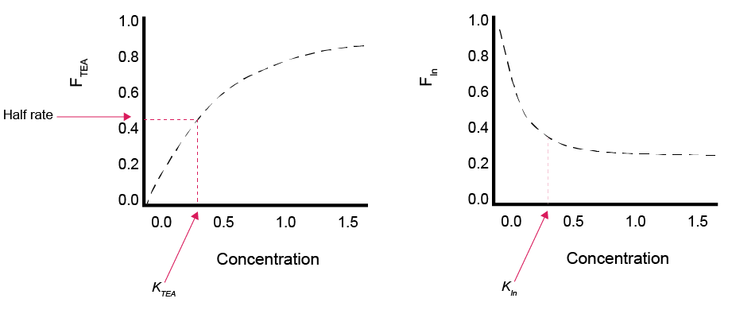
```

</center>

$F_T$ is the thermodynamic factor. The current version of the model includes $F_T$ only for `OMModel` 3, for terminal oxidation reactions and fermentation. This factor uses the ratio of products and reactants, as well as the free energy of each reaction pathway ($\Delta G^0$).

The $F_T$ is a factor that scales between 0, which stops the reaction, and 1, which allows the reaction to proceed, in the same way as $F_{TEA}$ and $F_{In}$. The form of the equation proposed by Jin and Bethke is that shown in equation \@ref(eq:factors-3).The *m* and *χ* are stoichiometric coefficients, *ΔG~ATP~* is the energy required to synthesise one mole of ATP, *R* is the gas constant and *T* is the temperature. In the case where the $F_T$ \< 0 then the factor is set to 0 by convention, otherwise a negative FT would represent the case where microbes carried out a reaction that was unfavourable to their metabolism.

<center>

```{=tex}
\begin{equation}
F_T = 1 - e^{\frac {∆G_r + m ∆G_{ATP}} {χR} } 
(\#eq:factors-3)
\end{equation}
```
</center>

\

*ΔG~r~* is the changing free energy in the system, which controls whether the $F_T$ becomes favourable or not as the environment changes, and is calculated according to the simplified version in equation \@ref(eq:factors-4) (see Jin and Bethke 2005 for a more precise definition):

<center>

```{=tex}
\begin{equation}
    ∆G_r = ∆G^0 + RT ln ( \frac {[redox \ products]^{molar \ ratios} }  { [redox \ reactants]^{molar \ ratios}  } )
\\
(\#eq:factors-4)
\end{equation}
```
</center>

where *ΔG~0~* is the standard state free energy of a redox reaction, calculated as the sum of the energy of the reduction of a *TEA* and the oxidation of an organic substrate. These energies are well constrained by laboratory data, though there may be differences between laboratory and field conditions that create some uncertainty in their use (Bethke et al. 2011). Practically, this equation allows for *ΔG~r~* to be very close to *∆G~0~* when the reactants are at high concentrations relative to the products. Inversely, when the products are at relatively high concentrations, *ΔG~r~* becomes more positive, making $F_T$ more negative. Equation \@ref(eq:factors-3) requires the constants *m* and *χ*, which are parameters that could be measured empirically, however as yet they have not all been measured for every redox pathway for every substrate, and therefore authors have had to estimate some values when using equation \@ref(eq:factors-3) (Dale et al. 2008). It also requires *ΔG~ATP~*, which is around 45 kJ (mol substrate)^-1^ but has varied published values. Around neutral *pH* the conditions for fermentation product consumption by iron reducers, sulphate reducers and methanogens are all thermodynamically favourable, but this changes with *pH* (Bethke et al. 2011). Acidity either promotes or hinders the reaction depending on whether the protons are produced or consumed in the reaction.

$F_{an}$ is a factor that slows down sulfate reduction and methanogenesis. As stated above, the kinetic rate constant *k~OM~* is the same for all redox pathways. The higher-energy pathways are designed to inhibit the lower-energy pathways, but not to occur faster, which is consistent with most other diagenesis models. However, there is an option to slow sulfate reduction and methanogenesis if the user desires. The parameter `f_an` can be set between 0 and 1 to make the $F_{an}$ factor more or less sensitive. Any value greater than 1 makes the factor ineffective (equation \@ref(eq:#factors-4)). The $F_{an}$ factor is calculated as the fraction of $F_{Sul}$ and $F_{Met}$ over the sum of all of the other pathways.

```{=tex}
\begin{equation}
For \ \ R_{O_{2}},\ \ R_{NO_{3}},\ \ R_{MnO_{2}}, \ \ and  \ \ R_{FeOH} \
\\
\\
F_{an (factor)} = 1
\\
\\
For \ \ R_{SO_{4}} \ \ and  \ \ R_{Met} \
\\
\\
F_{an (factor)} =\left\{
  \begin{array}{@{}ll@{}}
    1, & f_{an (parameter)} \: \ge \: 1 \\
    \frac {F_{SO_{4}} + F_{Met}}{f_{an (parameter)} + F_{O_{2}} + F_{NO_{3}} + F_{MnO_{2}} + F_{FeOH} + F_{SO_{4}} + F_{Met}},       & f_{an (parameter)} \lt 1\\
  \end{array}\right.

(#eq:factors-4)

\end{equation}
```
##### *Nitrogen cycling* {#SedNitrogenCycling .unnumbered}

The redox sequence in CANDI-AED is slightly different to the sequence in other diagenesis models: here the nitrogen redox reactions are split into several processes. Most diagenesis models have an overall reaction of $NO_3^-$ oxidising organic matter and producing $N_2$, as shown in figure \@ref(fig:NModel-1). This reaction is less favourable than aerobic oxidation and it is inhibited by $O_2$.

<center>

```{r NModel-1, echo=FALSE, fig.cap="Schematic of the basic nitrogen-organic matter redox process from most other diagenesis models.", fig.show="hold", out.width="35%" ,fig.align='center'}
knitr::include_graphics("images/23-sediment_biogeochemistry/OMSetup/NModel1.png")
```

</center>

In CANDI-AED, there are separate nitrogen reactions for oxidising organic matter:

-   **Denitrousation**: $N_2O$ reduction to $N_2$\
-   **Denitratation**: $NO_3^-$ reduction to $NO_2^-$\
-   **Denitritation**: $NO_2^-$ reduction\
-   **Nitrous denitritation**: $NO_2^-$ reduction to $N_2O$\
-   **DNRA**: (Dissimilatory nitrate reduction to ammonia) $NO_2^-$ reduction to $NH_4^+$

These reactions interact as shown in figure \@ref(fig:NModel-2). In CANDI-AED, the denitrousation reaction is configured to be more favourable than aerobic oxidation, based on the free energy data reported in Lam and Kuypers (2011). Therefore $N_2O$ inhibits aerobic respiration and all lower-energy pathways. Denitratation and all other reactions are less favourable than aerobic oxidation. Denitritation is the term used for the oxidation of $NO_2^-$, the products of which are produced through either nitrous denitritation (to $N_2O$) or DNRA (to $NH_4^+$), depending on the abundance of $NO_2^-$.The rate equations are as shown in table \@ref(tab:NRate-table).

<center>

```{r NModel-2, echo=FALSE, fig.cap="Schematic of the nitrogen-organic matter redox processes used in the CANDI-AED model.", fig.show="hold", out.width="85%" ,fig.align='center'}
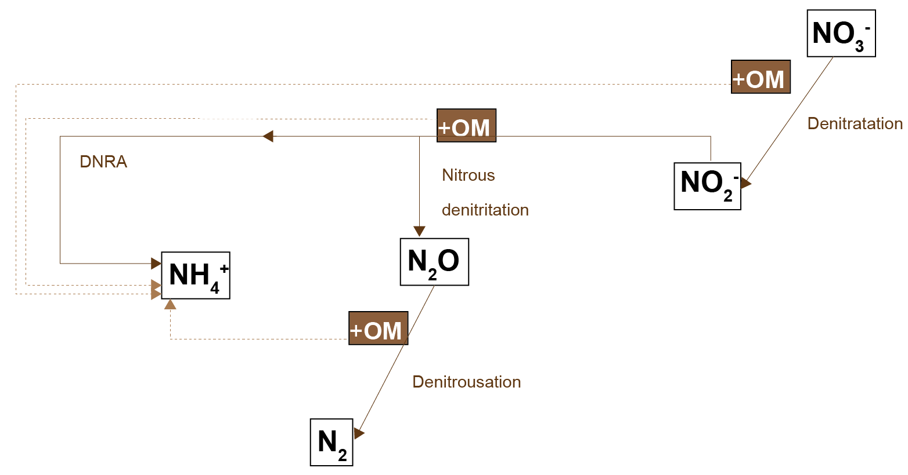
```

<br>

```{r NRate-table, echo=FALSE, message=FALSE, warning=FALSE}
library(knitr)
library(kableExtra)
library(readxl)
  options(knitr.kable.NA = "")
NRates_tab <- read_xlsx("tables/23-sediment_biogeochemistry/UserManual.xlsx", sheet="NRates")
  kable(NRates_tab[,1:2],"html", escape = F, align = "c"
        , caption = "Rate equations for organic matter oxidation by nitrogen.",bootstrap_options = "hover")%>%
  
 
   kable_styling(NRates_tab, bootstrap_options = "hover",
                full_width = T, position = "left",
                font_size = 12) %>% 
    
  row_spec(0, background = "#14759e", bold = TRUE, color = "white") %>%
  column_spec(1, width_min = "10em" ,color="black",bold = F) %>%
  column_spec(2, width_min = "25em" ,color="black") %>%
  # column_spec(3, width_min = "15em" ,color="black") %>%
  row_spec(1:5, background = 'white')  %>%
 scroll_box(width = "44em", height = "37em",fixed_thead = FALSE)
```

</center>

Along with the nitrogen--organic matter redox reactions, there are sets of nitrogen oxidation reactions, where the oxidant is $O_2$ or $NO_2^-$. These are outlined in more detail in the AED inorganic nitrogen chapter.

##### *Calculation of the primary reactions* {#SedCalculationofthePrimaryReactions .unnumbered}

The chemical reactions in table \@ref(tab:OMChem-table) represent the overall process, however, the model code does not contain them in that form. A description of the numerical solution is presented below in the section [Numerical solution](#SedNumericalSolution) and a summary of the process as it pertains to primary reactions is given here. The model code contains:

**The 'Reaction' function**: the balance of each reaction rate for each species.

**The 'Rates' function**: the reaction rates, as the product of

-   the species,
-   the kinetic constants,
-   the stoichiometric coefficients and
-   the factors.

<center>

```{r OMCalcs-1, echo=FALSE, fig.cap="An illustration of one example of how the reaction rates are calculated in the model code. The balance equation is calculated as the gains and losses from the individual rates, and the rates are calculated from constants or other variables.", fig.show="hold", out.width="100%" ,fig.align='center'}

```

</center>

#### Secondary Redox Reactions {#SedSecondaryRedoxReactions}

The reactions of chemical species produced by the primary redox reactions (\@ref(tab:SecondChem-table)) are referred to as secondary redox reactions, and are usually given bimolecular rate laws, which are first order with respect to the oxidant and reductant (\@ref(tab:SecondChem-table)). The rates are controlled by a kinetic constant with units (mmol L)\^-1 y\^-1.

<center>

```{r SecondChem-table, echo=FALSE, message=FALSE, warning=FALSE}
library(knitr)
library(kableExtra)
library(readxl)
  options(knitr.kable.NA = "")
SecondChem_tab <- read_xlsx("tables/23-sediment_biogeochemistry/UserManual.xlsx", sheet="SecondChem (3)")
  kable(SecondChem_tab[,1:5],"html", escape = F, align = "c"
        , caption = "Chemical reactions for secondary redox reactions.",bootstrap_options = "hover")%>%
   kable_styling(SecondChem_tab, bootstrap_options = "hover",
                full_width = T, position = "left",
                font_size = 11) %>% 
    
  row_spec(0, background = "#14759e", bold = TRUE, color = "white") %>%
  column_spec(1, width_min = "15em" ,color="black",bold = T) %>%
  column_spec(2, width_min = "3em" ,color="black") %>%
  column_spec(3, width_min = "12em" ,color="black") %>%
  column_spec(4, width_min = "3em" ,color="black") %>%
  column_spec(5, width_min = "12em" ,color="black") %>%
  row_spec(1:5, background = 'white')  %>%
 scroll_box(width = "770px", height = "45em",fixed_thead = FALSE)
```

</center>

##### *Calculation of the secondary reactions* {#SedCalculationoftheSecondaryReactions .unnumbered}

As with the [primary reactions](SedCalculationofthePrimaryReactions), the secondary redox reactions are present in the code as the combination of

**The 'Reaction' function**: the sum of the rates of change of each species.

**The 'Rates' function**: the reaction rates, as the product of

-   the species,
-   the kinetic constants,
-   the stoichiometric coefficients and
-   the factors.

<center>

```{r OMCalcs-2, echo=FALSE, fig.cap="An illustration of one example of how the reaction rates are calculated in the model code. The balance equation is calculated as the gains and losses from the individual rates, and the rates are calculated from constants or other variables.", fig.show="hold", out.width="100%" ,fig.align='center'}

```

</center>

#### Equilibrium Geochemistry {#EquilibriumGeochemistry}

##### *pH* {.unnumbered}

The *pH* is initialised at a fixed value of around 8, which the user does not control. Setting the parameter `rxn_mode` to 0 or 4 keeps the *pH* constant throughout the simulation. Setting `rxn_mode` to 1, 2 or 3 updates the *pH* calculation at each time step. The *pH* is calculated as the sum of all charged species, where any unbalanced charge is calculated as 'charge balance' ($ubalchg$), which is assumed to be H^+^. The charge balance is at each time step is solved as a state variable, which is subject to advection, diffusion and bioturbation reactions.

The *pH* is used in the calculation of $PO_4^{3-}$ adsorption if the parameter `ads_use_pH` is set to `TRUE`.

*pH* is not used in any of the other calculations.

##### *Mineral precipitation and ageing* {#SedMineralPrecipitationAndAgeing .unnumbered}

In CANDI-AED, dissolved species can combine to form precipitated minerals: $MnO_{2A}$, $Fe(OH)_{3A}$, $FeS$, $MnCO_3$, $FeCO_3$, and $CaCO_3$. Another process is the ageing of amorphous $MnO_{2A}$ and $Fe(OH)_{3A}$ to the unreactive, crystalline phases $MnO_{2B}$ and $Fe(OH)_{3B}$. The third type of process is ageing process of $FeS$ to $FeS_2$ (adding a further S atom to the compound). The reactions rates are outlined in tables \@ref(tab:Geochem-table1) to \@ref(tab:Geochem-table3).

The form of the rate is dependent on the complexity of the reaction mode chosen, using the parameter `rxn_mode`. The simplest option is for the reactions not to occur. The next option is for the reaction to proceed as a biomolecular rate law, in a similar way to the secondary redox reactions, by selecting `rxn_mode` = 2.

There are also two methods that set the precipitation rate based on the relative concentrations of dissolved and precipitated species. One method uses the ion activity product (*IAP*), which is a state variable and is calculated at each depth and timestep. The calculation method is based on that from Tufano et al. (2009). This method is generally selected with `rxn_mode` = 3 (see tables \@ref(tab:Geochem-table1) to \@ref(tab:Geochem-table3)). The other method is the "omega" method, using the equations from Van Cappellen and Wang (1996), generally by using `rxn_mode` = 4 (see tables \@ref(tab:Geochem-table1) to \@ref(tab:Geochem-table3)).

<center>

```{r Geochem-table1, echo=FALSE, message=FALSE, warning=FALSE}
library(knitr)
library(kableExtra)
library(readxl)
  options(knitr.kable.NA = "")
MnOFeO_tab    <- read_xlsx("tables/23-sediment_biogeochemistry/UserManual.xlsx", sheet="MnOFeO")
MnOFeO_Groups <- unique(MnOFeO_tab$Group)
  kable(MnOFeO_tab[,1:4],"html", escape = F, align = "c"
        , caption = "Reactions and rate equations for precipitation and ageing for MnO~2~ and Fe(OH)~3~",bootstrap_options = "hover")%>%
    
  pack_rows(MnOFeO_Groups[1],
            min(which(MnOFeO_tab$Group == MnOFeO_Groups[1])),
            max(which(MnOFeO_tab$Group == MnOFeO_Groups[1])),
            background = '#ebebeb'
            ,color="black") %>%
  pack_rows(MnOFeO_Groups[2],
            min(which(MnOFeO_tab$Group == MnOFeO_Groups[2])),
            max(which(MnOFeO_tab$Group == MnOFeO_Groups[2])),
            background = '#ebebeb'
            ,color="black") %>%
    
   kable_styling(MnOFeO_tab, bootstrap_options = "hover",
                full_width = T, position = "left",
                font_size = 12) %>% 
    
  row_spec(0, background = "#14759e", bold = TRUE, color = "white") %>%
  column_spec(1, width_min = "10em" ,color="black",bold = F) %>%
  column_spec(2, width_min = "15em" ,color="black") %>%
  column_spec(3, width_min = "3em"  ,color="black") %>%
  column_spec(4, width_min = "15em" ,color="black") %>%
  # row_spec(1:4, background = 'white')  %>%
 scroll_box(width = "48em", height = "30em",fixed_thead = FALSE)
```

</center>

$MnO_{2A}$ ageing

```{=tex}
\begin{equation}
MnO_{2A} \rightarrow MnO_{2B}
\end{equation}
```
::: {.panelset .sideways}
::: panel
[rxn_mode = 0]{.panel-name}

```{=tex}
\begin{equation}
 R_{MnO_{2B}ppt} = 0
\end{equation}
```
:::

::: panel
[rxn_mode = 1]{.panel-name}

```{=tex}
\begin{equation}
 R_{MnO_{2B}ppt} = 0
\end{equation}
```
:::

::: panel
[rxn_mode = 2]{.panel-name}

```{=tex}
\begin{equation}
 R_{MnO_{2B}ppt} = k_{MnO_{2B}ppt}  Mn_{O_{2A}}
\end{equation}
```
:::

::: panel
[rxn_mode = 3]{.panel-name}

```{=tex}
\begin{equation}
 R_{MnO_{2B}ppt} = k_{MnO_{2B}ppt}  Mn_{O_{2A}}
\end{equation}
```
:::

::: panel
[rxn_mode = 4]{.panel-name}

```{=tex}
\begin{equation}
 R_{MnO_{2B}ppt} = k_{MnO_{2B}ppt}  Mn_{O_{2A}}
\end{equation}
```
:::
:::

\
\
<!-- _______________________________________________________________________________ -->

$MnO_{2A}$ precipitation

```{=tex}
\begin{equation}
2Mn^{2+} + O_2 + 4HCO_3^- \rightarrow  2MnO_{2A} + 4CO_2 +2H_2O
\end{equation}
```
::: {.panelset .sideways}
::: panel
[rxn_mode = 0]{.panel-name}

```{=tex}
\begin{equation}
 R_{MnO_{2A}ppt} = 0
\end{equation}
```
:::

::: panel
[rxn_mode = 1]{.panel-name}

```{=tex}
\begin{equation}
 R_{MnO_{2A}ppt} = 0
\end{equation}
```
:::

::: panel
[rxn_mode = 2]{.panel-name} Continuous

```{=tex}
\begin{equation}
 R_{MnO_{2A}ppt} = k_{MnO_{2A}ppt}  Mn^{2+}
\end{equation}
```
:::

::: panel
[rxn_mode = 3]{.panel-name} IAP method

```{=tex}
\begin{equation}

 R_{MnO_{2A}ppt} = \left\{
  \begin{array}{@{}ll@{}}
    k_{MnO_{2A}ppt}  MnO_{2A}, & IAP_{MnO2} = 0 \\
    k_{MnO_{2A}ppt} \left( 1 - \frac {1}{IAP_{MnO2}} \right) , & IAP_{MnO2} \lt 1 \\
    k_{MnO_{2A}ppt} \left( 1 - \frac {IAP_{MnO2}}{1} \right)   & IAP_{MnO2} \ge 1
  \end{array}\right.
\end{equation}
```
:::

::: panel
[rxn_mode = 4]{.panel-name} Continuous

```{=tex}
\begin{equation}
 R_{MnO_{2A}ppt} = k_{MnO_{2A}ppt}  Mn^{2+}
\end{equation}
```
:::
:::

<!-- _______________________________________________________________________________ -->

\
\

$Fe(OH)_{3A}$ ageing

```{=tex}
\begin{equation}
Fe(OH)_{3A} \rightarrow Fe(OH)_{3B}
\end{equation}
```
::: {.panelset .sideways}
::: panel
[rxn_mode = 0]{.panel-name}

```{=tex}
\begin{equation}
 R_{Fe(OH)_{3A}ppt} = 0
\end{equation}
```
:::

::: panel
[rxn_mode = 1]{.panel-name}

```{=tex}
\begin{equation}
R_{Fe(OH)_{3A}ppt} = 0
\end{equation}
```
:::

::: panel
[rxn_mode = 2]{.panel-name}

```{=tex}
\begin{equation}
 R_{Fe(OH)_{3A}ppt} = k_{Fe(OH)_{3A}ppt}  Fe(OH)_{3A}
\end{equation}
```
:::

::: panel
[rxn_mode = 3]{.panel-name}

```{=tex}
\begin{equation}
 R_{Fe(OH)_{3A}ppt} = k_{Fe(OH)_{3A}ppt} Fe(OH)_{3A}
\end{equation}
```
:::

::: panel
[rxn_mode = 4]{.panel-name}

```{=tex}
\begin{equation}
 R_{Fe(OH)_{3A}ppt} = k_{Fe(OH)_{3A}ppt}  Fe(OH)_{3A}
\end{equation}
```
:::
:::

\
\
\
\
<!-- _______________________________________________________________________________ --> $Fe(OH)_{3A}$ precipitation

```{=tex}
\begin{equation}
4Fe^{2+} + O_2 +8HCO_3^- + 2H_2O \rightarrow 4Fe(OH)_{3A} + 8CO_2 
\end{equation}
```
::: {.panelset .sideways}
::: panel
[rxn_mode = 0]{.panel-name}

```{=tex}
\begin{equation}
 R_{Fe(OH)_{3A}ppt} = 0
\end{equation}
```
:::

::: panel
[rxn_mode = 1]{.panel-name}

```{=tex}
\begin{equation}
 R_{Fe(OH)_{3A}ppt} = 0
\end{equation}
```
:::

::: panel
[rxn_mode = 2]{.panel-name} Continuous

```{=tex}
\begin{equation}
 R_{Fe(OH)_{3A}ppt} = k_{Fe(OH)_{3A}ppt}  Fe^{2+}
\end{equation}
```
:::

::: panel
[rxn_mode = 3]{.panel-name} IAP method

```{=tex}
\begin{equation}

 R_{Fe(OH)_{3A}ppt} = \left\{
  \begin{array}{@{}ll@{}}
    k_{Fe(OH)_{3A}ppt}  Fe(OH)_{3A}, & IAP_{Fe(OH)_3} = 0 \\
    k_{Fe(OH)_{3A}ppt} \left( 1 - \frac {1}{IAP_{Fe(OH)_3}} \right) , & IAP_{Fe(OH)_3} \lt 1 \\
    k_{Fe(OH)_{3A}ppt} \left( 1 - \frac {IAP_{Fe(OH)_3}}{1} \right)   & IAP_{Fe(OH)_3} \ge 1
  \end{array}\right.
\end{equation}
```
:::

::: panel
[rxn_mode = 4]{.panel-name} Continuous

```{=tex}
\begin{equation}
 R_{Fe(OH)_{3A}ppt} = k_{Fe(OH)_{3A}ppt}  Fe^{2+}
\end{equation}
```
:::
:::

\
\
\
\
\
\
\
\
\
\
\
\
\
\
<!-- _______________________________________________________________________________ -->\
\
\
\
\
\
\
<!-- _______________________________________________________________________________ -->

<br>

<center>

```{r Geochem-table2, echo=FALSE, message=FALSE, warning=FALSE}
library(knitr)
library(kableExtra)
library(readxl)
  options(knitr.kable.NA = "")
FeS_tab <- read_xlsx("tables/23-sediment_biogeochemistry/UserManual.xlsx", sheet="FeS")
# View(sediment_VarsTable)
  kable(FeS_tab[,1:4],"html", escape = F, align = "c"
        , caption = "Reactions and rate equations for precipitation and ageing for FeS and FeS~2~",bootstrap_options = "hover")%>%
   kable_styling(FeS_tab, bootstrap_options = "hover",
                full_width = T, position = "left",
                font_size = 12) %>% 
    
  row_spec(0, background = "#14759e", bold = TRUE, color = "white") %>%
  column_spec(1, width_min = "10em" ,color="black",bold = F) %>%
  column_spec(2, width_min = "15em" ,color="black") %>%
  column_spec(3, width_min = "3em" ,color="black") %>%
  column_spec(4, width_min = "15em" ,color="black") %>%
  row_spec(1:4, background = 'white')  %>%
 scroll_box(width = "48em", height = "30em",fixed_thead = FALSE)
```

</center>

<!-- _______________________________________________________________________________ -->

$FeS$ transformation to $FeS_2$

```{=tex}
\begin{equation}
FeS + H_2S \rightarrow FeS_2 + H_2 \\
R_{Pyrite} = k_{Pyrite} [FeS] [H_2S]
\end{equation}
```
<!-- _______________________________________________________________________________ -->

$FeS$ precipitation

```{=tex}
\begin{equation}
Fe^{2+} + H_2S  \rightarrow FeS + 2H^+
\end{equation}
```
::: {.panelset .sideways}
::: panel
[rxn_mode = 0]{.panel-name}

```{=tex}
\begin{equation}
 R_{FeS} = 0
\end{equation}
```
:::

::: panel
[rxn_mode = 1]{.panel-name}

```{=tex}
\begin{equation}
 R_{FeS} = 0
\end{equation}
```
:::

::: panel
[rxn_mode = 2]{.panel-name} Continuous

```{=tex}
\begin{equation}
 R_{FeS} = k_{FeSppt}  [Fe^{2+}][HS^-]
\end{equation}
```
:::

::: panel
[rxn_mode = 3]{.panel-name} IAP method

```{=tex}
\begin{equation}
  R_{FeSppt} = k_{FeSppt} \left( 1- \frac{K_{spFeS}}{IAP_{FeS}} \right) \\
  R_{FeSdiss} = - k_{FeSppt} \left( 1- \frac{IAP_{FeS}}{K_{spFeS}} \right) 
  
\end{equation}
```
:::

::: panel
[rxn_mode = 4]{.panel-name} Omega method

```{=tex}
\begin{equation}
R_{FeSppt} = k_{FeSppt} \delta_{FeS} (\Omega_{FeS} - 1)
\\
R_{FeSdiss} = k_{FeSdiss} \delta_{-FeS} (1 - \Omega_{FeS} )
\\
\Omega_{FeS} = \left( \frac {[Fe^{2+}]{HS^-} }    {[H^+] K_{FeS}} \right)
\\
If \Omega_{FeS} \gt 1 \
\delta_{FeS} = 1; \delta_{-FeS} = 0\
\\
If \Omega_{FeS} \le 1 \
\delta_{FeS} = 0; \delta_{-FeS} = 1
\end{equation}
```
:::
:::

<!-- _______________________________________________________________________________ -->

\
\
\
\
\
\

<!-- _______________________________________________________________________________ -->

$MnCO_3$ precipitation

```{=tex}
\begin{equation}
Mn^{2+} + CO_3^{2-} \rightarrow  MnCO_3
\end{equation}
```
::: {.panelset .sideways}
::: panel
[rxn_mode = 0]{.panel-name}

```{=tex}
\begin{equation}
 R_{Rodppt} = 0
\end{equation}
```
:::

::: panel
[rxn_mode = 1]{.panel-name}

```{=tex}
\begin{equation}
 R_{Rodppt} = 0
\end{equation}
```
:::

::: panel
[rxn_mode = 2]{.panel-name} Continuous

```{=tex}
\begin{equation}
 R_{Rodppt} = k_{Rodppt}  [Mn^{2+}][CO_3^{2-}]
\end{equation}
```
:::

::: panel
[rxn_mode = 3]{.panel-name} IAP method

```{=tex}
\begin{equation}
  R_{Rodppt} = k_{Rodppt} \left( 1- \frac{K_{spRod}}{IAP_{Rod}} \right) \\
  R_{Rodppt} = - k_{Rodppt} \left( 1- \frac{IAP_{Rod}}{K_{spRod}} \right) 
  
\end{equation}
```
:::

::: panel
[rxn_mode = 4]{.panel-name} Omega method

```{=tex}
\begin{equation}
R_{Rodppt} = k_{Rodppt} \delta_{Rod} (\Omega_{Rod} - 1)
\\
R_{Roddiss} = k_{Roddiss} \delta_{-Rod} (1 - \Omega_{Rod} )
\\
\Omega_{Rod} = \left( \frac {[Mn^{2+}][CO_3^{2-}] }    {K_{Rod}} \right)
\\
If \  \  \Omega_{Rod} \gt 1 \
\delta_{Rod} = 1; \delta_{-Rod} = 0\
\\
If \  \  \Omega_{Rod} \le 1 \
\delta_{Rod} = 0; \delta_{-Rod} = 1
\end{equation}
```
:::
:::

<!-- _______________________________________________________________________________ -->

\
\
\
\
\
\

<!-- _______________________________________________________________________________ -->

$FeCO_3$ precipitation

```{=tex}
\begin{equation}
Fe^{2+} + CO_3^{2-} \rightarrow  FeCO_3
\end{equation}
```
::: {.panelset .sideways}
::: panel
[rxn_mode = 0]{.panel-name}

```{=tex}
\begin{equation}
 R_{Sidppt} = 0
\end{equation}
```
:::

::: panel
[rxn_mode = 1]{.panel-name}

```{=tex}
\begin{equation}
 R_{Sidppt} = 0
\end{equation}
```
:::

::: panel
[rxn_mode = 2]{.panel-name} Continuous

```{=tex}
\begin{equation}
 R_{Sidppt} = k_{Sidppt}  [Fe^{2+}][CO_3^{2-}]
\end{equation}
```
:::

::: panel
[rxn_mode = 3]{.panel-name} IAP method

```{=tex}
\begin{equation}
  R_{Sidppt} = k_{Sidppt} \left( 1- \frac{K_{spSid}}{IAP_{Sid}} \right) \\
  R_{Sidppt} = - k_{Sidppt} \left( 1- \frac{IAP_{Sid}}{K_{spSid}} \right) 
  
\end{equation}
```
:::

::: panel
[rxn_mode = 4]{.panel-name} Omega method

```{=tex}
\begin{equation}
R_{Sidppt} = k_{Sidppt} \delta_{Sid} (\Omega_{Sid} - 1)
\\
R_{Siddiss} = k_{Siddiss} \delta_{-Sid} (1 - \Omega_{Sid} )
\\
\Omega_{Sid} = \left( \frac {[Fe^{2+}][CO_3^{2-}] }    {K_{Sid}} \right)
\\
If \  \  \Omega_{Sid} \gt 1 \
\delta_{Sid} = 1; \delta_{-Sid} = 0\
\\
If \  \  \Omega_{Sid} \le 1 \
\delta_{Sid} = 0; \delta_{-Sid} = 1
\end{equation}
```
:::
:::

<!-- _______________________________________________________________________________ -->

\
\
\
\
\
\

<!-- _______________________________________________________________________________ -->

$CaCO_3$ precipitation

```{=tex}
\begin{equation}
Ca^{2+} + CO_3^{2-} \rightarrow  CaCO_3
\end{equation}
```
::: {.panelset .sideways}
::: panel
[rxn_mode = 0]{.panel-name}

```{=tex}
\begin{equation}
 R_{Calppt} = 0
\end{equation}
```
:::

::: panel
[rxn_mode = 1]{.panel-name}

```{=tex}
\begin{equation}
 R_{Calppt} = 0
\end{equation}
```
:::

::: panel
[rxn_mode = 2]{.panel-name} Continuous

```{=tex}
\begin{equation}
 R_{Calppt} = k_{Calppt}  [Ca^{2+}][CO_3^{2-}]
\end{equation}
```
:::

::: panel
[rxn_mode = 3]{.panel-name} IAP method

```{=tex}
\begin{equation}
  R_{Calppt} = k_{Calppt} \left( 1- \frac{K_{spCal}}{IAP_{Cal}} \right) \\
  R_{Calppt} = - k_{Calppt} \left( 1- \frac{IAP_{Cal}}{K_{spCal}} \right) 
  
\end{equation}
```
:::

::: panel
[rxn_mode = 4]{.panel-name} Omega method

```{=tex}
\begin{equation}
R_{Calppt} = k_{Calppt} \delta_{Cal} (\Omega_{Cal} - 1)
\\
R_{Caldiss} = k_{Caldiss} \delta_{-Cal} (1 - \Omega_{Cal} )
\\
\Omega_{Cal} = \left( \frac {[Ca^{2+}][CO_3^{2-}] }    {K_{Cal}} \right)
\\
If \  \ \Omega_{Cal} \gt 1 \
\delta_{Cal} = 1; \delta_{-Cal} = 0\
\\
If \  \  \Omega_{Cal} \le 1 \
\delta_{Cal} = 0; \delta_{-Cal} = 1
\end{equation}
```
:::
:::

<!-- _______________________________________________________________________________ -->

<br>

<center>

```{r Geochem-table3, echo=FALSE, message=FALSE, warning=FALSE}
library(knitr)
library(kableExtra)
library(readxl)
  options(knitr.kable.NA = "")
CO3_tab <- read_xlsx("tables/23-sediment_biogeochemistry/UserManual.xlsx", sheet="CO3")
CO3_Groups <- unique(CO3_tab$Group)
  kable(CO3_tab[,1:4],"html", escape = F, align = "c"
        , caption = "Reactions and rate equations for precipitation and ageing for carbonate compounds.",bootstrap_options = "hover")%>%
   pack_rows(CO3_Groups[1],
            min(which(CO3_tab$Group == CO3_Groups[1])),
            max(which(CO3_tab$Group == CO3_Groups[1])),
            background = '#ebebeb'
            ,color="black") %>%
   pack_rows(CO3_Groups[2],
            min(which(CO3_tab$Group == CO3_Groups[2])),
            max(which(CO3_tab$Group == CO3_Groups[2])),
            background = '#ebebeb'
            ,color="black") %>%
  pack_rows(CO3_Groups[3],
            min(which(CO3_tab$Group == CO3_Groups[3])),
            max(which(CO3_tab$Group == CO3_Groups[3])),
            background = '#ebebeb'
            ,color="black") %>%
    
    
   kable_styling(CO3_tab, bootstrap_options = "hover",
                full_width = T, position = "left",
                font_size = 12) %>% 
  row_spec(0, background = "#14759e", bold = TRUE, color = "white") %>%
  column_spec(1, width_min = "10em" ,color="black",bold = F) %>%
  column_spec(2, width_min = "15em" ,color="black") %>%
  column_spec(3, width_min = "3em" ,color="black") %>%
  column_spec(4, width_min = "15em" ,color="black") %>%
  row_spec(1:4, background = 'white')  %>%
 scroll_box(width = "48em", height = "30em",fixed_thead = FALSE)
```

</center>

<br>

The parameter `rxn_mode` sets different configurations of precipitation and *pH* calculations. A summary of the options is presented in \@ref(tab:Geochem-table4).

<center>

```{r Geochem-table4, echo=FALSE, message=FALSE, warning=FALSE}
library(knitr)
library(kableExtra)
library(readxl)
  options(knitr.kable.NA = "")
rxn_mode_tab <- read_xlsx("tables/23-sediment_biogeochemistry/UserManual.xlsx", sheet="rxn_mode")
  kable(rxn_mode_tab[,1:9],"html", escape = F, align = "c"
        , caption = "Geochemical configurations from the `rxn_mode` parameter",bootstrap_options = "hover")%>%
   kable_styling(rxn_mode_tab, bootstrap_options = "hover",
                full_width = T, position = "left",
                font_size = 12) %>% 
    
  row_spec(0, background = "#14759e", bold = TRUE, color = "white") %>%
  column_spec(1, width_min = "12em" ,color="black",bold = T) %>%
  column_spec(2, width_min = "12em" ,color="black") %>%
  column_spec(3, width_min = "12em" ,color="black") %>%
  column_spec(4, width_min = "12em" ,color="black") %>%
  column_spec(9, width_min = "12em" ,color="red", italic = T) %>%
  row_spec(1:4, background = 'white')  %>%
 scroll_box(width = "48em", height = "25em",fixed_thead = FALSE)
```

</center>

##### *Adsorption* {.unnumbered}

IN CANDI-AED, $NH_4^+$ adsorption is simulated as precipitating onto solid particles, including organic matter and clay, following the method of Van Cappellen and Wang (1996). It is assumed that there are unlimited adsorption sites for $NH_4^+$, and the relative amounts of $NH_4^+$ were assigned by the adsorption constant `knh4p`, which was initially based on Mackin and Aller (1984). A simplified version of the adsorption equations adsorption can be found in the equation set below (equation \@ref(eq:ppt-1)). The full equations correct for porosity and solid volume when transferring between particulate and dissolved phases. $NH_4^+$ adsorption defaults ot being switched on, but may be switched off by setting the parameter `NH4AdsorptionModel` to 0.

<center>

```{=tex}
\begin{eqnarray}

NH_{4 _{Total}}^+       = NH_{4}^+ + NH_{4_{Adsorbed}}
\\
\\
NH_{4 _{Dissolved}}^+   = \frac {1}{K_{NH_4p}}
\\
\\
NH_{4 _{Particulate}}^+ = 1 - NH_{4 _{Dissolved}}^+ F_{Sal}
\\
\\
NH_{4 _{Particulate}}^+ = NH_{4_{Total}}^+ NH_{4 _{Particulate}}^+
\\
\\
NH_{4 _{Dissolved}}^+   = NH_{4_{Total}}^+ - NH_{4 _{Particulate}}^+
(\#eq:ppt-1)
\end{eqnarray}
```
</center>

A similar approach is taken for dissolved organic carbon, nitrogen and phosphrous. The $DON_R$ and $DON_S$ are adsorbed to the sediment with the adsorption constant *K~DOMP~*, and $DOP_R$ and $DOP_S$ adsorbed using the same adsorption constant *K~DOMP~*. The value for *K~DOMP~* defaults to 1.4 and the model defaults to being switched on (`DOMAdsorptionModel` \> 0).

The model uses the parameter `PO4AdsorptionModel` to switch the type of adsorption equations from the AED $PO_4^{3-}$ adsorption library. If it is not set, the model defaults to method 1. The equations for `PO4AdsorptionModel` 1 are given in equation set \@ref(eq:ppt-2). $PO_4^{3-}$ is adsorbed onto the surfaces of iron oxide particles, both the reactive $Fe(OH)_{3A}$ and unreactive $Fe(OH)_{3B}$ fractions. During a simulation, low oxygen and nitrate concentrations in the sediment cause iron oxide reduction, which dissolves the solid particles and releases the dissolved $PO_4^{3-}$ to the porewater.

If `PO4AdsorptionModel` 2 is selected, a set of pH-dependent reactions are used. A further parameter, `ads_use_pH` is required to be set to `TRUE` if the user wants the model to respond to *pH* dynamically, or to `FALSE` if it should be less sensitive to *pH*. If `PO4AdsorptionModel` 3 is selected, a set of equations is used that rely on salinity and temperature. It is suggested to use `PO4AdsorptionModel` = 1 for most sediment model applications.

```{=tex}
\begin{eqnarray}

PO_{4_{Particulate}}^{3-} = \frac {K_{PO_4p} (Fe(OH)_{3A} + Fe(OH)_{3B})}
{1 + K_{PO_4p} (Fe(OH)_{3A} + Fe(OH)_{3B}) } (PO_{4 _{Total}}^{3-})
\\
\\
PO_{4_{Dissolved}}^{3-}   = \frac {1} {1 + K_{PO_4p} (Fe(OH)_{3A} + Fe(OH)_{3B}) } (PO_{4 _{Total}}^{3-})
(\#eq:ppt-2)
\end{eqnarray}
```
#### Biological dynamics

Animals and plants are included in determining the transport and biogeochemistry of the sediment.

##### *Benthic macrofauna* {.unnumbered}

###### *Bioturbation* {.unnumbered}

Bioturbation is a mixing process caused by benthic infauna in the upper layers of the sediment that affects both solids and porewater (Berg et al. 2001). The model uses a diffusion coefficient (bio-diffusivity, $D_B$) that varies with depth ($D_B[z_s]$) as a two layer function or a Gaussian decrease (Boudreau 1996). Bioirrigation is a non-local mixing process in the upper layers of the sediment, caused by animal burrows leading to enhanced diffusion of porewater (figure \@ref(fig:Phys3)).

```{r Phys3, echo = FALSE, out.width='60%', class = "text-image",fig.show='hold',fig.align='center', fig.cap = "Bioturbation is the mixing of solids and porewater in the upper layers by benthic animals. Irrigation causes extra mixing of porewater through their burrows."}

knitr::include_graphics("images/23-sediment_biogeochemistry/AdvectionDispersion/Biot-07.png")

```

Bioturbation is computed to vary with depth below the sediment-water interface, based on selection of an appropriate model, $\Theta_{\text{imix}}^{sdg}$, via the switch `imix` (equation \@ref(eq:biodynamics-1), figure \@ref(fig:Init-3)), such that:

```{=tex}
\begin{equation}
  \Theta_{\text{imix}}^{sdg}=\left\{
  \begin{array}{@{}ll@{}}
    0, & \text{exponential decay curve}\\
    1, & \text{piece-wise two-layer option}\\
    2  & \text{exponential decay curve}\\
  \end{array}\right.
\end{equation}
(\#eq:biodynamics-1)
```
<br>

```{r Init-3, echo=FALSE, fig.cap="Depth profile representing two possible bioturbation options and the functions of the parameters `DB0`, `x1` and `x2`. ",fig.show='hold',fig.align='center' ,out.width = '80%'}
knitr::include_graphics("images/23-sediment_biogeochemistry/Initialisation/Bioturb-02.png")
```

The rate of bioturbation is set with the parameter `DB0`, whereby the bio-diffusivity is computed as $D_{B}=D_{B}[D_{B_0},z_s]$. If the user selects `imix` switch 0 or 2, then they use the parameter `xs` to set the shape of the exponential decay curve. If the user selects `imix` switch 1, then they use parameters `x1` and `x2` to set the two depths between which bioturbation goes at the full rate and drops to zero:

::: {.panelset .sideways}
::: panel
[imix = 0]{.panel-name} Bio-diffusivity:

```{=tex}
\begin{equation}
 D_B[z_s] = D_{B_0} e^{-\frac {z_s^2}{2 xs^2}}  
\end{equation}
```
:::

::: panel
[imix = 1]{.panel-name} Bio-diffusivity:

```{=tex}
\begin{equation}
  D_B[z_s] =\left\{
  \begin{array}{@{}ll@{}}
    D_{B_0}, & z_s \: \le \: x_1 \\
    D_{B_0} \: (\frac  {x_2 - z_s} {x_2 - x_1}),       & z_s \gt x_1 \text{ and } z_s \le x_2\\
    0        & z_s \gt x_2 \\
  \end{array}\right.
\end{equation}
```
:::

::: panel
[imix = 2]{.panel-name} Bio-diffusivity:

$D_B[z_s] = D_{B_0} \: e^{(- \frac{z_s}{xs} )}$
:::
:::

A bioturbation profile is output in the file `Depths.sed`, so the user can examine the shape of the profile based on the parameter settings chosen.

###### *Bioirrigation* {.unnumbered}

Bioirrigation has only one option, whereby the parameter `alpha0`, $\alpha_0$, sets the rate of irrigation and `xirrig`, $x_{irrig}$, sets the depth at which irrigation decays (equation \@ref(eq:biodynamics-1), figure \@ref(fig:Init-4)), according to:

::: {.panelset .sideways}
::: panel
[alpha]{.panel-name} Bio-irrigation:

```{=tex}
\begin{equation}
  \alpha[z_s] = \left\{
  \begin{array}{@{}ll@{}}
     \alpha_0 , & z_s \: \le \: x_{irrig} \\
     \alpha_0 \: e^{-1.5 \: (z_s - x_{irrig})},       & z_s \gt x_{irrig} \\
  \end{array}\right.
\end{equation}
(\#eq:biodynamics-2)
```
:::
:::

<br>

```{r Init-4, echo=FALSE, fig.cap="Example of a depth profile that sets the rate of irrigation, and the parameters `alpha_0` and `x_irrig`.",fig.show='hold',fig.align='center', out.width = '50%'}
knitr::include_graphics("images/23-sediment_biogeochemistry/Initialisation/Irrig-01.png")
```

###### *Salinity inhibition* {.unnumbered}

A salinity factor, $F_{Sal}$, inhibits processes at hypersaline concentrations. $F_{Sal}$ ranges from 1 to 0, as set between salinity concentration parameters `Sal1` and `Sal2` (PSU), according to equation \@ref(eq:sal-1).

```{=tex}
\begin{equation}
  F_{Sal} =\left\{
  \begin{array}{@{}ll@{}}
    1, & Salinity \: \le \: Sal_1 \\
    \frac {Sal_2 - Salinity} {Sal_2 - Sal_1},       & Salinity \gt Sal_1 \\
    0        & Salinity \gt Sal_2 \\
  \end{array}\right.
(\#eq:sal-1)
\end{equation}
```
The effect of the scaling is shown in figure \@ref(fig:PhysChem1).

```{r PhysChem1, echo = FALSE, out.width='50%', class = "text-image",fig.show='hold',fig.align='center', fig.cap = "Diaagram of the salinity factor $F_{Sal}$, scaling between 1 and 0 between the parameters. In this diagram `Sal~1~` is 40 and `Sal~2~` is 70."}
knitr::include_graphics("images/23-sediment_biogeochemistry/PhysChemInteractions/FSal-02.png")
```

$F_{Sal}$ is applied to biota-driven mixing (see below) and to the nitrogen redox and adsorption reactions. It is multiplied by the following reactions:

-   *R~N2O~*
-   *R~NO2~*
-   *R~NO3~*
-   *R~NH4ox~*
-   *R~NH4NO2~*
-   *R~NO2O2~*
-   *NH~4~^+^ adsorption*

The term affects all rates equally and so does not favour the concentration of any of the species. However, it slows down the transformation of each species into the other, and increased the effect of transport reactions and depth-driven concentration gradients.

###### *H~2~S inhibition* {.unnumbered}

High $H_{2}S$ concentration is set to inhibit biota-driven mixing and nitrogen redox reactions, on the basis that $H_{2}S$ is toxic to organisms. An $H_{2}S$ factor, $F_{Sul}$, is an inhibition factor similar to other inhibition factors in the sediment model.

```{=tex}
\begin{eqnarray}

F_{Sul} = \frac {K_{H_{2}S}} {(K_{H_{2}S} + H_{2}S)}
(\#eq:sdg-6)
\end{eqnarray}
```
As with $F_{Sal}$, $F_{Sul}$ scales between 1 and 0, however, as a decay rather than a stepped function (Figure \@ref(fig:PhysChem2)). The value for `KH2S` can be found in the physical parameters table below In this simulation, the same value for `KH2S` was used in all zones.

```{r PhysChem2, echo = FALSE, out.width='50%', class = "text-image",fig.show='hold',fig.align='center', fig.cap = "Diagram of the $H_2S$ factor, $F_{Sul}$, scaling from 1 to 0 as $H_2S$ concentration decreases. "}

knitr::include_graphics("images/23-sediment_biogeochemistry/PhysChemInteractions/FSul-02.png")

```

\

##### *Benthic flora* {.unnumbered}

CANDI-AED has two types of benthic plants that can affect $O_2$ concentrations and physical mixing. They have optional links to the water column models.

###### *Microphytobenthos* {.unnumbered}

Microphytobenthos ($MPB$) are small units of phytoplankton that grow on the sediment surface. They are subject to physical transport processes, in the same was as other sediment solids. $MPB$ concentration increases by growing (rather than reacting), which is the difference between its rates of growth (gross primary production, *R~gpp~*) and respiration (*R~rsp~*) (equation \@ref(eq:MAG-1)).

```{=tex}
\begin{equation}
\frac {\delta MPB} {\delta T} = R_{gpp} - R_{rsp}
(\#eq:MAG-1)
\end{equation}
```
*R~gpp~* and *R~rsp~* are calculated according to equations \@ref(eq:MAG-2) and \@ref(eq:MAG-3). `MPBdepth` and `fgpp_sflux` are CANDI-AED parameters, set for each zone in the parameters input file. *MPBG* and *MPBR* are growth and respiration rate variables linked to the water column model. If they are not present in the water column model, *MPBG* and *MPBR* default to zero, which in turn sets *R~gpp~* and *R~rsp~* to zero. From the sediment-water interface down to `MPBdepth`, the $MPB$ both grow and respire, and below `MPBdepth`, any $MPB$ that are mixed down to those layers cease to grow, due to a lack of light, but continue to respire at a reduced rate.

```{=tex}
\begin{equation}
  R_{gpp} =\left\{
  \begin{array}{@{}ll@{}}
    0, & depth \: \gt \: MPBdepth \\
    \frac{MPBG \times \delta depth} {depth} \times (1 - fgpp - sflux) & depth \le MPBdepth \\
  \end{array}\right.
(\#eq:MAG-2)
\end{equation}
```
```{=tex}
\begin{equation}
  R_{rsp} =\left\{
  \begin{array}{@{}ll@{}}
    \frac {365}{7} \times MPB, & depth \: \gt \: MPBdepth \\
    \frac{MPBR \times \delta depth} {depth} \times (1 - fgpp - sflux) & depth \le MPBdepth \\
  \end{array}\right.
(\#eq:MAG-3)
\end{equation}
```
*R~gpp~* is a source of $O_2$ in the $O_2$ balance equation. *R~rsp~* consumes $O_2$ and produces organic matter.

```{r PhysChem3, echo = FALSE, out.width='50%', class = "text-image",fig.show='hold',fig.align='center', fig.cap = "Schematic of the parameterisation of $O_2$ injection into the sediment where $MPB$ are respiring."}
knitr::include_graphics("images/23-sediment_biogeochemistry/PhysChemInteractions/O2Inject-11.png")

```

###### *Aquatic macrophytes* {.unnumbered}

CANDI-AED also includes aquatic macrophytes, such as seagrass or filamentous algae. In a similar way to $MPB$, the roots of macrophtes inject $O_2$ into the upper layers of the sediment. The rate of $O_2$ production, *R~rootsO2~*, is calculated according to \@ref(eq:MAG-6).

```{=tex}
\begin{equation}
  R_{RootsO_{2}} =\left\{
  \begin{array}{@{}ll@{}}
    0, & depth \: \gt \: RTDP \\
    \frac {rto2 \times \delta depth}{depth}   & depth \le RTDP \\
  \end{array}\right.
(\#eq:MAG-6)
\end{equation}
```
The term `RTDP` is a CANDI-AED parameter, set for each zone. The term *rto2* is the $O_2$ excretion rate parameter. It may be sourced from the water column model if the models are linked, or it may be calculated within CANDI-AED if the models are not linked. The options for having the root $O_2$ settins linked or not linked are laid out in table \@ref(tab:MAG-table).

<center>

```{r MAG-table, echo=FALSE, message=FALSE, warning=FALSE}
library(knitr)
library(kableExtra)
library(readxl)
  options(knitr.kable.NA = "")
MAG_tab <- read_xlsx("tables/23-sediment_biogeochemistry/UserManual.xlsx", sheet="MAG")
MAG_Groups <- unique(MAG_tab$Group)
  kable(MAG_tab[,1:3],"html", escape = F, align = "c"
        , caption = "Macroalgae parameters and variables",bootstrap_options = "hover")%>%
   pack_rows(MAG_Groups[1],
            min(which(MAG_tab$Group == MAG_Groups[1])),
            max(which(MAG_tab$Group == MAG_Groups[1])),
            background = '#ebebeb'
            ,color="black") %>%
   pack_rows(MAG_Groups[2],
            min(which(MAG_tab$Group == MAG_Groups[2])),
            max(which(MAG_tab$Group == MAG_Groups[2])),
            background = '#ebebeb'
            ,color="black") %>%
   kable_styling(MAG_tab, bootstrap_options = "hover",
                full_width = T, position = "left",
                font_size = 12) %>% 
  row_spec(0, background = "#14759e", bold = TRUE, color = "white") %>%
  column_spec(1, width_min = "10em" ,color="black",bold = F) %>%
  column_spec(2, width_min = "20em" ,color="black") %>%
  column_spec(3, width_min = "15em" ,color="black") %>%
  # column_spec(4, width_min = "15em" ,color="black") %>%
  row_spec(1:4, background = 'white')  %>%
 scroll_box(width = "45em", height = "25em",fixed_thead = FALSE)
```

</center>

<br>

The presence of macrophytes also affects the diffusivity at the sediment-water interface. Diffusion is calculated as normal in all layers, but the diffusivity in the top-most layer only is multiplied by the factor *swi_deff*. *swi_deff* is calculated according to equation \@ref(eq:MAG-10), where *TAUB* is the linked variable, and `taubsensitivity` and `smothbm` are CANDI-AED parameters, set for each zone. The effect is that when macrophytes are present, they smother the sediment and prevent mixing with the water column.\

```{=tex}
\begin{equation}
If  \  \   \ mag \gt smothbm 
\\
taub = 0.001
\\
(\#eq:MAG-8)
\\
\end{equation}
```
```{=tex}
\begin{equation}

If  \  \  \ mac \gt smothbm  
\\
taub = 0.001
\\
(\#eq:MAG-9)
\\
\end{equation}
```
```{=tex}
\begin{equation}

swi \text{_} deff = (1.0 + TAUB \times 100) \times taubsensitivity 
\\
(\#eq:MAG-10)
\
\\ 
\end{equation}
```
```{r PhysChem4, echo = FALSE, out.width='50%', class = "text-image",fig.show='hold',fig.align='center', fig.cap = "Schematic of macrophyte model: $O_2$ injection into the sediment by seagrass roots and smothering by filamentous algae."}
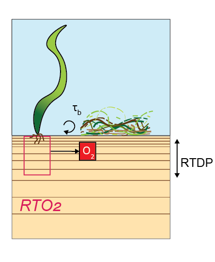

```

### Implementation within the AED framework

While the first part of the model description was about the scientific processes, this second part describes how CANDI-AED functions as one module within the AED framework.

The AED modules are designed to fit together to make a simulation with a desired degree of complexity. Most water quality modules separate reaction processes, and the AED framework is used to combine them. For example, AED Oxygen and AED Organic Matter can be combined with a hydrodynamic model. CANDI-AED is one of the most complex of the modules, in part because it has both reaction and transport components within the module. The processes are not compartmentalised into separate models, and so many switches and parameters are used within CANDI-AED to set the degree of complexity and links to the other modules.

#### Sediment-water coupling

The sediment and hydrodynamic models are coupled at the sediment-water interface. The AED model setup has separate functions for coupling the variables of the bottom-most cell of a hydrodynamic model to the top-most layer of the sediment model:

-   flux of solid (particulate) material onto the sediment surface, mmol m^-2^ d^-1^
-   concentration of dissolved substances in the bottom water, mmol m^-3^
-   flux of dissolved substances from the top sediment layer to or from the water, mmol m^-2^ d^-1^

Where there is any mismatch between the sediment and water column variables, the factor of `part_sed_scale` can be used. (`part_sed_scale` can be found in the file `aed_sdg_vars.csv`, as outlined in more detail [below](#SedSedimentWaterInterfaceBoundary).) For example, influx of the water column variable $PON$ can be distributed between sediment variables $PON_R$ and $PON_L$. `part_sed_scale` is a real number between zero and one. For any sediment variables linked to the same water column flux, the `part_sed_scale` values should sum to 1.

<br>

```{r dev-pics2, echo = FALSE, out.width='45%', fig.align='center', fig.cap = "Schematic of sediment water coupling interactions"}

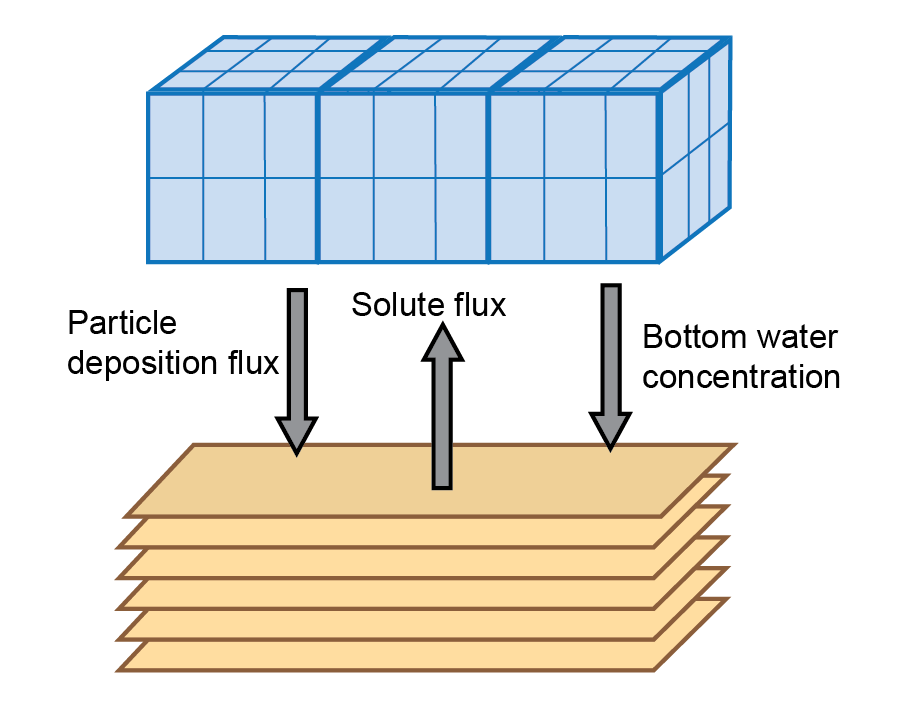

```

Depending on the nature of the host hydrodynamic model, several configurations can be implemented:

<center>

```{r 23-pic6, echo=FALSE, fig.cap="Spatial resolution options available through AED. a) Water column studies have traditionally assigned a flux to the sediment water interface without resolving the sediment chemical concentrations by depth, though they can be resolved laterally. b) The 0D water column is the method used in most sediment diagenesis studies, and use of multiple sediment zones is an option available within AED.", out.width = '95%'}
knitr::include_graphics("images/23-sediment_biogeochemistry/image6.png")
```

</center>

Fluxes of dissolved species occur between the sediment and water column. They are calculated from the concentration gradient at the sediment-water interface according to Fick's Law:

<center>

```{=tex}
\begin{equation}
F = D_{0}\frac{\Delta C}{\Delta x} = \frac{D_{0}}{\delta} (C_{bw} - C_{1})
(\#eq:biogeochem1)
\end{equation}
```
</center>

where $D_{0}$ is the diffusivity, $\delta$ is the thickness of the diffusive boundary layer at the sediment water interface and defined as the length scale of the first sediment layer, $C_{bw}$ is the bottom water concentration and $C_{1}$ is the concentration in the top sediment layer.

At the bottom of the domain ($x$ = `xl`) the model can be specified to have a fixed-concentration (`deepbc_mode` = 0) such that the concentration at $xl = C_{Bot}$, or it can be specified to have a zero-derivative (`deepbc_mode` = 1) defined as $\frac{dC}{dx}=0$ at $x = xl$.

AED environmental variables can be accessed by CANDI-AED, and in most cases they do not feed back to the water column (see section on [environmental variables](#SedEnvironmentalVariables)). Parameter-variables can also be accessed by CANDI-AED, for example *taub* and *w~00~*. *taub* affects the diffusivity and the sediment-water interface. The deposition rate *w~00~* can be linked to the water column rate using `swi_link_variable`.

#### Resolving sediment zonation

The sediment model can be set up with multiple zones. The setup is the same as in the description above, and the zone boundares are not necessarily coincident with the grid structure of the water. Using zones is a practical compromise between computational efficiency and capturing spatial heterogeneity in sediment properties and their fluxes.

For a 3D hydrodynamic model, the sediment zones are adjacent areas of the bottom of the domain, for example, stretches of a river from upstream to downstream. A 3D diagram is given in Figure \@ref(fig:dev-Grid1).

```{r dev-Grid1, echo = FALSE, out.width='100%', class = "text-image", fig.cap = "Schematic depicting sediment zone numerical approach, for a 3D hydrodynamic mesh."}
knitr::include_graphics("images/23-sediment_biogeochemistry/GridStructure/3DZones-05.png")

```

The equivalent 1D hydrodyanmic model has the water column simulated in vertical layers. The sediment zones are assigned as slices of sediment according to depth. A 1D diagram is given in Figure \@ref(fig:dev-Grid2).

```{r dev-Grid2, echo = FALSE, out.width='100%', class = "text-image", fig.cap = "Schematic depicting sediment zone numerical approach, for a 1D layered hydrodyanmic model, such as a lake.."}
knitr::include_graphics("images/23-sediment_biogeochemistry/GridStructure/1DZones-05-04.png")

```

<br>

The fluxes and concentrations in the water cells above the sediment are averaged for linked variables (Figure \ref(fig:dev-Grid3)).

```{r dev-Grid3, echo = FALSE, out.width='60%', class = "text-image",fig.show='hold',fig.align='center', out.width='60%', fig.cap = "Schematic displaying how water cells are averaged when using sediment zones with a 3D hydrodynamic model."}

knitr::include_graphics("images/23-sediment_biogeochemistry/GridStructure/ZoneAveraging-04.png")

```

```{r dev-Grid4, echo = FALSE, out.width='60%', class = "text-image",fig.show='hold',fig.align='center', fig.cap = "Schematic displaying how water cells are averaged when using sediment zones with a 1D hydrodynamic model."}
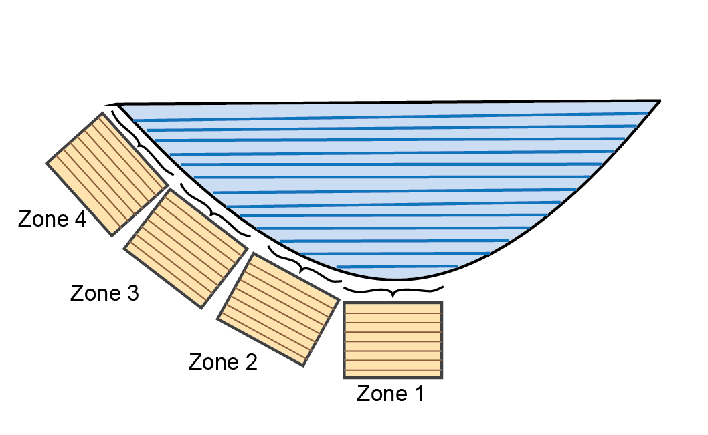
```

#### Numerical solution {#SedNumericalSolution}

The time-dependent processes in CANDI-AED are solved by an ordinary differential equation solver DVODE. The details of the numerical solution are explained in detail by Boudreau (1997). DVODE was originally developed by Brown et al. (1989) and was used in the predecessors of this code by Boudreau (1996) and Luff et al. (2000).

CANDI-AED sets up the inputs for DVODE as follows:

-   The **boundary conditions** are updated at the sediment-water interface and bottom boundary (which may be connected to other modules)

<center>

```{r Numeric1, echo=FALSE, fig.cap="", out.width = '30%'}
knitr::include_graphics("images/23-sediment_biogeochemistry/SWIBoundary/SWIboundary-03.png")
```

</center>

-   The **rates** are calculated, for example, as a product of concentration and rate constants, for example,\

    <center>

    ```{=tex}
    \begin{equation}
    R_{FeSOx} = k_{FeSOx} [O_2] [FeS]
    \end{equation}
    ```
    </center>

-   The **reactions** are calculated, as the sum of the losses or gains from the rates of consumption or production, for example,

<center>

```{=tex}
\begin{equation}
\frac {\delta O_2}{\delta t} = - R_{OM} - R_{NH4Ox} + R_{gpp} - R{rsp} + {\ \ } ... 
\end{equation}
```
</center>

-   The **transport** is calculated, as the sum of advection, diffusion and biological mixing

<center>

```{r Numeric2, echo=FALSE, fig.cap="", out.width = '25%'}
knitr::include_graphics("images/23-sediment_biogeochemistry/AdvectionDispersion/AdvectionDispersion-14.png")
```

</center>

For each time step, one numerical matrix is produced, which contains an entry at each depth. In the model code, the matrix is given the simple name `y`. There is a corresponding matrix, named `ydot`, which contains all of the changes in the variables between time steps. The matrix `y` contains:

-   Dissolved variables
-   Solid variables
-   Other variables such as pH, pe, ubalchg and IAPs
-   Reaction sums
-   Diffusion
-   Advection

For example, for the reaction of $O_2$ and $FeS$, the matrix contains a depth entry for concentration of both species. The reaction between them is calculated according to the reaction $R_{FeS}$, which also has an entry at each depth. The $O_2$ is subject to transport processes for solutes, and the $FeS$ for solids. The concentration of the reactants are updated, along with the concentration of products such as $Fe^{2+}$ and $SO_4^{2-}$. This process is then followed for all other species.

<center>

```{r Numeric3, echo=FALSE, fig.cap="Representation of the matrix structure of the ordinary differential equation solver for and example reaction. With an entry at each depth, the ODE solver calculates the concentrations of reactants from the reactions and transport. ", out.width = '75%'}
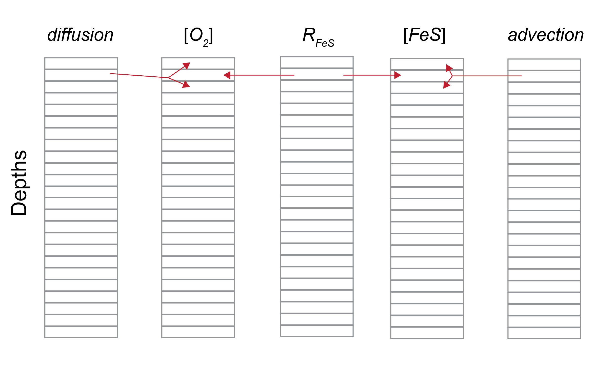
```

</center>

##### Solute transport equations: subroutine LiqMotion

A subroutine in the model code, named `LiqMotion`, calculates the solute transport equations. It ultimately produces `ydot` for solutes, which is used in the difference between time steps. `ydot` is the sum of diffusion, advection and irrigation, which are calculated separately. They are also calculated differently for each depth layer.

###### The top layer of the array

###### The top layer of the sediment

###### All intermediate layers

###### The bottom-most layer

##### Solid transport equations: subroutine SolMotion

###### The top layer of the array

###### The top layer of the sediment

###### All intermediate layers

###### The bottom-most layer

#### Module program structure

The sediment diagenesis model CANDI-AED can be used within the AED framework in various ways. This includes a) how the SDG module links to other modules in simulating water variables, and b) how the module operates within the simulated domain.

The general structure of the program is shown in Figure \@ref(fig:23-pic7). The program is firstly initialised (including spin-up days if desired), then loops through the kinetic and equilibrium reactions for each time step and writes the resulting concentrations and rates at each depth to an output file. The kinetic reactions are solved by the VODE program (Brown et al. 1989) and the equilibrium reactions by the Simplex program.

<center>

```{r 23-pic7, echo=FALSE, fig.cap="Candi program workflow. The program is firstly initialised, then loops through the kinetic and equilibrium reactions for each time step and writes the resulting concentrations and rates at each depth to an output file. The kinetic reactions are solved by the VODE program and the equilibrium reactions by the Simplex program.", out.width = '75%'}
knitr::include_graphics("images/23-sediment_biogeochemistry/ProgramStructure/ProgramStructure-04.png")
```

</center>

### Optional module links

In the hierarchy of AED modules, CANDI-AED lies towards the bottom: CANDI-AED can be dependent on many other modules for boundary conditions, and few other modules are dependent on the results of CANDI-AED. CANDI-AED can be run effectively as a stand-alone model or it can be linked to the AED modules.

As outlined in the [section on the sediment-water interface](#SedSedimentWaterInterfaceBoundary), concentration or solid particle flux at the sediment-water interface can supply the top layer of sediment with the value from the bottom most water column cell. A simulation using CANDI-AED can use the following other modules:

-   **aed_sedflux**:
-   **aed_tracer**
-   **aed_noncohesive**
-   **aed_oxygen**: $O_2$ concentration can be linked via `OXY_oxy`
-   **aed_carbon**: $CH_4$ and $DIC$ concentration can be linked via `CAR_ch4` and `CAR_dic`
-   **aed_silica**
-   **aed_nitrogen**: $NH_4^+$ and $NO_3^-$ concentration can be linked via concentration via `NIT_amm` and `NIT_nit`
-   **aed_phosphorus**: $PO_4^{3-}$ concentration can be linked via `PHS_frp`
-   **aed_organic_matter**: several solid organic matter fluxes can be linked for carbon, nitrogen and phosphorus. including `OGM_poc_swi`, `OGM_pon_swi`, and `OGM_pop_swi`
-   **aed_phytoplankton**: the macroalgae settings in CANDI-AED can be linked to environmental variables calculated in the phytoplankton module
-   **aed_totals**:

The environmental variables can be used to set parameters and configurations in CANDI-AED, as outlined in the [section below](#SedEnvironmentalVariables).

### Feedbacks to the host model

As mentioned above, there are few other modules that are dependent on the results of CANDI-AED, unless the dissolved fluxes at the sediment-water interface are switched on:

-   **aed_sedflux**: the parameter `sedflux_model` controls the setup of zones and whether the flux is taken from a constant value or from CANDI-AED
-   **aed_tracer**
-   **aed_noncohesive**
-   **aed_oxygen**: $O_2$ flux can be linked via `SDF_Fsed_oxy`
-   **aed_carbon**: $CH_4$ and $DIC$ flux can be linked via `SDF_Fsed_ch4` and `SDF_Fsed_dic`
-   **aed_silica**
-   **aed_nitrogen**: $NH_4^+$ and $NO_3^-$ fluxes can be linked via `SDF_Fsed_amm` and `SDF_Fsed_nit`
-   **aed_phosphorus**: $PO_4^{3-}$ flux can be linked via `SDF_Fsed_frp`
-   **aed_organic_matter**: several dissolved organic matter fluxes can be linked for carbon, nitrogen and phosphorus, including `SDF_Fsed_doc`, `SDF_Fsed_don` and `SDF_Fsed_dop`
-   **aed_phytoplankton**:
-   **aed_totals**:

### Variable summary {#VariableSummary}

CANDI-AED contains the largest number of variables of any AED water quality module. This section outlines the state variables and diagnostic variables, including those that are compulsory and optional.

#### State variables

A list of the state variables is given in table \@ref(tab:VarsTable). The compulsory variables are key to the biogeochemical processes in CANDI-AED and there is a switch to stop the model running if they are not requested in the variables input csv. Three variables ($pH$, $pe$ and $ubalchg$) are not requested in the input file but they are always calculated and written to the output files. The non-compulsory variables are optional and if they are not included, the model will be allowed to run. However, the results of the calculations may be unpredictable and it is recommended that unless the user is familiar with this model, the variables be left in.

The organic matter variables are more straightforward in this regard, as the `OMModel` switch leaves the unused organic matter species unreacted. For example, if `OMModel` = 1, then $POML$ will be a reactive species and $POCL$ will not react. $POCL$ will still be transported and written to the output file, but its concentration will simply disperse from the initial condition.

<center>

```{r VarsTable, echo=FALSE, message=FALSE, warning=FALSE}
library(knitr)
library(kableExtra)
library(readxl)
  options(knitr.kable.NA = "")
sediment_VarsTable <- read_xlsx("tables/23-sediment_biogeochemistry/BookdownSDGVars.xlsx", sheet="CompulsoryVars")
# View(sediment_VarsTable)
sediment_VarsTableGroups <- unique(sediment_VarsTable$Group)


  
  kable(sediment_VarsTable[,1:2],"html", escape = F, align = "c"
        , caption = "Full list of state variables.",bootstrap_options = "hover")%>%
  
    
  pack_rows(sediment_VarsTableGroups[1],
            min(which(sediment_VarsTable$Group == sediment_VarsTableGroups[1])),
            max(which(sediment_VarsTable$Group == sediment_VarsTableGroups[1])),
            background = '#ebebeb'
            ,color="black") %>%
  pack_rows(sediment_VarsTableGroups[2],
            min(which(sediment_VarsTable$Group == sediment_VarsTableGroups[2])),
            max(which(sediment_VarsTable$Group == sediment_VarsTableGroups[2])),
            background = '#ebebeb'
            ,color="black") %>%
  pack_rows(sediment_VarsTableGroups[3],
            min(which(sediment_VarsTable$Group == sediment_VarsTableGroups[3])),
            max(which(sediment_VarsTable$Group == sediment_VarsTableGroups[3])),
            background = '#ebebeb'
            ,color="black") %>%
  pack_rows(sediment_VarsTableGroups[4],
            min(which(sediment_VarsTable$Group == sediment_VarsTableGroups[4])),
            max(which(sediment_VarsTable$Group == sediment_VarsTableGroups[4])),
            background = '#ebebeb'
            ,color="black") %>%
   kable_styling(sediment_VarsTable, bootstrap_options = "hover",
                full_width = T, position = "left",
                font_size = 12) %>% 
    
  row_spec(0, background = "#14759e", bold = TRUE, color = "white") %>%
  column_spec(1, width_min = "10em" ,color="black",bold = F) %>%
  column_spec(2, width_min = "15em" ,color="black") %>%
  # column_spec(3, width_min = "15em" ,color="black") %>%
#  column_spec(4, width_min = "15em") %>%
  row_spec(1:4, background = 'white')  %>%
 scroll_box(width = "25em", height = "27em",fixed_thead = FALSE)
```

</center>

#### Diagnostic variables

There is no exhaustive list of the diagnostic variables in CANDI-AED. As described in the [outputs section](#SedOtherVariablesExtrasSed) below, most rates and factors can be written to an output .sed file using the list `morevariables`.

Another set of sheet variables is calculated within CANDI-AED and written to the netcdf output (table \@ref(tab:DiagVarsTable)). In order to set the amount of data written to the netcdf and prevent the creation of excessively large files, the parameter `diag_level` is used to set the number of diagnostics.

<center>

```{r DiagVarsTable, echo=FALSE, message=FALSE, warning=FALSE}
library(knitr)
library(kableExtra)
library(readxl)
  options(knitr.kable.NA = "")
sediment_DiagVarsTable <- read_xlsx("tables/23-sediment_biogeochemistry/BookdownSDGVars.xlsx", sheet="Diag")
# View(sediment_VarsTable)
sediment_DiagVarsTableGroups <- unique(sediment_DiagVarsTable$Group)


  
  kable(sediment_DiagVarsTable[,1:4],"html", escape = F, align = "c"
        , caption = "List of diagnostic variables written to the netcdf.",bootstrap_options = "hover")%>%
  
    
  pack_rows(sediment_DiagVarsTableGroups[1],
            min(which(sediment_DiagVarsTable$Group == sediment_DiagVarsTableGroups[1])),
            max(which(sediment_DiagVarsTable$Group == sediment_DiagVarsTableGroups[1])),
            background = '#ebebeb'
            ,color="black") %>%
  pack_rows(sediment_DiagVarsTableGroups[2],
            min(which(sediment_DiagVarsTable$Group == sediment_DiagVarsTableGroups[2])),
            max(which(sediment_DiagVarsTable$Group == sediment_DiagVarsTableGroups[2])),
            background = '#ebebeb'
            ,color="black") %>%
  pack_rows(sediment_DiagVarsTableGroups[3],
            min(which(sediment_DiagVarsTable$Group == sediment_DiagVarsTableGroups[3])),
            max(which(sediment_DiagVarsTable$Group == sediment_DiagVarsTableGroups[3])),
            background = '#ebebeb'
            ,color="black") %>%
  pack_rows(sediment_DiagVarsTableGroups[4],
            min(which(sediment_DiagVarsTable$Group == sediment_DiagVarsTableGroups[4])),
            max(which(sediment_DiagVarsTable$Group == sediment_DiagVarsTableGroups[4])),
            background = '#ebebeb'
            ,color="black") %>%
   kable_styling(sediment_DiagVarsTable, bootstrap_options = "hover",
                full_width = T, position = "left",
                font_size = 12) %>% 
    
  row_spec(0, background = "#14759e", bold = TRUE, color = "white") %>%
  column_spec(1, width_min = "10em" ,color="black",bold = F) %>%
  column_spec(2, width_min = "15em" ,color="black") %>%
  # column_spec(3, width_min = "15em" ,color="black") %>%
#  column_spec(4, width_min = "15em") %>%
  row_spec(1:4, background = 'white')  %>%
 scroll_box(width = "40em", height = "27em",fixed_thead = FALSE)
```

</center>

#### Environmental variables {#SedEnvironmentalVariables}

There are several 'environmental' variables, that can be linked from the water column model or other AED modules, to set conditions in the sediment model (table \@ref(tab:EnvVarsTable)). For example, the set of $MPB$ and $MAG$ variables is used to set the $O_2$ penetration into the upper sediment. Another example is that water column salinity from a model such as TUFLOW-FV can be used to set the sediment-water interface concentration of salt at the sediment-water interface, which is used to calculate *F~Sal~*. Salinity is set as a permanently linked variable from the water column AED model, without using `water_link`.

Water column salinity is also used to set the boundary concentration of sulfate. Although most dissolved variables are simulated using mmol L^-1^, salinity uses practical salinity units (PSU). PSU has a standard concentration of solutes, primarily chloride, sodium, magnesium and sulfate. One PSU correlates to approximately 0.9 mmol L^-1^ sulfate, and so the CANDI-AED $SO_4^{2-}$ boundary is fixed at 0.9 $\times$ salinity.

<center>

```{r EnvVarsTable, echo=FALSE, message=FALSE, warning=FALSE}
library(knitr)
library(kableExtra)
library(readxl)
  options(knitr.kable.NA = "")
sediment_EnvVarsTable <- read_xlsx("tables/23-sediment_biogeochemistry/BookdownSDGVars.xlsx", sheet="Enviro")
# sediment_EnvVarsTableGroups <- unique(sediment_VarsTable$Group)
  kable(sediment_EnvVarsTable[,1:4],"html", escape = F, align = "c"
        , caption = "List of environmental variables.",bootstrap_options = "hover")%>%
  
  kable_styling(MAG_tab, bootstrap_options = "hover",
                full_width = T, position = "left",
                font_size = 12) %>% 
  row_spec(0, background = "#14759e", bold = TRUE, color = "white") %>%
  column_spec(1, width_min = "10em" ,color="black",bold = F) %>%
  column_spec(2, width_min = "15em" ,color="black") %>%
  # column_spec(3, width_min = "15em" ,color="black") %>%
#  column_spec(4, width_min = "15em") %>%
  row_spec(1:4, background = 'white')  %>%
 scroll_box(width = "45em", height = "25em",fixed_thead = FALSE)
```

</center>

\

### Parameter and option summary {#SedParameterAndOptionSummary}

The preceding details were an explanation of the scientific aspects of this diagenesis model. Practical implementation is outlined below.

The model is set up via the name list text file `aed.nml` using the module keyword `&aed_seddiagenesis` and a model namelist block termed `&aed_sediment` configured to select the `sediment_model` as "Dynamic" or "Dynamic2D" option. Once this is selected, the model will search for the `&aed_sedcandi` parameter block.

In addition to adding the code block to `aed.nml`, users must also supply a valid AED sediment parameter database file (`aed_candi_pars.csv` is the default name) and a variable definition file (`aed_sdg_vars.csv` is the default name). If external boundaries are required, then a `swibc_file` and a `deepbc_file` also need to be supplied. The four key places for the model setup are summarised in table \@ref(tab:3dev-sedBouIni)), along with the file locations, and whether the settings are different for a simulation with more than one zone.

Users can create a standard file in the correct format from the online [**AED parameter database**](https://aed.see.uwa.edu.au/research/models/AED/aed_dbase/db_edit.php) by selecting from the available sediment types of interest, downloading via the **"Make CSV"** button, and then tailoring to the simulation being undertaken as required.

<center>

```{r 3dev-sedBouIni, echo=FALSE, message=FALSE, warning=FALSE}
library(knitr)
library(kableExtra)
library(readxl)
  options(knitr.kable.NA = "")
sediment_BoundaryInitial <- read_xlsx("tables/23-sediment_biogeochemistry/UserManual.xlsx", sheet="BoundaryInitial")
  kable(sediment_BoundaryInitial,"html", escape = F, align = "c", caption = "File locations for major inputs of parameters, initial conditions and boundary conditions.",
      bootstrap_options = "hover") %>%
  kable_styling(sediment_BoundaryInitial, bootstrap_options = "hover",
                full_width = T, position = "left",
                font_size = 12) %>%
  row_spec(0, background = "#14759e", bold = TRUE, color = "white") %>%
  column_spec(1, width_min = "10em" ,color="black",bold = T) %>%
  column_spec(2, width_min = "15em" ,color="black") %>%
  column_spec(3, width_min = "15em" ,color="black") %>%
#  column_spec(4, width_min = "15em") %>%
  row_spec(1:4, background = 'white') %>%
  scroll_box(width = "50em", height = "27em",fixed_thead = FALSE)
```

</center>

#### Module settings: &aed_sed_candi

The parameters set at the module level are outlined in table \@ref(tab:param-nml). These parameters are the same for all zones.

<center>

```{r param-nml, echo=FALSE, message=FALSE, warning=FALSE}
library(knitr)
library(kableExtra)
library(readxl)

param_nml <- read_xlsx("tables/23-sediment_biogeochemistry/BookdownParams.xlsx", sheet = "aed_sed_candi" )
  param_nmlGroups <- unique(param_nml$Group)
kable(param_nml[,1:3],"html", escape = F, align = "c", caption = "Parameters in &aed_sed_candi.",
     bootstrap_options = "hover") %>%

  
   kable_styling(param_nml, bootstrap_options = "hover",
               full_width = F, position = "center",
               font_size = 12) %>%
  pack_rows(param_nmlGroups[1],
            min(which(param_nml$Group == param_nmlGroups[1])),
            max(which(param_nml$Group == param_nmlGroups[1])),
            background = '#ebebeb'
            ,color="black") %>%
  pack_rows(param_nmlGroups[2],
            min(which(param_nml$Group == param_nmlGroups[2])),
            max(which(param_nml$Group == param_nmlGroups[2])),
            background = '#ebebeb'
            ,color="black") %>%
  pack_rows(param_nmlGroups[3],
            min(which(param_nml$Group == param_nmlGroups[3])),
            max(which(param_nml$Group == param_nmlGroups[3])),
            background = '#ebebeb'
            ,color="black") %>%
  pack_rows(param_nmlGroups[4],
            min(which(param_nml$Group == param_nmlGroups[4])),
            max(which(param_nml$Group == param_nmlGroups[4])),
            background = '#ebebeb'
            ,color="black") %>%
  pack_rows(param_nmlGroups[5],
            min(which(param_nml$Group == param_nmlGroups[5])),
            max(which(param_nml$Group == param_nmlGroups[5])),
            background = '#ebebeb'
            ,color="black") %>%
  pack_rows(param_nmlGroups[6],
            min(which(param_nml$Group == param_nmlGroups[6])),
            max(which(param_nml$Group == param_nmlGroups[6])),
            background = '#ebebeb'
            ,color="black") %>%
 row_spec(0, background = "#14759e", bold = TRUE, color = "white") %>%
 column_spec(1, width_min = "15em",color="black") %>%
 column_spec(2, width_min = "15em",color="black") %>%
 column_spec(3, width_min = "10em",color="black") %>%
 row_spec(1:3, background = 'white') %>%
 scroll_box(width = "700px", height = "400px",
            fixed_thead = FALSE)
```

</center>

#### Zone-specific parameters

The majority of CANDI-AED parameters are specified for each zone, using the input parameter file. The default name is `aed_candi_pars.csv` but the user can change this in `aed.nml` `&aed_sedcandi`.

##### *Physical domain and numerical parameters* {.unnumbered}

The physical properties of the sediment are given in Table \@ref(tab:param-Mixing) and \@ref(tab:param-Layers). In general, the SDG module was set to run with a time-step of 2 hours, resolve a vertical sediment depth of 80 cm using 50 layers.

Some parameters are set as constant values for all zones, while others are set to be variable in each zone. The variability of bioturbation and irrigation along the length of the lagoon is set using the depth of the effect ($x_1$, $x_2$ and $x_{irrig}$) rather than the intensity ($DB_0$, $\alpha_0$). Upper porosity $\rho_0$ is held at 0.9 (i.e. 90% porewater) for all zones and the lower porosity $\rho_{00}$ is based on measured data at sites in each zone.

<center>

```{r param-Mixing, echo=FALSE, message=FALSE, warning=FALSE}
param_Mixing <- read_xlsx("tables/23-sediment_biogeochemistry/BookdownParams.xlsx", sheet = "Mixing" )
kable(param_Mixing,"html", escape = F, align = "c", caption = "Sediment physical properties, given in aed_candi_parameters.csv.",
     bootstrap_options = "hover") %>%
   kable_styling(param_Mixing, bootstrap_options = "hover",
               full_width = F, position = "center",
               font_size = 12) %>%
 row_spec(0, background = "#14759e", bold = TRUE, color = "white") %>%
 column_spec(1, width_min = "10em") %>%
 column_spec(2, width_min = "20em") %>%
 column_spec(3, width_min = "10em") %>%
 row_spec(1:5, background = 'white') %>%
 scroll_box(width = "600px", height = "380px",
            fixed_thead = FALSE)
```

\

```{r param-Layers, echo=FALSE, message=FALSE, warning=FALSE}
param_Layers <- read_xlsx("tables/23-sediment_biogeochemistry/BookdownParams.xlsx", sheet = "Layers" )
kable(param_Layers,"html", escape = F, align = "c", caption = "Sediment layer setup parameters and mixing parameters that might vary by zone, to set simulation with differences in sediment quality across space, given in aed_candi_parameters.csv.",
     bootstrap_options = "hover") %>%
   kable_styling(param_Layers, bootstrap_options = "hover",
               full_width = F, position = "center",
               font_size = 12) %>%
 row_spec(0, background = "#14759e", bold = TRUE, color = "white") %>%
 column_spec(1, width_min = "10em") %>%
 column_spec(2, width_min = "20em") %>%
 column_spec(3, width_min = "10em") %>%
 row_spec(1:5, background = 'white') %>%
 scroll_box(width = "600px", height = "350px",
            fixed_thead = FALSE)
```

</center>

\

##### *Organic matter parameters* {.unnumbered}

Many of the key processes in the sediment are driven by organic matter oxidation. Fresh organic matter supplied to the sediment surface fuels the bacterially-driven primary redox reactions that constantly shift the chemical equilibrium in the sediment. Organic matter metabolism also releases organic N and P to the water column. The parameters are given in Table \@ref(tab:param-OM).

The organic matter model option number 2 was used in this project. This option has both particulate and dissolved organic phases, and simulates organic C, N and P as separate state variables.

<center>

```{r param-OM, echo=FALSE, message=FALSE, warning=FALSE}
param_OM <- read_xlsx("tables/23-sediment_biogeochemistry/BookdownParams.xlsx", sheet = "OM" )
kable(param_OM ,"html", escape = F, align = "c", caption = "Organic matter oxidation parameters, given in aed_candi_parameters.csv.",
     bootstrap_options = "hover") %>%
   kable_styling(param_OM, bootstrap_options = "hover",
               full_width = F, position = "center",
               font_size = 12) %>%
 row_spec(0, background = "#14759e", bold = TRUE, color = "white") %>%
 column_spec(1, width_min = "10em") %>%
 column_spec(2, width_min = "20em") %>%
 column_spec(3, width_min = "10em") %>%
 row_spec(1:5, background = 'white') %>%
 scroll_box(width = "600px", height = "300px",
            fixed_thead = FALSE)
```

</center>

<br>

\

##### *Secondary redox reactions* {.unnumbered}

Secondary redox reactions are formed from the by-products of primary redox reactions. The nitrogen redox cycle parameters are given in Table \@ref(tab:param-Nredox).

<center>

```{r param-Nredox, echo=FALSE, message=FALSE, warning=FALSE}
param_Nredox <- read_xlsx("tables/23-sediment_biogeochemistry/BookdownParams.xlsx", sheet = "NRedox" )
kable(param_Nredox ,"html", escape = F, align = "c", caption = "Nitrogen redox cycle parameters, given in aed_candi_parameters.csv.",
     bootstrap_options = "hover") %>%
   kable_styling(param_Nredox, bootstrap_options = "hover",
               full_width = F, position = "center",
               font_size = 12) %>%
 row_spec(0, background = "#14759e", bold = TRUE, color = "white") %>%
 column_spec(1, width_min = "10em") %>%
 column_spec(2, width_min = "20em") %>%
 column_spec(3, width_min = "10em") %>%
 row_spec(1:5, background = 'white') %>%
 scroll_box(width = "600px", height = "275px",
            fixed_thead = FALSE)
```

</center>

\
\
\
\

Secondary redox parameters for other processes are given in Table \@ref(tab:param-SecondaryRedox).

<center>

```{r param-SecondaryRedox, echo=FALSE, message=FALSE, warning=FALSE}
param_SecondaryRedox <- read_xlsx("tables/23-sediment_biogeochemistry/BookdownParams.xlsx", sheet = "SecondaryRedox" )
kable(param_SecondaryRedox ,"html", escape = F, align = "c", caption = "Secondary redox parameters, given in aed_candi_parameters.csv.",      bootstrap_options = "hover") %>%
   kable_styling(param_SecondaryRedox, bootstrap_options = "hover",
               full_width = F, position = "center",
               font_size = 12) %>%
 row_spec(0, background = "#14759e", bold = TRUE, color = "white") %>%
 column_spec(1, width_min = "10em") %>%
 column_spec(2, width_min = "20em") %>%
 column_spec(3, width_min = "10em") %>%
 row_spec(1:5, background = 'white') %>%
 scroll_box(width = "600px", height = "325px",
            fixed_thead = FALSE)
```

</center>

<br>

\

##### *Geochemistry parameters* {.unnumbered}

Equilibrium and precipitation/dissolution constants are given in Table \@ref(tab:param-Geochem).

<center>

```{r param-Geochem, echo=FALSE, message=FALSE, warning=FALSE}
param_Geochem <- read_xlsx("tables/23-sediment_biogeochemistry/BookdownParams.xlsx", sheet = "Geochem" )
kable(param_Geochem ,"html", escape = F, align = "c", caption = "Geochemistry and precipitation/dissolution parameters, given in aed_candi_parameters.csv.",
      bootstrap_options = "hover") %>%
   kable_styling(param_Geochem, bootstrap_options = "hover",
               full_width = F, position = "center",
               font_size = 12) %>%
 row_spec(0, background = "#14759e", bold = TRUE, color = "white") %>%
 column_spec(1, width_min = "10em") %>%
 column_spec(2, width_min = "20em") %>%
 column_spec(3, width_min = "10em") %>%
 row_spec(1:5, background = 'white') %>%
 scroll_box(width = "600px", height = "310px",
            fixed_thead = FALSE)
```

</center>

<br>

#### Hidden parameters: aed_readcandi.F90 {.unnumbered}

A set of parameters that the user is unlikely to need to change has been removed from the model input files and set in the model code (table \@ref(tab:param-Hidden)).

<center>

```{r param-Hidden, echo=FALSE, message=FALSE, warning=FALSE}
param_Hidden <- read_xlsx("tables/23-sediment_biogeochemistry/BookdownParams.xlsx", sheet = "hidden" )
kable(param_Hidden ,"html", escape = F, align = "c", caption = "Other parameters, which are not currently listed in the parameter input file.",
      bootstrap_options = "hover") %>%
   kable_styling(param_Hidden, bootstrap_options = "hover",
               full_width = F, position = "center",
               font_size = 12) %>%
 row_spec(0, background = "#14759e", bold = TRUE, color = "white") %>%
 column_spec(1, width_min = "30em") %>%
 row_spec(1:5, background = 'white') %>%
 scroll_box(width = "500px", height = "310px",
            fixed_thead = FALSE)
```

## Setup & Configuration

The model is set up via the name list text file `aed.nml` using the module keyword `&aed_seddiagenesis` and a model namelist block termed `&aed_sediment` configured to select the `sediment_model` as "Dynamic" or "Dynamic2D" option. Once this is selected, the model will search for the `&aed_sedcandi` parameter block.

An example `aed.nml` configuration block for the `aed_seddiagenesis` module that includes multiple active sediment zones, plus microphytobenthos (MPB) and seagrass links, is shown below:

<br>

```{fortran, eval = FALSE}
!###############################################################################
! aed_seddiagenesis
!-------------------------------------------------------------------------------
&aed_sediment
   sediment_model    = 'DYNAMIC'    ! engages the CANDI-AED model
   mpb_link_variable = 'PHY_mpb'    ! use to set link for MPB
   mag_link_variable = 'MA2_mag'    ! use to set link for macroalgae inputs
   mac_link_variable = 'MAC_mac'    ! use to set link for macrophyte root inputs
   swi_link_variable = 'NCS_swi'    ! use to set link for variable w00
/
&aed_sed_candi
  !-- Time Settings --!
   spinup_days     =  90
   spinup_dt       =   0.25
   driver_dt       = 900     
   substep         =   8       
  !-- Zones details --!
   n_zones         = 5
   active_zones    = 104,103, 53, 23, 12,11
   zone_types      =   5, 3, 3, 1, 1
  !-- General Setup Options  --!
   dbase           = './AED/aed_candi_params.csv'
   vars_files      = './AED/aed_sdg_vars.csv'
   geochem_file    = './AED/aed_geochem_pars.dat'
  !-- Sediment Boundary Conditions  --!
   swibc_mode      = 0      ! previously ibc2
   deepbc_mode     = 1      ! previously ibbc
   swibc_file      = './AED/aed_sediment_swibc.dat'
   deepbc_file     = './AED/aed_sediment_deepbc.dat'
   swibc_filevars  = '' ! 'oxy', 'nit', 'amm', 'frp', 'poml'   ! from_bc_file
   deepbc_filevars = '' ! ,OXY_oxy,                            ! use_deep_bc
   flux_scale      = 1
  !-- Initial Conditions  --!
   SolidInitialUnit= 'mmolLsolid'
   OMInitMethodL   = 'LI_I'
   OM_topL         = 1
   OM_minL         = 0.9
   OM_cfL          = 0.6
   InitMinDepthL   = 99
   OMInitMethodR   = 'LI_I'
   OM_topR         = 1
   OM_minR         = 0.3
   OM_cfR          = 0.6
   InitMinDepthR   = 50
   POMVR           = 0.3
  !-- Outputs  --!
   diag_level         = 10
   output_profiles    =  .TRUE.
   morevariables      = 'Rgpp','Rrsp','FO2','f_an'
   output_diag_vars   = 'mpb','oxy','amm','docl','pocl','docr'
   n_ddpths           = 2
   output_diag_depths = 1.0, 5.0  ! cm below swi
/
```

<br>

<br>

```{block2, pars-text, type='rmdnote'}
In addition to adding the above code block to `aed.nml`, users must also supply a valid AED sediment parameter database file (`aed_candi_pars`) and a variable definition file ('aed_sdg_vars'). Both of these files file must be supplied in either `CSV` format. 
Users can create a standard file in the correct format from the online [**AED parameter database**](https://aed.see.uwa.edu.au/research/models/AED/aed_dbase/db_edit.php) by selecting from the available sediment types of interest, downloading via the **"Make CSV"** button, and then tailoring to the simulation being undertaken as required. Carefully check the parameter units and values!
```

<br>

<br>

The sections above described the scientific and technical processes within the model, the links to other AED modules, and the range of variables and parameters. This section outlines how the model treats the initial condition and boundary conditions.

### Setup details and examples

This section contains a set of steps for how to set up a simple simulation. Due to the large number of variables and parameters in CANDI-AED a full set of example parameters is not presented here. However, the lists of the tables above all contain example values that the user can consult.

#### Hydrodynamic model setup details and examples

The duration of the sediment model simulation is set within the parameters of the hydrodynamic driver model. For example, if using GLM, the duration is set in `glm.nml`, `&time`, then either if `timefmt` = 2, the `start` and `stop` times are set, or if `timefmt` = 3, the `num_days` parameter sets the number of days. If using TUFLOW-FV, the time is set in the .fvc file, where the `start time` and `stop time` are set as dates.

The sediment zone setup of the hydrodynamic model is also set in the hydrodynamic model parameters. The sediment model can be run without any zones, however, if zones are required, the user will need to make sure the zone numbers are aligned.

#### Module settings and examples

Recommendations for the module-level settings, and information about the necessary modules that are related to CANDI-AED are given below. Please see the [parameter section](#SedParameterAndOptionSummary) above for the full list of names, units and examples of the module-level parameters.

##### *&aed_sed_candi* {.unnumbered}

Most parameters in the &aed_sed_candi block can be left at the default values. The `substep` and `driver_dt` can be adjusted to optimise the simulation for speed and numerical stability. If the simulation is stable, then `spinup_days` are not required. The list of `active_zones` should correspond to the zones set in the hydrodynamic model and the parameter files. Users should check that the file paths and file names of the parameter and variable files are correctly set up in the user's directories. The boundary condition parameters and the initial condition parameters can be left at their default values. From the output settings, the `output_profiles` can be set to *TRUE* so that the .sed files are written. Any `morevariables` and `output_diag_vars` are set here.

##### *&aed_models* {.unnumbered}

The user should ensure that `aed_seddiagenesis` is included in the `models` list. It must come after `aed_totals`.

##### *&aed_sedflux* {.unnumbered}

The parameter `sedflux_model` must be set to `Dynamic2d` for the sediment-water column models to be coupled.

##### *&aed_sed_const2d* {.unnumbered}

If the sediment model is running in fewer zones than the water column model, then the water column model takes constant values for the sediment fluxes. The fluxes are listed in this code block.

##### *&aed_sediment* {.unnumbered}

Some of the names of the linking variables are listed here, for example, `mpb_link_variable` = `PHY_mpb`, `mag_link_variable` = `MA2_mag`, `mac_link_variable` = `MAC_mac` and `swi_link_variable` = `NCS_swi`.

##### *Fsed linking variables* {.unnumbered}

The names of Fsed linking variables are set in the various nml blocks. If a linking flux is desired, the user should check that each linking variable is set properly in each block. For example, to link the *diss_flux_link* for $O_2$, the parameter `Fsed_oxy_variable` is set to `SDF_Fsed_oxy` in `aed_oxygen` and also in the variables .csv file. This applies similarly for `&aed_nitogen` `Fsed_amm_variable` = `SDF_Fsed_amm` and `SDF_Fsed_nit`.

#### Zone-specific parameter details and examples

Recommendations for the zone-level settings are given below. All parameters can be set for each zone and therefore used to configure zones differently. If only one zone is needed, then the first set of parameters are used. Please see the [parameter section](#SedParameterAndOptionSummary) above for the full list of names, units and examples of the zone-level parameters.

##### *Physical domain and numerical parameters* {.unnumbered}

The parameters `xl` and `maxnpts` set the depth of the simulation and the number of layers. `xl` is often set to around 30 cm. This is deeper than biological mixing and it is around the depth of a field measurement such as a grab sample or core. Deeper than around 50 cm, most diagenetic processes are stable compared to the upper layers and so it is unlikely that a simulation deeper than 50 is necessary. The number of layers, `maxnpts` can be around 50. The simulation will require enough layers to resolve a profile of the upper sediment layers and few enough layers to keep the output file size to a minimum. Some tuning of `maxnpts` may be necessary if the simulation is unstable.

The porosity parameters `p0` and `p00` are key parameters that can make a simulation specific to a study site. For example, a sandy sediment can have low porosity whereas a clay sediment can have very high porosity. Similarly, the sedimentation rate `w00` has a large effect on the dynamics of a simulation and it is an important parameter for making a simulation specific to a study site. Unfortunately, it is rarely measured in the environment.

Bioturbation and bioirrigation depths (`x1`, `x2` and `xirrig`) have a large effect on the evolution of concentration profiles. If the water column is well oxygenated then these parameters will influence the oxic depth. These parameters also reflect a study site. If an environment has a healthy benthic environment, there will be a lot of mixing, whereas a eutrophic, hypersaline or anoxic environment will have little or no mixing.

##### *Organic matter parameters* {.unnumbered}

The `OMModel` parameter is used to set the complexity of the organic matter setup. The simplest is `OMModel` = 1, which can also be most easily compared with published studies. Once the `OMModel` is set, the oxidation rate parameters are set. For example, for `OMModel` 1, the oxidation rates of the labile and refractory phases can be set to approximately `poml2dic` = 100 and `pomr2dic` = 1 y^-1^. (A literature survey of this parameter can be found in Paraska et al. 2014.)

##### *Secondary redox parameters* {.unnumbered}

Default parameters can be used for nitrogen redox parameters, unless a simulation is specifically trying to tune to concentrations of nitrogen redox species. Other secondary redox parameters can be left at the default settings.

##### *Geochemistry parameters* {.unnumbered}

The key geochemistry paramter to select is `rxn_mode` (see section [*Mineral precipitation and ageing*](#SedMineralPrecipitationAndAgeing) and \@ref(tab:Geochem-table4) above). `rxn_mode` = 0 turns off precipitation, ageing and *pH* and is therefore the simplest setup. `rxn_mode` = 2 allows the constant precipitation and ageing of minerals, without any equilibrium.

#### Boundary setting details and examples

##### *Sediment-water interface boundary* {.unnumbered}

Boundary condition settings are described below in the [*Boundary settings* section](#SedBoundarySettings), including example fluxes and concentrations. The simplest boundary setting is *default_vals* rather than linked variables or the boundary file. In general, oxidised variables are present at the sediment-water interface, for example, $O_2$, $NO_3^-$, $MnO_2$ and $Fe(OH)_{3A}$. (Reduced species can be used in the initial profiles.) $SO_4^{2-}$ is generally at the sediment-water interface in a saline environment and not in a freshwater environment.

#### Initial condition setup details and examples

Initial condition settings are described below in the [*Sediment initialisation options* section](#SedInitialisation), including examples of concentrations (of solids or in porewater). The simplest setup can start with low or zero concentrations and allow the profiles to evolve. In general, reduced species will be present in the sediment, for example $NH_4^+$, $Mn^{2+}$, $Fe^{2+}$, $H_2S$ and $CH_4$. The exact concentrations can be set for each variable according to any available measured data.

### Sediment initialisation options {#SedInitialisation}

Before the first time step starts, CANDI-AED loads in an initial concentration profile for each state variable. There is also a period of 'negative time' before the full reactive transport system begins.

#### Initialisation of concentration profiles {.unnumbered}

Concentration profiles are set using one of three options: constant, linear decrease or exponential decrease (`CO_I`, `LI_I`, `EX_I`) (figure \@ref(fig:Init-5b)).

The default for most initial concentrations is the constant option. The concentration for each variable is set in the input file `aed_sdg_vars.csv`, in the column `initial_vals` (\@ref(fig:Init-6b)). If the simulation has several zones, then the initial concentration for the zone is set in other columns in the csv, under the column headings `initial_01`, `initial_02` etc. If there is no initial column in the csv for a particular zone, then the zone defaults to the value in the `initial_vals` column.

```{r Init-5b, echo=FALSE, fig.cap="Schematic of three possible options for initial profiles. Most concentrations default to the constant option, whereas organic matter is usually set to be linear or exponential.",fig.show='hold',fig.align='center' ,out.width = '100%'}
knitr::include_graphics("images/23-sediment_biogeochemistry/Initialisation/InitialProfile-03.png")
```

\

```{r Init-6b, echo=FALSE, fig.cap="Simplified image of the `aed_sdg_vars.csv` input file. For initialisation, the `variables` need to be set, along with default `initial_vals` or zones-specific `initial_01`, `initial_02` etc. columns.",fig.show='hold',fig.align='center' ,out.width = '100%'}
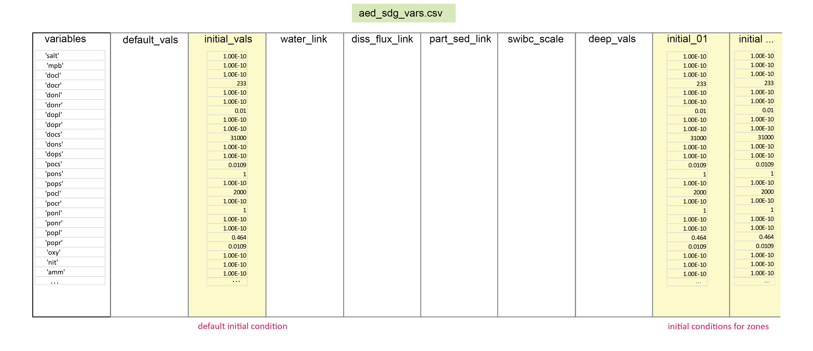
```

\

#### Initialisation of organic matter profiles

For organic matter, the initial profiles are set to either the linear or exponential options. For the linear option, the initial concentration is still taken from `initial_vals` in `aed_sdg_vars.csv`. The upper and lower concentrations are set as percentages of the initial concentration using the parameters `OM_top` and `OM_Min`, which are found in the `&aed_sed_candi` block in the `aed.nml` namelist. There are separate parameters for labile and refractory organic matter, so the parameter names are in fact `OM_topL` and `OM_topR`, and `OM_minL` and `OM_minR`. These parameters are real numbers as decimals between 0 and 1. The `OM_Top` fraction applies to the surface concentration. The `OM_Min` applies at the depth `InitMinDepth` (cm), which is also set in the `&aed_sed_candi` block.

For the exponential option, the initial concentration decreases according to equation \@ref(eq#init-7b):

```{=tex}
\begin{eqnarray}
concentration = initial vals \times e^ {- OM cfl \times depth} 
(\#eq:init-7b)
\end{eqnarray}
```
The shape of the curve is determined by the parameter `OM_cfl`, which is found in the `&aed_sed_candi` block.

#### Timing switches {#SedTimingSwitches}

The duration of the simulation is determined by the hydrodynamic model and its parameter inputs. Other timing parameters are set as outlined below.

##### *Substep* {.unnumbered}

The general task for the reactive transport model is to calculate a change in concentration over time, as a function of a change in concentration over space and as a result of chemical reactions. The general form of this is given in equation \@ref(eq:tim-1). When this is solved numerically, it is discretised by small increments of time, which are referred to as 'time steps' (Δt in equation \@ref(eq:tim-2)).

To allow the part of the model that solves these differential equations to process a large change in concentration over space or because of a large reaction, the timestep can be multiplied by a substep factor. Examples of where this is needed include a sharp concentration gradient over a small area, or in influx of a large amount of highly reactive substances.

```{=tex}
\begin{eqnarray}
 \frac {\delta C} {\delta t} = \frac {\delta C} {\delta x} + reactions
(\#eq:tim-1)
\\
\\
 {\Delta C} = (\frac {\Delta C} {\Delta x} + reactions) \times \Delta t
(\#eq:tim-2)
\end{eqnarray}
```
##### *Spinup substep* {.unnumbered}

In some simulations the initial timesteps have a high probability that the numerical model may crash while processing the initial condition (figure \@ref(fig:Timing-2)). A slow substep overcomes this problem, however, it has the disadvantage of producing a longer run time. The solution for this problem is the tool `firststeps` (y), which sets an initial time period during which a slower substep (`substep_0`) is used, and after which the normal substep (`substep_1`) is used. The switch `timeswitch` must be set to 1 for this feature to work, otherwise the normal `substep` applies.

```{r Timing-2, echo=FALSE, fig.cap="Schematic of the timestep across time. A different timestep (`substep_0`) can be used for a period (`firsteps`) until another timestep is used (`substep_1`).   ",fig.show='hold',fig.align='center', out.width = '75%'}
knitr::include_graphics("images/23-sediment_biogeochemistry/TimeSwitches/TimeSwitches-02.png")
```

##### *Transport without reaction* {.unnumbered}

Another tool to help move through the spinup period is to allow transport processes to occur before the reactions start (figure \@ref(fig:Timing-3)). This evens out sharp chemical concentration gradients. This allows the simulation to start before the proper time of the simulation, represented in \@ref(fig:Timing-3) as negative time. The parameter `spinup_days` is the number of timestep integers of negative time, and `spinup_dt` is the length of each timestep (h). No fluxes at the sediment-water interface occur during negative time.

```{r Timing-3, echo=FALSE, fig.cap="Schematic of the timestep over time. The initial period up to `spinup_days` occurs in 'negative time', at a duration of `spinup_dt`.",fig.show='hold',fig.align='center', out.width = '75%'}
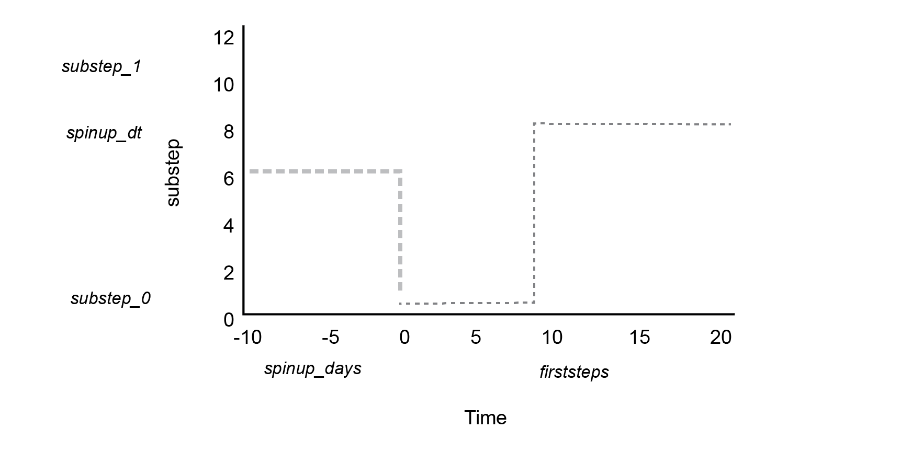
```

##### *Evolution of concentration profiles* {.unnumbered}

After initialisation, the concentration profile develops through the course of the simulation. Some of the most common ways for the profile to develop are given in figure \@ref(fig:Init-7b).

```{r Init-7b, echo=FALSE, fig.cap= "Examples of how the concentration profiles develop after initialisation. Left: the variable accumulates at the surface. Centre: a concentration spike develops. Right: the variable accumulates in the deep sediment.  ",fig.show='hold',fig.align='center' ,out.width = '100%'}
knitr::include_graphics("images/23-sediment_biogeochemistry/Initialisation/ProfileEvolution-05.png")
```

### Boundary settings {#SedBoundarySettings}

#### Sediment-water interface boundary {#SedSedimentWaterInterfaceBoundary .unnumbered}

##### *Static option:* default_vals {.unnumbered}

For the boundary at the sediment-water interface, the value is set using the `default_vals` column in the input file `aed_sdg_vars.csv` (figures \@ref(fig:SWI-1), \@ref(fig:SWI-2)). These values are constant in time for the entire simulation. Solids are a deposition flux (mmol m^-2^ y^-1^) and solutes are a concentration (mmol m^-3^). Variables may have other switches or options applied to them, as outlined below, but otherwise the values default to this. To enable this option, set `swibc_mode` = 1.

```{r SWI-1, echo=FALSE, fig.cap="Sediment-water interface boundary inputs that are constant in time are set with `default_vals`. ",fig.show='hold',fig.align='center' ,out.width = '60%'}
knitr::include_graphics("images/23-sediment_biogeochemistry/SWIBoundary/default_vals-10.png")
```

\

```{r SWI-2, echo=FALSE, fig.cap="Simplified image of the `aed_sdg_vars.csv` input file. The `variables` and `default_vals` need to be set for each row of the csv.",fig.show='hold',fig.align='center' ,out.width = '100%'}
knitr::include_graphics("images/23-sediment_biogeochemistry/aed_sdg_vars/aed_sdg_vars-02.png")
```

##### *Dynamic options:* linked variables {.unnumbered}

There are four methods for linking variables to the water column model: - particle deposition flux using `part_sed_link` - solute flux using `diss_flux_link` - bottom water concentration using `water_link` - fixed linked variables

These do not need to be set for any variable, but they may be set for any variable. `part_sed_link` and `water_link` must be set for solids and solutes and cannot both be assigned to one variable. If a variable is not set to be linked, the csv contains double inverted commas (" ") and the value is set to the `default_vals`. To enable this option, set `swibc_mode` = 0.

As mentioned above, where there is any mismatch between the sediment and water column variables, the factor of `part_sed_scale` can be used. `part_sed_scale` can be found in the file `aed_sdg_vars.csv`. `part_sed_scale` is a real number between zero and one. For any sediment variables linked to the same water column flux, the `part_sed_scale` values should sum to 1.

If a variable is linked, it is linked for all zones.

Environmental variables have a fixed link to the water column: $Salinity$, $Temperature$ and $\tau_b$. These variables are key components of hydrodynamic models but do not undergo any rates of change in the sediment model. They are used to affect other sediment processes. As mentioned in the [*Environmental variables* section](#SedEnvironmentalVariables), the $SO_4^{2-}$ concentration (mmol L^-1^) is fixed at 0.9 $\times$ salinity (PSU).

```{r SWI-3, echo=FALSE, fig.cap="Schematic of possible linked variable options at the sediment-water interface. Particle fluxes and bottom water concentraitons go from the water column to the sediment. Sediment solutes can also be set to flux to the water column.",fig.show='hold',fig.align='center' ,out.width = '60%'}

```

```{r SWI-4, echo=FALSE, fig.cap="Simplified image of the `aed_sdg_vars.csv` input file. Linking variables may be set in the same row as the variable, or left blank with inverted commas.",fig.show='hold',fig.align='center' ,out.width = '100%'}
knitr::include_graphics("images/23-sediment_biogeochemistry/aed_sdg_vars/aed_sdg_vars-05.png")
```

##### *Dynamic options:* swibc file {#DynamicOptionsSwibcFile .unnumbered}

A dynamic boundary can be set for any variable and any zone using the text file swibc.dat (\@ref(fig:SWI-5)). For a variable to be activated to take its boundary from swibc.dat, it must be included in the list `swibc_filevars`, which is a parameter in the `&aed_sed_candi` block. The specific filename and filepath are set in the parameter `swibc_file` in the `&aed_sed_candi` block. The swibc file has the following features:

-   **timestep** column: The number of the point where anything changes from the previous entry.\\
-   **time** column: The time (days) at which a change occurs. Unlike a time series, each time step does not need to be listed. However, if there is a change in any one of the variables, an entry must be included in that row for all of the variables.\\
-   **forzone** row: The zone for which the variable in this file applies. If a zone is not listed, then the variable in that zone will take the `default_vals`.\\
-   **variable** columns: The value at the boundary until the next point of change.\\
-   **w00h00** columns: if any column is labelled `w00h00`, then a dynamic poreflux is applied to that zone.\\

The benefit of using this file is that a time-changing boundary can be applied for a selection of variables and zones, while leaving other combinations of variables and zones unchanged. To enable this option, set `swibc_mode` = 10.

```{r SWI-5, echo=FALSE, fig.cap="Schematic of the sediment-water interface boundary supplied by the `swibc.dat` text file.",fig.show='hold',fig.align='center' ,out.width = '60%'}
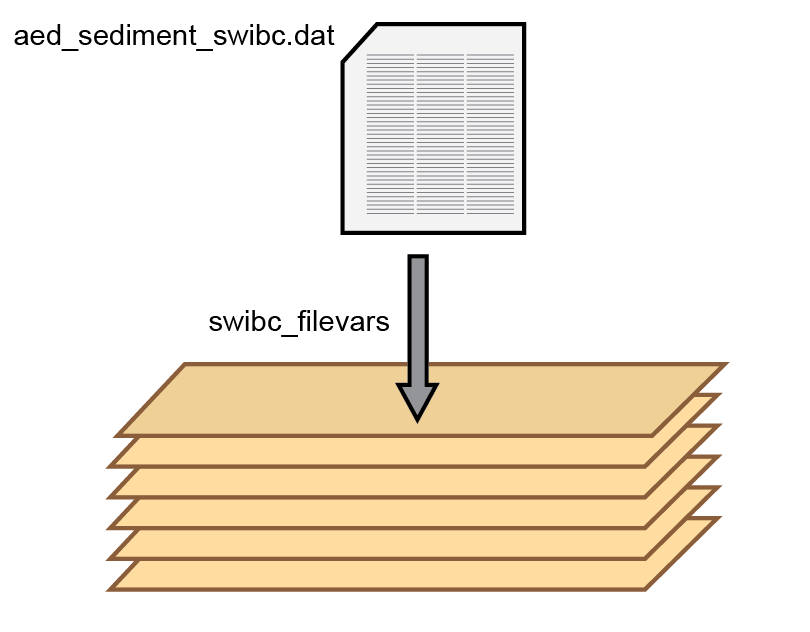
```

```{r SWI-6, echo=FALSE, fig.cap="Simplified image of the swibc.dat text file.",fig.show='hold',fig.align='center' ,out.width = '85%'}
knitr::include_graphics("images/23-sediment_biogeochemistry/SWIBoundary/swibcdat-01.png")
```

##### *Special organic matter flux* {.unnumbered}

The sediment model has a unique boundary condition, where a large influx of organic matter occurs for a limited time (figure \@ref(fig:Timing-1)). This represents, for example, the operation of a fish farm, a large algal bloom or an illegal dump of organic waste into a lake. This is a convenient tool for looking at the effect of large amounts of organic matter on other chemical species, and it operates separately to the constant flux boundaries, the swibc input file, or the variables linked to the pelagic model. The flux defaults to 0.0 before the time parameter `fluxon` and after the time parameter `fluxoff` (y). The state variable switched on by this flux is $POM_{Special}$. It is not named as, for example, labile or refractory because the user can tailor its properties to the simulation. The breakdown parameter for $POM_{Special}$ is `pomspecial2dic` (y^-1^). The parameter ibc2 must be set to 10 or 0 for this feature to operate. The magnitude of $POM_{Special}$ flux is set in the file aed_sdg_vars.csv, in the default_vals column, and the default flux before `fluxon` and after `fluxoff` times is zero. To enable this option, set `swibc_mode` = 2.

```{r Timing-1, echo=FALSE, fig.cap="Schematic of $POM_{Special}$ flux over time. $POM_{Special}$ flux begins at time `fluxon` and stops at time `fluxoff`. The rate of the flux is `pomspecial`.",fig.show='hold',fig.align='center', out.width = '75%'}
knitr::include_graphics("images/23-sediment_biogeochemistry/TimeSwitches/TimeSwitches-01.png")
```

##### *Combined organic matter flux and timestep switch* {.unnumbered}

A large influx of organic matter can have the same effect for the model as processing the initial condition, and so the large flux can crash the model well after the initial spinup (figure \@ref(fig:Timing-4)). Therefore, further substep parameters are available for slowing the model while it processes the organic matter. The parameter `substep_2` is used as the substep after `fluxon`. The parameter `substep_3` is used as an intermediate substep after `fluxoff`, until the time `justwaitabit`, to allow the final effects of the organic matter influx to be processed, but allowing the possibility of running faster if not at the speed of `substep_1`. Further *substep* options are explained in the [timing switches section](#SedTimingSwitches).

```{r Timing-4, echo=FALSE, fig.cap="Schematic of $POM_{Special}$ flux and timestep changes over time. Options are available to optimise a short run total time with a slow substep centred around organic matter influx.",fig.show='hold',fig.align='center', out.width = '75%'}
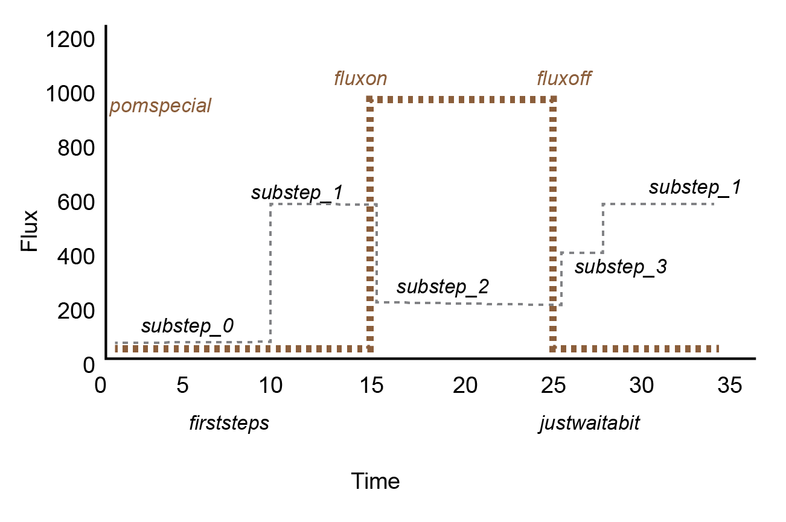
```

#### Bottom boundary {.unnumbered}

##### *Static option:* deep_vals {.unnumbered}

A boundary can be supplied beneath the deepest cell using `deep_vals` (\@ref(fig:Deep-1)). The value is taken from `deep_vals`, which is in the input file `aed_sdg_vars.csv` (\@ref(fig:Deep-2)). (`deep_vals` is the lower boundary equivalent of the sediment-water interface `default_vals`.) In most instances a bottom boundary would not be supplied, however, if there were a simulation with, for example, groundwater infiltration, then this option is used. If the value in `deep_vals` is negative, no boundary is applied, and so the file has a default -999 for all variables. To enable this option, set `deepbc_mode` = 1.

```{r Deep-1, echo=FALSE, fig.cap="Bottom boundary inputs that are constant in time are set with `deep_vals`. ",fig.show='hold',fig.align='center', out.width = '60%'}
knitr::include_graphics("images/23-sediment_biogeochemistry/DeepBoundary/deep_vals-12.png")
```

```{r Deep-2, echo=FALSE, fig.cap="Simplified image of the `aed_sdg_vars.csv` input file. deep_vals are set if a value is present, greater than zero, corresponding to a variable.",fig.show='hold',fig.align='center' ,out.width = '100%'}
knitr::include_graphics("images/23-sediment_biogeochemistry/aed_sdg_vars/aed_sdg_vars-03.png")
```

\

##### *Dynamic option:* deep_bc file {#DynamicOptionsDeepbcFile .unnumbered}

A dynamic boundary can be set for any variable and any zone using the text file deepbc.dat (\@ref(fig:Deep-3)). For a variable to be activated to take its boundary from deepbc.dat, it must be included in the list `deebc_filevars`, which is a parameter in the `&aed_sed_candi` block. The specific filename and filepath are set in the parameter `deepbc_file` in the `&aed_sed_candi` block. The deepbc file is the bottom boundary equivalent of the swibc file. It has the following features:

-   **timestep** column: The number of the point where anything changes from the previous entry.\\
-   **time** column: The time (days) at which a change occurs. Unlike a time series, each time step does not need to be listed. However, if there is a change in any one of the variables, an entry must be included in that row for all of the variables.\\
-   **forzone** row: The zone for which the variable in this file applies. If a zone is not listed, then the variable in that zone will take the `default_vals`.\\
-   **variable** columns: The value at the boundary until the next point of change.\\
-   **pf** columns: if any column is labelled `pf`, then a dynamic poreflux is applied to that zone.

The benefit of using this file is that a time-changing boundary can be applied for a selection of variables and zones, while leaving other combinations of variables and zones unchanged. To enable this option, set `deepbc_mode` = 10.

```{r Deep-3, echo=FALSE, fig.cap="Schematic of the bottom boundary supplied by the `deepbc.dat` text file.",fig.show='hold',fig.align='center', out.width = '60%'}
knitr::include_graphics("images/23-sediment_biogeochemistry/DeepBoundary/DeepBC-11.png")
```

## Output & Post-processing

CANDI-AED has a range of output files and output file options.\

### Concentration of state variables: '.sed' files

The model writes output files for each state variable (chemical species, $IAP$s, $pH$, $pe$ and $ubalchg$) as text files, with a '.sed' extension. The files are written to the results directory, under the `candi_aed` subdirectory, and then in a separate subdirectory for each zone (with five significant figures), for example `.../results/candi_aed/00001/oxy.sed`. The '.sed' file has three rows of headers, then a row that lists the depths (cm). The first column is the sequence of output times (years). The other text entries are a matrix of the concentration values at each depth and each time (mmol L^-1^) (figure \@ref(fig:Output-1)). These can be read in using a data processing program such as R, Matlab or Excel for analysis and plotting \@ref(fig:Output-4).

```{r Output-1, echo=FALSE, fig.cap="Simplified version of the .sed output file.",fig.show='hold',fig.align='center', out.width = '85%'}
knitr::include_graphics("images/23-sediment_biogeochemistry/Outputs/Outputs-01.png")
```

```{r Output-4, echo=FALSE, fig.cap="Examples of the figures that can be plotted with the .sed file. Left: concentration-depth at one time step; centre: concentration-time at one depth; right: concentration-depth-time ",fig.show='hold',fig.align='center', out.width = '75%'}
knitr::include_graphics("images/23-sediment_biogeochemistry/Outputs/Outputs-04.png")
```

### Flux of state variables: 'swi_fluxes.sed'

The model writes output files for sediment-water interface fluxes, named `swi_fluxes.sed`. As with the concentration '.sed' files, the 'swi_fluxes' files are written to the results directory, under the `candi_aed` subdirectory, and then in a separate subdirectory for each zone (with five significant figures), for example `.../results/candi_aed/00001/swi_fluxes.sed`. The file has one row of the names of all state variables, and the second row for whether the variables are solids or solutes. The first column is the sequence of output times (years). Only the post-spinup times (positive time) are written to the file, as there are no fluxes during spinup. The other text entries are the flux values (mmol ^-2^ y^-1^), where a positive value is a flux into the sediment, and a negative value is a flux to the bottom water (figure \@ref(fig:Output-2)). As with the '.sed' files, these files can be processed and plotted (\@ref(fig:Output-5)).

```{r Output-2, echo=FALSE, fig.cap="Simplified version of the `swi_fluxes.sed` file.",fig.show='hold',fig.align='center', out.width = '85%'}
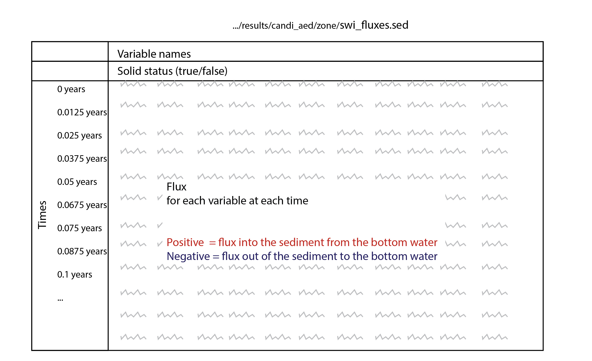
```

```{r Output-5, echo=FALSE, fig.cap="Example of a figure that can be plotted from fluxes.sed ",fig.show='hold',fig.align='center', out.width = '75%'}
knitr::include_graphics("images/23-sediment_biogeochemistry/Outputs/Outputs-05.png")
```

### Other variables: '/Extras/ .sed' {#SedOtherVariablesExtrasSed}

Any variable listed in the `&aed_sed_candi` block parameter `morevariables` can be written if to a file if desired. Extra '.sed' files can be written to a subdirectory of the zone directory, for example `.../results/candi_aed/00001/Extras/RO2.sed`. The file has the same format as the other '.sed' files, however, it does not record values during the spinup period (figure \@ref(fig:Output-3)). The unit of the variable is dependent on what is used in the model code and there is no unit conversion before the file is written.

```{r Output-3, echo=FALSE, fig.cap="Simplified version of the extra .sed file. ",fig.show='hold',fig.align='center', out.width = '85%'}
knitr::include_graphics("images/23-sediment_biogeochemistry/Outputs/Outputs-03.png")
```

### Depth profile settings: 'Depths.sed'

The model writes a text file that reports the initial depth profile settings, with one entry per layer (`maxnpts`). One file is written for each sediment zone and it is not updated throughout the simulation, for example `.../results/candi_aed/00001/Depths.sed`. The file can be useful in post-processing, including performing unit conversions. The outputs include

-   *Depths*: The depths of the grid layers from the sediment-water interface (cm)\
-   *Porosity*: The volume of water per volume of space, between 0 and 1\
-   *Irrigation*: The initial irrigation\
-   *Bioturbation*: The initial bioturbation\
-   *Layer_size_cm*: The sizes of the layers (cm)\
-   *Porewater_m3_per_m2*: The volume of porewater in each layer (m^3^ m^-2^)\
-   *Solids_m3_per_m2*: The volume of sediment solids (m^3^ m^-2^)\

### Mass balance calculation

The function *Mass* within the CANDI-AED code calculates the mass balance of some species.

Firstly it calculates *FOM_in*, which is the influx of

<!-- ### netcdf outputs: .nc{-} -->

<!-- As with other modules, the NetCDF files include the model outputs.  -->

<!-- ### Diagnostics: {-} -->

<!--   INTEGER  :: diag_level = 10                ! 0 = no diagnostic outputs\ -->

<!--                                              ! 1 = basic diagnostic outputs\ -->

<!--                                              ! 2 = flux rates, and supporitng\ -->

<!--                                              ! 3 = other metrics\ -->

<!--                                              !10 = all debug & checking outputs\ -->

<!-- ### Rates: rates.sed{-} -->

<!-- The model outputs the file `rates.sed` for each variable at every depth for the final time step. -->

## Case Studies & Examples

Three case studies are outlined below.

### Case study: Model benchmark example

#### Model setup

##### *Base simulation* {.unnumbered}

The model CANDI-AED was tested against the published modelling results of Van Cappellen and Wang (1996) in order to confirm that the model worked as expected, and also to demonstrate the flexibility of the model system. For this simulation, all boundary fluxes, bottom water concentrations, and rate constants were set to the same values as those in Van Cappellen and Wang (1996). The organic matter redox approach was set to Approach 2, by setting `OMApproach` = 2. The organic matter oxidation model was parameterized with no organic matter influx and with an oxidation rate that changes with depth (`OMModel` = 1, `VCW` = *TRUE*). The surface oxidation rate and depth attenuation were the same as Van Cappellen and Wang (1996). The irrigation coefficient was also set to be the same as in Van Cappellen and Wang (1996), using `irrigswitch` = 2. The mineral precipitation reactions were implemented only for MnCO3, FeCO3 and FeS, as per the equations in Van Cappellen and Wang (1996), rather than the larger set of precipitation reactions (`rxn_mode` = 4). Additionally, the ageing reactions of iron and manganese minerals were disabled. Ammonium adsorption was included and was the same as in Van Cappellen and Wang (1996), however, iron and manganese adsorption has not yet been included. An equivalent evenly spaced grid was used (`job` = 1), with 400 layers (`mxnpts`) to a depth of 20 cm (`xl`).

##### *Parameter variation* {.unnumbered}

The model was run with random variation in its parameter values, to assess the sensitivity of the outputs to the parameter values. The base simulation above was run again with variations of the uncertain parameters listed in Table 6 of Van Cappellen and Wang (1996). Rather than using the ranges that Van Cappellen and Wang used, the range was set using their chosen parameter value as the median. 100 simulations were run using a Matlab script, with individual parameter values automatically generated using a Monte Carlo-based method. The results of each simulation were then collated and the total results were assessed for distribution about the median value.

<center>

```{r param-VCW1, echo=FALSE, message=FALSE, warning=FALSE}
library(knitr)
library(kableExtra)
library(readxl)
param_VCW1 <- read_xlsx("tables/23-sediment_biogeochemistry/UserManual.xlsx", sheet = "VCW1" )
kable(param_VCW1 ,"html", escape = F, align = "c", caption = "Parameters varied in the uncertainty analysis, within the ranges chosen by Van Cappellen and Wang (1996).",
      bootstrap_options = "hover") %>%
   kable_styling(param_Hidden, bootstrap_options = "hover",
               full_width = F, position = "center",
               font_size = 12) %>%
 row_spec(0, background = "#14759e", bold = TRUE, color = "white") %>%
 column_spec(1, width_min = "5em") %>%
 column_spec(2, width_min = "15em") %>%
 column_spec(3, width_min = "10em") %>%
 column_spec(4, width_min = "5em") %>%
 row_spec(1:5, background = 'white', color = "black") %>%
 scroll_box(width = "45em", height = "25em",fixed_thead = FALSE)
```

</center>

#### Results

##### *Concentrations* {.unnumbered}

The $O_2$ concentration profile matched the Van Cappellen and Wang simulation very closely, apart from the concentration at the deepest point, which was slightly higher than the field data (Figure \@ref(fig:VCW-1) (a)). The results for $O_2$ were very consistent about the median value. The slightly higher concentration of oxygen at the deepest point in this simulation may have carried through to inhibit denitrification, causing the concentration of $NO_3^-$ to be higher than in the Van Cappellen and Wang simulation (Figure \@ref(fig:VCW-1) (a)). $NO_3^-$ was similarly consistent about the median. The $NH_4^+$ field data points were lower than the median of these simulations but within the range of these simulations (Figure \@ref(fig:VCW-1) (c)). $pH$ was between 7 and 8, and both $NH_4^+$ and $pH$ had increasing ranges with depth (Figure \@ref(fig:VCW-1) (d)).

The $MnO_2$ and $Fe(OH)_{3A}$ concentrations matched the data points closely, however, the $Mn^{2+}$ and $Fe^{2+}$ concentrations in this simulation peaked at a higher concentration around 2 cm (Figure \@ref(fig:VCW-1) (e) to (h)). It was suspected that this might have resulted from poor resolution of the grid, however, this simulation had the same number and size of layers as Van Cappellen and Wang. Below 5 cm deep the simulation had a lower concentration than the field data, but the deepest 5 field data points for $Fe^{2+}$ were within the ranges of the simulations.

$H_2S$ had the greatest variation relative to its concentration, which increased with depth (Figure \@ref(fig:VCW-1) (i)). $FeS$ concentration had a consistently concave shape whereas the field data appeared to be concave around 3 cm deep, and the relatively high concentration of $FeS$ at 5 mmol L^-1^ in the oxic zone was not within the range of these simulations (Figure \@ref(fig:VCW-1) (j)). $FeS$ could be simulated close to the field data, but only by fixing the bottom boundary at 45 mmol L^-1^ and not because of its precipitation from $Fe^{2+}$ and $H_2S$.

```{r VCW-1, echo=FALSE, fig.cap="Concentration-depth profiles for major variables from 100 simulations, including the median result (black line), ranges of results (grey bands) and field data from Van Cappellen and Wang (1996) (squares).",fig.show='hold',fig.align='center', out.width = '80%'}
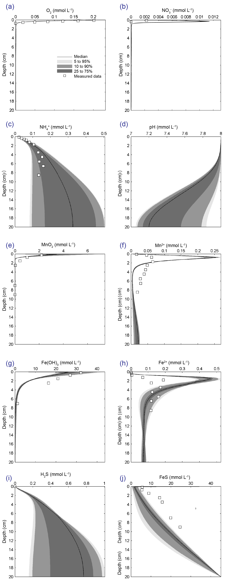
```

##### *Reaction rates* {.unnumbered}

The rates of aerobic respiration and denitrification using CANDI-AED were close to the simulated rates of Van Cappellen and Wang (1996), though in the deepest part of the sediment, the simulated aerobic rate was greater using this model (Figure \@ref(fig:VCW-2) (b)). As a result of the classic inhibition sequence, oxygen penetration to greater depths limited denitrification to a deeper depth layer (Figure \@ref(fig:VCW-2) (c)). This carried through to the peaks of all oxidation rates, which then occurred at slightly greater depths than in the Van Cappellen and Wang simulation. The maximum manganese reduction rate was smaller than in the Van Cappellen and Wang simulation, however, in both models the manganese reduction rate was very small relative to the other terminal oxidation processes (Figure \@ref(fig:VCW-2) (d)). The iron reduction rate was similar to the Van Cappellen and Wang rate, although slightly smaller, and could not be increased without leading to greater discrepancy in the dissolved iron concentration profiles (Figure \@ref(fig:VCW-2) (e)). The sulphate reduction profiles were very close and as with Van Cappellen and Wang, methanogenesis was completely inhibited (Figure \@ref(fig:VCW-2) (f)).

```{r VCW-2, echo=FALSE, fig.cap="Profiles of organic matter oxidation rate with depth. Plot (a) was the total organic matter reaction rate set by a fixed depth-oxidation rate, which Van Cappellen and Wang based on the measured data (squares). Plots (b) to (f) are these simulated rates (solid lines) compared with the simulated rates of Van Cappellen and Wang (dashed lines) and in the case of sulphate reduction, measured data (squares, (f))",fig.show='hold',fig.align='center', out.width = '80%'}
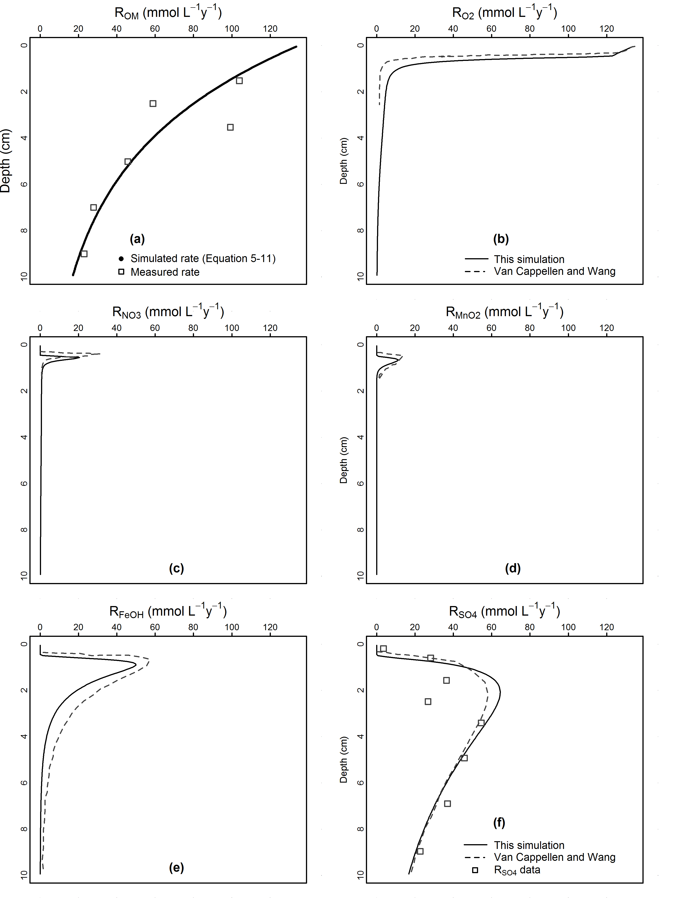
```

### Case study: Aquaculture and sediment recovery

#### Introduction

This work was to calculate the potential effect of aquaculture on the sediment condition of fish cages propose for installation near Delma Island, UAE. The approach was similar to work done in 2015 on a proposed aquaculture site in the Abrolhos Islands, Western Australia (Paraska et al. 2015). The main objective of this part of the project was to calculate sediment chemical pore water concentrations and fluxes to the water column in response to variable deposition loads.

The primary input to the sediment model was reactive organic matter derived from aquaculture waste. This was calculated by models that tracked the transport and deposition of waste particles as a result of the hydrodynamics at the study site and different fish stocking scenarios. The organic matter deposition was then used as input to the sediment diagenesis model. The resulting waste particle distributions and sediment chemistry were then used to calculate the spatial effect of the cage operations on the sediment environment, as well as the greater chemistry and ecology of the water column.

The motivation behind the study was to ensure that potentially detrimental effects to the ecosystem were avoided. Fish cages may be positioned in one place for up to five years, after which the cage would be moved and the environment left to recover to its background condition (Figure \@ref(fig:UAEFish-1)).

```{r UAEFish-1, echo=FALSE, fig.cap="Schematic of the design of the aquaculture simulation. The simulation had a period of spin up, a period of aquaculture and then a recovery period.",fig.show='hold',fig.align='center', out.width = '80%'}
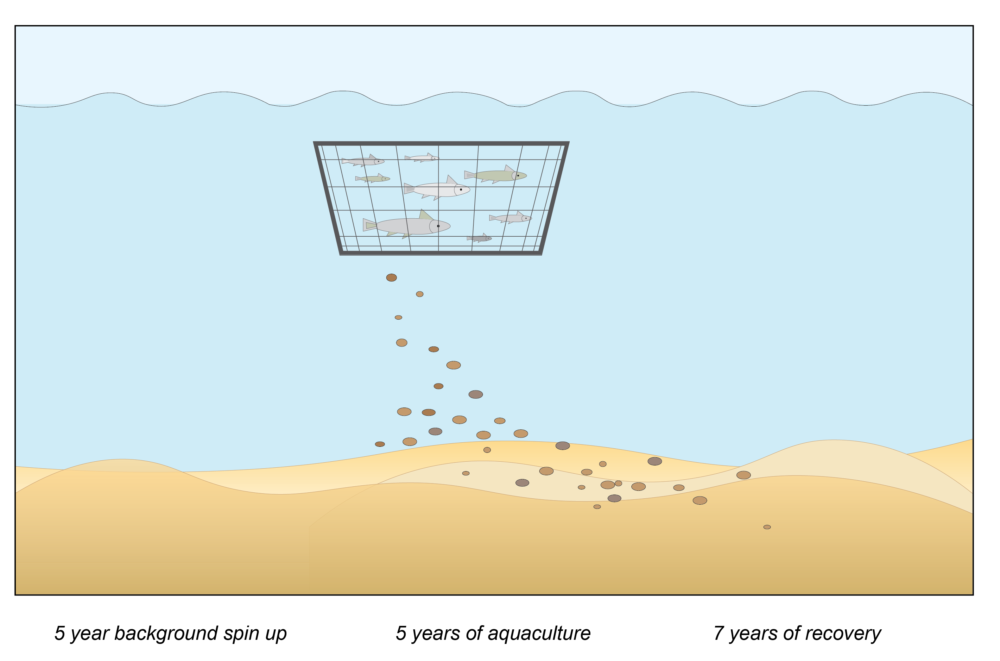
```

Given enough energy in the water column, the concentrations of chemicals can return to background relatively quickly. However, the conditions in the sediment can take much longer to recover to background levels, because the transport of chemicals is much slower. In particular, there may be a high concentration of $H_2S$ and low concentration of $O_2$, which together would make the environment uninhabitable for benthic fauna. Further, there may be an ongoing flux of nitrogen and phosphorus from the sediment to the water column, which could fuel algal blooms.

#### Methods

##### *UAE study site chemical concentrations and fluxes* {.unnumbered}

Field data was measured at the study site in October 2017 and analysed in November 2017. CANDI-AED was tailored to as many local conditions as possible. Since the $O_2$ and $NO_3^-$ concentrations were high and the $NH_4^+$ concentration was zero, it was assumed that the water column was aerobic. Total nitrogen in the sediment was measured as approximately 300 mg kg^-1^, which was converted to approximately 30 mmol L^-1^. Inorganic phosphate and total phosphate in the bottom water were set to zero, since their concentrations were below the detection limit. Total phosphorus in the sediment was measured as approximately 500 mg kg^-1^, which was converted to approximately 20 mmol L^-1^.

Total organic carbon was measured as approximately 0.6% carbon g sediment^-1^. This was converted as approximately 600 mmol L^-1^, after dividing by molecular mass and multiplying by bulk density. The C:N:P ratio of background organic matter fluxes was set after calibrating the top 5 cm of sediment to field conditions. This was calibrated well to field conditions, however, it resulted in a ratio that is rich in N and P compared to refractory carbon that is typically present in sediments. It was decided that given this uncertainty, it would be best to calibrate to field conditions. This also resulted in a conservative approach to calculating background nutrient fluxes, in that they would not be underestimated. \$SO_4\^{2-} concentration was set as the same for the bottom water boundary and for the initial sediment porewater concentration, since this was a marine site.

Manganese and iron concentrations were below the detection limit in the water column field data, and so they were set to zero in the simulations. The reaction of iron and manganese with organic matter can affect the generation of $H_2S$, and therefore the ecological effect on the surface sediments. Therefore, an extra simulation was run with assumed low background iron and manganese influxes, to examine the effect, as outlined below. Manganese and iron concentrations in the sediment were measurable, and so to reconcile this difference between sediment and water concentrations, it was assumed that the measured sediment iron and manganese reflected crystallized, non-reactive minerals (known in diagenesis models as $Fe(OH)_{3B}$ and $MnO_{2B}$).

<center>

```{r param-UAE1, echo=FALSE, message=FALSE, warning=FALSE}
library(knitr)
library(kableExtra)
library(readxl)
param_UAE1 <- read_xlsx("tables/23-sediment_biogeochemistry/UserManual.xlsx", sheet = "UAE" )
kable(param_UAE1 ,"html", escape = F, align = "c", caption = "Details of water chemistry specification for the sediment model",
      bootstrap_options = "hover") %>%
   kable_styling(param_Hidden, bootstrap_options = "hover",
               full_width = F, position = "center",
               font_size = 12) %>%
 row_spec(0, background = "#14759e", bold = TRUE, color = "white") %>%
 column_spec(1, width_min = "10em" , color = "black") %>%
 column_spec(2, width_min = "10em", color = "black") %>%
 column_spec(3, width_min = "10em", color = "black") %>%
 # column_spec(4, width_min = "5em") %>%
 row_spec(1:5, background = 'white', color = "black") %>%
 scroll_box(width = "45em", height = "20em",fixed_thead = FALSE)
```

</center>

##### *Aquaculture waste input parameters* {.unnumbered}

The C:N:P ratio of the aquaculture waste was supplied based on calculations based on a cage-model for fish biomass and waste properties. The rate constant for bacterial consumption of organic matter was set to 10 y^-1^. This is one of the most uncertain, yet crucial parameters in diagenesis modelling. The equivalent value used by Brigolin et al (2009) was 8 y^-1^. Considering that the water temperature at this study site may reach 40 °C, microbial metabolism, and therefore the rate constant, for all processes may approach a value twice as high as this. However, the value of 10 y^-1^ was used in order to take a conservative approach to environmental recovery time.

##### *Physical properties* {.unnumbered}

The simulated sediment was 20 cm deep, and had 100 layers of exponentially increasing size from the sediment-water interface (0.25 mm) to the deepest layer (4 mm). The rate of particle deposition to the sediment-water interface was set to 0.2 cm y-1. Sediment porosity was not measured at the study site and so an assumption of 0.6 (water/total volume) was assumed for the bulk of the sediment, increasing to 0.9 in the upper 5 cm.

##### *Simulation approach* {.unnumbered}

The overall approach was to assess the sediment over a "gradient" of different waste loading intensities. The setup was a matrix of forty simulations, with ten input fluxes tested, each for 4 aquaculture durations (table \@ref(tab:param-UAE2)).

Each simulation was for 23 years, with a 10 year period of background conditions, then the aquaculture period, then a recovery period. The duration of aquaculture was varied as either 1, 3 or 5 years. (For the larger fluxes, an additional period immediately following aquaculture was required, which had a fine time step.)

<center>

```{r param-UAE2, echo=FALSE, message=FALSE, warning=FALSE}
library(knitr)
library(kableExtra)
library(readxl)
param_UAE2 <- read_xlsx("tables/23-sediment_biogeochemistry/UserManual.xlsx", sheet = "UAE2" )
kable(param_UAE1 ,"html", escape = F, align = "c", caption = "Details of water chemistry specification for the sediment model",
      bootstrap_options = "hover") %>%
   kable_styling(param_Hidden, bootstrap_options = "hover",
               full_width = F, position = "center",
               font_size = 12) %>%
 row_spec(0, background = "#14759e", bold = TRUE, color = "white") %>%
 column_spec(1, width_min = "10em" , color = "black") %>%
 column_spec(2, width_min = "15em", color = "black") %>%
 column_spec(3, width_min = "15em", color = "black") %>%
 # column_spec(4, width_min = "5em") %>%
 row_spec(1:5, background = 'white', color = "black") %>%
 scroll_box(width = "45em", height = "20em",fixed_thead = FALSE)
```

</center>

#### Results

##### *Fluxes* {.unnumbered}

Results of the steady state oxygen and nutrient fluxes being returned from the diagenesis model for the range of depositional rates (FOM) are shown below (figure \@ref(fig:UAEFish-2), table \@ref(tab:param-UAE4).

```{r UAEFish-2, echo=FALSE, fig.cap="Summary of the nutrient fluxes at the sediment water interface returned from the diagenesis model for a wide range of input dpeositional flux rates.",fig.show='hold',fig.align='center', out.width = '110%'}
knitr::include_graphics("images/23-sediment_biogeochemistry/UAEFish/Results1.png")
```

\

<center>

```{r param-UAE4, echo=FALSE, message=FALSE, warning=FALSE}
library(knitr)
library(kableExtra)
library(readxl)
param_UAE4 <- read_xlsx("tables/23-sediment_biogeochemistry/UserManual.xlsx", sheet = "UAE4" )
kable(param_UAE4 ,"html", escape = F, align = "c", caption = "Nutrient and oxygen flux results for several depositional categories.",
      bootstrap_options = "hover") %>%
   kable_styling(param_Hidden, bootstrap_options = "hover",
               full_width = F, position = "center",
               font_size = 12) %>%
 row_spec(0, background = "#14759e", bold = TRUE, color = "white") %>%
 column_spec(1, width_min = "7em" , color = "black", bold = T) %>%
 column_spec(2, width_min = "7em", color = "black") %>%
 column_spec(3, width_min = "7em", color = "black") %>%
 column_spec(4, width_min = "7em", color = "black") %>%
 column_spec(5, width_min = "7em", color = "black") %>%
 # column_spec(6, width_min = "7em", color = "black") %>%
 row_spec(1:5, background = 'white', color = "black") %>%
 scroll_box(width = "45em", height = "24em",fixed_thead = FALSE)
```

</center>

Recovery time periods are shown below in Figure \@ref(fig:UAEFish-3) UAEFish-3, and threshold depositional rates for recovery time categorisation is summarised in Table \@ref(tab:param-UAE6). The impact zone thresholds are summarised in Table \@ref(tab:param-UAE7).

\

```{r UAEFish-3, echo=FALSE, fig.cap="Predicted recovery time of the sediment for the 2cm oxygen and solfide concentration to return to within 85% of the pre-farmign value. Series depicted for aquaculture loading periods of 1-5 years.",fig.show='hold',fig.align='center', out.width = '90%'}
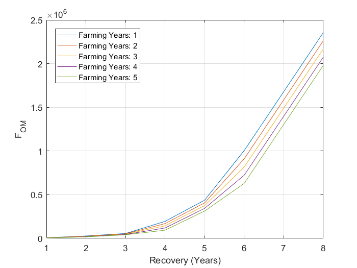
```

<center>

```{r param-UAE6, echo=FALSE, message=FALSE, warning=FALSE}
library(knitr)
library(kableExtra)
library(readxl)
param_UAE6 <- read_xlsx("tables/23-sediment_biogeochemistry/UserManual.xlsx", sheet = "UAE6" )
kable(param_UAE6 ,"html", escape = F, align = "c", caption = "Nutrient and oxygen flux results for several depositional categories.",
      bootstrap_options = "hover") %>%
   kable_styling(param_Hidden, bootstrap_options = "hover",
               full_width = F, position = "center",
               font_size = 12) %>%
 row_spec(0, background = "#14759e", bold = TRUE, color = "white") %>%
 column_spec(1, width_min = "12em" , color = "black", bold = T) %>%
 column_spec(2, width_min = "12em", color = "black") %>%
 column_spec(3, width_min = "12em", color = "black") %>%
 column_spec(4, width_min = "12em", color = "black") %>%
 column_spec(5, width_min = "12em", color = "black") %>%
 # column_spec(6, width_min = "7em", color = "black") %>%
 row_spec(1:5, background = 'white', color = "black") %>%
 scroll_box(width = "45em", height = "17em",fixed_thead = FALSE)
```

<br>

```{r param-UAE7, echo=FALSE, message=FALSE, warning=FALSE}
library(knitr)
library(kableExtra)
library(readxl)
param_UAE7 <- read_xlsx("tables/23-sediment_biogeochemistry/UserManual.xlsx", sheet = "UAE7" )
kable(param_UAE7 ,"html", escape = F, align = "c", caption = "Depositional thresholds for four impact zone settings, summarised for 4 aquaculture operation periods.",
      bootstrap_options = "hover") %>%
   kable_styling(param_Hidden, bootstrap_options = "hover",
               full_width = F, position = "center",
               font_size = 12) %>%
 row_spec(0, background = "#14759e", bold = TRUE, color = "white") %>%
 column_spec(1, width_min = "7em" , color = "black", bold = T) %>%
 column_spec(2, width_min = "7em", color = "black") %>%
 column_spec(3, width_min = "7em", color = "black") %>%
 column_spec(4, width_min = "7em", color = "black") %>%
 # column_spec(5, width_min = "7em", color = "black") %>%
 # column_spec(6, width_min = "7em", color = "black") %>%
 row_spec(1:4, background = 'white', color = "black") %>%
 scroll_box(width = "45em", height = "12em",fixed_thead = FALSE)
```

</center>

\

### Case study: The Coorong Dynamics Model

CANDI-AED was used as part of the assessment of the Coorong Lagoon in South Australia. It was used as part of [a greater project](https://aquaticecodynamics.github.io/cdm-science/index.html), in conjunction with a fully 3D resolved Tuflow-FV model of the lagoon, that had full biogeochemistry modules and habitat assessments. In particular, the nutrient budgets and the effects of the hypersalinity were calculated. The [sediment modelling component of the project](https://aquaticecodynamics.github.io/cdm-science/sediment-biogeochemistry.html) in particular looked at the effect of hypersalinity on bioturbation and bioirrigation rates, and the resulting effects such as denitrification.

```{r CoorongSVG-1, echo=FALSE, fig.cap="Test",fig.show='hold',fig.align='center', out.width = '90%'}
knitr::include_graphics("images/23-sediment_biogeochemistry/VCW/t_D_C_6panel_oxy.svg")
```

```{r CoorongPNG-1, echo=FALSE, fig.cap="Test",fig.show='hold',fig.align='center', out.width = '100%'}
knitr::include_graphics("images/23-sediment_biogeochemistry/UAEFish/ThreePlots_popl_13_reso_500.png")
```

```{r CoorongPNG-2, echo=FALSE, fig.cap="Test",fig.show='hold',fig.align='center', out.width = '100%'}
knitr::include_graphics("images/23-sediment_biogeochemistry/UAEFish/ThreePlots_popl_13_reso_1000.png")
```

```{r CoorongPNG-3, echo=FALSE, fig.cap="Test",fig.show='hold',fig.align='center', out.width = '100%'}
knitr::include_graphics("images/23-sediment_biogeochemistry/UAEFish/ThreePlots_amm_11_reso_200.png")
```

### Case study: Mass balance and numerical error checking

#### Aim

As a reactive transport model, CANDI-AED has a complex set of reactions. It was possible that a numerical error was present in the model, but masked by the other processes. For example, a numerical error could possibly remove or create mass, but this could be masked by the other reaction and transport processes. Thus the overall aim of this section was to run a set of simple simulations in which a possible loss or gain of mass would be distinguished from reaction and transport.

#### Method

##### Solid mass integration and flux accumulation comparison

##### Solute mass integration and flux accumulation comparison

##### Simulation matrix

#### Results

##### Simulation matrix

##### General result

#### Discussion

## References

Berg, P., S. Rysgaard and B. Thamdrup (2003). Dynamic modeling of early diagenesis and nutrient cycling. A case study in an Arctic marine sediment. American Journal of Science 303(10): 905-955.

Berner, R. (1980). Early diagenesis: A theoretical approach. New Jersey, Princeton University Press.

Bethke, C., R. Sanford, M. Kirk, Q. Jin, and T. Flynn (2011), The thermodynamic ladder in geomicrobiology, American Journal of Science, 311(3): 183-210.

Boudreau, B. (1997). Diagenetic models and their implementation. Heidelberg, Springer.

Boudreau, B. and J. Westrich (1984). The dependence of bacterial sulfate reduction on sulfate concentration in marine sediments. Geochimica et Cosmochimica Acta 48(12): 2503-2516.

Boudreau, B. P. (1996). A method-of-lines code for carbon and nutrient diagenesis in aquatic sediments. Computers & Geosciences 22(5): 479-496.

Brigolin, D., R. Pastres, T. D. Nickell, C. J. Cromey, D. R. Aguilera and P. Regnier (2009). Modelling the impact of aquaculture on early diagenetic processes in sea loch sediments. Marine Ecology-Progress Series 388: 63-80.

Brown, P. N., G. D. Byrne, and A. C. Hindmarsh (1989), VODE: A variable-coefficient ODE solver, SIAM journal on scientific and statistical computing, 10(5): 1038-1051.

Dale, A. W., D. R. Aguilera, P. Regnier, H. Fossing, N. J. Knab and B. B. Jorgensen (2008a). Seasonal dynamics of the depth and rate of anaerobic oxidation of methane in Aarhus Bay (Denmark) sediments. Journal of Marine Research 66(1): 127-155.

Eldridge, P. and J. Morse (2008). Origins and temporal scales of hypoxia on the Louisiana shelf: Importance of benthic and sub-pycnocline water metabolism. Marine Chemistry 108(3-4): 159-171.

Fossing, H., P. Berg, B. Thamdrup, S. Rysgaard, H. Sorensen and K. Nielsen (2004). A model set-up for an oxygen and nutrient flux model for Aarhus Bay (Denmark).

Gaillard, J. F. and C. Rabouille (1992). Using Monod kinetics in geochemical models of organic carbon mineralisation in deep-sea surficial sediments. Deep-Sea Food Chains and the Global Carbon Cycle. G. T. Rowe and V. Pariente. 360: 309-324.

Jin, Q. S. and C. M. Bethke (2005). Predicting the rate of microbial respiration in geochemical environments. Geochimica et Cosmochimica Acta 69(5): 1133-1143.

Luff, R., K. Wallmann, S. Grandel and M. Schluter (2000). Numerical modeling of benthic processes in the deep Arabian Sea. Deep-sea research. Part 2, Topical studies in oceanography 47(14): 3039-3072.

Reed, D. C., C. P. Slomp and B. G. Gustafsson (2011b). Sedimentary phosphorus dynamics and the evolution of bottom-water hypoxia: A coupled benthic-pelagic model of a coastal system. Limnology and Oceanography 56(3): 1075-1092.

Soetaert, K., P. M. J. Herman and J. J. Middelburg (1996a). A model of early diagenetic processes from the shelf to abyssal depths. Geochimica et Cosmochimica Acta 60(6): 1019-1040.

Tufano, K. J., S. G. Benner, K. U. Mayer, M. A. Marcus, P. S. Nico, and S. Fendorf (2009), Aggregate-Scale Heterogeneity in Iron (Hydr)oxide Reductive Transformations All rights reserved. No part of this periodical may be reproduced or transmitted in any form or by any means, electronic or mechanical, including photocopying, recording, or any information storage and retrieval system, without permission in writing from the publisher, Vadose Zone J., 8(4): 1004-1012.

Van Cappellen, P. and Y. F. Wang (1996). Cycling of iron and manganese in surface sediments: A general theory for the coupled transport and reaction of carbon, oxygen, nitrogen, sulfur, iron, and manganese. American Journal of Science 296(3): 197-243.

<!-- install.packages("kableExtra", lib="C:/Program Files/R/R-4.2.0/library") -->

<!-- install.packages("knitr", lib="C:/Program Files/R/R-4.2.0/library") -->

<!-- install.packages("readxl", lib="C:/Program Files/R/R-4.2.0/library") -->

<!-- library(rmarkdown, lib.loc = "C:/Program Files/R/R-4.2.0/library") -->

<!-- install.packages("downlit") -->

<!-- library(knitr) -->

<!-- library(kableExtra) -->

<!-- library(readxl) -->

<!-- library(downlit) -->

<!-- @ref(fig:23-pic2) -->

<!-- install.packages("hablar") -->

<!-- install.packages("xaringanextra") -->

<!-- install.packages(leaflet"") -->

<!-- install.packages("gt") -->

<!-- install.packages("seacarb") -->

<!-- install.packages("plotly") -->

<!--chapter:end:23-sediment_biogeochemistry.Rmd-->

# Bivalves

## Contributors
## Overview

Based on work in freshwater and estuarine systems a bivalve module to simulate growth, production, and (optionally) population dynamics has been incorporated into the AED2+ library.

The model is originally based on an application to Oneida Lake and Lake Erie for mussels. One to several size classes of mussels are simulated based on physiological parameters assembled by @schneider1992 and modified by @bierman2005 to estimate effect of mussels on Saginaw Bay, Michigan, USA; a formulation also used by @gudimov2015 to estimate mussel effects in Lake Simcoe, Ontario, Canada.  Additionally, some model structure was taken from the @spillman2008 model of Tapes clams in the Barbamarco Lagoon, Italy, as modified by @bocaniov2014 for mussels in Lake Erie. 

The physiology of mussels are set to be size dependent, and can vary between species (e.g., Zebra vs Quagga)(Hetherington, 2016).  Three size classes of mussels can be incorporated in the model, roughly corresponding to age-0, age-1 and age>1 mussels.  Physiological parameters are calculated for the weight assigned to each age class, using equations in Table 4.  Individual mussel mass is given in mmol C or in the case of calculations of N and P budgets, in mmol N and mmol P.  The stoichiometric ratios (C:N:P) are fixed.  Group mussel biomass is calculated at each time step by calculating ingestion and subtracting pseudofeces production, standard dynamic action, respiration, excretion, egestion and mortality (expressed in mmol C/mmol C/day, mmol N/mmol N/day; mmol P/mmol P/day).  Several of these processes are also functions of temperature, algal+POC concentrations, salinity, suspended solids and mussel density.  The effect of salinity, suspended solids and mussel density is incorporated as a multiplier of filtration rate with the multipliers having values between -0 – (no filtering) and 1 (no effect). Mussel nitrogen and phosphorus concentrations are fixed ratios of mussel carbon concentrations. Since the various input and output fluxes have variable C:N:P ratios, the excretion of nutrients is dynamically adjusted each time-step to maintain this ratio at each time step.  Reproduction and larval dynamics are not simulated. There is no transfer of biomass between age groups.

## Model Description
###	Process Descriptions

#### Ingestion {-}
Ingestion is modelled as a function of filtration rate, food availability, pseudofeces production, density, suspended solids, and salinity (Equation 2) [@schneider1992; @bierman2005; @spillman2008; @gudimov2015]. Filtration rate is based on maximum ingestion, temperature, food availability, and pseudofeces production according to the following:

<center>
<br>
\begin{equation}
FR = \frac{\frac{I_{max}*f(T)_{I}}{K_{A}}}{PF_{min}} \text{ for } [A] < KA
(\#eq:bivalve1)
\end{equation}
</center>
<br>
<center>
\begin{equation}
FR = \frac{\frac{I_{max}*f(T)_{I}}{[A]}}{PF_{min}} \text{ for } [A] > KA
(\#eq:bivalve2)
\end{equation}
</center>
<br>

where $FR$ is filtration rate (mmol/mmol/d), $Imax$ is maximum ingestion rate (mmol/mmol/d), $f(T)_{I}$ is filtration temperature function, $K_{A}$ is optimum algal concentration (mmol/m3), $[A]$ is algal concentration + particulate organic carbon (POC) concentration (mmol/m3), and $PFmin$ is minimum pseudofeces production (-).
The maximum ingestion rate is based on weight from length according to the following:

<center>
<br>
\begin{equation}
I_{max} = (a_{I} * W^{bI})
(\#eq:bivalve3)
\end{equation}
</center>
<br>
<center>
\begin{equation}
W = \frac{0.071}{1000} * L^{2.8}
(\#eq:bivalve4)
\end{equation}
</center>
<br>

where $Imax$ is maximum ingestion rate (mmol/mmol/d), $a_{I}$ is maximum standard ingestion rate (mmol/mmol/d), $W$ is weight (g), $bI$ is exponent for weight effect on ingestion, $L$ in length (mm) [@schneider1992; @bierman2005].
The temperature dependence function [@thornton1978] was fit to zebra and quagga mussel data (Hetherington et al. Submitted) with optimal ingestion from 17°C to 20°C according to the following:

<center>
<br>
\begin{equation}
f(T)_{I} = 1 \text{ for } T_{min_{I}} < T < T_{max_{I}}
(\#eq:bivalve5)
\end{equation}
</center>
<br>
<center>
\begin{equation}
f(T)_{I} = (2*\frac{Tmin_{TI}}{Tmin_{I}} - \frac{(Tmin_{TI})^2}{(Tmin_{I})^2}) / (2*\frac{Tmin_{I}-minT_{I}}{Tmin_{I}}-\frac{(Tmin_{I}-minT_{I})^2}{(Tmin_{I})^2}) \text{ for } minT_{I} < T < Tmin_{I}
(\#eq:bivalve6)
\end{equation}
</center>
<br>
<center>
<br>
\begin{equation}
f(T)_{I} = -\frac{(T^{2} + 2*Tmax_{I}*T–2*Tmax_{I}*maxT_{I} + maxT_{I}^{2})}{(Tmax_{I}-maxT_{I})^{2}}	\text{ for } Tmax_{I}<T<maxT_{I}
(\#eq:bivalve7)
\end{equation}
</center>
<br>
<center>
<br>
\begin{equation}
f(T)_{I} = 0	\text{ for } T > maxT_{I} \text{ or } T < minT_{I}
(\#eq:bivalve8)
\end{equation}
</center>
<br>

where $T$ is temperature (°C), $minT_{I}$ is lower temperature for no ingestion (°C), $Tmin_{I}$ is lower temperature for optimum ingestion (°C), $Tmax_{I}$ is upper temperature for optimum ingestion, $maxT_{I}$ is upper temperature for no ingestion (°C).
Filtration rate is related to food concentration [@walz1978; @sprung1988; @schneider1992; @bierman2005). The filtration rate is maintained at a maximum value for all food values less than saturation food concentration. The filtration rate decreases as food concentrations increase above this value.
Pseudofeces production is implicit as the difference between the mass filtered and consumed. According to @walz1978, pseudofeces production (66%) was approximately double the ingestion rate (34%) at high food concentrations @bierman2005.

Mussel density limits ingestion above some maximum density according to the following: 

<center>
<br>
\begin{equation}
$f(D) = 1$ 								     	     	for $D<Dmax$
(\#eq:bivalve9)
\end{equation}
</center>
<br>
<center>
<br>
\begin{equation}
f(D) = \frac{-(D^{2} + 2*Dmax*D – 2*Dmax*maxD + maxD^{2})}{(Dmax – maxD)^{2}} \text{ for } D>Dmax
(\#eq:bivalve10)
\end{equation}
</center>
<br>
<center>
<br>
\begin{equation}
f(D) = 0 \text{ for } D>maxD
(\#eq:bivalve11)
\end{equation}
</center>
<br>

where $D$ is density (mmol/m2), $Dmax$ is upper density for optimum ingestion (mmol/m2), and $maxD$ is upper density for no ingestion (mmol/m2).
An additional function to reduce ingestion is the suspended solids function which decreases ingestion with high inorganic loads according to the following:

<center>
<br>
\begin{equation}
f(SS) = 1 \text{ for } SS<SSmax
(\#eq:bivalve12)
\end{equation}
</center>
<br>
<center>
<br>
\begin{equation}
f(SS) = \frac{-(SS^{2} + 2*SSmax*SS – 2*SSmax*maxSS + maxSS^{2})}{(SSmax – maxSS)^{2}} \text{ for } SS>SSmax
(\#eq:bivalve13)
\end{equation}
</center>
<br>
<center>
<br>
\begin{equation}
f(SS) = 0 \text{ for } SS>maxSS
(\#eq:bivalve14)
\end{equation}
</center>
<br>

where $SS$ is suspended solids (mg/L), $SSmax$ is upper suspended solids for optimum ingestion (mg/L), and $maxSS$ is upper suspended solids for no ingestion (mg/L) [@spillman2008].
Along with suspended solids, salinity limits ingestion according to the following: 

<center>
<br>
\begin{equation}
f(S) = 1 \text{ for } Smin < S < Smax
(\#eq:bivalve15)
\end{equation}
</center>
<br>
<center>
<br>
\begin{equation}
f(S) = \frac{(2*(S-minS)/Smin)–(S-minS)^{2}/Smin^{2})}{(2*(Smin-minS)/Smin)–(Smin-minS)^{2}/Smin^{2})} \text{ for } minS< S < Smin
(\#eq:bivalve16)
\end{equation}
</center>
<br>
\begin{equation}
f(S) = \frac{-(S^{2} + 2*Smax*S – 2*Smax*maxS + maxS^{2})}{(Smax-maxS)^{2}} \text{ for } Smax<S<maxS
(\#eq:bivalve17)
\end{equation}
<center>
<br>
\begin{equation}
f(S) = 0 \text{ for } S > maxS \text{ or } S < minS
(\#eq:bivalve18)
\end{equation}
</center>
<br>

where $S$ is salinity (psu), $minS$ is lower salinity for no ingestion (psu), $Smin$ is lower salinity for optimum ingestion (psu), $Smax$ is upper salinity for optimum ingestion (psu), $maxS$ is upper salinity for no ingestion (psu) [@spillman2008].

#### Respiration {-}
Respiration is modelled as a base or standard respiration rate based on weight and temperature  [@spillman2008]. Respiration rate coefficient at 20°C is based on weight from length according to the following:

<center>
<br>
\begin{equation}
R_{20} = (a_{R} * W^{b}_{R})
(\#eq:bivalve19)
\end{equation}
</center>
<br>
<center>
<br>
\begin{equation}
W = \frac{0.071}{1000} * L^{2.8}
(\#eq:bivalve20)
\end{equation}
</center>
<br>

where $R_{20}$ is respiration rate coefficient at 20°C (mmol/mmol/d), $a_{R}$ is standard respiration rate (mmol/mmol/d), $W$ is weight (g), $b_{R}$ is exponent for weight effect of respiration, and $L$ is length (mm) (Schneider 1992).
The respiration rate coefficient is adjusted for temperature according to the following:

<center>
<br>
\begin{equation}
f(T)_{RSpillman} = \Theta_{RSpillman}^{T-20}
(\#eq:bivalve21)
\end{equation}
</center>
<br>

where $f(T)_{RSpillman}$ is respiration temperature function, $\Theta_{RSpillman}$ is temperature multiplier for bivalve respiration (-), and $T$ is temperature (°C) [@spillman2008].
Alternatively, respiration is modelled as a base or standard respiration rate based on weight and temperature in addition to the energetic cost of feeding. Respiration rate coefficient at 30°C is based on weight from length according to the following:

<center>
<br>
\begin{equation}
R_{30} = (a^{R} * W^{b}_{R})
(\#eq:bivalve22)
\end{equation}
</center>
<br>
<center>
<br>
\begin{equation}
W = \frac{0.071}{1000} * L^{2.8}
(\#eq:bivalve23)
\end{equation}
</center>
<br>

where $R_{30}$ is respiration rate coefficient at 30°C (mmol/mmol/d), $a^{R}$ is standard respiration rate (mmol/mmol/d), $W$ is weight (g), $b_{R}$ is exponent for weight effect of respiration, and $L$ is length (mm) [@schneider1992].
The temperature function follows @schneider1992 application of the model of @kitchell1977 to the data of @alexander_jr2004 according to the following:

<center>
<br>
\begin{equation}
f(T)_{RSchneider} = V^{X} * e^{X * (1-V)}
(\#eq:bivalve24)
\end{equation}
</center>
<br>
<center>
<br>
\begin{equation}
V = \frac{Tmax_{R} – T}{Tmax_{R} – maxT_{R}}
(\#eq:bivalve25)
\end{equation}
</center>
<br>
<center>
<br>
\begin{equation}
X = (\frac{W*(1+\sqrt{1 + (\frac{40}{Y})})}{20})^2
(\#eq:bivalve26)
\end{equation}
</center>
<br>
<center>
<br>
\begin{equation}
W = lnQ_{R}*(Tmax_{R} – maxT_{R})
(\#eq:bivalve27)
\end{equation}
</center>
<br>
<center>
<br>
\begin{equation}
Y = lnQ_{R}*(Tmax_{R} – maxT_{R} + 2)
(\#eq:bivalve28)
\end{equation}
</center>
<br>

where $T$ is temperature (°C), $Tmax_{R}$ is upper temperature for optimum respiration (°C), $maxT_{R}$ is upper temperature for no respiration (°C), and $Q_{R}$ is respiration curve slope estimate (-). The maximum respiration occurs at 30°C with 43°C as the upper lethal temperature.
The energetic cost of feeding or specific dynamic action is applied only to the portion of ingestion that is not egested [@schneider1992; @bierman2005; @gudimov2015].

#### Excretion {-}
Excretion is modelled as a constant fraction of assimilated food [@schneider1992; @bierman2005; @gudimov2015]. Excretion data for zebra and quagga mussels are limited; therefore, the excretion formulation for Mytilus edulis derived by Bayne and Newell (1983) was used [@schneider1992; @bierman2005; @gudimov2015].

#### Egestion {-}
Egestion is modeled as a function of ingestion [@schneider1992; @bierman2005; @gudimov2015]. The model follows the assumption that ingestion is directly proportional to the food content of the water for all food concentrations less than the maximum which can be ingested. For all food concentrations above this saturation value, ingestion remains constant at a maximum value ($I_{max}$) [@walz1978].

#### Mortality {-}
Mortality is a function of dissolved oxygen and predation (Equation 7). Mortality increases with low dissolved oxygen concentrations according to the following:

<center>
<br>
\begin{equation}
f(DO) = 1 + K_{BDO} * \frac{K_{DO}}{K_{DO} + DO}
(\#eq:bivalve29)
\end{equation}
</center>
<br>

where $DO$ is dissolved oxygen (mmol/m3), $K_{BDO}$ is basal respiration rate (mmol/m3), and $K_{DO}$ is half saturation constant for metabolic response to dissolved oxygen (mmol/m3) [@spillman2008]. A mortality rate coefficient ($K_{MORT}$) further influences the dissolved oxygen function. Additionally, mortality from predation is a constant rate added to the effect from dissolved oxygen.

###	Variable Summary

#### State Variables {-}


```{r 26-statevariables, echo=FALSE, message=FALSE, warning=FALSE}
library(knitr)
library(kableExtra)
state_variables <- read.csv("tables/26-bivalves/state_variables.csv", check.names=FALSE)
kable(state_variables,"html", escape = F, align = "c", caption = "State variables") %>%
  kable_styling(full_width = F, position = "center", font_size =12) %>%
  column_spec(1, width_min = "12em") %>%
  column_spec(2, width_min = "12em") %>%
  column_spec(3, width_min = "12em") %>%
  column_spec(4, width_min = "12em") %>%
  column_spec(5, width_min = "12em") %>%
  row_spec(1:2, background = 'white') %>%
  scroll_box(width = "770px",
             fixed_thead = FALSE) 
```


#### Diagnostics {-}


```{r 26-diagnostics, echo=FALSE, message=FALSE, warning=FALSE}
library(knitr)
library(kableExtra)
variables <- read.csv("tables/26-bivalves/diagnostics.csv", check.names=FALSE)
kable(variables,"html", escape = F, align = "c", caption = "Diagnostics",
      bootstrap_options = "hover") %>%
  kable_styling(variables, bootstrap_options = "hover", 
                full_width = F, position = "center", font_size =12) %>%
  column_spec(1, width_min = "6em") %>%
  column_spec(2, width_min = "6em") %>%
  column_spec(3, width_min = "6em") %>%
  column_spec(4, width_min = "6em") %>%
  column_spec(5, width_min = "6em") %>%
  row_spec(1:13, background = 'white') %>%
  scroll_box(width = "770px", height = "500px",
             fixed_thead = FALSE) 
```


###	Parameter Summary


```{r 26-parametersummmary, echo=FALSE, message=FALSE, warning=FALSE}
library(knitr)
library(kableExtra)
parameter_summary <- read.csv("tables/26-bivalves/parameter_summary.csv", check.names=FALSE)
kable(parameter_summary,"html", escape = F, align = "c", caption = "Diagnostics",
      bootstrap_options = "hover") %>%
  kable_styling(parameter_summary, bootstrap_options = "hover", 
                full_width = F, position = "center", font_size =12) %>%
  column_spec(1, width_min = "6em") %>%
  column_spec(2, width_min = "6em") %>%
  column_spec(3, width_min = "6em") %>%
  column_spec(4, width_min = "6em") %>%
  column_spec(5, width_min = "6em") %>%
  row_spec(1:56, background = 'white') %>%
  row_spec(1:1, background = '#E8EAEF') %>%
  row_spec(7:7, background = '#E8EAEF') %>%
  row_spec(23:23, background = '#E8EAEF') %>%
  row_spec(27:27, background = '#E8EAEF') %>%
  row_spec(43:43, background = '#E8EAEF') %>%
  row_spec(49:49, background = '#E8EAEF') %>%
  scroll_box(width = "770px", height = "500px",
             fixed_thead = FALSE) 
```


###	Optional Module Links
###	Feedbacks to the Host Model
## Setup & Configuration

### Setup Example

```{r 26-parameterconfig, echo=FALSE, message=FALSE, warning=FALSE}
library(knitr)
library(kableExtra)
parameter_config <- read.csv("tables/26-bivalves/parameter_config.csv", check.names=FALSE)
kable(parameter_config,"html", escape = F, align = "c", caption = "Parameters and configuration",
      bootstrap_options = "hover") %>%
  kable_styling(parameter_config, bootstrap_options = "hover", 
                full_width = F, position = "center", font_size =12) %>%
  column_spec(1, width_min = "6em") %>%
  column_spec(2, width_min = "6em") %>%
  column_spec(3, width_min = "6em") %>%
  column_spec(4, width_min = "6em") %>%
  column_spec(5, width_min = "6em") %>%
  column_spec(6, width_min = "6em") %>%
  column_spec(7, width_min = "6em") %>%
  row_spec(1:20, background = 'white') %>%
  scroll_box(width = "770px", height = "500px",
             fixed_thead = FALSE) 
```

<br> 

An example `nml` block for the bivalve module is shown below:

```{style="max-height: 500px;"}
&aed2_bivalve
   num_biv = 2
   the_biv = 1,2
   !
   dn_target_variable=''  ! dissolved nitrogen target variable
   pn_target_variable=''  ! particulate nitrogen target variable
   dp_target_variable=''  ! dissolved phosphorus target variable
   pp_target_variable=''  ! particulate phosphorus target variable
   dc_target_variable=''  ! dissolved carbon target variable
   pc_target_variable=''  ! particulate carbon target variable
   do_uptake_variable='OXY_oxy'  ! oxygen uptake variable
   ss_uptake_variable=''  ! oxygen uptake variable
   !FIX FROM ERIE!
   !n_zones, active_zones, extra_diag,&
   !simBivTracer, simBivFeedback, simStaticBiomass,            &
   !dbase, simFixedEnv, fixed_temp, fixed_sal, fixed_oxy, fixed_food, & initFromDensity
 /
```

## Case Studies & Examples
###	Case Study
###	Publications


<!--chapter:end:26-bivalves.Rmd-->

# Benthic Habitat Quality 

## Contributors
  
Matt Hipsey, Sherry Zhai

## Overview

The model simulates "habitat suitability" based on an assessment of
environmental conditions relative to the known requirements of the
studied species, for example, considering salinity, light, dissolved
oxygen and/or other environmental conditions. More specifically, a
relative index, Habitat Suitability Index (HSI), is defined based on
species tolerance thresholds and calculated to infer spatio-temporal
probabilities of habitat suitability. The HSI ranges from 0 to 1,
indicating habitat being least suitable to most suitable. For species
with distinct requirements for each life-stage (e.g., seed germination,
                                                egg incubation), the model assesses environmental conditions against
thresholds set for each life-stage. The model outputs HSI for each model
cell at each time step based on simulated environmental conditions from
the host model. The output can subsequently be processed and assessed in
a programming language (e.g., Matlab, R) according to the research
question. For example, for studies considering multiple life-stages in
the life cycle of a species (e.g., seed germination -- vegetative growth
                             -- flowering -- seed production), model output for each life-stage can
be integrated over a biological relevant period based on the typical
duration and seasonal timing, into an overall habitat suitability for
successful completion of its life cycle.

## Model Description - Ruppia Habitat

The model is originally based on an application to the Coorong Lagoon in
South Australia for a keystone seagrass species *Ruppia tuberosa*. *R.
tuberosa*'s annual life cycle includes several life-stages including
both sexual and asexual reproductive pathways, as indicated in Figure
\@ref(fig:ruppia-cycle). The identified environmental controls on growth
include salinity, temperature, light, water depth and macroalgae
presence. Refer to the [CDM
manual](https://aquaticecodynamics.github.io/cdm-science/habitat-modelling.html)
for further details on *Ruppia* and the Coorong.

The Habitat Suitability Index (HSI) is computed based on suitability of
conditions ($i$), for each of the main life-stages ($j$), by defining a
fractional index, $Φ^{HSIj}_{i}$. The fractional index for each
attribute is computed in each model cell ($c$) at each time step ($t$).
The individual functions are piece wise, based on synthesis of available
literature and analyses of survey data (Table \@ref(tab:hsi-function)).
Refer to the [CDM
manual](https://aquaticecodynamics.github.io/cdm-science/habitat-modelling.html)
for details on rationale.

```{r ruppia-cycle, echo = FALSE, out.width='75%', class = "text-image", fig.align='center', fig.cap = "Conceptual diagram of the *R. tuberosa* five-stage life cycle showing annual growth through three possible life cycle pathways: vegetative (whole plant survival); asexual persistence (turions); sexual (seed bank). (Source: Asanopoulos and Waycott, 2020)."}

knitr::include_graphics("images/27-benthic_habitat_quality/ruppia_lifecycle.jpg")
```

### Feedbacks to the Host Model

The habitat module has no feedbacks to the host hydrodynamic model.

### Variable Summary

The diagnostic outputs able to be output are summarised in Table
\@ref(tab:ruppia-diag).

```{r ruppia-diag, echo=FALSE, message=FALSE, warning=FALSE}
library(knitr)
library(kableExtra)
library(readxl)
library(rmarkdown)
theSheet <- read_excel('tables/aed_variable_tables.xlsx', sheet = 'aed_habitat')
theSheet <- theSheet[theSheet$Table == "Diagnostics",]
theSheetGroups <- unique(theSheet$Group)
theSheet$`AED name` <- paste0("`",theSheet$`AED name`,"`")

for(i in seq_along(theSheet$Symbol)){
  if(!is.na(theSheet$Symbol[i])==TRUE){
    theSheet$Symbol[i] <- paste0("$$",theSheet$Symbol[i],"$$")
  } else {
    theSheet$Symbol[i] <- NA
  }
}
for(i in seq_along(theSheet$Unit)){
  if(!is.na(theSheet$Unit[i])==TRUE){
    theSheet$Unit[i] <- paste0("$$\\small{",theSheet$Unit[i],"}$$")
  } else {
    theSheet$Unit[i] <- NA
  }
}
for(i in seq_along(theSheet$Comments)){
  if(!is.na(theSheet$Comments[i])==TRUE){
    theSheet$Comments[i] <- paste0("",theSheet$Comments[i],"")
  } else {
    theSheet$Comments[i] <- " "
  }
}

kbl(theSheet[,3:NCOL(theSheet)], caption = "Diagnostics variables created by the AED Ruppia habitat module.", align = "l",escape = F) %>%
  pack_rows(theSheetGroups[1],
            min(which(theSheet$Group == theSheetGroups[1])),
            max(which(theSheet$Group == theSheetGroups[1])),
            background = '#ebebeb') %>%
#   pack_rows(theSheetGroups[2],
#             min(which(theSheet$Group == theSheetGroups[2])),
#             max(which(theSheet$Group == theSheetGroups[2])),
#             background = '#ebebeb') %>%
# 	pack_rows(theSheetGroups[3],
# 						min(which(theSheet$Group == theSheetGroups[3])),
# 						max(which(theSheet$Group == theSheetGroups[3])),
# 						background = '#ebebeb') %>%
row_spec(0, background = "#14759e", bold = TRUE, color = "white") %>%
  kable_styling(full_width = F,font_size = 11) %>%
  column_spec(2, width_min = "7em") %>%
  column_spec(3, width_max = "18em") %>%
  column_spec(4, width_min = "10em") %>%
  column_spec(5, width_min = "6em") %>%
  column_spec(7, width_min = "10em") %>%
  scroll_box(width = "770px", height = "305px",
             fixed_thead = FALSE)
```

<br>
  
### Parameter Summary
  
  The environmental thresholds and HSI functions used by this model are
summarised in Table \@ref(tab:hsi-function).

```{r hsi-function, echo=FALSE, message=FALSE, warning=FALSE}
#library(knitr)
library(kableExtra)
library(readxl)
#library(rmarkdown)
# library(dplyr)
#library(pander)

theSheet <- read_excel('tables/27-benthic_habitat_quality/hsi.xlsx', sheet =1)

kbl(theSheet[,2:7],"html", caption = "Environmental thresholds and Habitat Suitability functions for *Ruppia* life stages used in the model.", align = "l",escape = F) %>%  #escape controls whether the syntax in table is interpreted
  row_spec(0, background = "#14759e", bold = TRUE, color = "white") %>%
 
  kable_styling(full_width = F,font_size = 10) %>%
  column_spec(3, width_min = "8em") %>%
  #column_spec(5, width_min = "30em") %>%
  #column_spec(7, width_min = "20em") %>%
  pack_rows("Turion viability (Jan 1 – Mar 31)", 1, 1) %>%
  pack_rows("Seed germination (Apr 1 – Jun 30)", 2, 4) %>%
  pack_rows("Turion sprouting (Apr 1 – Jun 30)", 5, 8) %>% 
  pack_rows("Adult plant growth (Jun 1 – Sep 30)", 9, 13) %>%
  pack_rows("Flowering and seed set (Sep 1 – Dec 31)", 14, 18) %>%
  pack_rows("Turion formation (Sep 1 – Dec 31)", 19, 22)%>%
  scroll_box(width = "770px", height = "1600px",fixed_thead = T)

```

### Post-processing

The Habitat Suitability Index (HSI) computed at each time step ($t$) in
the habitat module can be integrated over a time window, specific to the
*Ruppia*'s life stage.

$$
\Phi^{HSI_{j}}_{i} = \frac{1}{t_{j_{\text{start}}}-t_{j_{\text{end}}}} \sum^{t_{j_{\text{end}}}}_{t=t_{j_{\text{start}}}}\Phi^{HSI_{j}}_{i}(i)_{t}
(\#eq:hab1)
\\
\scriptsize{
\\ \text{whereby: $i$ = {salinity, temperature, light, depth, algae}}
\\ \text{and: $j$ = {turion viability, seed germination, turion sprouting, adult growth, flowering, turion formation}}}
$$

The integration time for each life-stage, $j$, is selected from within
the available plant growth windows, as indicated in Table
\@ref(tab:timewindow).

```{r timewindow, echo=FALSE, message=FALSE, warning=FALSE}
theSheet <- read_excel('tables/27-benthic_habitat_quality/hsi.xlsx', sheet = 2)
kbl(theSheet[,1:5], caption = "Life-stage time windows over which environmental suitability for *Ruppia* is assessed.", align = "c",escape = F) %>%
row_spec(0, background = "#14759e", bold = TRUE, color = "white") %>%
  kable_styling(bootstrap_options = "basic",full_width = F,font_size = 10)
#  scroll_box(fixed_thead = FALSE)
```
<br>
The above function is computed in each cell and produces maps of
suitability for each environmental attribute for each life stage within
any given year. These are then overlaid to produce a final map for any
given year for:

-   An overall HSI sexual, representing the integrated habitat
    suitability for *Ruppia* to complete its annual life cycle by
    reproducing sexually, i.e., flowering, which includes i) emerging in
    autumn, either from germination from seed or sprouting from viable
    turions that survived the summer; ii) vegetative growth to adult
    plants in winter; and iii) successful flowering and producing seed
    in spring; or

-   An overall HSI asexual, representing the integrated habitat
    suitability for *Ruppia* to complete its annual life cycle by
    reproducing asexually, i.e., forming turions, which includes i)
    emerging in autumn, either from germination from seed or sprouting
    from viable turions that survived the summer; ii) vegetative growth
    to adult plants in winter; and iii) formation of turions in spring.
    Specifically: <br>
    
$$
    \Phi^{HSI sexual}_{c} = \text{min}\left[\text{max}\left[\Phi^{HSI_{seed}}_{i},\text{min}\left[\Phi^{HSI_{viability}}_{i},\Phi^{HSI_{sprout}}_{i}\right]\right],\Phi^{HSI_{adult}}_{i},\Phi^{HSI_{flower}}_{i}\right]_{c}
     (\#eq:hab2)
$$

$$
\Phi^{HSI asexual}_{c} = \text{min}\left[\text{max}\left[\Phi^{HSI_{seed}}_{i},\text{min}\left[\Phi^{HSI_{viability}}_{i},\Phi^{HSI_{sprout}}_{i}\right]\right],\Phi^{HSI_{adult}}_{i},\Phi^{HSI_{turion}}_{i}\right]_{c}
(\#eq:hab3)
$$ 

<br>
To compare the overall area of suitable habitat between years, or the
relative suitability of alternate scenarios, the fractional suitability
is used as a multiplier with the cell area, according to:
<br>

$$
A^{HSI} = \sum_{c} \Phi^{HSI}_{c} A_{c}
(\#eq:hab4)
$$

<br>
and the spatially averaged HSI in any given region (with area A) is
computed as:
<br>

$$
\overline{HSI} = \frac{1}{A}\sum_{c} \Phi^{HSI}_{c} A_{c}
(\#eq:hab5)
$$

<!-- ## Model Description - Fish Habitat -->

<!-- ### Feedbacks to the Host Model -->

<!-- ### Variable Summary -->

<!-- ### Parameter Summary -->

<!-- ### Post-processing -->

## Setup & Configuration

An example `aed.nml` parameter specification block for the `aed_habitat`
module is shown below:

<br>

```{fortran, eval = FALSE}
&aed_habitat_benthic
    simRuppiaHabitat  = 2
    diag_level  =  3
    rhsi_falg_link  = 'MAG_ulva_a_ben'
    rhsi_salg_link  = 'MAG_ulva_c'
/
```
<br>

## Case Studies & Examples

### Case Study

The Ruppia Habitat model was applied to the Coorong Lagoon in South
Australia. The Coorong Lagoon is a hypersaline system situated at the
end of the Murray-Darling basin and a Ramsar Wetland of international
importance (Figure \@ref(fig:coorongmap)). The growth of the keystone seagrass species *Ruppia
tuberosa* in this system is influenced by environmental factors such as
salinity, water level, light availability, temperature and macroalgae
presence. 
<br>
<center>
```{r coorongmap, fig.cap="Map of the Coorong Lagoon in South Australia.", echo=FALSE, message=FALSE, warning=FALSE, width = 400, height = 305}
library(leaflet)
library(dplyr)
# library(htmlwidgets)
# library(htmltools)
aed_icon  <- makeIcon(
  iconUrl = "maps/marker.png",
  iconWidth = 23, iconHeight = 23)

leaflet(height=385, width=500) %>%
  setView(lng = 139.453926, lat = -35.919571, zoom = 08) %>%
  addTiles() %>%
  addMarkers(lng = 139.453926, lat = -35.919571, popup = "Coorong Lagoon", icon = aed_icon)
```
</center>
<br>

The hydrodynamic-biogeochemical model TUFLOW-FV was coupled
with AED to simulate the hydrodynamic conditions (velocity, salinity,
temperature and water level), water clarity (light and turbidity) and
the potential for filamentous algae (nutrients and algae). Outputs were
used to assess habitat quality for various life-stages of *Ruppia* in
the `aed_habitat` module (examples are shown in Figure \@ref(fig:Gen2-HSIflower) and Figure \@ref(fig:Gen2-HSIsexual). Refer to [CDM manual](https://aquaticecodynamics.github.io/cdm-science/habitat-modelling.html)
for details of the study.
<br>

```{r Gen2-HSIflower, echo = FALSE, fig.align='center', out.width='60%', class = "text-image", fig.cap = "Habitat suitability (HSI) for the flowering plant phase of *Ruppia tuberosa* in the Coorong as a function of salinity f(S), light f(l), water level f(WL), temperature f(T) and presence of filamentous algae f(FA) for the base case in 2020. An HSI of 0 (dark purple) represents unsuitable habitat conditions, while an HSI of 1 represents optimal conditions (yellow)."}

knitr::include_graphics("images/27-benthic_habitat_quality/Gen2_HSI_flower.png")
```

```{r Gen2-HSIsexual, echo = FALSE, fig.align='center', out.width='60%', class = "text-image", fig.cap = "Overall HSI for the successful completion of the sexual life cycle calculated by integrating the HSI results for seed germination, turion viability and turion sprouting, adult plants, and flowering and seed set in the Coorong, for the Base Case in 2020. An HSI of 0 (dark purple) represents unsuitable habitat conditions, while an HSI of 1 represents optimal conditions (yellow)."}

knitr::include_graphics("images/27-benthic_habitat_quality/Gen2_HSI_sexual.png")

```

<br>

### Publications

```{r echo=FALSE, message=FALSE, warning=FALSE}
library(gt)
library(tidyverse)
library(rmarkdown)

aed <- read.csv("tables/27-benthic_habitat_quality/pub.csv", check.names=FALSE)

aed %>%
  gt() %>%
  tab_options(container.height = px(500),
              container.width = pct(100),
              table.width = pct(100),
              container.overflow.y = TRUE,
              container.overflow.x = TRUE,
              table.font.size = 12,
              column_labels.background.color = "#14759e",
              row_group.background.color = "lightgrey",
              column_labels.font.weight = "bold",
              column_labels.font.size = 14) %>%
  fmt_markdown(columns = everything())


```

<!--chapter:end:27-benthic_habitat_quality.Rmd-->

# (PART)  Supporting Material {-}

# Generic Utilities & Functions {#genericUtilitiesFunctions}

<!-- ## Overview -->


<!-- ## Physico-chemical -->

### Gas Transfer {#GAS}

This section descrives some popularly used gas exchange velocity that are optionally selcted in various AED modules. The key factors of wind speed, current speed, and water depths are considered.

When choosing an algorithm, consider the following selection criteria:

1. Environment: ocean; lake; estuary/river;
2. Study for which gas: O~2~, CH~4~, N~2~O, CO~2~
3. Variables: wind speeds ($U$), current speeds ($v$), depths ($h$)
4. Schmidt number normalization: yes/no. $Sc = \frac{\mu }{d} = \frac{\text{kinematic viscosity}}{\text{diffusion}}$

<br>

<center>
```{r echo=FALSE, message=FALSE, warning=FALSE}
library(knitr)
library(kableExtra)
table1 <- read.csv("tables/generic_utilities_functions-1.csv", check.names=FALSE)
kable(table1,"html", escape = F, align = "c", caption = "Options for schmidt number calculation in gas-exchange calculations.",
      bootstrap_options = "hover") %>%
  kable_styling(table1, bootstrap_options = "hover",
                full_width = F, position = "center",
                font_size = 12) %>%
  column_spec(1, width_min = "6em") %>%
  column_spec(2, width_min = "6em") %>%
  column_spec(3, width_min = "6em") %>%
  row_spec(1:6, background = 'white') %>%
  scroll_box(width = "770px", height = "380px",
  fixed_thead = FALSE)
```
</center>
<br>
<center>
```{r echo=FALSE, message=FALSE, warning=FALSE}
library(knitr)
library(kableExtra)
table2 <- read.csv("tables/generic_utilities_functions-2.csv", check.names=FALSE)
kable(table2,"html", escape = F, align = "c", caption = "Options for gas exchnage velocity calculation.",
      bootstrap_options = "hover") %>%
  kable_styling(table2, bootstrap_options = "hover",
                full_width = F, position = "center",
                font_size = 12) %>%
  column_spec(1:7, width_min = "6em") %>%
  row_spec(1:8, background = 'white') %>%
  scroll_box(width = "device-width", height = "900px",
  fixed_thead = FALSE)
```
</center>

<!-- ## Biological -->

<!--chapter:end:33-generic_utilities_functions.Rmd-->

# Publications

The following publications have applied the AED modelling library. Please edit this page by clicking the above icon if you wish to have a new publication added, or contact the authors.

<head>
<meta name="viewport" content="width=device-width, initial-scale=1">
<style>
/* Style the buttons inside the tab */
.tab button {
  background-color: #2481AA;
  float: left;
  border: none;
  outline: none;
  cursor: pointer;
  padding: 14px 16px;
  transition: 0.3s;
  font-size: 17px;
  color: #FFFFFF;
  font-weight: bold;
}
</style>
</head>
<body>

<div class="tab">
  <button class="tablinks" onclick="openCity(event, 'London')"id="defaultOpen">Publications</button>
  <button class="tablinks" onclick="openCity(event, 'Paris')">Tab 2</button>
  <button class="tablinks" onclick="openCity(event, 'Tokyo')">Tab 3</button>
</div>

<div id="London" class="tabcontent">
  <p>
    ```{r 35-publications, echo=FALSE, message=FALSE, warning=FALSE}
library(knitr)
library(kableExtra)
publications <- read.csv("tables/34-publications/publications.csv", check.names=FALSE)
kable(publications,"html", escape = F, align = "c", caption = "Publications") %>%
  kable_styling(publications, bootstrap_options = "basic", 
                full_width = F, position = "left", font_size = 12) %>%
  column_spec(1, width_min = "6em") %>%
  column_spec(2, width_min = "6em") %>%
  column_spec(3, width_min = "6em") %>%
  row_spec(1:19, background = 'white') %>%
  scroll_box(width = "750px", height = "900px",
             fixed_thead = FALSE) 
    ```
  </p>
</div>

<div id="Paris" class="tabcontent">
  <h3>Tab 2</h3>
  <p>This is the second tab</p> 
</div>

<div id="Tokyo" class="tabcontent">
  <h3>Tab 3</h3>
  <p>This is the third tab.</p>
</div>

<script>
function openCity(evt, cityName) {
  var i, tabcontent, tablinks;
  tabcontent = document.getElementsByClassName("tabcontent");
  for (i = 0; i < tabcontent.length; i++) {
    tabcontent[i].style.display = "none";
  }
  tablinks = document.getElementsByClassName("tablinks");
  for (i = 0; i < tablinks.length; i++) {
    tablinks[i].className = tablinks[i].className.replace(" active", "");
  }
  document.getElementById(cityName).style.display = "block";
  evt.currentTarget.className += " active";
}
document.getElementById("defaultOpen").click();
</script>


   
</body>


<!--chapter:end:34-publications.Rmd-->


# Forthcoming chapters {-}

A number of additional chapters describing additional AED modules 
are a work in progress, including: 

1) Host-model coupling;
2) Tracers and water age;
3) Suspended sediment;
4) Further development/expansion of silica, inorganic phosphorus, organic matter, and phytoplankton chapters;
5) Zooplankton;
6) Total nutrients and carbon;
7) Stable isotopes;
8) Bioactive particles;
9) Submerged macrophytes;
10) Macroalgae;
11) Benthic habitat quality;
12) Soil hydrology;
13) Soil biogeochemistry;
14) Acid sulfate soils;
15) Riparian vegetation; and
16) Riparian habitat quality;

## We invite you to contribute to these chapters! {-}

**bookdown** makes editing a book as easy as editing a wiki, provided you have a GitHub account ([sign-up at github.com](https://github.com/)).
Once logged-in to GitHub, click on the 'edit me' icon highlighted with a red ellipse in the image below.

This will take you to an editable version of the the source [R Markdown](http://rmarkdown.rstudio.com/) file that generated the page you're on:

<center>
```{r edit, echo=FALSE, out.width = '100%'}
knitr::include_graphics("images/index/edit.png")
```
</center>

To raise an issue about the book's content (e.g. code not running) or make a feature request, check-out the [issue tracker]https://github.com/AquaticEcoDynamics/aed-science/issues).

Readers may also use the hypothes.is utility on the right margin of the book to add personal annotations and public comments on the book content.

Maintainers and contributors must follow this repository’s [CODE OF CONDUCT](https://github.com/Robinlovelace/geocompr/blob/master/CODE_OF_CONDUCT.md).

## Editing the book{-}

To build the book locally, clone or download the aed-science repo, load R in root directory (e.g. by opening aed-sceince.Rproj in RStudio) and run the following lines:

```{r eval=FALSE}

bookdown::render_book("index.Rmd") # to build the book
browseURL("_book/index.html") # to view it

```

<!--chapter:end:37-forthcoming.Rmd-->

\backmatter

`r if (knitr::is_html_output()) '
# References {-}
'`

<!--chapter:end:36-references.Rmd-->

