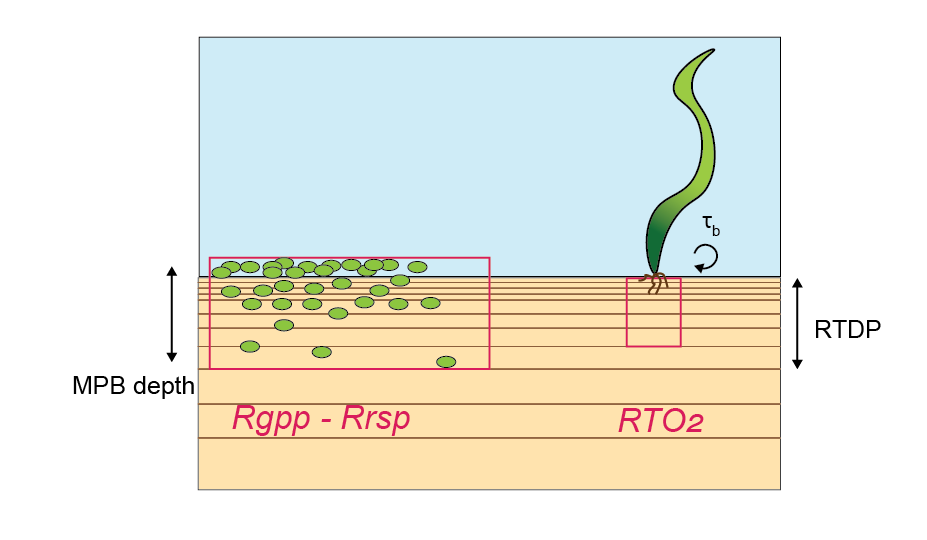
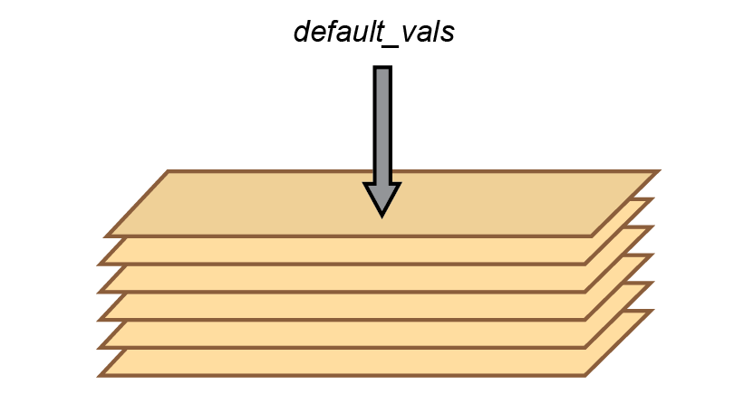
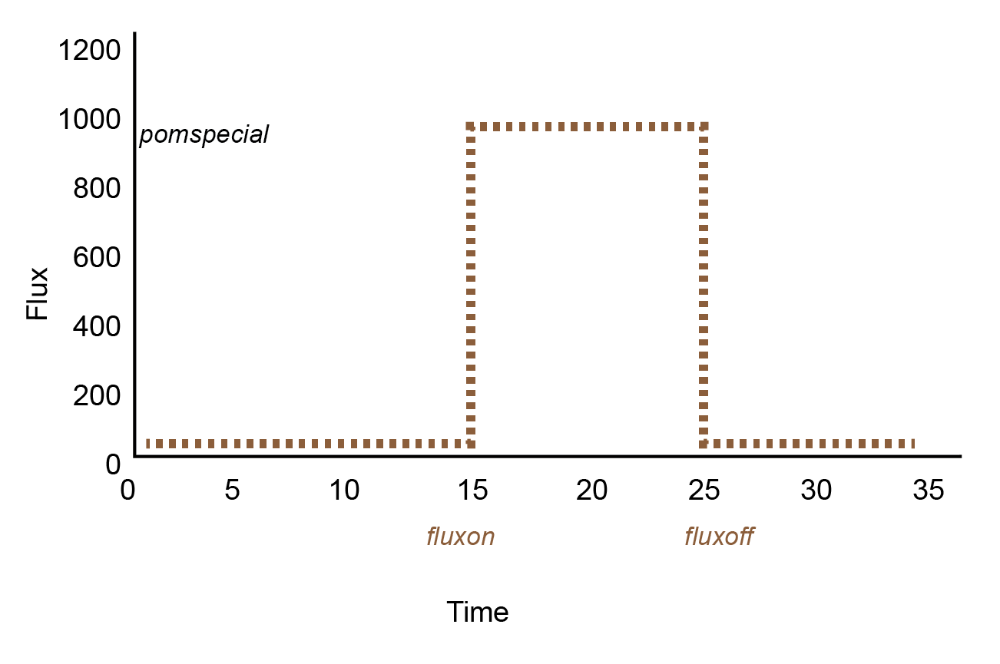

# Modelling Aquatic Eco-Dynamics: Overview of the AED modular simulation platform {-}

Placeholder


## Welcome! {-}
## How to contribute?{-}
## Editing the book{-}
## How to cite this book{-}
## Supporting the project{-}

<!--chapter:end:index.Rmd-->


# Preface {-}

Placeholder


## Who is this book for? {-}
## Why AED? {-}
## Acknowledgements {-}

<!--chapter:end:03-preface.Rmd-->


# Introduction

Placeholder


## Scientific Overview {-}
## Application Contexts {-}
## Navigating this book {-}

<!--chapter:end:04-intro.Rmd-->


# Nomenclature

Placeholder


## Variables and Data Types
## A Note on Notation
### General Notation
### Model Domain and Position
### Environmental Conditions
### Transport Reference Frame

<!--chapter:end:05-nomenclature.Rmd-->


# Organisation of the Library & Module Structure

Placeholder


## Library Design
## Model Structure
## Module Summary

<!--chapter:end:06-organisation_and_structure.Rmd-->


# (PART)  AED Water Modules{-} 

Placeholder


## Contributors
## Overview
## Model Description
### Process Descriptions
#### Oxygen solubility & atmospheric exchange {-}
#### Sediment oxygen demand {-}
### Optional Module Links
### Feedbacks to the Host Model
### Variable Summary
#### State variables {-}
#### Diagnostics{-}
### Parameter Summary
## Setup & Configuration
## Case Studies & Examples
### Case Study: Swan-Canning Estuary
### Publications

<!--chapter:end:10-dissolved_oxygen.Rmd-->


# Inorganic Carbon {#Carbon_1}

Placeholder


## Contributors
## Overview
## Model Description
### Process Descriptions
#### Carbonate buffering and pH
##### co2_model = 0
##### co2_model = 1
##### co2_model = 2
#### Sediment exchange
### Optional Module Links
### Feedbacks to the Host Model
### Variable Summary
#### State variables {.unnumbered}
#### Diagnostics {.unnumbered}
### Parameter Summary
## Setup & Configuration
## Case Studies & Examples
### Case Study : South-east Queensland estuaries {#SEQCarbonCaseStudy}
### Case Study : Lake Kinneret
### Publications

<!--chapter:end:11-carbon.Rmd-->


# Inorganic Nitrogen

Placeholder


## Contributors
## Overview
## Model Description - Default Model
### Process Descriptions
#### Nitrification and denitrification reactions
#### Nitrification
#### Denitrification
#### Atmospheric deposition
#### Sediment flux
### Variable Summary
### Parameter Summary
### Optional Module Links
### Feedbacks to the Host Model
## Model Description - Adding N~2~O Reactions
### Process Descriptions (`simN20` = 1)
#### Denitrification production of N~2~O
#### Denitrification consumption of N~2~O
#### Nitrification production of N~2~O
#### Atmospheric N~2~O Flux
#### Sediment N~2~O Flux
### Process Descriptions (`simN2O = 2`)
#### Nitrogen Oxidation Pathways
#### Nitratation
#### Ammonium oxidation
#### Nitritation
#### Nitrousation
#### Organic matter oxidation - nitrogen reduction reactions
#### Deammonification (anammox) pathway
### Variable Summary
#### State variables
#### Diagnostics variables
### Parameter summary
### Optional Module Links
### Feedbacks to the Host Model
## Setup & Configuration
## Case Studies & Examples
### Case Study: Yarra River Estuary
### Publications

<!--chapter:end:12-nitrogen.Rmd-->


# Inorganic Phosphorus

Placeholder


## Contributors
## Overview
## Model Description
#### Phosphate sorption - desorption
#### Atmospheric deposition
#### Dissolved sediment flux
#### Sedimentation and resuspension
#### State variables {-}
#### Diagnostics{-}
## Setup & Configuration
## Case Studies & Examples
### Publications

<!--chapter:end:13-phosphorous.Rmd-->


# Silica

Placeholder


## Contributors
#### State variables {-}
#### Diagnostics{-}
## Setup & Configuration

<!--chapter:end:14-silica.Rmd-->


# Organic Matter  {#organic-matter}

Placeholder


## Contributors
## Overview
## Model Description
#### Hydrolysis
#### Mineralisation
#### Photolysis
#### CPOM breakdown
#### Sediment exchange
#### Settling
#### Resuspension
#### State variables {-}
#### Diagnostics{-}
## Setup & Configuration

<!--chapter:end:15-organic_matter.Rmd-->


# Phytoplankton

Placeholder


## Contributors
## Overview
## Model Description
#### Photosynthesis & Nutrient Uptake {-}
#### Respiration, Excretion & Mortality {-}
#### State Variables {-}
#### Diagnostics {-}
## Setup & Configuration
### Setup Example
## Case Studies & Examples

<!--chapter:end:16-phytoplankton.Rmd-->


# Aqueous Geochemistry 

Placeholder


## Contributors
## Overview
## Model Description
#### Aqueous Speciation & Solubility Equilibrium Control {-}
#### State Variables {-}
## Setup & Configuration
### Setup Example

<!--chapter:end:19-aqueous_geochemistry.Rmd-->


# Pathogens & Microbial Indicator Organisms

Placeholder


## Contributors
## Overview
## Model Description
#### General Approach {-}
### Process Descriptions
#### Natural Mortality {-}
#### Sunlight Inactivation {-}
#### Sedimentation {-}
#### Resupension {-}
#### State Variables {-}
#### Diagnostics {-}
## Setup & Configuration
### Setup Example
## Case Studies & Examples

<!--chapter:end:20-pathogens_microbial_indicators.Rmd-->

# (PART) AED Benthic Modules {-} 

# Sediment Biogeochemistry

## Contributors

Daniel Paraska, Matthew R. Hipsey

## Overview

This module is a sediment reactive transport model, based on a 1D approximation of the sediment and pore-water profiles. Each active sediment zone (or column) is discretized into a user defineable number of layers that start at thicknesses of around 1 mm at the sediment-water interface and increase exponentially down to a pre-defined sediment depth. The model resolves in each layer both physical processes (e.g. pore-water diffusion or bioturbation) and chemical processes (e.g. redox transformations).

Under some conditions, the sediment stores can release nutrients to the water column, while under other conditions, the sediment can remove nutrients over the long-term through burial, and the surface layers can remove nitrogen through processes such as denitrification. The fine balance that controls the conditions under which the sediment will store, release or remove nutrients is largely governed by the aerobic state of the sediment pore water, and the amount of reactive organic matter fuelling the reactions. The depth-resolved sediment model accounts for mixing from the hydrodynamic model into the upper sediment layers, and then calculates whether organic matter is consumed aerobically, through denitrification or, deeper down, through sulfate reduction or even methanogenesis.

Sediment early-diagenesis models are highly complex environmental reactive transport simulation tools. The meta-analysis by Paraska et al. (2014) discussed the history of their evolution to these complex configurations, in which the original models of Boudreau (1996), Van Cappellen and Wang (1996) and Soetaert et al. (1996) were taken up and applied in many contexts by new modellers, who added new features and extended their capabilities, or discarded old features as required. The meta-analysis also identified the major challenges associated with developing new sediment diagenesis models. Here, the AED modelling package for sediment biogeochemistry is presented, CANDI-AED, which is an extension of the Approach 1 models, but reengineered and augmented with new model approaches and capabilities as a way to address some of these challenges. 

Paraska et al. (2015) outlined the significance and uncertainty associated with different parameterisation approaches of organic matter dynamics. In these cases, simulations were run to test the significance of different theoretical approaches and model structural assumptions, using an idealised model setup with only primary oxidation reactions and no physical processes or spatial resolution. The true impact of these different model approaches within a spatially-resolved model, accounting for all of the advection, diffusion and secondary reaction processes, however, is yet to be determined and it is unclear whether some formulations may suit some application contexts better than others. Therefore there is a need for a fully flexible model structure that can include these different organic matter breakdown parameterisations and allow users to assess critically the alternative approaches. In addition, other aspects related to secondary redox reactions, mineral reactions, precipitation and adsorption should similarly be subject to comparative assessments.

The model included in AED aimed to address challenges of building a generic and full-featured, open-source model code with the flexibility to do the following:

-	set different kinetic rate equation approaches
-	set different organic matter pools and breakdown processes
-	use standard inhibition or thermodynamic limits on primary oxidation
- optionally use manganese, iron and iron sulphide reactions
-	simulate adsorbed metals and nutrients
-	simulate calcium, iron and manganese carbonates
-	connect the boundary to either another model, a programmed file or a fixed concentration

Therefore the numerical model presented in this module has many optional features and alternative parameterisations for key processes, without mandating their inclusion in the calculations or enforcing a fixed model structure.

The sediment model CANDI-AED presented here is implemented as an optionally configurable module in the AED model library. Through the model coupling approach it may be applied with any of the hydrodynamic models linked to AED (e.g. GLM, Tuflow), or alternatively, options to run in isolation are also possible. This chapter provides a scientific description of the model and describes attributes of the model associated with its practical implementation and operation. 
An case-study of the model framework is also demonstrated.


## Model Description

The heart of this model is the reaction, diffusion, advection model of Berner (1980), which was implemented as the Carbon and Nutrient Diagenesis model of Boudreau (1996), later further developed as the C.CANDI code (Luff et al. 2000). The CANDI-AED implementation, however, has evolved from the original code, and includes extensions related to the treatment of organic matter, the simulation of the geochemical conditions known to influence the diagenetic equations, extensions for nutrients and trace metals, and dynamics at the sediment-water interface (SWI). However, the core organic matter breakdown equations (and their numerical solution) remains similar as the original descriptions presented in Boudreau (1996), and to other similar sediment models. An overview of the model is shown in Figure \@ref(fig:23-pic2).

<center>
```{r 23-pic2, echo=FALSE, fig.cap="CANDI-AED includes chemical processes of organic matter transformation and oxidation, and reduction/oxidation, crystallisation, adsorption and precipitation reactions of inorganic by-products. Most of the processes are triggered by the input of POM at the sediment-water interface.", out.width = '85%'}
knitr::include_graphics("images/23-sediment_biogeochemistry/image2.png")
```
</center>

<br>

The model is based on the advection-dispersion reaction equation for the concentration of dissolved and particulate substances. For dissolved substances $C_d$, the balance equation is defined as:

<center>
\begin{equation}
\frac{\phi \delta C_d}{\delta t} = \overbrace{ D_{B}\frac{\delta^{2} C_d}{\delta x^{2}} + \phi D_{S}\frac{\delta^{2} C_d}{\delta x^{2}} }^\text{biodiffusion and molecular diffusion} - \underbrace{u \frac{\delta C_d}{\delta x}}_\text{advection (flow)} + \overbrace{\alpha(C_{d_0}-C_d)}^\text{irrigation}  + \underbrace{\phi \sum R_d}_\text{reactions} + \color{brown}{S}
(\#eq:sdg-1)
\end{equation}
</center>

where the left hand side (LHS) is the “unsteady” term ($C_d$ change in time), the first term on the right hand side (RHS) is the dispersion/mixing term, the second term on the RHS is the advection/movement term, and $R_d$ denotes a generic reaction term. An optional $S$ term is included to represent sources from other modules (e.g., seagrass root injection of $O_2$).

For particulate (solid) substances, $C_s$:

<center>
\begin{equation}
\frac{(1-\phi)\rho \delta C_s}{\delta t} = \overbrace{ D_{B}\frac{\delta^{2}[(1-\phi)\rho C_s] }{\delta x^{2}} }^\text{biodiffusion} - \underbrace{\omega \frac{\delta [(1-\phi)\rho C_s]}{\delta x}}_\text{advection (sedimentation)}  + \overbrace{(1-\phi) \sum R_s}^\text{reactions} + \color{brown}{S}
(\#eq:sdg-2)
\end{equation}
</center>

where $(1-\phi)$ denotes the solid fraction of the sediment, and $R_s$ is a generic reaction term.

The above equations are solved numerically for the simulated set of constituents. The user can define the variables that are included in the $\mathbf{SDG}$ module (outlined in Table x), such that $C_d \in \small{\mathbb{DISSOLVED}}$ and $C_s \in \small{\mathbb{PARTICULATE}}$, where $\small{\mathbb{DISSOLVED}}$ and $\small{\mathbb{PARTICULATE}}$ are the set of dissolved and particulate variables selected for simulation, respectively.

A number of options are available for resolving the physical processes, including the rate of diffusion, advection, irrigation and the boundary condition options.

In addition to physical processes, the CANDI-AED model considers two types of chemical reactions - the slow, kinetically controlled reactions, and the fast thermodynamically based equilibrium reactions. The latter are simulated in the sediment through appropriate configuration of the geochemistry reactions; the configuration of the equilibrium model will apply to both the water and each of the sediment layers. The kinetically controlled reactions are mostly microbially-mediated and include the reactions for organic matter breakdown and eventual oxidation, the re-oxidation of various by-products and the dynamics of the metal sulfides. These reactions can be complex and are outlined in further detail in the next sections.

###	Process Descriptions

#### Primary Redox Reactions {-}

The key chemical process that causes ongoing change in the sediment is the breakdown of organic matter. An organic matter ($OM$) degradation pathway can include labile and refractory components and the breakdown pathway simulated is conceptually summarized in Figure \@ref(fig:figures-side). Reactions included in the kinetic component include the hydrolysis of the complex (e.g., high molecular weight) $OM$ pools ($POM_{VR}$, $POM_R$, $DOM_R$, $POM_L$) and transformation of low molecular weight (LMW) $DOM_L$ by oxidants ($O_2$, $MnO_2$, $Fe(III)$ and $SO_4^{2-}$ - the so-called 'terminal metabolism' pathway), and the release of resulting nutrients ($NH_4^+$, $PO_4^{3-}$) and reduced by-products ($Mn^{2+}$, $Fe^{2+}$, $N_2$, $H_2S$, $CH_4$) and $CO_2$. Oxidants, nutrients and by-products are all capable of interacting, for example, through re-oxidation of reduced species (outlined in the next section).

The user can decide how complex or simple the organic matter breakdown pathway should be, with three options of varying complexity for parameterising the pathways included (Figure \@ref(fig:figures-side)). The first option (`OMModel = 1`) is a common multi-G model in which the $POM$ phases are decomposed straight to $CO_2$ and other breakdown products. Here $POM$ is a variable that is not precisely defined, and its components (such as C, N and P) are assigned by parameters based on a user-defined stoichiometry. The second option (`OMModel = 2`) is another 2G model with both particulate and dissolved organic matter ($POM$ and $DOM$) phases included and parameterisation hydrolysis of $POM$ to $DOM$, and then $DOM$ to $CO_2$ and other breakdown products. The $POM$ and $DOM$ phases consist of three variables each, which trace the reaction and transport of carbon, nitrogen and phosphorus, thereby allowing for variable stoichiometry of organic matter to occur temporally and spatially. The third option (`OMModel = 3`) has many $POM$ phases, which are all hydrolysed to $DOM$, which then undergoes fermentation and terminal metabolism.  This allows the carbon, nitrogen and phosphorus to be calculated precisely before and after a model run, and allows the free energies of the reaction of each phase to be included. This third option is the most detailed and mechanistic, and allows for expansion of more detailed reaction mechanisms to be included, but is reccomended only for experienced users.

<br>


<!-- ```{r 23-OMbreakdown, echo=FALSE, message=FALSE, warning=FALSE} -->
<!-- library(knitr) -->
<!-- library(kableExtra) -->
<!-- OM_breakdown <- read.csv("tables/23-sediment_biogeochemistry/OM_breakdown.csv", check.names=FALSE) -->
<!-- kable(OM_breakdown,"html", escape = F, align = "c", caption = "Parameters and configuration", -->
<!--       bootstrap_options = "hover") %>% -->
<!--   kable_styling(OM_breakdown, bootstrap_options = "hover",  -->
<!--                 full_width = F, position = "center", -->
<!--                 font_size = 12) %>% -->
<!--   column_spec(1, width_max = "30em") %>% -->
<!--   column_spec(2, width_max = "30em") %>% -->
<!--   column_spec(3, width_min = "10em") %>% -->
<!--   row_spec(1:13, background = 'white') %>% -->
<!--   scroll_box(width = "770px", height = "500px", -->
<!--              fixed_thead = FALSE)  -->
<!-- ``` -->


```{r, figures-side, echo=FALSE, fig.cap="Three options for different levels of complexity in organic matter breakdown, by setting the OMModel switch. a – Model in which POM breaks down directly to CO~2~ and other waste products. b – Model in which POM is first hydrolysed to DOM and then oxidised to CO~2~. c – Model in which POM is hydrolysed to DOM, which can then be fermented and oxidised.", fig.show="hold", out.width=c("27%","1%","27%","1%","31%") ,fig.align='center'}
knitr::include_graphics("images/23-sediment_biogeochemistry/image3.png")

knitr::include_graphics("images/23-sediment_biogeochemistry/image4.png")

knitr::include_graphics("images/23-sediment_biogeochemistry/image5.png")
```

<br>

The terminal redox reaction pathways are the six pathways that are available in most diagenesis models, and are driven by different organic matter pools, depending on the *OMModel* configuration chosen from the above options (Table x). AED CANDI allows the use of Approach 1 or 2 organic matter oxidation rate equations, as examined in detail in Paraska et al (2015).

The decay of the complex $OM$ types to the LMW $DOM$ required for the hetertrophic bacteria to utilise are all modelled with a simple first-order decay rate. The subsequent reactions for terminal metabolism that describe the breakdown of $OM$ may be written as:
\begin{eqnarray}
\overbrace{(CH_2O)_{106}(NH_3)_{16}(H_3PO_4)}^{\textrm{organic matter}} &+& 138O_2 \rightarrow \nonumber
\\
&& 106CO_2 + 16HNO_3 + H_3PO_4 + 122H_2O
\\
\textrm{Free energy, } \Delta G_0 &=& -3190\:kJmol^{-1} \nonumber
\end{eqnarray}

\begin{eqnarray}
(CH_2O)_{106}(NH_3)_{16}(H_3PO_4) &+& 236MnO_2 +472H^+ \rightarrow  \nonumber
\\
&& 106CO_2 + 236Mn^{2+} + 8N_2 + H_3PO_4 + 366H_2O
\\
\textrm{Free energy, } \Delta G_0 &=& -3050\:kJmol^{-1} \nonumber
\\
\\
(CH_2O)_{106}(NH_3)_{16}(H_3PO_4) &+& 94.4HNO_3 \rightarrow  \nonumber
\\
&& 106CO_2 + 55.5N_2 + H_3PO_4 + 177H_2O
\\
\textrm{Free energy, } \Delta G_0 &=& -3030\:kJmol^{-1} \nonumber
\\
\\
(CH_2O)_{106}(NH_3)_{16}(H_3PO_4) &+& 212Fe_2O_3 +848H^+ \rightarrow  \nonumber
\\
&& 106CO_2 + 16NH_3 + H_3PO_4 + 742H_2O + 424Fe^{2+}
\\
\textrm{Free energy, } \Delta G_0 &=& -1410\:kJmol^{-1} \nonumber
\\
\\
(CH_2O)_{106}(NH_3)_{16}(H_3PO_4) &+& 53SO_4^{2-}  \rightarrow  \nonumber
\\
&& 106CO_2 + 16NH_3 + H_3PO_4 + 106H_2O + 53S^{2-}
\\
\textrm{Free energy, } \Delta G_0 &=& -380\:kJmol^{-1} \nonumber
\\
\\
(CH_2O)_{106}(NH_3)_{16}(H_3PO_4) &&  \rightarrow  \nonumber
\\
&& 53CO_2 + 53CH_4 + 16NH_3 + H_3PO_4
\\
\textrm{Free energy, } \Delta G_0 &=& -350\:kJmol^{-1} \nonumber
\end{eqnarray}

and the reaction rates for each of these are calculated dynamically based on Monod expressions which mediate the reaction rate according to the concentration of potential oxidants higher in the redox sequence, and the concentration of the available oxidant.

The rate equation for the oxidation of the oxidants with any of the pools above can include any of the terms in equation x, where $R_{{Ox}_i}$ is the reaction of an oxidant $i$ (Arndt et al. 2013) (Table x). The kinetic rate constant $k_{OM}$ gives the maximum oxidation rate, which is different for each reactive type, but the same for each oxidation pathway. Alternatively, using OMModel 3, the kinetic rate constant is the rate of bacterial growth.

The factor for terminal electron acceptor (TEA) limitation is *FTEA* (x), where options for Approach 1 or Approach 2 equations are available. The Monod constant for rate limitation at low oxidant concentration is *K~TEA* in Approach 1 and *L~TEA* in Approach 2. Similarly, the inhibition term *F~In* (x) can be set to Approach 1 or 2 equations, or turned off entirely. The constant for inhibition until low oxidant concentrations is *K~In* for Approach 1 and *L~IN* for Approach 2.

*$F~T* is a thermodynamic factor. The current version of the model includes *F~T* only for OMModel 3, for terminal oxidation reactions and fermentation.

*F~OM* is the organic matter concentration and may be a Monod function as in equation x (*K~OM* is a half saturation constant and the index *i* is the reactive phase). Using OMModels 1 and 2, *F~OM* is the concentration of the substrate, rather than a Monod function. The current version of the model has switches built in for both the temperature dependence factor, *F~Tem*, where values of 1 or 2 turn them off and on. However, implementation and testing of the factors has not been carried out for this version of the model. The metabolism rate at $T_{0}$ is $R_{0}$, $ξ$ is a scaling constant (see, for example, Eldridge and Morse 2008).

#### Secondary Redox Reactions {-}

In Paraska et al (2014), many secondary redox reactions were identified that have been included across the diversity of diagenesis model applications. In CANDI-AED, they are all included as options, and may be turned on or off as desired (Table x).

#### Equilibrium Geochemistry {-}

The pH is calculated as the sum of all charged species, where any unbalanced positive charge indicates H^+^. The charge balance is at each time step is solved as a state variable, which is subject to advection, diffusion and bioturbation reactions.

The precipitation of minerals is solved as an equilibrium reaction, dependent on the concentrations of the dissolved and solid substances, their $K_{sp}$ and ion activity product (IAP). The equations are applied in a similar manner to those in Van Cappellen and Wang (1996) and numerous other studies, but with the exact forms of the equations based on those from Tufano et al. (2009) (Table x). A positive rate indicates precipitation and a negative rate indicates dissolution. This model applies the function to all minerals simulated, including Fe(OH)~3~, FeS, FeS~2~, FeCO~3~, CaCO~3~ and MnCO~3~. This model can also include the process of mineral ageing, whereby iron and manganese oxides become crystalline and no longer react with organic matter, but can still undergo secondary redox reactions.

#### Physical Transport and Porosity {-}

##### Solids {-} 
CANDI-AED adopts the approach of Boudreau (1996) to advection and dispersion, which is similar to most other diagenesis models. Advection of the solid sediment matrix is occurs at the rate of sediment deposition ($\omega_{00}$ in cm y^-1^). The sediment does not move, however, since the height of the modelling domain is fixed, as more sediment accumulates at the surface, a sediment particle moves downwards. An alternative way to view this is that the modelling domain moves upwards. 

```{r Phys1, echo = FALSE, out.width='60%', class = "text-image",fig.show='hold',fig.align='center', fig.cap = "Upon sedimentation, the frame of reference shifts upwards. The bottom area is effectively lost from the modelling domain over time. Particles and porewater are advected downward relative to the modelling domain."}

knitr::include_graphics("images/23-sediment_biogeochemistry/AdvectionDispersion/AdvectionDispersion-05.png")

```

##### Porewater {-} 
For the porewater components, diffusion coefficients are used that are based on free-solution molecular diffusion constants corrected for sediment tortuosity, $θ$. Porewater moves downwards at the same rate as the solids ($\omega_{00}$). A further porewater advection term (`poreflux`) is available, which could represent, for example, pressure on the sediment from a groundwater source. If `poreflux` is positive, then porewater moves upwards, relative to particles. Conversely, if `poreflux` is negative, then the porewater moves downwards relative to the particles. In most simulations `poreflux` is zero and advection is the transport process. A dynamic `poreflux` can be assigned using the column headings `w00h00` in swibc.dat or `pf` in deepbc.dat (see setup section below). 

```{r Phys2, echo = FALSE, out.width='100%', class = "text-image",fig.show='hold',fig.align='center', fig.cap = "Porewater is advected at the same rate as burial. If *poreflux* is non-zero, an additional rate of advection is applied to porewater. The direction is upwards when *poreflux* is positive, downwards when *poreflux* is negative."}

knitr::include_graphics("images/23-sediment_biogeochemistry/AdvectionDispersion/Poreflux-04.png")

```

##### Bioturbation and bioirrigation  {-} 
Bioturbation is an extra mixing process caused benthic animals in the upper layers of the sediment. Bioturbation affects both solids and porewater. The model uses a diffusion coefficient that varies with depth ($D_{B(x)}$) as a two layer function or a Gaussian decrease (Boudreau 1996). Bioirrigation is a non-local mixing process in the upper layers of the sediment, caused by animal burrows. Bioirrigation affects porewater only.

```{r Phys3, echo = FALSE, out.width='65%', class = "text-image",fig.show='hold',fig.align='center', fig.cap = "Bioturbation is the mixing of solids and porewater in the upper layers by benthic animals. Irrigation causes extra mixing of porewater through burrows."}

knitr::include_graphics("images/23-sediment_biogeochemistry/AdvectionDispersion/Biot-07.png")

```

```{r Phys-4, echo=FALSE, fig.cap="Depth profile representing two possible bioturbation options. Bioturbation is more likely to occur towards the sediment water interface, and below a certain depth does not occur at all.",fig.show='hold',fig.align='center' ,out.width = '90%'}
knitr::include_graphics("images/23-sediment_biogeochemistry/Initialisation/Bioturb-02.png")
```

```{r Phys-5, echo=FALSE, fig.cap="Since shallow burrows are more likely than deep burrows, the amount of irrigation decreases with depth.",fig.show='hold',fig.align='center', out.width = '60%'}
knitr::include_graphics("images/23-sediment_biogeochemistry/Initialisation/Irrig-01.png")
```


##### Porosity  {-} 
Porosity ($\phi$) is defined as the amount of water per total volume of space, as a real number between 0 and 1. 
A value for porosity is set at each depth layer during initialisation (see section below) and remains constant throughout the simulation (figure \@ref(fig:Phys-6)). The porosity array is used in the model to calculate other variables, such as 

-    advection
-    poreflux
-    porewater volume 
-    solid volume
-    diffusive velocity
-    solid fraction

Porosity is also used in the model to calculate $ps$, $psp$ and $pps$, which are used to convert between solid and dissolved state variables, using these conversions:

```{=tex}
\begin{eqnarray}
     ps  = 1 - \phi
     \\
     \\
     psp = \frac {ps} {\phi}
     \\
     \\
     pps = \frac {\phi} {ps}
\end{eqnarray}
```

```{r Phys-6, echo=FALSE, fig.cap="Example depth profile of porosity.",fig.show='hold',fig.align='center' ,out.width = '60%'}
knitr::include_graphics("images/23-sediment_biogeochemistry/Initialisation/Porosity-01.png")
```


#### Physical-chemical interactions {-}

##### Salinity inhibition {.unnumbered}
Salinity was set as a permanently linked variable from the water column AED model, without using *water_link*.

A special salinity factor, $F_{Sal}$ was developed for the salinity in the Coorong, to inhibit processes at hypersaline concentrations. $F_{Sal}$ ranges from 1 to 0, as set between salinity concentration parameters *Sal1* and *Sal2* (PSU).

The equations for $F_{Sal}$ are given below.


\begin{align*}
\text{If  } \  \  Salinity < Sal_1 \ \ 
\\
&F_{Sal} = 1 \
    \\
    \\
\text{If  }    Salinity > Sal_1  
&\frac {Sal_2 - Salinity} {Sal_2 - Sal_1} \
    \\
    \\
\text{If  }   Salinity > Sal_2  
&F_{Sal} = 1 \
\end{align*}

The effect of the scaling is shown in Figure \@ref(fig:PhysChem1).

```{r PhysChem1, echo = FALSE, out.width='50%', class = "text-image",fig.show='hold',fig.align='center', fig.cap = "Diaagram of the salinity factor $F_{Sal}$, scaling between 1 and 0 between the parameters. In this diagram *Sal~1~* is 40 and *Sal~2~* is 70."}
knitr::include_graphics("images/23-sediment_biogeochemistry/PhysChemInteractions/FSal-02.png")
```

$F_{Sal}$ is applied to biota-driven mixing (see below) and to the nitrogen redox and adsorption reactions. It is multiplied by the following reactions:

-   *R~N2O~*
-   *R~NO2~*
-   *R~NO3~*
-   *R~NH4ox~*
-   *R~NH4NO2~*
-   *R~NO2O2~*
-   *NH~4~^+^ adsorption*

The term affects all rates equally and so does not favour the concentration of any of the species. However, it slows down the transformation of each species into the other, and increased the effect of transport reactions and depth-driven concentration gradients.

##### H~2~S inhibition {.unnumbered}
High $H_{2}S$ concentration is set to inhibit biota-driven mixing and nitrogen redox reactions, on the basis that $H_{2}S$ is toxic to organisms. An $H_{2}S$ factor, $F_{Sul}$, is an inhibition factor similar to other inhibition factors in the sediment model.

```{=tex}
\begin{eqnarray}

F_{Sul} = \frac {K_{H_{2}S}} {(K_{H_{2}S} + H_{2}S)}

\end{eqnarray}
```
As with $F_{Sal}$, $F_{Sul}$ scales between 1 and 0, however, as a decay rather than a stepped function (Figure \@ref(fig:PhysChem2)). The value for *K~H2S~* can be found in the physical parameters table below In this simulation, the same value for *K~H2S~* was used in all zones.

```{r PhysChem2, echo = FALSE, out.width='50%', class = "text-image",fig.show='hold',fig.align='center', fig.cap = "Diagram of the $H_2S$ factor, $F_{Sul}$, scaling from 1 to 0 as $H_2S$ concentration decreases. "}

knitr::include_graphics("images/23-sediment_biogeochemistry/PhysChemInteractions/FSul-02.png")

```

##### Bioturbation functions {.unnumbered}
The baseline bioturbation rate set during initialisation is updated at each time step to account for high salinity values and high H2S concentrations.

##### O~2 injections {.unnumbered}
$O_2$ is injected into the sediment from microphytobenthic algae ($MPB$) and from plant roots (\@ref(fig:PhysChem3)). The $O_2$ is not part of the mass balance of the ecosystem and it is not in stoichiometric balance with biomass or $∑CO_2$. The depths where the $O_2$ is injected are set separately for $MPB$ and roots. The $O_2$ in these layers from $MPB$ is set as a rate of both gross primary production ($Rgpp O_2 input$) and respiration ($Rrsp O_2 consumption$). The rate $Rgpp$ is calculated as a function of the $MPB$ production rate, the parameter *fgpp~sflux~* and a decay with depth. The production rate is linked directly to the rate calculated in the water column model. Similarly, the rate $Rrsp$ is calculated as a function of the respiration rate, the same parameter *fgpp~sflux~* and a decay with depth. The respiration rate is also linked directly to the rate calculated in the water column model. Below the parameter *MPBDepth*, $Rgpp$ is zero, which means that the $MPB$ cannot photosynthesise without light. Below *MPBDepth* the rate $Rrsp$ is the product of $MPB$ biomass and 52 days, which means that the cells die within a week without access to light.

The rate of $O_2$ injection from roots is calculated from the variable $RTO_2$, which applies above the depth $RTDP$. Both $RTO_2$ and $RTDP$ are linked directly from the water column model.

```{r PhysChem3, echo = FALSE, out.width='75%', class = "text-image",fig.show='hold',fig.align='center', fig.cap = "Schematic of the new parameterisation of $O_2$ injection into the sediment. Left: $O_2$ is released where $MPB$ are respiring. Right: $O_2$ comes from plant roots to the depth of *RTDP*."}


```

### Implementation within the AED framework

The sediment diagenesis model CANDI-AED can be used within the AED framework in various ways. This includes a) how the SDG module links to other modules in simulating water variables, and b) how the module operates within the simulated domain.

####	Sediment-water coupling {-}

The sediment and hydrodynamic models are coupled at the sediment-water interface. The AED model setup has separate functions for coupling the bottom-most cell of a hydrodynamic model to the top-most layer of the sediment model:

-	flux of solid (particulate) material onto the sediment surface, $mmol/m^2/d$
-	concentration of dissolved substances in the bottom water, $mmol/m^3$
-	flux of dissolved substances from the top sediment layer to or from the water, $mmol/m^2/d$

Where there is any mismatch between the sediment and water column variables, the factor of `part_sed_scale` can be used. (`part_sed_scale` can be found in the file aed_sdg_vars.csv, as outlined in more detail below.) For example, influx of the water column variable $PON$ can be distributed between sediment variables $PON_R$ and $PON_L$. `part_sed_scale` is a real number between zero and one. For any sediment variables linked to the same water column flux, the `part_sed_scale` values should sum to 1.

<br>

```{r dev-pics2, echo = FALSE, out.width='45%', fig.align='center', fig.cap = "Schematic of sediment water coupling interactions"}

knitr::include_graphics("images/23-sediment_biogeochemistry/SWIBoundary/LinkedVars-08.png")

```

Depending on the nature of the host hydrodynamic model, several configurations can be implemented:

<center>
```{r 23-pic6, echo=FALSE, fig.cap="Spatial resolution options available through AED. a) Water column studies have traditionally assigned a flux to the sediment water interface without resolving the sediment chemical concentrations by depth, though they can be resolved laterally. b) The 0D water column is the method used in most sediment diagenesis studies, and use of multiple sediment zones is an option available within AED.", out.width = '95%'}
knitr::include_graphics("images/23-sediment_biogeochemistry/image6.png")
```
</center>


####	Resolving sediment zonation {-}

The sediment model can be set up with multiple zones. The setup is the same as in the description above, and the zone boundares are not necessarily coincident with the grid structure of the water. Using zones is a practical compromise between computational efficiency and capturing spatial heterogeneity in sediment properties and their fluxes.

For a 3D hydrodynamic model, the sediment zones are adjacent areas of the bottom of the domain, for example, stretches of a river from upstream to downstream. A 3D diagram is given in Figure \ref{fig:sed_integration}.


```{r dev-Grid1, echo = FALSE, out.width='100%', class = "text-image", fig.cap = "Schematic depicting sediment zone numerical approach."}

knitr::include_graphics("images/23-sediment_biogeochemistry/GridStructure/3DZones-05.png")

```


```{r dev-Grid2, echo = FALSE, out.width='100%', class = "text-image", fig.cap = "Schematic depicting sediment zone numerical approach."}

knitr::include_graphics("images/23-sediment_biogeochemistry/GridStructure/1DZones-05-04.png")

```

The equivalent 1D hydrodyanmic model has the water column simulated in vertical layers. The sediment zones are assigned as slices of sediment according to depth. A 1D diagram is given in Figure \ref{fig:sed_integration}.


<br>

The fluxes and concentrations in the water cells above the sediment are averaged for linked variables (Figure \ref{fig:dev-pics4}).

<br>

```{r dev-Grid3, echo = FALSE, out.width='60%', class = "text-image",fig.show='hold',fig.align='center', out.width='60%', fig.cap = "Schematic displaying how water cells are averaged when using sediment zones with a 3D hydrodynamic model."}

knitr::include_graphics("images/23-sediment_biogeochemistry/GridStructure/ZoneAveraging-05.png")

```


```{r dev-Grid4, echo = FALSE, out.width='60%', class = "text-image",fig.show='hold',fig.align='center', fig.cap = "Schematic displaying how water cells are averaged when using sediment zones with a 3D hydrodynamic model."}
knitr::include_graphics("images/23-sediment_biogeochemistry/GridStructure/ZoneAveraging-06.png")
```

#### Program Structure {.unnumbered}

The general structure of the program is shown in Figure \@ref(fig:23-pic7). The program is firstly initialised (including spin-up days if desired), then loops through the kinetic and equilibrium reactions for each time step and writes the resulting concentrations and rates at each depth to an output file. The kinetic reactions are solved by the VODE program (Brown et al. 1989) and the equilibrium reactions by the Simplex program.

<br>

<center>
```{r 23-pic7, echo=FALSE, fig.cap="The program is firstly initialised, then loops through the kinetic and equilibrium reactions for each time step and writes the resulting concentrations and rates at each depth to an output file. The kinetic reactions are solved by the VODE program and the equilibrium reactions by the Simplex program.", out.width = '75%'}

```
</center>

<!-- ###	Variable Summary -->

<!-- ###	Parameter Summary -->

<!-- ###	Optional Module Links -->

<!-- ###	Feedbacks to the Host Model -->

<!-- The inorganic carbon module has no feedbacks to the host hydrodynamic model. -->


## Setup & Configuration

The preceding details were an explanation of the scientific aspects of this diagenesis model. Practical implementation is outlined below. Four key places for the model setup are presented here, along with the file locations, and whether the settings are different for a simulation with more than one zone (table \@ref(tab:3dev-sedBouIni))).


<center>


```{r 3dev-sedBouIni, echo=FALSE, message=FALSE, warning=FALSE}
library(knitr)
library(kableExtra)
library(readxl)
  options(knitr.kable.NA = "")
sediment_BoundaryInitial <- read_xlsx("tables/23-sediment_biogeochemistry/UserManual.xlsx", sheet="BoundaryInitial")
  kable(sediment_BoundaryInitial,"html", escape = F, align = "c", caption = "File locations for major inputs of parameters, initial conditions and boundary conditions.",
      bootstrap_options = "hover") %>%
  kable_styling(sediment_BoundaryInitial, bootstrap_options = "hover",
                full_width = T, position = "left",
                font_size = 12) %>%
  row_spec(0, background = "#14759e", bold = TRUE, color = "white") %>%
  column_spec(1, width_min = "10em" ,color="black",bold = T) %>%
  column_spec(2, width_min = "15em" ,color="black") %>%
  column_spec(3, width_min = "15em" ,color="black") %>%
#  column_spec(4, width_min = "15em") %>%
  row_spec(1:4, background = 'white') %>%
  scroll_box(width = "50em", height = "27em",fixed_thead = FALSE)
```


</center>

### Initialisation


#### Initialisation of sediment depth layers {.unnumbered}
Each active sediment model within this module is discretised into a user-definable number of depth layers (`maxnpts`) that start at a thickness of a few mm at the sediment-water interface and which increase exponentially down to a pre-defined sediment depth (`xl`). The grid of layers is set to have either even spacing (`job` = 1) or exponentially increasing (`job` = 0). When the spacing increases exponentially, the first two layers are hard-coded to be a miniumum of 0.25 cm, in order to avoid numerical instability from sharp concentration differences over distances that are too small. Porosity is the amount of water per total volume of space, as a real number between 0 and 1. 

```{r Init-1, echo=FALSE, fig.cap="Initialisation of the depth layers. The number of layers is set by `maxnpts` and the depth of the simulation by `xl`. The setup can have even spacing (left) using parameter `job` = 1 or increasing spacing (right) `job` = 2.",fig.show='hold',fig.align='center' ,out.width = '60%'}
knitr::include_graphics("images/23-sediment_biogeochemistry/Initialisation/job1job2-06.png")
```

#### Initialisation of porosity {.unnumbered}
Porosity is configured by setting three parameters: the porosity at the sediment-water interface (`\rho 0`), the porosity at the depth where compaction causes constant porosity with depth (`\rho 00`), and the attenuation coefficient on the exponential curve (`bp`) (equation \@ref(#eq:init-1)). These parameters are set separately for each zone. Porosity is the amount of water per total volume of space, as a real number between 0 and 1. 

```{=tex}
\begin{eqnarray}

    \phi = (\rho _0 - \rho _{00}) \times e^{-bp \times depth}  + \rho _{00}

(\#eq:init-1)


\end{eqnarray}
```

\

```{r Init-2, echo=FALSE, fig.cap="Depth profile of porosity set during initialisation. ",fig.show='hold',fig.align='center' ,out.width = '60%'}
knitr::include_graphics("images/23-sediment_biogeochemistry/Initialisation/Porosity-01.png")
```
\

A porosity profile is output in the file `Depths.sed`, along with the depths (in cm), and so the user can examine the shape of the profile with depth.

#### Initialisation of bioturbation and bioirrigation {.unnumbered}

Bioturbation 

Bioturbation is set firstly by choosing the switch `imix` (integer), which can be 0, 1, or 2. The equations and figures representing the depth profiles that correspond to the switches can be seen below. The rate of bioturbation is set with the parameter `DB0` (cm y^-1^). If the user selects `imix` switch 0 or 2, then they use the parameter `xs` to set the shape of the exponential decay curve. If the user selects `imix` switch 1, then they use parameters `x1` and `x2` to set the two depths between which bioturbation goes at the full rate and drops to zero.


\#eq:init-2

   - If imix = 0
```{=tex}
\begin{eqnarray}

   \\
   bioturbation = DB_0 \times * e^ {- \frac {depth^2} {2 \times xs^2} } 
   \\
\end{eqnarray}
```   
   
   
   - If imix = 1

\begin{align*}

\text{if } depth <= x_1 \\
&bioturbation = DB_0\\

\text{if } depth > x_1 \text{ and }depth <= x_2\\
&bioturbation = DB_0 \times (\frac  {x_2 - depth} {x_2 - x_1})\\

\text{if } depth > x_2 \\
&bioturbation = 0

\end{align*}

   - If imix = 2

```{=tex}
\begin{eqnarray}
   bioturbation = DB_0 \times e ^{(- \frac{depth}{xs} )}
\end{eqnarray}
```

```{r Init-3, echo=FALSE, fig.cap="Depth profile representing two possible bioturbation options and the functions of the parameters `DB0`, `x1` and `x2`. ",fig.show='hold',fig.align='center' ,out.width = '90%'}
knitr::include_graphics("images/23-sediment_biogeochemistry/Initialisation/Bioturb-02.png")
```


A bioturbation profile is output in the file `Depths.sed`, along with the depths (in cm), and so the user can examine the shape of the profile.

Irrigation 

Irrigation has only one configuration i.e. it does not have switches like bioturbation. The parameter `alpha0` sets the rate of irrigation and `xirrig` the depth at which irrigation decays, according to this equation:

```{=tex}
\begin{eqnarray}
\text{if  } depth > xirrig
\\
\\
   irrigation = \alpha _0 \times e^{-1.5 \times (depth - xirrig) }
\end{eqnarray}
```


```{r Init-4, echo=FALSE, fig.cap="Example of a depth profile that sets the rate of irrigation, and the parameters `alpha_0` and `x_irrig`.",fig.show='hold',fig.align='center', out.width = '60%'}
knitr::include_graphics("images/23-sediment_biogeochemistry/Initialisation/Irrig-01.png")
```


An irrigation profile is output in the file `Depths.sed`, along with the depths (in cm), and so the user can examine the shape of the profile with depth.

#### Initialisation of concentration profiles {.unnumbered}
Concentration profiles are set using one of three options: constant, linear decrease or exponential decrease (`CO_I`, `LI_I`, `EX_I`) (figure \@ref(fig:Init-5)). 

The default for most initial concentrations is the constant option. The concentration for each variable is set in the input file `aed_sdg_vars.csv`, in the column `initial_vals` (\@ref(fig:Init-6)). If the simulation has several zones, then the initial concentration for the zone is set in other columns in the csv, under the column headings `initial_01`, `initial_02` etc. If there is no initial column in the csv for a particular zone, then the zone defaults to the value in the `initial_vals` column. 

For organic matter, the initial profiles are set to either the linear or exponential options. For the linear option, the initial concentration is still taken from `initial_vals` in `aed_sdg_vars.csv`. The upper and lower concentrations are set as percentages of the initial concentration using the parameters *OM_top* and *OM_Min*, which are found in the `&aed_sed_candi` block in the `aed.nml` namelist. There are separate parameters for labile and refractory organic matter, so the parameter names are in fact `OM_topL` and `OM_topR`, and `OM_minL` and `OM_minR`. These parameters are real numbers as decimals between 0 and 1. The *OM_Top* fraction applies to the surface concentration. The *OM_Min* applies at the depth `InitMinDepth` (cm), which is also set in the `&aed_sed_candi` block.

For the exponential option, the initial concentration decreases according to the equation below. 

```{=tex}
\begin{eqnarray}
concentration = initial vals \times e^ {- OM cfl \times depth} 
\end{eqnarray}
```
The shape of the curve is determined by the parameter `OM_cfl`, which is found in the `&aed_sed_candi` block.

```{r Init-5, echo=FALSE, fig.cap="Schematic of three possible options for initial profiles. Most concentrations default to the constant option, whereas organic matter is usually set to be linear or exponential.",fig.show='hold',fig.align='center' ,out.width = '100%'}
knitr::include_graphics("images/23-sediment_biogeochemistry/Initialisation/InitialProfile-03.png")
```


```{r Init-6, echo=FALSE, fig.cap="Simplified image of the `aed_sdg_vars.csv` input file. For initialisation, the `variables` need to be set, along with default `initial_vals` or zones-specific `initial_01`, `initial_02` etc. columns.",fig.show='hold',fig.align='center' ,out.width = '100%'}
knitr::include_graphics("images/23-sediment_biogeochemistry/aed_sdg_vars/aed_sdg_vars-04.png")
```


### Boundary settings

#### Sediment-water interface boundary {.unnumbered}

##### Static option: *default_vals* {.unnumbered}
For the boundary at the sediment-water interface, the value is set using the `default_vals` column in the input file `aed_sdg_vars.csv` (figures \@ref(fig:SWI-1), \@ref(fig:SWI-2)). These values are constant in time for the entire simulation. Solids are a deposition flux (mmol m^-2^ y^-1^) and solutes are a concentration (mmol m^-3^). Variables may have other switches or options applied to them, as outlined below, but otherwise the values default to this.


```{r SWI-1, echo=FALSE, fig.cap="Sediment-water interface boundary inputs that are constant in time are set with `default_vals`. ",fig.show='hold',fig.align='center' ,out.width = '60%'}

```


```{r SWI-2, echo=FALSE, fig.cap="Simplified image of the `aed_sdg_vars.csv` input file. The `variables` and `default_vals` need to be set for each row of the csv.",fig.show='hold',fig.align='center' ,out.width = '100%'}
knitr::include_graphics("images/23-sediment_biogeochemistry/aed_sdg_vars/aed_sdg_vars-02.png")
```

##### Dynamic options: linked variables {.unnumbered}
There are three methods for linking variables to the water column model:
-    particle deposition flux using `part_sed_link`
-    solute flux using `diss_flux_link`
-    bottom water concentration using `water_link`

These do not need to be set for any variable, but they may be set for any variable. `part_sed_link` and `water_link` must be set for solids and solutes and cannot both be assigned to one variable. If a variable is not set to be linked, the csv contains double inverted commas (" ") and the value is set to the `default_vals`.

As mentioned above, where there is any mismatch between the sediment and water column variables, the factor of `part_sed_scale` can be used. `part_sed_scale` can be found in the file `aed_sdg_vars.csv`. `part_sed_scale` is a real number between zero and one. For any sediment variables linked to the same water column flux, the `part_sed_scale` values should sum to 1.

If a variable is linked, it is linked for all zones.

```{r SWI-3, echo=FALSE, fig.cap="Schematic of possible linked variable options at the sediment-water interface. Particle fluxes and bottom water concentraitons go from the water column to the sediment. Sediment solutes can also be set to flux to the water column.",fig.show='hold',fig.align='center' ,out.width = '60%'}
knitr::include_graphics("images/23-sediment_biogeochemistry/SWIBoundary/LinkedVars-08.png")
```


```{r SWI-4, echo=FALSE, fig.cap="Simplified image of the `aed_sdg_vars.csv` input file. Linking variables may be set in the same row as the variable, or left blank with inverted commas.",fig.show='hold',fig.align='center' ,out.width = '100%'}
knitr::include_graphics("images/23-sediment_biogeochemistry/aed_sdg_vars/aed_sdg_vars-05.png")
```
##### Dynamic options: swibc file {.unnumbered}
A dynamic boundary can be set for any variable and any zone using the text file swibc.dat (\@ref(fig:SWI-5)). For a variable to be activated to take its boundary from swibc.dat, it must be included in the list `swibc_filevars`, which is a parameter in the `&aed_sed_candi` block. The specific filename and filepath are set in the parameter `swibc_file` in the `&aed_sed_candi` block. The swibc file has the following features:

-    **timestep** column: The number of the point where anything changes from the previous entry.\\
-    **time** column: The time (days) at which a change occurs. Unlike a time series, each time step does not need to be listed. However, if there is a change in any one of the variables, an entry must be included in that row for all of the variables.\\
-    **forzone** row: The zone for which the variable in this file applies. If a zone is not listed, then the variable in that zone will take the `default_vals`.\\
-    **variable** columns: The value at the boundary until the next point of change.\\
-    **w00h00** columns: if any column is labelled `w00h00`, then a dynamic poreflux is applied to that zone.\\

The benefit of using this file is that a time-changing boundary can be applied for a selection of variables and zones, while leaving other combinations of variables and zones unchanged. 

```{r SWI-5, echo=FALSE, fig.cap="Schematic of the sediment-water interface boundary supplied by the swibc.dat text file.",fig.show='hold',fig.align='center' ,out.width = '60%'}
knitr::include_graphics("images/23-sediment_biogeochemistry/SWIBoundary/swibcdat-09.png")
```

```{r SWI-6, echo=FALSE, fig.cap="Simplified image of the swibc.dat text file.",fig.show='hold',fig.align='center' ,out.width = '85%'}
knitr::include_graphics("images/23-sediment_biogeochemistry/SWIBoundary/swibcdat-01.png")
```

#### Bottom boundary {.unnumbered}
##### Static option: *deep_vals* {-}
A boundary can be supplied beneath the deepest cell using `deep_vals` (\@ref(fig:Deep-1)). The value is taken from `deep_vals`, which is in the input file `aed_sdg_vars.csv` (\@ref(fig:Deep-2)). (`deep_vals` is the lower boundary equivalent of the sediment-water interface `default_vals`.) In most instances a bottom boundary would not be supplied, however, if there were a simulation with, for example, groundwater infiltration, then this option is used. If the value in `deep_vals` is negative, no boundary is applied, and so the file has a default -999 for all variables.  

```{r Deep-1, echo=FALSE, fig.cap="Bottom boundary inputs that are constant in time are set with `deep_vals`. ",fig.show='hold',fig.align='center', out.width = '60%'}
knitr::include_graphics("images/23-sediment_biogeochemistry/DeepBoundary/deep_vals-12.png")
```

```{r Deep-2, echo=FALSE, fig.cap="   caption ",fig.show='hold',fig.align='center' ,out.width = '100%'}
knitr::include_graphics("images/23-sediment_biogeochemistry/aed_sdg_vars/aed_sdg_vars-03.png")
```
##### Dynamic option: deep_bc file {-}
A dynamic boundary can be set for any variable and any zone using the text file deepbc.dat (\@ref(fig:Deep-3)). For a variable to be activated to take its boundary from deepbc.dat, it must be included in the list `deebc_filevars`, which is a parameter in the `&aed_sed_candi` block. The specific filename and filepath are set in the parameter `deepbc_file` in the `&aed_sed_candi` block. The deepbc file is the bottom boundary equivalent of the swibc file. It has the following features:

-    **timestep** column: The number of the point where anything changes from the previous entry.\\
-    **time** column: The time (days) at which a change occurs. Unlike a time series, each time step does not need to be listed. However, if there is a change in any one of the variables, an entry must be included in that row for all of the variables.\\
-    **forzone** row: The zone for which the variable in this file applies. If a zone is not listed, then the variable in that zone will take the `default_vals`.\\
-    **variable** columns: The value at the boundary until the next point of change.\\
-    **pf** columns: if any column is labelled `pf`, then a dynamic poreflux is applied to that zone.

The benefit of using this file is that a time-changing boundary can be applied for a selection of variables and zones, while leaving other combinations of variables and zones unchanged. 

```{r Deep-3, echo=FALSE, fig.cap="Schematic of the bottom boundary supplied by the deepbc.dat text file.",fig.show='hold',fig.align='center', out.width = '60%'}
knitr::include_graphics("images/23-sediment_biogeochemistry/DeepBoundary/DeepBC-11.png")
```


<!-- (table \ref{tab:3dev-sed_BouIni}) -->


<br>


### Parameter Definition

#### Same for all zones: &aed_sed_candi {.unnumbered}
<!-- ##### &aed_sed_candi {-} -->
&aed_sed_candi
  !-- Time things --!
   spinup_days = 1
   driver_dt   = 900     ! 3600
   substep     = 8       ! 0.25 ! 94 works
  !-- Zones details  --!
   n_zones = 1 
   active_zones =  1,3,4,6,7,8,30,31  ! Material zones to be activated
 ! zone_types   =  1,1,1,1,1,1,1,1,1,1,1,1,1,1,1,1   ! Sediment "type" in each
  !-- General setup options  --!
   dbase        = '../../external/AED/aed_candi_params.csv'    ! tuflow version
   vars_files   = '../../external/AED/sdg_vars.csv'            ! tuflow version
   geochem_file = '../../external/AED/aed_geochem_pars.dat'    ! tuflow version
  !-- Boundary Conditions  --!
   swibc_mode   = 0   ! previously ibc2
   deepbc_mode  = 1   ! previously ibbc
   swibc_file   = '../../external/AED/aed_sediment_swibc.dat'  ! tuflow version
   deepbc_file  = 'aed_sediment_deepbc.dat'
   swibc_filevars  = '' ! 'oxy', 'nit', 'amm', 'frp', 'poml'   ! from_bc_file
   deepbc_filevars = '' ! ,OXY_oxy,                            ! use_deep_bc
   flux_scale = 1
  !-- Initial Conditions  --!
   SolidInitialUnit = 'mmolLsolid'
   OMInitMethodL = 'LI_I'
   OM_topL = 1
   OM_minL = 0.9
   OM_cfL = 0.6
   InitMinDepthL = 99
   OMInitMethodR = 'LI_I'
   OM_topR = 1
   OM_minR = 0.9
   OM_cfR = 0.6
   InitMinDepthR = 99
   POMVR = 0.3
  !-- Outputs  --!
   diag_level = 10
   output_profiles = .TRUE.
 !  morevariables = 'FO2'
   output_diag_vars   = 'oxy','amm','poml'
   n_ddpths = 1
   output_diag_depths = 1.0
/


#### Distinct for each zone: aed_candi_params.csv {.unnumbered}


#### Model parameters {.unnumbered}

##### Physical domain and numerical parameters {.unnumbered}

The physical properties of the sediment are given in Table \@ref(tab:3dev-Mixing) and \@ref(tab:3dev-Layers). In general, the SDG module was set to run with a time-step of 2 hours, resolve a vertical sediment depth of 80 cm using 50 layers.

The physical properties of the sediment are given in Table \@ref(tab:3dev-Mixing) and \@ref(tab:3dev-Layers). In general, the SDG module was set to run with a time-step of 2 hours, resolve a vertical sediment depth of 80cm using 50 layers.

The physical properties of the sediment are given in Table \@ref(tab:3dev-Mixing) and \@ref(tab:3dev-Layers). In general, the SDG module was set to run with a time-step of 2 hours, resolve a vertical sediment depth of 80cm using 50 layers.

Some parameters are set as constant values for all zones, while others are set to be variable in each zone. The variability of bioturbation and irrigation along the length of the lagoon is set using the depth of the effect ($x_1$, $x_2$ and $x_{irrig}$) rather than the intensity ($DB_0$, $\alpha_0$). Upper porosity $\rho_0$ is held at 0.9 (i.e. 90% porewater) for all zones and the lower porosity $\rho_{00}$ is based on measured data at sites in each zone.


```{r 3dev-Mixing, echo=FALSE, message=FALSE, warning=FALSE}
sediment_Mixing <- read_xlsx("tables/BookdownParams.xlsx", sheet = "Mixing" )
kable(sediment_Mixing,"html", escape = F, align = "c", caption = "Sediment physical properties",
     bootstrap_options = "hover") %>%
   kable_styling(sediment_initial, bootstrap_options = "hover",
               full_width = F, position = "center",
               font_size = 12) %>%
 row_spec(0, background = "#14759e", bold = TRUE, color = "white") %>%
 column_spec(1, width_min = "10em") %>%
 column_spec(2, width_min = "20em") %>%
 column_spec(3, width_min = "10em") %>%
 row_spec(1:5, background = 'white') %>%
 scroll_box(width = "600px", height = "200px",
            fixed_thead = FALSE)
```


\

```{r 3dev-Layers, echo=FALSE, message=FALSE, warning=FALSE}
sediment_Layers <- read_xlsx("tables/BookdownParams.xlsx", sheet = "Layers" )
kable(sediment_Layers,"html", escape = F, align = "c", caption = "Sediment layer setup parameters and mixing parameters that vary by zone.",
     bootstrap_options = "hover") %>%
   kable_styling(sediment_initial, bootstrap_options = "hover",
               full_width = F, position = "center",
               font_size = 12) %>%
 row_spec(0, background = "#14759e", bold = TRUE, color = "white") %>%
 column_spec(1, width_min = "10em") %>%
 column_spec(2, width_min = "20em") %>%
 column_spec(3, width_min = "10em") %>%
 row_spec(1:5, background = 'white') %>%
 scroll_box(width = "600px", height = "300px",
            fixed_thead = FALSE)
```

<br>

\

##### Organic matter parameters {.unnumbered}

Many of the key processes in the sediment are driven by organic matter oxidation. Fresh organic matter supplied to the sediment surface fuels the bacterially-driven primary redox reactions that constantly shift the chemical equilibrium in the sediment. Organic matter metabolism also releases organic N and P to the water column. The parameters are given in Table \@ref(tab:3dev-OM).

The organic matter model option number 2 was used in this project. This option has both particulate and dissolved organic phases, and simulates organic C, N and P as separate state variables.


```{r 3dev-OM, echo=FALSE, message=FALSE, warning=FALSE}
sediment_OM <- read_xlsx("tables/BookdownParams.xlsx", sheet = "OM" )
kable(sediment_OM ,"html", escape = F, align = "c", caption = "Organic matter oxidation parameters",
     bootstrap_options = "hover") %>%
   kable_styling(sediment_initial, bootstrap_options = "hover",
               full_width = F, position = "center",
               font_size = 12) %>%
 row_spec(0, background = "#14759e", bold = TRUE, color = "white") %>%
 column_spec(1, width_min = "10em") %>%
 column_spec(2, width_min = "20em") %>%
 column_spec(3, width_min = "10em") %>%
 row_spec(1:5, background = 'white') %>%
 scroll_box(width = "600px", height = "300px",
            fixed_thead = FALSE)
```

<br>

\

##### Secondary redox reactions {.unnumbered}

Secondary redox reactions are formed from the by-products of primary redox reactions. The nitrogen redox cycle parameters are given in Table \@ref(tab:3dev-NRedox).


```{r 3dev-NRedox, echo=FALSE, message=FALSE, warning=FALSE}
sediment_Nredox <- read_xlsx("tables/BookdownParams.xlsx", sheet = "NRedox" )
kable(sediment_Nredox ,"html", escape = F, align = "c", caption = "Nitrogen redox cycle parameters",
     bootstrap_options = "hover") %>%
   kable_styling(sediment_initial, bootstrap_options = "hover",
               full_width = F, position = "center",
               font_size = 12) %>%
 row_spec(0, background = "#14759e", bold = TRUE, color = "white") %>%
 column_spec(1, width_min = "10em") %>%
 column_spec(2, width_min = "20em") %>%
 column_spec(3, width_min = "10em") %>%
 row_spec(1:5, background = 'white') %>%
 scroll_box(width = "600px", height = "300px",
            fixed_thead = FALSE)
```
\
\
\
\

Secondary redox parameters for other processes are given in Table \@ref(tab:3dev-SecondaryRedox).


```{r 3dev-SecondaryRedox, echo=FALSE, message=FALSE, warning=FALSE}
sediment_SecondaryRedox <- read_xlsx("tables/BookdownParams.xlsx", sheet = "SecondaryRedox" )
kable(sediment_SecondaryRedox ,"html", escape = F, align = "c", caption = "Secondary redox arameters",      bootstrap_options = "hover") %>%
   kable_styling(sediment_initial, bootstrap_options = "hover",
               full_width = F, position = "center",
               font_size = 12) %>%
 row_spec(0, background = "#14759e", bold = TRUE, color = "white") %>%
 column_spec(1, width_min = "10em") %>%
 column_spec(2, width_min = "20em") %>%
 column_spec(3, width_min = "10em") %>%
 row_spec(1:5, background = 'white') %>%
 scroll_box(width = "600px", height = "300px",
            fixed_thead = FALSE)
```

<br>

\

##### Geochemistry parameters {.unnumbered}

Equilibrium and precipitation/dissolution constants are given in Table \@ref(tab:3dev-Geochem).

```{r 3dev-Geochem, echo=FALSE, message=FALSE, warning=FALSE}
sediment_Geochem <- read_xlsx("tables/BookdownParams.xlsx", sheet = "Geochem" )
kable(sediment_Geochem ,"html", escape = F, align = "c", caption = "Geochemistry and precipitation/dissolution parameters",
      bootstrap_options = "hover") %>%
   kable_styling(sediment_initial, bootstrap_options = "hover",
               full_width = F, position = "center",
               font_size = 12) %>%
 row_spec(0, background = "#14759e", bold = TRUE, color = "white") %>%
 column_spec(1, width_min = "10em") %>%
 column_spec(2, width_min = "20em") %>%
 column_spec(3, width_min = "10em") %>%
 row_spec(1:5, background = 'white') %>%
 scroll_box(width = "600px", height = "300px",
            fixed_thead = FALSE)
```

<br>


#### Hidden parameters: aed_readcahndi.F90 {.unnumbered}


<br>


```{r 3dev-23sedimentparameters, echo=FALSE, message=FALSE, warning=FALSE}
library(knitr)
library(kableExtra)
sediment_parameters <- read.csv("tables/23-sediment_biogeochemistry/sediment_parameters.csv", check.names=FALSE)
kable(sediment_parameters,"html", escape = F, align = "c", caption = "Sediment physical and transport parameters",
      bootstrap_options = "hover") %>%
  kable_styling(sediment_parameters, bootstrap_options = "hover",
                full_width = F, position = "center",
                font_size = 12) %>%
  column_spec(1, width_min = "10em") %>%
  column_spec(2, width_min = "7em") %>%
  column_spec(3, width_min = "7em") %>%
  column_spec(4, width_min = "15em") %>%
  row_spec(1:19, background = 'white') %>%
  scroll_box(width = "770px", height = "525px",
             fixed_thead = FALSE)
```

<!-- ```{r 23sedimentparameters, echo=FALSE, message=FALSE, warning=FALSE} -->
<!-- library(knitr) -->
<!-- library(kableExtra) -->
<!-- sediment_parameters <- read.csv("tables/23-sediment_biogeochemistry/sediment_parameters.csv", check.names=FALSE) -->
<!-- kable(sediment_parameters,"html", escape = F, align = "c", caption = "Sediment physical and transport parameters", -->
<!--       bootstrap_options = "hover") %>% -->
<!--   kable_styling(sediment_parameters, bootstrap_options = "hover",  -->
<!--                 full_width = F, position = "center", -->
<!--                 font_size = 12) %>% -->
<!--   column_spec(1, width_min = "15em") %>% -->
<!--   column_spec(2, width_min = "15em") %>% -->
<!--   column_spec(3, width_min = "15em") %>% -->
<!--   column_spec(4, width_min = "15em") %>% -->
<!--   row_spec(1:19, background = 'white') %>% -->
<!--   scroll_box(width = "770px", height = "500px", -->
<!--              fixed_thead = FALSE)  -->
<!-- ``` -->

<br>

```{r 23biogeochemconfig, echo=FALSE, message=FALSE, warning=FALSE}
library(knitr)
library(kableExtra)
biogeochem_config <- read.csv("tables/23-sediment_biogeochemistry/biogeochem_config.csv", check.names=FALSE)
kable(biogeochem_config,"html", escape = F, align = "c", caption = "The major biogeochemical configuration options, which are set by the user before the model is initialised",
      bootstrap_options = "hover") %>%
  kable_styling(biogeochem_config, bootstrap_options = "hover",
                full_width = F, position = "center",
                font_size = 12) %>%
  column_spec(1, width_min = "15em") %>%
  column_spec(2, width_min = "15em") %>%
  column_spec(3, width_min = "15em") %>%
  row_spec(1:15, background = 'white') %>%
  scroll_box(width = "770px", height = "500px",
             fixed_thead = FALSE)
```

<br>

The initial conditions for each sedimemnt variable are set as a list by the `initial_vals`, which sets a constant concentration with depth in units of $\mu mol/L$, or ($mmol / m^3$). For organic matter initial concentrations only, there are three available options for the concentration with depth, set by `OMInitMethodL`.

The sediment-water interface is the uppermost layer of the sediment, for which there are three configuration options set by the parameter `swibc_mode`.
   - If the user specifies `swibc_mode = 2`, the concentration is a constant value set by `default_vals` in the `aed.nml` name list.
   - For `swibc_mode = 0`, the concentration is provided by a “link_variable”, which provides the concentration from another simulated water column AED module. If the variable name in the link list is left blank (“ ”) then AED-CANDI will assume these variables are not linked to any water column variables and default to the `default_vals` values.
   - If `swibc_mode = 10`, the concentration is provided by a user-prescribed temporally variable value read from the file `aed_sediment_swibc.dat`. This option may desirable, for example, for simulating a seasonally or daily changing boundary condition.

Regardless of the `swibc_mode` surface boundary condition option, fluxes of dissolved species occur between the sediment and water column. They are calculated from the concentration gradient at the sediment-water interface according to Fick’s Law:

<center>
\begin{equation}
F = D_{0}\frac{\Delta C}{\Delta x} = \frac{D_{0}}{\delta} (C_{bw} - C_{1})
(\#eq:biogeochem1)
\end{equation}
</center>

where $D_{0}$ is the diffusivity, $\delta$ is the thickness of the diffusive boundary layer at the sediment water interface and defined as the length scale of the first sediment layer, $C_{bw}$ is the bottom water concentration and $C_{1}$ is the concentration in the top sediment layer.

At the bottom of the domain ($x$ = `xl`) the model can be specified to have a fixed-concentration (`deepbc_mode` = 0) such that the concentration at $xl = C_{Bot}$, or it can be specified to have a zero-derivative (`deepbc_mode` = 1) defined as $\frac{dC}{dx}=0$ at $x = xl$.

#### Timing switches {.unnumbered}

##### Substep {.unnumbered}
The general task for the reactive transport model is to calculate a change in concentration over time, as a function of a change in concentration over space and as a result of chemical reactions. The general form of this is given in equation \@ref(eq:tim-1). When this is solved numerically, it is discretised by small increments of time, which are referred to as ‘time steps’ (Δt in equation \@ref(eq:tim-2)). 

To allow the part of the model that solves these differential equations to process a large change in concentration over space or because of a large reaction, the timestep can be multiplied by a substep factor. Examples of where this is needed include a sharp concentration gradient over a small area, or in influx of a large amount of highly reactive substances. 

```{=tex}
\begin{eqnarray}

 \frac {\delta C} {\delta t} = \frac {\delta C} {\delta x} + reactions

(\#eq:tim-1)


\\
\\
 {\Delta C} = (\frac {\Delta C} {\Delta x} + reactions) \times \Delta t
(\#eq:tim-2)
\end{eqnarray}
```


##### Special organic matter flux {.unnumbered}
The sediment model has a unique boundary condition, where a large influx of organic matter occurs for a limited time (figure \@ref(fig:Timing-1)). This represents, for example, the operation of a fish farm, a large algal bloom or an illegal dump of organic waste into a lake. This is a convenient tool for looking at the effect of large amounts of organic matter on other chemical species, and it operates separately to the constant flux boundaries, the swibc input file, or the variables linked to the pelagic model. The flux defaults to 0.0 before the time parameter *fluxon* and after the time parameter *fluxoff* (y). The state variable switched on by this flux is $POM_{Special}$. It is not named as, for example, labile or refractory because the user can tailor its properties to the simulation. The breakdown parameter for $POM_{Special}$ is *pomspecial2dic* (y^-1). The parameter ibc2 must be set to 10 or 0 for this feature to operate. The magnitude of $POM_{Special}$ flux is set in the file aed_sdg_vars.csv, in the default_vals column, and the default flux before *fluxon* and after *fluxoff* times is zero.


```{r Timing-1, echo=FALSE, fig.cap="Schematic of $POM_{Special}$ flux over time. $POM_{Special}$ flux begins at time *fluxon* and stops at time *fluxoff*. The rate of the flux is *pomspecial*.",fig.show='hold',fig.align='center', out.width = '75%'}

```

##### Spinup substep {.unnumbered}
In some simulations the initial timesteps have a high probability that the numerical model may crash while processing the initial condition (figure \@ref(fig:Timing-2)). A slow substep overcomes this problem, however, it has the disadvantage of producing a longer run time. The solution for this problem is the tool *firststeps* (y), which sets an initial time period during which a slower substep (*substep_0*) is used, and after which the normal substep (*substep_1*) is used. The switch *timeswitch* must be set to 1 for this feature to work, otherwise the normal *substep* applies. 


```{r Timing-2, echo=FALSE, fig.cap="Schematic of the timestep across time. A different timestep (*substep_0*) can be used for a period (*firsteps*) until another timestep is used (*substep_1*).   ",fig.show='hold',fig.align='center', out.width = '75%'}
knitr::include_graphics("images/23-sediment_biogeochemistry/TimeSwitches/TimeSwitches-02.png")
```

##### Transport without reaction {.unnumbered}
Another tool to help move through the spinup period is to allow the transport to occur before the reactions start (figure \@ref(fig:Timing-3)). This evens out sharp chemical concentration gradients. This allows the simulation to start before the proper time of the simulation, represented in \@ref(fig:Timing-3) as negative time. The parameter *spinup_days* is the number of timestep integers of negative time, and *spinup_dt* is the length of each timestep (h).


```{r Timing-3, echo=FALSE, fig.cap="Schematic of the timestep over time. The initial period up to *spinup_days* occurs in 'negative time', at a duration of *spinup_dt*.",fig.show='hold',fig.align='center', out.width = '75%'}
knitr::include_graphics("images/23-sediment_biogeochemistry/TimeSwitches/TimeSwitches-03.png")
```

##### Combined organic matter flux and timestep switch {.unnumbered}
A large influx of organic matter can have the same effect for the model as processing the initial condition, and so the large flux can crash the model well after the initial spinup (figure \@ref(fig:Timing-4)). Therefore, further substep parameters are available for slowing the model while it processes the organic matter. The parameter *substep_2* is used as the substep after *fluxon*. The parameter *substep_3* is used as an intermediate substep after *fluxoff*, until the time *justwaitabit*, to allow the final effects of the organic matter influx to be processed, but allowing the possibility of running faster if not at the speed of *substep_1*. 

```{r Timing-4, echo=FALSE, fig.cap="Schematic of $POM_{Special}$ flux and timestep changes over time. Options are available to optimise a short run total time with a slow substep centred around organic matter influx.",fig.show='hold',fig.align='center', out.width = '75%'}
knitr::include_graphics("images/23-sediment_biogeochemistry/TimeSwitches/TimeSwitches-04.png")
```


## Setup example

The model is set up via the name list text file `aed.nml` using the module keyword `&aed_seddiagenesis` and a model namelist block termed `&aed_sediment` configured to select the `sediment_model` as “Dynamic” or “Dynamic2D” option. Once this is selected, the model will search for the `&aed_sedcandi` parameter block.

An example `aed.nml` configuration block for the `aed_seddiagenesis` module that includes multiple active sediment zones, plus microphytobenthos (MPB) and seagrass links, is shown below:

<br>

```{fortran, eval = FALSE}
!###############################################################################
! aed_seddiagenesis
!-------------------------------------------------------------------------------
&aed_sediment
   sediment_model    = 'DYNAMIC'    ! engages the CANDI-AED model
   mpb_link_variable = 'PHY_mpb'    ! use to set link for MPB
   mag_link_variable = 'MA2_mag'    ! use to set link for macroalgae inputs
   mac_link_variable = 'MAC_mac'    ! use to set link for macrophyte root inputs
   swi_link_variable = 'NCS_swi'    ! use to set link for variable w00
/
&aed_sed_candi
  !-- Time Settings --!
   spinup_days     =  90
   spinup_dt       =   0.25
   driver_dt       = 900
   substep         =   8
  !-- Zones details --!
   n_zones         = 5
   active_zones    = 104,103, 53, 23, 12,11
   zone_types      =   5, 3, 3, 1, 1
  !-- General Setup Options  --!
   dbase           = './AED/aed_candi_params.csv'
   vars_files      = './AED/aed_sdg_vars.csv'
   geochem_file    = './AED/aed_geochem_pars.dat'
  !-- Sediment Boundary Conditions  --!
   swibc_mode      = 0      ! previously ibc2
   deepbc_mode     = 1      ! previously ibbc
   swibc_file      = './AED/aed_sediment_swibc.dat'
   deepbc_file     = './AED/aed_sediment_deepbc.dat'
   swibc_filevars  = '' ! 'oxy', 'nit', 'amm', 'frp', 'poml'   ! from_bc_file
   deepbc_filevars = '' ! ,OXY_oxy,                            ! use_deep_bc
   flux_scale      = 1
  !-- Initial Conditions  --!
   SolidInitialUnit= 'mmolLsolid'
   OMInitMethodL   = 'LI_I'
   OM_topL         = 1
   OM_minL         = 0.9
   OM_cfL          = 0.6
   InitMinDepthL   = 99
   OMInitMethodR   = 'LI_I'
   OM_topR         = 1
   OM_minR         = 0.3
   OM_cfR          = 0.6
   InitMinDepthR   = 50
   POMVR           = 0.3
  !-- Outputs  --!
   diag_level         = 10
   output_profiles    =  .TRUE.
   morevariables      = 'Rgpp','Rrsp','FO2','f_an'
   output_diag_vars   = 'mpb','oxy','amm','docl','pocl','docr'
   n_ddpths           = 2
   output_diag_depths = 1.0, 5.0  ! cm below swi
/
```

<br>


<br>


```{block2, pars-text, type='rmdnote'}
In addition to adding the above code block to `aed.nml`, users must also supply a valid AED sediment parameter database file (`aed_candi_pars`) and a variable definition file ('aed_sdg_vars'). Both of these files file must be supplied in either `CSV` format.

Users can create a standard file in the correct format from the online [**AED parameter database**](https://aed.see.uwa.edu.au/research/models/AED/aed_dbase/db_edit.php) by selecting from the available sediment types of interest, downloading via the **"Make CSV"** button, and then tailoring to the simulation being undertaken as required. Carefully check the parameter units and values!
```

<br>

### Model Output & Post-processing

As with other modules, the NetCDF files include the model outputs (see Table above). In addition, the module also writes output files for each variable as text files, giving time (in years) as the first column depth as the first row and concentrations in the other fields. These can be read in using a data processing program such as R, Matlab or Excel for analysis. Further, the model outputs the file `rates.sed` for each variable at every depth for the final time step.


conc

flux

rates

<!-- ## Case Studies & Examples -->
<!-- ###	Case Study -->


<!-- install.packages("kableExtra", lib="C:/Program Files/R/R-4.2.0/library") -->

<!-- install.packages("knitr", lib="C:/Program Files/R/R-4.2.0/library") -->

install.packages("readxl", lib="C:/Program Files/R/R-4.2.0/library")

<!-- library(rmarkdown, lib.loc = "C:/Program Files/R/R-4.2.0/library") -->

<!-- install.packages("downlit") -->

<!-- library(knitr) -->

<!-- library(kableExtra) -->

library(readxl)

<!-- library(downlit) -->

<!-- \@ref(fig:23-pic2) -->


<!--chapter:end:23-sediment_biogeochemistry.Rmd-->


# Bivalves

Placeholder


## Contributors
## Overview
## Model Description
#### Ingestion {-}
#### Respiration {-}
#### Excretion {-}
#### Egestion {-}
#### Mortality {-}
#### State Variables {-}
#### Diagnostics {-}
## Setup & Configuration
### Setup Example
## Case Studies & Examples

<!--chapter:end:26-bivalves.Rmd-->


# (PART)  Supporting Material {-}
# Generic Utilities & Functions {#genericUtilitiesFunctions}

Placeholder


### Gas Transfer {#GAS}

<!--chapter:end:33-generic_utilities_functions.Rmd-->


# Publications

Placeholder


<!--chapter:end:34-publications.Rmd-->


# Forthcoming chapters {-}

Placeholder


## We invite you to contribute to these chapters! {-}
## Editing the book{-}

<!--chapter:end:37-forthcoming.Rmd-->

\backmatter

`r if (knitr::is_html_output()) '
# References {-}
'`

<!--chapter:end:36-references.Rmd-->

